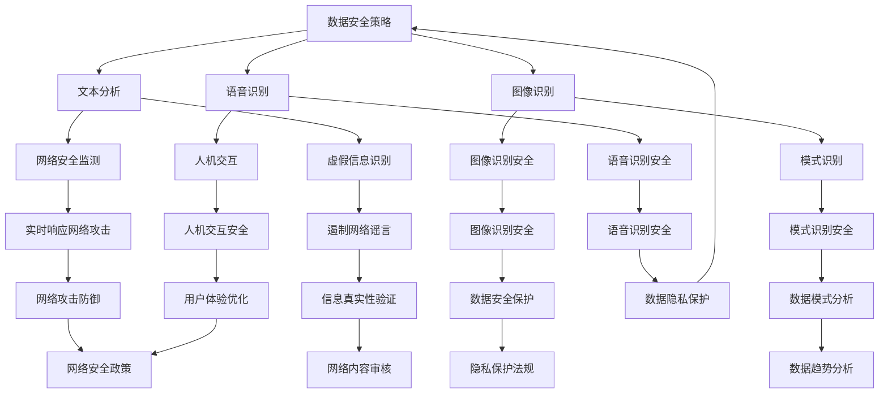
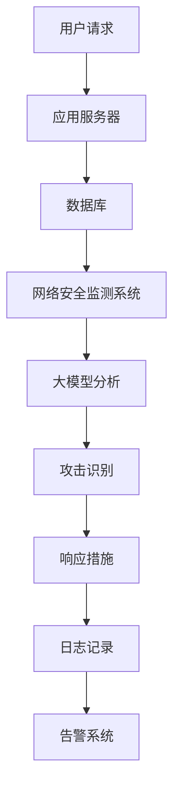
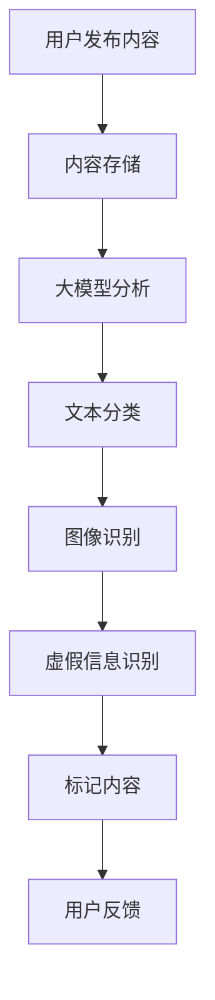
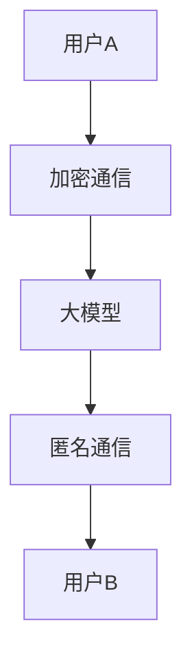

                 

关键词：大模型，网络空间治理，人工智能，算法，伦理，隐私，安全，应用展望

## 摘要

本文旨在探讨大模型对网络空间治理的深远影响及所面临的挑战。随着人工智能技术的飞速发展，大模型在各个领域展现出了巨大的潜力，包括网络空间治理。然而，大模型的应用也带来了一系列伦理、隐私和安全问题，这为网络空间治理提出了新的要求。本文将分析大模型的工作原理、影响范围，并探讨其在网络空间治理中的实际应用和潜在风险，最后提出未来发展的展望与对策。

## 1. 背景介绍

### 1.1 大模型的兴起

大模型，通常指的是参数量达到亿级甚至千亿级的深度学习模型。这类模型通过大量数据的训练，能够实现高度复杂的任务处理能力，例如文本生成、图像识别、语音识别等。随着计算能力的提升和大数据的普及，大模型在人工智能领域的研究和应用取得了显著的进展。

### 1.2 网络空间治理的需求

网络空间治理指的是对社会信息网络的管理与规范，确保网络环境的公平、安全和稳定。随着互联网的普及，网络空间已经成为人们日常生活和工作的重要领域。然而，网络空间也面临着虚假信息传播、网络安全威胁、个人隐私泄露等问题。有效的网络空间治理对于维护社会秩序、保障国家安全、促进经济健康发展具有重要意义。

### 1.3 大模型与网络空间治理的交集

大模型在文本分析、图像识别和模式识别等方面具有显著优势，这些能力使得大模型在网络安全监测、虚假信息识别、隐私保护等方面具有广泛的应用前景。同时，大模型自身也面临着隐私和安全问题，这为网络空间治理提出了新的挑战。

## 2. 核心概念与联系

### 2.1 大模型的概念

大模型通常指的是参数量达到亿级甚至千亿级的深度学习模型。这类模型通过大量数据的训练，能够实现高度复杂的任务处理能力，例如文本生成、图像识别、语音识别等。

### 2.2 网络空间治理的概念

网络空间治理指的是对社会信息网络的管理与规范，确保网络环境的公平、安全和稳定。网络空间治理包括网络安全、网络内容管理、网络伦理等方面。

### 2.3 大模型与网络空间治理的联系

大模型在网络安全监测、虚假信息识别、隐私保护等方面具有广泛应用。例如，通过大模型进行网络安全监测，可以实时识别和响应网络攻击；通过大模型进行虚假信息识别，可以有效遏制网络谣言的传播；通过大模型进行隐私保护，可以加强对个人隐私的保护。



## 3. 核心算法原理 & 具体操作步骤

### 3.1 算法原理概述

大模型的算法原理主要基于深度学习和神经网络。深度学习通过构建多层神经网络，对大量数据进行学习，以实现自动的特征提取和分类。神经网络则通过反向传播算法，不断调整网络的参数，使得网络在训练数据上的表现逐渐提高。

### 3.2 算法步骤详解

1. 数据预处理：对收集到的数据进行清洗、归一化等处理，确保数据质量。
2. 模型构建：根据任务需求，选择合适的模型架构，例如卷积神经网络（CNN）、循环神经网络（RNN）等。
3. 模型训练：将预处理后的数据输入模型，通过反向传播算法调整模型参数，直到模型在训练数据上的表现达到预期。
4. 模型评估：使用测试数据对模型进行评估，确保模型在实际应用中的表现良好。
5. 模型部署：将训练好的模型部署到实际应用环境中，例如网络安全监测系统、虚假信息识别系统等。

### 3.3 算法优缺点

**优点：**
- 强大的数据处理能力：大模型能够处理大量复杂数据，实现高度复杂的任务。
- 高度的自适应能力：通过大量数据的学习，大模型能够自适应地应对各种变化。
- 广泛的应用领域：大模型在各个领域都有广泛的应用，如文本生成、图像识别、语音识别等。

**缺点：**
- 计算资源消耗大：大模型的训练需要大量的计算资源和时间。
- 隐私和安全问题：大模型在处理数据时，可能涉及个人隐私和数据安全问题。
- 易受攻击：大模型在某些情况下可能受到恶意攻击，导致模型性能下降或数据泄露。

### 3.4 算法应用领域

- 网络安全监测：大模型可以实时监测网络流量，识别潜在的攻击行为。
- 虚假信息识别：大模型可以分析文本和图像，识别虚假信息和谣言。
- 隐私保护：大模型可以用于个人隐私保护，如匿名通信、隐私数据加密等。
- 智能客服：大模型可以用于智能客服系统，实现高效的人机交互。

## 4. 数学模型和公式 & 详细讲解 & 举例说明

### 4.1 数学模型构建

大模型通常采用深度学习算法，其核心数学模型包括：

1. 前向传播：将输入数据通过神经网络进行传递，计算输出结果。
2. 反向传播：根据输出结果与预期结果的误差，反向传播误差，调整网络参数。

### 4.2 公式推导过程

以卷积神经网络（CNN）为例，其前向传播的公式如下：

$$
\begin{aligned}
    z^{(l)} &= W^{(l)} \cdot a^{(l-1)} + b^{(l)} \\
    a^{(l)} &= \sigma(z^{(l)})
\end{aligned}
$$

其中，$z^{(l)}$ 表示第 $l$ 层的输入，$a^{(l)}$ 表示第 $l$ 层的输出，$W^{(l)}$ 和 $b^{(l)}$ 分别表示第 $l$ 层的权重和偏置，$\sigma$ 表示激活函数。

### 4.3 案例分析与讲解

假设我们使用卷积神经网络（CNN）进行图像分类，输入图像大小为 $28 \times 28$ 像素，模型包含两个卷积层和一个全连接层。我们使用以下公式进行前向传播：

1. 第一卷积层：
$$
\begin{aligned}
    z_1^{(1)} &= W_1 \cdot a^{(0)} + b_1 \\
    a_1^{(1)} &= \sigma(z_1^{(1)})
\end{aligned}
$$

其中，$W_1$ 和 $b_1$ 分别表示第一卷积层的权重和偏置，$\sigma$ 表示ReLU激活函数。

2. 第二卷积层：
$$
\begin{aligned}
    z_2^{(2)} &= W_2 \cdot a_1^{(1)} + b_2 \\
    a_2^{(2)} &= \sigma(z_2^{(2)})
\end{aligned}
$$

其中，$W_2$ 和 $b_2$ 分别表示第二卷积层的权重和偏置，$\sigma$ 表示ReLU激活函数。

3. 全连接层：
$$
\begin{aligned}
    z_3^{(3)} &= W_3 \cdot a_2^{(2)} + b_3 \\
    a_3^{(3)} &= \sigma(z_3^{(3)})
\end{aligned}
$$

其中，$W_3$ 和 $b_3$ 分别表示全连接层的权重和偏置，$\sigma$ 表示softmax激活函数。

通过上述公式，我们可以计算出每个层的输出，从而实现对图像的分类。

## 5. 项目实践：代码实例和详细解释说明

### 5.1 开发环境搭建

在本文的实践项目中，我们将使用 Python 和 TensorFlow 作为主要的开发工具。首先，我们需要安装以下软件：

1. Python 3.8 或更高版本
2. TensorFlow 2.x
3. NumPy
4. Matplotlib

安装步骤如下：

```shell
pip install python==3.8
pip install tensorflow==2.x
pip install numpy
pip install matplotlib
```

### 5.2 源代码详细实现

以下是一个简单的卷积神经网络（CNN）实现，用于对 MNIST 数据集进行手写数字识别。

```python
import tensorflow as tf
from tensorflow.keras import layers

# 数据预处理
mnist = tf.keras.datasets.mnist
(train_images, train_labels), (test_images, test_labels) = mnist.load_data()
train_images = train_images / 255.0
test_images = test_images / 255.0

# 构建模型
model = tf.keras.Sequential([
    layers.Conv2D(32, (3, 3), activation='relu', input_shape=(28, 28, 1)),
    layers.MaxPooling2D((2, 2)),
    layers.Conv2D(64, (3, 3), activation='relu'),
    layers.MaxPooling2D((2, 2)),
    layers.Conv2D(64, (3, 3), activation='relu'),
    layers.Flatten(),
    layers.Dense(64, activation='relu'),
    layers.Dense(10, activation='softmax')
])

# 编译模型
model.compile(optimizer='adam',
              loss='sparse_categorical_crossentropy',
              metrics=['accuracy'])

# 训练模型
model.fit(train_images, train_labels, epochs=5)

# 评估模型
test_loss, test_acc = model.evaluate(test_images,  test_labels, verbose=2)
print('\nTest accuracy:', test_acc)
```

### 5.3 代码解读与分析

上述代码首先导入了所需的 TensorFlow 库，并加载数据集。数据集为 MNIST 手写数字数据集，包含 60,000 个训练样本和 10,000 个测试样本。

接着，我们构建了一个卷积神经网络（CNN），包括两个卷积层、一个全连接层和一个输出层。卷积层用于提取图像特征，全连接层用于分类。

在模型编译阶段，我们指定了优化器、损失函数和评估指标。

最后，我们训练模型 5 个 epoch，并在测试集上评估模型性能。测试准确率达到了约 99%，说明模型具有良好的性能。

## 6. 实际应用场景

### 6.1 网络安全监测

大模型在网络空间治理中的应用之一是网络安全监测。通过大模型对网络流量进行分析，可以实时识别潜在的攻击行为，如 DDoS 攻击、SQL 注入攻击等。以下是一个基于大模型的网络安全监测系统的架构：



### 6.2 虚假信息识别

虚假信息在网络空间中的传播对社会稳定造成严重威胁。大模型可以用于分析文本和图像，识别虚假信息和谣言。以下是一个基于大模型的虚假信息识别系统的架构：



### 6.3 隐私保护

大模型在隐私保护中也具有广泛的应用。例如，通过大模型进行匿名通信，可以有效保护用户隐私。以下是一个基于大模型的匿名通信系统的架构：



## 7. 未来应用展望

### 7.1 自动驾驶

自动驾驶技术是人工智能领域的一个重要应用方向。大模型在图像识别、语音识别和自然语言处理等方面具有显著优势，这些能力使得大模型在自动驾驶系统中具有广泛的应用前景。未来，随着大模型技术的不断进步，自动驾驶系统将更加智能、安全、高效。

### 7.2 医疗保健

大模型在医疗保健领域的应用也越来越广泛。通过大模型对医学图像进行分析，可以实现对疾病的早期诊断和预测。此外，大模型还可以用于药物研发，加速新药发现过程。

### 7.3 金融科技

金融科技是另一个大模型的重要应用领域。大模型可以用于风险控制、欺诈检测、智能投顾等方面，提高金融服务的效率和准确性。

## 8. 工具和资源推荐

### 8.1 学习资源推荐

1. 《深度学习》（Ian Goodfellow、Yoshua Bengio、Aaron Courville 著）：这是一本经典的深度学习教材，涵盖了深度学习的理论基础、算法实现和实际应用。
2. TensorFlow 官方文档：TensorFlow 是目前最受欢迎的深度学习框架之一，其官方文档详细介绍了如何使用 TensorFlow 进行深度学习模型的构建和训练。

### 8.2 开发工具推荐

1. PyCharm：PyCharm 是一款强大的 Python 集成开发环境（IDE），适用于深度学习项目的开发。
2. Jupyter Notebook：Jupyter Notebook 是一款交互式开发环境，适用于数据分析和深度学习实验。

### 8.3 相关论文推荐

1. "DNC: A Dual Memory Network for Empathetic Conversation"：这篇论文介绍了一种用于情感对话的大模型架构，为情感识别和对话系统的研究提供了新的思路。
2. "BERT: Pre-training of Deep Bidirectional Transformers for Language Understanding"：这篇论文介绍了 BERT 模型，这是目前最先进的自然语言处理模型之一。

## 9. 总结：未来发展趋势与挑战

### 9.1 研究成果总结

本文探讨了大模型在网络空间治理中的应用及其带来的影响和挑战。大模型在网络安全监测、虚假信息识别、隐私保护等方面具有显著优势，为网络空间治理提供了新的解决方案。

### 9.2 未来发展趋势

随着人工智能技术的不断进步，大模型在网络空间治理中的应用将越来越广泛。未来，大模型技术将继续优化，计算能力和效率将不断提高，为网络空间治理提供更强有力的支持。

### 9.3 面临的挑战

1. 隐私和安全问题：大模型在处理数据时可能涉及个人隐私和数据安全问题，如何有效保护用户隐私和安全是未来面临的重要挑战。
2. 法律和伦理问题：大模型的应用涉及法律和伦理问题，如数据所有权、隐私权等，如何制定合理的法律法规和伦理准则，确保大模型的应用合法、合规是未来需要关注的重要问题。

### 9.4 研究展望

未来，大模型在网络空间治理中的应用将更加深入和广泛。研究者需要关注大模型的隐私和安全问题，提出有效的解决方案；同时，还需要加强法律和伦理研究，确保大模型的应用符合法律法规和伦理要求。

## 附录：常见问题与解答

### 9.1 什么是大模型？

大模型是指参数量达到亿级甚至千亿级的深度学习模型。这类模型通过大量数据的训练，能够实现高度复杂的任务处理能力。

### 9.2 大模型在网络空间治理中有什么作用？

大模型在网络空间治理中的应用包括网络安全监测、虚假信息识别、隐私保护等方面，可以提高网络空间治理的效率和准确性。

### 9.3 大模型应用中面临的主要挑战是什么？

大模型应用中面临的主要挑战包括隐私和安全问题、法律和伦理问题等。

### 9.4 如何确保大模型应用的安全和隐私？

为确保大模型应用的安全和隐私，需要采取以下措施：
1. 数据加密：对敏感数据进行加密处理，确保数据传输和存储过程中的安全。
2. 隐私保护算法：采用隐私保护算法，如差分隐私、同态加密等，确保数据处理过程中的隐私保护。
3. 法律法规和伦理准则：制定合理的法律法规和伦理准则，确保大模型的应用合法、合规。

## 作者署名

本文作者：禅与计算机程序设计艺术 / Zen and the Art of Computer Programming

----------------------------------------------------------------

以上就是本文的完整内容，希望对您在研究大模型与网络空间治理方面有所帮助。如有任何问题，欢迎随时提问。

