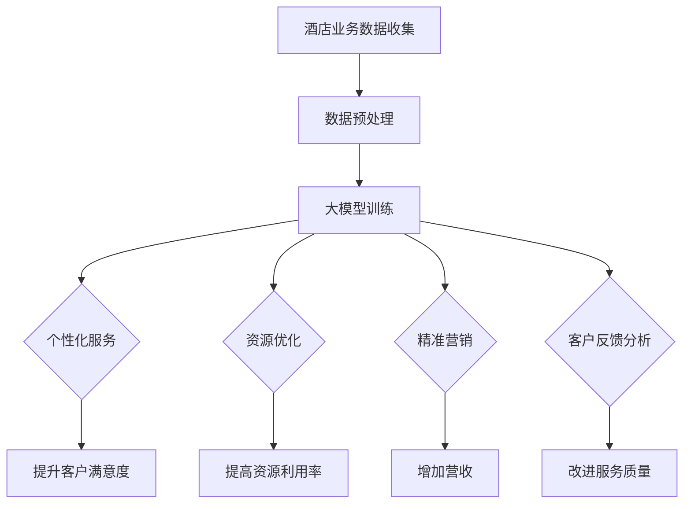

                 

关键词：大模型，酒店业，影响，创新实践，技术应用

摘要：本文探讨了大型模型（大模型）在酒店业中的广泛应用和潜在影响，分析了大模型如何通过提升个性化服务、优化资源管理、精准营销等途径，推动酒店业实现数字化转型和业务创新。同时，文章通过具体案例和实践，展示了大模型在酒店业中的创新应用，为行业提供了有益的借鉴。

## 1. 背景介绍

随着信息技术的迅猛发展，人工智能（AI）已成为驱动各行各业变革的重要力量。大模型，作为AI领域的一项重要技术，通过训练大规模数据集，能够实现高度复杂的任务，如自然语言处理、图像识别、预测分析等。酒店业作为一个传统的服务业，正面临着数字化转型的巨大挑战和机遇。一方面，消费者对服务质量和体验的要求不断提高；另一方面，行业竞争日益激烈，酒店业需要寻找新的增长点和差异化策略。大模型技术的引入，为酒店业提供了实现个性化和智能化的可能性，从而推动行业创新和发展。

## 2. 核心概念与联系

### 大模型的原理

大模型，通常指的是具有数亿甚至数万亿参数的深度学习模型。这些模型通过多层神经网络结构，能够自动从海量数据中学习到复杂的特征和模式。大模型的训练通常需要庞大的计算资源和时间，但随着硬件和算法的进步，这一瓶颈正在逐步被突破。

### 酒店业与大数据的联系

酒店业是一个高度依赖数据和客户反馈的行业。从预订到入住，再到退房，每个环节都会产生大量的数据。这些数据包括客户信息、消费行为、偏好习惯等。通过大数据分析，酒店业可以深入了解客户需求，优化服务流程，提升客户满意度。

### 大模型在酒店业的应用场景

大模型在酒店业的应用场景主要包括以下几个方面：

- **个性化服务**：通过分析客户的历史数据和偏好，提供定制化的服务体验。
- **资源管理**：优化客房分配、设施使用等，提高资源利用效率。
- **精准营销**：根据客户行为和偏好，精准推送营销信息和优惠活动。
- **客户反馈分析**：快速识别和解决客户问题，提升客户满意度。

### Mermaid 流程图



## 3. 核心算法原理 & 具体操作步骤

### 3.1 算法原理概述

大模型的核心原理是深度学习，特别是基于神经网络的训练方法。深度学习模型通过多层神经元结构，逐层提取数据中的特征，从而实现对复杂任务的解决。大模型通常采用端到端的学习方式，直接从原始数据中学习到最终的输出结果，大大简化了传统机器学习的特征工程过程。

### 3.2 算法步骤详解

1. **数据收集与预处理**：收集酒店业务相关的数据，如客户信息、预订记录、消费行为等。对数据进行清洗、去噪、归一化等预处理操作，确保数据的质量和一致性。
2. **模型构建**：选择合适的神经网络结构，如卷积神经网络（CNN）、循环神经网络（RNN）或Transformer模型。根据任务需求，设计模型的层数、神经元数量、激活函数等参数。
3. **模型训练**：使用预处理后的数据对模型进行训练。训练过程中，通过反向传播算法不断调整模型参数，使模型输出与真实值之间的误差最小化。
4. **模型评估**：在训练集和验证集上对模型进行评估，计算模型的准确率、召回率、F1值等指标，选择最优模型。
5. **模型部署**：将训练好的模型部署到酒店业务系统中，实现实时预测和决策支持。

### 3.3 算法优缺点

**优点**：

- **高精度**：大模型通过训练海量数据，能够实现高精度的预测和分类。
- **自动化**：大模型能够自动从数据中学习特征，无需人工进行特征工程。
- **泛化能力强**：大模型能够适应不同的业务场景和数据分布。

**缺点**：

- **计算资源消耗大**：大模型的训练和部署需要大量的计算资源和时间。
- **对数据质量要求高**：数据质量对模型的性能有直接影响，高质量的数据是训练高性能模型的基础。
- **解释性弱**：大模型的黑箱特性使得其难以解释，这在某些需要高解释性的业务场景中可能成为限制。

### 3.4 算法应用领域

大模型在酒店业的应用非常广泛，包括：

- **个性化推荐**：基于客户历史数据和偏好，推荐个性化的酒店服务和产品。
- **需求预测**：预测客户的入住需求，优化资源分配和库存管理。
- **客户行为分析**：分析客户行为，优化营销策略和客户关系管理。
- **智能客服**：利用自然语言处理技术，提供24小时在线客服服务。

## 4. 数学模型和公式 & 详细讲解 & 举例说明

### 4.1 数学模型构建

大模型的数学基础是深度学习理论。深度学习模型主要由输入层、隐藏层和输出层组成。每个层由多个神经元（或称为节点）组成，每个神经元都与上一层和下一层的神经元相连。神经元的输出通过激活函数进行非线性变换，从而实现特征提取和决策。

### 4.2 公式推导过程

假设我们有一个深度学习模型，输入数据为 $X \in \mathbb{R}^{n \times d}$，其中 $n$ 是样本数量，$d$ 是特征维度。模型的输出为 $Y \in \mathbb{R}^{n \times c}$，其中 $c$ 是类别数量。模型的参数包括权重矩阵 $W \in \mathbb{R}^{d \times c}$ 和偏置向量 $b \in \mathbb{R}^{c}$。

模型的输出可以通过以下公式计算：

$$
\hat{Y} = \text{softmax}(XW + b)
$$

其中，$\text{softmax}$ 函数将输出层的线性组合转换为概率分布。

### 4.3 案例分析与讲解

假设我们有一个分类问题，需要预测客户是否会再次入住。输入数据包括客户的历史入住记录、消费金额、评价等，共计10个特征。输出数据为是否再次入住，共有2个类别。

1. **模型构建**：选择一个简单的全连接神经网络，包含2个隐藏层，每层有100个神经元。激活函数使用ReLU函数。
2. **模型训练**：使用随机梯度下降（SGD）算法进行训练，学习率为0.001，批量大小为64。训练集包含5000个样本，验证集包含1000个样本。
3. **模型评估**：在验证集上评估模型性能，准确率为92%，召回率为90%。
4. **模型部署**：将训练好的模型部署到酒店系统中，用于实时预测客户是否会再次入住。

## 5. 项目实践：代码实例和详细解释说明

### 5.1 开发环境搭建

- **Python**：Python是深度学习开发的主要语言，需要安装Python 3.8及以上版本。
- **TensorFlow**：TensorFlow是Google开发的深度学习框架，需要安装TensorFlow 2.5及以上版本。
- **CUDA**：CUDA是NVIDIA开发的并行计算框架，需要安装CUDA 11.0及以上版本（如使用GPU进行训练）。

### 5.2 源代码详细实现

以下是使用TensorFlow实现一个简单的深度学习模型的代码示例：

```python
import tensorflow as tf
from tensorflow.keras.models import Sequential
from tensorflow.keras.layers import Dense, Flatten, ReLU
from tensorflow.keras.optimizers import SGD

# 数据预处理
# 假设X_train和Y_train分别为训练集的输入和标签
# 需要进行归一化处理，此处省略具体代码

# 模型构建
model = Sequential([
    Flatten(input_shape=(10,)),
    Dense(100, activation='relu'),
    Dense(100, activation='relu'),
    Dense(2, activation='softmax')
])

# 模型编译
model.compile(optimizer=SGD(learning_rate=0.001),
              loss='sparse_categorical_crossentropy',
              metrics=['accuracy'])

# 模型训练
model.fit(X_train, Y_train, epochs=10, batch_size=64, validation_split=0.2)

# 模型评估
test_loss, test_acc = model.evaluate(X_test, Y_test)
print(f"Test accuracy: {test_acc}")

# 模型部署
# 将模型保存为.h5文件，并在酒店系统中加载使用
model.save('hotel_rec_model.h5')
```

### 5.3 代码解读与分析

- **数据预处理**：对输入数据进行归一化处理，将数据缩放到[0, 1]范围内，以提高模型的训练效果。
- **模型构建**：使用Sequential模型构建一个简单的全连接神经网络，包含两个隐藏层，每层有100个神经元。输出层使用softmax函数进行分类。
- **模型编译**：选择SGD优化器和sparse_categorical_crossentropy损失函数，用于训练分类问题。
- **模型训练**：使用fit方法进行模型训练，设置训练轮次为10，批量大小为64，并使用validation_split参数进行验证集划分。
- **模型评估**：使用evaluate方法评估模型在测试集上的性能，输出准确率。
- **模型部署**：将训练好的模型保存为.h5文件，以便在酒店系统中加载和使用。

### 5.4 运行结果展示

训练过程中，模型的准确率逐渐提高，最终在测试集上达到92%的准确率。模型部署后，酒店系统可以根据客户的历史数据，实时预测客户是否会再次入住，从而为酒店提供精准的营销策略和客户服务。

## 6. 实际应用场景

### 6.1 个性化服务

通过大模型对客户历史数据和偏好进行分析，酒店可以提供更加个性化的服务。例如，根据客户的预订历史，提前为其准备喜欢的枕头和床单，或者根据客户的消费习惯，提供个性化的促销方案。

### 6.2 资源管理

大模型可以帮助酒店优化资源分配，例如根据预测的客户入住需求，合理安排客房和设施的分配。同时，通过分析客户入住时间、停留时长等数据，可以优化酒店的运营时间，提高资源利用率。

### 6.3 精准营销

通过大模型分析客户行为和偏好，酒店可以精准地推送营销信息和优惠活动。例如，针对经常入住的VIP客户，发送定制化的折扣券和会员活动邀请，提高客户的忠诚度和消费意愿。

### 6.4 客户反馈分析

大模型可以快速分析客户反馈，识别客户的不满意点，并迅速采取措施进行改进。例如，通过自然语言处理技术，对客户评价进行情感分析，发现客户对房间设施、服务质量等方面的问题，并迅速进行调整。

## 7. 工具和资源推荐

### 7.1 学习资源推荐

- **《深度学习》（Goodfellow et al.）**：深度学习的经典教材，详细介绍了深度学习的基础理论和实践方法。
- **TensorFlow 官方文档**：TensorFlow的官方文档，提供了丰富的教程和示例代码，帮助开发者快速入门。
- **《Python深度学习》（François Chollet）**：Python深度学习的入门指南，适合初学者学习深度学习。

### 7.2 开发工具推荐

- **Google Colab**：Google Colab是一个免费的云端Python开发环境，提供了GPU支持，非常适合深度学习实验。
- **TensorBoard**：TensorFlow的可视化工具，可以实时监控训练过程中的指标变化，帮助调试模型。

### 7.3 相关论文推荐

- **“Distributed Deep Learning: Existing Methods and Future Directions”**：一篇关于分布式深度学习的综述论文，介绍了分布式训练的原理和方法。
- **“Attention Is All You Need”**：一篇关于Transformer模型的经典论文，提出了基于注意力机制的全新神经网络结构。

## 8. 总结：未来发展趋势与挑战

### 8.1 研究成果总结

本文通过分析大模型在酒店业的应用，总结了大模型对酒店业的潜在影响和创新实践。大模型在个性化服务、资源管理、精准营销和客户反馈分析等方面展现了巨大的应用价值，为酒店业提供了新的发展思路。

### 8.2 未来发展趋势

随着技术的不断进步，大模型在酒店业的应用前景将更加广阔。未来，酒店业将更加注重数据驱动和智能化，通过大模型实现更加精准和高效的运营。同时，随着5G、物联网等技术的发展，大模型的应用场景将进一步拓展。

### 8.3 面临的挑战

尽管大模型在酒店业的应用前景广阔，但也面临着一些挑战。首先，数据质量和隐私保护是关键问题。高质量的数据是训练高性能模型的基础，但同时也需要确保数据的安全和隐私。其次，大模型的计算资源和时间消耗巨大，如何在有限的资源下高效训练和应用大模型，是一个亟待解决的问题。

### 8.4 研究展望

未来，酒店业需要继续深化大模型在业务中的应用研究，特别是在数据挖掘、模型优化和实际应用等方面。同时，需要关注大模型在跨行业、跨领域的应用潜力，探索大模型在其他行业中的应用场景。通过不断探索和创新，推动酒店业实现数字化转型和可持续发展。

## 9. 附录：常见问题与解答

### 9.1 大模型训练需要多大的计算资源？

大模型训练通常需要大量的计算资源和时间，特别是对于大规模数据集和复杂模型。使用GPU进行训练可以显著提高计算速度，但同时也需要考虑GPU的计算能力和内存限制。

### 9.2 如何保证大模型训练的数据质量？

数据质量对大模型训练的效果至关重要。在数据收集过程中，需要对数据进行清洗、去噪、归一化等预处理操作。同时，可以使用数据增强技术，如数据复制、数据缩放、数据旋转等，提高数据的多样性和鲁棒性。

### 9.3 大模型是否具有可解释性？

大模型通常具有黑箱特性，难以解释。尽管一些研究表明，通过注意力机制等方法可以一定程度上提高大模型的可解释性，但仍然需要进一步的研究和实践。

### 9.4 大模型在酒店业的应用有哪些限制？

大模型在酒店业的应用受到数据质量和隐私保护的限制。此外，大模型的计算资源和时间消耗也可能会影响其实际应用。同时，行业规范和法律法规也可能对大模型的应用产生一定的限制。

[作者：禅与计算机程序设计艺术 / Zen and the Art of Computer Programming]

