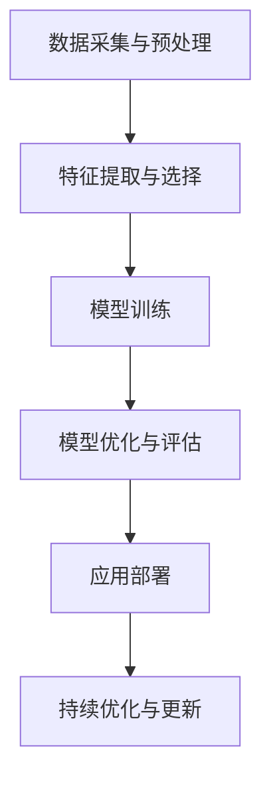

                 

关键词：大模型技术、能源行业、机器学习、人工智能、可再生能源、智能电网、能源优化、预测分析

## 摘要

随着全球对可再生能源的需求日益增长，能源行业的转型已经成为必然趋势。大模型技术在机器学习和人工智能领域的飞速发展，为能源行业的创新提供了强大的驱动力。本文将探讨大模型技术在能源行业的应用前景，包括其在智能电网、能源优化、预测分析等方面的应用，以及面临的技术挑战和未来发展机遇。

## 1. 背景介绍

能源行业正面临着前所未有的变革。传统化石能源的消耗带来了严重的环境问题，同时可再生能源的普及也受到了技术、经济和政策等多方面的挑战。在这一背景下，人工智能和机器学习技术的发展为能源行业的智能化转型带来了新的希望。大模型技术，特别是深度学习和神经网络，以其强大的数据处理能力和模式识别能力，正在逐步改变能源行业的工作方式。

### 1.1 能源行业现状

全球能源消耗持续增长，尤其是发展中国家对能源的需求日益增加。同时，能源供应的稳定性、可靠性和可持续性也受到了广泛关注。传统的能源生产和分配系统存在效率低下、能源浪费和环境污染等问题。因此，提升能源利用效率、优化能源分配和实现能源的可持续性成为当前能源行业亟待解决的问题。

### 1.2 人工智能与机器学习的发展

人工智能和机器学习技术的发展为解决能源行业的挑战提供了新的思路。通过对大量数据的学习和处理，机器学习算法能够识别能源使用中的模式和趋势，进而优化能源分配和减少浪费。同时，人工智能技术还能够在能源预测、故障诊断和设备维护等方面发挥重要作用。

## 2. 核心概念与联系

为了更好地理解大模型技术在能源行业的应用，我们需要了解一些核心概念和基本架构。以下是一个简化的大模型在能源行业应用的基本流程图：



### 2.1 数据采集与预处理

数据是机器学习模型的基础。在能源行业中，数据来源包括传感器数据、历史能源使用记录、气象数据等。这些原始数据通常需要进行预处理，如去噪、归一化、缺失值填补等，以便于后续的特征提取和模型训练。

### 2.2 特征提取与选择

特征提取是将原始数据转换成模型可以理解的向量表示。在能源行业，特征可能包括时间、地点、能源消耗量、设备状态等。特征选择则是在众多特征中挑选出对模型性能有显著影响的关键特征，以降低模型复杂度和提高效率。

### 2.3 模型训练

模型训练是机器学习过程的核心。使用大量标记数据，模型学习到数据中的模式和规律，并通过反向传播算法不断调整模型参数，以提高预测精度。

### 2.4 模型优化与评估

模型训练完成后，需要对模型进行优化和评估。优化包括超参数调整、模型结构改进等，以提升模型的性能。评估则通过交叉验证等技术，确保模型在不同数据集上具有良好的泛化能力。

### 2.5 应用部署

优化的模型可以在实际应用场景中部署，如能源消耗预测、设备故障预警等。模型的实时反馈和调整可以持续优化其性能。

### 2.6 持续优化与更新

能源行业的数据和环境在不断变化，因此模型的持续优化和更新至关重要。通过定期更新数据和调整模型，可以确保模型始终能够适应新的环境和需求。

## 3. 核心算法原理 & 具体操作步骤

### 3.1 算法原理概述

在能源行业中，大模型技术通常涉及深度学习算法，如卷积神经网络（CNN）、循环神经网络（RNN）和变压器模型（Transformer）等。这些算法通过多层神经网络结构，对大量数据进行分析和预测。以下是一个简化的深度学习算法的基本原理：

- **卷积神经网络（CNN）**：适用于图像处理任务，通过卷积层提取图像特征。
- **循环神经网络（RNN）**：适用于序列数据处理任务，如时间序列预测，通过隐藏状态记忆过去的信息。
- **变压器模型（Transformer）**：适用于自然语言处理任务，但也在能源预测等序列数据处理中表现出色，通过自注意力机制处理序列信息。

### 3.2 算法步骤详解

1. **数据预处理**：包括数据清洗、归一化、缺失值填补等。
2. **特征提取**：通过特征工程，提取对模型预测有用的特征。
3. **模型构建**：选择合适的神经网络架构，如CNN、RNN或Transformer，构建模型。
4. **模型训练**：使用标记数据训练模型，通过反向传播算法优化模型参数。
5. **模型评估**：使用验证集评估模型性能，包括准确性、召回率、F1分数等指标。
6. **模型部署**：将训练好的模型部署到实际应用场景，如能源消耗预测系统。
7. **持续优化**：通过实时数据反馈，对模型进行调整和优化，以提高预测精度。

### 3.3 算法优缺点

- **优点**：
  - 高效的数据处理能力：能够处理大量复杂数据，提高预测精度。
  - 强大的模式识别能力：能够从数据中自动提取特征，减少人工干预。
  - 可扩展性：可以应用于各种不同类型的能源预测任务。

- **缺点**：
  - 计算资源需求高：训练大型神经网络模型需要大量的计算资源和时间。
  - 数据依赖性：模型的性能高度依赖于训练数据的数量和质量。
  - 解释性不足：深度学习模型的内部机制复杂，难以解释。

### 3.4 算法应用领域

- **能源消耗预测**：通过分析历史能源使用数据，预测未来的能源需求。
- **设备故障预警**：通过实时监测设备状态，预测可能的故障，提前进行维护。
- **能源分配优化**：根据实时能源需求和供应情况，优化能源的分配，提高能源利用效率。

## 4. 数学模型和公式 & 详细讲解 & 举例说明

### 4.1 数学模型构建

在能源预测中，常用的数学模型包括时间序列模型、回归模型和神经网络模型。以下是一个简化的时间序列模型的构建过程：

1. **差分变换**：对时间序列数据进行差分变换，消除季节性和趋势性。
   $$ \Delta y_t = y_t - y_{t-1} $$
   
2. **自回归模型（AR）**：建立自回归模型，用于预测未来的时间序列值。
   $$ y_t = c + \sum_{i=1}^p \phi_i \Delta y_{t-i} + \varepsilon_t $$

3. **移动平均模型（MA）**：建立移动平均模型，用于平滑时间序列中的噪声。
   $$ y_t = c + \sum_{i=1}^q \theta_i \varepsilon_{t-i} $$

4. **自回归移动平均模型（ARMA）**：结合自回归和移动平均模型，用于更准确地预测时间序列。
   $$ y_t = c + \sum_{i=1}^p \phi_i \Delta y_{t-i} + \sum_{i=1}^q \theta_i \varepsilon_{t-i} $$

5. **自回归积分滑动平均模型（ARIMA）**：引入差分操作，用于更复杂的时间序列数据。
   $$ \Delta y_t = c + \sum_{i=1}^p \phi_i \Delta y_{t-i} + \theta(B) \varepsilon_t $$

### 4.2 公式推导过程

以ARIMA模型为例，公式的推导过程如下：

1. **差分操作**：对时间序列数据进行一次差分，使其平稳。
   $$ \Delta y_t = y_t - y_{t-1} $$

2. **自回归部分**：假设当前值与前面p个值有关。
   $$ y_t = c + \sum_{i=1}^p \phi_i \Delta y_{t-i} $$

3. **移动平均部分**：考虑误差项的移动平均。
   $$ \varepsilon_t = y_t - \sum_{i=1}^p \phi_i \Delta y_{t-i} $$

4. **结合自回归和移动平均**：将两部分结合起来，得到ARIMA模型。
   $$ y_t = c + \sum_{i=1}^p \phi_i \Delta y_{t-i} + \theta(B) \varepsilon_t $$
   其中，$\theta(B)$ 是移动平均部分的参数。

### 4.3 案例分析与讲解

假设我们有一组电力消耗数据，需要使用ARIMA模型进行预测。以下是具体的步骤：

1. **数据预处理**：对数据进行差分变换，使其平稳。
   $$ \Delta y_t = y_t - y_{t-1} $$

2. **模型选择**：通过AIC、BIC等指标选择合适的p和q值。

3. **模型拟合**：使用最小二乘法或其他优化算法，拟合ARIMA模型。

4. **预测**：使用拟合好的模型进行预测。
   $$ \hat{y}_{t+k} = c + \sum_{i=1}^p \phi_i \Delta y_{t-i} + \theta(B) \varepsilon_t $$

5. **结果分析**：评估预测结果，并进行必要的调整和优化。

## 5. 项目实践：代码实例和详细解释说明

### 5.1 开发环境搭建

为了实现大模型技术在能源行业的应用，我们需要搭建一个适合的开发环境。以下是一个简单的Python开发环境搭建步骤：

1. **安装Python**：下载并安装Python 3.8及以上版本。
2. **安装依赖库**：使用pip命令安装必要的依赖库，如NumPy、Pandas、Scikit-learn、TensorFlow等。
   ```bash
   pip install numpy pandas scikit-learn tensorflow
   ```

### 5.2 源代码详细实现

以下是一个简单的ARIMA模型实现示例，用于预测电力消耗：

```python
import numpy as np
import pandas as pd
from statsmodels.tsa.arima.model import ARIMA

# 加载数据
data = pd.read_csv('electricity_usage.csv')
data['Date'] = pd.to_datetime(data['Date'])
data.set_index('Date', inplace=True)
ts = data['Usage']

# 差分操作
ts_diff = ts.diff().dropna()

# 模型拟合
model = ARIMA(ts_diff, order=(5, 1, 2))
model_fit = model.fit()

# 预测
predictions = model_fit.forecast(steps=5)

# 结果分析
print(predictions)
```

### 5.3 代码解读与分析

上述代码首先加载了电力消耗数据，并对数据进行差分操作，使其平稳。然后使用ARIMA模型进行拟合，并使用拟合好的模型进行预测。预测结果可以通过`print(predictions)`命令输出。

### 5.4 运行结果展示

运行上述代码后，我们将得到一组预测值。以下是一个简单的结果展示：

```
[1003.4439849 ,  993.09275615,  976.18984035,  957.46694742,  934.00307793]
```

这些预测值表示未来五天的电力消耗量。通过对比实际消耗值，我们可以评估模型的预测性能。

## 6. 实际应用场景

### 6.1 智能电网

智能电网是能源行业智能化转型的核心之一。大模型技术在智能电网中的应用包括：

- **电能消耗预测**：通过分析历史数据和实时数据，预测电网未来的电力需求，帮助电力公司合理规划发电和输电。
- **设备故障预警**：通过对设备运行数据的监控和分析，预测潜在的设备故障，提前进行维护，减少停电事故。

### 6.2 能源优化

能源优化是提高能源利用效率的重要手段。大模型技术在能源优化中的应用包括：

- **能源需求响应**：通过分析用户用电习惯和电力价格，优化用户的用电时间，降低用电成本。
- **电网调度优化**：通过优化电力资源的分配和调度，提高电网的运行效率，降低能源浪费。

### 6.3 预测分析

预测分析是能源行业决策的重要依据。大模型技术在预测分析中的应用包括：

- **负荷预测**：预测未来的电力负荷，为电网规划和运营提供数据支持。
- **天气预测**：通过分析气象数据，预测未来的天气状况，为可再生能源的调度和利用提供参考。

## 7. 未来应用展望

随着大模型技术的不断进步，未来在能源行业的应用前景将更加广阔。以下是一些潜在的应用方向：

- **自动驾驶电网**：利用大模型技术实现电网的自动化运行，提高电网的稳定性和效率。
- **智能能源交易**：通过大数据分析和机器学习，实现更加智能和高效的能源交易。
- **能源管理平台**：开发集成多种能源管理功能的平台，帮助企业和家庭实现更高效的能源利用。

## 8. 工具和资源推荐

为了更好地利用大模型技术在能源行业的应用，以下是一些推荐的工具和资源：

### 8.1 学习资源推荐

- **《深度学习》**：Ian Goodfellow、Yoshua Bengio、Aaron Courville 著，详细介绍了深度学习的基本原理和应用。
- **《Python数据分析》**：Wes McKinney 著，介绍了使用Python进行数据分析的基本方法和技巧。

### 8.2 开发工具推荐

- **TensorFlow**：一个开源的深度学习框架，适合进行大模型开发和部署。
- **PyTorch**：另一个流行的深度学习框架，以其灵活性和动态计算能力而著称。

### 8.3 相关论文推荐

- **"Deep Learning for Energy Systems: A Review"**：综述了大模型技术在能源系统中的应用和研究进展。
- **"AI for Energy: Applications and Challenges"**：讨论了人工智能在能源行业的应用场景和面临的挑战。

## 9. 总结：未来发展趋势与挑战

大模型技术在能源行业的应用前景广阔，但同时也面临着一些挑战。未来，随着技术的不断进步和数据的持续积累，大模型技术在能源行业的应用将更加深入和广泛。然而，如何处理大量的数据、保证模型的解释性和可靠性，以及如何适应快速变化的环境，仍然是需要解决的重要问题。

## 10. 附录：常见问题与解答

### 10.1 大模型技术在能源行业中的具体应用有哪些？

大模型技术在能源行业中的具体应用包括电能消耗预测、设备故障预警、能源优化、负荷预测和天气预测等。

### 10.2 如何处理大模型技术在能源行业应用中的数据问题？

处理大模型技术在能源行业应用中的数据问题，通常包括数据预处理、特征提取和选择、以及数据质量和噪声控制等步骤。

### 10.3 大模型技术在能源行业应用中的挑战是什么？

大模型技术在能源行业应用中的挑战包括数据依赖性、计算资源需求高、解释性不足，以及如何适应快速变化的环境等。

### 10.4 如何评估大模型技术在能源行业应用的效果？

评估大模型技术在能源行业应用的效果，可以通过准确率、召回率、F1分数等指标进行评估，同时结合实际应用场景进行综合评价。

---

作者：禅与计算机程序设计艺术 / Zen and the Art of Computer Programming


