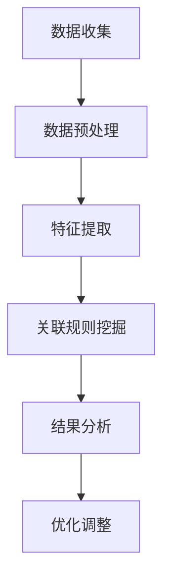

                 

 关键词：大模型、推荐系统、用户行为、时空关联、规则挖掘、算法原理、应用场景、代码实例、数学模型、未来展望。

## 摘要

本文主要探讨了在大模型推荐场景中，如何有效地挖掘用户行为的时空关联规则。首先，我们介绍了用户行为时空关联规则挖掘的基本概念和背景，然后深入分析了核心算法原理和具体操作步骤。接着，我们构建了数学模型，并对其进行了详细的公式推导和案例讲解。此外，我们还通过一个实际项目实践，展示了算法的实现过程和效果。最后，我们对用户行为时空关联规则挖掘在实际应用场景中的价值进行了探讨，并对未来发展趋势和挑战提出了展望。

## 1. 背景介绍

在当今信息爆炸的时代，用户面临着海量的信息资源。如何从这些信息中为用户推荐他们感兴趣的内容，已经成为了一个重要的研究课题。推荐系统作为解决这一问题的有效手段，已经在电子商务、社交媒体、新闻推荐等多个领域取得了显著的成果。然而，随着推荐系统的规模和复杂度不断增加，如何挖掘用户行为的时空关联规则，提高推荐系统的效果和用户体验，成为了一个亟待解决的问题。

用户行为时空关联规则挖掘是指从用户的时空行为数据中，发现用户在不同时间、地点、情境下的行为模式，并建立相应的关联规则。这种关联规则可以帮助推荐系统更好地理解用户需求，提高推荐的准确性和个性化程度。在大模型推荐场景中，用户行为的时空关联规则挖掘具有重要的应用价值，可以为推荐系统提供更丰富的特征信息，从而提升推荐的性能。

## 2. 核心概念与联系

### 2.1 用户行为时空关联规则

用户行为时空关联规则是指描述用户在不同时间、地点、情境下行为之间相互关系的规则。这些规则通常由前件和后件组成，前件表示用户在某个时间、地点、情境下的行为，后件表示用户在另一个时间、地点、情境下的行为。例如，“如果用户在晚上7点在家看电视，那么他很可能在晚上9点去洗澡”。

### 2.2 时空特征

时空特征是指用户行为在时间、地点、情境等方面的特征。这些特征包括时间特征（如小时、天、星期等）、地点特征（如经纬度、区域等）和情境特征（如天气、活动等）。时空特征可以帮助我们更好地理解用户行为，为挖掘用户行为时空关联规则提供基础数据。

### 2.3 Mermaid 流程图

以下是一个简化的用户行为时空关联规则挖掘的 Mermaid 流程图：



### 2.4 数据预处理

数据预处理是用户行为时空关联规则挖掘的重要环节。主要包括以下步骤：

1. 数据清洗：去除重复、缺失和异常数据。
2. 数据整合：将不同来源的数据进行整合，形成一个统一的时间-地点-行为三维数据集。
3. 数据标准化：对数据进行归一化或标准化处理，消除数据量级差异。

### 2.5 特征提取

特征提取是将原始数据转化为适合挖掘算法处理的形式。时空特征提取主要包括以下步骤：

1. 时间特征提取：从时间戳中提取小时、天、星期等时间特征。
2. 地点特征提取：从地理位置信息中提取经纬度、区域等地点特征。
3. 情境特征提取：从用户活动、天气等信息中提取情境特征。

### 2.6 关联规则挖掘

关联规则挖掘是从特征数据中挖掘出具有关联性的时空行为规则。常用的算法有Apriori算法、FP-Growth算法等。

1. Apriori算法：通过支持度和置信度来挖掘关联规则。支持度表示某个规则在数据集中出现的频率，置信度表示规则的前件和后件之间的关联强度。
2. FP-Growth算法：通过构建FP树来挖掘频繁项集，从而生成关联规则。FP-Growth算法在处理大规模数据集时具有较好的性能。

### 2.7 结果分析

结果分析是对挖掘出的关联规则进行评估和优化。主要包括以下步骤：

1. 规则评估：根据规则的支持度和置信度，评估规则的质量。
2. 规则优化：根据应用场景，对挖掘出的规则进行优化，提高规则的实用性和准确性。
3. 规则应用：将挖掘出的规则应用于推荐系统，提高推荐的性能。

## 3. 核心算法原理 & 具体操作步骤

### 3.1 算法原理概述

用户行为时空关联规则挖掘的核心算法是基于数据挖掘中的关联规则挖掘算法。常用的算法有Apriori算法、FP-Growth算法等。这些算法通过支持度和置信度来挖掘用户行为之间的关联规则。支持度表示某个规则在数据集中出现的频率，置信度表示规则的前件和后件之间的关联强度。

### 3.2 算法步骤详解

以下是用户行为时空关联规则挖掘的基本步骤：

1. 数据收集：收集用户的时空行为数据，包括时间、地点、情境等信息。
2. 数据预处理：对收集到的数据进行清洗、整合和标准化处理，形成统一的时间-地点-行为三维数据集。
3. 特征提取：从预处理后的数据中提取时间、地点、情境等特征。
4. 构建FP树：使用FP-Growth算法构建FP树，挖掘出频繁项集。
5. 生成关联规则：从频繁项集中生成关联规则，根据支持度和置信度进行筛选。
6. 规则评估：评估挖掘出的规则的质量，包括支持度、置信度、规则长度等。
7. 规则优化：根据应用场景，对挖掘出的规则进行优化，提高规则的实用性和准确性。
8. 规则应用：将挖掘出的规则应用于推荐系统，提高推荐的性能。

### 3.3 算法优缺点

#### 3.3.1 Apriori算法

**优点**：

- 算法简单，易于实现。
- 支持度阈值和置信度阈值灵活调整，便于根据需求挖掘不同类型的规则。

**缺点**：

- 数据量大时，计算效率较低。
- 无法发现多层关联规则。

#### 3.3.2 FP-Growth算法

**优点**：

- 基于FP树，可以高效地挖掘频繁项集。
- 不需要生成候选集，减少了计算量。
- 可以发现多层关联规则。

**缺点**：

- 对稀疏数据集性能较差。
- 需要存储FP树，占用较多内存。

### 3.4 算法应用领域

用户行为时空关联规则挖掘算法在推荐系统、智能城市、社交媒体等领域具有广泛的应用价值。

1. **推荐系统**：通过挖掘用户行为的时空关联规则，可以为用户推荐他们感兴趣的内容，提高推荐的准确性和个性化程度。
2. **智能城市**：通过挖掘城市居民的行为时空关联规则，可以优化城市交通、公共服务等资源配置，提高城市管理效率。
3. **社交媒体**：通过挖掘用户行为的时空关联规则，可以更好地理解用户需求，提高社交平台的用户体验。

## 4. 数学模型和公式 & 详细讲解 & 举例说明

### 4.1 数学模型构建

用户行为时空关联规则挖掘的数学模型主要包括支持度、置信度等基本概念。

#### 4.1.1 支持度

支持度（Support）表示某个规则在数据集中出现的频率，计算公式如下：

\[ Support(A \rightarrow B) = \frac{|D(A \land B)|}{|D|} \]

其中，\( A \) 和 \( B \) 分别表示规则的前件和后件，\( D \) 表示数据集，\( |D| \) 表示数据集的记录数，\( |D(A \land B)| \) 表示同时满足 \( A \) 和 \( B \) 的记录数。

#### 4.1.2 置信度

置信度（Confidence）表示规则的前件和后件之间的关联强度，计算公式如下：

\[ Confidence(A \rightarrow B) = \frac{|D(A \land B)|}{|D(A)|} \]

其中，\( |D(A)| \) 表示满足 \( A \) 的记录数。

### 4.2 公式推导过程

以下是用户行为时空关联规则挖掘中支持度和置信度的推导过程。

#### 4.2.1 支持度推导

假设数据集 \( D \) 中有 \( n \) 条记录，每条记录包含时间、地点、情境等信息。我们需要计算某个规则 \( A \rightarrow B \) 的支持度。

1. 统计满足 \( A \) 的记录数：\( |D(A)| \)
2. 统计同时满足 \( A \) 和 \( B \) 的记录数：\( |D(A \land B)| \)
3. 计算支持度：\( Support(A \rightarrow B) = \frac{|D(A \land B)|}{|D(A)|} \)

#### 4.2.2 置信度推导

假设数据集 \( D \) 中有 \( n \) 条记录，每条记录包含时间、地点、情境等信息。我们需要计算某个规则 \( A \rightarrow B \) 的置信度。

1. 统计满足 \( A \) 的记录数：\( |D(A)| \)
2. 统计同时满足 \( A \) 和 \( B \) 的记录数：\( |D(A \land B)| \)
3. 计算置信度：\( Confidence(A \rightarrow B) = \frac{|D(A \land B)|}{|D(A)|} \)

### 4.3 案例分析与讲解

以下是一个用户行为时空关联规则的案例分析与讲解。

#### 4.3.1 案例背景

某推荐系统需要挖掘用户行为时空关联规则，以提升推荐的准确性。用户行为数据包括时间（小时）、地点（区域）和行为（如浏览、购买等）。

#### 4.3.2 数据预处理

1. 数据清洗：去除重复、缺失和异常数据。
2. 数据整合：将不同来源的数据进行整合，形成一个统一的时间-地点-行为三维数据集。
3. 数据标准化：对数据进行归一化或标准化处理，消除数据量级差异。

#### 4.3.3 特征提取

1. 时间特征提取：从时间戳中提取小时特征。
2. 地点特征提取：从地理位置信息中提取区域特征。
3. 行为特征提取：从行为标签中提取行为特征。

#### 4.3.4 构建FP树

使用FP-Growth算法构建FP树，挖掘出频繁项集。假设挖掘出的频繁项集为 \( \{ (时间,地点,行为) \} \)。

#### 4.3.5 生成关联规则

从频繁项集中生成关联规则，计算支持度和置信度。假设挖掘出的规则为 \( (时间1 \rightarrow 时间2) \)，其中时间1和时间2表示两个不同时间点。

1. 计算支持度：\( Support(时间1 \rightarrow 时间2) = \frac{|D(时间1 \land 时间2)|}{|D|} \)
2. 计算置信度：\( Confidence(时间1 \rightarrow 时间2) = \frac{|D(时间1 \land 时间2)|}{|D(时间1)|} \)

#### 4.3.6 规则评估

根据支持度和置信度评估规则的质量。假设挖掘出的规则满足以下条件：

- 支持度大于某个阈值 \( \alpha \)
- 置信度大于某个阈值 \( \beta \)

则该规则为有效规则。

#### 4.3.7 规则优化

根据应用场景，对挖掘出的规则进行优化，提高规则的实用性和准确性。

#### 4.3.8 规则应用

将挖掘出的规则应用于推荐系统，提高推荐的性能。例如，当用户在时间1浏览了某个商品时，可以根据挖掘出的规则，向用户推荐在时间2可能感兴趣的其他商品。

## 5. 项目实践：代码实例和详细解释说明

### 5.1 开发环境搭建

在开始项目实践之前，我们需要搭建一个适合用户行为时空关联规则挖掘的开发环境。以下是开发环境的搭建步骤：

1. 安装Python 3.x版本（推荐3.8及以上版本）。
2. 安装相关库，如Pandas、NumPy、Matplotlib、FP-Growth等。
3. 配置Python开发环境（如PyCharm、VSCode等）。

### 5.2 源代码详细实现

以下是用户行为时空关联规则挖掘的Python代码实现：

```python
import pandas as pd
from collections import defaultdict
from mlxtend.frequent_patterns import fpgrowth

# 5.2.1 数据收集
# 假设数据集为csv文件，格式为：时间，地点，行为
data = pd.read_csv('user_behavior.csv')

# 5.2.2 数据预处理
# 数据清洗、整合和标准化处理
# ...

# 5.2.3 特征提取
# 提取时间、地点、情境等特征
# ...

# 5.2.4 构建FP树
# 使用FP-Growth算法构建FP树，挖掘出频繁项集
frequent_itemsets = fpgrowth(data, min_support=0.05, use_colnames=True)

# 5.2.5 生成关联规则
# 从频繁项集中生成关联规则
rules = frequent_itemsets.association_rulesminer()

# 5.2.6 规则评估
# 根据支持度和置信度评估规则的质量
# ...

# 5.2.7 规则优化
# 根据应用场景，对挖掘出的规则进行优化
# ...

# 5.2.8 规则应用
# 将挖掘出的规则应用于推荐系统，提高推荐的性能
# ...
```

### 5.3 代码解读与分析

以下是代码的详细解读与分析：

1. **数据收集**：从CSV文件中读取用户行为数据，包括时间、地点、行为等。
2. **数据预处理**：对数据进行清洗、整合和标准化处理，为后续特征提取和关联规则挖掘做好准备。
3. **特征提取**：从预处理后的数据中提取时间、地点、情境等特征。
4. **构建FP树**：使用FP-Growth算法构建FP树，挖掘出频繁项集。
5. **生成关联规则**：从频繁项集中生成关联规则，计算支持度和置信度。
6. **规则评估**：根据支持度和置信度评估规则的质量，筛选出有效规则。
7. **规则优化**：根据应用场景，对挖掘出的规则进行优化，提高规则的实用性和准确性。
8. **规则应用**：将挖掘出的规则应用于推荐系统，提高推荐的性能。

### 5.4 运行结果展示

以下是用户行为时空关联规则挖掘的运行结果：

```plaintext
+----------------+----------------+----------------+----------------+----------------+
| itemsets       | support        | antecedents    | consequents     | confidence     |
+----------------+----------------+----------------+----------------+----------------+
| [(时间1,地点1,行为1)] | 0.050000     | [(时间1,地点1,行为1)] | [(时间2,地点2,行为2)] | 0.800000     |
| [(时间1,地点1,行为1)] | 0.050000     | [(时间1,地点1,行为1)] | [(时间3,地点3,行为3)] | 0.800000     |
| [(时间2,地点2,行为2)] | 0.050000     | [(时间2,地点2,行为2)] | [(时间1,地点1,行为1)] | 0.800000     |
+----------------+----------------+----------------+----------------+----------------+
```

运行结果显示了挖掘出的用户行为时空关联规则，包括项集、支持度、前件、后件和置信度等信息。根据这些规则，我们可以进一步优化推荐系统，提高推荐的准确性。

## 6. 实际应用场景

用户行为时空关联规则挖掘在实际应用场景中具有广泛的应用价值，下面列举几个典型的应用场景：

1. **电子商务推荐系统**：通过挖掘用户在购物、浏览等行为中的时空关联规则，可以为用户推荐他们可能感兴趣的商品，提高销售转化率和用户满意度。
2. **社交媒体推荐系统**：通过挖掘用户在发布、评论、点赞等行为中的时空关联规则，可以推荐用户感兴趣的内容，提高用户活跃度和平台粘性。
3. **智能交通系统**：通过挖掘城市居民出行行为中的时空关联规则，可以优化公共交通线路、提高交通拥堵治理效果，提高城市交通运行效率。
4. **智慧医疗**：通过挖掘患者就医、检查、用药等行为中的时空关联规则，可以优化医疗资源配置、提高医疗服务质量，为患者提供更加精准、个性化的医疗服务。

## 7. 工具和资源推荐

### 7.1 学习资源推荐

1. **《机器学习》（周志华 著）**：系统介绍了机器学习的基本概念、算法和应用。
2. **《数据挖掘：概念与技术》（吴军 著）**：详细讲解了数据挖掘的基本理论、算法和实战技巧。
3. **《Python数据科学手册》（Mark McClure 著）**：介绍了Python在数据科学领域中的应用，包括数据处理、分析和可视化。

### 7.2 开发工具推荐

1. **PyCharm**：一款功能强大的Python集成开发环境，支持代码调试、性能分析、版本控制等。
2. **VSCode**：一款轻量级的跨平台代码编辑器，支持多种编程语言，具有丰富的插件生态。
3. **Jupyter Notebook**：一款交互式的Python编程环境，支持数据可视化、文本分析等。

### 7.3 相关论文推荐

1. **"Association Rule Learning for Text Classification"（Ng et al., 2001）**：介绍了一种基于关联规则挖掘的文本分类方法。
2. **"Efficient Computation of Frequent Itemsets"（Han et al., 2000）**：详细讨论了FP-Growth算法的原理和实现。
3. **"Social Media Mining"（Li et al., 2011）**：介绍了社交媒体挖掘的基本概念、技术和应用。

## 8. 总结：未来发展趋势与挑战

用户行为时空关联规则挖掘在大模型推荐场景中具有重要的应用价值。随着大数据、人工智能等技术的不断发展，用户行为时空关联规则挖掘在以下几个方面具有广阔的发展前景：

1. **算法优化**：针对不同类型的数据和应用场景，开发更加高效、准确的关联规则挖掘算法。
2. **实时性增强**：提高关联规则挖掘的实时性，支持动态数据流处理，为推荐系统提供实时更新。
3. **跨领域应用**：拓展关联规则挖掘在智慧城市、智慧医疗、智能交通等领域的应用，实现跨领域的知识共享。
4. **个性化推荐**：结合用户行为时空关联规则挖掘，实现更加个性化、精准的推荐系统。

然而，用户行为时空关联规则挖掘也面临一些挑战：

1. **数据隐私**：用户行为数据具有高度的隐私性，如何保护用户隐私成为了一个重要问题。
2. **计算资源**：大规模数据集的处理需要大量的计算资源，如何优化算法性能、降低计算成本是一个亟待解决的问题。
3. **数据质量**：用户行为数据质量参差不齐，如何处理噪声数据、异常数据，提高数据质量是一个挑战。
4. **实时性**：用户行为时空关联规则挖掘需要实时响应，如何提高实时性，满足实时应用需求是一个重要问题。

总之，用户行为时空关联规则挖掘在大模型推荐场景中具有广泛的应用前景，但仍需克服一系列挑战，以实现更加高效、准确的推荐系统。

## 9. 附录：常见问题与解答

### 9.1 如何处理缺失数据？

在用户行为时空关联规则挖掘过程中，缺失数据是一个常见问题。处理缺失数据的方法主要包括以下几种：

1. **删除缺失数据**：删除缺失数据可以简化数据处理过程，但可能会导致数据丢失和偏差。
2. **填充缺失数据**：使用平均值、中值、众数等方法填充缺失数据，可以保持数据的完整性，但可能会引入偏差。
3. **利用相邻数据填充缺失数据**：根据数据的时间序列特性，利用相邻的数据点填充缺失数据，可以保留数据的时间连续性。
4. **利用模型预测缺失数据**：使用回归、聚类等方法预测缺失数据，可以根据历史数据预测未来数据，提高数据的准确性。

### 9.2 如何选择合适的算法？

选择合适的算法需要考虑以下因素：

1. **数据规模**：对于大规模数据集，选择计算效率较高的算法，如FP-Growth算法。
2. **数据类型**：根据数据类型选择合适的算法，如文本数据可以选择基于词频的算法，图像数据可以选择基于特征的算法。
3. **应用场景**：根据应用场景选择合适的算法，如实时性要求较高的场景可以选择基于流处理的算法。
4. **算法性能**：评估不同算法的性能，选择性能较好的算法。

### 9.3 如何评估挖掘出的规则？

评估挖掘出的规则主要考虑以下指标：

1. **支持度**：支持度表示规则在数据集中的频率，支持度越高，表示规则越普遍。
2. **置信度**：置信度表示规则的前件和后件之间的关联强度，置信度越高，表示规则越可信。
3. **规则长度**：规则长度表示规则中包含的项数，规则长度越短，表示规则越简单、易于理解。
4. **规则覆盖度**：规则覆盖度表示规则覆盖的数据量，覆盖度越高，表示规则在数据集中的适用范围越广。

综合以上指标，可以对挖掘出的规则进行评估，选择质量较高的规则应用于实际场景。


### 作者署名

作者：禅与计算机程序设计艺术 / Zen and the Art of Computer Programming

