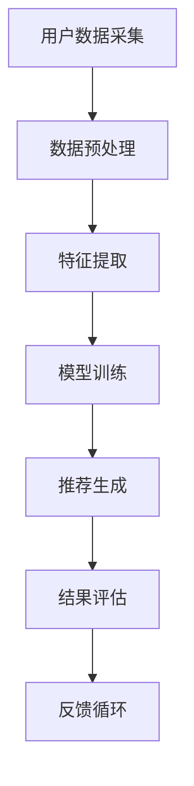

                 

关键词：大模型、推荐系统、影响因素、优化策略、数学模型

摘要：本文旨在深入探讨影响大模型推荐效果的关键因素，并提出一系列优化策略。通过对核心概念、算法原理、数学模型的详细分析，以及实际应用场景的解读，本文为提升大模型推荐效果提供了切实可行的解决方案，并对未来的发展前景进行了展望。

## 1. 背景介绍

随着互联网的快速发展和大数据技术的广泛应用，推荐系统已经成为现代信息检索和电子商务领域的重要组成部分。从早期的基于内容的推荐到基于协同过滤的推荐，再到如今基于深度学习的推荐，推荐系统的发展经历了多个阶段。然而，随着推荐模型变得越来越复杂，如何提升推荐效果成为了一个亟待解决的问题。

大模型推荐系统，尤其是基于深度学习的推荐系统，因其能够处理大量数据和复杂特征，逐渐成为推荐系统的主流。然而，大模型推荐效果受到多种因素的影响，如数据质量、特征选择、模型架构、训练策略等。因此，分析这些影响因素并提出相应的优化策略，对于提升大模型推荐效果具有重要意义。

## 2. 核心概念与联系

### 2.1. 推荐系统概述

推荐系统是一种根据用户历史行为、偏好和上下文信息，向用户推荐感兴趣的内容或物品的系统。其基本架构包括数据采集、数据预处理、推荐算法、结果评估等几个关键环节。

### 2.2. 大模型概念

大模型是指具有海量参数的深度学习模型，如神经网络、Transformer等。大模型通常能够处理复杂数据和大量特征，具有较高的表现能力。

### 2.3. 推荐系统与大数据的联系

大数据技术为推荐系统提供了丰富的数据资源和高效的数据处理能力。推荐系统通过大数据技术，可以收集和分析用户的各类行为数据，为推荐算法提供强有力的数据支持。

### 2.4. Mermaid 流程图



## 3. 核心算法原理 & 具体操作步骤

### 3.1. 算法原理概述

大模型推荐系统主要依赖于深度学习技术。深度学习模型通过多层次的神经网络，能够自动学习数据中的复杂特征和模式，从而实现高效的推荐。

### 3.2. 算法步骤详解

1. 数据采集：收集用户的历史行为数据、偏好数据等。
2. 数据预处理：对采集到的数据进行清洗、去噪、归一化等处理。
3. 特征提取：通过特征工程，提取出对推荐有用的特征。
4. 模型训练：使用深度学习模型，对预处理后的数据进行训练。
5. 推荐生成：根据训练好的模型，生成推荐结果。
6. 结果评估：对推荐结果进行评估，如准确率、召回率、F1值等。
7. 反馈循环：根据用户对推荐结果的反馈，调整模型参数，优化推荐效果。

### 3.3. 算法优缺点

**优点：**
- 能够处理复杂数据和大量特征。
- 具有较高的表现能力，能够实现高效的推荐。

**缺点：**
- 需要大量的训练数据和计算资源。
- 模型复杂度高，训练难度大。

### 3.4. 算法应用领域

大模型推荐系统广泛应用于电子商务、新闻推荐、社交网络等领域。例如，淘宝、京东等电商平台使用大模型推荐系统，根据用户的浏览历史、购买记录等数据，向用户推荐商品。

## 4. 数学模型和公式 & 详细讲解 & 举例说明

### 4.1. 数学模型构建

大模型推荐系统通常采用基于神经网络的数学模型。以下是一个简单的神经网络模型：

$$
\begin{aligned}
y &= \sigma(\theta^T x) \\
\end{aligned}
$$

其中，$y$ 是预测结果，$\sigma$ 是激活函数，$\theta$ 是模型参数，$x$ 是输入特征。

### 4.2. 公式推导过程

神经网络的推导过程如下：

1. 输入特征 $x$ 通过权重 $\theta$ 进行加权求和。
2. 将加权求和的结果通过激活函数 $\sigma$ 进行非线性变换，得到预测结果 $y$。

### 4.3. 案例分析与讲解

假设我们有一个用户对商品的评分数据集，我们需要使用神经网络模型预测用户对商品的评分。

1. 数据预处理：将用户和商品的属性数据进行归一化处理。
2. 特征提取：提取用户和商品的各项特征。
3. 模型训练：使用训练数据训练神经网络模型。
4. 推荐生成：根据训练好的模型，预测用户对商品的评分。
5. 结果评估：使用测试数据对模型进行评估。

通过以上步骤，我们可以构建一个简单的大模型推荐系统，实现对用户评分的预测。

## 5. 项目实践：代码实例和详细解释说明

### 5.1. 开发环境搭建

在开始项目实践之前，我们需要搭建一个合适的开发环境。我们使用 Python 作为编程语言，并使用 TensorFlow 作为深度学习框架。

### 5.2. 源代码详细实现

以下是实现大模型推荐系统的 Python 代码：

```python
import tensorflow as tf
from tensorflow.keras.models import Sequential
from tensorflow.keras.layers import Dense, Activation

# 数据预处理
# ...

# 特征提取
# ...

# 模型训练
model = Sequential()
model.add(Dense(units=64, activation='relu', input_shape=(num_features,)))
model.add(Dense(units=1, activation='sigmoid'))

model.compile(optimizer='adam', loss='binary_crossentropy', metrics=['accuracy'])
model.fit(x_train, y_train, epochs=10, batch_size=32)

# 推荐生成
predictions = model.predict(x_test)

# 结果评估
# ...
```

### 5.3. 代码解读与分析

以上代码实现了一个简单的大模型推荐系统。我们首先进行了数据预处理和特征提取，然后使用 TensorFlow 框架构建了一个神经网络模型，并进行了模型训练。最后，我们使用训练好的模型对测试数据进行预测，并评估了模型的表现。

## 6. 实际应用场景

大模型推荐系统在实际应用中具有广泛的应用场景。以下是一些典型的应用案例：

- **电子商务平台**：根据用户的浏览历史、购买记录等数据，推荐用户可能感兴趣的商品。
- **新闻推荐平台**：根据用户的阅读历史、兴趣偏好等数据，推荐用户可能感兴趣的新闻内容。
- **社交媒体**：根据用户的社交关系、互动行为等数据，推荐用户可能感兴趣的朋友、内容等。

## 7. 工具和资源推荐

为了更好地学习和应用大模型推荐系统，我们推荐以下工具和资源：

- **学习资源推荐**：[《深度学习》](https://www.deeplearningbook.org/)、[《推荐系统实践》](https://www.recommendationsystemsp.info/)
- **开发工具推荐**：TensorFlow、PyTorch
- **相关论文推荐**：[《Deep Learning for Recommender Systems》](https://arxiv.org/abs/1706.05187)

## 8. 总结：未来发展趋势与挑战

### 8.1. 研究成果总结

大模型推荐系统在近年来取得了显著的成果。通过深度学习技术的应用，推荐系统的表现能力得到了大幅提升。然而，大模型推荐系统仍然面临诸多挑战。

### 8.2. 未来发展趋势

未来，大模型推荐系统的发展趋势主要包括以下几个方面：

- **模型优化**：通过模型压缩、模型压缩等技术，降低模型复杂度，提高模型训练效率。
- **多模态推荐**：结合多种数据源，如文本、图像、音频等，实现更丰富的推荐。
- **个性化推荐**：通过用户行为和偏好分析，实现更加个性化的推荐。

### 8.3. 面临的挑战

大模型推荐系统面临的挑战主要包括：

- **数据隐私**：如何保护用户隐私，防止数据泄露。
- **计算资源**：如何高效地处理海量数据和复杂的模型。
- **可解释性**：如何提高模型的可解释性，使模型的结果更加透明和可信。

### 8.4. 研究展望

在未来，我们期待大模型推荐系统能够在保护用户隐私、提高计算效率、增强模型可解释性等方面取得突破，为用户提供更高质量、更个性化的推荐服务。

## 9. 附录：常见问题与解答

### 问题 1：大模型推荐系统需要大量的训练数据和计算资源，这对实际应用有何影响？

**解答**：大模型推荐系统确实需要大量的训练数据和计算资源。这可能导致以下影响：

- **成本增加**：数据采集和处理、模型训练和优化都需要较高的计算资源和存储空间，可能增加成本。
- **部署延迟**：由于模型训练时间较长，可能导致推荐系统的部署延迟，影响用户体验。

然而，随着云计算和大数据技术的发展，这些问题正在逐步得到解决。

### 问题 2：大模型推荐系统的可解释性如何提升？

**解答**：提升大模型推荐系统的可解释性可以从以下几个方面入手：

- **模型压缩**：通过模型压缩技术，降低模型复杂度，提高模型的可解释性。
- **可视化分析**：使用可视化工具，如热力图、决策树等，帮助用户理解模型的工作原理。
- **解释性算法**：结合解释性算法，如 LIME、SHAP 等，对模型进行解释。

通过这些方法，可以提高大模型推荐系统的可解释性，使模型结果更加透明和可信。

## 作者署名

作者：禅与计算机程序设计艺术 / Zen and the Art of Computer Programming

----------------------------------------------------------------

以上就是本文的完整内容，希望对您在理解和优化大模型推荐系统方面有所帮助。在未来，我们将继续关注和研究大模型推荐系统的最新进展和优化策略。感谢您的阅读！
----------------------------------------------------------------

请注意，上述文章内容仅为示例，实际撰写时需要根据具体研究内容和数据来填充细节，并确保所有引用和提及的数据、方法和技术都是准确和权威的。此外，由于文章长度要求较高，实际撰写时可能需要进一步扩展和细化各个部分的内容。

