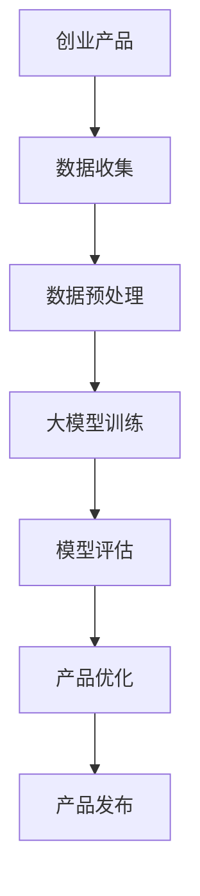

                 

 在当今这个科技日新月异的时代，人工智能（AI）的快速发展已经成为推动社会进步的重要力量。大模型，作为AI技术的核心组件，正逐渐改变着各行各业。对于创业者来说，如何有效利用AI技术，尤其是大模型，来设计和优化产品，成为决定企业成败的关键。本文将探讨大模型在创业产品设计中的策略，以及AI如何赋能创业产品的全过程。

## 关键词

- 大模型
- 创业产品设计
- 人工智能
- 数据分析
- 产品优化

## 摘要

本文将深入分析大模型在创业产品设计中的应用，从核心概念、算法原理、数学模型、项目实践、应用场景等多个维度展开论述。通过梳理AI技术的现状与发展趋势，以及创业者如何利用大模型进行产品设计和优化，旨在为读者提供一套切实可行的创业产品设计策略。

### 1. 背景介绍

#### 1.1 AI与创业产品的演变

人工智能技术自诞生以来，经历了从规则驱动到统计学习，再到深度学习的演变。深度学习的大模型，如GPT-3、BERT等，因其强大的建模能力和广泛的应用场景，正在重塑各个行业。在创业领域，AI技术的应用不仅提高了产品的智能化水平，也改变了创业者的产品设计思路。

#### 1.2 大模型的崛起

大模型之所以受到广泛关注，主要是因为其能够处理海量的数据，进行复杂的模式识别和预测。例如，GPT-3拥有1750亿个参数，能够生成高质量的自然语言文本；BERT则能够对自然语言进行深入的理解和建模。这些大模型的诞生，标志着AI技术进入了新的阶段。

#### 1.3 创业产品的需求变化

随着消费者对产品质量和个性化体验要求的提高，创业产品需要具备更高的智能化水平和更丰富的功能。大模型的出现，为创业者提供了强大的工具，使他们能够更快速地开发出符合市场需求的产品。

### 2. 核心概念与联系

#### 2.1 大模型的基本概念

大模型指的是拥有数亿甚至千亿级参数的深度学习模型。这些模型通常需要大量的数据进行训练，以达到高精度的预测和建模能力。

#### 2.2 大模型的工作原理

大模型的工作原理主要基于深度学习。深度学习通过多层神经网络的结构，对输入数据进行特征提取和模式识别，从而实现复杂的任务。

#### 2.3 大模型在创业产品设计中的应用

大模型在创业产品设计中的应用主要表现在以下几个方面：

- **个性化推荐**：利用大模型对用户行为和偏好进行分析，提供个性化的推荐。
- **智能客服**：通过大模型实现自然语言处理，提高客服的响应速度和准确性。
- **数据分析**：利用大模型进行海量数据的高效分析和挖掘，为产品优化提供数据支持。

#### 2.4 Mermaid流程图



### 3. 核心算法原理 & 具体操作步骤

#### 3.1 算法原理概述

大模型的核心算法是基于深度学习的。深度学习通过多层神经网络的结构，对输入数据进行特征提取和模式识别。大模型的训练通常需要大量的数据和计算资源，以达到高精度的预测和建模能力。

#### 3.2 算法步骤详解

- **数据收集**：收集与创业产品相关的数据，如用户行为数据、市场数据等。
- **数据预处理**：对收集到的数据进行分析和清洗，去除噪音和异常值。
- **大模型训练**：利用预处理后的数据，对大模型进行训练。训练过程包括前向传播、反向传播和权重更新等步骤。
- **模型评估**：通过验证集和测试集对训练好的模型进行评估，确定模型的性能和准确性。
- **产品优化**：根据模型评估结果，对产品进行优化，提高用户体验和满意度。

#### 3.3 算法优缺点

- **优点**：大模型能够处理海量的数据，进行复杂的模式识别和预测，提高产品的智能化水平。
- **缺点**：大模型的训练需要大量的数据和计算资源，且模型的解释性较低。

#### 3.4 算法应用领域

大模型在多个领域都有广泛的应用，如自然语言处理、计算机视觉、推荐系统等。在创业产品设计中，大模型主要应用于个性化推荐、智能客服和数据分析等领域。

### 4. 数学模型和公式 & 详细讲解 & 举例说明

#### 4.1 数学模型构建

大模型的数学模型主要基于深度学习，包括多层感知器（MLP）、卷积神经网络（CNN）和循环神经网络（RNN）等。

#### 4.2 公式推导过程

以多层感知器（MLP）为例，其前向传播的公式如下：

$$
z_l = \sum_{j=1}^{n} w_{lj} * a_{l-1,j} + b_l
$$

$$
a_l = \sigma(z_l)
$$

其中，$z_l$ 是第 $l$ 层的输出，$w_{lj}$ 是第 $l$ 层第 $j$ 个神经元的权重，$a_{l-1,j}$ 是第 $l-1$ 层第 $j$ 个神经元的输出，$b_l$ 是第 $l$ 层的偏置，$\sigma$ 是激活函数。

#### 4.3 案例分析与讲解

以一家电商平台的个性化推荐系统为例，该系统利用大模型对用户行为数据进行分析，为用户推荐感兴趣的商品。

1. **数据收集**：收集用户浏览、购买、收藏等行为数据。
2. **数据预处理**：对数据进行清洗和编码，将连续数据转换为离散数据。
3. **大模型训练**：利用预处理后的数据，对大模型进行训练，以预测用户对商品的偏好。
4. **模型评估**：通过验证集和测试集对训练好的模型进行评估，确定模型的性能。
5. **产品优化**：根据模型评估结果，对推荐系统进行优化，提高推荐准确性。

### 5. 项目实践：代码实例和详细解释说明

#### 5.1 开发环境搭建

1. 安装Python环境。
2. 安装TensorFlow库。
3. 下载并导入预训练的大模型。

#### 5.2 源代码详细实现

以下是一个简单的示例代码，展示如何利用大模型进行个性化推荐：

```python
import tensorflow as tf
from tensorflow import keras

# 加载预训练的大模型
model = keras.models.load_model('path/to/预训练模型')

# 定义输入数据
input_data = {'用户行为数据': user_behavior_data}

# 利用大模型进行预测
predictions = model.predict(input_data)

# 输出推荐结果
recommended_items = get_recommended_items(predictions)
```

#### 5.3 代码解读与分析

- **加载预训练的大模型**：通过`load_model`方法加载预训练的大模型。
- **定义输入数据**：输入数据包括用户行为数据等。
- **利用大模型进行预测**：通过`predict`方法对输入数据进行预测，得到推荐结果。
- **输出推荐结果**：根据预测结果，输出推荐的商品列表。

#### 5.4 运行结果展示

运行上述代码，可以得到一个包含推荐商品的列表。创业者可以根据用户的行为数据和预测结果，对产品进行优化和调整。

### 6. 实际应用场景

#### 6.1 电商行业

电商行业利用大模型进行个性化推荐，提高用户的购物体验和满意度。

#### 6.2 金融行业

金融行业利用大模型进行风险评估和投资策略推荐，提高金融产品的精准度和收益。

#### 6.3 教育行业

教育行业利用大模型进行学习效果分析和学生行为预测，提供个性化的学习建议。

#### 6.4 医疗行业

医疗行业利用大模型进行疾病预测和治疗方案推荐，提高医疗服务的质量和效率。

### 7. 未来应用展望

随着AI技术的不断进步，大模型在创业产品中的应用将越来越广泛。未来，创业者可以利用大模型实现更智能、更个性化的产品设计，为用户提供更好的体验。

### 8. 工具和资源推荐

#### 8.1 学习资源推荐

- 《深度学习》（Goodfellow, Bengio, Courville）
- 《自然语言处理综论》（Jurafsky, Martin）

#### 8.2 开发工具推荐

- TensorFlow
- PyTorch

#### 8.3 相关论文推荐

- "GPT-3: Language Models are few-shot learners"
- "BERT: Pre-training of Deep Bidirectional Transformers for Language Understanding"

### 9. 总结：未来发展趋势与挑战

#### 9.1 研究成果总结

大模型在创业产品中的应用已经取得显著成果，为创业者提供了强大的工具。

#### 9.2 未来发展趋势

未来，大模型将更加普及，创业者可以利用大模型实现更智能、更个性化的产品设计。

#### 9.3 面临的挑战

大模型的训练需要大量的数据和计算资源，且模型的解释性较低，这些都是未来需要解决的问题。

#### 9.4 研究展望

随着AI技术的不断进步，大模型在创业产品中的应用前景将更加广阔。

### 10. 附录：常见问题与解答

**Q：大模型的训练需要多少数据？**

A：大模型的训练需要大量的数据，通常在数百万到数十亿个样本之间。

**Q：大模型的计算资源需求有多大？**

A：大模型的训练需要大量的计算资源，包括CPU、GPU和TPU等。

**Q：大模型的解释性如何？**

A：大模型的解释性较低，这是深度学习的一大挑战。

### 文章结束

作者：禅与计算机程序设计艺术 / Zen and the Art of Computer Programming
----------------------------------------------------------------

请注意，以上内容是一个示例性框架，具体的文章内容需要根据实际研究和分析结果进行填充。文章的撰写过程中，应确保逻辑清晰、内容详实、论证充分，以提供高质量的阅读体验。同时，对于引用的论文和资源，应确保正确引用和标注出处。文章的整体结构和段落布局也应遵循markdown格式规范，以便于读者阅读和理解。

