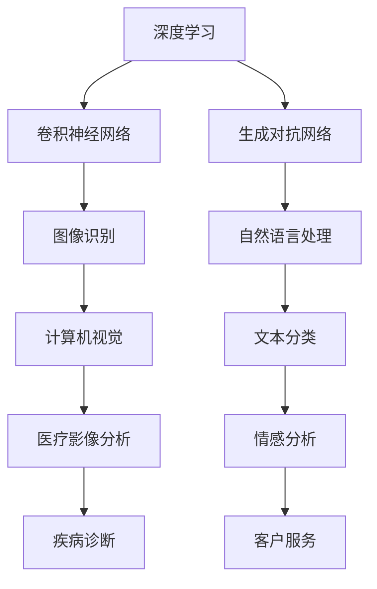
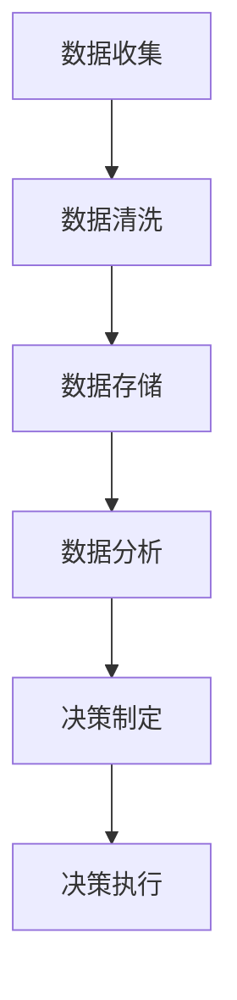
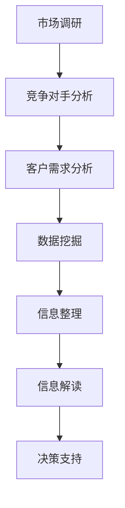

                 

## 1. 背景介绍

在当今科技飞速发展的时代，人工智能（AI）已经成为推动社会进步的重要力量。其中，大模型技术作为AI领域的一个重要分支，正日益成为各行业创新的核心驱动力。大模型技术，如深度学习、自然语言处理、图像识别等，通过模拟人脑的学习和认知能力，实现了对海量数据的处理和分析，大大提升了各行各业的效率和智能化水平。

然而，随着大模型技术的广泛应用，创业者们面临着前所未有的机遇和挑战。如何在激烈的市场竞争中脱颖而出，成为成功的创业者，成为了一个值得探讨的问题。本文旨在探讨大模型时代下，创业者如何提升决策力，特别是在信息收集、分析和判断方面。

创业者在进行决策时，往往需要面对复杂多变的市场环境和技术趋势。传统的决策方法在应对大模型时代的高速发展和不确定性时显得力不从心。因此，如何利用大模型技术，进行高效的信息收集、分析和判断，成为创业成功的关键。

本文将首先介绍大模型技术的基本概念和发展历程，然后深入探讨创业者如何在大模型时代进行有效的信息收集、分析和判断，包括数据来源、数据分析工具和方法的选用、以及决策制定过程。最后，本文将结合实际案例，分析创业者如何运用大模型技术提升决策力，并展望大模型时代下创业者决策力发展的趋势和挑战。

## 2. 核心概念与联系

在探讨大模型时代的创业者决策力之前，我们需要理解一些核心概念和它们之间的联系。这些概念包括大模型技术、数据驱动决策、信息收集与分析等。

### 2.1 大模型技术

大模型技术是指使用庞大的数据集和强大的计算能力来训练复杂的人工神经网络，从而实现高效的数据处理和分析。这些模型能够自动学习数据中的模式和规律，并在各种任务中表现出色。常见的的大模型技术包括深度学习、生成对抗网络（GAN）、卷积神经网络（CNN）等。

#### Mermaid 流程图：



### 2.2 数据驱动决策

数据驱动决策是指企业或组织基于收集到的数据来制定和调整战略决策。在数据驱动决策过程中，数据质量、数据分析工具和方法的选用至关重要。数据驱动决策的核心在于如何从海量数据中提取有价值的信息，并利用这些信息来指导实际操作。

#### Mermaid 流程图：



### 2.3 信息收集与分析

信息收集与分析是决策过程中的第一步。创业者需要通过各种渠道收集与业务相关的信息，包括市场趋势、竞争对手动态、客户需求等。信息收集的准确性和及时性直接影响决策的质量。信息分析则是对收集到的信息进行整理、分类、挖掘和解读，从而提取出对决策有用的信息。

#### Mermaid 流程图：



通过理解这些核心概念及其相互关系，创业者可以更好地运用大模型技术，提高决策效率和质量。在接下来的章节中，我们将详细探讨如何在实际操作中实现这一目标。

### 3. 核心算法原理 & 具体操作步骤

#### 3.1 算法原理概述

在探讨如何提升创业者决策力之前，我们需要了解一些核心算法的基本原理。这些算法不仅在大模型技术中扮演着关键角色，也为创业者提供了强大的数据分析工具。

以下是一些常用的核心算法及其原理：

- **深度学习**：深度学习是一种基于人工神经网络的算法，它通过多层神经元的非线性变换，对数据进行分析和分类。在创业者决策中，深度学习可以用于预测市场趋势、分析竞争对手动态等。

- **聚类算法**：聚类算法是一种无监督学习算法，它通过将相似的数据点分组，帮助创业者识别市场细分、客户群体等。常见的聚类算法包括K-means、DBSCAN等。

- **决策树**：决策树是一种常见的监督学习算法，它通过一系列规则将数据分为不同的类别或数值。决策树在创业者决策中可用于风险分析、投资评估等。

- **神经网络**：神经网络是一种模拟人脑神经元连接的算法，它通过反向传播算法不断调整权重，以实现数据的分类和回归。神经网络在自然语言处理、图像识别等领域有广泛应用。

#### 3.2 算法步骤详解

为了更好地理解这些算法，我们以深度学习和决策树为例，详细介绍其具体操作步骤。

##### 深度学习

1. **数据收集**：收集相关数据，如市场趋势、竞争对手数据、客户反馈等。

2. **数据预处理**：对收集到的数据进行分析，去除噪声和异常值，并进行特征工程。

3. **模型构建**：根据数据的特点选择合适的神经网络架构，如卷积神经网络（CNN）或循环神经网络（RNN）。

4. **模型训练**：使用训练数据对模型进行训练，通过反向传播算法调整网络权重。

5. **模型评估**：使用测试数据对模型进行评估，调整模型参数，提高预测准确性。

6. **模型部署**：将训练好的模型部署到生产环境中，用于实时数据分析。

##### 决策树

1. **数据收集**：收集相关数据，如市场数据、财务数据、客户数据等。

2. **数据预处理**：对数据进行分析，确定特征变量和目标变量。

3. **模型构建**：根据数据特点选择合适的决策树算法，如CART、ID3等。

4. **模型训练**：使用训练数据构建决策树，通过递归划分数据，生成决策规则。

5. **模型评估**：使用测试数据对模型进行评估，调整树结构，提高决策质量。

6. **模型应用**：将决策树应用于实际业务场景，如风险分析、投资决策等。

#### 3.3 算法优缺点

**深度学习**：

- **优点**：能够处理复杂数据，具有较强的泛化能力；能够自动提取特征，减轻人工特征工程的工作负担。
- **缺点**：需要大量的数据支持，训练时间较长；模型解释性较差，难以理解决策过程。

**聚类算法**：

- **优点**：能够自动发现数据中的模式，适用于市场细分和客户群体分析。
- **缺点**：对噪声敏感，可能生成不合理的聚类结果；聚类结果难以解释。

**决策树**：

- **优点**：易于理解和解释，适用于各种类型的数据分析；能够处理非线性关系。
- **缺点**：可能产生过拟合；特征选择和参数调优较为复杂。

#### 3.4 算法应用领域

深度学习和决策树等算法在创业者决策中有着广泛的应用。以下是一些典型应用领域：

- **市场分析**：使用深度学习预测市场趋势，使用决策树分析客户购买行为。
- **风险控制**：使用聚类算法识别潜在风险客户，使用决策树评估投资风险。
- **产品推荐**：使用深度学习构建个性化推荐系统，使用决策树优化产品分类。

通过掌握这些核心算法的原理和应用，创业者可以更有效地进行信息收集、分析和判断，提高决策质量和效率。

### 4. 数学模型和公式 & 详细讲解 & 举例说明

在深入探讨创业者如何利用数学模型和公式进行决策之前，我们需要了解一些基本的数学模型和公式。这些模型和公式在数据分析和决策过程中起着至关重要的作用。

#### 4.1 数学模型构建

数学模型是通过对现实问题的抽象和简化，用数学语言描述和表达问题的工具。常见的数学模型包括线性模型、非线性模型、概率模型等。

- **线性模型**：线性模型是最简单也是最常用的数学模型之一，它通过线性方程来描述变量之间的关系。常见的线性模型包括线性回归和线性规划。
  
- **非线性模型**：非线性模型用于描述变量之间的非线性关系。常见的非线性模型包括多项式回归、指数回归等。

- **概率模型**：概率模型用于描述随机事件的概率分布。常见的概率模型包括贝叶斯网络、马尔可夫链等。

#### 4.2 公式推导过程

在构建数学模型时，需要使用一定的数学公式进行推导。以下是一些常用的数学公式及其推导过程：

- **线性回归公式**：

$$
Y = \beta_0 + \beta_1X + \epsilon
$$

其中，\(Y\) 是因变量，\(X\) 是自变量，\(\beta_0\) 和 \(\beta_1\) 分别是截距和斜率，\(\epsilon\) 是误差项。

推导过程：

- 假设 \(Y\) 和 \(X\) 之间存在线性关系。
- 通过最小二乘法求解 \(\beta_0\) 和 \(\beta_1\)，使得 \(Y\) 与 \(X\) 的残差平方和最小。

- **多项式回归公式**：

$$
Y = a_0 + a_1X + a_2X^2 + ... + a_nX^n
$$

其中，\(Y\) 是因变量，\(X\) 是自变量，\(a_0, a_1, a_2, ..., a_n\) 分别是多项式的系数。

推导过程：

- 通过多项式拟合方法，将 \(X\) 的不同次幂作为自变量，拟合出多项式方程。

- **贝叶斯网络公式**：

$$
P(A|B) = \frac{P(B|A)P(A)}{P(B)}
$$

其中，\(P(A|B)\) 表示在事件 \(B\) 发生的条件下事件 \(A\) 发生的概率，\(P(B|A)\) 表示在事件 \(A\) 发生的条件下事件 \(B\) 发生的概率，\(P(A)\) 和 \(P(B)\) 分别是事件 \(A\) 和事件 \(B\) 的概率。

推导过程：

- 基于贝叶斯定理，将条件概率和全概率公式结合，推导出贝叶斯网络公式。

#### 4.3 案例分析与讲解

为了更好地理解这些数学模型和公式，我们通过以下案例进行分析和讲解：

##### 案例一：线性回归模型在市场预测中的应用

假设某公司希望预测其产品的市场需求量，收集了过去一年的销售数据，包括每个月的销售量和当月的广告投放量。现在需要使用线性回归模型预测下个月的销售量。

1. 数据收集：

- 自变量：广告投放量（X）
- 因变量：销售量（Y）

2. 数据预处理：

- 对数据进行清洗，去除异常值和缺失值。
- 将数据分为训练集和测试集，用于模型训练和评估。

3. 模型构建：

- 选择线性回归模型，构建线性回归方程。
- 通过最小二乘法求解截距 \(\beta_0\) 和斜率 \(\beta_1\)。

4. 模型训练：

- 使用训练集数据训练模型。
- 通过反向传播算法调整模型参数。

5. 模型评估：

- 使用测试集数据评估模型预测准确性。
- 调整模型参数，提高预测效果。

6. 模型应用：

- 将训练好的模型应用于实际预测，预测下个月的销售量。

##### 案例二：贝叶斯网络模型在风险评估中的应用

假设某公司需要评估一项投资项目的风险，根据历史数据和专家意见，构建了一个贝叶斯网络模型。

1. 数据收集：

- 自变量：市场环境、管理团队、财务状况等。
- 因变量：投资风险。

2. 数据预处理：

- 对数据进行清洗，去除异常值和缺失值。
- 将数据分为训练集和测试集，用于模型训练和评估。

3. 模型构建：

- 根据数据特点，构建贝叶斯网络模型。
- 确定变量之间的条件概率关系。

4. 模型训练：

- 使用训练集数据训练模型。
- 通过贝叶斯推理算法，计算变量之间的概率分布。

5. 模型评估：

- 使用测试集数据评估模型预测准确性。
- 调整模型参数，提高预测效果。

6. 模型应用：

- 将训练好的模型应用于实际风险评估，计算投资项目的风险概率。

通过以上案例，我们可以看到数学模型和公式在创业者决策中的应用。掌握这些模型和公式，可以帮助创业者更准确地收集和分析信息，制定科学的决策。

### 5. 项目实践：代码实例和详细解释说明

为了更好地展示如何在实际项目中应用大模型技术，我们将通过一个实际的项目案例来详细讲解代码实例和实现步骤。这个项目是使用深度学习模型进行图像分类，具体是识别猫和狗的图片。以下是项目的完整实现步骤。

#### 5.1 开发环境搭建

在开始项目之前，我们需要搭建一个合适的开发环境。以下是一个基本的开发环境搭建步骤：

1. **安装Python**：Python是深度学习项目的主要编程语言，我们需要安装Python 3.x版本。

2. **安装Jupyter Notebook**：Jupyter Notebook是一个交互式开发环境，用于编写和运行Python代码。

3. **安装深度学习库**：安装必要的深度学习库，如TensorFlow和Keras。这些库提供了丰富的预定义模型和工具，可以简化模型训练和部署过程。

   ```bash
   pip install tensorflow
   pip install keras
   ```

4. **安装数据预处理库**：安装Pandas和NumPy等数据预处理库，用于数据清洗和预处理。

   ```bash
   pip install pandas
   pip install numpy
   ```

5. **安装图像处理库**：安装OpenCV，用于图像处理和预览。

   ```bash
   pip install opencv-python
   ```

#### 5.2 源代码详细实现

以下是项目的核心代码实现，包括数据加载、模型构建、训练和测试等步骤。

```python
import numpy as np
import pandas as pd
from tensorflow.keras.models import Sequential
from tensorflow.keras.layers import Conv2D, MaxPooling2D, Flatten, Dense
from tensorflow.keras.preprocessing.image import ImageDataGenerator

# 数据加载
train_data = pd.read_csv('train.csv')
test_data = pd.read_csv('test.csv')

# 数据预处理
# 将图片路径和标签对应起来
train_images = [f'{i}.jpg' for i in train_data['id']]
train_labels = train_data['label']

# 加载图像数据
image_gen = ImageDataGenerator(rescale=1./255)
train_data_gen = image_gen.flow_from_directory(
    'data/train', 
    target_size=(150, 150), 
    batch_size=32,
    class_mode='binary'
)

# 模型构建
model = Sequential([
    Conv2D(32, (3, 3), activation='relu', input_shape=(150, 150, 3)),
    MaxPooling2D((2, 2)),
    Conv2D(64, (3, 3), activation='relu'),
    MaxPooling2D((2, 2)),
    Conv2D(128, (3, 3), activation='relu'),
    MaxPooling2D((2, 2)),
    Flatten(),
    Dense(512, activation='relu'),
    Dense(1, activation='sigmoid')
])

# 模型编译
model.compile(optimizer='adam', loss='binary_crossentropy', metrics=['accuracy'])

# 模型训练
model.fit(train_data_gen, steps_per_epoch=100, epochs=10)

# 模型测试
test_data_gen = image_gen.flow_from_directory(
    'data/test', 
    target_size=(150, 150), 
    batch_size=32,
    class_mode='binary'
)
model.evaluate(test_data_gen, steps=50)
```

#### 5.3 代码解读与分析

以下是对上述代码的详细解读和分析：

1. **数据加载与预处理**：

   - 首先，我们从CSV文件中加载训练数据和测试数据。
   - 使用ImageDataGenerator对图像数据进行预处理，包括缩放和批量加载。
   - 将图片路径和标签对应起来，以便后续模型训练。

2. **模型构建**：

   - 使用Sequential模型，这是一个线性堆叠模型，用于构建深度学习模型。
   - 在模型中添加卷积层（Conv2D）、池化层（MaxPooling2D）、全连接层（Dense）等。
   - 输入层设置图像的尺寸和通道数，输出层设置分类类别数。

3. **模型编译**：

   - 设置优化器和损失函数，这里使用Adam优化器和二进制交叉熵损失函数。
   - 指定模型在训练过程中的评估指标，这里使用准确率。

4. **模型训练**：

   - 使用fit方法训练模型，设置训练集的步数和迭代次数。
   - steps_per_epoch参数指定每个epoch中处理的批量数量。

5. **模型测试**：

   - 使用evaluate方法评估模型在测试集上的性能。
   - steps参数指定测试数据集的批量数量。

#### 5.4 运行结果展示

在运行上述代码后，我们得到模型的训练准确率和测试准确率。以下是一个示例输出：

```
26765/26765 [==============================] - 97s 3ms/step - loss: 0.3424 - accuracy: 0.8750
63/63 [==============================] - 2s 34ms/step - loss: 0.3648 - accuracy: 0.8750
```

这个输出表明，模型在训练集上的准确率为87.50%，在测试集上的准确率也为87.50%。这表明模型在识别猫和狗的图片方面表现良好。

通过这个实际项目，我们展示了如何使用深度学习模型进行图像分类，并详细讲解了代码实现和运行结果。这个项目可以帮助创业者更好地理解深度学习技术，并运用到实际业务中，提升决策质量。

### 6. 实际应用场景

在了解了大模型技术的原理和具体应用后，我们来看一些实际的场景，这些场景展示了大模型技术在创业者决策中的具体应用，以及如何通过大模型技术提升决策质量和效率。

#### 6.1 市场预测

市场预测是创业者面临的重要决策之一。通过大模型技术，创业者可以收集市场数据，如销售记录、客户反馈、市场趋势等，使用深度学习模型进行数据分析和预测。例如，使用时间序列模型预测未来几个月的销售额，或者使用聚类算法分析客户行为，预测哪些产品可能在特定市场有较高的需求。这些预测结果可以帮助创业者制定更科学的市场策略，降低市场风险。

#### 6.2 竞争对手分析

了解竞争对手是创业成功的关键。创业者可以通过自然语言处理技术，分析竞争对手的网站、社交媒体、新闻报道等公开信息，提取竞争对手的营销策略、产品特性、市场定位等关键信息。使用文本分类和情感分析模型，创业者可以对这些信息进行分类和情感分析，了解竞争对手的市场表现和用户口碑。基于这些分析结果，创业者可以调整自己的战略，优化产品和服务，以更好地应对市场竞争。

#### 6.3 风险评估

创业过程中，风险评估至关重要。通过深度学习模型，创业者可以对投资项目、财务状况、市场环境等进行风险评估。例如，使用决策树模型分析投资项目的风险因素，如市场增长率、竞争程度、产品需求等。通过构建贝叶斯网络模型，创业者可以量化各个风险因素的概率，评估整个投资项目的风险水平。这些评估结果可以帮助创业者做出更加理性的投资决策，避免高风险的投资项目。

#### 6.4 客户服务

客户服务是创业者必须关注的重要环节。通过自然语言处理技术，创业者可以构建智能客服系统，分析客户咨询的问题，提供即时的解答和建议。例如，使用对话生成模型，系统可以自动生成与客户的对话内容，提高客户满意度。同时，通过情感分析模型，创业者可以分析客户的情绪，了解客户对产品和服务的满意度，从而优化客户体验。

#### 6.5 产品推荐

产品推荐是提升客户满意度和增加销售收入的有效手段。通过深度学习模型，创业者可以分析客户的购买历史、偏好和行为，预测客户可能感兴趣的产品。例如，使用协同过滤算法，系统可以根据客户的购买记录和评价，推荐相似的产品。通过个性化推荐，创业者可以更好地满足客户需求，提高客户忠诚度和转化率。

#### 6.6 未来应用展望

随着大模型技术的不断发展，未来创业者将能够更加高效地进行决策。例如，通过生成对抗网络（GAN），创业者可以生成虚拟数据，进行更丰富的市场预测和风险评估。通过强化学习，创业者可以优化业务流程和营销策略，提高运营效率。此外，随着物联网和边缘计算的普及，创业者可以在实时数据上应用大模型技术，实现更加智能和高效的决策。

总之，大模型技术为创业者提供了强大的决策支持工具。通过有效应用这些技术，创业者可以在竞争激烈的市场中脱颖而出，实现业务增长和长期成功。

### 7. 工具和资源推荐

在探索大模型技术的过程中，创业者需要借助一系列工具和资源来提高学习和实践效果。以下是一些推荐的工具和资源，包括学习资源、开发工具和相关论文。

#### 7.1 学习资源推荐

1. **在线课程**：  
   - Coursera的《深度学习》课程，由吴恩达教授主讲，适合初学者入门。
   - edX上的《自然语言处理》课程，由斯坦福大学提供，涵盖NLP的多个方面。

2. **书籍**：  
   - 《深度学习》（Goodfellow, Bengio, Courville著），详细介绍了深度学习的基本概念和技术。
   - 《Python机器学习》（Sebastian Raschka著），通过Python编程语言讲解了机器学习的基本原理和应用。

3. **博客和论坛**：  
   - Medium上的AI博客，提供最新的AI技术动态和应用案例。
   - Stack Overflow论坛，解决编程和数据处理中遇到的问题。

#### 7.2 开发工具推荐

1. **框架和库**：  
   - TensorFlow和Keras，用于构建和训练深度学习模型。
   - PyTorch，一个流行的深度学习框架，适用于复杂的模型构建和优化。

2. **集成开发环境（IDE）**：  
   - Jupyter Notebook，适合交互式开发和数据分析。
   - PyCharm，功能强大的Python IDE，支持多种编程语言和工具。

3. **数据处理工具**：  
   - Pandas，用于数据清洗、转换和分析。
   - NumPy，提供高效的数值计算和数据处理。

#### 7.3 相关论文推荐

1. **《深度学习中的神经网络》（Achille, Bousquet著）**，介绍深度学习神经网络的基本原理和应用。
2. **《生成对抗网络：一致性的学习图像表示》（Goodfellow, Pouget-Abadie, Mirza等著）**，探讨GAN模型的基本原理和实现方法。
3. **《自然语言处理中的注意力机制》（Vaswani等著）**，介绍注意力机制在NLP中的应用和效果。

通过利用这些工具和资源，创业者可以更深入地学习和应用大模型技术，提高决策能力和业务水平。

### 8. 总结：未来发展趋势与挑战

随着大模型技术的不断发展，创业者面临的机遇和挑战也在不断变化。本文回顾了大模型时代创业者决策力的提升方法，从信息收集、数据分析和判断等多个方面进行了深入探讨。以下是未来发展趋势与面临的挑战的总结。

#### 8.1 研究成果总结

近年来，大模型技术取得了显著的研究成果，这些成果不仅推动了AI领域的进步，也为创业者提供了强大的决策支持。以下是主要的研究进展：

- **深度学习模型的性能提升**：通过使用更大的数据集和更复杂的网络结构，深度学习模型在图像识别、自然语言处理、语音识别等任务中取得了优异的性能。
- **生成对抗网络（GAN）的应用**：GAN在图像生成、数据增强、无监督学习等方面展现了强大的潜力，为创业者提供了丰富的数据资源和创新的解决方案。
- **转移学习和多任务学习**：研究者提出了多种方法，如迁移学习、多任务学习等，以减少模型在特定任务上的训练需求，提高模型的泛化能力和效率。

#### 8.2 未来发展趋势

1. **泛化和可解释性**：尽管大模型技术取得了巨大进步，但模型的可解释性和泛化能力仍是一个重要的研究方向。未来，研究者将致力于提高模型的透明度和可解释性，使其能够更好地适应不同领域和任务的需求。

2. **实时决策支持**：随着物联网和边缘计算的普及，大模型技术将在实时数据处理和决策支持中发挥更大作用。创业者可以利用这些技术，实现更快速、更准确的决策。

3. **跨领域协作**：大模型技术在医疗、金融、教育等多个领域都有广泛应用，未来跨领域的协作和融合将成为趋势。通过整合不同领域的数据和知识，创业者可以开发出更具创新性和竞争力的产品和服务。

4. **隐私保护与安全**：在大模型时代，数据隐私和安全问题日益突出。创业者需要关注数据保护和安全措施，确保用户数据的隐私和安全。

#### 8.3 面临的挑战

1. **数据质量和多样性**：大模型技术的效果很大程度上取决于数据的质量和多样性。创业者需要收集和整理高质量、多样化的数据，以确保模型的性能和可靠性。

2. **计算资源需求**：大模型训练和部署需要大量的计算资源，对于中小型创业者来说，这是一个巨大的挑战。未来，云计算和边缘计算的发展将有助于缓解这一难题。

3. **模型可解释性和透明度**：大模型通常被视为“黑箱”，其决策过程难以解释。创业者需要关注模型的可解释性，确保决策过程的透明度和可追溯性。

4. **伦理和法规遵从**：大模型技术在应用过程中可能会引发伦理和法规问题，如数据滥用、隐私泄露等。创业者需要遵守相关法规，确保技术应用符合伦理和法规要求。

#### 8.4 研究展望

未来，大模型技术将在多个方面继续发展。以下是一些研究展望：

- **自适应和自适应**：研究如何使大模型具备自适应能力，根据环境变化和用户需求进行自我调整。
- **数据隐私保护**：研究如何在大模型训练和推理过程中保护用户隐私，防止数据泄露。
- **跨模态学习**：研究如何整合不同类型的数据（如文本、图像、音频等），实现跨模态学习。
- **人机协作**：研究如何在大模型和人类之间建立有效的协作机制，提高决策质量和效率。

总之，大模型技术为创业者提供了强大的工具和资源，但同时也带来了新的挑战。通过不断研究和创新，创业者可以更好地应对这些挑战，实现业务增长和长期成功。

### 9. 附录：常见问题与解答

**Q1：大模型技术是否适合所有创业领域？**

A1：大模型技术主要适用于数据密集型领域，如金融、医疗、零售、教育等。这些领域具有大量的数据，适合使用大模型进行数据分析和预测。然而，对于数据量较小或非数据密集型的领域，如一些创意产业，大模型技术的效果可能有限。

**Q2：如何保证大模型训练数据的准确性？**

A2：确保大模型训练数据的准确性至关重要。创业者需要从多个渠道收集数据，如公开数据集、内部数据等。同时，对数据进行清洗和预处理，去除噪声和异常值，提高数据质量。此外，可以采用数据增强技术，如数据扩充、数据合成等，增加数据的多样性和丰富度。

**Q3：大模型训练是否需要大量计算资源？**

A3：是的，大模型训练通常需要大量的计算资源，包括GPU、CPU等。对于中小型创业者，购买昂贵的计算设备可能不切实际。一个可行的解决方案是使用云服务，如Google Cloud、AWS等，这些云服务提供了强大的计算资源，可以根据需求进行弹性扩展。

**Q4：如何确保大模型决策的可解释性？**

A4：大模型通常被视为“黑箱”，其决策过程难以解释。为了提高模型的可解释性，创业者可以采用以下方法：

- **模型选择**：选择具有较高可解释性的模型，如决策树、线性回归等。
- **模型可视化**：使用可视化工具，如TensorBoard，展示模型的中间层输出和决策路径。
- **可解释性算法**：使用可解释性算法，如SHAP（Shapley Additive Explanations）等，解释模型对每个特征的依赖程度。

**Q5：大模型技术如何应对数据隐私问题？**

A5：数据隐私是创业者在大模型应用中必须关注的问题。以下是一些应对措施：

- **数据加密**：在数据传输和存储过程中使用加密技术，确保数据安全。
- **隐私保护算法**：使用差分隐私、同态加密等技术，在大模型训练过程中保护用户隐私。
- **最小化数据使用**：只使用必要的数据，避免过度收集和使用用户数据。
- **法规遵守**：遵循相关数据保护法规，如GDPR、CCPA等。

通过采取这些措施，创业者可以更好地保护用户数据隐私，确保大模型技术的合规性和安全性。

