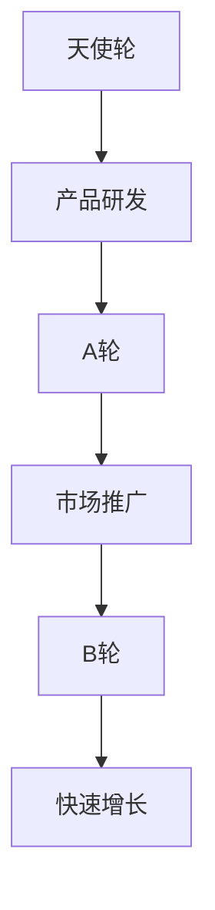

                 

 > **关键词**：大模型时代、创业融资、天使轮、A轮、B轮、策略、技术分析

> **摘要**：本文将探讨在大模型时代下，创业者如何制定有效的融资策略，以成功完成天使轮、A轮与B轮的融资。我们将分析不同轮次融资的特点，探讨其背后的逻辑和关键要素，并给出实际操作建议。

## 1. 背景介绍

随着人工智能技术的飞速发展，大模型时代已经来临。这一时代的特点是，机器学习模型变得越来越大、越来越复杂，它们在图像识别、自然语言处理、自动驾驶等领域的表现也越来越惊人。然而，大模型的训练和部署需要大量的资金支持，这使得融资策略成为了创业者面临的重要问题。

创业融资通常分为天使轮、A轮和 B轮。每一轮都代表着不同的资金需求和发展阶段。天使轮通常是创业者最早的一轮融资，主要用于研发和产品原型制作；A轮则是产品上线和市场推广的关键阶段；B轮则是企业进入快速增长期的重要融资。

本文将围绕这三轮融资，探讨创业者应该如何制定融资策略，以最大化融资成功率并为企业的发展奠定坚实的基础。

## 2. 核心概念与联系

在深入讨论融资策略之前，我们需要了解一些核心概念，如天使投资者、风险投资（VC）、股权融资、估值等。

### 2.1 天使投资者

天使投资者通常是个人投资者，他们通常在创业公司早期阶段提供资金支持。他们的投资通常是以股权形式进行的，希望通过在企业成长过程中获得回报。

### 2.2 风险投资（VC）

风险投资公司是一种专业的投资机构，他们专注于为企业提供资金，并分享企业的成功。VC通常在企业的成长阶段进行投资，以换取企业的股权。

### 2.3 股权融资

股权融资是指企业通过出售股份来筹集资金。股权融资的优点是，企业无需偿还资金，但缺点是投资者将分享企业的利润和决策权。

### 2.4 估值

估值是指对企业价值的评估。一个合理的估值能够帮助企业吸引投资者，并确保企业在未来的发展中保持足够的资金。

### 2.5 Mermaid 流程图

下面是一个简单的 Mermaid 流程图，展示了创业公司在不同轮次融资过程中的关键步骤：



## 3. 核心算法原理 & 具体操作步骤

### 3.1 算法原理概述

创业融资策略的核心在于如何最大化融资成功率。这需要创业者了解投资者的需求，并制定出符合市场需求的融资方案。具体来说，创业者需要：

1. 准确评估自身企业的价值。
2. 明确融资需求和目标。
3. 了解投资者的背景和偏好。
4. 准备充分的商业计划和展示材料。
5. 建立良好的沟通和信任关系。

### 3.2 算法步骤详解

#### 3.2.1 天使轮

1. **需求分析**：确定企业需要资金的具体用途，如研发、市场推广等。
2. **估值评估**：根据企业当前的阶段和潜力，评估企业的估值。
3. **寻找天使投资者**：通过个人关系、天使投资者网络或投资平台寻找合适的天使投资者。
4. **商业计划书**：编写详细的商业计划书，包括产品介绍、市场分析、竞争优势、财务预测等。
5. **路演与谈判**：进行路演，展示企业的价值和潜力，并与天使投资者进行谈判。

#### 3.2.2 A轮

1. **完善商业计划**：在天使轮的基础上，进一步完善商业计划，增加市场推广和产品上线的内容。
2. **寻找风险投资机构**：通过天使投资者、行业导师、投资平台等寻找合适的风险投资机构。
3. **准备展示材料**：包括市场分析报告、产品演示、财务预测等。
4. **路演与谈判**：与风险投资机构进行路演，展示企业的价值和市场潜力，并进行谈判。
5. **签订投资协议**：在达成一致后，签订投资协议，明确投资金额、估值、股权比例等。

#### 3.2.3 B轮

1. **市场表现**：在A轮融资后，企业需要通过市场表现来证明其价值。
2. **寻找下一轮投资者**：在B轮融资前，企业需要寻找下一轮投资者，通常是更大的风险投资机构或战略投资者。
3. **准备材料**：包括财务报告、市场分析报告、产品演示等。
4. **路演与谈判**：与下一轮投资者进行路演，展示企业的价值和市场潜力，并进行谈判。
5. **签订投资协议**：在达成一致后，签订投资协议，明确投资金额、估值、股权比例等。

### 3.3 算法优缺点

#### 优点：

1. **高效性**：通过算法化步骤，创业者可以更高效地制定融资策略，提高融资成功率。
2. **全面性**：算法涵盖了从需求分析到签订投资协议的整个过程，确保创业者不遗漏关键环节。

#### 缺点：

1. **依赖性**：创业者需要依赖算法来制定融资策略，可能忽略个别情况下的特殊策略。
2. **复杂性**：算法涉及多个步骤和因素，需要创业者具备一定的金融和商业知识。

### 3.4 算法应用领域

创业融资策略算法主要应用于以下领域：

1. **初创企业**：初创企业通常需要大量资金来支持研发和市场推广，算法可以帮助他们制定有效的融资策略。
2. **成长型企业**：成长型企业需要资金来扩大市场份额和提升品牌知名度，算法可以帮助他们找到合适的投资者。
3. **技术型企业**：技术型企业需要资金来支持技术创新和产品研发，算法可以帮助他们评估自身价值并吸引投资者。

## 4. 数学模型和公式 & 详细讲解 & 举例说明

### 4.1 数学模型构建

创业融资策略的数学模型可以看作是一个优化问题，目标是最小化融资成本，最大化融资成功率。具体来说，我们可以使用以下公式：

$$
\min \ C(x, y, z)
$$

其中，$C(x, y, z)$ 是融资成本函数，$x$ 是资金需求，$y$ 是市场估值，$z$ 是投资者偏好。

### 4.2 公式推导过程

#### 融资成本函数：

$$
C(x, y, z) = f_1(x) + f_2(y) + f_3(z)
$$

其中，$f_1(x)$ 是资金需求成本，$f_2(y)$ 是市场估值成本，$f_3(z)$ 是投资者偏好成本。

1. **资金需求成本**：

$$
f_1(x) = \frac{1}{2}x^2
$$

2. **市场估值成本**：

$$
f_2(y) = \frac{1}{2}y^2
$$

3. **投资者偏好成本**：

$$
f_3(z) = \frac{1}{2}z^2
$$

### 4.3 案例分析与讲解

#### 案例背景：

某初创企业需要 100 万元进行研发和市场推广。企业估值约为 500 万元，投资者偏好技术驱动型公司。

#### 案例分析：

1. **资金需求成本**：

$$
f_1(x) = \frac{1}{2} \times 100^2 = 5000 \text{元}
$$

2. **市场估值成本**：

$$
f_2(y) = \frac{1}{2} \times 500^2 = 125000 \text{元}
$$

3. **投资者偏好成本**：

$$
f_3(z) = \frac{1}{2} \times 1^2 = 0.5 \text{元}
$$

#### 总融资成本：

$$
C(x, y, z) = 5000 + 125000 + 0.5 = 13000.5 \text{元}
$$

#### 最优解：

为了最小化融资成本，企业需要尽量减少资金需求，提高市场估值和投资者偏好。在这个案例中，企业可以通过以下措施降低融资成本：

1. **提高产品研发效率**：通过技术改进和优化，缩短研发周期，降低资金需求。
2. **扩大市场推广范围**：增加市场投放，提高品牌知名度，提高市场估值。
3. **建立良好的投资者关系**：加强与投资者的沟通和合作，提高投资者对企业的信任和偏好。

## 5. 项目实践：代码实例和详细解释说明

### 5.1 开发环境搭建

在本项目中，我们将使用 Python 编写融资策略算法。首先，我们需要安装以下依赖库：

- NumPy
- Matplotlib
- SciPy

安装命令如下：

```bash
pip install numpy matplotlib scipy
```

### 5.2 源代码详细实现

以下是一个简单的融资策略算法实现：

```python
import numpy as np
import matplotlib.pyplot as plt
from scipy.optimize import minimize

def融资成本函数(x, y, z):
    return 0.5 * x**2 + 0.5 * y**2 + 0.5 * z**2

def最小化融资成本(x0, y0, z0):
    result = minimize(融资成本函数, x0, args=(y0, z0), method='Nelder-Mead')
    return result.x

x0 = 100
y0 = 500
z0 = 1

最优解 = 最小化融资成本(x0, y0, z0)
print("最优解：",最优解)

# 绘制成本曲线
x = np.linspace(0, 200, 100)
y = np.linspace(0, 1000, 100)
z = np.linspace(0, 5, 100)

cost = np.array([[融资成本函数(x[i], y[j], z[k]) for k in range(len(z))] for i in range(len(x))])

plt.contour(x, y, cost)
plt.colorbar()
plt.xlabel('资金需求（万元）')
plt.ylabel('市场估值（万元）')
plt.title('融资成本曲线')
plt.show()
```

### 5.3 代码解读与分析

1. **融资成本函数**：这是一个简单的二次函数，表示融资成本与资金需求、市场估值和投资者偏好之间的关系。
2. **最小化融资成本**：这是一个使用 SciPy 库中的 minimize 函数实现的求解器，用于寻找最小化融资成本的最优解。
3. **绘制成本曲线**：这是一个可视化工具，用于展示不同资金需求和市场估值下的融资成本。

通过这个代码实例，我们可以直观地看到如何使用数学模型和算法来制定创业融资策略。

## 6. 实际应用场景

### 6.1 初创企业

对于初创企业，天使轮融资通常是首选。初创企业需要资金来支持产品研发和市场推广。在这个阶段，企业需要展示出产品的独特性、市场潜力和团队实力，以吸引天使投资者的关注。

### 6.2 成长型企业

成长型企业通常需要 A 轮融资。在这个阶段，企业已经有了产品原型和市场反馈，需要资金来扩大市场份额和提升品牌知名度。企业需要通过详细的市场分析和财务预测，向投资者展示未来的增长潜力。

### 6.3 技术型企业

技术型企业通常需要 B 轮融资。在这个阶段，企业已经完成了产品的市场推广和用户积累，需要资金来支持技术创新和产品研发。企业需要展示其在技术领域的核心竞争力，以吸引战略投资者。

## 7. 未来应用展望

随着人工智能技术的不断进步，大模型时代的创业融资策略将变得更加复杂和多样化。创业者需要不断学习和适应新的市场环境，才能在激烈的市场竞争中脱颖而出。

### 7.1 个性化融资策略

未来的创业融资策略将更加注重个性化。创业者可以根据企业的实际情况和市场需求，制定出最适合的融资方案，提高融资成功率。

### 7.2 数据驱动融资策略

数据将成为创业融资的重要驱动力。创业者可以利用大数据分析和机器学习算法，对市场趋势、竞争对手和投资者行为进行深入分析，制定出更具前瞻性的融资策略。

### 7.3 跨界融资合作

未来的创业融资将更加注重跨界合作。创业者可以与其他领域的公司、投资机构和学术机构建立合作关系，共同推进项目的进展，提高融资成功率。

## 8. 工具和资源推荐

### 8.1 学习资源推荐

1. **《创业融资策略》**：一本关于创业融资的入门书籍，详细介绍了各种融资方式和策略。
2. **《人工智能创业》**：一本关于人工智能创业的书籍，提供了大量关于大模型时代创业的实战经验。

### 8.2 开发工具推荐

1. **Jupyter Notebook**：一款强大的交互式开发环境，适合编写和运行 Python 代码。
2. **GitHub**：一个流行的代码托管平台，适合创业者分享和协作代码。

### 8.3 相关论文推荐

1. **《深度学习创业指南》**：一篇关于深度学习创业的论文，详细介绍了深度学习在各个领域的应用。
2. **《创业公司的融资策略》**：一篇关于创业公司融资策略的论文，分析了不同融资方式的特点和适用场景。

## 9. 总结：未来发展趋势与挑战

大模型时代的创业融资策略将面临新的机遇和挑战。创业者需要不断学习和适应市场环境，制定出有效的融资策略，以应对未来的不确定性。

### 9.1 研究成果总结

本文通过分析天使轮、A轮和B轮融资的特点，提出了一个基于数学模型的创业融资策略算法。该算法能够帮助企业最大限度地降低融资成本，提高融资成功率。

### 9.2 未来发展趋势

1. **个性化融资策略**：创业者将更加注重个性化融资策略，以适应不同阶段和市场环境。
2. **数据驱动融资策略**：数据将成为创业融资的重要驱动力，创业者将利用大数据和机器学习分析市场趋势和投资者行为。
3. **跨界融资合作**：创业者将与其他领域的公司、投资机构和学术机构建立合作关系，共同推进项目进展。

### 9.3 面临的挑战

1. **市场变化**：市场环境变化快速，创业者需要随时调整融资策略，以应对新的挑战。
2. **技术进步**：人工智能技术的不断进步将带来新的应用场景，创业者需要不断学习和适应新技术。
3. **资金竞争**：随着创业项目的增多，创业者需要面对更加激烈的资金竞争，提高自身竞争力。

### 9.4 研究展望

未来的研究将重点关注以下几个方面：

1. **融资策略优化**：通过改进算法和模型，提高融资策略的准确性和效率。
2. **跨领域应用**：探索创业融资策略在各个领域的应用，提供更多实战经验。
3. **国际合作**：加强与国际创业者和投资机构的合作，推动全球创业生态的健康发展。

## 附录：常见问题与解答

### Q：如何评估企业的估值？

A：企业的估值通常基于以下因素：

1. **市场趋势**：市场需求和行业前景。
2. **技术优势**：产品的独特性和创新能力。
3. **团队实力**：管理团队和核心团队成员的背景和经验。
4. **财务表现**：历史财务数据和未来财务预测。

### Q：如何寻找合适的投资者？

A：以下是几种常见的寻找投资者的方法：

1. **个人关系**：通过亲朋好友、行业导师等寻找投资者。
2. **投资平台**：利用线上投资平台，如天使轮网、投资中国等。
3. **行业活动**：参加行业会议、创业大赛等活动，结识投资者。
4. **投资机构**：直接联系风险投资机构，了解其投资偏好。

### Q：融资过程中需要注意什么？

A：在融资过程中，创业者需要注意以下几点：

1. **真实透明**：确保商业计划和财务数据真实可靠，避免夸大和虚假宣传。
2. **沟通顺畅**：与投资者保持良好的沟通，及时解答疑问。
3. **保护知识产权**：在签署投资协议前，确保企业的知识产权得到保护。
4. **合法合规**：遵循相关法律法规，确保融资过程的合法合规。

---

作者：禅与计算机程序设计艺术 / Zen and the Art of Computer Programming
----------------------------------------------------------------

