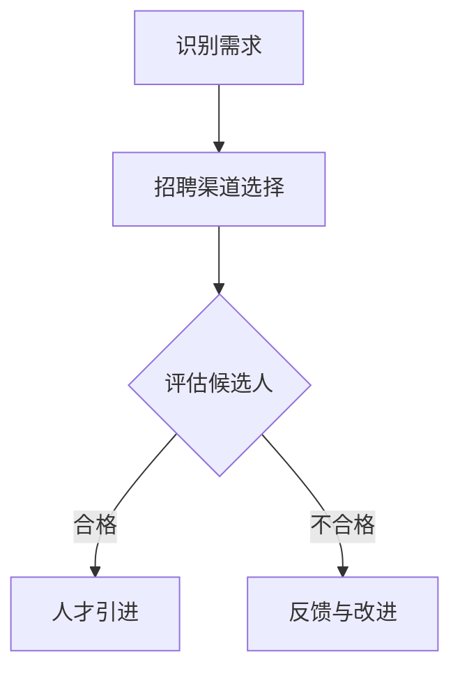
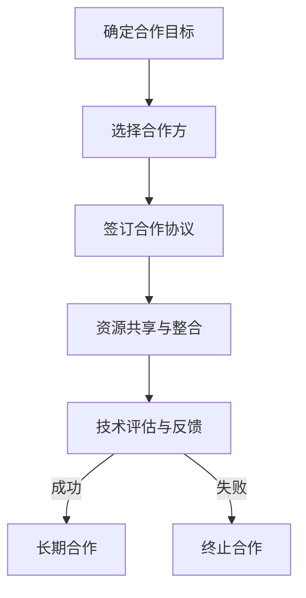
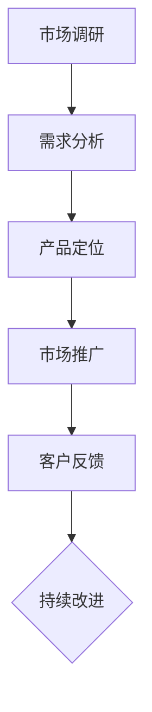
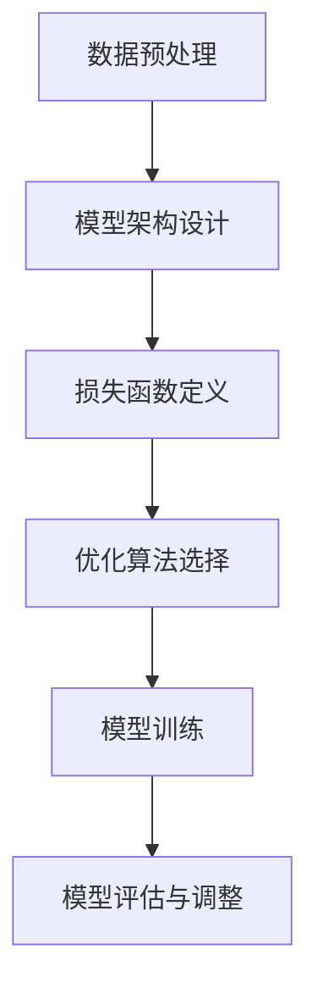
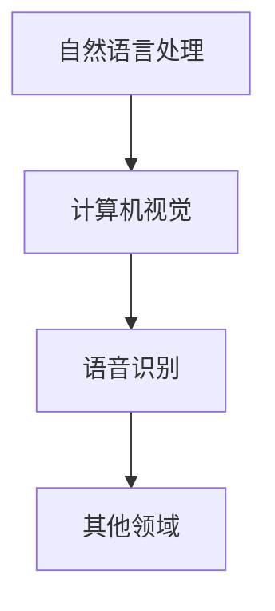
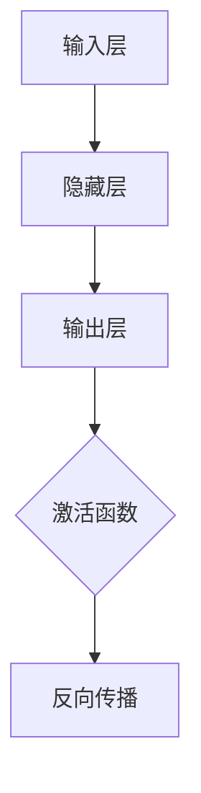

                 

关键词：大模型时代、创业者、资源整合、人才引进、技术合作、市场拓展

摘要：随着人工智能技术的发展，大模型时代已经到来，创业者面临着前所未有的机遇和挑战。本文将探讨在人工智能大模型时代，创业者如何有效整合人才、技术资源和市场拓展，提高创业成功率。

## 1. 背景介绍

近年来，人工智能（AI）技术飞速发展，特别是在深度学习和大规模预训练模型领域取得了显著突破。大模型，如GPT-3、BERT等，已经在自然语言处理、计算机视觉、语音识别等领域展现了强大的能力，这些模型通常需要巨大的计算资源和数据集来进行训练。这一趋势给创业者带来了巨大的机遇，但也带来了新的挑战。

在人工智能大模型时代，创业者需要具备以下几方面的能力：

1. **人才引进**：掌握先进技术的人才成为企业的核心资源。
2. **技术合作**：通过合作获取技术和资源，降低研发成本。
3. **市场拓展**：准确把握市场需求，快速响应市场变化。

## 2. 核心概念与联系

在探讨创业者如何整合资源之前，我们先来理解几个核心概念：人才、技术和市场。

### 2.1. 人才

人才是指具备专业技能和创新能力的人员，他们是企业发展的核心动力。在人工智能领域，人才的重要性尤为突出。以下是一个简化的Mermaid流程图，展示人才引进的基本流程：



### 2.2. 技术

技术是指企业在特定领域内所掌握的知识、技能和工具。在人工智能领域，技术包括算法、模型、工具链等。以下是技术合作的基本流程：



### 2.3. 市场

市场是指企业产品或服务的目标客户群体。市场拓展的核心在于了解客户需求，提供符合市场期望的产品或服务。以下是市场拓展的基本流程：



## 3. 核心算法原理 & 具体操作步骤

### 3.1. 算法原理概述

大模型训练通常基于深度学习算法，特别是变分自编码器（VAE）、生成对抗网络（GAN）等。以下是一个简化的算法原理流程：



### 3.2. 算法步骤详解

1. **数据预处理**：包括数据清洗、归一化等步骤，确保数据质量。
2. **模型架构设计**：选择合适的模型架构，如CNN、RNN等。
3. **损失函数定义**：定义用于衡量模型性能的损失函数。
4. **优化算法选择**：选择如SGD、Adam等优化算法。
5. **模型训练**：使用训练数据对模型进行训练。
6. **模型评估与调整**：使用验证数据评估模型性能，并进行调整。

### 3.3. 算法优缺点

**优点**：

- **高效性**：大模型能够处理大量数据，提高模型的准确性。
- **灵活性**：大模型可以应用于多个领域，实现跨领域的知识迁移。

**缺点**：

- **计算资源消耗大**：大模型训练需要大量的计算资源和时间。
- **数据依赖性强**：模型性能高度依赖于数据集的质量。

### 3.4. 算法应用领域

大模型广泛应用于自然语言处理、计算机视觉、语音识别等领域。以下是一个简化的应用领域流程：



## 4. 数学模型和公式 & 详细讲解 & 举例说明

### 4.1. 数学模型构建

在深度学习中，常用的数学模型包括神经网络、生成模型等。以下是一个简化的神经网络模型构建过程：



### 4.2. 公式推导过程

假设有一个简单的多层感知机（MLP）模型，其输出可以通过以下公式计算：

$$
Z = X \cdot W + b
$$

$$
\hat{Y} = \sigma(Z)
$$

其中，$X$ 是输入向量，$W$ 是权重矩阵，$b$ 是偏置向量，$\sigma$ 是激活函数，$\hat{Y}$ 是输出。

### 4.3. 案例分析与讲解

以图像分类任务为例，假设我们要训练一个模型来识别猫和狗。以下是模型的训练过程：

1. **数据预处理**：对图像进行归一化处理。
2. **模型构建**：选择一个适合图像分类的模型架构，如ResNet。
3. **模型训练**：使用训练数据对模型进行训练。
4. **模型评估**：使用验证数据评估模型性能。
5. **模型调整**：根据评估结果调整模型参数。

## 5. 项目实践：代码实例和详细解释说明

### 5.1. 开发环境搭建

在本地环境搭建一个深度学习开发环境，可以使用如下步骤：

1. 安装Python环境。
2. 安装深度学习框架，如TensorFlow或PyTorch。
3. 安装必要的依赖库。

### 5.2. 源代码详细实现

以下是一个简单的TensorFlow代码示例，用于训练一个图像分类模型：

```python
import tensorflow as tf
from tensorflow.keras import layers

# 数据预处理
(x_train, y_train), (x_test, y_test) = tf.keras.datasets.cifar10.load_data()
x_train, x_test = x_train / 255.0, x_test / 255.0

# 模型构建
model = tf.keras.Sequential([
    layers.Conv2D(32, (3, 3), activation='relu', input_shape=(32, 32, 3)),
    layers.MaxPooling2D((2, 2)),
    layers.Conv2D(64, (3, 3), activation='relu'),
    layers.MaxPooling2D((2, 2)),
    layers.Flatten(),
    layers.Dense(64, activation='relu'),
    layers.Dense(10, activation='softmax')
])

# 模型训练
model.compile(optimizer='adam',
              loss=tf.keras.losses.SparseCategoricalCrossentropy(from_logits=True),
              metrics=['accuracy'])

model.fit(x_train, y_train, epochs=10, validation_data=(x_test, y_test))
```

### 5.3. 代码解读与分析

上述代码首先导入了TensorFlow库，并加载了CIFAR-10数据集。然后，构建了一个简单的卷积神经网络模型，包括两个卷积层、两个池化层、一个全连接层和一个softmax输出层。模型使用Adam优化器进行训练，并使用稀疏分类交叉熵作为损失函数。

### 5.4. 运行结果展示

运行上述代码，可以在训练过程中看到模型的损失和准确率的变化。训练完成后，可以使用测试数据集评估模型的性能。

```python
test_loss, test_acc = model.evaluate(x_test,  y_test, verbose=2)
print(f'\nTest accuracy: {test_acc:.4f}')
```

## 6. 实际应用场景

在实际应用中，创业者可以利用大模型技术进行：

- **智能客服**：利用自然语言处理技术，实现自动化客服系统。
- **图像识别**：利用计算机视觉技术，实现自动图像识别和分类。
- **语音合成**：利用语音识别和生成技术，实现智能语音助手。

## 7. 未来应用展望

随着人工智能技术的不断发展，大模型将在更多领域得到应用。例如，在医疗领域，大模型可以用于疾病诊断和预测；在金融领域，大模型可以用于风险管理；在能源领域，大模型可以用于智能电网管理。

## 8. 工具和资源推荐

### 8.1. 学习资源推荐

- 《深度学习》（Goodfellow et al.）
- 《动手学深度学习》（A. Bastian et al.）
- 《Python深度学习》（François Chollet）

### 8.2. 开发工具推荐

- TensorFlow
- PyTorch
- Jupyter Notebook

### 8.3. 相关论文推荐

- “An Image Database Benchmark” (J. H. Foley et al.)
- “Generative Adversarial Nets” (I. Goodfellow et al.)
- “Bert: Pre-training of Deep Bidirectional Transformers for Language Understanding” (J. Devlin et al.)

## 9. 总结：未来发展趋势与挑战

### 9.1. 研究成果总结

近年来，人工智能大模型取得了显著成果，广泛应用于各个领域。

### 9.2. 未来发展趋势

随着计算资源和算法的不断发展，大模型将更加高效、通用。

### 9.3. 面临的挑战

- **数据隐私和安全**：大模型训练需要大量数据，如何保护数据隐私是一个重要挑战。
- **计算资源消耗**：大模型训练需要大量计算资源，如何优化计算效率是一个重要问题。

### 9.4. 研究展望

未来，大模型将在更多领域得到应用，为创业者提供更多机遇。

## 10. 附录：常见问题与解答

### 10.1. 什么是大模型？

大模型是指参数数量巨大、计算量庞大的深度学习模型，如GPT-3、BERT等。

### 10.2. 如何进行人才引进？

通过招聘渠道、社交媒体、猎头等途径寻找合适的人才，并进行面试和评估。

### 10.3. 技术合作如何进行？

确定合作目标、选择合适的合作方、签订合作协议、进行资源共享和整合。

### 10.4. 如何进行市场拓展？

进行市场调研、分析需求、定位产品、推广产品，并收集客户反馈进行改进。

---

### 10.5. 如何优化大模型训练效率？

- 使用分布式训练。
- 优化数据预处理。
- 选择合适的优化算法。
- 使用现有的高效深度学习框架。

---

**作者：禅与计算机程序设计艺术 / Zen and the Art of Computer Programming**。

