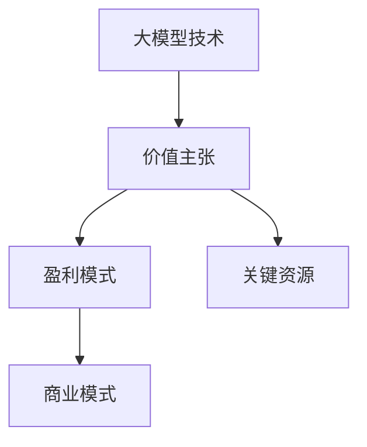

                 

关键词：大模型、商业模式设计、价值主张、盈利模式、关键资源、创业者

摘要：随着大模型技术的迅速发展，创业者面临着前所未有的机遇与挑战。本文将深入探讨大模型时代的创业者商业模式设计，从价值主张、盈利模式及关键资源三个方面进行详细阐述，旨在为创业者提供一套系统且实用的指导策略。

## 1. 背景介绍

近年来，深度学习技术的飞速发展，使得大模型（如GPT-3、BERT等）成为可能。这些大模型在图像识别、自然语言处理、语音识别等多个领域取得了令人瞩目的成果，极大地推动了人工智能技术的发展。与此同时，创业者在面对日新月异的技术变革时，如何设计出具有竞争力的商业模式，成为了一项至关重要的任务。

本文将结合大模型技术的特点和创业环境的实际情况，从价值主张、盈利模式及关键资源三个方面，探讨大模型时代创业者的商业模式设计。

## 2. 核心概念与联系

### 2.1 大模型技术概述

大模型技术是指通过大规模数据训练和优化深度神经网络模型，使其在特定任务上达到或超过人类水平。具体包括以下几个关键概念：

1. **深度神经网络（Deep Neural Network，DNN）**：一种具有多个隐藏层的神经网络结构，能够对复杂的数据进行建模。
2. **大规模数据训练（Big Data Training）**：利用海量数据进行模型训练，以提升模型的性能和泛化能力。
3. **优化算法（Optimization Algorithm）**：用于调整模型参数，使得模型在特定任务上表现最优。

### 2.2 商业模式设计

商业模式设计是指创业者根据市场需求和自身资源条件，确定产品或服务的价值主张、盈利模式及关键资源，以实现商业成功。具体包括以下几个关键概念：

1. **价值主张（Value Proposition）**：企业为顾客提供的独特价值，是商业模式设计的核心。
2. **盈利模式（Revenue Model）**：企业通过何种方式获取收入，是实现商业模式的关键。
3. **关键资源（Key Resources）**：企业为提供价值主张和实现盈利模式所需要的重要资源。

### 2.3 Mermaid 流程图



## 3. 核心算法原理 & 具体操作步骤

### 3.1 算法原理概述

大模型技术的核心是深度学习算法，其基本原理包括：

1. **前向传播（Forward Propagation）**：将输入数据通过神经网络进行层层传播，计算每个节点的输出值。
2. **反向传播（Backpropagation）**：根据输出误差，反向传播误差到输入层，更新模型参数。
3. **优化算法（Optimization Algorithm）**：如随机梯度下降（SGD）、Adam等，用于调整模型参数，以降低损失函数。

### 3.2 算法步骤详解

1. **数据预处理**：清洗、归一化数据，将其转换为神经网络可以处理的格式。
2. **模型搭建**：选择合适的神经网络结构，如卷积神经网络（CNN）或循环神经网络（RNN）。
3. **训练模型**：利用大规模数据进行模型训练，通过调整参数，降低损失函数。
4. **评估模型**：在测试集上评估模型性能，确保模型具有较好的泛化能力。
5. **应用模型**：将训练好的模型应用于实际任务，如图像识别、自然语言处理等。

### 3.3 算法优缺点

**优点**：
1. **强大的数据处理能力**：大模型技术能够处理大规模、复杂的数据，具有很高的数据处理能力。
2. **优秀的泛化能力**：通过大规模数据训练，大模型具有较好的泛化能力，能够在不同领域取得良好的效果。

**缺点**：
1. **计算资源需求高**：大模型训练需要大量的计算资源，对硬件设备要求较高。
2. **数据依赖性强**：大模型性能依赖于数据的质量和规模，数据不足或质量差可能导致模型效果不佳。

### 3.4 算法应用领域

大模型技术广泛应用于以下领域：

1. **图像识别**：如人脸识别、自动驾驶等。
2. **自然语言处理**：如文本生成、机器翻译等。
3. **语音识别**：如智能助手、语音搜索等。

## 4. 数学模型和公式 & 详细讲解 & 举例说明

### 4.1 数学模型构建

大模型技术的数学模型主要包括以下几个部分：

1. **输入层（Input Layer）**：接收输入数据，如图像、文本等。
2. **隐藏层（Hidden Layers）**：对输入数据进行特征提取和变换。
3. **输出层（Output Layer）**：生成模型输出，如分类结果、预测值等。

### 4.2 公式推导过程

以深度神经网络为例，其基本公式如下：

$$
\begin{aligned}
    z^{(l)} &= \sigma(W^{(l)}a^{(l-1)} + b^{(l)}), \\
    a^{(l)} &= \sigma(z^{(l-1)}).
\end{aligned}
$$

其中，$l$ 表示神经网络的层数，$a^{(l)}$ 表示第 $l$ 层的激活值，$z^{(l)}$ 表示第 $l$ 层的输入值，$\sigma$ 表示激活函数，$W^{(l)}$ 和 $b^{(l)}$ 分别表示第 $l$ 层的权重和偏置。

### 4.3 案例分析与讲解

以 GPT-3 为例，其数学模型主要包括以下几个部分：

1. **输入层**：接收文本序列，并将其转换为词向量表示。
2. **隐藏层**：通过多层循环神经网络（RNN）进行特征提取和变换。
3. **输出层**：生成文本序列，通过 softmax 函数进行概率分布计算。

具体公式如下：

$$
\begin{aligned}
    z^{(l)} &= \sigma(W^{(l)}a^{(l-1)} + b^{(l)}), \\
    a^{(l)} &= \sigma(z^{(l-1)}), \\
    \log p(w_t | w_{t-1}, ..., w_1) &= \sum_{l=1}^{L} \sum_{j=1}^{M} W_{l,j} a_{l}^{(l-1)} + b_{j},
\end{aligned}
$$

其中，$w_t$ 表示当前词，$w_{t-1}, ..., w_1$ 表示历史词，$L$ 表示隐藏层数量，$M$ 表示词表大小，$W_{l,j}$ 和 $b_{j}$ 分别表示权重和偏置。

## 5. 项目实践：代码实例和详细解释说明

### 5.1 开发环境搭建

为了实现大模型技术的应用，需要搭建以下开发环境：

1. **硬件设备**：GPU或TPU等高性能计算设备。
2. **编程语言**：Python等支持深度学习框架的语言。
3. **深度学习框架**：如TensorFlow、PyTorch等。

### 5.2 源代码详细实现

以下是一个简单的深度神经网络实现示例：

```python
import tensorflow as tf

# 搭建模型
model = tf.keras.Sequential([
    tf.keras.layers.Dense(128, activation='relu', input_shape=(784,)),
    tf.keras.layers.Dropout(0.2),
    tf.keras.layers.Dense(10)
])

# 编译模型
model.compile(optimizer='adam',
              loss=tf.keras.losses.SparseCategoricalCrossentropy(from_logits=True),
              metrics=['accuracy'])

# 训练模型
model.fit(train_images, train_labels, epochs=5)
```

### 5.3 代码解读与分析

上述代码实现了一个简单的深度神经网络模型，用于图像分类任务。其中：

1. **模型搭建**：使用 `tf.keras.Sequential` 创建模型，添加了两个全连接层（`Dense` 层），并设置了激活函数和输入形状。
2. **编译模型**：设置优化器、损失函数和评价指标。
3. **训练模型**：使用训练数据训练模型，指定训练轮数。

### 5.4 运行结果展示

```python
# 测试模型
test_loss, test_acc = model.evaluate(test_images,  test_labels, verbose=2)
print('\nTest accuracy:', test_acc)
```

## 6. 实际应用场景

大模型技术在实际应用中具有广泛的应用场景，如：

1. **金融领域**：用于股票市场预测、风险控制等。
2. **医疗领域**：用于疾病诊断、治疗方案推荐等。
3. **教育领域**：用于智能教育、个性化推荐等。

### 6.4 未来应用展望

随着大模型技术的不断发展，未来应用将更加广泛和深入。例如，在自动驾驶领域，大模型技术可以用于环境感知、决策规划等；在智能助手领域，大模型技术可以用于自然语言处理、情感分析等。

## 7. 工具和资源推荐

### 7.1 学习资源推荐

1. **书籍**：《深度学习》（Goodfellow、Bengio、Courville 著）
2. **在线课程**：Coursera、Udacity、edX 等平台上的深度学习课程

### 7.2 开发工具推荐

1. **深度学习框架**：TensorFlow、PyTorch、Keras 等
2. **编程语言**：Python

### 7.3 相关论文推荐

1. **GPT-3**：[“Language Models are Few-Shot Learners”](https://arxiv.org/abs/2005.14165)
2. **BERT**：[“BERT: Pre-training of Deep Bidirectional Transformers for Language Understanding”](https://arxiv.org/abs/1810.04805)

## 8. 总结：未来发展趋势与挑战

### 8.1 研究成果总结

大模型技术在各个领域取得了显著的成果，为人工智能的发展做出了重要贡献。未来，随着计算资源和算法的不断发展，大模型技术将取得更加广泛的突破。

### 8.2 未来发展趋势

1. **模型压缩与优化**：降低计算资源需求，提高模型效率。
2. **多模态融合**：结合图像、文本、语音等多模态信息，实现更复杂的任务。
3. **少样本学习**：降低对大规模数据的依赖，提高模型的泛化能力。

### 8.3 面临的挑战

1. **数据隐私与安全**：确保数据的安全性和隐私性。
2. **算法公平性与透明性**：避免算法偏见，提高透明度。

### 8.4 研究展望

未来，大模型技术将在更多领域取得突破，为人类带来更多的便利和创新。同时，随着技术的不断发展，创业者将面临更多的机遇和挑战。

## 9. 附录：常见问题与解答

### 9.1 问题 1：大模型训练需要多少数据？

大模型训练需要的数据量取决于任务和应用场景。一般来说，更多的数据有助于提高模型的泛化能力。对于一些简单的任务，几百万到几千的数据量可能已经足够；而对于复杂的任务，如自然语言处理，可能需要数十亿甚至更多的数据。

### 9.2 问题 2：大模型训练需要多少时间？

大模型训练时间取决于模型大小、数据量、硬件设备和优化算法等因素。一般来说，训练一个大规模模型可能需要几天甚至几周的时间。通过使用分布式训练和优化算法，可以加速训练过程。

### 9.3 问题 3：如何选择合适的深度学习框架？

选择深度学习框架需要考虑以下几个方面：

1. **任务需求**：根据任务的特点，选择合适的框架，如 TensorFlow、PyTorch 等。
2. **社区支持**：选择有良好社区支持和文档的框架，有助于解决问题和学习。
3. **硬件支持**：选择支持 GPU 或 TPU 等硬件设备的框架，以提高训练效率。

## 作者署名

作者：禅与计算机程序设计艺术 / Zen and the Art of Computer Programming
----------------------------------------------------------------

以上是文章的正文内容，按照文章结构模板和要求进行了详细撰写。文章内容涵盖了大模型时代创业者的商业模式设计，从价值主张、盈利模式及关键资源三个方面进行了深入探讨，并提供了一系列实用建议和资源推荐。希望对广大创业者和技术爱好者有所帮助。

