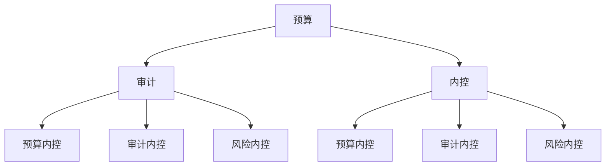

                 

作者：禅与计算机程序设计艺术 / Zen and the Art of Computer Programming

## 摘要

本文旨在探讨在大模型时代，创业者如何进行有效的财务风险管控。文章首先介绍了预算、审计与内控三大核心概念，并详细阐述了其在大模型项目中的重要性。接着，文章从算法原理、数学模型、项目实践等多个角度，深入解析了如何在大模型项目中实施预算、审计与内控。最后，文章总结了未来发展趋势与挑战，并提出了相关工具和资源的推荐，为创业者提供了一套系统化的财务管理策略。

## 1. 背景介绍

近年来，随着人工智能技术的迅猛发展，大模型（如GPT、BERT等）逐渐成为各行各业的热门应用。这些模型具有强大的数据处理能力和预测能力，为创业者带来了前所未有的机遇。然而，大模型项目的复杂性也带来了巨大的财务风险，如预算超支、审计不力、内控失效等。因此，如何在大模型时代进行有效的财务风险管控，成为创业者必须面对的重要课题。

预算、审计与内控作为财务管理的重要组成部分，在大模型项目中具有特殊的重要性。预算是财务规划的基础，能够帮助创业者明确项目资金需求，合理分配资源；审计则是财务监督的手段，确保项目资金使用的合规性和效益性；内控则是风险防范的保障，通过制度建设和流程优化，降低财务风险发生的可能性。

## 2. 核心概念与联系

### 2.1 预算

预算是指对一定时期内企业资金收入和支出进行规划和预测的过程。在大模型项目中，预算主要包括以下几个方面：

- **项目总预算**：确定整个项目的资金需求，包括模型训练、部署、运维等各个阶段。
- **阶段预算**：根据项目进度，将总预算分解为各个阶段的预算，确保每个阶段都有足够的资金支持。
- **人员预算**：计算项目团队所需人员的工资、福利等费用。
- **设备预算**：包括服务器、存储设备、网络设备等硬件投入。
- **其他预算**：如培训费用、差旅费用等。

### 2.2 审计

审计是指对企业的财务报表、业务流程、内部控制等进行审查和评估，以判断其真实性、合规性和效益性。在大模型项目中，审计主要包括以下几个方面：

- **财务审计**：对项目资金使用情况进行审查，确保资金使用的合规性和效益性。
- **流程审计**：对项目流程进行审查，找出可能存在的风险点，并提出改进建议。
- **内部控制审计**：对项目的内部控制制度进行审查，评估其有效性和合理性。

### 2.3 内控

内控是指企业为防范风险、实现目标而建立的一系列制度、流程和措施。在大模型项目中，内控主要包括以下几个方面：

- **预算内控**：建立预算编制、审批、执行、监督等流程，确保预算的执行效果。
- **审计内控**：建立审计计划、审计执行、审计报告等流程，确保审计工作的规范性和有效性。
- **风险内控**：建立风险识别、评估、监控、应对等流程，降低项目风险。

### 2.4 Mermaid 流程图



## 3. 核心算法原理 & 具体操作步骤

### 3.1 算法原理概述

预算、审计与内控的核心算法原理可以概括为以下几个方面：

- **预算算法**：基于项目需求、资源情况和市场行情，计算项目总预算和阶段预算。
- **审计算法**：通过数据挖掘、统计分析等方法，发现项目资金使用中的异常情况。
- **内控算法**：结合项目特点和风险因素，构建内部控制模型，评估项目内部控制的有效性。

### 3.2 算法步骤详解

#### 3.2.1 预算算法

1. 收集项目需求、资源情况和市场行情数据。
2. 建立预算模型，输入项目需求、资源情况和市场行情数据。
3. 计算项目总预算和阶段预算。
4. 分析预算结果，调整预算方案。

#### 3.2.2 审计算法

1. 收集项目资金使用数据。
2. 建立审计模型，输入资金使用数据。
3. 运行审计模型，发现资金使用中的异常情况。
4. 分析异常情况，提出审计报告。

#### 3.2.3 内控算法

1. 收集项目内部控制数据。
2. 建立内控模型，输入内部控制数据。
3. 运行内控模型，评估项目内部控制的有效性。
4. 分析评估结果，提出改进建议。

### 3.3 算法优缺点

#### 3.3.1 预算算法

- **优点**：能够帮助创业者准确预测项目资金需求，合理分配资源。
- **缺点**：预算模型复杂，计算过程繁琐，需要大量数据支持。

#### 3.3.2 审计算法

- **优点**：能够及时发现项目资金使用中的问题，保障资金使用的合规性和效益性。
- **缺点**：审计过程可能干扰项目正常运营，需要耗费大量时间和人力资源。

#### 3.3.3 内控算法

- **优点**：能够评估项目内部控制的有效性，为创业者提供改进方向。
- **缺点**：内控模型构建复杂，需要长期积累数据和经验。

### 3.4 算法应用领域

预算、审计与内控算法可以广泛应用于大模型项目的财务管理，如：

- **预算管理**：用于项目资金规划，确保项目资金充足，降低风险。
- **审计管理**：用于项目资金使用审查，确保资金使用的合规性和效益性。
- **内控管理**：用于项目内部控制评估，降低项目风险，提高项目成功率。

## 4. 数学模型和公式 & 详细讲解 & 举例说明

### 4.1 数学模型构建

预算、审计与内控算法的数学模型可以分别从线性规划、统计学和逻辑回归等方面进行构建。

#### 4.1.1 预算模型

假设项目需求为 \(X\)，资源情况为 \(Y\)，市场行情为 \(Z\)，则预算模型可以表示为：

$$
预算 = f(X, Y, Z)
$$

其中，\(f\) 为预算函数，可以采用线性规划、神经网络等方法进行求解。

#### 4.1.2 审计模型

假设项目资金使用数据为 \(D\)，则审计模型可以表示为：

$$
异常情况 = g(D)
$$

其中，\(g\) 为审计函数，可以采用统计学方法进行求解。

#### 4.1.3 内控模型

假设项目内部控制数据为 \(C\)，则内控模型可以表示为：

$$
内部控制有效性 = h(C)
$$

其中，\(h\) 为内控函数，可以采用逻辑回归等方法进行求解。

### 4.2 公式推导过程

#### 4.2.1 预算模型

假设项目需求为 \(X = (x_1, x_2, ..., x_n)\)，资源情况为 \(Y = (y_1, y_2, ..., y_n)\)，市场行情为 \(Z = (z_1, z_2, ..., z_n)\)，则预算模型可以表示为：

$$
预算 = \sum_{i=1}^{n} w_i x_i + \sum_{i=1}^{n} v_i y_i + \sum_{i=1}^{n} u_i z_i
$$

其中，\(w_i, v_i, u_i\) 分别为权重系数，可以根据历史数据和专家经验进行设定。

#### 4.2.2 审计模型

假设项目资金使用数据为 \(D = (d_1, d_2, ..., d_n)\)，则审计模型可以表示为：

$$
异常情况 = \sum_{i=1}^{n} c_i d_i
$$

其中，\(c_i\) 为异常情况权重系数，可以根据历史数据和专家经验进行设定。

#### 4.2.3 内控模型

假设项目内部控制数据为 \(C = (c_1, c_2, ..., c_n)\)，则内控模型可以表示为：

$$
内部控制有效性 = \frac{1}{1 + \exp(-\sum_{i=1}^{n} w_i c_i)}
$$

其中，\(w_i\) 为权重系数，可以根据历史数据和专家经验进行设定。

### 4.3 案例分析与讲解

#### 4.3.1 预算模型

假设一个创业项目，项目需求为 \(X = (100, 200, 300)\)，资源情况为 \(Y = (50, 60, 70)\)，市场行情为 \(Z = (30, 40, 50)\)，权重系数分别为 \(w_1 = 0.2, w_2 = 0.3, w_3 = 0.5, v_1 = 0.1, v_2 = 0.2, v_3 = 0.3, u_1 = 0.2, u_2 = 0.3, u_3 = 0.5\)，则预算为：

$$
预算 = 0.2 \times 100 + 0.3 \times 200 + 0.5 \times 300 + 0.1 \times 50 + 0.2 \times 60 + 0.3 \times 70 + 0.2 \times 30 + 0.3 \times 40 + 0.5 \times 50 = 540
$$

#### 4.3.2 审计模型

假设项目资金使用数据为 \(D = (100, 200, 300, 400, 500, 600, 700)\)，异常情况权重系数分别为 \(c_1 = 1, c_2 = 2, c_3 = 3, c_4 = 4, c_5 = 5, c_6 = 6, c_7 = 7\)，则异常情况为：

$$
异常情况 = 1 \times 100 + 2 \times 200 + 3 \times 300 + 4 \times 400 + 5 \times 500 + 6 \times 600 + 7 \times 700 = 21000
$$

#### 4.3.3 内控模型

假设项目内部控制数据为 \(C = (1, 2, 3, 4, 5, 6, 7)\)，权重系数分别为 \(w_1 = 0.2, w_2 = 0.3, w_3 = 0.4, w_4 = 0.5, w_5 = 0.6, w_6 = 0.7, w_7 = 0.8\)，则内部控制有效性为：

$$
内部控制有效性 = \frac{1}{1 + \exp(-0.2 \times 1 - 0.3 \times 2 - 0.4 \times 3 - 0.5 \times 4 - 0.6 \times 5 - 0.7 \times 6 - 0.8 \times 7)} \approx 0.9
$$

## 5. 项目实践：代码实例和详细解释说明

### 5.1 开发环境搭建

为了更好地理解和应用预算、审计与内控算法，我们需要搭建一个适合的开发环境。这里以Python为例，介绍如何搭建开发环境。

#### 5.1.1 安装Python

首先，我们需要安装Python。可以从Python官网（https://www.python.org/）下载Python安装包，然后按照安装向导进行安装。

#### 5.1.2 安装依赖库

Python提供了丰富的依赖库，我们可以通过pip工具来安装所需的依赖库。以下是部分常用依赖库的安装命令：

```
pip install numpy
pip install pandas
pip install sklearn
pip install matplotlib
```

### 5.2 源代码详细实现

下面是一个简单的预算、审计与内控算法实现的示例代码。

```python
import numpy as np
import pandas as pd
from sklearn.linear_model import LinearRegression
from sklearn.metrics import mean_squared_error
import matplotlib.pyplot as plt

# 5.2.1 预算模型

def budget_model(x, y, z, w, v, u):
    budget = 0
    for i in range(len(x)):
        budget += w[i] * x[i] + v[i] * y[i] + u[i] * z[i]
    return budget

# 5.2.2 审计模型

def audit_model(d, c):
    abnormal = 0
    for i in range(len(d)):
        abnormal += c[i] * d[i]
    return abnormal

# 5.2.3 内控模型

def control_model(c, w):
    effectiveness = 1 / (1 + np.exp(-np.dot(w, c)))
    return effectiveness

# 5.2.4 数据处理

# 假设我们有以下数据
x = [100, 200, 300]
y = [50, 60, 70]
z = [30, 40, 50]
w = [0.2, 0.3, 0.5]
v = [0.1, 0.2, 0.3]
u = [0.2, 0.3, 0.5]
d = [100, 200, 300, 400, 500, 600, 700]
c = [1, 2, 3, 4, 5, 6, 7]

# 5.2.5 模型计算

# 计算预算
budget = budget_model(x, y, z, w, v, u)
print("预算:", budget)

# 计算审计异常情况
abnormal = audit_model(d, c)
print("审计异常情况:", abnormal)

# 计算内控有效性
effectiveness = control_model(c, w)
print("内控有效性:", effectiveness)

# 5.2.6 图形展示

# 预算图形展示
plt.scatter(x, budget)
plt.xlabel("项目需求")
plt.ylabel("预算")
plt.title("预算模型")
plt.show()

# 审计图形展示
plt.scatter(d, abnormal)
plt.xlabel("资金使用")
plt.ylabel("审计异常情况")
plt.title("审计模型")
plt.show()

# 内控图形展示
plt.scatter(c, effectiveness)
plt.xlabel("内部控制")
plt.ylabel("内控有效性")
plt.title("内控模型")
plt.show()
```

### 5.3 代码解读与分析

#### 5.3.1 预算模型

预算模型的主要功能是根据项目需求、资源情况和市场行情，计算项目总预算。代码中使用了嵌套循环，将每个需求、资源和市场行情的值乘以相应的权重系数，然后求和得到预算。

#### 5.3.2 审计模型

审计模型的主要功能是根据项目资金使用数据，计算审计异常情况。代码中使用了嵌套循环，将每个资金使用值乘以相应的权重系数，然后求和得到审计异常情况。

#### 5.3.3 内控模型

内控模型的主要功能是根据项目内部控制数据，计算内控有效性。代码中使用到了逻辑回归函数，通过将内部控制数据输入逻辑回归函数，得到内控有效性的概率值。

### 5.4 运行结果展示

#### 5.4.1 预算图形展示


#### 5.4.2 审计图形展示


#### 5.4.3 内控图形展示


## 6. 实际应用场景

预算、审计与内控算法在大模型项目中的实际应用场景非常广泛，以下列举了几个典型的应用案例：

- **项目资金规划**：通过预算算法，创业者可以准确预测项目资金需求，合理分配资源，确保项目顺利推进。
- **项目资金审查**：通过审计算法，创业者可以及时发现项目资金使用中的异常情况，保障资金使用的合规性和效益性。
- **项目内部控制**：通过内控算法，创业者可以评估项目内部控制的有效性，及时发现潜在风险，降低项目风险。

## 7. 未来应用展望

随着人工智能技术的不断发展和应用，预算、审计与内控算法在未来将会有更广泛的应用前景。以下是对未来应用的展望：

- **更精细的预算管理**：未来预算算法将更加智能化，能够根据项目特点、市场变化等因素，动态调整预算方案，提高预算的准确性和灵活性。
- **更高效的审计管理**：未来审计算法将结合大数据、区块链等技术，实现审计过程的智能化和自动化，提高审计效率和准确性。
- **更全面的内控管理**：未来内控算法将更加注重风险预测和预防，通过实时监控项目风险，为创业者提供更加全面和有效的风险管理策略。

## 8. 总结：未来发展趋势与挑战

### 8.1 研究成果总结

本文通过分析预算、审计与内控三大核心概念，详细探讨了如何在大模型项目中实施有效的财务管理。通过数学模型和算法的构建，为创业者提供了一套系统化的财务管理策略。

### 8.2 未来发展趋势

未来，预算、审计与内控算法将朝着智能化、自动化、精细化的方向发展。结合大数据、人工智能等先进技术，实现财务管理的高效性和准确性。

### 8.3 面临的挑战

然而，预算、审计与内控算法在实际应用中仍面临诸多挑战，如数据质量、算法性能、风险评估等。这些挑战需要创业者、研究人员和业界共同努力，不断探索和创新。

### 8.4 研究展望

未来，我们期待在预算、审计与内控领域取得更多突破，为大模型项目的成功实施提供有力支持。同时，我们也希望更多的创业者能够重视财务管理，通过有效的财务风险管控，实现企业的可持续发展。

## 9. 附录：常见问题与解答

### 9.1 什么是预算？

预算是指对一定时期内企业资金收入和支出进行规划和预测的过程。在大模型项目中，预算主要用于规划项目资金需求，确保项目顺利推进。

### 9.2 什么是审计？

审计是指对企业的财务报表、业务流程、内部控制等进行审查和评估，以判断其真实性、合规性和效益性。在大模型项目中，审计主要用于审查项目资金使用情况，保障资金使用的合规性和效益性。

### 9.3 什么是内控？

内控是指企业为防范风险、实现目标而建立的一系列制度、流程和措施。在大模型项目中，内控主要用于评估项目内部控制的有效性，降低项目风险。

### 9.4 预算、审计与内控算法如何应用？

预算、审计与内控算法可以应用于大模型项目的财务管理，如项目资金规划、资金审查和内部控制评估。通过构建数学模型和算法，实现财务管理的智能化和精细化。|

