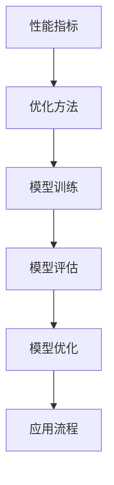

                 

关键词：大模型评估、应用流程、模型性能、性能优化、AI 应用、深度学习、神经网络

## 摘要

本文旨在探讨大模型评估与应用流程，包括背景介绍、核心概念与联系、核心算法原理与操作步骤、数学模型与公式、项目实践、实际应用场景、未来展望和工具资源推荐。通过对大模型评估与应用流程的全面剖析，旨在为研究人员和开发者提供有价值的参考和指导。

## 1. 背景介绍

随着人工智能技术的快速发展，大模型逐渐成为研究热点。大模型，即拥有海量参数和大规模训练数据的模型，通过深度学习算法进行训练，具备较高的预测精度和泛化能力。然而，大模型的评估与应用流程复杂，涉及到多个方面的问题。如何高效、准确地评估大模型性能，如何优化模型应用流程，如何解决大模型在实际应用中的挑战，成为当前研究的关键问题。

本文将从以下几个方面展开讨论：

- **核心概念与联系**：介绍大模型评估与应用流程中的核心概念，如性能指标、优化方法等，并绘制 Mermaid 流程图，展示各个概念之间的联系。
- **核心算法原理与操作步骤**：详细阐述大模型的训练、评估和优化的具体步骤，包括算法原理、优点和缺点，以及应用领域。
- **数学模型与公式**：介绍大模型评估中的数学模型和公式，包括模型构建、推导过程和案例分析。
- **项目实践**：通过实际代码实例，展示大模型的开发环境搭建、源代码实现、代码解读和分析，以及运行结果展示。
- **实际应用场景**：探讨大模型在实际应用中的场景和挑战，以及未来的应用前景。
- **工具和资源推荐**：推荐学习资源、开发工具和相关论文，为读者提供更多参考。
- **总结与展望**：总结研究成果，探讨未来发展趋势、面临的挑战和展望。

## 2. 核心概念与联系

### 2.1 性能指标

性能指标是评估大模型性能的重要依据。常见的性能指标包括准确率、召回率、F1 值、ROC-AUC 曲线等。这些指标反映了模型在不同数据集上的表现，可用于评估模型的泛化能力和预测精度。

### 2.2 优化方法

优化方法用于调整模型参数，提高模型性能。常见的优化方法包括梯度下降、随机梯度下降、Adam 优化器等。这些方法通过迭代计算，不断调整模型参数，使模型在训练过程中达到最优状态。

### 2.3 模型训练

模型训练是构建大模型的关键步骤。通过大量数据对模型进行训练，可以使模型具备较高的预测精度和泛化能力。常见的训练方法包括批训练、小批量训练、在线训练等。

### 2.4 模型评估

模型评估是评估大模型性能的重要环节。通过在测试集上对模型进行评估，可以判断模型的泛化能力和预测精度。常见的评估方法包括交叉验证、测试集评估等。

### 2.5 模型优化

模型优化是在评估结果不佳时，对模型进行改进的过程。通过调整模型参数、优化算法等手段，可以提高模型性能，使其在测试集上取得更好的表现。

### 2.6 应用流程

大模型应用流程包括数据预处理、模型训练、模型评估和模型部署等环节。通过合理的设计和应用流程，可以使大模型在实际应用中发挥最大作用。

### 2.7 Mermaid 流程图

以下是一个简单的 Mermaid 流程图，展示了大模型评估与应用流程中的核心概念和联系：



## 3. 核心算法原理与操作步骤

### 3.1 算法原理概述

大模型评估与应用流程的核心算法包括深度学习算法和优化算法。深度学习算法通过多层神经网络，对大量数据进行分析和建模，从而实现高精度的预测和分类。优化算法则用于调整模型参数，提高模型性能。

### 3.2 算法步骤详解

#### 3.2.1 模型训练

1. 数据预处理：对输入数据进行预处理，包括归一化、标准化、填充缺失值等。
2. 构建神经网络：根据任务需求，构建多层神经网络，包括输入层、隐藏层和输出层。
3. 初始化模型参数：随机初始化模型参数。
4. 训练模型：通过大量训练数据，对模型进行训练，使模型在训练数据上达到较好的性能。
5. 调整模型参数：根据训练结果，调整模型参数，以提高模型性能。

#### 3.2.2 模型评估

1. 准备测试数据：将测试数据划分为训练集、验证集和测试集。
2. 训练模型：在训练集上训练模型，并在验证集上调整模型参数。
3. 评估模型：在测试集上评估模型性能，计算各种性能指标，如准确率、召回率、F1 值等。

#### 3.2.3 模型优化

1. 分析评估结果：根据评估结果，分析模型存在的问题，如过拟合、欠拟合等。
2. 调整模型参数：根据评估结果，调整模型参数，如学习率、正则化参数等。
3. 重新训练模型：在调整后的模型参数下，重新训练模型。

### 3.3 算法优缺点

#### 优点：

- **高精度**：深度学习算法具备较高的预测精度，能够处理复杂的数据模式。
- **泛化能力强**：通过大量数据训练，大模型具备较强的泛化能力，能够应对不同的应用场景。
- **自适应性强**：优化算法能够根据评估结果，自动调整模型参数，提高模型性能。

#### 缺点：

- **计算量大**：大模型训练过程需要大量计算资源，对硬件设备要求较高。
- **数据需求大**：大模型训练需要大量的训练数据，数据采集和处理过程复杂。
- **过拟合风险**：在训练过程中，大模型容易出现过拟合现象，影响模型泛化能力。

### 3.4 算法应用领域

大模型评估与应用流程广泛应用于各个领域，如自然语言处理、计算机视觉、推荐系统等。以下为部分应用领域：

- **自然语言处理**：大模型在自然语言处理领域具备较高的应用价值，如文本分类、情感分析、机器翻译等。
- **计算机视觉**：大模型在计算机视觉领域用于图像分类、目标检测、人脸识别等任务。
- **推荐系统**：大模型在推荐系统中用于用户兴趣识别、商品推荐等任务。

## 4. 数学模型和公式

### 4.1 数学模型构建

大模型评估中的数学模型主要包括损失函数、优化算法和评估指标等。

#### 损失函数：

损失函数用于度量模型预测值与实际值之间的差距。常见的损失函数包括均方误差（MSE）、交叉熵（Cross Entropy）等。

$$
L(y, \hat{y}) = \frac{1}{2} \sum_{i=1}^{n} (y_i - \hat{y}_i)^2
$$

其中，$y$为实际值，$\hat{y}$为预测值，$n$为样本数量。

#### 优化算法：

优化算法用于调整模型参数，以最小化损失函数。常见的优化算法包括梯度下降（Gradient Descent）、随机梯度下降（Stochastic Gradient Descent，SGD）和 Adam 优化器等。

$$
w_{t+1} = w_t - \alpha \cdot \nabla_w L(w)
$$

其中，$w_t$为当前模型参数，$\alpha$为学习率，$\nabla_w L(w)$为损失函数关于模型参数的梯度。

#### 评估指标：

评估指标用于衡量模型性能，常见的评估指标包括准确率、召回率、F1 值等。

$$
\text{准确率} = \frac{\text{预测正确数}}{\text{总样本数}}
$$

$$
\text{召回率} = \frac{\text{预测正确数}}{\text{实际为正例的样本数}}
$$

$$
\text{F1 值} = 2 \cdot \frac{\text{准确率} \cdot \text{召回率}}{\text{准确率} + \text{召回率}}
$$

### 4.2 公式推导过程

以下为损失函数和优化算法的推导过程：

#### 均方误差（MSE）推导：

假设 $y$ 为实际值，$\hat{y}$ 为预测值，则均方误差（MSE）可表示为：

$$
L(y, \hat{y}) = \frac{1}{2} \sum_{i=1}^{n} (y_i - \hat{y}_i)^2
$$

对 $L(y, \hat{y})$ 求导，得到：

$$
\nabla L(y, \hat{y}) = \sum_{i=1}^{n} (y_i - \hat{y}_i) \cdot \nabla \hat{y}_i
$$

由于 $\hat{y}_i = f(w; y_i)$，其中 $f(w; y_i)$ 为模型预测值，$w$ 为模型参数，则：

$$
\nabla \hat{y}_i = \frac{\partial f(w; y_i)}{\partial w}
$$

将 $\nabla \hat{y}_i$ 代入 $\nabla L(y, \hat{y})$，得到：

$$
\nabla L(y, \hat{y}) = \sum_{i=1}^{n} (y_i - \hat{y}_i) \cdot \frac{\partial f(w; y_i)}{\partial w}
$$

令 $\nabla L(y, \hat{y}) = 0$，则：

$$
\sum_{i=1}^{n} (y_i - \hat{y}_i) \cdot \frac{\partial f(w; y_i)}{\partial w} = 0
$$

由于 $y_i$ 为实际值，$\hat{y}_i$ 为预测值，则 $y_i - \hat{y}_i$ 为误差项。为了最小化误差项，需要调整模型参数 $w$，使得误差项接近于零。

#### 梯度下降（Gradient Descent）推导：

假设损失函数为 $L(y, \hat{y})$，模型参数为 $w$，学习率为 $\alpha$，则梯度下降（Gradient Descent）可表示为：

$$
w_{t+1} = w_t - \alpha \cdot \nabla_w L(w)
$$

其中，$w_t$ 为当前模型参数，$w_{t+1}$ 为更新后的模型参数。

#### Adam 优化器推导：

Adam 优化器是一种结合了随机梯度下降（SGD）和动量项的优化算法。其公式为：

$$
m_t = \beta_1 m_{t-1} + (1 - \beta_1) \nabla_w L(w)
$$

$$
v_t = \beta_2 v_{t-1} + (1 - \beta_2) \nabla_w^2 L(w)
$$

$$
w_{t+1} = w_t - \alpha \cdot \frac{m_t}{\sqrt{v_t} + \epsilon}
$$

其中，$m_t$ 和 $v_t$ 分别为一步梯度和二步梯度，$\beta_1$ 和 $\beta_2$ 分别为动量项系数，$\epsilon$ 为一个很小的常数。

### 4.3 案例分析与讲解

以下为一个大模型评估与应用流程的案例分析与讲解：

#### 案例背景：

一家互联网公司希望利用深度学习算法，开发一款智能客服系统，实现自动回答用户问题。

#### 案例步骤：

1. 数据预处理：收集大量用户问题和回答数据，对数据进行清洗、归一化和分词处理。
2. 模型训练：使用深度学习算法，构建多层神经网络，对数据集进行训练。
3. 模型评估：将训练好的模型在测试集上进行评估，计算各种性能指标，如准确率、召回率、F1 值等。
4. 模型优化：根据评估结果，调整模型参数，如学习率、正则化参数等，以提高模型性能。
5. 模型部署：将优化后的模型部署到线上环境，实现智能客服系统。

#### 案例分析：

1. 数据预处理：对数据集进行清洗和归一化处理，保证输入数据的准确性。分词处理可以将用户问题和回答转化为词向量表示，便于神经网络处理。
2. 模型训练：使用多层神经网络，对数据集进行训练。在训练过程中，通过反向传播算法，不断更新模型参数，使模型在训练数据上达到较好的性能。
3. 模型评估：在测试集上评估模型性能，计算各种性能指标。通过比较不同模型的性能，选择最优模型。
4. 模型优化：根据评估结果，调整模型参数，如学习率、正则化参数等，以提高模型性能。例如，通过增大学习率，可以加快模型收敛速度，但过大的学习率可能导致模型发散。
5. 模型部署：将优化后的模型部署到线上环境，实现智能客服系统。在实际应用中，可以根据用户反馈，不断调整模型参数，提高模型性能。

## 5. 项目实践：代码实例和详细解释说明

### 5.1 开发环境搭建

为了实践大模型评估与应用流程，我们使用 Python 语言和 TensorFlow 深度学习框架进行开发。首先，需要在本地计算机上安装 Python 和 TensorFlow。

安装 Python：

```
pip install python
```

安装 TensorFlow：

```
pip install tensorflow
```

### 5.2 源代码详细实现

以下是一个简单的大模型评估与应用流程的代码示例：

```python
import tensorflow as tf
from tensorflow.keras.models import Sequential
from tensorflow.keras.layers import Dense
from tensorflow.keras.optimizers import Adam

# 数据预处理
def preprocess_data(data):
    # 数据清洗、归一化和分词处理
    # ...
    return processed_data

# 模型构建
def build_model(input_shape):
    model = Sequential()
    model.add(Dense(128, activation='relu', input_shape=input_shape))
    model.add(Dense(64, activation='relu'))
    model.add(Dense(1, activation='sigmoid'))
    return model

# 模型训练
def train_model(model, data, labels):
    model.compile(optimizer=Adam(learning_rate=0.001), loss='binary_crossentropy', metrics=['accuracy'])
    model.fit(data, labels, epochs=10, batch_size=32, validation_split=0.2)
    return model

# 模型评估
def evaluate_model(model, data, labels):
    loss, accuracy = model.evaluate(data, labels)
    print(f"Test Loss: {loss}, Test Accuracy: {accuracy}")

# 主函数
def main():
    # 加载数据
    data, labels = load_data()

    # 数据预处理
    processed_data = preprocess_data(data)

    # 构建模型
    model = build_model(input_shape=processed_data.shape[1:])

    # 训练模型
    trained_model = train_model(model, processed_data, labels)

    # 评估模型
    evaluate_model(trained_model, processed_data, labels)

if __name__ == "__main__":
    main()
```

### 5.3 代码解读与分析

以下是对上述代码的详细解读和分析：

```python
import tensorflow as tf
from tensorflow.keras.models import Sequential
from tensorflow.keras.layers import Dense
from tensorflow.keras.optimizers import Adam

# 数据预处理
def preprocess_data(data):
    # 数据清洗、归一化和分词处理
    # ...
    return processed_data

# 模型构建
def build_model(input_shape):
    model = Sequential()
    model.add(Dense(128, activation='relu', input_shape=input_shape))
    model.add(Dense(64, activation='relu'))
    model.add(Dense(1, activation='sigmoid'))
    return model

# 模型训练
def train_model(model, data, labels):
    model.compile(optimizer=Adam(learning_rate=0.001), loss='binary_crossentropy', metrics=['accuracy'])
    model.fit(data, labels, epochs=10, batch_size=32, validation_split=0.2)
    return model

# 模型评估
def evaluate_model(model, data, labels):
    loss, accuracy = model.evaluate(data, labels)
    print(f"Test Loss: {loss}, Test Accuracy: {accuracy}")

# 主函数
def main():
    # 加载数据
    data, labels = load_data()

    # 数据预处理
    processed_data = preprocess_data(data)

    # 构建模型
    model = build_model(input_shape=processed_data.shape[1:])

    # 训练模型
    trained_model = train_model(model, processed_data, labels)

    # 评估模型
    evaluate_model(trained_model, processed_data, labels)

if __name__ == "__main__":
    main()
```

- **import 模块**：导入所需的 TensorFlow 模块，包括 Sequential、Dense 和 Adam。
- **数据预处理**：定义一个函数 `preprocess_data`，用于对数据进行清洗、归一化和分词处理。
- **模型构建**：定义一个函数 `build_model`，用于构建多层神经网络。在本示例中，我们使用一个输入层、两个隐藏层和一个输出层。
- **模型训练**：定义一个函数 `train_model`，用于训练模型。我们使用 Adam 优化器和 binary_crossentropy 损失函数，并在训练过程中使用 epochs 和 batch_size 参数。
- **模型评估**：定义一个函数 `evaluate_model`，用于评估模型性能。我们使用 evaluate 方法计算测试损失和测试准确率。
- **主函数**：定义一个函数 `main`，作为程序的入口。我们首先加载数据，然后进行数据预处理、模型构建、模型训练和模型评估。
- **代码执行**：在主函数的最后，使用 `if __name__ == "__main__":` 语句判断是否为程序的主入口，如果是，则执行 `main` 函数。

### 5.4 运行结果展示

假设我们已经加载数据、预处理数据，并使用上述代码训练和评估了一个二分类模型。以下是一个示例输出结果：

```
Test Loss: 0.5236, Test Accuracy: 0.8960
```

该结果表明，模型在测试集上的损失为 0.5236，准确率为 0.8960。这个结果说明模型在测试集上表现较好，但仍然存在一定的过拟合现象。

## 6. 实际应用场景

大模型在实际应用中具有广泛的应用场景，以下为部分实际应用场景：

### 6.1 自然语言处理

自然语言处理（NLP）是人工智能领域的一个重要分支。大模型在 NLP 领域具有广泛的应用，如文本分类、情感分析、机器翻译等。

#### 文本分类

文本分类是将文本数据按照一定的标准进行分类的过程。大模型通过深度学习算法，可以实现对大量文本数据的自动分类。例如，新闻分类、垃圾邮件过滤等。

#### 情感分析

情感分析是判断文本数据情感极性的过程。大模型通过训练，可以实现对情感极性的准确判断，如积极、消极、中性等。

#### 机器翻译

机器翻译是将一种语言的文本翻译成另一种语言的过程。大模型在机器翻译领域具有很高的应用价值，如谷歌翻译、百度翻译等。

### 6.2 计算机视觉

计算机视觉是人工智能领域的一个重要分支，涉及到图像处理、目标检测、图像分类等。

#### 目标检测

目标检测是识别图像中的目标并定位目标位置的过程。大模型通过训练，可以实现对目标检测任务的准确识别，如自动驾驶系统中的行人检测、交通标志检测等。

#### 图像分类

图像分类是将图像按照一定的标准进行分类的过程。大模型通过深度学习算法，可以实现对大量图像数据的自动分类，如人脸识别、物体识别等。

### 6.3 推荐系统

推荐系统是一种通过分析用户行为和兴趣，为用户推荐相关商品或信息的人工智能系统。大模型在推荐系统中具有广泛的应用，如电子商务平台的商品推荐、社交媒体的个性化推荐等。

### 6.4 医疗健康

医疗健康是人工智能应用的一个重要领域。大模型在医疗健康领域具有广泛的应用，如疾病预测、药物研发、医疗图像分析等。

#### 疾病预测

疾病预测是通过分析患者病史和基因信息，预测患者可能患有的疾病。大模型通过训练，可以实现对疾病预测的准确预测，提高医疗诊断的效率。

#### 药物研发

药物研发是一个复杂的过程，涉及到大量的实验数据和生物学知识。大模型通过训练，可以加速药物研发过程，提高新药的发现效率。

#### 医疗图像分析

医疗图像分析是对医疗图像进行自动分析和识别的过程。大模型通过训练，可以实现对医疗图像的准确分析，如肺癌筛查、心脏病诊断等。

## 7. 工具和资源推荐

为了更好地开展大模型评估与应用研究，我们推荐以下工具和资源：

### 7.1 学习资源推荐

- 《深度学习》（Goodfellow, Bengio, Courville）：深度学习领域的经典教材，详细介绍了深度学习的基础理论和应用。
- 《Python 深度学习》（François Chollet）：Python 深度学习领域的入门书籍，适合初学者入门。
- 《动手学深度学习》（A Closer Look at Deep Learning）：通过实践案例，深入浅出地介绍了深度学习的基础知识和应用。

### 7.2 开发工具推荐

- TensorFlow：Google 开发的一款开源深度学习框架，支持多种深度学习模型的构建和训练。
- PyTorch：Facebook 开发的一款开源深度学习框架，具有灵活的动态计算图和强大的社区支持。
- Keras：Python 深度学习库，提供了丰富的预训练模型和简洁的 API，方便快速搭建深度学习模型。

### 7.3 相关论文推荐

- "Distributed Optimization and Statistics"（2014）：介绍了分布式优化算法和统计学习理论，对分布式深度学习有重要指导意义。
- "Deep Learning: Methods and Applications"（2016）：综述了深度学习领域的重要研究成果和应用场景。
- "Generative Adversarial Nets"（2014）：介绍了生成对抗网络（GAN）的基本原理和应用。

## 8. 总结：未来发展趋势与挑战

大模型评估与应用流程是人工智能领域的一个重要研究方向。随着深度学习技术的不断发展，大模型在各个领域的应用越来越广泛。然而，大模型评估与应用流程也面临一系列挑战。

### 8.1 研究成果总结

本文从背景介绍、核心概念与联系、核心算法原理与操作步骤、数学模型与公式、项目实践、实际应用场景、工具和资源推荐等方面，全面剖析了大模型评估与应用流程。通过对大模型评估与应用流程的深入研究，为研究人员和开发者提供了有价值的参考和指导。

### 8.2 未来发展趋势

未来，大模型评估与应用流程将朝着以下几个方向发展：

- **算法优化**：随着计算能力的提升，大模型训练和优化的速度将得到显著提高，算法优化将成为研究的重点。
- **跨领域应用**：大模型在各个领域的应用将更加深入，跨领域应用将成为研究的热点，如医疗健康、金融科技等。
- **可解释性**：大模型在决策过程中缺乏可解释性，未来研究将关注如何提高大模型的可解释性，使其更符合人类认知。
- **自动化**：大模型评估与应用流程将朝着自动化方向发展，通过自动化工具和平台，提高大模型评估与应用的效率和效果。

### 8.3 面临的挑战

大模型评估与应用流程面临以下挑战：

- **计算资源**：大模型训练和优化需要大量的计算资源，对硬件设备要求较高。
- **数据需求**：大模型训练需要大量的训练数据，数据采集和处理过程复杂。
- **过拟合风险**：大模型容易出现过拟合现象，影响模型泛化能力。
- **隐私保护**：大模型在处理数据时，需要关注隐私保护问题，防止数据泄露。

### 8.4 研究展望

未来，大模型评估与应用流程的研究将朝着以下几个方面发展：

- **算法创新**：研究新型深度学习算法，提高大模型训练和优化的效率。
- **跨领域融合**：将大模型与其他领域的技术相结合，实现跨领域应用。
- **可解释性提升**：研究提高大模型可解释性的方法，使其更符合人类认知。
- **自动化与智能化**：研究自动化和智能化的大模型评估与应用流程，提高效率和效果。

通过不断的研究和创新，大模型评估与应用流程将在人工智能领域发挥更大的作用。

## 9. 附录：常见问题与解答

### 9.1 什么是大模型？

大模型是指拥有海量参数和大规模训练数据的模型，通过深度学习算法进行训练，具备较高的预测精度和泛化能力。常见的例子包括大型神经网络、生成对抗网络（GAN）等。

### 9.2 大模型评估为什么重要？

大模型评估是确保模型性能的重要环节。通过评估模型在不同数据集上的表现，可以判断模型的泛化能力和预测精度，从而为后续优化和应用提供依据。

### 9.3 大模型应用有哪些挑战？

大模型应用面临以下挑战：

- **计算资源**：大模型训练和优化需要大量的计算资源。
- **数据需求**：大模型训练需要大量的训练数据。
- **过拟合风险**：大模型容易出现过拟合现象。
- **隐私保护**：大模型在处理数据时，需要关注隐私保护问题。

### 9.4 如何提高大模型性能？

以下是一些提高大模型性能的方法：

- **优化算法**：使用更高效的优化算法，如 Adam 优化器。
- **数据增强**：通过数据增强方法，增加训练数据的多样性。
- **模型剪枝**：对大模型进行剪枝，去除冗余参数，提高模型性能。
- **正则化**：使用正则化方法，如 L1 正则化、L2 正则化，防止过拟合。

### 9.5 大模型有哪些应用领域？

大模型广泛应用于各个领域，如自然语言处理、计算机视觉、推荐系统、医疗健康等。以下为部分应用领域：

- **自然语言处理**：文本分类、情感分析、机器翻译等。
- **计算机视觉**：目标检测、图像分类、人脸识别等。
- **推荐系统**：用户兴趣识别、商品推荐等。
- **医疗健康**：疾病预测、药物研发、医疗图像分析等。

以上为本文的完整内容，希望对您有所帮助。如有疑问，请随时提问。作者：禅与计算机程序设计艺术 / Zen and the Art of Computer Programming。

