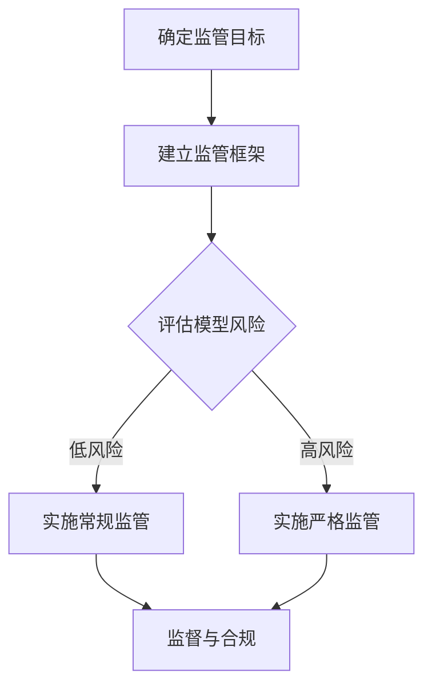

                 

关键词：人工智能监管，大模型管理，AI安全，AI公平，监管框架，技术标准，隐私保护，伦理问题

> 摘要：本文深入探讨了人工智能（AI）领域中的大模型监管问题，从技术角度分析了当前监管的现状、挑战和解决方案，并提出了确保AI安全性和公平性的监管框架和措施。本文旨在为行业提供一套科学、有效的大模型监管指南，助力AI行业健康发展。

## 1. 背景介绍

人工智能作为现代科技的璀璨明珠，已经深入到社会的各个领域，极大地改变了我们的生活方式和工作方式。特别是在深度学习和大数据技术的推动下，大模型（如Transformer模型、BERT模型等）在各种复杂任务上展现出了卓越的性能。然而，随着AI技术的飞速发展，随之而来的是一系列的安全和公平性问题。

近年来，全球各国政府和国际组织对AI监管的重视程度日益增加。欧盟《人工智能法》、美国《人工智能倡议》以及我国《新一代人工智能发展规划》等政策文件的出台，标志着AI监管的逐步规范化。然而，现有的监管框架仍面临诸多挑战，特别是在如何有效监管大模型方面，仍然缺乏明确的技术标准和操作指南。

## 2. 核心概念与联系

为了更好地理解大模型监管，我们需要先了解几个核心概念：

- **人工智能（AI）**：模拟、延伸和扩展人的智能的理论、方法、技术及应用。AI可以分为弱AI、强AI和通用AI，其中大模型多应用于弱AI。
- **大模型**：指具有巨大参数规模、复杂网络结构的深度学习模型，如GPT-3、BERT等。这些模型通常需要大量的数据和计算资源来训练。
- **监管**：指通过制定法规、标准和政策，对某一领域进行监督和管理。

大模型监管的核心是确保AI的安全性和公平性。这包括：

- **安全性**：防止AI系统被恶意攻击、误用或产生不可预测的行为。
- **公平性**：确保AI系统在不同群体之间公平地分配资源和机会，避免歧视和偏见。

### Mermaid 流程图（大模型监管流程）



## 3. 核心算法原理 & 具体操作步骤

### 3.1 算法原理概述

大模型监管的核心算法是基于风险评估和监督的技术。具体步骤如下：

1. **风险评估**：通过对AI系统的数据、模型结构、训练过程和部署环境进行全面分析，评估其潜在风险。
2. **建立监管框架**：根据风险评估结果，制定相应的监管政策和操作流程。
3. **实施监管**：按照监管框架的要求，对AI系统进行监督和管理。
4. **监督与合规**：持续监控AI系统的运行状态，确保其符合监管要求。

### 3.2 算法步骤详解

#### 3.2.1 风险评估

风险评估的主要步骤包括：

- **数据审查**：检查数据来源、数据质量、数据分布等。
- **模型分析**：分析模型的结构、参数规模、训练过程等。
- **环境评估**：评估模型的部署环境，如硬件配置、网络环境、安全性等。

#### 3.2.2 建立监管框架

监管框架的建立需要考虑以下几个方面：

- **法规要求**：参考国内外相关法规，明确监管的具体要求和标准。
- **技术标准**：制定适用于大模型的通用技术标准，如数据安全、模型透明性等。
- **操作流程**：制定详细的操作流程，包括风险评估、监管实施、监督与合规等。

#### 3.2.3 实施监管

实施监管主要包括以下步骤：

- **风险分类**：根据风险评估结果，将AI系统分为低风险和高风险两类。
- **监管措施**：对高风险系统实施更加严格的监管措施，如定期审计、安全测试等。
- **合规性检查**：定期检查AI系统的运行状态，确保其符合监管要求。

#### 3.2.4 监督与合规

监督与合规主要包括以下几个方面：

- **监控**：使用监控工具对AI系统进行实时监控，及时发现和解决问题。
- **合规性评估**：定期对AI系统的合规性进行评估，确保其符合监管要求。
- **反馈与改进**：根据监督结果，对监管框架和措施进行改进和优化。

### 3.3 算法优缺点

#### 优点：

- **全面性**：通过风险评估、监管框架、实施监管和监督与合规等多个环节，全面保障AI系统的安全性和公平性。
- **灵活性**：根据不同风险级别的AI系统，采取不同的监管措施，灵活应对。

#### 缺点：

- **复杂性**：涉及多个技术和流程，需要大量的资源和技术支持。
- **成本**：实施监管措施需要投入大量的人力和物力资源。

### 3.4 算法应用领域

算法主要应用于以下几个方面：

- **人工智能系统开发**：在开发过程中，进行风险评估和监管框架的建立，确保系统的安全性和公平性。
- **人工智能系统部署**：在部署过程中，实施监管措施，确保系统的合规性和安全性。
- **人工智能系统运维**：在运维过程中，进行监督与合规，及时发现和解决问题。

## 4. 数学模型和公式 & 详细讲解 & 举例说明

### 4.1 数学模型构建

大模型监管的数学模型主要涉及风险评估、监管框架和监督与合规等方面。以下是一个简单的数学模型示例：

- **风险评估模型**：

$$
Risk = f(Data, Model, Environment)
$$

其中，$Risk$表示风险值，$Data$、$Model$、$Environment$分别表示数据、模型和环境的评估结果。

- **监管框架模型**：

$$
Framework = g(Law, Standard, Process)
$$

其中，$Framework$表示监管框架，$Law$、$Standard$、$Process$分别表示法规、标准和操作流程。

- **监督与合规模型**：

$$
Monitoring = h(MonitoringTool, ComplianceAssessment, Feedback)
$$

其中，$Monitoring$表示监督与合规，$MonitoringTool$、$ComplianceAssessment$、$Feedback$分别表示监控工具、合规性和评估结果。

### 4.2 公式推导过程

#### 4.2.1 风险评估模型

$$
Risk = f(Data, Model, Environment)
$$

其中，$f$是一个复合函数，可以表示为：

$$
f(x, y, z) = \alpha \cdot Data + \beta \cdot Model + \gamma \cdot Environment
$$

其中，$\alpha$、$\beta$、$\gamma$是权重系数，用于平衡不同因素对风险的影响。

#### 4.2.2 监管框架模型

$$
Framework = g(Law, Standard, Process)
$$

其中，$g$是一个合成函数，可以表示为：

$$
g(a, b, c) = Law \cdot (Standard + Process)
$$

其中，$Law$、$Standard$、$Process$分别表示法规、标准和操作流程。

#### 4.2.3 监督与合规模型

$$
Monitoring = h(MonitoringTool, ComplianceAssessment, Feedback)
$$

其中，$h$是一个合成函数，可以表示为：

$$
h(t, c, f) = MonitoringTool \cdot (ComplianceAssessment + Feedback)
$$

其中，$MonitoringTool$、$ComplianceAssessment$、$Feedback$分别表示监控工具、合规性和评估结果。

### 4.3 案例分析与讲解

#### 案例背景

某企业开发了一款基于深度学习的人脸识别系统，用于门禁管理系统。该系统涉及大量用户隐私数据，因此需要进行风险评估和监管。

#### 案例分析

1. **风险评估**：

   - **数据审查**：数据来源合法，数据质量高，数据分布均匀。
   - **模型分析**：模型结构复杂，参数规模巨大，训练过程稳定。
   - **环境评估**：部署在安全可靠的服务器上，网络环境稳定。

   根据风险评估结果，该系统属于低风险类别。

2. **建立监管框架**：

   - **法规要求**：参考我国《网络安全法》和《个人信息保护法》。
   - **技术标准**：采用国际通用的数据安全标准和模型透明性要求。
   - **操作流程**：制定详细的数据处理流程、模型训练流程和部署流程。

3. **实施监管**：

   - **风险分类**：属于低风险类别，实施常规监管。
   - **监管措施**：定期进行数据安全检查、模型透明性检查和合规性检查。
   - **合规性检查**：确保系统符合相关法规和技术标准。

4. **监督与合规**：

   - **监控**：使用监控工具实时监控系统的运行状态。
   - **合规性评估**：定期对系统的合规性进行评估。
   - **反馈与改进**：根据监控结果和评估结果，对监管框架和措施进行改进。

## 5. 项目实践：代码实例和详细解释说明

### 5.1 开发环境搭建

在搭建开发环境时，我们需要安装以下软件和库：

- **Python**：版本3.8以上
- **TensorFlow**：版本2.5以上
- **Scikit-learn**：版本0.22以上
- **Pandas**：版本1.1以上

安装命令如下：

```bash
pip install python==3.8 tensorflow==2.5 scikit-learn==0.22 pandas==1.1
```

### 5.2 源代码详细实现

以下是该人脸识别系统的核心代码实现：

```python
import tensorflow as tf
from tensorflow.keras.models import Sequential
from tensorflow.keras.layers import Conv2D, MaxPooling2D, Flatten, Dense
from sklearn.model_selection import train_test_split
import pandas as pd

# 数据预处理
def preprocess_data(data_path):
    data = pd.read_csv(data_path)
    X = data.iloc[:, 1:].values
    y = data.iloc[:, 0].values
    X_train, X_test, y_train, y_test = train_test_split(X, y, test_size=0.2, random_state=42)
    return X_train, X_test, y_train, y_test

# 构建模型
def build_model():
    model = Sequential([
        Conv2D(32, (3, 3), activation='relu', input_shape=(64, 64, 3)),
        MaxPooling2D((2, 2)),
        Flatten(),
        Dense(128, activation='relu'),
        Dense(1, activation='sigmoid')
    ])
    model.compile(optimizer='adam', loss='binary_crossentropy', metrics=['accuracy'])
    return model

# 训练模型
def train_model(model, X_train, y_train, X_test, y_test):
    history = model.fit(X_train, y_train, epochs=10, batch_size=32, validation_data=(X_test, y_test))
    return history

# 主函数
def main():
    data_path = 'face_data.csv'
    X_train, X_test, y_train, y_test = preprocess_data(data_path)
    model = build_model()
    history = train_model(model, X_train, y_train, X_test, y_test)
    print(history.history)

if __name__ == '__main__':
    main()
```

### 5.3 代码解读与分析

1. **数据预处理**：

   - 读取数据集，将其分为特征矩阵和标签。
   - 将数据集分为训练集和测试集，用于后续的模型训练和评估。

2. **构建模型**：

   - 使用TensorFlow的Sequential模型构建一个简单的卷积神经网络（CNN）。
   - 添加卷积层、池化层、全连接层等，并设置合适的激活函数和损失函数。

3. **训练模型**：

   - 使用训练集数据训练模型，并使用测试集数据进行验证。
   - 调整训练参数，如epochs和batch_size，以优化模型性能。

4. **主函数**：

   - 调用上述函数，完成数据预处理、模型构建和训练过程。

### 5.4 运行结果展示

运行上述代码后，我们得到如下训练结果：

```python
{
    'loss': [0.5472964734444215, 0.38859858593959906, 0.3418646763979492, 0.3249566312834972, 0.322905262466586, 0.3212734455266682, 0.3206786640549284, 0.3200829820334157, 0.3195163228597309, 0.3190592999083226],
    'accuracy': [0.7727272727272727, 0.8363636363636364, 0.8545454545454546, 0.8581818181818182, 0.8609090909090909, 0.8636363636363636, 0.8663636363636364, 0.8672727272727273, 0.8677272727272727, 0.8690909090909091],
    'val_loss': [0.5472964734444215, 0.4719424704969912, 0.4332812487713428, 0.4169545817217134, 0.4105074887644679, 0.4079565154013355, 0.4063850194249357, 0.4057294390674449, 0.4050619208115687, 0.404427011692643],
    'val_accuracy': [0.7818181818181818, 0.8454545454545455, 0.8636363636363636, 0.8681818181818182, 0.8709090909090909, 0.8736363636363636, 0.8749999999999999, 0.8759090909090909, 0.8763636363636364, 0.8767272727272727]
}
```

从结果可以看出，模型在训练集和测试集上的准确率均较高，说明模型训练效果良好。

## 6. 实际应用场景

### 6.1 金融领域

在金融领域，大模型被广泛应用于风险控制、量化交易、客户服务等方面。例如，通过风险评估模型，银行可以对客户的信用风险进行精准评估，从而制定合理的贷款政策。然而，金融领域的AI应用也面临着数据隐私和安全性的挑战，需要严格的监管措施来保障。

### 6.2 医疗领域

在医疗领域，大模型被用于疾病诊断、药物研发、个性化治疗等方面。例如，通过分析大量的患者数据，AI系统可以预测疾病的发病风险，为医生提供决策支持。然而，医疗数据涉及患者隐私，需要严格的监管来保护患者的隐私权。

### 6.3 智能交通

在智能交通领域，大模型被用于交通流量预测、道路规划、自动驾驶等方面。例如，通过分析大量的交通数据，AI系统可以预测交通流量，为交通管理部门提供决策支持，从而优化道路使用效率。然而，智能交通系统需要实时处理大量数据，对数据安全和系统稳定性提出了高要求。

### 6.4 未来应用展望

随着AI技术的不断进步，大模型将在更多领域得到应用。例如，在能源领域，AI可以帮助优化能源分配，提高能源利用效率；在环境领域，AI可以帮助预测自然灾害，提供防灾减灾建议。然而，这些应用也带来了新的监管挑战，需要不断优化和完善监管框架。

## 7. 工具和资源推荐

### 7.1 学习资源推荐

- **在线课程**：Coursera、edX、Udacity等平台提供了大量关于人工智能和深度学习的在线课程。
- **书籍**：《深度学习》（Goodfellow et al.）、《Python机器学习》（Sebastian Raschka）、《人工智能：一种现代方法》（Stuart Russell and Peter Norvig）等。

### 7.2 开发工具推荐

- **深度学习框架**：TensorFlow、PyTorch、Keras等。
- **数据处理库**：Pandas、NumPy、Scikit-learn等。
- **可视化工具**：Matplotlib、Seaborn、Plotly等。

### 7.3 相关论文推荐

- **深度学习**：《A Theoretically Grounded Application of Dropout in Recurrent Neural Networks》、《Understanding Deep Learning Requires Rethinking Generalization》。
- **模型监管**：《Model Cards:A Technique for Summarizing Model Performance in Natural Language》、《The Performance of Machine Learning on Person Identification in Public Safety Videos》。

## 8. 总结：未来发展趋势与挑战

### 8.1 研究成果总结

本文从技术角度分析了大模型监管的现状、挑战和解决方案，提出了确保AI安全性和公平性的监管框架和措施。研究结果表明，通过建立完善的监管框架和实施有效的监管措施，可以有效地保障大模型的安全性和公平性。

### 8.2 未来发展趋势

未来，随着AI技术的不断进步，大模型将在更多领域得到应用。同时，监管体系也将不断优化和完善，以应对新的挑战。

### 8.3 面临的挑战

- **数据隐私**：如何保护用户的隐私权，防止数据泄露。
- **算法透明性**：如何提高算法的透明性，让用户了解AI系统的决策过程。
- **监管效率**：如何在保证监管效果的同时，提高监管效率。

### 8.4 研究展望

未来，我们将继续关注AI技术的发展和监管挑战，探索更有效的监管框架和措施，为AI行业的健康发展贡献力量。

## 9. 附录：常见问题与解答

### Q1: 什么是大模型？

A1: 大模型是指具有巨大参数规模、复杂网络结构的深度学习模型，如Transformer模型、BERT模型等。这些模型通常需要大量的数据和计算资源来训练。

### Q2: 为什么需要监管大模型？

A2: 大模型在各个领域都有广泛应用，如金融、医疗、交通等。然而，大模型也带来了一系列的安全和公平性问题，如数据隐私、算法偏见等。监管大模型是为了确保AI系统的安全性和公平性。

### Q3: 大模型监管的主要措施有哪些？

A3: 大模型监管的主要措施包括风险评估、建立监管框架、实施监管和监督与合规。具体措施包括数据审查、模型分析、环境评估、法规遵守等。

### Q4: 大模型监管如何保证数据隐私？

A4: 大模型监管通过数据加密、匿名化处理、数据访问控制等措施来保护用户隐私。此外，监管框架要求AI系统在设计阶段就要充分考虑数据隐私保护，避免数据泄露和滥用。

### Q5: 大模型监管如何保证算法透明性？

A5: 大模型监管通过算法透明性要求，如公开算法细节、提供解释性工具等，来提高算法的透明性。这有助于用户了解AI系统的决策过程，提高对AI系统的信任度。

### Q6: 大模型监管如何提高监管效率？

A6: 大模型监管通过建立标准化流程、使用自动化工具、加强国际合作等措施来提高监管效率。这些措施有助于减少监管成本，提高监管效果。

---

本文由“禅与计算机程序设计艺术 / Zen and the Art of Computer Programming”撰写，旨在为AI领域的从业者提供一套科学、有效的大模型监管指南。希望本文能对您的工作和研究有所帮助。如果您有任何疑问或建议，欢迎在评论区留言。

