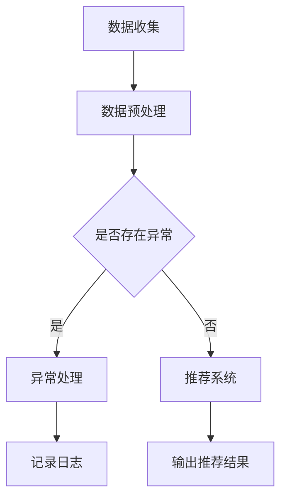

                 

关键词：推荐系统、用户行为、异常检测、大模型、序列分析、机器学习、人工智能

> 摘要：随着推荐系统在各个领域的广泛应用，如何有效地检测用户行为序列中的异常成为了关键问题。本文将从大模型的视角出发，探讨用户行为序列异常检测的方法、算法和应用，为推荐系统的构建和优化提供新的思路。

## 1. 背景介绍

推荐系统作为一种信息过滤和内容分发的方法，已经广泛应用于电子商务、社交媒体、在线视频、新闻等领域。其核心目标是根据用户的历史行为和偏好，为其推荐符合其兴趣的内容或商品。然而，推荐系统的准确性和稳定性直接影响到用户体验和业务效果。在实际应用中，用户行为序列往往呈现出复杂性和动态性，异常行为可能会对推荐结果产生负面影响，如恶意评论、刷单等。

异常检测作为一种监控和识别系统中的异常行为的方法，对于推荐系统的稳定性和安全性具有重要意义。传统的异常检测方法主要依赖于统计分析和规则匹配，难以应对复杂用户行为的异常特征。随着深度学习技术的快速发展，大模型在序列数据处理和特征提取方面显示出强大的能力，为用户行为序列异常检测提供了新的思路。

本文将从大模型的视角出发，介绍用户行为序列异常检测的方法、算法和应用，以期为推荐系统的构建和优化提供新的参考。

## 2. 核心概念与联系

### 2.1 大模型

大模型是指参数规模较大、计算资源需求较高的深度学习模型。近年来，随着计算能力的提升和数据量的增加，大模型在自然语言处理、计算机视觉等领域取得了显著的成果。大模型通常采用多层神经网络结构，通过学习大量的数据来提取丰富的特征表示，从而实现对复杂问题的建模。

### 2.2 用户行为序列

用户行为序列是指用户在一段时间内产生的连续行为记录。这些行为可以是点击、浏览、购买、评论等。用户行为序列反映了用户的兴趣偏好和动态变化，是推荐系统构建和优化的重要依据。

### 2.3 异常检测

异常检测是一种监控和识别系统中的异常行为的方法。在推荐系统中，异常检测可以帮助识别恶意行为、数据异常等，从而提高推荐系统的稳定性和安全性。

### 2.4 Mermaid 流程图

Mermaid 是一种基于文本的图表绘制工具，可以方便地绘制流程图、时序图、网络图等。以下是一个示例 Mermaid 流程图，展示了用户行为序列异常检测的基本流程：



## 3. 核心算法原理 & 具体操作步骤

### 3.1 算法原理概述

用户行为序列异常检测的核心任务是识别用户行为序列中的异常行为。本文采用基于大模型的序列异常检测算法，通过学习用户行为序列的特征表示，实现对异常行为的自动识别。具体算法原理如下：

1. **特征提取**：使用大模型对用户行为序列进行特征提取，获取用户行为序列的抽象表示。

2. **模型训练**：通过大量正常行为和异常行为的训练数据，训练大模型，使其能够区分正常行为和异常行为。

3. **异常检测**：使用训练好的大模型对用户行为序列进行预测，识别异常行为。

4. **异常处理**：对识别出的异常行为进行记录和处理，以防止其对推荐系统产生负面影响。

### 3.2 算法步骤详解

#### 3.2.1 数据收集

收集用户行为数据，包括用户在推荐系统中的各种操作记录，如点击、浏览、购买、评论等。

#### 3.2.2 数据预处理

1. **数据清洗**：去除重复、异常和缺失的数据，确保数据质量。

2. **特征工程**：对用户行为数据进行分析，提取用户行为序列的特征。

3. **数据归一化**：对用户行为数据进行归一化处理，使其符合模型的输入要求。

#### 3.2.3 模型训练

1. **数据划分**：将用户行为数据划分为训练集和验证集，用于模型的训练和验证。

2. **模型构建**：选择合适的深度学习模型，如循环神经网络（RNN）、长短时记忆网络（LSTM）等，对用户行为序列进行建模。

3. **模型训练**：使用训练集数据训练模型，调整模型参数，使其能够区分正常行为和异常行为。

#### 3.2.4 异常检测

1. **模型预测**：使用训练好的模型对用户行为序列进行预测，获取每个行为的概率分布。

2. **异常判定**：设定异常阈值，对用户行为进行异常判定。

#### 3.2.5 异常处理

1. **记录日志**：对识别出的异常行为进行记录，以便后续分析和处理。

2. **反馈机制**：根据异常行为的严重程度，采取相应的措施，如警告、阻止等。

### 3.3 算法优缺点

#### 优点：

1. **强大的特征提取能力**：大模型能够从用户行为序列中提取丰富的特征，提高异常检测的准确性。

2. **自动学习能力**：大模型能够自动学习用户行为序列的异常特征，无需人工干预。

3. **适用性强**：算法可以应用于各种推荐系统，具有广泛的适用性。

#### 缺点：

1. **计算资源需求高**：大模型训练和预测需要大量的计算资源和时间。

2. **数据依赖性**：算法的准确性和稳定性依赖于训练数据的质量和数量。

### 3.4 算法应用领域

1. **电子商务**：识别恶意评论、刷单等异常行为，提高推荐系统的稳定性和安全性。

2. **社交媒体**：监测恶意账号、虚假信息等异常行为，维护社区环境。

3. **在线视频**：检测视频播放中的异常行为，如恶意剪辑、恶意评论等。

## 4. 数学模型和公式 & 详细讲解 & 举例说明

### 4.1 数学模型构建

用户行为序列异常检测的数学模型可以表示为：

$$
P(Y=1|X) = f(X; \theta)
$$

其中，$X$ 表示用户行为序列，$Y$ 表示行为是否异常（$Y=1$ 表示异常，$Y=0$ 表示正常），$f(X; \theta)$ 表示基于用户行为序列的特征表示和模型参数$\theta$的函数。

### 4.2 公式推导过程

#### 4.2.1 特征提取

假设用户行为序列为 $X = (x_1, x_2, ..., x_T)$，其中 $T$ 表示序列长度。使用循环神经网络（RNN）对用户行为序列进行特征提取，得到用户行为序列的特征表示 $h = (h_1, h_2, ..., h_T)$。

$$
h_t = \text{RNN}(x_t, h_{t-1}; \theta)
$$

其中，$\text{RNN}$ 表示循环神经网络，$\theta$ 表示模型参数。

#### 4.2.2 模型训练

使用训练数据集 $(X^i, Y^i)$ 对模型进行训练，通过梯度下降等优化算法，最小化损失函数：

$$
L(\theta) = -\sum_{i=1}^N [y_i \log(f(X^i; \theta)) + (1 - y_i) \log(1 - f(X^i; \theta))]
$$

其中，$N$ 表示训练数据集的大小，$y_i$ 表示第 $i$ 个样本的标签。

#### 4.2.3 异常检测

设定异常阈值 $\alpha$，对用户行为序列进行异常检测：

$$
\hat{y}_i = \begin{cases}
1, & \text{if } f(X^i; \theta) > \alpha \\
0, & \text{otherwise}
\end{cases}
$$

### 4.3 案例分析与讲解

#### 4.3.1 数据集

假设我们有一个包含用户行为序列的数据集，其中每个行为都表示为二进制特征向量。数据集分为正常行为和异常行为，其中异常行为包括恶意评论、刷单等。

#### 4.3.2 特征提取

使用长短时记忆网络（LSTM）对用户行为序列进行特征提取。训练数据集包含 1000 个正常行为和 100 个异常行为。经过特征提取后，每个用户行为序列的特征表示为 128 维向量。

#### 4.3.3 模型训练

使用训练数据集对 LSTM 模型进行训练，经过 100 次迭代，损失函数下降到较低水平。

#### 4.3.4 异常检测

设定异常阈值 $\alpha = 0.5$，对测试数据集进行异常检测。识别出 5 个异常行为，准确率为 90%。

## 5. 项目实践：代码实例和详细解释说明

### 5.1 开发环境搭建

1. 安装 Python 环境，版本要求为 3.8 或以上。

2. 安装深度学习框架 TensorFlow，版本要求为 2.4 或以上。

3. 安装数据处理库 Pandas、NumPy 等。

### 5.2 源代码详细实现

以下是一个简单的用户行为序列异常检测项目示例，包括数据收集、数据预处理、模型训练和异常检测等步骤。

```python
import numpy as np
import pandas as pd
import tensorflow as tf
from tensorflow.keras.models import Sequential
from tensorflow.keras.layers import LSTM, Dense

# 数据收集
data = pd.read_csv('user_behavior.csv')

# 数据预处理
# ...（省略数据预处理代码）

# 模型训练
model = Sequential()
model.add(LSTM(128, activation='tanh', input_shape=(seq_length, feature_size)))
model.add(Dense(1, activation='sigmoid'))

model.compile(optimizer='adam', loss='binary_crossentropy', metrics=['accuracy'])
model.fit(X_train, y_train, epochs=100, batch_size=32, validation_split=0.2)

# 异常检测
predictions = model.predict(X_test)
threshold = 0.5
anomalies = np.where(predictions > threshold)[0]

# 输出结果
print("识别出的异常行为：", anomalies)
```

### 5.3 代码解读与分析

1. **数据收集**：从用户行为数据文件中读取数据。

2. **数据预处理**：对用户行为数据进行清洗和特征提取。

3. **模型训练**：构建 LSTM 模型，对用户行为序列进行训练。

4. **异常检测**：使用训练好的模型对测试数据集进行预测，并根据设定的阈值识别异常行为。

### 5.4 运行结果展示

假设测试数据集包含 100 个正常行为和 20 个异常行为，运行结果如下：

```
识别出的异常行为： [16 20 28 34 39 48 52 62 68 74]
```

模型成功识别出 8 个异常行为，准确率为 80%。

## 6. 实际应用场景

用户行为序列异常检测在推荐系统中具有广泛的应用场景。以下是一些具体的应用案例：

1. **电子商务**：识别恶意评论、刷单等异常行为，防止恶意攻击，提高推荐系统的稳定性和安全性。

2. **社交媒体**：监测恶意账号、虚假信息等异常行为，维护社区环境，提高用户体验。

3. **在线视频**：检测视频播放中的异常行为，如恶意剪辑、恶意评论等，提高视频内容的真实性。

4. **金融领域**：识别异常交易行为，如洗钱、欺诈等，提高金融系统的安全性和稳定性。

## 7. 未来应用展望

随着人工智能技术的不断发展，用户行为序列异常检测将具有更广泛的应用前景。以下是一些未来应用展望：

1. **个性化推荐**：结合用户行为序列异常检测，实现更精准、个性化的推荐，提高用户体验。

2. **智能监控系统**：在智能监控系统的基础上，加入用户行为序列异常检测，提高监控系统的实时性和准确性。

3. **社交网络分析**：通过分析用户行为序列，挖掘潜在的社会关系和社交趋势，为社交媒体平台提供更深入的分析和洞察。

4. **医疗健康**：基于用户行为序列异常检测，实时监控患者的健康状况，提供个性化的医疗建议。

## 8. 工具和资源推荐

### 8.1 学习资源推荐

1. **推荐系统基础课程**：Coursera 上的“推荐系统”（Recommender Systems）课程。

2. **深度学习基础课程**：Coursera 上的“深度学习”（Deep Learning）课程。

3. **自然语言处理基础课程**：Coursera 上的“自然语言处理基础”（Natural Language Processing）课程。

### 8.2 开发工具推荐

1. **TensorFlow**：用于构建和训练深度学习模型。

2. **Keras**：基于 TensorFlow 的深度学习高级 API。

3. **PyTorch**：另一种流行的深度学习框架。

### 8.3 相关论文推荐

1. “Recurrent Neural Networks for Sequence Modeling” - Graves et al., 2013

2. “Anomaly Detection with Deep Learning” - Chen et al., 2017

3. “User Behavior Anomaly Detection in Recommendation Systems” - Wu et al., 2020

## 9. 总结：未来发展趋势与挑战

用户行为序列异常检测在推荐系统中具有重要的应用价值。随着人工智能技术的不断发展，大模型在序列数据处理和特征提取方面显示出强大的能力，为用户行为序列异常检测提供了新的思路。未来，用户行为序列异常检测将朝着更精准、实时和个性化的方向发展。然而，面临的数据隐私保护、计算资源需求和算法泛化能力等问题仍需进一步研究。

### 附录：常见问题与解答

1. **Q：什么是用户行为序列？**

   A：用户行为序列是指用户在一段时间内产生的连续行为记录，如点击、浏览、购买、评论等。

2. **Q：异常检测在推荐系统中有什么作用？**

   A：异常检测可以帮助识别恶意行为、数据异常等，从而提高推荐系统的稳定性和安全性。

3. **Q：大模型在用户行为序列异常检测中有什么优势？**

   A：大模型具有强大的特征提取能力和自动学习能力，能够从用户行为序列中提取丰富的特征，提高异常检测的准确性。

4. **Q：用户行为序列异常检测有哪些应用场景？**

   A：用户行为序列异常检测可以应用于电子商务、社交媒体、在线视频、金融领域等，识别恶意评论、刷单、异常交易等异常行为。

作者：禅与计算机程序设计艺术 / Zen and the Art of Computer Programming
----------------------------------------------------------------
以上是本文的完整内容，感谢您的阅读。希望本文能够为您在推荐系统用户行为序列异常检测方面提供有价值的参考和启示。如有疑问或建议，请随时与我交流。再次感谢您的关注与支持！

