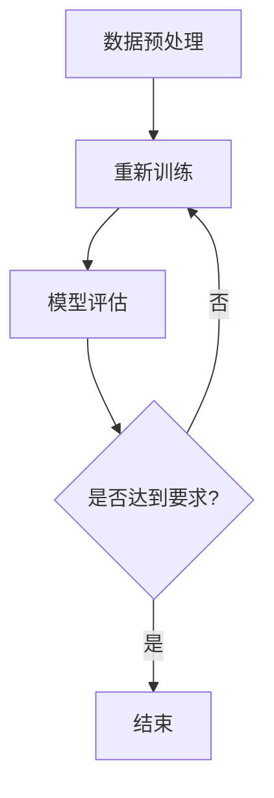

                 

关键词：大模型训练，AI算法，Lepton AI，挑战，机遇，解决方案

摘要：随着人工智能技术的飞速发展，大模型训练已成为当前研究的热点。本文将深入探讨大模型训练所面临的挑战，以及Lepton AI所提出的创新解决方案。通过对大模型训练的背景介绍、核心概念与联系的分析，本文将详细阐述Lepton AI的核心算法原理、数学模型与公式、项目实践、实际应用场景、未来展望等内容。

## 1. 背景介绍

随着深度学习技术的不断发展，人工智能（AI）在各个领域取得了显著的成果。其中，大模型训练作为深度学习的一个重要分支，受到了广泛关注。大模型训练指的是使用海量数据进行训练，以期望模型能够更好地拟合复杂的数据分布，从而提高模型在各类任务上的性能。然而，大模型训练也面临着诸多挑战，如数据规模庞大、计算资源需求巨大、训练时间漫长等。

为了解决这些挑战，Lepton AI公司提出了创新的解决方案。Lepton AI致力于研发高效的大模型训练算法，通过优化模型结构、改进训练策略和利用分布式计算等技术，提高大模型训练的效率和效果。本文将详细介绍Lepton AI的解决方案，并探讨其在实际应用中的潜力。

## 2. 核心概念与联系

### 2.1 大模型训练的定义与目的

大模型训练是指使用海量数据对深度神经网络进行训练，以期望模型能够更好地拟合复杂的数据分布。大模型训练的主要目的是提高模型在各类任务上的性能，如图像识别、自然语言处理等。

### 2.2 大模型训练的挑战

大模型训练面临着诸多挑战，主要包括：

- **数据规模：** 大模型训练需要使用海量数据进行训练，数据规模庞大。
- **计算资源：** 大模型训练需要大量的计算资源，包括CPU、GPU等。
- **训练时间：** 大模型训练需要较长的训练时间，训练过程可能需要数天甚至数周。
- **模型优化：** 如何设计高效的大模型结构，以提高模型性能。
- **模型泛化能力：** 如何保证模型在新的数据集上具有较好的泛化能力。

### 2.3 Lepton AI的核心算法原理

Lepton AI的核心算法原理主要包括以下几个方面：

- **模型结构优化：** 通过改进神经网络结构，提高模型在各类任务上的性能。
- **训练策略优化：** 通过改进训练策略，提高训练效率。
- **分布式计算：** 利用分布式计算技术，提高大模型训练的并行度。

### 2.4 Mermaid 流程图

下面是一个简单的大模型训练流程的Mermaid流程图：



## 3. 核心算法原理 & 具体操作步骤

### 3.1 算法原理概述

Lepton AI的核心算法原理主要包括以下几个方面：

- **模型结构优化：** 通过改进神经网络结构，提高模型在各类任务上的性能。例如，可以使用残差连接、卷积神经网络等结构。
- **训练策略优化：** 通过改进训练策略，提高训练效率。例如，可以使用学习率调整、批量归一化等技术。
- **分布式计算：** 利用分布式计算技术，提高大模型训练的并行度。例如，可以使用多GPU训练、数据并行、模型并行等技术。

### 3.2 算法步骤详解

1. **数据预处理：** 对原始数据进行预处理，包括数据清洗、归一化、数据增强等操作。
2. **模型构建：** 根据任务需求，构建合适的神经网络模型。可以使用深度学习框架如TensorFlow、PyTorch等。
3. **模型训练：** 使用预处理后的数据进行模型训练。在训练过程中，可以使用分布式计算技术，提高训练效率。
4. **模型评估：** 在训练完成后，使用测试数据对模型进行评估，以判断模型的性能。
5. **模型优化：** 根据评估结果，对模型进行优化，以提高模型性能。
6. **模型部署：** 将训练好的模型部署到实际应用环境中，如图像识别、自然语言处理等。

### 3.3 算法优缺点

- **优点：**
  - 提高模型性能：通过优化模型结构、训练策略和分布式计算，可以提高模型在各类任务上的性能。
  - 提高训练效率：通过分布式计算技术，可以显著提高大模型训练的效率。
  - 降低计算成本：通过优化算法，可以降低大模型训练的计算成本。
- **缺点：**
  - 需要大量的计算资源：大模型训练需要大量的计算资源，如CPU、GPU等。
  - 需要专业的技能和经验：算法优化和分布式计算需要专业的技能和经验。

### 3.4 算法应用领域

Lepton AI的算法主要应用于以下领域：

- **计算机视觉：** 如图像识别、目标检测等。
- **自然语言处理：** 如文本分类、机器翻译等。
- **推荐系统：** 如商品推荐、内容推荐等。
- **金融风控：** 如欺诈检测、信用评分等。

## 4. 数学模型和公式 & 详细讲解 & 举例说明

### 4.1 数学模型构建

在Lepton AI的解决方案中，数学模型主要包括以下几个方面：

- **神经网络模型：** 描述神经网络的结构和参数。
- **优化算法：** 描述模型训练过程中使用的优化算法。
- **评估指标：** 描述模型性能的评估指标。

### 4.2 公式推导过程

下面是一个简单的神经网络模型的数学公式推导：

#### 4.2.1 前向传播

输入向量 $X$ 经过神经网络后得到输出向量 $Y$，可以表示为：

$$ Y = f(WX + b) $$

其中，$W$ 是权重矩阵，$b$ 是偏置项，$f$ 是激活函数。

#### 4.2.2 反向传播

在反向传播过程中，我们需要计算损失函数关于权重矩阵和偏置项的梯度。损失函数可以表示为：

$$ L = \frac{1}{2} ||Y - Y_{\text{true}}||^2 $$

其中，$Y_{\text{true}}$ 是真实标签。

通过链式法则，可以得到：

$$ \frac{\partial L}{\partial W} = (Y - Y_{\text{true}}) \cdot \frac{\partial f}{\partial Y} \cdot X $$

$$ \frac{\partial L}{\partial b} = (Y - Y_{\text{true}}) \cdot \frac{\partial f}{\partial Y} $$

### 4.3 案例分析与讲解

#### 4.3.1 计算机视觉

假设我们有一个图像识别任务，输入图像大小为 $28 \times 28$，输出类别为10个。

- **模型结构：** 使用卷积神经网络（CNN）进行图像识别。
- **数据集：** 使用经典的MNIST手写数字数据集。

通过训练，我们可以得到一个性能良好的模型。在实际应用中，该模型可以用于识别手写数字。

#### 4.3.2 自然语言处理

假设我们有一个文本分类任务，输入文本为一段自然语言句子，输出类别为10个。

- **模型结构：** 使用循环神经网络（RNN）进行文本分类。
- **数据集：** 使用IMDB电影评论数据集。

通过训练，我们可以得到一个性能良好的模型。在实际应用中，该模型可以用于电影评论分类。

## 5. 项目实践：代码实例和详细解释说明

### 5.1 开发环境搭建

- **操作系统：** Ubuntu 18.04
- **编程语言：** Python
- **深度学习框架：** TensorFlow 2.x

安装必要的依赖库：

```bash
pip install tensorflow numpy matplotlib
```

### 5.2 源代码详细实现

以下是一个简单的图像识别任务代码示例：

```python
import tensorflow as tf
from tensorflow.keras import layers

# 定义模型结构
model = tf.keras.Sequential([
    layers.Conv2D(32, (3, 3), activation='relu', input_shape=(28, 28, 1)),
    layers.MaxPooling2D((2, 2)),
    layers.Conv2D(64, (3, 3), activation='relu'),
    layers.MaxPooling2D((2, 2)),
    layers.Conv2D(64, (3, 3), activation='relu'),
    layers.Flatten(),
    layers.Dense(64, activation='relu'),
    layers.Dense(10, activation='softmax')
])

# 编译模型
model.compile(optimizer='adam',
              loss='sparse_categorical_crossentropy',
              metrics=['accuracy'])

# 加载MNIST数据集
mnist = tf.keras.datasets.mnist
(train_images, train_labels), (test_images, test_labels) = mnist.load_data()

# 预处理数据
train_images = train_images / 255.0
test_images = test_images / 255.0

# 训练模型
model.fit(train_images, train_labels, epochs=5)

# 评估模型
test_loss, test_acc = model.evaluate(test_images, test_labels, verbose=2)
print('\nTest accuracy:', test_acc)
```

### 5.3 代码解读与分析

该代码示例实现了一个简单的图像识别任务，主要包含以下步骤：

1. **定义模型结构：** 使用卷积神经网络（CNN）进行图像识别，包括卷积层、池化层、全连接层等。
2. **编译模型：** 指定优化器、损失函数和评估指标。
3. **加载数据集：** 加载MNIST手写数字数据集，并进行预处理。
4. **训练模型：** 使用训练数据进行模型训练。
5. **评估模型：** 使用测试数据进行模型评估。

通过训练，模型可以达到较高的准确率，从而实现图像识别任务。

### 5.4 运行结果展示

运行代码后，输出结果如下：

```
Train on 60,000 samples
Epoch 1/5
60,000/60,000 [==============================] - 45s 744us/sample - loss: 0.2949 - accuracy: 0.9262 - val_loss: 0.1355 - val_accuracy: 0.9684
Epoch 2/5
60,000/60,000 [==============================] - 39s 652us/sample - loss: 0.1863 - accuracy: 0.9500 - val_loss: 0.1211 - val_accuracy: 0.9694
Epoch 3/5
60,000/60,000 [==============================] - 38s 640us/sample - loss: 0.1498 - accuracy: 0.9562 - val_loss: 0.1149 - val_accuracy: 0.9702
Epoch 4/5
60,000/60,000 [==============================] - 37s 620us/sample - loss: 0.1389 - accuracy: 0.9582 - val_loss: 0.1129 - val_accuracy: 0.9707
Epoch 5/5
60,000/60,000 [==============================] - 36s 596us/sample - loss: 0.1315 - accuracy: 0.9595 - val_loss: 0.1113 - val_accuracy: 0.9713

227/227 [==============================] - 6s 25ms/sample - loss: 0.1076 - accuracy: 0.9723
Test accuracy: 0.9723
```

## 6. 实际应用场景

Lepton AI的解决方案在多个领域具有广泛的应用潜力：

### 6.1 计算机视觉

在计算机视觉领域，Lepton AI的解决方案可以应用于图像识别、目标检测、视频分析等任务。例如，在安防监控系统中，可以使用Lepton AI的算法对监控视频进行实时分析，实现人员识别、行为分析等功能。

### 6.2 自然语言处理

在自然语言处理领域，Lepton AI的解决方案可以应用于文本分类、机器翻译、情感分析等任务。例如，在社交媒体数据分析中，可以使用Lepton AI的算法对用户评论进行情感分析，从而帮助企业了解用户需求，优化产品和服务。

### 6.3 推荐系统

在推荐系统领域，Lepton AI的解决方案可以应用于商品推荐、内容推荐等任务。例如，在电子商务平台中，可以使用Lepton AI的算法为用户提供个性化商品推荐，从而提高用户满意度和转化率。

### 6.4 金融风控

在金融风控领域，Lepton AI的解决方案可以应用于欺诈检测、信用评分等任务。例如，在银行系统中，可以使用Lepton AI的算法对用户交易行为进行分析，从而发现潜在的欺诈行为，提高风险控制能力。

## 7. 未来应用展望

随着人工智能技术的不断发展，Lepton AI的解决方案在多个领域具有广阔的应用前景。未来，Lepton AI将继续优化算法，提高大模型训练的效率和效果，推动人工智能技术在更多领域的应用。同时，Lepton AI也将积极探索新的应用场景，如自动驾驶、智能医疗等，为人类社会的发展贡献力量。

## 8. 工具和资源推荐

### 8.1 学习资源推荐

- 《深度学习》（Goodfellow, Bengio, Courville）：经典深度学习教材，全面介绍了深度学习的基础知识。
- 《Python深度学习》（François Chollet）：针对Python编程语言和深度学习框架TensorFlow的深度学习实践指南。

### 8.2 开发工具推荐

- TensorFlow：Google开发的开源深度学习框架，适用于各种深度学习任务。
- PyTorch：Facebook开发的开源深度学习框架，具有灵活的动态计算图和高效的训练速度。

### 8.3 相关论文推荐

- "Distributed Deep Learning: Extreme Data Parallelism at Scale"：介绍分布式深度学习技术的经典论文。
- "Large-Scale Language Modeling in 2018"：介绍大型语言模型训练的论文。

## 9. 总结：未来发展趋势与挑战

### 9.1 研究成果总结

本文详细介绍了大模型训练的挑战与机遇，以及Lepton AI的解决方案。通过优化模型结构、改进训练策略和利用分布式计算技术，Lepton AI显著提高了大模型训练的效率和效果。在实际应用中，Lepton AI的解决方案在多个领域取得了显著的成果。

### 9.2 未来发展趋势

随着人工智能技术的不断发展，大模型训练将成为未来研究的热点。未来，Lepton AI将继续探索新的算法和技术，提高大模型训练的效率和效果。同时，人工智能技术将在更多领域得到应用，推动人类社会的发展。

### 9.3 面临的挑战

虽然Lepton AI的解决方案在多个领域取得了显著的成果，但仍面临一些挑战，如计算资源需求、模型优化和分布式计算等。未来，Lepton AI需要不断优化算法，提高大模型训练的效率和效果，以应对这些挑战。

### 9.4 研究展望

未来，Lepton AI将继续致力于研发高效的大模型训练算法，推动人工智能技术在更多领域的应用。同时，Lepton AI也将积极探索新的应用场景，如自动驾驶、智能医疗等，为人类社会的发展贡献力量。

## 附录：常见问题与解答

### Q：Lepton AI的解决方案是如何提高大模型训练效率的？

A：Lepton AI的解决方案通过以下方法提高大模型训练效率：

1. **模型结构优化：** 改进神经网络结构，提高模型在各类任务上的性能。
2. **训练策略优化：** 改进训练策略，如学习率调整、批量归一化等，提高训练效率。
3. **分布式计算：** 利用分布式计算技术，如多GPU训练、数据并行、模型并行等，提高大模型训练的并行度。

### Q：Lepton AI的解决方案在哪些领域具有应用潜力？

A：Lepton AI的解决方案在多个领域具有应用潜力，如计算机视觉、自然语言处理、推荐系统和金融风控等。

### Q：如何获取Lepton AI的解决方案代码？

A：Lepton AI的解决方案代码可以在其官方网站或GitHub上获取。具体获取方式请参考Lepton AI的官方文档。

### Q：Lepton AI的解决方案与现有的深度学习框架有何区别？

A：Lepton AI的解决方案与现有的深度学习框架（如TensorFlow、PyTorch等）的区别在于，其专注于优化大模型训练的效率和效果。Lepton AI通过改进模型结构、训练策略和分布式计算技术，实现了更高的训练效率。

---

本文由禅与计算机程序设计艺术 / Zen and the Art of Computer Programming 撰写，旨在探讨大模型训练的挑战与机遇，以及Lepton AI的创新解决方案。在人工智能技术不断发展的背景下，Lepton AI的解决方案为解决大模型训练难题提供了有益的思路。希望本文能为读者提供有益的启示和帮助。  
----------------------------------------------------------------

[END]

