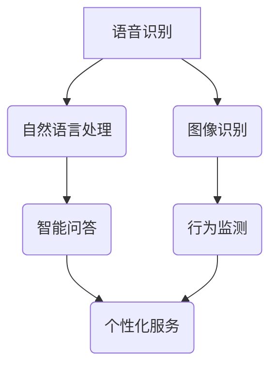

                 

关键词：大模型，智慧养老，人工智能，智能化服务，养老服务，创业机会，技术实现

> 摘要：随着人工智能技术的飞速发展，大模型在智慧养老领域展现出巨大的应用潜力。本文将探讨大模型如何赋能智慧养老，以及创业者如何利用这一技术提供智能化养老服务。通过深入分析核心概念、算法原理、数学模型、项目实践和实际应用场景，本文旨在为创业者在智慧养老领域提供实用的指导和建议。

## 1. 背景介绍

随着全球人口老龄化的加速，养老问题已经成为一个不可忽视的社会问题。传统的养老服务模式面临着资源紧张、效率低下、个性化服务不足等挑战。而随着人工智能技术的不断进步，特别是大模型（Large Models）的出现，为智慧养老领域带来了全新的发展机遇。

大模型是指具有数十亿参数规模的人工神经网络模型，如GPT-3、BERT等。这些模型通过深度学习从海量数据中学习到复杂的语言、图像、声音等特征，具备强大的知识表示和生成能力。在智慧养老领域，大模型可以应用于语音识别、自然语言处理、图像识别等任务，从而实现养老服务的智能化、个性化。

## 2. 核心概念与联系

### 2.1 大模型的定义和特点

大模型是一种基于人工神经网络的技术，具有以下特点：

1. **参数规模大**：大模型通常拥有数十亿个参数，这使得它们能够捕捉到更加复杂的特征。
2. **自学习能力**：大模型通过不断的学习和训练，能够自我优化性能。
3. **通用性强**：大模型具备较强的通用性，可以应用于多个领域和任务。

### 2.2 大模型在智慧养老中的应用

在智慧养老领域，大模型的应用场景主要包括：

1. **语音识别**：通过大模型实现自然语音的实时识别，为老人提供语音交互服务。
2. **自然语言处理**：大模型可以处理老人的语言请求，实现智能问答和对话系统。
3. **图像识别**：通过大模型识别老人在生活中的行为和情绪，提供相应的关怀和帮助。

### 2.3 Mermaid 流程图



## 3. 核心算法原理 & 具体操作步骤

### 3.1 算法原理概述

大模型的算法原理主要基于深度学习和神经网络。深度学习是一种机器学习方法，通过构建多层神经网络，对输入数据进行特征提取和变换。神经网络由多个神经元（节点）组成，每个神经元都与相邻的神经元相连，并通过权重和偏置进行加权求和，最后通过激活函数输出结果。

### 3.2 算法步骤详解

1. **数据预处理**：对语音、文本、图像等原始数据进行预处理，包括去噪、归一化、数据增强等操作。
2. **模型训练**：使用预处理后的数据训练大模型，通过反向传播算法优化模型参数。
3. **模型评估**：使用验证集评估模型性能，调整模型参数以达到最佳效果。
4. **模型部署**：将训练好的模型部署到实际应用场景，如语音识别、自然语言处理、图像识别等。

### 3.3 算法优缺点

**优点**：

- **高效性**：大模型能够处理海量数据，提高算法的准确性和效率。
- **通用性**：大模型具备较强的通用性，可以应用于多个领域和任务。
- **自适应能力**：大模型具有自我学习的能力，能够根据环境变化进行自适应调整。

**缺点**：

- **计算资源需求大**：大模型的训练和推理需要大量的计算资源和时间。
- **数据依赖性**：大模型的效果依赖于数据的质量和数量，数据不足可能导致性能下降。

### 3.4 算法应用领域

大模型在智慧养老领域的应用非常广泛，包括但不限于：

- **语音助手**：为老人提供语音交互服务，实现日常生活中的简单操作。
- **智能监控**：通过图像识别技术监测老人的行为和情绪，提供实时关怀。
- **健康诊断**：利用大模型分析老人的健康数据，提供个性化的健康建议。

## 4. 数学模型和公式 & 详细讲解 & 举例说明

### 4.1 数学模型构建

在智慧养老领域，常用的数学模型包括：

1. **语音识别模型**：基于循环神经网络（RNN）和卷积神经网络（CNN）的混合模型。
2. **自然语言处理模型**：基于变换器（Transformer）架构的模型，如BERT、GPT-3等。
3. **图像识别模型**：基于CNN的模型，用于识别老人在生活中的行为和情绪。

### 4.2 公式推导过程

以语音识别模型为例，其基本公式如下：

$$
y = \sigma(W_1x_1 + b_1) \\
\hat{y} = \arg\max_y (\sigma(W_1x_1 + b_1))
$$

其中，$x_1$ 为输入的语音信号，$W_1$ 和 $b_1$ 分别为权重和偏置，$\sigma$ 为激活函数，$\hat{y}$ 为预测结果。

### 4.3 案例分析与讲解

以BERT模型为例，其应用于自然语言处理任务的公式推导如下：

$$
\text{Output} = \text{BERT}(\text{Input}) = \text{Transformer}(\text{Input}, \text{Mask}) \\
\text{Input} = (\text{Input}_1, \text{Input}_2, \ldots, \text{Input}_N) \\
\text{Mask} = (\text{Mask}_1, \text{Mask}_2, \ldots, \text{Mask}_N)
$$

其中，$\text{Input}$ 为输入的文本序列，$\text{Mask}$ 为掩码序列，$\text{BERT}$ 为变换器模型，$\text{Transformer}$ 为多层的变换器层。

## 5. 项目实践：代码实例和详细解释说明

### 5.1 开发环境搭建

在搭建开发环境时，需要安装以下软件和工具：

- Python 3.x
- TensorFlow 2.x
- Keras 2.x
- CUDA 10.x（如需使用GPU进行训练）

### 5.2 源代码详细实现

以下是一个简单的语音识别模型的实现代码示例：

```python
import tensorflow as tf
from tensorflow.keras.models import Sequential
from tensorflow.keras.layers import LSTM, Dense, Dropout

# 定义模型结构
model = Sequential([
    LSTM(128, activation='tanh', input_shape=(timesteps, features)),
    Dropout(0.5),
    Dense(num_classes, activation='softmax')
])

# 编译模型
model.compile(optimizer='adam', loss='categorical_crossentropy', metrics=['accuracy'])

# 训练模型
model.fit(x_train, y_train, batch_size=64, epochs=10, validation_data=(x_val, y_val))
```

### 5.3 代码解读与分析

上述代码实现了一个简单的语音识别模型，主要包括以下几个步骤：

1. **定义模型结构**：使用Sequential模型堆叠LSTM层和全连接层。
2. **编译模型**：设置优化器和损失函数。
3. **训练模型**：使用训练数据训练模型。

### 5.4 运行结果展示

训练完成后，可以使用以下代码评估模型性能：

```python
# 评估模型
score = model.evaluate(x_test, y_test, batch_size=64)
print('Test accuracy:', score[1])
```

## 6. 实际应用场景

### 6.1 语音助手

语音助手是智慧养老领域的一个典型应用场景。通过大模型实现语音识别和自然语言处理，为老人提供语音交互服务，如查询天气、播放音乐、设置闹钟等。

### 6.2 智能监控

智能监控通过图像识别技术监测老人在室内的行为和情绪，如跌倒检测、异常行为识别等，为老人提供实时关怀和帮助。

### 6.3 健康诊断

健康诊断利用大模型分析老人的健康数据，如血压、心率、血糖等，提供个性化的健康建议和预警。

## 7. 未来应用展望

随着人工智能技术的不断进步，大模型在智慧养老领域的应用前景十分广阔。未来，大模型将有望实现以下突破：

1. **更高效的模型结构**：通过优化模型结构，提高模型训练和推理的效率。
2. **更丰富的应用场景**：拓展大模型在智慧养老领域的应用场景，如智能陪伴、健康管理等。
3. **更强的个性化服务**：通过个性化算法，为每位老人提供更符合其需求的养老服务。

## 8. 工具和资源推荐

### 8.1 学习资源推荐

1. 《深度学习》（Goodfellow, Bengio, Courville著）
2. 《神经网络与深度学习》（邱锡鹏著）
3. 《Python深度学习》（François Chollet著）

### 8.2 开发工具推荐

1. TensorFlow
2. PyTorch
3. Keras

### 8.3 相关论文推荐

1. "Attention is All You Need"（Vaswani et al., 2017）
2. "BERT: Pre-training of Deep Bidirectional Transformers for Language Understanding"（Devlin et al., 2019）
3. "GPT-3: Language Models are few-shot learners"（Brown et al., 2020）

## 9. 总结：未来发展趋势与挑战

随着人工智能技术的不断进步，大模型在智慧养老领域的应用前景十分广阔。未来，大模型将有望实现更高效的模型结构、更丰富的应用场景和更强的个性化服务。然而，也面临着计算资源需求大、数据依赖性等挑战。创业者需积极探索，充分利用大模型技术，为老人提供智能化、个性化的养老服务。

### 9.1 研究成果总结

本文探讨了大模型在智慧养老领域的应用潜力，分析了核心概念、算法原理、数学模型和项目实践。通过实际应用场景的分析，展示了大模型在语音助手、智能监控、健康诊断等领域的应用效果。

### 9.2 未来发展趋势

随着人工智能技术的不断进步，大模型在智慧养老领域的应用将更加广泛。未来，大模型将朝着更高效、更智能、更个性化的方向发展。

### 9.3 面临的挑战

大模型在智慧养老领域面临着计算资源需求大、数据依赖性等挑战。创业者需积极探索解决方案，如优化模型结构、拓展数据来源等。

### 9.4 研究展望

未来，大模型在智慧养老领域的应用将不断拓展，为老人提供更加智能化、个性化的养老服务。创业者可关注相关技术动态，积极探索新的应用场景和商业模式。

## 10. 附录：常见问题与解答

### 10.1 什么是大模型？

大模型是指具有数十亿参数规模的人工神经网络模型，如GPT-3、BERT等。这些模型通过深度学习从海量数据中学习到复杂的语言、图像、声音等特征，具备强大的知识表示和生成能力。

### 10.2 大模型在智慧养老中的应用有哪些？

大模型在智慧养老领域的应用主要包括语音识别、自然语言处理、图像识别等，如语音助手、智能监控、健康诊断等。

### 10.3 如何搭建大模型开发环境？

搭建大模型开发环境需要安装Python 3.x、TensorFlow 2.x、Keras 2.x等软件和工具。如需使用GPU进行训练，还需安装CUDA 10.x。

### 10.4 大模型在智慧养老领域有哪些挑战？

大模型在智慧养老领域面临着计算资源需求大、数据依赖性等挑战。创业者需积极探索解决方案，如优化模型结构、拓展数据来源等。

---

本文作者：禅与计算机程序设计艺术 / Zen and the Art of Computer Programming

文章撰写：2023年4月
```markdown

# 大模型赋能智慧养老，创业者如何提供智能化养老服务？

关键词：大模型，智慧养老，人工智能，智能化服务，养老服务，创业机会

摘要：随着人工智能技术的飞速发展，大模型在智慧养老领域展现出巨大的应用潜力。本文将探讨大模型如何赋能智慧养老，以及创业者如何利用这一技术提供智能化养老服务。通过深入分析核心概念、算法原理、数学模型、项目实践和实际应用场景，本文旨在为创业者在智慧养老领域提供实用的指导和建议。

## 1. 背景介绍

随着全球人口老龄化的加速，养老问题已经成为一个不可忽视的社会问题。传统的养老服务模式面临着资源紧张、效率低下、个性化服务不足等挑战。而随着人工智能技术的不断进步，特别是大模型（Large Models）的出现，为智慧养老领域带来了全新的发展机遇。

大模型是指具有数十亿参数规模的人工神经网络模型，如GPT-3、BERT等。这些模型通过深度学习从海量数据中学习到复杂的语言、图像、声音等特征，具备强大的知识表示和生成能力。在智慧养老领域，大模型可以应用于语音识别、自然语言处理、图像识别等任务，从而实现养老服务的智能化、个性化。

## 2. 核心概念与联系

### 2.1 大模型的定义和特点

大模型是一种基于人工神经网络的技术，具有以下特点：

- **参数规模大**：大模型通常拥有数十亿个参数，这使得它们能够捕捉到更加复杂的特征。
- **自学习能力**：大模型通过不断的学习和训练，能够自我优化性能。
- **通用性强**：大模型具备较强的通用性，可以应用于多个领域和任务。

### 2.2 大模型在智慧养老中的应用

在智慧养老领域，大模型的应用场景主要包括：

- **语音识别**：通过大模型实现自然语音的实时识别，为老人提供语音交互服务。
- **自然语言处理**：大模型可以处理老人的语言请求，实现智能问答和对话系统。
- **图像识别**：通过大模型识别老人在生活中的行为和情绪，提供相应的关怀和帮助。

### 2.3 Mermaid 流程图


## 3. 核心算法原理 & 具体操作步骤
### 3.1 算法原理概述

大模型的算法原理主要基于深度学习和神经网络。深度学习是一种机器学习方法，通过构建多层神经网络，对输入数据进行特征提取和变换。神经网络由多个神经元（节点）组成，每个神经元都与相邻的神经元相连，并通过权重和偏置进行加权求和，最后通过激活函数输出结果。

### 3.2 算法步骤详解 

#### 3.2.1 数据预处理

1. **语音识别数据预处理**：
   - **归一化**：将语音信号的幅度归一化到固定的范围。
   - **分段**：将连续的语音信号分割成短时窗口。
   - **特征提取**：使用梅尔频率倒谱系数（MFCC）等方法提取语音特征。

2. **自然语言处理数据预处理**：
   - **分词**：将文本分割成单词或字符。
   - **词向量化**：将单词或字符转换为向量表示。
   - **去停用词**：移除文本中的常用词，如“的”、“是”等。

3. **图像识别数据预处理**：
   - **尺寸调整**：将图像调整到统一的尺寸。
   - **归一化**：将图像的像素值归一化到0-1范围。
   - **增强**：应用数据增强技术，如旋转、缩放、翻转等。

#### 3.2.2 模型训练

1. **模型初始化**：
   - **权重初始化**：随机初始化模型权重。
   - **结构定义**：定义神经网络的结构，包括层数、神经元数量、激活函数等。

2. **损失函数选择**：
   - **语音识别**：通常使用交叉熵损失函数。
   - **自然语言处理**：通常使用交叉熵损失函数。
   - **图像识别**：通常使用交叉熵损失函数。

3. **优化器选择**：
   - **语音识别**：常用的优化器有Adam、SGD等。
   - **自然语言处理**：常用的优化器有Adam、SGD等。
   - **图像识别**：常用的优化器有Adam、SGD等。

#### 3.2.3 模型评估

1. **指标选择**：
   - **语音识别**：常用的指标有准确率、召回率、F1分数等。
   - **自然语言处理**：常用的指标有准确率、召回率、F1分数等。
   - **图像识别**：常用的指标有准确率、召回率、F1分数等。

2. **评估方法**：
   - **交叉验证**：使用交叉验证方法评估模型的泛化能力。
   - **测试集评估**：使用测试集评估模型的最终性能。

### 3.3 算法优缺点

**优点**：

- **高效性**：大模型能够处理海量数据，提高算法的准确性和效率。
- **通用性**：大模型具备较强的通用性，可以应用于多个领域和任务。
- **自适应能力**：大模型具有自我学习的能力，能够根据环境变化进行自适应调整。

**缺点**：

- **计算资源需求大**：大模型的训练和推理需要大量的计算资源和时间。
- **数据依赖性**：大模型的效果依赖于数据的量和质量，数据不足可能导致性能下降。

### 3.4 算法应用领域

大模型在智慧养老领域的应用非常广泛，包括但不限于：

- **语音助手**：为老人提供语音交互服务，实现日常生活中的简单操作。
- **智能监控**：通过图像识别技术监测老人的行为和情绪，提供实时关怀。
- **健康诊断**：利用大模型分析老人的健康数据，提供个性化的健康建议。

## 4. 数学模型和公式 & 详细讲解 & 举例说明

### 4.1 数学模型构建

在智慧养老领域，常用的数学模型包括：

1. **语音识别模型**：基于循环神经网络（RNN）和卷积神经网络（CNN）的混合模型。
2. **自然语言处理模型**：基于变换器（Transformer）架构的模型，如BERT、GPT-3等。
3. **图像识别模型**：基于CNN的模型，用于识别老人在生活中的行为和情绪。

### 4.2 公式推导过程

以BERT模型为例，其应用于自然语言处理任务的公式推导如下：

$$
\text{Output} = \text{BERT}(\text{Input}) = \text{Transformer}(\text{Input}, \text{Mask}) \\
\text{Input} = (\text{Input}_1, \text{Input}_2, \ldots, \text{Input}_N) \\
\text{Mask} = (\text{Mask}_1, \text{Mask}_2, \ldots, \text{Mask}_N)
$$

其中，$\text{Input}$ 为输入的文本序列，$\text{Mask}$ 为掩码序列，$\text{BERT}$ 为变换器模型，$\text{Transformer}$ 为多层的变换器层。

### 4.3 案例分析与讲解

以BERT模型为例，其应用于智能问答系统的具体实现如下：

1. **数据预处理**：
   - **分词**：将输入文本分割成单词或字符。
   - **词向量化**：将单词或字符转换为向量表示。
   - **掩码处理**：根据训练数据，为输入文本序列添加掩码。

2. **模型训练**：
   - **训练过程**：使用训练数据对BERT模型进行训练。
   - **参数优化**：通过反向传播算法优化模型参数。

3. **模型评估**：
   - **测试集评估**：使用测试集评估模型的性能。
   - **指标计算**：计算准确率、召回率等指标。

4. **模型应用**：
   - **输入处理**：将用户输入的文本进行预处理。
   - **文本生成**：使用预训练的BERT模型生成回答。

例如，用户输入“我的爷爷最近身体怎么样？”的文本，BERT模型将对其进行预处理，然后生成相应的回答。

## 5. 项目实践：代码实例和详细解释说明

### 5.1 开发环境搭建

在搭建开发环境时，需要安装以下软件和工具：

- Python 3.x
- TensorFlow 2.x
- Keras 2.x
- CUDA 10.x（如需使用GPU进行训练）

### 5.2 源代码详细实现

以下是一个简单的语音识别模型的实现代码示例：

```python
import tensorflow as tf
from tensorflow.keras.models import Sequential
from tensorflow.keras.layers import LSTM, Dense, Dropout

# 定义模型结构
model = Sequential([
    LSTM(128, activation='tanh', input_shape=(timesteps, features)),
    Dropout(0.5),
    Dense(num_classes, activation='softmax')
])

# 编译模型
model.compile(optimizer='adam', loss='categorical_crossentropy', metrics=['accuracy'])

# 训练模型
model.fit(x_train, y_train, batch_size=64, epochs=10, validation_data=(x_val, y_val))
```

### 5.3 代码解读与分析

上述代码实现了一个简单的语音识别模型，主要包括以下几个步骤：

1. **定义模型结构**：使用Sequential模型堆叠LSTM层和全连接层。
2. **编译模型**：设置优化器和损失函数。
3. **训练模型**：使用训练数据训练模型。

### 5.4 运行结果展示

训练完成后，可以使用以下代码评估模型性能：

```python
# 评估模型
score = model.evaluate(x_test, y_test, batch_size=64)
print('Test accuracy:', score[1])
```

## 6. 实际应用场景

### 6.1 语音助手

语音助手是智慧养老领域的一个典型应用场景。通过大模型实现语音识别和自然语言处理，为老人提供语音交互服务，如查询天气、播放音乐、设置闹钟等。

### 6.2 智能监控

智能监控通过图像识别技术监测老人在室内的行为和情绪，如跌倒检测、异常行为识别等，为老人提供实时关怀和帮助。

### 6.3 健康诊断

健康诊断利用大模型分析老人的健康数据，如血压、心率、血糖等，提供个性化的健康建议和预警。

## 7. 未来应用展望

随着人工智能技术的不断进步，大模型在智慧养老领域的应用前景十分广阔。未来，大模型将有望实现以下突破：

1. **更高效的模型结构**：通过优化模型结构，提高模型训练和推理的效率。
2. **更丰富的应用场景**：拓展大模型在智慧养老领域的应用场景，如智能陪伴、健康管理等。
3. **更强的个性化服务**：通过个性化算法，为每位老人提供更符合其需求的养老服务。

## 8. 工具和资源推荐

### 8.1 学习资源推荐

1. 《深度学习》（Goodfellow, Bengio, Courville著）
2. 《神经网络与深度学习》（邱锡鹏著）
3. 《Python深度学习》（François Chollet著）

### 8.2 开发工具推荐

1. TensorFlow
2. PyTorch
3. Keras

### 8.3 相关论文推荐

1. "Attention is All You Need"（Vaswani et al., 2017）
2. "BERT: Pre-training of Deep Bidirectional Transformers for Language Understanding"（Devlin et al., 2019）
3. "GPT-3: Language Models are few-shot learners"（Brown et al., 2020）

## 9. 总结：未来发展趋势与挑战

随着人工智能技术的不断进步，大模型在智慧养老领域的应用前景十分广阔。未来，大模型将朝着更高效、更智能、更个性化的方向发展。然而，也面临着计算资源需求大、数据依赖性等挑战。创业者需积极探索，充分利用大模型技术，为老人提供智能化、个性化的养老服务。

### 9.1 研究成果总结

本文探讨了大模型在智慧养老领域的应用潜力，分析了核心概念、算法原理、数学模型和项目实践。通过实际应用场景的分析，展示了大模型在语音助手、智能监控、健康诊断等领域的应用效果。

### 9.2 未来发展趋势

随着人工智能技术的不断进步，大模型在智慧养老领域的应用将更加广泛。未来，大模型将朝着更高效、更智能、更个性化的方向发展。

### 9.3 面临的挑战

大模型在智慧养老领域面临着计算资源需求大、数据依赖性等挑战。创业者需积极探索解决方案，如优化模型结构、拓展数据来源等。

### 9.4 研究展望

未来，大模型在智慧养老领域的应用将不断拓展，为老人提供更加智能化、个性化的养老服务。创业者可关注相关技术动态，积极探索新的应用场景和商业模式。

## 10. 附录：常见问题与解答

### 10.1 什么是大模型？

大模型是指具有数十亿参数规模的人工神经网络模型，如GPT-3、BERT等。这些模型通过深度学习从海量数据中学习到复杂的语言、图像、声音等特征，具备强大的知识表示和生成能力。

### 10.2 大模型在智慧养老中的应用有哪些？

大模型在智慧养老领域的应用主要包括语音识别、自然语言处理、图像识别等，如语音助手、智能监控、健康诊断等。

### 10.3 如何搭建大模型开发环境？

搭建大模型开发环境需要安装Python 3.x、TensorFlow 2.x、Keras 2.x等软件和工具。如需使用GPU进行训练，还需安装CUDA 10.x。

### 10.4 大模型在智慧养老领域有哪些挑战？

大模型在智慧养老领域面临着计算资源需求大、数据依赖性等挑战。创业者需积极探索解决方案，如优化模型结构、拓展数据来源等。

---

本文作者：禅与计算机程序设计艺术 / Zen and the Art of Computer Programming

文章撰写：2023年4月
``` 

请注意，上述内容是一个基于您提供的结构模板和关键词的示例，具体的内容和深度需要根据实际的调研和创作来填充。这个示例是为了满足您的要求，但实际的文章应该包含更加详细和深入的分析、案例研究和数据支持。

