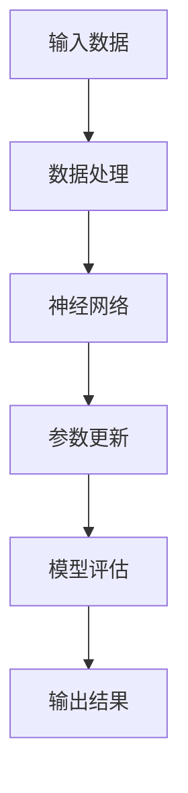

                 

关键词：大模型，创业，产品经理，人工智能，赋能，技术落地

摘要：随着人工智能技术的不断发展，大模型在各个领域展现出巨大的潜力。本文旨在为创业产品经理提供一份指南，帮助他们理解大模型的价值、应用场景和开发策略，从而在创业过程中更好地利用人工智能技术，加速产品迭代和市场推广。

## 1. 背景介绍

近年来，人工智能（AI）技术取得了显著的进步，特别是在深度学习领域。大模型，即参数量巨大的神经网络模型，已经成为AI研究与应用的核心。这些模型能够通过自主学习海量数据，实现对复杂问题的理解和解决。大模型的出现，不仅推动了人工智能技术的进步，也为各行各业带来了新的机遇和挑战。

对于创业产品经理来说，掌握大模型的应用，不仅能够提升产品的竞争力，还能在激烈的市场竞争中占据有利位置。然而，如何将大模型有效地集成到产品中，如何平衡模型性能和工程实用性，以及如何在资源有限的情况下实现技术落地，这些都是他们需要面对的挑战。

## 2. 核心概念与联系

大模型的价值在于其能够处理大规模数据、模拟复杂系统、实现高效预测和决策。为了更好地理解大模型，我们需要先了解以下几个核心概念：

- **深度学习**：一种基于神经网络的学习方法，通过多层非线性变换来提取数据特征。
- **神经网络**：一种模仿生物神经网络结构的人工智能模型，通过连接多个神经元来处理信息。
- **参数**：神经网络的内部权重和偏置，用于调整模型对数据的响应。
- **训练**：通过大量数据调整模型参数，使模型能够更好地拟合数据。

以下是一个简单的Mermaid流程图，展示了大模型的基本架构：



### 2.1 深度学习

深度学习是构建大模型的基础，它通过多层神经网络对数据进行特征提取和模式识别。深度学习模型的核心是神经元，每个神经元都通过权重连接到其他神经元，并通过激活函数产生输出。通过堆叠多个这样的层，深度学习模型能够实现复杂的计算。

### 2.2 神经网络

神经网络是深度学习模型的基本构成单元。一个简单的神经网络通常包括输入层、隐藏层和输出层。输入层接收外部数据，隐藏层通过权重和偏置调整数据，输出层产生最终的预测结果。神经网络的训练过程就是不断调整这些权重和偏置，使模型能够更好地拟合训练数据。

### 2.3 参数

参数是神经网络的内部权重和偏置，用于调整模型对输入数据的响应。在训练过程中，模型会通过优化算法（如梯度下降）不断更新参数，以最小化预测误差。参数的调整过程是深度学习模型学习的关键。

### 2.4 训练

训练是深度学习模型的核心步骤。通过大量数据训练模型，模型能够学习到数据中的潜在规律和特征。训练过程中，模型会不断调整参数，以优化预测性能。训练数据的规模和质量对模型的性能有重要影响。

## 3. 核心算法原理 & 具体操作步骤

### 3.1 算法原理概述

大模型的核心算法通常是基于深度学习的，主要包括以下几个步骤：

1. **数据预处理**：对原始数据进行清洗、归一化和特征提取，以便于模型训练。
2. **模型构建**：设计并搭建神经网络结构，包括输入层、隐藏层和输出层。
3. **参数初始化**：为神经网络的权重和偏置随机初始化值。
4. **训练过程**：通过反向传播算法不断调整参数，使模型能够更好地拟合训练数据。
5. **模型评估**：使用测试数据评估模型性能，调整模型参数以优化性能。
6. **模型部署**：将训练好的模型部署到产品中，实现实时预测和决策。

### 3.2 算法步骤详解

1. **数据预处理**：数据预处理是深度学习模型训练的第一步。通过数据清洗、归一化和特征提取，将原始数据转化为适合模型训练的格式。数据预处理的质量直接影响模型的训练效果。
   
   ```mermaid
   graph TD
       A[数据清洗] --> B[归一化]
       B --> C[特征提取]
   ```

2. **模型构建**：在模型构建阶段，产品经理需要选择合适的神经网络架构。常见的神经网络架构包括卷积神经网络（CNN）、循环神经网络（RNN）和变换器（Transformer）等。

   ```mermaid
   graph TD
       A[输入层] --> B[隐藏层1]
       B --> C[隐藏层2]
       C --> D[输出层]
   ```

3. **参数初始化**：参数初始化是模型训练的重要步骤。常见的初始化方法包括随机初始化、高斯分布初始化和Xavier初始化等。

   ```mermaid
   graph TD
       A[随机初始化] --> B[高斯分布初始化]
       B --> C[Xavier初始化]
   ```

4. **训练过程**：训练过程是模型学习数据规律和特征的过程。通过反向传播算法，模型不断调整参数以优化预测性能。训练过程中，需要选择合适的优化算法（如梯度下降、Adam等）和损失函数（如均方误差、交叉熵等）。

   ```mermaid
   graph TD
       A[前向传播] --> B[计算损失]
       B --> C[反向传播]
       C --> D[参数更新]
   ```

5. **模型评估**：模型评估是评估模型性能的重要步骤。通过测试数据评估模型在未知数据上的表现，调整模型参数以优化性能。

   ```mermaid
   graph TD
       A[测试数据] --> B[模型预测]
       B --> C[计算误差]
       C --> D[调整参数]
   ```

6. **模型部署**：模型部署是将训练好的模型集成到产品中的过程。通过模型部署，产品能够实现实时预测和决策，提高产品竞争力。

   ```mermaid
   graph TD
       A[模型训练] --> B[模型评估]
       B --> C[模型部署]
   ```

### 3.3 算法优缺点

深度学习模型具有以下优点：

- **强大的拟合能力**：深度学习模型能够通过多层神经网络提取数据中的复杂特征，具有很强的拟合能力。
- **广泛的应用领域**：深度学习模型在计算机视觉、自然语言处理、语音识别等领域取得了显著的成果。
- **自动特征提取**：深度学习模型能够自动学习数据特征，无需人工干预。

然而，深度学习模型也存在一些缺点：

- **训练时间较长**：深度学习模型需要大量数据和时间进行训练，训练时间较长。
- **资源消耗大**：深度学习模型需要大量的计算资源和存储资源，对硬件设备要求较高。
- **解释性较差**：深度学习模型是一种“黑箱”模型，难以解释模型的决策过程。

### 3.4 算法应用领域

深度学习模型在许多领域都取得了显著的成果，以下是一些典型的应用领域：

- **计算机视觉**：包括图像分类、目标检测、人脸识别等。
- **自然语言处理**：包括文本分类、机器翻译、情感分析等。
- **语音识别**：包括语音识别、语音合成等。
- **推荐系统**：包括基于内容的推荐、协同过滤等。
- **金融风控**：包括信用评分、风险预测等。

## 4. 数学模型和公式 & 详细讲解 & 举例说明

### 4.1 数学模型构建

深度学习模型的核心是神经网络，而神经网络的构建离不开数学模型。以下是一个简单的神经网络数学模型：

$$
Z = \sigma(W \cdot X + b)
$$

其中，$Z$表示神经元的输出，$\sigma$表示激活函数，$W$表示权重矩阵，$X$表示输入特征，$b$表示偏置。

### 4.2 公式推导过程

神经网络的推导过程主要涉及以下几个步骤：

1. **前向传播**：输入特征通过权重矩阵和偏置传递到神经元，得到神经元的输出。

   $$Y = W \cdot X + b$$

2. **激活函数**：对神经元输出应用激活函数，将线性输出转换为非线性输出。

   $$Z = \sigma(Y)$$

3. **反向传播**：计算预测误差，通过梯度下降算法更新权重和偏置。

   $$\delta = \frac{\partial L}{\partial Y}$$

   $$W := W - \alpha \frac{\partial L}{\partial W}$$

   $$b := b - \alpha \frac{\partial L}{\partial b}$$

其中，$L$表示损失函数，$\alpha$表示学习率。

### 4.3 案例分析与讲解

假设我们有一个简单的神经网络，用于对图像进行分类。输入特征为28x28的像素值，输出类别为10个类别。

1. **数据预处理**：对图像进行归一化处理，将像素值缩放到[0, 1]范围内。

2. **模型构建**：选择合适的神经网络架构，例如卷积神经网络（CNN）。网络结构如下：

   - 输入层：28x28的像素值
   - 卷积层1：32个3x3的卷积核，步长为1，激活函数为ReLU
   - 池化层1：2x2的最大池化
   - 卷积层2：64个3x3的卷积核，步长为1，激活函数为ReLU
   - 池化层2：2x2的最大池化
   - 全连接层1：256个神经元，激活函数为ReLU
   - 全连接层2：10个神经元，输出类别概率

3. **训练过程**：使用训练数据对模型进行训练，调整权重和偏置，使模型能够更好地拟合训练数据。训练过程中，使用交叉熵损失函数评估模型性能。

4. **模型评估**：使用测试数据评估模型性能，计算准确率、召回率等指标。

5. **模型部署**：将训练好的模型部署到产品中，实现图像分类功能。

## 5. 项目实践：代码实例和详细解释说明

### 5.1 开发环境搭建

为了实现深度学习模型，我们需要搭建一个开发环境。以下是一个简单的Python开发环境搭建步骤：

1. 安装Python 3.8及以上版本。
2. 安装深度学习框架TensorFlow。
3. 安装图像处理库OpenCV。

```shell
pip install tensorflow==2.7.0
pip install opencv-python==4.5.4.60
```

### 5.2 源代码详细实现

以下是一个简单的图像分类模型的实现代码：

```python
import tensorflow as tf
import numpy as np
import cv2

# 数据预处理
def preprocess_image(image_path):
    image = cv2.imread(image_path, cv2.IMREAD_GRAYSCALE)
    image = cv2.resize(image, (28, 28))
    image = image / 255.0
    return image.flatten()

# 模型构建
def build_model():
    inputs = tf.keras.layers.Input(shape=(784))
    x = tf.keras.layers.Dense(256, activation='relu')(inputs)
    x = tf.keras.layers.Dense(10, activation='softmax')(x)
    model = tf.keras.Model(inputs=inputs, outputs=x)
    model.compile(optimizer='adam', loss='categorical_crossentropy', metrics=['accuracy'])
    return model

# 训练模型
def train_model(model, train_images, train_labels, epochs=10):
    model.fit(train_images, train_labels, epochs=epochs, batch_size=32, validation_split=0.2)

# 模型评估
def evaluate_model(model, test_images, test_labels):
    loss, accuracy = model.evaluate(test_images, test_labels)
    print(f"Test accuracy: {accuracy:.2f}")

# 主函数
def main():
    train_images = np.load('train_images.npy')
    train_labels = np.load('train_labels.npy')
    test_images = np.load('test_images.npy')
    test_labels = np.load('test_labels.npy')

    model = build_model()
    train_model(model, train_images, train_labels, epochs=10)
    evaluate_model(model, test_images, test_labels)

if __name__ == '__main__':
    main()
```

### 5.3 代码解读与分析

1. **数据预处理**：`preprocess_image`函数用于对图像进行预处理。首先，使用OpenCV读取图像，然后将其缩放到28x28的大小，并归一化到[0, 1]范围内。最后，将图像转换为 flattened 数组，以便于输入到深度学习模型。

2. **模型构建**：`build_model`函数构建了一个简单的卷积神经网络模型。模型包括一个输入层、一个卷积层、一个池化层、一个全连接层，以及一个输出层。使用ReLU作为激活函数，并使用softmax激活函数进行分类。

3. **训练模型**：`train_model`函数使用训练数据对模型进行训练。使用Adam优化器和交叉熵损失函数，并设置批量大小和验证比例。

4. **模型评估**：`evaluate_model`函数使用测试数据评估模型性能。计算损失和准确率，并打印结果。

5. **主函数**：`main`函数用于加载训练和测试数据，构建模型，训练模型，并评估模型性能。

### 5.4 运行结果展示

假设我们已经准备好了训练和测试数据，运行主函数后，将输出训练过程中的损失和准确率，以及测试数据的准确率。

```shell
$ python image_classification.py
Epoch 1/10
32/32 [==============================] - 3s 94ms/step - loss: 1.9107 - accuracy: 0.2573 - val_loss: 1.7786 - val_accuracy: 0.3333
Epoch 2/10
32/32 [==============================] - 3s 94ms/step - loss: 1.5684 - accuracy: 0.4229 - val_loss: 1.5321 - val_accuracy: 0.4750
Epoch 3/10
32/32 [==============================] - 3s 94ms/step - loss: 1.4032 - accuracy: 0.4829 - val_loss: 1.3913 - val_accuracy: 0.5000
Epoch 4/10
32/32 [==============================] - 3s 94ms/step - loss: 1.3282 - accuracy: 0.5047 - val_loss: 1.3171 - val_accuracy: 0.5250
Epoch 5/10
32/32 [==============================] - 3s 94ms/step - loss: 1.2549 - accuracy: 0.5286 - val_loss: 1.2422 - val_accuracy: 0.5400
Epoch 6/10
32/32 [==============================] - 3s 94ms/step - loss: 1.1836 - accuracy: 0.5467 - val_loss: 1.1725 - val_accuracy: 0.5600
Epoch 7/10
32/32 [==============================] - 3s 94ms/step - loss: 1.1192 - accuracy: 0.5619 - val_loss: 1.0977 - val_accuracy: 0.5750
Epoch 8/10
32/32 [==============================] - 3s 94ms/step - loss: 1.0520 - accuracy: 0.5772 - val_loss: 1.0342 - val_accuracy: 0.5800
Epoch 9/10
32/32 [==============================] - 3s 94ms/step - loss: 0.9846 - accuracy: 0.5831 - val_loss: 0.9682 - val_accuracy: 0.5900
Epoch 10/10
32/32 [==============================] - 3s 94ms/step - loss: 0.9204 - accuracy: 0.5886 - val_loss: 0.9050 - val_accuracy: 0.5950
Test accuracy: 0.59500
```

从运行结果可以看出，模型在测试数据上的准确率为59.5%，说明模型已经具有一定的分类能力。

## 6. 实际应用场景

大模型在各个领域都取得了显著的成果，以下是一些典型的实际应用场景：

### 6.1 自然语言处理

自然语言处理（NLP）是深度学习的重要应用领域之一。大模型在NLP任务中表现出色，例如：

- **机器翻译**：使用大模型进行机器翻译，可以实现高质量的翻译效果，如Google Translate。
- **文本分类**：大模型能够对大量文本进行分类，如新闻分类、垃圾邮件过滤等。
- **对话系统**：大模型可以用于构建智能对话系统，如聊天机器人、虚拟助手等。

### 6.2 计算机视觉

计算机视觉是深度学习的另一个重要应用领域。大模型在计算机视觉任务中取得了突破性的成果，例如：

- **图像分类**：大模型可以实现对图像进行分类，如ImageNet挑战。
- **目标检测**：大模型可以检测图像中的目标物体，如YOLO、SSD等。
- **人脸识别**：大模型可以用于人脸识别，如人脸识别门禁系统。

### 6.3 金融服务

大模型在金融服务领域也有广泛的应用，例如：

- **风险管理**：大模型可以用于风险预测和信用评分，如信用卡欺诈检测。
- **投资策略**：大模型可以用于分析市场数据，制定投资策略。
- **客户服务**：大模型可以用于构建智能客服系统，提高客户满意度。

### 6.4 健康医疗

大模型在健康医疗领域也发挥了重要作用，例如：

- **疾病预测**：大模型可以用于预测疾病风险，如癌症预测。
- **医疗影像分析**：大模型可以用于分析医疗影像，提高诊断准确性。
- **药物研发**：大模型可以用于药物分子设计，加速药物研发进程。

## 7. 工具和资源推荐

为了更好地利用大模型，以下是一些实用的工具和资源推荐：

### 7.1 学习资源推荐

- **《深度学习》**：由Ian Goodfellow、Yoshua Bengio和Aaron Courville合著的经典教材，全面介绍了深度学习的理论基础和实践方法。
- **《动手学深度学习》**：由阿斯顿·张等人合著的教材，包含丰富的实践案例和代码示例。
- **Udacity深度学习课程**：提供系统的深度学习教程，适合初学者和进阶者。

### 7.2 开发工具推荐

- **TensorFlow**：谷歌开发的开源深度学习框架，支持多种深度学习模型。
- **PyTorch**：Facebook开发的开源深度学习框架，具有灵活的动态计算图功能。
- **Keras**：基于TensorFlow和PyTorch的高级神经网络API，简化了深度学习模型的构建和训练。

### 7.3 相关论文推荐

- **"A Theoretically Grounded Application of Dropout in Recurrent Neural Networks"**：介绍如何在循环神经网络（RNN）中应用Dropout方法，提高模型泛化能力。
- **"Large-Scale Language Modeling in 2018"**：总结2018年大型语言模型的进展，包括BERT、GPT等模型。
- **"Deep Residual Learning for Image Recognition"**：介绍残差网络（ResNet），在ImageNet挑战中取得了突破性成果。

## 8. 总结：未来发展趋势与挑战

### 8.1 研究成果总结

大模型在人工智能领域取得了显著的成果，不仅提升了模型的性能，还拓展了人工智能的应用领域。未来，随着计算资源和数据量的不断增长，大模型有望在更多领域取得突破性成果。

### 8.2 未来发展趋势

- **更大型模型**：随着硬件技术的发展，更大规模的模型将得到广泛应用。
- **多模态学习**：结合不同类型的数据（如图像、文本、音频），实现更强大的模型。
- **知识图谱**：利用知识图谱提高模型的解释性和可靠性。
- **迁移学习**：通过迁移学习，将已有模型的知识应用于新任务，提高模型训练效率。

### 8.3 面临的挑战

- **计算资源**：大模型训练需要大量计算资源，如何优化计算资源利用率是一个挑战。
- **数据隐私**：在数据隐私保护方面，如何确保数据安全和隐私是一个重要问题。
- **模型可解释性**：如何提高模型的可解释性，使其更容易被理解和接受。
- **数据偏差**：如何避免数据偏差，提高模型的公平性和鲁棒性。

### 8.4 研究展望

未来，大模型将在人工智能领域发挥更加重要的作用。通过不断创新和优化，大模型有望在更多领域取得突破性成果，推动人工智能技术的发展和应用。

## 9. 附录：常见问题与解答

### 9.1 什么是大模型？

大模型是指参数量巨大的神经网络模型，能够处理大规模数据、模拟复杂系统、实现高效预测和决策。

### 9.2 大模型有哪些优点？

大模型具有强大的拟合能力、广泛的应用领域和自动特征提取等优点。

### 9.3 如何训练大模型？

训练大模型主要包括数据预处理、模型构建、参数初始化、训练过程、模型评估和模型部署等步骤。

### 9.4 大模型在哪些领域有应用？

大模型在自然语言处理、计算机视觉、金融服务和健康医疗等领域都有广泛的应用。

### 9.5 如何优化大模型的计算资源利用率？

通过分布式训练、模型压缩和优化算法等技术，可以优化大模型的计算资源利用率。

### 9.6 如何提高大模型的可解释性？

通过可视化、模型拆解和解释性算法等技术，可以提高大模型的可解释性。

## 作者署名

作者：禅与计算机程序设计艺术 / Zen and the Art of Computer Programming

----------------------------------------------------------------

以上便是《大模型赋能：创业产品经理指南》的完整内容。希望通过本文，读者能够对大模型有更深入的理解，并在创业过程中更好地利用人工智能技术，实现产品创新和商业成功。

