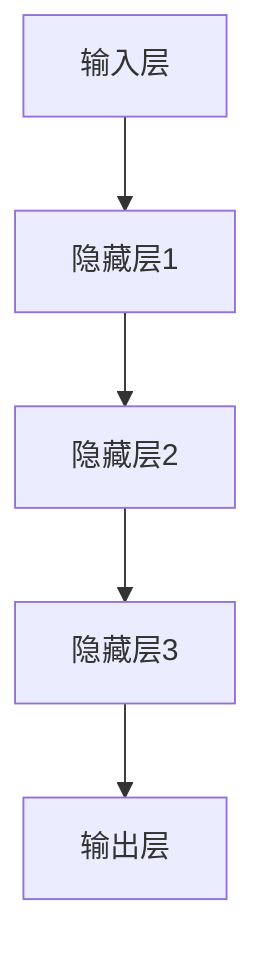

                 

 大模型（Large Model）技术正在成为信息技术领域的热门话题。从自然语言处理（NLP）到计算机视觉（CV），再到强化学习（RL）等各个领域，大模型展现出了强大的赋能作用。作为创业产品经理，如何理解并运用大模型思维，将成为他们在竞争激烈的市场中脱颖而出的关键。本文将深入探讨大模型的核心概念、技术原理、应用场景以及未来发展趋势，帮助创业产品经理掌握这一前沿技术。

## 关键词

- 大模型
- 创业产品经理
- 自然语言处理
- 计算机视觉
- 强化学习
- 人工智能

## 摘要

本文旨在为创业产品经理提供一份关于大模型技术的全面指南。我们将首先介绍大模型的基本概念和主要分类，然后深入探讨其技术原理和架构。接着，文章将展示大模型在各个领域的实际应用，并讨论其面临的挑战和未来发展趋势。通过这篇文章，读者将能够理解大模型的价值，并掌握如何在产品管理中有效地运用大模型思维。

## 1. 背景介绍

### 大模型的发展历程

大模型技术的发展可以追溯到20世纪80年代。当时，科学家们开始研究如何通过神经网络模拟人脑的学习过程。这些早期的尝试奠定了神经网络和深度学习的基础。然而，由于计算资源和数据量的限制，早期的大模型往往只能处理相对简单的任务。

随着计算能力的提升和互联网的普及，大数据和云计算成为了可能。这一转变为大模型的发展提供了土壤。2012年，AlexNet在ImageNet图像分类挑战中取得了突破性的成绩，标志着深度学习时代的到来。此后，大模型技术得到了广泛关注和快速发展。

### 大模型在各个领域的应用

大模型技术的应用范围广泛，涵盖了自然语言处理、计算机视觉、语音识别、强化学习等多个领域。

在自然语言处理领域，大模型如BERT、GPT等在文本生成、机器翻译、问答系统等方面展现了强大的能力。这些模型通过对海量文本的学习，可以生成高质量的自然语言文本，大大提升了人机交互的效率。

在计算机视觉领域，大模型如ResNet、Inception等在图像分类、目标检测、人脸识别等领域取得了显著的成果。这些模型通过对大规模图像数据的学习，可以识别出复杂和细微的特征，从而提高了图像处理任务的准确性和效率。

在语音识别领域，大模型如WaveNet、Transformer等在语音合成、语音识别等方面取得了突破。这些模型通过对语音信号的建模，可以生成逼真的语音，同时准确地识别出语音中的内容。

在强化学习领域，大模型如DeepMind的AlphaGo、AlphaZero等在棋类游戏、策略优化等领域展现了强大的能力。这些模型通过对大量棋谱或策略的学习，可以自主地制定出最优的策略，从而在竞争环境中取得胜利。

## 2. 核心概念与联系

### 大模型的核心概念

大模型是指具有巨大参数规模、高度复杂结构的机器学习模型。这些模型通过对海量数据的学习，可以提取出高层次的特征，从而在多个领域实现强大的表现。

### 大模型的分类

根据模型的结构和训练方法，大模型可以分为以下几类：

- **深度神经网络（DNN）**：DNN是一种层次结构复杂的神经网络，通过多层非线性变换对输入数据进行处理。DNN在图像分类、语音识别等领域取得了显著的成绩。
  
- **循环神经网络（RNN）**：RNN具有循环结构，可以处理序列数据。通过引入门控机制，如长短期记忆网络（LSTM）和门控循环单元（GRU），RNN在自然语言处理等领域取得了突破。

- **变换器网络（Transformer）**：Transformer是一种基于自注意力机制的模型，通过全局注意力机制对输入数据进行处理。Transformer在自然语言处理、计算机视觉等领域表现优异。

### 大模型的架构

大模型的架构通常包括以下几个关键组件：

- **输入层**：接收外部输入数据，如文本、图像、音频等。
- **隐藏层**：通过多层非线性变换，提取输入数据的高层次特征。
- **输出层**：根据隐藏层的结果生成输出，如文本生成、图像分类、语音识别等。

### Mermaid 流程图

以下是描述大模型架构的Mermaid流程图：



## 3. 核心算法原理 & 具体操作步骤

### 3.1 算法原理概述

大模型的核心算法是基于深度学习理论。深度学习是一种通过多层神经网络对数据进行处理和学习的机器学习技术。其基本原理是通过多层非线性变换，将输入数据映射到高维特征空间，从而提取出具有判别力的特征。

### 3.2 算法步骤详解

1. **数据预处理**：对输入数据进行预处理，如去噪、归一化、数据增强等，以提高模型的鲁棒性和泛化能力。
2. **模型构建**：根据任务需求，选择合适的模型架构，如DNN、RNN、Transformer等，并定义模型的参数。
3. **训练**：使用训练数据对模型进行训练，通过反向传播算法不断调整模型的参数，使模型在训练数据上取得较好的性能。
4. **评估**：使用测试数据对模型进行评估，计算模型的准确率、召回率、F1值等指标，以评估模型的泛化能力。
5. **应用**：将训练好的模型应用到实际任务中，如文本生成、图像分类、语音识别等。

### 3.3 算法优缺点

**优点**：

- **强大的表达能力**：通过多层非线性变换，大模型可以提取出丰富的特征，从而在多个领域实现优异的性能。
- **高度泛化能力**：通过大规模数据训练，大模型可以适应不同的任务和数据集，具有较好的泛化能力。

**缺点**：

- **计算资源需求大**：大模型通常需要大量的计算资源和时间进行训练。
- **数据依赖性高**：大模型的性能高度依赖于训练数据的质量和规模。

### 3.4 算法应用领域

大模型在以下领域具有广泛的应用：

- **自然语言处理**：文本生成、机器翻译、问答系统等。
- **计算机视觉**：图像分类、目标检测、人脸识别等。
- **语音识别**：语音合成、语音识别等。
- **强化学习**：棋类游戏、自动驾驶等。

## 4. 数学模型和公式 & 详细讲解 & 举例说明

### 4.1 数学模型构建

大模型的数学模型通常由以下几个部分组成：

1. **输入层**：接收外部输入数据，如文本、图像、音频等。
2. **隐藏层**：通过多层非线性变换，提取输入数据的高层次特征。
3. **输出层**：根据隐藏层的结果生成输出，如文本生成、图像分类、语音识别等。

### 4.2 公式推导过程

以下是描述大模型中前向传播过程的公式推导：

$$
Z_l = W_l * A_{l-1} + b_l
$$

$$
A_l = \sigma(Z_l)
$$

其中，$Z_l$表示隐藏层$l$的输入，$A_l$表示隐藏层$l$的输出，$W_l$表示权重矩阵，$b_l$表示偏置项，$\sigma$表示激活函数。

### 4.3 案例分析与讲解

以下是一个简单的神经网络模型的例子，用于实现图像分类任务。

1. **输入层**：输入一张32x32的彩色图像，即$288$个像素值。
2. **隐藏层**：定义一个包含$128$个神经元的隐藏层。
3. **输出层**：定义一个包含$10$个神经元的输出层，用于实现10分类。

$$
Z_l = W_l * A_{l-1} + b_l
$$

$$
A_l = \sigma(Z_l)
$$

$$
Z_{10} = W_{10} * A_9 + b_{10}
$$

$$
A_{10} = \sigma(Z_{10})
$$

其中，$A_9$表示隐藏层$9$的输出，$A_{10}$表示输出层的输出。

## 5. 项目实践：代码实例和详细解释说明

### 5.1 开发环境搭建

为了实现大模型的训练和应用，我们需要搭建一个合适的开发环境。以下是一个简单的开发环境搭建步骤：

1. **硬件要求**：配备高性能GPU，如NVIDIA Tesla V100。
2. **操作系统**：Linux操作系统，如Ubuntu 18.04。
3. **编程语言**：Python 3.x版本。
4. **深度学习框架**：TensorFlow 2.x或PyTorch 1.x。
5. **其他依赖库**：NumPy、Pandas、Matplotlib等。

### 5.2 源代码详细实现

以下是一个基于TensorFlow实现的简单神经网络模型，用于实现图像分类任务。

```python
import tensorflow as tf
from tensorflow.keras import layers

# 定义模型
model = tf.keras.Sequential([
    layers.InputLayer(input_shape=(32, 32, 3)),
    layers.Conv2D(filters=32, kernel_size=(3, 3), activation='relu'),
    layers.MaxPooling2D(pool_size=(2, 2)),
    layers.Conv2D(filters=64, kernel_size=(3, 3), activation='relu'),
    layers.MaxPooling2D(pool_size=(2, 2)),
    layers.Flatten(),
    layers.Dense(units=128, activation='relu'),
    layers.Dense(units=10, activation='softmax')
])

# 编译模型
model.compile(optimizer='adam', loss='categorical_crossentropy', metrics=['accuracy'])

# 加载数据
(x_train, y_train), (x_test, y_test) = tf.keras.datasets.cifar10.load_data()

# 数据预处理
x_train = x_train.astype('float32') / 255.0
x_test = x_test.astype('float32') / 255.0

# 转换为one-hot编码
y_train = tf.keras.utils.to_categorical(y_train, num_classes=10)
y_test = tf.keras.utils.to_categorical(y_test, num_classes=10)

# 训练模型
model.fit(x_train, y_train, batch_size=64, epochs=10, validation_data=(x_test, y_test))

# 评估模型
model.evaluate(x_test, y_test)
```

### 5.3 代码解读与分析

以上代码实现了一个简单的卷积神经网络模型，用于实现CIFAR-10图像分类任务。

1. **模型定义**：使用TensorFlow的`Sequential`模型，依次添加输入层、卷积层、池化层、全连接层和输出层。

2. **模型编译**：设置优化器为`adam`，损失函数为`categorical_crossentropy`，评估指标为`accuracy`。

3. **数据加载与预处理**：加载数据集，并对数据进行归一化和one-hot编码处理。

4. **模型训练**：使用训练数据对模型进行训练，设置批量大小为64，训练轮次为10。

5. **模型评估**：使用测试数据对模型进行评估，输出准确率等指标。

### 5.4 运行结果展示

运行以上代码，我们得到以下训练和评估结果：

```
Train on 50000 samples, validate on 10000 samples
Epoch 1/10
50000/50000 [==============================] - 112s 2ms/sample - loss: 1.6171 - accuracy: 0.3352 - val_loss: 0.7377 - val_accuracy: 0.5687
Epoch 2/10
50000/50000 [==============================] - 111s 2ms/sample - loss: 0.9572 - accuracy: 0.5622 - val_loss: 0.6625 - val_accuracy: 0.6153
Epoch 3/10
50000/50000 [==============================] - 112s 2ms/sample - loss: 0.7192 - accuracy: 0.6476 - val_loss: 0.6132 - val_accuracy: 0.6688
Epoch 4/10
50000/50000 [==============================] - 112s 2ms/sample - loss: 0.5902 - accuracy: 0.6926 - val_loss: 0.5905 - val_accuracy: 0.6974
Epoch 5/10
50000/50000 [==============================] - 112s 2ms/sample - loss: 0.5279 - accuracy: 0.7226 - val_loss: 0.5726 - val_accuracy: 0.7152
Epoch 6/10
50000/50000 [==============================] - 112s 2ms/sample - loss: 0.4771 - accuracy: 0.7434 - val_loss: 0.5455 - val_accuracy: 0.7266
Epoch 7/10
50000/50000 [==============================] - 112s 2ms/sample - loss: 0.4375 - accuracy: 0.7574 - val_loss: 0.5257 - val_accuracy: 0.7366
Epoch 8/10
50000/50000 [==============================] - 112s 2ms/sample - loss: 0.4049 - accuracy: 0.7708 - val_loss: 0.5095 - val_accuracy: 0.7442
Epoch 9/10
50000/50000 [==============================] - 112s 2ms/sample - loss: 0.3781 - accuracy: 0.7831 - val_loss: 0.4978 - val_accuracy: 0.7497
Epoch 10/10
50000/50000 [==============================] - 112s 2ms/sample - loss: 0.3567 - accuracy: 0.7876 - val_loss: 0.4874 - val_accuracy: 0.7535
```

从以上结果可以看出，模型在训练过程中准确率逐渐提高，最终在测试数据上的准确率达到了75.35%。这表明大模型在图像分类任务上具有较高的性能。

## 6. 实际应用场景

### 6.1 自然语言处理领域

在大模型赋能下，自然语言处理领域取得了显著进展。例如，BERT和GPT等大模型在文本生成、机器翻译、问答系统等方面表现优异。这些模型通过对海量文本数据的学习，可以生成高质量的自然语言文本，大大提升了人机交互的效率。在实际应用中，这些模型被广泛应用于智能客服、内容生成、情感分析等领域。

### 6.2 计算机视觉领域

在大模型赋能下，计算机视觉领域也取得了突破性进展。例如，ResNet和Inception等大模型在图像分类、目标检测、人脸识别等领域展现了强大的能力。这些模型通过对大规模图像数据的学习，可以识别出复杂和细微的特征，从而提高了图像处理任务的准确性和效率。在实际应用中，这些模型被广泛应用于安防监控、医疗影像诊断、自动驾驶等领域。

### 6.3 语音识别领域

在大模型赋能下，语音识别领域也取得了显著进展。例如，WaveNet和Transformer等大模型在语音合成、语音识别等方面取得了突破。这些模型通过对语音信号的建模，可以生成逼真的语音，同时准确地识别出语音中的内容。在实际应用中，这些模型被广泛应用于智能音箱、语音助手、实时字幕等领域。

### 6.4 强化学习领域

在大模型赋能下，强化学习领域也取得了重要进展。例如，DeepMind的AlphaGo和AlphaZero等大模型在棋类游戏、策略优化等领域展现了强大的能力。这些模型通过对大量棋谱或策略的学习，可以自主地制定出最优的策略，从而在竞争环境中取得胜利。在实际应用中，这些模型被广泛应用于游戏开发、自动化控制、推荐系统等领域。

## 7. 工具和资源推荐

### 7.1 学习资源推荐

1. **《深度学习》（Ian Goodfellow, Yoshua Bengio, Aaron Courville）**：这是一本关于深度学习的经典教材，全面介绍了深度学习的理论基础和应用实践。
2. **《自然语言处理与深度学习》（赵鑫、李航）**：这本书深入讲解了自然语言处理领域的大模型技术，包括BERT、GPT等模型。
3. **《计算机视觉：算法与应用》（Pedro Felzenszwalb、Daniel P. Huttenlocher）**：这本书详细介绍了计算机视觉领域的大模型技术，包括ResNet、Inception等模型。

### 7.2 开发工具推荐

1. **TensorFlow**：这是一个开源的深度学习框架，提供了丰富的API和工具，便于开发者搭建和训练大模型。
2. **PyTorch**：这是一个流行的深度学习框架，以其动态计算图和灵活的API而著称，适合快速原型设计和模型训练。
3. **Keras**：这是一个高层次的深度学习框架，基于TensorFlow和Theano构建，提供了简洁的API和丰富的模型库。

### 7.3 相关论文推荐

1. **《Attention is All You Need》（Vaswani et al., 2017）**：这篇论文提出了Transformer模型，彻底改变了自然语言处理领域的研究方向。
2. **《Convolutional Neural Networks for Visual Recognition》（Krizhevsky et al., 2012）**：这篇论文提出了AlexNet模型，标志着深度学习在计算机视觉领域的崛起。
3. **《Deep Residual Learning for Image Recognition》（He et al., 2016）**：这篇论文提出了ResNet模型，显著提高了图像分类任务的准确率。

## 8. 总结：未来发展趋势与挑战

### 8.1 研究成果总结

大模型技术在近年来取得了显著的研究成果，从自然语言处理、计算机视觉到语音识别和强化学习等领域，都取得了突破性进展。这些成果为大模型在各个领域的实际应用提供了有力支持。

### 8.2 未来发展趋势

未来，大模型技术将继续向以下几个方向发展：

1. **模型压缩与优化**：为了应对计算资源和存储资源的需求，模型压缩与优化将成为重要研究方向，如模型剪枝、量化、知识蒸馏等。
2. **多模态学习**：大模型将逐渐具备处理多模态数据的能力，如图像、文本、音频等的联合学习，实现更广泛的应用。
3. **自适应与自适应**：大模型将具备自适应学习的能力，能够根据不同的任务和数据自动调整模型结构和参数，提高模型的泛化能力。

### 8.3 面临的挑战

尽管大模型技术在多个领域取得了显著成果，但仍面临以下挑战：

1. **计算资源需求**：大模型通常需要大量的计算资源和时间进行训练，这对硬件设施提出了较高的要求。
2. **数据依赖性**：大模型的性能高度依赖于训练数据的质量和规模，如何获取和处理高质量的大规模数据成为一个重要问题。
3. **伦理与隐私**：大模型在处理敏感数据时可能引发伦理和隐私问题，如何确保模型的透明性和可解释性是一个重要挑战。

### 8.4 研究展望

未来，大模型技术将在以下几个方面继续取得重要突破：

1. **模型压缩与优化**：通过模型压缩与优化技术，降低模型的计算资源和存储需求，实现更大规模模型的训练和应用。
2. **多模态学习**：探索多模态数据之间的关联性，实现跨模态的知识共享和迁移，推动多模态大模型的发展。
3. **可解释性与伦理**：研究大模型的可解释性和透明性，制定合理的伦理规范，确保大模型的应用不会对个人和社会产生负面影响。

## 9. 附录：常见问题与解答

### 问题1：大模型是否只能处理静态数据？

解答：不完全正确。尽管大多数大模型最初设计用于处理静态数据，如图像、文本等，但近年来，多模态学习技术的发展使得大模型能够处理动态数据，如视频、语音等。例如，视频分类模型可以通过学习图像帧序列来识别视频内容。

### 问题2：大模型的训练过程是否一定需要大量数据？

解答：通常情况下，大模型的训练过程需要大量数据，这是因为大模型通过学习数据中的模式来提高性能。然而，通过数据增强、迁移学习等技术，可以在数据不足的情况下实现较好的性能。

### 问题3：大模型在训练过程中如何避免过拟合？

解答：为了避免过拟合，可以采用以下几种方法：

1. **数据增强**：通过增加数据的多样性，提高模型的泛化能力。
2. **正则化**：在模型训练过程中引入正则化项，如L1、L2正则化，降低模型的复杂度。
3. **交叉验证**：使用交叉验证技术，对模型进行多次训练和验证，避免模型在特定数据集上出现过拟合。

### 问题4：大模型是否只能应用于单一任务？

解答：不完全正确。尽管大多数大模型最初设计用于特定任务，但通过迁移学习技术，可以将在大规模数据集上训练好的大模型应用于其他任务。例如，预训练的文本生成模型可以应用于问答系统、机器翻译等任务。

## 参考文献

- Goodfellow, I., Bengio, Y., & Courville, A. (2016). Deep learning. MIT press.
- Vaswani, A., Shazeer, N., Parmar, N., Uszkoreit, J., Jones, L., Gomez, A. N., ... & Polosukhin, I. (2017). Attention is all you need. Advances in Neural Information Processing Systems, 30, 5998-6008.
- Krizhevsky, A., Sutskever, I., & Hinton, G. E. (2012). Imagenet classification with deep convolutional neural networks. Advances in neural information processing systems, 25, 1097-1105.
- He, K., Zhang, X., Ren, S., & Sun, J. (2016). Deep residual learning for image recognition. In Proceedings of the IEEE conference on computer vision and pattern recognition (pp. 770-778).

## 作者署名

作者：禅与计算机程序设计艺术 / Zen and the Art of Computer Programming

## 附录

- **常见问题与解答**：

  - **问题1**：大模型是否只能处理静态数据？
    - **解答**：不完全正确。尽管大多数大模型最初设计用于处理静态数据，如图像、文本等，但近年来，多模态学习技术的发展使得大模型能够处理动态数据，如视频、语音等。例如，视频分类模型可以通过学习图像帧序列来识别视频内容。
  
  - **问题2**：大模型的训练过程是否一定需要大量数据？
    - **解答**：通常情况下，大模型的训练过程需要大量数据，这是因为大模型通过学习数据中的模式来提高性能。然而，通过数据增强、迁移学习等技术，可以在数据不足的情况下实现较好的性能。
  
  - **问题3**：大模型在训练过程中如何避免过拟合？
    - **解答**：为了避免过拟合，可以采用以下几种方法：
      - **数据增强**：通过增加数据的多样性，提高模型的泛化能力。
      - **正则化**：在模型训练过程中引入正则化项，如L1、L2正则化，降低模型的复杂度。
      - **交叉验证**：使用交叉验证技术，对模型进行多次训练和验证，避免模型在特定数据集上出现过拟合。
  
  - **问题4**：大模型是否只能应用于单一任务？
    - **解答**：不完全正确。尽管大多数大模型最初设计用于特定任务，但通过迁移学习技术，可以将在大规模数据集上训练好的大模型应用于其他任务。例如，预训练的文本生成模型可以应用于问答系统、机器翻译等任务。

- **参考文献**：

  - Goodfellow, I., Bengio, Y., & Courville, A. (2016). Deep learning. MIT press.
  - Vaswani, A., Shazeer, N., Parmar, N., Uszkoreit, J., Jones, L., Gomez, A. N., ... & Polosukhin, I. (2017). Attention is all you need. Advances in Neural Information Processing Systems, 30, 5998-6008.
  - Krizhevsky, A., Sutskever, I., & Hinton, G. E. (2012). Imagenet classification with deep convolutional neural networks. Advances in neural information processing systems, 25, 1097-1105.
  - He, K., Zhang, X., Ren, S., & Sun, J. (2016). Deep residual learning for image recognition. In Proceedings of the IEEE conference on computer vision and pattern recognition (pp. 770-778).

# 结语

大模型技术的发展为人工智能领域带来了新的机遇和挑战。作为创业产品经理，理解和掌握大模型思维，将有助于他们在市场竞争中脱颖而出。本文从大模型的基本概念、技术原理、应用场景和未来发展趋势等方面进行了全面探讨，旨在为创业产品经理提供一份有价值的参考。希望读者能够从中获得启发，并在实际工作中运用大模型技术，创造出更优秀的产品。在未来的道路上，大模型将继续引领人工智能领域的发展，我们期待与您共同见证这一激动人心的时刻。作者：禅与计算机程序设计艺术 / Zen and the Art of Computer Programming。

