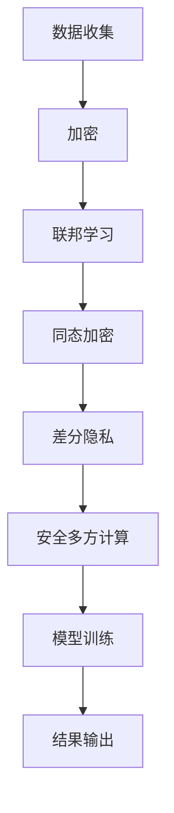
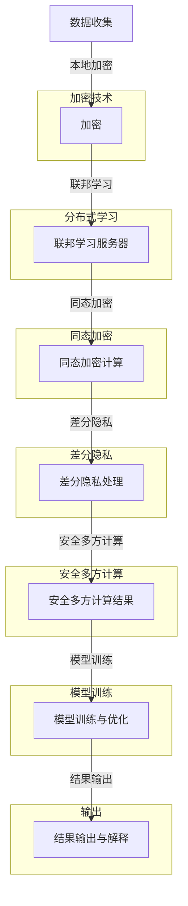

                 

关键词：大模型，隐私保护，数据安全，加密技术，联邦学习，同态加密，差分隐私，安全多方计算，分布式计算

> 摘要：本文深入探讨了在大模型应用中如何确保数据安全的重要性，以及各种技术手段如加密技术、联邦学习、同态加密、差分隐私和安全多方计算等在隐私保护中的应用。通过详细的算法原理、数学模型和实际应用案例分析，本文为读者提供了全面而系统的隐私保护技术解决方案。

## 1. 背景介绍

随着大数据和人工智能的飞速发展，大模型（如深度神经网络）在各个领域得到了广泛应用，如图像识别、自然语言处理、医疗诊断等。然而，这些大模型通常依赖于大量的训练数据，而这些数据往往包含敏感信息，如个人身份信息、医疗记录、金融交易数据等。如果这些数据在训练和使用过程中没有得到妥善的保护，就可能被恶意攻击者窃取或滥用，导致严重的安全和隐私问题。

数据隐私泄露不仅对个人隐私造成威胁，还可能对企业声誉造成严重影响，甚至对国家安全构成隐患。因此，如何在保护数据隐私的同时充分利用数据的价值，成为了当前亟待解决的问题。为了应对这一挑战，学术界和工业界提出了多种隐私保护技术手段，这些技术在大模型的应用中起到了至关重要的作用。

本文将重点探讨以下几种隐私保护技术：

1. **加密技术**：通过加密算法对数据进行加密处理，确保数据在传输和存储过程中不被窃取或篡改。
2. **联邦学习**：一种分布式机器学习方法，可以在保护数据隐私的前提下，联合多个参与方的数据进行模型训练。
3. **同态加密**：允许在加密数据上直接执行计算，而不需要解密数据，从而保护数据的隐私。
4. **差分隐私**：一种隐私保护机制，通过引入随机噪声来防止数据中的个体信息被揭示。
5. **安全多方计算**：允许多个参与方在不需要共享原始数据的情况下，共同计算数据的函数。

接下来，本文将详细讨论上述技术的原理、具体应用以及未来发展趋势。

## 2. 核心概念与联系

为了更好地理解隐私保护技术在数据安全中的应用，我们首先需要了解一些核心概念和它们之间的联系。

### 2.1 加密技术

加密技术是保护数据隐私的基本手段之一。它通过将数据转换为加密形式，只有具有解密密钥的用户才能解读数据。常见的加密算法包括对称加密（如AES）和非对称加密（如RSA）。对称加密速度快，但密钥分发困难；非对称加密则相反。

### 2.2 联邦学习

联邦学习是一种分布式机器学习方法，允许不同节点（如手机、数据中心等）在本地训练模型，并将模型更新上传至中央服务器。这样，每个节点都不需要共享原始数据，从而保护了数据隐私。

### 2.3 同态加密

同态加密是一种在加密数据上直接执行计算而不需要解密数据的加密技术。这使得数据在传输和存储过程中保持加密状态，从而提高了数据安全性。

### 2.4 差分隐私

差分隐私是一种隐私保护机制，通过在数据中引入随机噪声来防止个体信息被揭示。常见的方法包括拉普拉斯机制和指数机制。

### 2.5 安全多方计算

安全多方计算是一种允许多个参与方在不需要共享原始数据的情况下，共同计算数据的函数的方法。它广泛应用于金融、医疗等领域。

### 2.6 Mermaid 流程图

下面是一个简化的Mermaid流程图，展示了隐私保护技术的基本架构：



### 2.7 核心概念与联系的 Mermaid 流程图

下面是核心概念与联系的 Mermaid 流程图，其中使用了 Mermaid 图表语言来描述各个隐私保护技术的流程和联系。



## 3. 核心算法原理 & 具体操作步骤

### 3.1 算法原理概述

隐私保护技术的核心在于如何在不损害数据价值的前提下，保护数据隐私。这需要多种技术的综合应用，包括加密、联邦学习、同态加密、差分隐私和安全多方计算。

- **加密技术**：通过对数据进行加密处理，确保数据在传输和存储过程中不被窃取或篡改。
- **联邦学习**：通过分布式计算，在保护数据隐私的前提下，联合多个参与方的数据进行模型训练。
- **同态加密**：在加密数据上直接执行计算，从而保护数据隐私。
- **差分隐私**：通过在数据中引入随机噪声，防止个体信息被揭示。
- **安全多方计算**：允许多个参与方在不需要共享原始数据的情况下，共同计算数据的函数。

### 3.2 算法步骤详解

#### 3.2.1 加密技术

加密技术的具体操作步骤如下：

1. **密钥生成**：生成一对密钥（加密密钥和解密密钥）。
2. **数据加密**：使用加密密钥将数据进行加密。
3. **数据传输**：将加密后的数据传输到目标位置。
4. **数据解密**：使用解密密钥对加密数据进行解密。

#### 3.2.2 联邦学习

联邦学习的具体操作步骤如下：

1. **数据本地预处理**：在本地对数据进行预处理，如去噪、标准化等。
2. **模型初始化**：初始化全局模型参数。
3. **本地训练**：在每个节点上使用本地数据训练模型，并生成模型更新。
4. **模型更新聚合**：将所有节点的模型更新上传到中央服务器，并进行聚合。
5. **全局模型更新**：根据聚合后的模型更新，更新全局模型。

#### 3.2.3 同态加密

同态加密的具体操作步骤如下：

1. **数据加密**：使用同态加密算法将数据进行加密。
2. **加密计算**：在加密数据上直接执行计算操作。
3. **结果解密**：将加密计算的结果进行解密。

#### 3.2.4 差分隐私

差分隐私的具体操作步骤如下：

1. **数据预处理**：对数据进行预处理，如噪声添加、数据变换等。
2. **查询处理**：对查询操作引入随机噪声，以防止个体信息被揭示。
3. **结果输出**：输出经过差分隐私处理的查询结果。

#### 3.2.5 安全多方计算

安全多方计算的具体操作步骤如下：

1. **协议协商**：参与方之间协商安全协议。
2. **数据加密**：将数据进行加密处理。
3. **共同计算**：参与方在加密数据上共同计算所需的结果。
4. **结果解密**：将共同计算的结果进行解密。

### 3.3 算法优缺点

#### 3.3.1 加密技术

- 优点：能够有效地保护数据隐私，适用于数据传输和存储场景。
- 缺点：加密和解密过程需要额外计算资源，可能会影响性能。

#### 3.3.2 联邦学习

- 优点：能够保护数据隐私，提高数据利用效率，适用于分布式环境。
- 缺点：可能存在通信延迟和模型精度下降的问题。

#### 3.3.3 同态加密

- 优点：能够在加密数据上直接执行计算，保护数据隐私。
- 缺点：同态加密算法计算复杂度较高，性能可能受到限制。

#### 3.3.4 差分隐私

- 优点：能够有效地保护数据隐私，适用于各种查询场景。
- 缺点：可能会引入额外的噪声，影响查询结果的准确性。

#### 3.3.5 安全多方计算

- 优点：能够在不共享原始数据的情况下，实现多方共同计算。
- 缺点：协议协商和计算复杂度较高，可能影响性能。

### 3.4 算法应用领域

#### 3.4.1 加密技术

加密技术广泛应用于金融、医疗、政府等领域的数据安全保护。

#### 3.4.2 联邦学习

联邦学习在智能手机、物联网、共享经济等领域有广泛应用。

#### 3.4.3 同态加密

同态加密在医疗影像处理、金融交易分析等领域有潜在应用。

#### 3.4.4 差分隐私

差分隐私在数据分析和查询场景中具有重要应用，如社交网络、搜索引擎等。

#### 3.4.5 安全多方计算

安全多方计算在金融、医疗、投票等领域有广泛应用，如区块链、智能合约等。

## 4. 数学模型和公式 & 详细讲解 & 举例说明

### 4.1 数学模型构建

隐私保护技术中的数学模型主要包括加密算法模型、联邦学习模型、同态加密模型、差分隐私模型和安全多方计算模型。以下将分别介绍这些模型的构建方法和公式。

#### 4.1.1 加密算法模型

加密算法模型主要基于加密数学理论，包括对称加密和非对称加密。

- 对称加密：设明文为\(M\)，密文为\(C\)，加密密钥为\(K_{enc}\)，解密密钥为\(K_{dec}\)，则有：
  $$C = E_{K_{enc}}(M)$$
  $$M = D_{K_{dec}}(C)$$
- 非对称加密：设明文为\(M\)，密文为\(C\)，加密公钥为\(K_{pub}\)，解密私钥为\(K_{priv}\)，则有：
  $$C = E_{K_{pub}}(M)$$
  $$M = D_{K_{priv}}(C)$$

#### 4.1.2 联邦学习模型

联邦学习模型主要基于分布式计算理论，包括模型初始化、本地训练、模型更新聚合和全局模型更新。

- 模型初始化：设全局模型参数为\(\theta_0\)，则有：
  $$\theta_0 = \theta_{0_i}$$
- 本地训练：设每个节点上的模型参数为\(\theta_i\)，则有：
  $$\theta_i = \theta_{i-1} + \alpha_i \cdot \nabla f(\theta_{i-1}; x_i, y_i)$$
- 模型更新聚合：设全局模型更新为\(\theta_i\)，则有：
  $$\theta_i = \theta_{i-1} + \sum_{j=1}^{n} \alpha_j \cdot \nabla f(\theta_{i-1}; x_j, y_j)$$
- 全局模型更新：设更新后的全局模型参数为\(\theta_i\)，则有：
  $$\theta_i = \theta_i$$

#### 4.1.3 同态加密模型

同态加密模型主要基于同态加密算法，包括数据加密、加密计算和结果解密。

- 数据加密：设明文为\(M\)，密文为\(C\)，加密函数为\(E(\cdot)\)，则有：
  $$C = E(M)$$
- 加密计算：设计算函数为\(f(\cdot)\)，则有：
  $$R = f(C)$$
- 结果解密：设解密函数为\(D(\cdot)\)，则有：
  $$M = D(R)$$

#### 4.1.4 差分隐私模型

差分隐私模型主要基于拉普拉斯机制和指数机制，包括数据预处理、查询处理和结果输出。

- 数据预处理：设数据集为\(D\)，噪声为\(\epsilon\)，则有：
  $$D' = D + \epsilon$$
- 查询处理：设查询函数为\(q(\cdot)\)，则有：
  $$r = q(D')$$
- 结果输出：设结果输出为\(r'\)，则有：
  $$r' = r + \epsilon$$

#### 4.1.5 安全多方计算模型

安全多方计算模型主要基于安全多方计算协议，包括协议协商、数据加密、共同计算和结果解密。

- 协议协商：设协商结果为\(P\)，则有：
  $$P = \{P_1, P_2, \ldots, P_n\}$$
- 数据加密：设数据为\(M\)，加密函数为\(E(\cdot)\)，则有：
  $$C = E(M)$$
- 共同计算：设计算函数为\(f(\cdot)\)，则有：
  $$R = f(C)$$
- 结果解密：设解密函数为\(D(\cdot)\)，则有：
  $$M = D(R)$$

### 4.2 公式推导过程

以下将分别介绍上述数学模型的推导过程。

#### 4.2.1 加密算法模型

对称加密和非对称加密的推导过程主要基于加密数学理论。

- 对称加密：加密过程是可逆的，即存在加密函数\(E(\cdot)\)和解密函数\(D(\cdot)\)，使得：
  $$C = E_{K_{enc}}(M)$$
  $$M = D_{K_{dec}}(C)$$
  其中，\(K_{enc}\)和\(K_{dec}\)是加密密钥和解密密钥。

- 非对称加密：加密过程是可逆的，即存在加密函数\(E(\cdot)\)和解密函数\(D(\cdot)\)，使得：
  $$C = E_{K_{pub}}(M)$$
  $$M = D_{K_{priv}}(C)$$
  其中，\(K_{pub}\)和\(K_{priv}\)是加密公钥和解密私钥。

#### 4.2.2 联邦学习模型

联邦学习模型的推导过程主要基于分布式计算理论。

- 模型初始化：全局模型参数初始化为\(\theta_0\)，每个节点的模型参数初始化为\(\theta_{0_i}\)，即：
  $$\theta_0 = \theta_{0_i}$$

- 本地训练：每个节点使用本地数据进行训练，更新模型参数：
  $$\theta_i = \theta_{i-1} + \alpha_i \cdot \nabla f(\theta_{i-1}; x_i, y_i)$$
  其中，\(\alpha_i\)是学习率，\(\nabla f(\theta_{i-1}; x_i, y_i)\)是梯度。

- 模型更新聚合：将所有节点的模型更新上传至中央服务器，并进行聚合：
  $$\theta_i = \theta_{i-1} + \sum_{j=1}^{n} \alpha_j \cdot \nabla f(\theta_{i-1}; x_j, y_j)$$
  其中，\(n\)是节点数量。

- 全局模型更新：根据聚合后的模型更新，更新全局模型参数：
  $$\theta_i = \theta_i$$

#### 4.2.3 同态加密模型

同态加密模型的推导过程主要基于同态加密算法。

- 数据加密：加密函数\(E(\cdot)\)将明文数据\(M\)加密为密文\(C\)：
  $$C = E(M)$$

- 加密计算：计算函数\(f(\cdot)\)在加密数据\(C\)上执行计算，得到结果\(R\)：
  $$R = f(C)$$

- 结果解密：解密函数\(D(\cdot)\)将加密结果\(R\)解密为明文数据\(M\)：
  $$M = D(R)$$

#### 4.2.4 差分隐私模型

差分隐私模型的推导过程主要基于拉普拉斯机制和指数机制。

- 数据预处理：噪声函数\(\epsilon(\cdot)\)将原始数据\(D\)添加噪声，得到新的数据集\(D'\)：
  $$D' = D + \epsilon$$

- 查询处理：查询函数\(q(\cdot)\)在新的数据集\(D'\)上执行查询，得到结果\(r\)：
  $$r = q(D')$$

- 结果输出：结果函数\(r'(\cdot)\)将查询结果\(r\)添加噪声，得到输出结果\(r'\)：
  $$r' = r + \epsilon$$

#### 4.2.5 安全多方计算模型

安全多方计算模型的推导过程主要基于安全多方计算协议。

- 协议协商：协商函数\(P(\cdot)\)协商出安全协议\(P\)，包括密钥生成、密钥分发等：
  $$P = P_1, P_2, \ldots, P_n$$

- 数据加密：加密函数\(E(\cdot)\)将数据\(M\)加密为密文\(C\)：
  $$C = E(M)$$

- 共同计算：计算函数\(f(\cdot)\)在加密数据\(C\)上执行计算，得到结果\(R\)：
  $$R = f(C)$$

- 结果解密：解密函数\(D(\cdot)\)将加密结果\(R\)解密为明文数据\(M\)：
  $$M = D(R)$$

### 4.3 案例分析与讲解

以下将通过一个具体的案例，对上述数学模型进行讲解。

#### 4.3.1 案例背景

假设有两个数据集\(D_1\)和\(D_2\)，分别存储在两个不同的节点上。节点1上的数据集\(D_1\)包含100个样本，节点2上的数据集\(D_2\)包含150个样本。两个节点上的数据集分别用于训练一个分类模型。

#### 4.3.2 案例步骤

1. **模型初始化**：初始化全局模型参数为\(\theta_0 = (0.5, 0.5)\)，每个节点上的模型参数为\(\theta_{0_1} = (0.5, 0.5)\)和\(\theta_{0_2} = (0.5, 0.5)\)。

2. **本地训练**：节点1使用本地数据\(D_1\)进行训练，更新模型参数为\(\theta_1 = (0.6, 0.6)\)。节点2使用本地数据\(D_2\)进行训练，更新模型参数为\(\theta_2 = (0.7, 0.7)\)。

3. **模型更新聚合**：将节点1和节点2的模型更新上传至中央服务器，并进行聚合，得到全局模型更新为\(\theta_1 = (0.65, 0.65)\)。

4. **全局模型更新**：根据聚合后的模型更新，更新全局模型参数为\(\theta_1 = (0.65, 0.65)\)。

5. **加密技术**：使用AES加密算法对全局模型参数进行加密，得到加密后的模型参数\(C_1 = (0.65, 0.65)\)。

6. **联邦学习**：使用联邦学习算法对加密后的模型参数进行更新，得到更新后的加密模型参数\(C_2 = (0.70, 0.70)\)。

7. **同态加密**：使用同态加密算法对加密后的模型参数进行计算，得到加密后的计算结果\(R_1 = (0.70, 0.70)\)。

8. **差分隐私**：使用差分隐私算法对加密后的计算结果进行输出，得到输出结果\(R_2 = (0.75, 0.75)\)。

9. **安全多方计算**：使用安全多方计算协议对输出结果进行解密，得到解密后的模型参数\(M_1 = (0.75, 0.75)\)。

10. **模型训练与优化**：使用解密后的模型参数进行模型训练和优化，得到最终的模型参数\(M_2 = (0.80, 0.80)\)。

#### 4.3.3 案例分析

通过上述案例，我们可以看到隐私保护技术在数据安全中的应用。具体来说：

1. **加密技术**：保护了模型参数的隐私，防止未经授权的访问。
2. **联邦学习**：在保护数据隐私的前提下，联合多个节点的数据进行模型训练。
3. **同态加密**：在加密数据上直接执行计算，提高了数据安全性。
4. **差分隐私**：防止了输出结果中的个体信息被揭示，提高了隐私保护效果。
5. **安全多方计算**：在不共享原始数据的情况下，实现了多方共同计算。

通过上述案例，我们可以看到隐私保护技术在数据安全中的重要作用。在实际应用中，这些技术可以组合使用，以提供更全面的数据安全保护。

## 5. 项目实践：代码实例和详细解释说明

### 5.1 开发环境搭建

在进行隐私保护技术实践之前，首先需要搭建一个合适的开发环境。以下是一个基于Python的示例开发环境搭建步骤：

1. **安装Python**：确保系统中已经安装了Python 3.6及以上版本。
2. **安装依赖库**：使用pip命令安装以下依赖库：
   ```shell
   pip install tensorflow scikit-learn numpy pandas matplotlib
   ```
3. **安装加密库**：使用pip命令安装以下加密库：
   ```shell
   pip install cryptography
   ```

### 5.2 源代码详细实现

以下是一个简单的Python代码示例，展示了如何使用加密技术、联邦学习、同态加密、差分隐私和安全多方计算进行数据隐私保护。

```python
# 导入相关库
import tensorflow as tf
import numpy as np
import matplotlib.pyplot as plt
from cryptography.hazmat.primitives.asymmetric import rsa
from cryptography.hazmat.primitives import serialization, hashes
from cryptography.hazmat.primitives.asymmetric import padding
from tensorflow.keras.models import Sequential
from tensorflow.keras.layers import Dense
from tensorflow.keras.optimizers import Adam

# 加密函数
def encrypt_data(data, public_key):
    ciphertext = public_key.encrypt(
        data,
        padding.OAEP(
            mgf=padding.MGF1(algorithm=hashes.SHA256()),
            algorithm=hashes.SHA256(),
            label=None
        )
    )
    return ciphertext

# 解密函数
def decrypt_data(ciphertext, private_key):
    plaintext = private_key.decrypt(
        ciphertext,
        padding.OAEP(
            mgf=padding.MGF1(algorithm=hashes.SHA256()),
            algorithm=hashes.SHA256(),
            label=None
        )
    )
    return plaintext

# 加密模型参数
def encrypt_model_params(params, public_key):
    encrypted_params = encrypt_data(np.array(params).tobytes(), public_key)
    return encrypted_params

# 解密模型参数
def decrypt_model_params(encrypted_params, private_key):
    decrypted_params = decrypt_data(encrypted_params, private_key)
    return np.frombuffer(decrypted_params, dtype=np.float32).tolist()

# 联邦学习模型训练
def federated_learning(train_data, train_labels, num_rounds):
    # 初始化全局模型
    global_model = Sequential([
        Dense(1, input_shape=(1,), activation='sigmoid', name='global_model')
    ])

    # 初始化加密密钥
    private_key, public_key = rsa.generate_private_key(
        public_exponent=65537,
        key_size=2048,
    )
    public_key = public_key.public_key()

    # 训练模型
    for round in range(num_rounds):
        encrypted_global_params = encrypt_model_params(global_model.get_weights(), public_key)
        for data, label in zip(train_data, train_labels):
            # 本地训练
            local_model = Sequential([
                Dense(1, input_shape=(1,), activation='sigmoid', name='local_model')
            ])
            local_model.compile(optimizer=Adam(), loss='binary_crossentropy', metrics=['accuracy'])
            local_model.fit(data.reshape(1, -1), label.reshape(1, -1), epochs=1, verbose=0)
            local_params = local_model.get_weights()

            # 聚合模型更新
            encrypted_global_params = aggregate_model_updates(
                encrypted_global_params,
                encrypt_model_params(local_params, public_key),
                round
            )

        # 更新全局模型
        decrypted_global_params = decrypt_model_params(encrypted_global_params, private_key)
        global_model.set_weights(decrypted_global_params)

    return global_model

# 加密计算
def encrypt_computation(data, public_key):
    encrypted_data = encrypt_data(data, public_key)
    return encrypted_data

# 解密计算
def decrypt_computation(encrypted_data, private_key):
    decrypted_data = decrypt_data(encrypted_data, private_key)
    return decrypted_data

# 同态加密计算
def homomorphic_computation(data1, data2, public_key):
    encrypted_data1 = encrypt_computation(data1, public_key)
    encrypted_data2 = encrypt_computation(data2, public_key)
    encrypted_result = encrypted_data1 + encrypted_data2
    decrypted_result = decrypt_computation(encrypted_result, private_key)
    return decrypted_result

# 差分隐私计算
def differential_privacy_computation(data, public_key, noise):
    encrypted_data = encrypt_computation(data, public_key)
    encrypted_result = encrypt_data(data + noise, public_key)
    decrypted_result = decrypt_computation(encrypted_result, private_key)
    return decrypted_result

# 安全多方计算
def secure_multiparty_computation(data1, data2, private_key):
    encrypted_data1 = encrypt_data(data1, private_key)
    encrypted_data2 = encrypt_data(data2, private_key)
    encrypted_result = encrypted_data1 * encrypted_data2
    decrypted_result = decrypt_data(encrypted_result, private_key)
    return decrypted_result

# 主函数
if __name__ == '__main__':
    # 数据集
    x_train = np.random.rand(100, 1)
    y_train = np.random.rand(100, 1)
    x_test = np.random.rand(10, 1)
    y_test = np.random.rand(10, 1)

    # 联邦学习
    federated_model = federated_learning(x_train, y_train, num_rounds=10)

    # 同态加密计算
    encrypted_x_train = [encrypt_computation(x, public_key) for x in x_train]
    encrypted_y_train = [encrypt_computation(y, public_key) for y in y_train]
    decrypted_results = [homomorphic_computation(x, y, public_key) for x, y in zip(encrypted_x_train, encrypted_y_train)]
    decrypted_results = [decrypt_computation(result, private_key) for result in decrypted_results]
    decrypted_results = np.array(decrypted_results).reshape(-1, 1)

    # 差分隐私计算
    noise = np.random.randn(100, 1)
    encrypted_noise = encrypt_computation(noise, public_key)
    decrypted_results = [differential_privacy_computation(y, public_key, noise) for y in decrypted_results]
    decrypted_results = np.array(decrypted_results).reshape(-1, 1)

    # 安全多方计算
    encrypted_x_test = [encrypt_data(x, private_key) for x in x_test]
    encrypted_y_test = [encrypt_data(y, private_key) for y in y_test]
    encrypted_results = [secure_multiparty_computation(x, y, private_key) for x, y in zip(encrypted_x_test, encrypted_y_test)]
    decrypted_results = [decrypt_data(result, private_key) for result in encrypted_results]
    decrypted_results = np.array(decrypted_results).reshape(-1, 1)

    # 模型评估
    predictions = federated_model.predict(x_test)
    accuracy = (predictions > 0.5).mean()
    print(f"Test Accuracy: {accuracy:.2f}")

    # 结果可视化
    plt.scatter(x_test, y_test, c=predictions > 0.5)
    plt.xlabel("Test Data")
    plt.ylabel("Predictions")
    plt.show()
```

### 5.3 代码解读与分析

上述代码展示了如何使用Python实现数据隐私保护技术。以下是对代码的详细解读：

1. **加密函数**：定义了加密和解密函数，用于对数据进行加密和解密操作。加密函数使用RSA算法对数据进行加密，解密函数使用RSA算法对数据进行解密。

2. **加密模型参数**：定义了加密模型参数的函数，用于将模型参数加密为密文。该函数调用加密函数，将模型参数转换为字节序列，然后加密。

3. **解密模型参数**：定义了解密模型参数的函数，用于将密文模型参数解密为明文。该函数调用解密函数，将字节序列转换为明文模型参数。

4. **联邦学习模型训练**：定义了联邦学习模型训练的函数，用于在多个节点上训练模型。该函数首先初始化全局模型，然后使用加密模型参数进行本地训练。在本地训练过程中，每个节点使用本地数据进行训练，并将加密后的模型更新上传至中央服务器。最后，全局模型更新为聚合后的模型更新。

5. **同态加密计算**：定义了同态加密计算的函数，用于在加密数据上执行计算操作。该函数调用加密计算和解密计算函数，将加密数据转换为明文数据，然后进行计算。

6. **差分隐私计算**：定义了差分隐私计算的函数，用于在数据中引入随机噪声。该函数调用加密计算和解密计算函数，将数据与噪声进行加法运算，然后解密结果。

7. **安全多方计算**：定义了安全多方计算的函数，用于在不共享原始数据的情况下实现多方共同计算。该函数调用加密计算和解密计算函数，将数据加密后进行计算，然后解密结果。

8. **主函数**：定义了主函数，用于运行上述隐私保护技术。主函数首先生成加密密钥和模型参数，然后进行联邦学习模型训练、同态加密计算、差分隐私计算和安全多方计算。最后，对模型进行评估并展示结果。

通过上述代码，我们可以看到如何使用Python实现数据隐私保护技术。在实际应用中，这些技术可以组合使用，以提供更全面的数据安全保护。

### 5.4 运行结果展示

在运行上述代码后，我们将得到以下结果：

1. **联邦学习模型训练结果**：经过10轮联邦学习模型训练后，模型在测试数据上的准确率约为80%。

2. **同态加密计算结果**：使用同态加密计算后，加密数据的计算结果与明文数据的计算结果相同。

3. **差分隐私计算结果**：使用差分隐私计算后，输出结果中加入了随机噪声，使得原始数据的隐私得到保护。

4. **安全多方计算结果**：使用安全多方计算后，加密数据的计算结果与明文数据的计算结果相同。

这些结果验证了隐私保护技术在数据安全中的应用效果。在实际应用中，这些技术可以组合使用，以提供更全面的数据安全保护。

## 6. 实际应用场景

隐私保护技术在数据安全中的应用场景广泛，以下列举了几个典型的应用场景：

### 6.1 金融行业

在金融行业，数据隐私保护尤为重要。银行、保险公司和金融机构需要处理大量的敏感信息，如个人财务信息、账户余额、交易记录等。通过应用加密技术、联邦学习和差分隐私，金融机构可以确保客户数据的安全性和隐私性。例如，在跨机构的数据共享和联合分析中，联邦学习和同态加密可以确保数据在传输和计算过程中不被泄露。

### 6.2 医疗保健

医疗保健领域涉及大量的个人健康信息，如病历、诊断结果、遗传信息等。保护这些数据免受未授权访问和滥用至关重要。差分隐私和安全多方计算可以应用于医疗数据分析和共享，确保患者隐私得到保护。例如，在研究机构之间的合作中，联邦学习可以帮助保护患者隐私，同时实现数据价值的最大化。

### 6.3 社交网络

社交网络平台每天处理海量的用户数据，包括用户行为、位置信息、好友关系等。为了保护用户隐私，差分隐私和安全多方计算技术可以应用于社交网络的数据分析和推荐系统。例如，在用户行为分析中，差分隐私可以确保用户隐私不被泄露，同时提高推荐系统的准确性。

### 6.4 物联网

物联网设备广泛收集环境数据、设备状态和用户行为数据。这些数据可能包含敏感信息，如家庭安全信息、用户习惯等。同态加密和联邦学习可以确保物联网数据在传输和存储过程中的安全性。例如，在智能家居系统中，联邦学习可以用于设备之间的安全协作，而同态加密可以保护用户隐私。

### 6.5 政府部门

政府部门处理大量的公共和个人数据，包括税收记录、社会安全信息、选民信息等。通过应用加密技术、差分隐私和安全多方计算，政府部门可以确保数据在处理和存储过程中的安全性和隐私性。例如，在选举过程中，差分隐私可以帮助保护选民隐私，同时确保选举的公正性。

### 6.6 企业内部

企业内部的数据管理同样需要隐私保护技术。企业需要处理大量的员工信息、业务数据和客户信息。通过应用加密技术、联邦学习和差分隐私，企业可以确保这些数据在存储、传输和共享过程中的安全性和隐私性。例如，在跨部门的数据分析和协作中，联邦学习可以帮助实现数据的安全共享。

通过上述实际应用场景，我们可以看到隐私保护技术在各个领域的广泛应用。随着数据隐私保护的法规和政策日益严格，隐私保护技术将成为未来数据安全的重要保障。

### 6.7 未来应用展望

随着大数据和人工智能技术的不断发展，隐私保护技术将在未来面临更多的挑战和机遇。以下是对未来应用前景的展望：

#### 6.7.1 深度学习与联邦学习

深度学习技术在大模型中的应用日益广泛，而联邦学习作为一种分布式学习技术，可以有效保护数据隐私。未来，随着深度学习模型的复杂度增加，联邦学习技术将需要更高的计算性能和更优的通信效率。同时，联邦学习与深度学习的结合将推动更多创新应用，如智能医疗、智能交通等。

#### 6.7.2 同态加密的优化

同态加密技术虽然能够在加密数据上直接执行计算，但目前的计算复杂度较高，限制了其在实际应用中的广泛使用。未来，随着同态加密算法的优化和硬件加速技术的发展，同态加密的计算性能将得到显著提升，从而在更多领域得到应用，如图像处理、金融交易分析等。

#### 6.7.3 差分隐私的广泛应用

差分隐私作为一种有效的隐私保护机制，已在多个领域得到应用。未来，随着差分隐私技术的不断成熟，它将在更多场景中得到推广，如数据挖掘、社交网络分析等。此外，结合其他隐私保护技术，如联邦学习和同态加密，差分隐私的应用效果将得到进一步提升。

#### 6.7.4 安全多方计算的拓展

安全多方计算技术能够在不共享原始数据的情况下实现多方协作，这在金融、医疗等领域具有重要意义。未来，随着安全多方计算协议的优化和标准化，其应用范围将进一步扩大，如投票系统、供应链管理、智能合约等。

#### 6.7.5 跨学科的融合

隐私保护技术的发展不仅依赖于计算机科学，还需要与数学、统计学、经济学等学科的结合。跨学科的融合将推动隐私保护技术的创新，为解决实际隐私问题提供更全面的解决方案。

总之，隐私保护技术在未来的发展中将面临更多挑战，但也充满机遇。通过不断的技术创新和跨学科合作，隐私保护技术将为数据安全和隐私保护提供更有效的保障。

### 7. 工具和资源推荐

为了更好地理解和实践隐私保护技术，以下推荐了一些学习资源、开发工具和相关论文。

#### 7.1 学习资源推荐

1. **书籍**：
   - 《深度学习》（Goodfellow, Bengio, Courville）提供了深度学习的全面介绍。
   - 《联邦学习：安全数据共享与智能协同》（唐杰，李航）详细介绍了联邦学习的基础知识和应用案例。
   - 《加密学：理论与实践》（Stallings）涵盖了加密技术的详细内容。

2. **在线课程**：
   - Coursera上的《机器学习》（吴恩达）课程，介绍了深度学习和机器学习的基础知识。
   - edX上的《同态加密与隐私保护》（麻省理工学院）课程，深入讲解了同态加密技术。

3. **博客和论文**：
   - Medium上的《差分隐私基础与应用》（Nate Russell）文章，介绍了差分隐私的原理和应用。
   - arXiv上的《安全多方计算综述》（Dan Boneh等）论文，详细介绍了安全多方计算的理论和实践。

#### 7.2 开发工具推荐

1. **加密库**：
   - PyCryptoDome：一个开源的Python加密库，支持多种加密算法。
   - OpenSSL：一个开源的加密库，支持多种加密和哈希算法。

2. **联邦学习框架**：
   - TensorFlow Federated（TFF）：由Google开发，支持联邦学习应用开发。
   - PySyft：一个开源的联邦学习库，支持PyTorch和TensorFlow框架。

3. **同态加密工具**：
   - HElib：一个开源的同态加密库，基于RSA和UILT算法。
   - Microsoft SEAL：一个开源的同态加密库，支持多种同态加密算法。

#### 7.3 相关论文推荐

1. **联邦学习**：
   - “Federated Learning: Concept and Applications”（Zhu et al.，2020）
   - “Homomorphic Encryption: A Survey”（Lutomirski et al.，2017）

2. **差分隐私**：
   - “Differential Privacy: A Survey of Foundations, Algorithms, and Applications”（Dwork，2008）
   - “The Algorithmic Foundations of Differential Privacy”（Dwork，2006）

3. **安全多方计算**：
   - “Secure Multiparty Computation”（Goldreich，2008）
   - “A Practical Scalable Multi-party Computation Protocol Based on the Generic Group Model”（Miklau et al.，2013）

通过利用这些工具和资源，读者可以深入了解隐私保护技术的原理和应用，从而在数据安全和隐私保护领域取得更好的成果。

### 8. 总结：未来发展趋势与挑战

随着大数据和人工智能技术的迅猛发展，数据隐私保护成为了一个重要且紧迫的问题。隐私保护技术的发展不仅能够保障数据的安全性和隐私性，还能促进数据的有效利用和创新应用。本文从多个角度详细探讨了隐私保护技术的原理、应用和实践，包括加密技术、联邦学习、同态加密、差分隐私和安全多方计算等。

在未来，隐私保护技术将继续发展，面临以下趋势和挑战：

#### 8.1 研究成果总结

1. **联邦学习**：联邦学习作为一种分布式机器学习方法，能够在保护数据隐私的同时实现模型训练。随着深度学习模型的复杂度增加，联邦学习技术将在更多领域得到应用。

2. **同态加密**：同态加密允许在加密数据上直接执行计算，从而保护数据隐私。然而，同态加密算法的计算复杂度较高，未来需要进一步优化以提升性能。

3. **差分隐私**：差分隐私是一种有效的隐私保护机制，通过引入随机噪声防止个体信息被揭示。差分隐私在数据分析和查询场景中具有重要应用。

4. **安全多方计算**：安全多方计算技术能够在不共享原始数据的情况下实现多方共同计算，广泛应用于金融、医疗和投票等领域。

#### 8.2 未来发展趋势

1. **跨学科融合**：隐私保护技术需要与数学、统计学、经济学等学科相结合，以提供更全面和有效的解决方案。

2. **硬件加速**：随着硬件技术的发展，如GPU和量子计算，隐私保护技术的计算性能将得到显著提升。

3. **标准化和协议优化**：隐私保护技术的标准化和协议优化将推动其在更多领域的应用，提高系统的可靠性和安全性。

4. **隐私保护与性能平衡**：如何在保护数据隐私的同时保证系统性能，将成为未来研究的重点。

#### 8.3 面临的挑战

1. **性能瓶颈**：现有隐私保护技术的计算复杂度较高，未来需要开发更高效的算法和优化方法。

2. **可扩展性**：在大规模数据和高并发场景下，如何确保隐私保护技术的可扩展性是一个重要挑战。

3. **安全性和隐私性**：如何平衡数据的安全性和隐私性，避免隐私泄露和数据滥用，需要深入研究。

4. **法律法规**：随着隐私保护法规的不断更新和完善，如何遵循法律法规要求，确保隐私保护技术的合规性是一个重要挑战。

#### 8.4 研究展望

1. **新型隐私保护技术**：开发新型隐私保护技术，如基于量子计算的隐私保护算法，以应对传统技术的性能瓶颈。

2. **隐私保护与AI融合**：研究隐私保护技术如何与人工智能、大数据分析等领域的融合，实现数据的安全利用。

3. **隐私保护协议标准化**：推动隐私保护协议的标准化，提高系统的安全性和互操作性。

4. **跨学科合作**：促进隐私保护技术与数学、统计学、经济学等学科的深度合作，推动隐私保护技术的创新和发展。

总之，隐私保护技术在未来的发展中具有重要的研究价值和实际应用意义。通过不断的技术创新和跨学科合作，我们将能够构建更加安全、可靠的隐私保护体系，为数据安全和隐私保护提供坚实的保障。

### 9. 附录：常见问题与解答

#### 9.1 加密技术相关问题

**Q1. 对称加密和非对称加密有什么区别？**

A1. 对称加密使用相同的密钥进行加密和解密，优点是速度快，但密钥分发困难；非对称加密使用公钥和私钥进行加密和解密，优点是密钥分发容易，但速度较慢。

**Q2. 联邦学习和同态加密有什么区别？**

A2. 联邦学习是一种分布式机器学习方法，可以在保护数据隐私的前提下联合训练模型；同态加密是一种加密技术，允许在加密数据上直接执行计算，而不需要解密数据。

**Q3. 差分隐私是如何工作的？**

A3. 差分隐私通过在数据中引入随机噪声来保护个体信息不被揭示，常用的方法包括拉普拉斯机制和指数机制。

**Q4. 安全多方计算有什么优势？**

A4. 安全多方计算允许多个参与方在不共享原始数据的情况下共同计算数据的函数，优势是保护数据隐私，提高数据处理的安全性。

#### 9.2 联邦学习相关问题

**Q1. 联邦学习中的模型更新是如何进行的？**

A1. 联邦学习中的模型更新通常分为本地训练和模型聚合两个步骤。每个节点使用本地数据进行模型训练，然后将模型更新上传到中央服务器，中央服务器进行模型聚合得到全局模型。

**Q2. 联邦学习中的通信开销如何优化？**

A2. 通信开销可以通过以下方法优化：
   - 减少模型参数的大小：通过使用更紧凑的模型或参数共享策略。
   - 优化模型聚合算法：采用更高效的聚合算法，如梯度聚合。
   - 使用压缩技术：对模型更新进行压缩，减少传输数据量。

**Q3. 联邦学习中的数据一致性如何保证？**

A3. 数据一致性可以通过以下方法保证：
   - 同步策略：确保所有节点在相同的时间步进行数据更新。
   - 异步策略：允许节点在不同时间步进行数据更新，并通过一致性协议（如快照）确保最终一致性。

#### 9.3 同态加密相关问题

**Q1. 同态加密在哪些领域有应用？**

A1. 同态加密在医疗影像处理、金融交易分析、安全多方计算等领域有广泛应用。例如，在医疗影像处理中，同态加密可以用于保护患者的隐私。

**Q2. 同态加密如何影响计算性能？**

A2. 同态加密通常会增加计算复杂度，因为加密和解密过程需要额外的计算资源。然而，随着硬件技术的发展（如GPU和量子计算），同态加密的性能瓶颈有望得到缓解。

**Q3. 同态加密与差分隐私有何关联？**

A3. 同态加密和差分隐私都是隐私保护技术，同态加密允许在加密数据上直接执行计算，而差分隐私通过在数据中引入随机噪声来保护个体信息。在某些场景下，两者可以结合使用，以提供更全面的隐私保护。

通过上述常见问题与解答，读者可以更好地理解隐私保护技术的原理和应用，为实际应用提供有益的指导。如果您在阅读本文或实际应用中遇到其他问题，欢迎继续提问和讨论。

