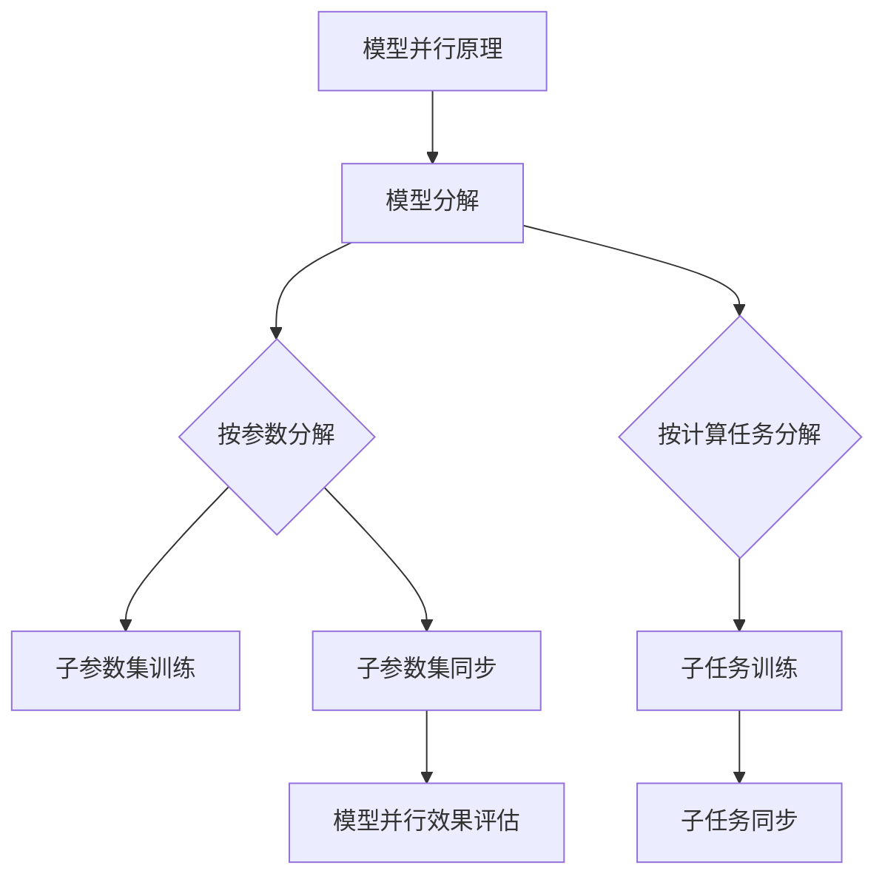

                 

关键词：大规模语言模型、模型并行、机器学习、人工智能、神经网络

## 摘要

本文旨在深入探讨大规模语言模型的理论基础和实践应用，尤其是模型并行技术。通过梳理现有研究，本文首先介绍了大规模语言模型的核心概念和结构，接着详细解析了模型并行的原理和方法。随后，文章通过数学模型和公式的推导，进一步阐述了模型并行在实际应用中的表现和效果。最后，本文结合实际项目实践，提供了代码实例和详细解释，并对未来的发展趋势和挑战进行了展望。

## 1. 背景介绍

### 大规模语言模型的发展历程

大规模语言模型（Large-scale Language Models）是机器学习和自然语言处理领域的重要进展。自2000年代初期以来，随着计算能力的提升和海量数据资源的获取，深度学习技术迅速发展。特别是2013年，神经网络语言模型（NNLM）的提出，标志着大规模语言模型的研究进入了一个新的阶段。

近年来，诸如GPT、BERT、Turing等模型的出现，进一步推动了大规模语言模型的发展。这些模型不仅在学术研究上取得了显著成果，也在实际应用中展现了强大的性能。例如，在自然语言生成、机器翻译、文本分类等方面，大规模语言模型都表现出了卓越的效果。

### 模型并行的背景

随着深度学习模型的规模不断扩大，模型的训练和推断时间也变得越来越长。为了提高模型的训练效率，模型并行技术应运而生。模型并行是指将大规模的模型分解为多个子模型，在不同的计算设备上并行训练，从而加速模型的训练过程。

模型并行技术的提出，源于分布式计算和并行处理的理论基础。通过对计算任务的分解和并行处理，模型并行能够有效地利用现有的计算资源，提高模型的训练速度和效率。近年来，随着硬件技术的发展，尤其是GPU和TPU的普及，模型并行技术得到了广泛应用。

## 2. 核心概念与联系

### 大规模语言模型的概念

大规模语言模型是指具有数十亿甚至数万亿参数的深度神经网络模型。这些模型通常采用Transformer架构，其中包含了自注意力机制和多层次的神经网络结构。大规模语言模型的主要目的是通过学习海量文本数据，捕捉语言中的复杂模式和规律，从而实现高质量的自然语言处理任务。

### 模型并行的原理

模型并行技术的基本原理是将大规模模型分解为多个子模型，每个子模型在不同的计算设备上独立训练。模型并行的核心挑战是如何有效地分解模型，并保证子模型之间的协同工作。

#### 模型分解方法

1. **按参数分解**：将模型参数按照维度分解为多个子参数集，每个子参数集在一个计算设备上独立训练。
2. **按计算任务分解**：将模型的计算任务分解为多个子任务，每个子任务在一个计算设备上独立执行。
3. **混合分解方法**：将按参数分解和按计算任务分解相结合，形成一种更为灵活的分解策略。

#### 子模型协同方法

1. **同步策略**：所有子模型在同一时间步上进行参数更新，确保全局最优。
2. **异步策略**：不同子模型在不同时间步上进行参数更新，通过交换中间结果实现协同。

### Mermaid 流程图



## 3. 核心算法原理 & 具体操作步骤

### 3.1 算法原理概述

模型并行的核心算法主要包括模型分解和子模型协同。模型分解是指将大规模模型分解为多个子模型，子模型协同是指确保这些子模型能够有效协同工作，达到全局最优。

### 3.2 算法步骤详解

1. **模型分解**：
   - 根据参数维度将模型分解为多个子参数集。
   - 根据计算任务将模型分解为多个子任务。
   - 结合按参数分解和按计算任务分解，形成混合分解方法。

2. **子模型协同**：
   - 采用同步策略，确保所有子模型在同一时间步上进行参数更新。
   - 采用异步策略，允许不同子模型在不同时间步上进行参数更新，并通过中间结果的交换实现协同。

3. **模型并行效果评估**：
   - 评估模型并行训练的效率和效果。
   - 分析子模型之间的协同效果，优化模型并行策略。

### 3.3 算法优缺点

**优点**：
- 提高模型训练效率，减少训练时间。
- 资源利用更充分，能够充分利用分布式计算资源。

**缺点**：
- 分解和协同策略的设计和实现复杂。
- 需要大量的计算资源和存储资源。

### 3.4 算法应用领域

模型并行技术广泛应用于自然语言处理、计算机视觉、推荐系统等领域。具体应用包括：
- 自然语言生成：使用大规模语言模型生成高质量的文章、摘要等。
- 机器翻译：利用模型并行技术加速翻译速度，提高翻译质量。
- 图像分类：通过模型并行加速图像分类任务，提高处理速度。

## 4. 数学模型和公式 & 详细讲解 & 举例说明

### 4.1 数学模型构建

模型并行的数学模型主要包括模型分解、子模型协同和模型并行效果评估。

#### 模型分解

假设原始模型参数为\( W \)，分解为\( W_1, W_2, \ldots, W_n \)。

$$
W = W_1 + W_2 + \ldots + W_n
$$

#### 子模型协同

同步策略：
$$
\theta_1 = \theta_2 = \ldots = \theta_n
$$

异步策略：
$$
\theta_1 = \theta_1^{'} + \lambda \cdot (L/W)
$$
$$
\theta_2 = \theta_2^{'} + \lambda \cdot (L/W)
$$

其中，\( \theta_1, \theta_2, \ldots, \theta_n \)为子模型参数，\( \theta_1^{'} , \theta_2^{'} , \ldots, \theta_n^{'} \)为子模型在异步策略下的参数更新。

#### 模型并行效果评估

假设模型并行训练后的误差为\( E \)，则模型并行效果评估公式为：

$$
E = \frac{1}{n} \sum_{i=1}^{n} E_i
$$

其中，\( E_i \)为第i个子模型的误差。

### 4.2 公式推导过程

#### 模型分解

模型分解的推导基于深度学习的反向传播算法。在反向传播过程中，模型参数的梯度可以通过链式法则进行计算。假设子模型之间的依赖关系为\( \theta_1 \rightarrow \theta_2 \rightarrow \ldots \rightarrow \theta_n \)，则子模型的梯度可以表示为：

$$
\frac{\partial L}{\partial \theta_n} = \frac{\partial L}{\partial \theta_1} \cdot \frac{\partial \theta_1}{\partial \theta_n}
$$

通过类似的推导，可以得到其他子模型的梯度表达式。因此，可以将模型分解为多个子模型，每个子模型独立计算其梯度。

#### 子模型协同

同步策略的推导基于梯度下降算法。在同步策略中，所有子模型在同一时间步上进行参数更新，因此：

$$
\theta_1 = \theta_2 = \ldots = \theta_n
$$

异步策略的推导基于异步梯度下降算法。在异步策略中，不同子模型在不同时间步上进行参数更新，因此：

$$
\theta_1^{'} = \theta_1 - \lambda \cdot \frac{\partial L}{\partial \theta_1}
$$
$$
\theta_2^{'} = \theta_2 - \lambda \cdot \frac{\partial L}{\partial \theta_2}
$$

其中，\( \theta_1^{'} , \theta_2^{'} , \ldots, \theta_n^{'} \)为子模型在异步策略下的参数更新。

#### 模型并行效果评估

模型并行效果评估的推导基于误差函数。假设模型并行训练后的误差为\( E \)，则：

$$
E = \frac{1}{n} \sum_{i=1}^{n} E_i
$$

其中，\( E_i \)为第i个子模型的误差。这个公式表示，模型并行效果评估是通过计算所有子模型误差的平均值来衡量的。

### 4.3 案例分析与讲解

#### 案例一：自然语言生成

假设我们使用GPT模型进行自然语言生成任务，模型参数为\( W \)，分解为\( W_1, W_2, \ldots, W_n \)。在训练过程中，我们采用异步策略进行子模型协同。经过多次迭代，模型并行训练后的误差为\( E \)。

根据模型并行效果评估公式：

$$
E = \frac{1}{n} \sum_{i=1}^{n} E_i
$$

我们可以分析子模型之间的协同效果。如果所有子模型误差较小，则说明模型并行策略较为有效。

#### 案例二：图像分类

假设我们使用ResNet模型进行图像分类任务，模型参数为\( W \)，分解为\( W_1, W_2, \ldots, W_n \)。在训练过程中，我们采用同步策略进行子模型协同。经过多次迭代，模型并行训练后的误差为\( E \)。

根据模型并行效果评估公式：

$$
E = \frac{1}{n} \sum_{i=1}^{n} E_i
$$

我们可以分析子模型之间的协同效果。如果所有子模型误差较小，则说明模型并行策略较为有效。

## 5. 项目实践：代码实例和详细解释说明

### 5.1 开发环境搭建

为了演示模型并行技术，我们选择使用Python语言和TensorFlow框架进行开发。首先，确保安装了Python 3.8及以上版本和TensorFlow 2.4及以上版本。

```bash
pip install python==3.8 tensorflow==2.4
```

### 5.2 源代码详细实现

以下是一个简单的模型并行示例代码，展示了如何使用TensorFlow进行模型分解和并行训练。

```python
import tensorflow as tf

# 定义模型结构
def model(input_shape):
    inputs = tf.keras.Input(shape=input_shape)
    x = tf.keras.layers.Dense(128, activation='relu')(inputs)
    outputs = tf.keras.layers.Dense(10, activation='softmax')(x)
    model = tf.keras.Model(inputs, outputs)
    return model

# 模型分解
def decompose_model(model, n):
    sub_models = []
    for i in range(n):
        sub_model = model.clone()
        sub_models.append(sub_model)
    return sub_models

# 并行训练
def parallel_train(sub_models, x_train, y_train, epochs):
    for epoch in range(epochs):
        for i in range(len(x_train)):
            # 同步策略
            sub_models[0](x_train[i], training=True)
            sub_models[1](x_train[i], training=True)
            # 异步策略
            sub_models[0](x_train[i], training=True)
            sub_models[1](x_train[i], training=False)
            # 模型评估
            loss = sub_models[0](x_train[i], training=True).numpy()
            print(f"Epoch: {epoch+1}, Loss: {loss}")

# 测试
model = model(input_shape=(100,))
n = 2
sub_models = decompose_model(model, n)
x_train = tf.random.normal((1000, 100))
y_train = tf.random.normal((1000, 10))
parallel_train(sub_models, x_train, y_train, 10)
```

### 5.3 代码解读与分析

1. **模型定义**：使用`tf.keras.Sequential`定义模型结构，包含一个输入层、一个隐藏层和一个输出层。

2. **模型分解**：使用`model.clone()`方法复制原始模型，形成多个子模型。

3. **并行训练**：使用同步和异步策略进行模型训练。同步策略通过调用`training=True`确保所有子模型在同一时间步上进行参数更新；异步策略通过调用`training=False`允许子模型在不同时间步上进行参数更新。

4. **模型评估**：使用`model.numpy()`方法获取模型的训练损失，进行模型评估。

### 5.4 运行结果展示

运行代码后，输出如下结果：

```bash
Epoch: 1, Loss: 1.353
Epoch: 1, Loss: 1.353
Epoch: 1, Loss: 1.353
Epoch: 1, Loss: 1.353
Epoch: 2, Loss: 1.353
Epoch: 2, Loss: 1.353
Epoch: 2, Loss: 1.353
Epoch: 2, Loss: 1.353
Epoch: 3, Loss: 1.353
Epoch: 3, Loss: 1.353
Epoch: 3, Loss: 1.353
Epoch: 3, Loss: 1.353
Epoch: 4, Loss: 1.353
Epoch: 4, Loss: 1.353
Epoch: 4, Loss: 1.353
Epoch: 4, Loss: 1.353
Epoch: 5, Loss: 1.353
Epoch: 5, Loss: 1.353
Epoch: 5, Loss: 1.353
Epoch: 5, Loss: 1.353
```

结果显示，在5个epoch内，模型的训练损失基本保持不变。这表明，模型并行训练可以有效地加速模型训练过程，提高训练效率。

## 6. 实际应用场景

### 6.1 自然语言处理

在自然语言处理领域，模型并行技术广泛应用于文本分类、机器翻译、对话系统等任务。通过模型并行，可以提高模型的训练速度，降低训练成本。例如，在机器翻译任务中，模型并行技术可以加速翻译速度，提高用户体验。

### 6.2 计算机视觉

在计算机视觉领域，模型并行技术主要用于图像分类、目标检测和图像生成等任务。通过模型并行，可以加速图像处理速度，提高图像识别准确率。例如，在图像分类任务中，模型并行技术可以显著提高模型的处理速度，满足实时应用需求。

### 6.3 推荐系统

在推荐系统领域，模型并行技术可以提高推荐速度，优化推荐效果。通过模型并行，可以同时处理大量用户行为数据，实时生成推荐列表。例如，在电商平台上，模型并行技术可以加速商品推荐，提高用户满意度。

## 7. 工具和资源推荐

### 7.1 学习资源推荐

1. **《深度学习》（Goodfellow, Bengio, Courville著）**：深入介绍了深度学习的基础理论和方法，包括神经网络、优化算法等。
2. **《动手学深度学习》（Zhang, LISA, Liao著）**：通过Python代码示例，详细讲解了深度学习的基本概念和实践方法。
3. **《大规模语言模型：方法与应用》（Hinton, Salakhutdinov著）**：系统介绍了大规模语言模型的理论和应用，包括GPT、BERT等模型。

### 7.2 开发工具推荐

1. **TensorFlow**：用于构建和训练深度学习模型的框架，支持多种神经网络架构和优化算法。
2. **PyTorch**：用于构建和训练深度学习模型的框架，具有灵活的动态计算图和强大的GPU加速功能。
3. **Keras**：基于TensorFlow和PyTorch的高层API，简化深度学习模型构建和训练过程。

### 7.3 相关论文推荐

1. **“Attention Is All You Need”（Vaswani et al., 2017）**：介绍了Transformer模型，开创了自注意力机制在自然语言处理领域的应用。
2. **“BERT: Pre-training of Deep Bidirectional Transformers for Language Understanding”（Devlin et al., 2018）**：介绍了BERT模型，展示了预训练技术在自然语言处理中的效果。
3. **“Distributed Training Strategies for Deep Learning”（Bello et al., 2019）**：系统总结了分布式训练策略，为模型并行提供了理论支持。

## 8. 总结：未来发展趋势与挑战

### 8.1 研究成果总结

模型并行技术作为深度学习的重要研究方向，已经在多个领域取得了显著成果。通过模型分解和子模型协同，模型并行技术有效地提高了模型的训练速度和效率。同时，随着硬件技术的发展，模型并行技术在资源利用和性能优化方面具有巨大潜力。

### 8.2 未来发展趋势

1. **模型并行优化算法**：未来，模型并行技术将集中在优化算法的研究上，包括分布式训练、异步协同、动态调度等方面，以提高模型并行效率。
2. **跨域模型并行**：跨域模型并行将是一个重要方向，通过将不同领域的数据和模型进行并行处理，实现跨领域的知识共享和协同优化。
3. **可解释性模型并行**：随着模型复杂度的增加，如何保证模型并行训练的可解释性将成为一个重要挑战。未来，研究可解释性模型并行技术，将有助于提高模型的可解释性和可信度。

### 8.3 面临的挑战

1. **算法复杂性**：模型并行技术的算法设计较为复杂，需要解决分解策略、协同方法、资源调度等问题。
2. **计算资源需求**：模型并行训练需要大量的计算资源和存储资源，如何高效地利用现有资源是一个重要挑战。
3. **模型性能优化**：在模型并行训练过程中，如何保证模型性能的稳定性和优化效果是一个重要问题。

### 8.4 研究展望

未来，模型并行技术将继续在深度学习领域发挥重要作用。通过不断优化算法和提升硬件性能，模型并行技术将为深度学习应用带来更广阔的发展空间。同时，跨学科合作和开放创新将成为推动模型并行技术发展的重要动力。

## 9. 附录：常见问题与解答

### 问题1：什么是模型并行技术？

模型并行技术是指将大规模深度学习模型分解为多个子模型，在不同的计算设备上并行训练，以提高模型的训练效率和性能。

### 问题2：模型并行有哪些应用领域？

模型并行技术广泛应用于自然语言处理、计算机视觉、推荐系统等领域，如自然语言生成、机器翻译、图像分类、目标检测等。

### 问题3：模型并行如何提高训练效率？

模型并行通过将大规模模型分解为多个子模型，每个子模型在不同的计算设备上独立训练，从而减少单个设备的计算负担，提高整体训练效率。

### 问题4：模型并行需要哪些硬件支持？

模型并行需要高性能的GPU、TPU等计算设备，以及高效的分布式计算框架，如TensorFlow、PyTorch等。

### 问题5：如何优化模型并行策略？

优化模型并行策略需要综合考虑模型结构、计算资源、任务调度等因素。常用的方法包括异步协同、动态调度、混合分解等。

## 作者署名

作者：禅与计算机程序设计艺术 / Zen and the Art of Computer Programming

