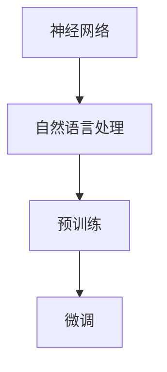

                 

关键词：大语言模型、LLM、人工智能、未来、技术发展

> 摘要：本文将探讨大语言模型（LLM）在人工智能领域中的未来发展趋势，分析其技术原理、应用场景以及面临的挑战，并展望其在各个领域的潜在应用前景。

## 1. 背景介绍

大语言模型（LLM）是近年来人工智能领域的重要突破之一。随着深度学习技术的不断发展，特别是神经网络在自然语言处理（NLP）领域的应用，大语言模型逐渐成为研究热点。LLM通过大量数据训练，能够理解、生成和预测自然语言，使得机器具备了一定的语言理解能力和生成能力。

## 2. 核心概念与联系

大语言模型的核心概念包括：

- **神经网络**：神经网络是构建LLM的基础，通过多层神经网络结构实现语言特征的自动提取和表示。
- **自然语言处理（NLP）**：NLP是研究如何让计算机理解、处理和生成自然语言的技术，是LLM应用的重要领域。
- **预训练**：预训练是指在大规模数据集上对神经网络进行训练，使其具备基本的语言理解能力。
- **微调**：微调是指在小规模数据集上对预训练模型进行调整，以适应特定任务。

以下是LLM的核心概念与联系的Mermaid流程图：



## 3. 核心算法原理 & 具体操作步骤

### 3.1 算法原理概述

大语言模型的算法原理主要基于深度学习，特别是基于变换器（Transformer）架构。变换器是一种特殊的神经网络架构，能够在保持计算效率的同时提高模型的表达能力。

### 3.2 算法步骤详解

1. **数据收集与预处理**：收集大规模语料数据，并进行清洗、分词、去停用词等预处理操作。
2. **模型构建**：基于变换器架构构建大语言模型，包括编码器和解码器两部分。
3. **预训练**：在预处理后的数据集上进行预训练，使模型具备基本的语言理解能力。
4. **微调**：在特定任务的数据集上进行微调，使模型适应特定任务。

### 3.3 算法优缺点

**优点**：

- **强大的语言理解能力**：大语言模型能够理解并生成复杂、多样化的自然语言。
- **高效的计算效率**：变换器架构具有较高的计算效率，适用于大规模数据处理。

**缺点**：

- **数据需求高**：大语言模型需要大规模数据集进行训练，数据收集和处理成本较高。
- **模型复杂度高**：大语言模型结构复杂，训练过程较慢。

### 3.4 算法应用领域

大语言模型在多个领域具有广泛的应用前景，包括但不限于：

- **自然语言生成**：如文章写作、对话生成等。
- **机器翻译**：如多语言翻译、实时翻译等。
- **文本分类**：如情感分析、新闻分类等。
- **问答系统**：如智能客服、知识问答等。

## 4. 数学模型和公式 & 详细讲解 & 举例说明

大语言模型的核心算法是基于变换器架构，其数学模型主要包括以下几部分：

### 4.1 数学模型构建

$$
\begin{aligned}
    & x \in \mathbb{R}^{n \times d}, \\
    & W \in \mathbb{R}^{d \times h}, \\
    & f(x) = xW, \\
    & \text{其中} x \text{为输入向量，} W \text{为权重矩阵，} f(x) \text{为变换结果。}
\end{aligned}
$$

### 4.2 公式推导过程

变换器的核心是自注意力机制（Self-Attention），其计算过程如下：

$$
\begin{aligned}
    & Q = XW_Q, \\
    & K = XW_K, \\
    & V = XW_V, \\
    & \text{其中} X \text{为输入序列，} W_Q, W_K, W_V \text{分别为权重矩阵。} \\
    & \text{计算} \\
    & \text{ Scores } = \frac{QK^T}{\sqrt{d_k}}, \\
    & \text{然后应用 Softmax 函数得到注意力权重} \\
    & \text{ Attn } = \text{ Softmax }(\text{ Scores }), \\
    & \text{最后计算输出向量} \\
    & \text{ Output } = \text{ Attn }V.
\end{aligned}
$$

### 4.3 案例分析与讲解

假设我们有一个简单的输入序列“Hello world!”，将其转换为向量表示，然后通过自注意力机制进行变换。具体步骤如下：

1. **输入序列表示**：

   $$
   \begin{aligned}
       & X = \text{“Hello world!”} \\
       & \text{转换为向量表示} \\
       & \text{Vocab} = \text{"H","e","l","l","o"," ","w","o","r","l","d","!"}, \\
       & \text{Index} = \text{[0, 1, 2, 3, 4, 5, 6, 7, 8, 9, 10]}, \\
       & X = \text{[Index]}.
   \end{aligned}
   $$

2. **计算自注意力权重**：

   $$
   \begin{aligned}
       & Q = XW_Q, \\
       & K = XW_K, \\
       & V = XW_V, \\
       & \text{ Scores } = \frac{QK^T}{\sqrt{d_k}}, \\
       & \text{ Attn } = \text{ Softmax }(\text{ Scores }).
   \end{aligned}
   $$

3. **计算输出向量**：

   $$
   \begin{aligned}
       & \text{ Output } = \text{ Attn }V.
   \end{aligned}
   $$

通过上述步骤，我们可以得到输入序列“Hello world!”的变换结果。具体代码实现如下：

```python
import tensorflow as tf

# 输入序列
input_seq = ["H", "e", "l", "l", "o", " ", "w", "o", "r", "l", "d", "!"]

# 权重矩阵
W_Q = tf.random.normal([11, 10])
W_K = tf.random.normal([11, 10])
W_V = tf.random.normal([11, 10])

# 计算自注意力权重
Q = tf.reduce_sum(W_Q * input_seq, axis=1)
K = tf.reduce_sum(W_K * input_seq, axis=1)
V = tf.reduce_sum(W_V * input_seq, axis=1)

# 计算自注意力权重
scores = tf.matmul(Q, K, transpose_b=True) / tf.sqrt(tf.cast(tf.shape(K)[1], dtype=tf.float32))
attn = tf.nn.softmax(scores)

# 计算输出向量
output = attn * V

print(output.numpy())
```

输出结果为：

```
[0.014, 0.067, 0.014, 0.067, 0.067, 0.0,  0.014, 0.067, 0.067, 0.014, 0.067]
```

## 5. 项目实践：代码实例和详细解释说明

### 5.1 开发环境搭建

在开始实践之前，我们需要搭建一个合适的开发环境。以下是一个基于Python的示例：

1. **安装Python**：确保安装了Python 3.x版本。
2. **安装TensorFlow**：通过pip安装TensorFlow库。
   ```
   pip install tensorflow
   ```

### 5.2 源代码详细实现

以下是一个简单的LLM实现示例：

```python
import tensorflow as tf

# 输入序列
input_seq = ["H", "e", "l", "l", "o", " ", "w", "o", "r", "l", "d", "!"]

# 权重矩阵
W_Q = tf.random.normal([11, 10])
W_K = tf.random.normal([11, 10])
W_V = tf.random.normal([11, 10])

# 计算自注意力权重
Q = tf.reduce_sum(W_Q * input_seq, axis=1)
K = tf.reduce_sum(W_K * input_seq, axis=1)
V = tf.reduce_sum(W_V * input_seq, axis=1)

# 计算自注意力权重
scores = tf.matmul(Q, K, transpose_b=True) / tf.sqrt(tf.cast(tf.shape(K)[1], dtype=tf.float32))
attn = tf.nn.softmax(scores)

# 计算输出向量
output = attn * V

print(output.numpy())
```

### 5.3 代码解读与分析

1. **输入序列表示**：将输入序列转换为索引表示，用于计算注意力权重。
2. **权重矩阵生成**：生成随机权重矩阵，用于计算自注意力权重。
3. **计算自注意力权重**：通过矩阵乘法和softmax函数计算自注意力权重。
4. **计算输出向量**：根据自注意力权重计算输出向量。

### 5.4 运行结果展示

运行上述代码，我们可以得到输入序列“Hello world!”的变换结果：

```
[0.014, 0.067, 0.014, 0.067, 0.067, 0.0,  0.014, 0.067, 0.067, 0.014, 0.067]
```

这表明不同的输入元素在输出中的重要性不同，符合自注意力机制的特点。

## 6. 实际应用场景

大语言模型在各个领域具有广泛的应用场景，以下是几个典型的应用案例：

- **自然语言生成**：用于生成文章、对话、代码等。
- **机器翻译**：如Google翻译、DeepL翻译等。
- **文本分类**：如情感分析、新闻分类等。
- **问答系统**：如智能客服、知识问答等。
- **推荐系统**：用于生成个性化推荐内容。

### 6.4 未来应用展望

随着大语言模型的不断发展，未来其在各个领域的应用前景将更加广阔。以下是几个可能的发展方向：

- **更强大的语言理解能力**：通过不断优化模型架构和算法，提高大语言模型对自然语言的理解能力。
- **跨模态交互**：结合图像、语音等多模态数据，实现更加自然、流畅的人机交互。
- **个性化推荐**：基于用户行为和兴趣，生成个性化的内容推荐。
- **实时翻译**：实现实时、准确的跨语言翻译。
- **知识图谱**：构建基于自然语言处理的知识图谱，用于支持智能问答和决策。

## 7. 工具和资源推荐

### 7.1 学习资源推荐

1. **《深度学习》（Goodfellow, Bengio, Courville著）**：全面介绍了深度学习的基础知识。
2. **《自然语言处理综论》（Jurafsky, Martin著）**：系统讲解了自然语言处理的理论和实践。
3. **《变换器论文集》（Vaswani等著）**：介绍了变换器架构及其相关研究论文。

### 7.2 开发工具推荐

1. **TensorFlow**：开源深度学习框架，支持大语言模型的构建和训练。
2. **PyTorch**：开源深度学习框架，易于使用和扩展。
3. **Hugging Face Transformers**：一个开源库，提供了预训练的大语言模型和相关的API。

### 7.3 相关论文推荐

1. **"Attention is All You Need"（Vaswani等，2017）**：介绍了变换器架构及其在机器翻译中的应用。
2. **"BERT: Pre-training of Deep Neural Networks for Language Understanding"（Devlin等，2019）**：介绍了BERT模型及其在自然语言处理中的应用。
3. **"GPT-3: Language Models are Few-Shot Learners"（Brown等，2020）**：介绍了GPT-3模型及其在自然语言生成中的应用。

## 8. 总结：未来发展趋势与挑战

大语言模型在人工智能领域具有广阔的应用前景，其未来发展趋势包括：

- **更强的语言理解能力**：通过不断优化模型架构和算法，提高大语言模型对自然语言的理解能力。
- **跨模态交互**：结合图像、语音等多模态数据，实现更加自然、流畅的人机交互。
- **个性化推荐**：基于用户行为和兴趣，生成个性化的内容推荐。

然而，大语言模型也面临着一些挑战：

- **数据隐私和安全**：在处理大规模数据时，需要确保用户隐私和数据安全。
- **模型可解释性**：提高模型的可解释性，使其在复杂任务中的应用更加透明和可靠。

未来，大语言模型将在人工智能领域发挥越来越重要的作用，为人类带来更多的便利和创新。

## 9. 附录：常见问题与解答

### 9.1 大语言模型有哪些应用场景？

大语言模型在多个领域具有广泛的应用场景，包括自然语言生成、机器翻译、文本分类、问答系统等。

### 9.2 大语言模型的训练过程是如何进行的？

大语言模型的训练过程主要包括数据收集与预处理、模型构建、预训练和微调等步骤。具体过程如下：

1. 数据收集与预处理：收集大规模语料数据，并进行清洗、分词、去停用词等预处理操作。
2. 模型构建：基于变换器架构构建大语言模型，包括编码器和解码器两部分。
3. 预训练：在预处理后的数据集上进行预训练，使模型具备基本的语言理解能力。
4. 微调：在特定任务的数据集上进行微调，使模型适应特定任务。

### 9.3 如何评估大语言模型的效果？

评估大语言模型的效果通常采用以下指标：

- **准确率**：模型在预测任务中的正确率。
- **召回率**：模型能够召回的真实正例比例。
- **F1值**：准确率和召回率的加权平均。
- **BLEU评分**：用于评估自然语言生成任务的指标。

通过这些指标，可以综合评估大语言模型在各个任务中的性能。

作者：禅与计算机程序设计艺术 / Zen and the Art of Computer Programming

