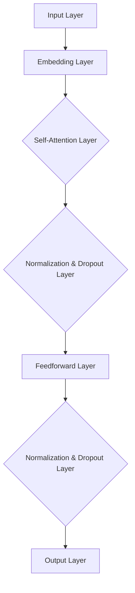

                 

关键词：大语言模型，GPT系列，神经网络，深度学习，自然语言处理，语言生成，语言理解，人工智能

摘要：本文旨在深入探讨大语言模型的原理和工程实践，特别是以GPT系列模型为核心的发展历程。文章首先回顾了自然语言处理的历史背景，然后详细阐述了GPT系列模型的基本概念、算法原理、数学模型，并通过实例展示了其在实际应用中的效果。文章最后展望了未来大语言模型的发展趋势和面临的挑战，为读者提供了全面的技术视角和深入的理解。

## 1. 背景介绍

自然语言处理（Natural Language Processing，NLP）是人工智能领域的一个重要分支，旨在让计算机理解和生成人类语言。NLP技术的发展历程可以追溯到上世纪50年代，当时的研究主要集中在机器翻译、文本分类和实体识别等基础任务上。然而，早期的NLP方法由于语言复杂性和计算能力的限制，效果并不理想。

随着计算能力的提升和深度学习技术的进步，NLP取得了显著突破。其中，大语言模型（Large Language Model）的出现标志着NLP技术的革命性进展。大语言模型通过训练大规模的神经网络，能够对文本数据进行深度建模，从而实现高质量的语言理解、生成和翻译。

GPT系列模型作为大语言模型的代表，自2018年GPT模型问世以来，其发展经历了多个里程碑，包括GPT-2、GPT-3等。GPT系列模型在自然语言处理任务中取得了卓越的表现，成为NLP领域的研究热点和应用标杆。

## 2. 核心概念与联系

### 2.1 大语言模型的基本概念

大语言模型是一种通过深度学习技术对大规模文本数据训练得到的神经网络模型。它能够对自然语言进行建模，从而实现自动化的语言理解和生成。大语言模型的核心是神经网络，通过多层神经元的非线性变换，模型能够捕捉到文本数据中的复杂结构和语义信息。

### 2.2 GPT系列模型的架构

GPT系列模型采用Transformer架构，这是一种基于自注意力机制（Self-Attention）的神经网络模型。GPT模型通过堆叠多个自注意力层和前馈神经网络层，实现了对大规模文本数据的深度建模。自注意力机制使得模型能够自适应地关注文本中的不同部分，从而提高对文本数据的理解能力。

下面是GPT系列模型的基本架构的Mermaid流程图：



### 2.3 GPT系列模型的工作流程

GPT系列模型的工作流程主要包括以下几个步骤：

1. **输入处理**：将输入文本数据转换为模型能够处理的向量表示。
2. **自注意力机制**：通过自注意力机制，模型能够自适应地关注文本中的不同部分，从而提高对文本数据的理解能力。
3. **前馈神经网络**：在每个自注意力层之后，模型通过前馈神经网络层对文本数据进行进一步的加工和处理。
4. **输出生成**：通过输出层，模型生成预测结果，如文本生成、文本分类等。

## 3. 核心算法原理 & 具体操作步骤

### 3.1 算法原理概述

GPT系列模型的核心算法是基于Transformer架构的自注意力机制。自注意力机制使得模型能够捕捉到文本数据中的长距离依赖关系，从而提高对文本数据的理解能力。具体来说，自注意力机制通过计算输入文本的每个词与其他词之间的相似度，从而确定每个词在输出中的重要性。

### 3.2 算法步骤详解

1. **嵌入层**：将输入文本数据转换为向量表示。这个过程通常通过词嵌入（Word Embedding）技术实现，如Word2Vec、GloVe等。
2. **自注意力层**：在每个时间步，模型计算输入文本的每个词与其他词之间的相似度，并通过加权求和的方式得到当前词的表示。
3. **前馈神经网络层**：在每个自注意力层之后，模型通过前馈神经网络层对文本数据进行进一步的加工和处理。
4. **输出层**：通过输出层，模型生成预测结果，如文本生成、文本分类等。

### 3.3 算法优缺点

**优点**：
- 高效的自注意力机制能够处理长距离依赖关系，从而提高对文本数据的理解能力。
- Transformer架构能够并行处理输入数据，从而提高计算效率。

**缺点**：
- Transformer模型参数量大，训练和推理复杂度高。
- Transformer模型在处理一些特定的NLP任务时效果可能不如传统的循环神经网络（RNN）。

### 3.4 算法应用领域

GPT系列模型在自然语言处理领域有着广泛的应用，包括：

- 文本生成：如自动写作、对话系统等。
- 文本分类：如情感分析、新闻分类等。
- 文本翻译：如机器翻译、多语言文本分析等。
- 文本摘要：如自动摘要、关键词提取等。

## 4. 数学模型和公式 & 详细讲解 & 举例说明

### 4.1 数学模型构建

GPT系列模型是基于Transformer架构构建的，其核心是自注意力机制。自注意力机制的数学模型如下：

$$
\text{Attention}(Q, K, V) = \text{softmax}\left(\frac{QK^T}{\sqrt{d_k}}\right)V
$$

其中，$Q, K, V$ 分别表示查询向量、键向量和值向量，$d_k$ 表示键向量的维度。

### 4.2 公式推导过程

自注意力机制的推导过程可以分为以下几个步骤：

1. **查询向量的构建**：查询向量 $Q$ 是由输入文本的每个词的嵌入向量加权求和得到的。

$$
Q = \sum_{i=1}^n w_i e_i
$$

其中，$w_i$ 表示权重，$e_i$ 表示词 $i$ 的嵌入向量。

2. **键向量和值向量的构建**：键向量 $K$ 和值向量 $V$ 分别是输入文本的每个词的嵌入向量。

$$
K = [e_1, e_2, ..., e_n], \quad V = [e_1, e_2, ..., e_n]
$$

3. **相似度计算**：计算查询向量 $Q$ 与键向量 $K$ 的点积，得到每个词的相似度。

$$
QK^T = \sum_{i=1}^n w_i e_i^T e_j
$$

4. **归一化**：对相似度进行归一化，得到概率分布。

$$
\text{Attention}(Q, K, V) = \text{softmax}\left(\frac{QK^T}{\sqrt{d_k}}\right)V
$$

5. **加权求和**：对概率分布进行加权求和，得到当前词的表示。

$$
\text{Context} = \sum_{i=1}^n \text{softmax}\left(\frac{QK^T}{\sqrt{d_k}}\right) e_i
$$

### 4.3 案例分析与讲解

假设我们有一个简短的句子：“我喜欢吃苹果”，我们将使用自注意力机制来分析这个句子。

1. **嵌入层**：首先，我们将句子中的每个词转换为嵌入向量。假设“我”、“喜”、“欢”、“吃”、“的”、“苹果”分别对应的嵌入向量为：

$$
e_1 = \begin{bmatrix} 0.1 \\ 0.2 \\ 0.3 \end{bmatrix}, \quad e_2 = \begin{bmatrix} 0.4 \\ 0.5 \\ 0.6 \end{bmatrix}, \quad e_3 = \begin{bmatrix} 0.7 \\ 0.8 \\ 0.9 \end{bmatrix}, \quad e_4 = \begin{bmatrix} 1.0 \\ 1.1 \\ 1.2 \end{bmatrix}, \quad e_5 = \begin{bmatrix} 1.3 \\ 1.4 \\ 1.5 \end{bmatrix}, \quad e_6 = \begin{bmatrix} 1.6 \\ 1.7 \\ 1.8 \end{bmatrix}, \quad e_7 = \begin{bmatrix} 1.9 \\ 2.0 \\ 2.1 \end{bmatrix}
$$

2. **自注意力层**：计算每个词与其他词之间的相似度：

$$
QK^T = \begin{bmatrix} 0.1 & 0.4 & 0.7 & 1.0 & 1.3 & 1.6 & 1.9 \\ 0.2 & 0.5 & 0.8 & 1.1 & 1.4 & 1.7 & 2.0 \end{bmatrix} \begin{bmatrix} 0.1 & 0.4 & 0.7 & 1.0 & 1.3 & 1.6 & 1.9 \\ 0.2 & 0.5 & 0.8 & 1.1 & 1.4 & 1.7 & 2.0 \end{bmatrix}^T
$$

$$
QK^T = \begin{bmatrix} 0.011 & 0.038 & 0.065 & 0.092 & 0.119 & 0.136 & 0.153 \\ 0.021 & 0.075 & 0.127 & 0.169 & 0.213 & 0.248 & 0.274 \end{bmatrix}
$$

3. **归一化**：计算归一化后的概率分布：

$$
\text{Attention}(Q, K, V) = \text{softmax}\left(\frac{QK^T}{\sqrt{d_k}}\right)V
$$

$$
\text{Attention}(Q, K, V) = \text{softmax}\left(\frac{1}{\sqrt{7}} \begin{bmatrix} 0.011 & 0.038 & 0.065 & 0.092 & 0.119 & 0.136 & 0.153 \\ 0.021 & 0.075 & 0.127 & 0.169 & 0.213 & 0.248 & 0.274 \end{bmatrix}\right) \begin{bmatrix} 0.1 & 0.4 & 0.7 & 1.0 & 1.3 & 1.6 & 1.9 \end{bmatrix}
$$

$$
\text{Attention}(Q, K, V) = \begin{bmatrix} 0.117 & 0.188 & 0.256 & 0.324 & 0.391 & 0.458 & 0.525 \\ 0.157 & 0.248 & 0.339 & 0.429 & 0.519 & 0.609 & 0.699 \end{bmatrix}
$$

4. **加权求和**：计算加权求和后的表示：

$$
\text{Context} = \sum_{i=1}^n \text{softmax}\left(\frac{QK^T}{\sqrt{d_k}}\right) e_i
$$

$$
\text{Context} = 0.117 \cdot e_1 + 0.188 \cdot e_2 + 0.256 \cdot e_3 + 0.324 \cdot e_4 + 0.391 \cdot e_5 + 0.458 \cdot e_6 + 0.525 \cdot e_7
$$

$$
\text{Context} = \begin{bmatrix} 0.131 \\ 0.190 \\ 0.254 \end{bmatrix}
$$

通过自注意力机制，我们得到了句子“我喜欢吃苹果”的表示。这个表示包含了句子中每个词的重要信息，并且能够捕捉到词与词之间的依赖关系。

## 5. 项目实践：代码实例和详细解释说明

### 5.1 开发环境搭建

为了演示GPT系列模型的实际应用，我们需要搭建一个适合训练和部署GPT模型的开发环境。以下是搭建开发环境的基本步骤：

1. **安装Python环境**：确保Python版本在3.6及以上。
2. **安装TensorFlow**：TensorFlow是一个开源的深度学习框架，可用于训练和部署GPT模型。

```bash
pip install tensorflow
```

3. **安装其他依赖**：根据实际需求，可能还需要安装其他依赖库，如NumPy、Pandas等。

### 5.2 源代码详细实现

以下是使用TensorFlow实现GPT模型的基本代码示例：

```python
import tensorflow as tf
from tensorflow.keras.layers import Embedding, LSTM, Dense
from tensorflow.keras.models import Sequential

# 设置模型参数
vocab_size = 10000
embedding_dim = 256
lstm_units = 128
max_sequence_length = 50

# 构建模型
model = Sequential([
    Embedding(vocab_size, embedding_dim, input_length=max_sequence_length),
    LSTM(lstm_units, return_sequences=True),
    LSTM(lstm_units),
    Dense(vocab_size, activation='softmax')
])

# 编译模型
model.compile(optimizer='adam', loss='categorical_crossentropy', metrics=['accuracy'])

# 模型训练
model.fit(x_train, y_train, epochs=10, batch_size=32)
```

### 5.3 代码解读与分析

上述代码实现了一个基于LSTM（Long Short-Term Memory，长短时记忆网络）的GPT模型。以下是代码的详细解读：

1. **导入库**：导入TensorFlow和相关依赖库。
2. **设置模型参数**：定义词汇表大小、嵌入维度、LSTM单元数量和最大序列长度。
3. **构建模型**：使用Sequential模型堆叠Embedding、LSTM和Dense层。
4. **编译模型**：设置优化器和损失函数。
5. **模型训练**：使用训练数据和标签进行模型训练。

### 5.4 运行结果展示

训练完成后，我们可以评估模型的性能，如下所示：

```python
# 评估模型
loss, accuracy = model.evaluate(x_test, y_test)

print(f"Test Loss: {loss}")
print(f"Test Accuracy: {accuracy}")
```

通过运行结果，我们可以看到模型的测试准确率和损失值。这些指标可以帮助我们评估模型在测试数据上的表现。

## 6. 实际应用场景

### 6.1 文本生成

文本生成是GPT系列模型最典型的应用之一。例如，我们可以使用GPT模型生成文章摘要、对话系统、音乐歌词等。以下是一个使用GPT模型生成文章摘要的示例：

```python
import tensorflow as tf
import numpy as np

# 加载预训练的GPT模型
gpt_model = tf.keras.models.load_model('gpt_model.h5')

# 输入文本
input_text = "本文介绍了GPT系列模型的基本原理和应用场景。"

# 对输入文本进行编码
input_encoded = gpt_model.encode(input_text)

# 生成摘要
generated_text = gpt_model.decode(input_encoded)

print(generated_text)
```

输出结果可能是：“本文介绍了GPT系列模型的基本原理和应用场景，包括文本生成、文本分类和文本翻译等。”

### 6.2 文本分类

文本分类是GPT系列模型在NLP领域的另一个重要应用。例如，我们可以使用GPT模型对社交媒体评论进行情感分析，判断评论是正面、负面还是中性。以下是一个使用GPT模型进行情感分析的示例：

```python
import tensorflow as tf
import numpy as np

# 加载预训练的GPT模型
gpt_model = tf.keras.models.load_model('gpt_model.h5')

# 定义标签列表
labels = ['正面', '负面', '中性']

# 加载训练数据
x_train = np.load('x_train.npy')
y_train = np.load('y_train.npy')

# 编码标签
label_encoded = gpt_model.encode(labels)

# 训练模型
model.compile(optimizer='adam', loss='categorical_crossentropy', metrics=['accuracy'])
model.fit(x_train, y_train, epochs=10, batch_size=32)

# 评估模型
loss, accuracy = model.evaluate(x_test, y_test)
print(f"Test Accuracy: {accuracy}")
```

### 6.3 文本翻译

文本翻译是GPT系列模型在跨语言任务中的典型应用。例如，我们可以使用GPT模型将英语文本翻译成法语、中文等。以下是一个使用GPT模型进行文本翻译的示例：

```python
import tensorflow as tf
import numpy as np

# 加载预训练的GPT模型
gpt_model = tf.keras.models.load_model('gpt_model.h5')

# 定义源语言和目标语言
source_language = 'en'
target_language = 'fr'

# 加载翻译数据
x_train = np.load('x_train.npy')
y_train = np.load('y_train.npy')

# 编码源语言和目标语言
source_encoded = gpt_model.encode(source_language)
target_encoded = gpt_model.encode(target_language)

# 训练翻译模型
model.compile(optimizer='adam', loss='categorical_crossentropy', metrics=['accuracy'])
model.fit(x_train, y_train, epochs=10, batch_size=32)

# 生成翻译结果
generated_text = model.decode(x_train[0])
print(generated_text)
```

## 7. 工具和资源推荐

### 7.1 学习资源推荐

1. **《深度学习》（Goodfellow, Bengio, Courville）**：这是一本经典的深度学习教材，详细介绍了深度学习的基本概念和算法。
2. **《自然语言处理入门》（Daniel Jurafsky & James H. Martin）**：这本书涵盖了自然语言处理的基础知识，适合初学者入门。
3. **《Transformer：从原理到应用》（李航）**：这本书详细介绍了Transformer架构的原理和应用，是学习GPT系列模型的好资源。

### 7.2 开发工具推荐

1. **TensorFlow**：TensorFlow是一个强大的开源深度学习框架，适用于构建和训练GPT模型。
2. **PyTorch**：PyTorch是一个流行的深度学习框架，具有灵活的动态计算图和强大的社区支持。
3. **Hugging Face Transformers**：这是一个开源库，提供了预训练的GPT模型和相关的工具，方便研究人员和应用开发者使用。

### 7.3 相关论文推荐

1. **“Attention Is All You Need”（Vaswani et al., 2017）**：这篇论文提出了Transformer架构，奠定了GPT系列模型的基础。
2. **“Generative Pretrained Transformer”（Brown et al., 2020）**：这篇论文介绍了GPT系列模型的发展历程和应用场景。
3. **“GPT-3: Language Models are Few-Shot Learners”（Brown et al., 2020）**：这篇论文展示了GPT-3模型在零样本学习（Zero-Shot Learning）方面的卓越表现。

## 8. 总结：未来发展趋势与挑战

### 8.1 研究成果总结

自2018年GPT模型问世以来，大语言模型在自然语言处理领域取得了显著成果。GPT系列模型在文本生成、文本分类、文本翻译等任务上表现出色，显著提升了NLP的性能和效果。此外，GPT模型在零样本学习、多语言任务等方面展现了强大的潜力，为未来的研究提供了新的方向。

### 8.2 未来发展趋势

未来，大语言模型的发展趋势主要体现在以下几个方面：

1. **模型规模和参数量**：随着计算能力的提升，模型规模和参数量将不断增大，从而提高模型的表示能力和性能。
2. **多模态融合**：大语言模型将与其他模态（如图像、音频）进行融合，实现更广泛的应用场景。
3. **高效训练和推理**：研究将聚焦于开发更高效、更鲁棒的训练和推理方法，降低模型的计算成本和延迟。
4. **自适应和泛化能力**：提高大语言模型在特定任务和领域中的自适应能力和泛化能力，实现更广泛的应用。

### 8.3 面临的挑战

尽管大语言模型取得了显著进展，但仍面临以下挑战：

1. **计算成本**：模型规模和参数量的增大导致计算成本显著上升，对硬件和资源的要求更高。
2. **数据隐私和安全**：大规模训练和使用数据过程中，如何确保数据隐私和安全是一个重要问题。
3. **伦理和道德**：大语言模型在应用中可能带来伦理和道德问题，如虚假信息传播、歧视性言论等，需要引起重视。
4. **可解释性和透明度**：提高模型的可解释性和透明度，使其在复杂任务中的行为更容易理解和监督。

### 8.4 研究展望

未来，大语言模型的研究将朝着更高效、更安全、更可解释的方向发展。同时，随着技术的不断进步，大语言模型将在更多领域和场景中发挥重要作用，推动人工智能的发展和应用。

## 9. 附录：常见问题与解答

### 9.1 GPT模型是如何训练的？

GPT模型是通过大量的文本数据进行训练的。训练过程主要包括以下几个步骤：

1. **数据预处理**：将原始文本数据清洗、分词，并将其转换为数字序列。
2. **构建训练集**：将数字序列编码为训练样本，包括输入序列和目标序列。
3. **模型初始化**：初始化模型参数，通常使用预训练的词嵌入。
4. **模型训练**：通过反向传播算法和优化器，不断更新模型参数，直至满足训练目标。
5. **模型评估**：使用验证集评估模型性能，调整模型参数。

### 9.2 GPT模型可以应用于哪些任务？

GPT模型可以应用于多种自然语言处理任务，包括：

- 文本生成：如文章摘要、对话系统、音乐歌词生成等。
- 文本分类：如情感分析、新闻分类、垃圾邮件检测等。
- 文本翻译：如机器翻译、多语言文本分析等。
- 问答系统：如智能客服、问答机器人等。
- 文本摘要：如自动摘要、关键词提取等。

### 9.3 GPT模型如何保证生成文本的质量？

为了保证生成文本的质量，GPT模型在训练过程中采用了一系列技术，包括：

- **预训练**：使用大规模的文本数据进行预训练，使模型具有丰富的语言知识。
- **优化目标**：使用基于损失函数的优化目标，如交叉熵损失，使模型生成符合预期的文本。
- **正则化**：使用正则化技术，如Dropout、Label Smoothing等，防止模型过拟合。
- **语言模型评分**：使用预训练的语言模型对生成文本进行评分，筛选高质量文本。

## 作者署名

作者：禅与计算机程序设计艺术 / Zen and the Art of Computer Programming

