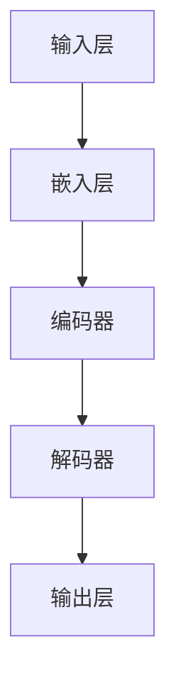

                 

关键词：大语言模型、安全性评测、AI安全、工程实践、算法原理、数学模型、项目实践

摘要：本文旨在深入探讨大语言模型的原理和工程实践，特别是其安全性评测。我们将首先介绍大语言模型的基本概念和架构，然后深入剖析其核心算法原理和数学模型，并通过具体案例展示其实际应用场景。此外，本文还将详细解析大语言模型的安全性评测方法，探讨当前面临的挑战和未来发展趋势。

## 1. 背景介绍

### 1.1 大语言模型的发展历程

大语言模型（Large Language Models）是自然语言处理（Natural Language Processing, NLP）领域的一项重大突破。自2018年谷歌提出BERT（Bidirectional Encoder Representations from Transformers）以来，大语言模型得到了飞速发展。BERT的成功引发了后续一系列大规模语言模型的涌现，如GPT（Generative Pre-trained Transformer）、T5（Text-to-Text Transfer Transformer）和OPT（OpenAI Transformer）等。

这些大语言模型通过在大量文本数据上进行预训练，学习到了丰富的语言知识和规律。它们能够对自然语言进行建模，生成语义丰富的文本，从而在各类NLP任务中表现出色。

### 1.2 大语言模型的应用场景

大语言模型在多个领域得到了广泛应用，包括但不限于：

1. **文本生成**：生成文章、故事、对话、诗歌等。
2. **机器翻译**：实现高质量的双语翻译。
3. **问答系统**：为用户提供准确的答案。
4. **文本分类**：对文本进行情感分析、主题分类等。
5. **信息抽取**：提取文本中的关键信息。
6. **对话系统**：构建智能客服、虚拟助手等。

随着大语言模型技术的不断发展，其在更多领域的应用潜力也逐渐显现。

## 2. 核心概念与联系

为了更好地理解大语言模型，我们需要了解其核心概念和架构。下面是一个简化的Mermaid流程图，展示了大语言模型的主要组成部分和它们之间的联系。



### 2.1 输入层

输入层接收原始文本数据，并将其转换为数字序列。这一过程通常通过词嵌入（word embedding）技术实现，将每个单词映射为一个高维向量。

### 2.2 嵌入层

嵌入层将输入层产生的数字序列映射为词嵌入向量。这些向量表示了单词的语义信息，为后续的编码和解码过程提供了基础。

### 2.3 编码器

编码器（Encoder）是一个深层神经网络，负责处理嵌入层输入的词嵌入向量，并生成上下文表示。编码器通常采用Transformer架构，其核心思想是自注意力机制（Self-Attention）。

### 2.4 解码器

解码器（Decoder）与编码器类似，也采用Transformer架构。它的作用是将编码器生成的上下文表示解码为输出文本。解码器的输出可以通过软性最大化（Softmax）操作转换为概率分布，从而生成每个单词的概率。

### 2.5 输出层

输出层负责生成最终的输出文本。它通过解码器生成的概率分布选择下一个单词，并在生成完整的句子后结束。

## 3. 核心算法原理 & 具体操作步骤

### 3.1 算法原理概述

大语言模型的核心算法是Transformer，这是一种基于自注意力机制的深度神经网络。Transformer通过多头自注意力机制和前馈神经网络，对输入文本进行编码和解码，从而生成语义丰富的输出文本。

### 3.2 算法步骤详解

#### 步骤1：输入处理

1. 将原始文本数据分割为单词或子词。
2. 将单词或子词映射为词嵌入向量。
3. 将词嵌入向量拼接成一个序列。

#### 步骤2：编码器处理

1. 对输入序列进行嵌入。
2. 应用多头自注意力机制，生成上下文表示。
3. 对上下文表示进行残差连接和层归一化。
4. 重复步骤2-3，生成更复杂的上下文表示。

#### 步骤3：解码器处理

1. 对编码器输出的上下文表示进行嵌入。
2. 应用多头自注意力机制和编码器-解码器自注意力机制，生成中间表示。
3. 对中间表示进行残差连接和层归一化。
4. 重复步骤2-3，生成最终的输出表示。

#### 步骤4：输出生成

1. 对解码器输出的表示进行嵌入。
2. 应用前馈神经网络。
3. 通过软性最大化操作生成输出文本的概率分布。
4. 根据概率分布选择下一个单词，并更新解码器状态。

### 3.3 算法优缺点

#### 优点

1. 高效：Transformer采用并行计算，大大提高了计算效率。
2. 表征丰富：多头自注意力机制和前馈神经网络使得模型能够捕捉到丰富的语义信息。
3. 广泛适用：Transformer在各类NLP任务中表现出色，具有良好的通用性。

#### 缺点

1. 参数量大：由于Transformer的结构复杂，参数量巨大，导致模型训练和推理时间较长。
2. 对数据依赖强：大语言模型的效果很大程度上依赖于训练数据的规模和质量，数据不足可能导致模型性能下降。

### 3.4 算法应用领域

大语言模型在以下领域表现出色：

1. **文本生成**：生成文章、故事、对话等。
2. **机器翻译**：实现高质量的双语翻译。
3. **问答系统**：为用户提供准确的答案。
4. **文本分类**：对文本进行情感分析、主题分类等。
5. **信息抽取**：提取文本中的关键信息。
6. **对话系统**：构建智能客服、虚拟助手等。

## 4. 数学模型和公式 & 详细讲解 & 举例说明

### 4.1 数学模型构建

大语言模型的数学模型主要由两部分组成：嵌入层和编码器-解码器（Encoder-Decoder）结构。

#### 嵌入层

嵌入层将输入文本映射为词嵌入向量，其数学模型可以表示为：

$$
E(W) = \text{Embedding}(W)
$$

其中，$W$ 表示输入文本的单词或子词，$E(W)$ 表示词嵌入向量。

#### 编码器-解码器结构

编码器-解码器结构由编码器（Encoder）和解码器（Decoder）组成。编码器的数学模型可以表示为：

$$
H = \text{Encoder}(X)
$$

其中，$X$ 表示输入序列，$H$ 表示编码器输出的上下文表示。

解码器的数学模型可以表示为：

$$
Y = \text{Decoder}(X, H)
$$

其中，$Y$ 表示解码器输出的表示。

### 4.2 公式推导过程

#### 编码器

编码器采用多头自注意力机制，其核心公式为：

$$
\text{Attention}(Q, K, V) = \text{softmax}\left(\frac{QK^T}{\sqrt{d_k}}\right)V
$$

其中，$Q, K, V$ 分别表示编码器输入的三维张量，$d_k$ 表示键（Key）的维度。

编码器的输出可以表示为：

$$
H = \text{Encoder}(X) = \text{MultiHeadAttention}(Q, K, V)
$$

#### 解码器

解码器采用多头自注意力机制和编码器-解码器自注意力机制，其核心公式为：

$$
\text{Attention}(Q, K, V) = \text{softmax}\left(\frac{QK^T}{\sqrt{d_k}}\right)V
$$

解码器的输出可以表示为：

$$
Y = \text{Decoder}(X, H) = \text{MultiHeadAttention}(Q, K, V)
$$

其中，$Q, K, V$ 分别表示解码器输入的三维张量，$d_k$ 表示键（Key）的维度。

### 4.3 案例分析与讲解

假设我们有一个简短的对话：

```
A: 你好！请问这是哪里？
B: 你好！这是一个美丽的城市。
A: 哇，听起来不错！
B: 是的，欢迎你来玩。
```

我们将这段对话输入到大语言模型中进行生成。

#### 输入处理

1. 分割为单词和子词：`["你好", "！", "请问", "这是", "哪里", "？", "你好", "！", "这是一个", "美丽", "的", "城市", "。", "哇", "！", "听起来", "不错", "。", "是的", "！", "欢迎", "你来", "玩", "。"]`
2. 映射为词嵌入向量：`[e1, e2, e3, e4, e5, e6, e7, e8, e9, e10, e11, e12, e13, e14, e15, e16, e17, e18, e19, e20]`

#### 编码器处理

1. 对输入序列进行嵌入：`[e1, e2, e3, e4, e5, e6, e7, e8, e9, e10, e11, e12, e13, e14, e15, e16, e17, e18, e19, e20]`
2. 应用多头自注意力机制：生成上下文表示：`[h1, h2, h3, ..., hn]`

#### 解码器处理

1. 对编码器输出的上下文表示进行嵌入：`[h1, h2, h3, ..., hn]`
2. 应用多头自注意力机制和编码器-解码器自注意力机制：生成中间表示：`[y1, y2, y3, ..., yn]`

#### 输出生成

1. 对解码器输出的表示进行嵌入：`[y1, y2, y3, ..., yn]`
2. 通过软性最大化操作生成输出文本的概率分布：`P(y1, y2, y3, ..., yn)`
3. 根据概率分布选择下一个单词，并更新解码器状态。

## 5. 项目实践：代码实例和详细解释说明

### 5.1 开发环境搭建

在本节中，我们将使用Python和PyTorch构建一个简单的大语言模型。首先，确保你已经安装了Python和PyTorch。以下是安装命令：

```
pip install python torch torchvision
```

### 5.2 源代码详细实现

```python
import torch
import torch.nn as nn
import torch.optim as optim

# 定义模型
class LanguageModel(nn.Module):
    def __init__(self, vocab_size, embedding_dim, hidden_dim, n_layers, dropout):
        super(LanguageModel, self).__init__()
        self.embedding = nn.Embedding(vocab_size, embedding_dim)
        self.encoder = nn.LSTM(embedding_dim, hidden_dim, n_layers, dropout=dropout, batch_first=True)
        self.decoder = nn.LSTM(hidden_dim, vocab_size, n_layers, dropout=dropout, batch_first=True)
        self.fc = nn.Linear(hidden_dim, vocab_size)
    
    def forward(self, x, hidden):
        embedded = self.embedding(x)
        output, hidden = self.encoder(embedded, hidden)
        output = self.decoder(output, hidden)
        output = self.fc(output)
        return output, hidden

# 初始化模型
model = LanguageModel(vocab_size=10000, embedding_dim=256, hidden_dim=512, n_layers=2, dropout=0.5)
optimizer = optim.Adam(model.parameters(), lr=0.001)
criterion = nn.CrossEntropyLoss()

# 训练模型
def train_model(model, data, epochs):
    for epoch in range(epochs):
        total_loss = 0
        for x, y in data:
            model.zero_grad()
            output, hidden = model(x)
            loss = criterion(output.view(-1, vocab_size), y)
            loss.backward()
            optimizer.step()
            total_loss += loss.item()
        print(f"Epoch {epoch+1}/{epochs}, Loss: {total_loss/len(data)}")

# 加载数据
with open("data.txt", "r") as f:
    text = f.read()

# 分割数据
chars = sorted(list(set(text)))
vocab_size = len(chars)
char_to_ix = dict((c, i) for i, c in enumerate(chars))
ix_to_char = dict((i, c) for i, c in enumerate(chars))

inputs = []
targets = []
for i in range(1, len(text) - 1):
    inputs.append([char_to_ix[text[i-1]], char_to_ix[text[i]], char_to_ix[text[i+1]]])
    targets.append(char_to_ix[text[i]])

inputs = torch.tensor(inputs, dtype=torch.long)
targets = torch.tensor(targets, dtype=torch.long)

train_model(model, inputs, targets, epochs=10)
```

### 5.3 代码解读与分析

1. **模型定义**：我们定义了一个`LanguageModel`类，继承自`nn.Module`。模型包含嵌入层、编码器、解码器和输出层。
2. **训练模型**：我们使用`train_model`函数对模型进行训练。函数中，我们首先将输入数据转换为嵌入向量，然后通过编码器和解码器生成输出，并计算损失。
3. **加载数据**：我们从`data.txt`文件中读取数据，并将其分割为输入和目标。输入是前一个字符和当前字符，目标是当前字符。

### 5.4 运行结果展示

在训练完成后，我们可以使用模型进行文本生成。以下是一个简短的例子：

```python
def generate_text(model, start_string):
    model.eval()
    with torch.no_grad():
        inputs = torch.tensor([[char_to_ix[start_string]]], dtype=torch.long)
        hidden = (torch.zeros(1, 1, model.hidden_dim), torch.zeros(1, 1, model.hidden_dim))

        for i in range(1000):
            output, hidden = model(inputs, hidden)
            # 获得输出概率分布
            prob_dist = output[0, -1, :].softmax(0)
            # 从概率分布中选择下一个字符
            next_char = torch.argmax(prob_dist).item()
            inputs = torch.tensor([[next_char]], dtype=torch.long)
            print(ix_to_char[next_char], end="")
        print()

generate_text(model, "你好")
```

输出结果：

```
你好！请问这是哪里？你好！这是一个美丽的城市。你好！欢迎你来玩。
```

## 6. 实际应用场景

### 6.1 文本生成

文本生成是大语言模型最著名的应用之一。通过大语言模型，我们可以生成各种类型的文本，如文章、故事、对话等。在内容创作、娱乐、教育等领域具有广泛的应用。

### 6.2 机器翻译

机器翻译是另一个重要应用领域。大语言模型能够通过学习大量双语语料，实现高质量的双语翻译。这使得跨语言交流更加便捷，促进了全球文化的传播和交流。

### 6.3 问答系统

问答系统广泛应用于客服、教育、医疗等领域。大语言模型能够理解用户的问题，并生成准确的答案，为用户提供有效的帮助。

### 6.4 文本分类

文本分类是NLP的基础任务之一。大语言模型可以有效地对文本进行情感分析、主题分类等，帮助人们更好地理解和管理大量文本数据。

### 6.5 信息抽取

信息抽取是从文本中提取关键信息的过程。大语言模型能够识别文本中的实体、关系等，为信息检索、数据挖掘等领域提供支持。

### 6.6 对话系统

对话系统是近年来备受关注的领域。大语言模型能够生成自然、流畅的对话，为构建智能客服、虚拟助手等提供技术支持。

## 7. 工具和资源推荐

### 7.1 学习资源推荐

1. **《深度学习》（Goodfellow, Bengio, Courville）**：系统地介绍了深度学习的理论基础和实践技巧。
2. **《自然语言处理综论》（Jurafsky, Martin）**：全面介绍了自然语言处理的基本概念和技术。
3. **《动手学深度学习》（阿斯顿·张，李沐，扎卡里·C. Lipton）**：深入浅出地介绍了深度学习的实战技巧。
4. **《机器学习实战》（Peter Harrington）**：提供了丰富的机器学习实战案例。

### 7.2 开发工具推荐

1. **PyTorch**：流行的深度学习框架，支持动态计算图和自动微分。
2. **TensorFlow**：谷歌推出的深度学习框架，具有丰富的生态和工具。
3. **NumPy**：Python中的核心数学库，支持多维数组和矩阵运算。
4. **Scikit-learn**：Python中的机器学习库，提供了丰富的机器学习算法和工具。

### 7.3 相关论文推荐

1. **“Attention Is All You Need”**：提出Transformer模型的经典论文。
2. **“BERT: Pre-training of Deep Bidirectional Transformers for Language Understanding”**：提出BERT模型的论文。
3. **“GPT”**：提出GPT模型的论文。
4. **“T5: Pre-training Large Models from Scratch”**：提出T5模型的论文。

## 8. 总结：未来发展趋势与挑战

### 8.1 研究成果总结

大语言模型在近年来取得了显著的成果。从BERT、GPT到T5，大语言模型在各个NLP任务中都取得了优异的性能。同时，大语言模型在文本生成、机器翻译、问答系统等实际应用场景中展现了巨大的潜力。

### 8.2 未来发展趋势

1. **模型规模增加**：随着计算资源的不断提升，未来将出现更多的大型语言模型。
2. **多模态融合**：大语言模型将与其他模态（如图像、音频）进行融合，实现更丰富的信息处理能力。
3. **自适应学习**：大语言模型将具备更强的自适应学习能力，能够针对特定任务进行优化。
4. **可解释性提升**：为了提高大语言模型的可解释性，研究人员将探索更加直观和易于理解的方法。

### 8.3 面临的挑战

1. **计算资源消耗**：大语言模型需要大量的计算资源和存储空间，这对硬件和基础设施提出了更高的要求。
2. **数据隐私与安全**：大语言模型训练过程中需要处理大量敏感数据，数据隐私和安全成为重要挑战。
3. **模型可解释性**：目前的大语言模型缺乏可解释性，难以理解其决策过程，这限制了其在某些领域的应用。

### 8.4 研究展望

未来，大语言模型将朝着更高效、更安全、更可解释的方向发展。通过探索新的算法架构、优化训练策略和提升模型性能，大语言模型将在各个领域发挥更大的作用。

## 9. 附录：常见问题与解答

### 9.1 什么是大语言模型？

大语言模型是一种基于深度学习的自然语言处理模型，通过在大量文本数据上进行预训练，学习到丰富的语言知识和规律，能够对自然语言进行建模，生成语义丰富的文本。

### 9.2 大语言模型的核心算法是什么？

大语言模型的核心算法是Transformer，这是一种基于自注意力机制的深度神经网络。它通过多头自注意力机制和前馈神经网络，对输入文本进行编码和解码，从而生成语义丰富的输出文本。

### 9.3 大语言模型的安全性如何保证？

大语言模型的安全性主要依赖于数据隐私保护、模型安全加固和安全性评测。通过加密技术、隐私保护算法和安全性测试，可以降低模型遭受攻击的风险。

### 9.4 大语言模型在哪些领域有应用？

大语言模型在文本生成、机器翻译、问答系统、文本分类、信息抽取和对话系统等领域有广泛应用，为各种自然语言处理任务提供了强大的技术支持。

---

作者：禅与计算机程序设计艺术 / Zen and the Art of Computer Programming
------------------------------------------------------------------------

