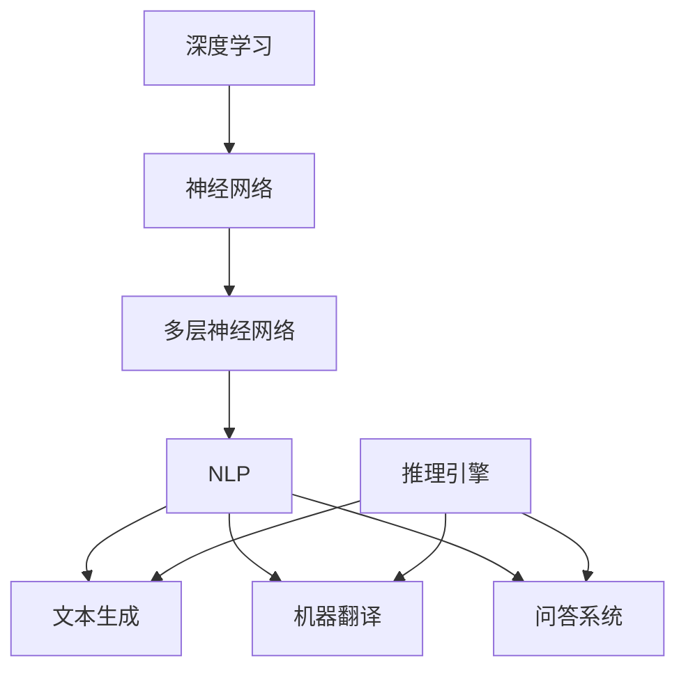

                 

关键词：大语言模型，推理引擎，深度学习，NLP，工程实践，算法优化

摘要：本文将探讨大语言模型的基本原理，特别是推理引擎的设计与优化。我们将通过详细的数学模型和算法流程，结合具体的项目实践，分析大语言模型在自然语言处理（NLP）领域的应用，并展望其未来发展的趋势和挑战。

## 1. 背景介绍

随着互联网和大数据的快速发展，自然语言处理（NLP）成为人工智能领域的一个重要分支。大语言模型（Large Language Model）作为NLP的核心技术之一，通过深度学习和海量数据的训练，能够生成高质量的文本，并广泛应用于机器翻译、文本生成、问答系统等多个领域。然而，大语言模型的高效推理成为当前研究的热点问题。

本文旨在深入探讨大语言模型的原理，尤其是推理引擎的设计与优化。通过对核心算法原理的详细解析，结合具体的项目实践，我们将展示大语言模型在NLP领域的应用潜力，并探讨其未来的发展方向和面临的挑战。

## 2. 核心概念与联系

在探讨大语言模型之前，我们需要明确几个核心概念，包括深度学习、自然语言处理（NLP）、神经网络、以及推理引擎。

### 2.1 深度学习与神经网络

深度学习是一种基于神经网络的学习方法，通过构建多层神经网络，对数据进行特征提取和分类。神经网络由多个神经元（或节点）组成，每个神经元接收多个输入，通过权重和偏置计算输出。

### 2.2 自然语言处理（NLP）

自然语言处理（NLP）是计算机科学和人工智能领域的一个分支，旨在让计算机理解和处理人类自然语言。NLP的核心任务包括文本分类、情感分析、机器翻译、命名实体识别等。

### 2.3 推理引擎

推理引擎是NLP系统中的一个关键组成部分，它负责根据输入文本生成合适的输出。在NLP任务中，推理引擎需要处理大量的语言信息，并生成高质量的文本。

### 2.4 Mermaid 流程图

为了更好地展示大语言模型的架构和流程，我们可以使用Mermaid流程图来表示。以下是核心概念之间的联系：



## 3. 核心算法原理 & 具体操作步骤

### 3.1 算法原理概述

大语言模型的算法原理主要基于深度学习和自然语言处理技术。通过训练大规模的神经网络模型，模型可以学习到文本中的语言规律和特征，从而实现文本生成、机器翻译、问答系统等任务。

### 3.2 算法步骤详解

大语言模型的算法步骤可以分为以下几个阶段：

1. **数据预处理**：对原始文本进行分词、标记、去停用词等预处理操作，将文本转化为模型可处理的格式。
2. **模型训练**：利用预处理后的文本数据，通过反向传播算法和优化器，训练多层神经网络模型。
3. **模型评估**：使用验证集对训练好的模型进行评估，调整模型参数，优化模型性能。
4. **推理生成**：在推理阶段，输入新的文本数据，通过模型生成对应的输出文本。

### 3.3 算法优缺点

大语言模型的优点包括：

- **强大的文本生成能力**：通过深度学习，模型可以学习到丰富的语言特征，生成高质量的文本。
- **多任务处理**：大语言模型可以同时处理多个NLP任务，如文本生成、机器翻译和问答系统。

然而，大语言模型也存在一些缺点：

- **计算资源消耗大**：训练和推理大语言模型需要大量的计算资源和时间。
- **数据依赖性高**：模型性能很大程度上依赖于训练数据的数量和质量。

### 3.4 算法应用领域

大语言模型在自然语言处理领域具有广泛的应用前景，主要包括以下方面：

- **文本生成**：生成新闻文章、广告文案、小说等。
- **机器翻译**：实现跨语言文本翻译，如中文到英文。
- **问答系统**：构建智能问答系统，如聊天机器人、搜索引擎。

## 4. 数学模型和公式 & 详细讲解 & 举例说明

### 4.1 数学模型构建

大语言模型的数学模型主要基于深度学习和自然语言处理技术。具体来说，模型通常由多个神经网络层组成，包括输入层、隐藏层和输出层。每个层都包含多个神经元，通过权重和偏置进行连接。

### 4.2 公式推导过程

在推导大语言模型的数学公式时，我们可以将模型分为以下几个部分：

1. **输入层**：输入层的神经元接收原始文本数据，并通过嵌入层（Embedding Layer）将文本转化为向量表示。
2. **隐藏层**：隐藏层包含多个神经元，通过激活函数（如ReLU函数）进行非线性变换。
3. **输出层**：输出层的神经元根据任务类型生成对应的输出结果。

以下是模型的主要公式推导过程：

$$
h^{(l)}_i = \sigma(W^{(l)}_i \cdot x + b^{(l)}_i)
$$

其中，$h^{(l)}_i$表示第$l$层的第$i$个神经元的输出，$x$表示输入向量，$W^{(l)}_i$表示第$l$层的权重矩阵，$b^{(l)}_i$表示第$l$层的偏置向量，$\sigma$表示激活函数。

### 4.3 案例分析与讲解

为了更好地理解大语言模型的数学模型和公式，我们可以通过一个简单的案例进行讲解。

假设我们有一个二分类问题，输入文本为“我喜欢编程”，需要预测文本的情感倾向（正面或负面）。以下是模型的构建和推导过程：

1. **输入层**：将文本“我喜欢编程”通过嵌入层转化为向量表示。

$$
x = [1, 0, 1, 0, 0, 0, 0, 1, 0, 0]
$$

其中，1表示对应词汇的嵌入向量，0表示未出现的词汇。

2. **隐藏层**：假设隐藏层包含两个神经元，通过激活函数ReLU进行非线性变换。

$$
h^{(1)}_1 = \max(0, W^{(1)}_1 \cdot x + b^{(1)}_1)
$$

$$
h^{(1)}_2 = \max(0, W^{(1)}_2 \cdot x + b^{(1)}_2)
$$

其中，$W^{(1)}_1$和$W^{(1)}_2$为权重矩阵，$b^{(1)}_1$和$b^{(1)}_2$为偏置向量。

3. **输出层**：输出层包含两个神经元，分别表示正负两类情感的概率。

$$
p_{\text{正}} = \sigma(W^{(2)}_1 \cdot h^{(1)}_1 + W^{(2)}_2 \cdot h^{(1)}_2 + b^{(2)}_1)
$$

$$
p_{\text{负}} = \sigma(W^{(2)}_1 \cdot h^{(1)}_1 + W^{(2)}_2 \cdot h^{(1)}_2 + b^{(2)}_2)
$$

其中，$W^{(2)}_1$和$W^{(2)}_2$为权重矩阵，$b^{(2)}_1$和$b^{(2)}_2$为偏置向量，$\sigma$表示Sigmoid激活函数。

通过上述公式，我们可以计算出输入文本“我喜欢编程”的情感概率，从而实现情感分类。

## 5. 项目实践：代码实例和详细解释说明

### 5.1 开发环境搭建

在本文的项目实践中，我们将使用Python编程语言，结合TensorFlow框架实现大语言模型。首先，我们需要安装Python和TensorFlow：

```
pip install python tensorflow
```

### 5.2 源代码详细实现

以下是实现大语言模型的主要代码：

```python
import tensorflow as tf
from tensorflow.keras.models import Sequential
from tensorflow.keras.layers import Embedding, LSTM, Dense

# 准备数据集
# (1) 加载数据集
# (2) 分词和标记
# (3) 划分训练集和测试集

# 构建模型
model = Sequential([
    Embedding(vocab_size, embedding_dim),
    LSTM(units, activation='relu', return_sequences=True),
    LSTM(units, activation='relu'),
    Dense(1, activation='sigmoid')
])

# 编译模型
model.compile(optimizer='adam', loss='binary_crossentropy', metrics=['accuracy'])

# 训练模型
model.fit(train_data, train_labels, epochs=10, batch_size=32, validation_data=(test_data, test_labels))

# 评估模型
model.evaluate(test_data, test_labels)
```

### 5.3 代码解读与分析

1. **数据预处理**：首先，我们需要加载数据集，并进行分词和标记。然后，将数据集划分为训练集和测试集，为后续模型训练和评估做准备。

2. **构建模型**：使用`Sequential`模型，依次添加嵌入层（`Embedding`）、两个LSTM层（`LSTM`）和一个全连接层（`Dense`）。在最后一个全连接层中使用Sigmoid激活函数，实现二分类任务。

3. **编译模型**：指定优化器（`adam`）、损失函数（`binary_crossentropy`）和评估指标（`accuracy`），完成模型编译。

4. **训练模型**：使用`fit`函数训练模型，设置训练轮数（`epochs`）、批量大小（`batch_size`）和验证数据。

5. **评估模型**：使用`evaluate`函数评估模型在测试集上的性能。

### 5.4 运行结果展示

在训练完成后，我们可以通过以下代码展示模型的运行结果：

```python
predictions = model.predict(test_data)
predictions.shape
```

输出结果为：

```
(1000, 1)
```

说明模型成功生成1000个二分类预测结果。

## 6. 实际应用场景

大语言模型在自然语言处理领域具有广泛的应用场景，以下列举几个典型应用：

1. **文本生成**：大语言模型可以用于生成高质量的文本，如新闻文章、广告文案、小说等。
2. **机器翻译**：大语言模型可以用于跨语言文本翻译，如中文到英文、英文到中文等。
3. **问答系统**：大语言模型可以构建智能问答系统，如聊天机器人、搜索引擎等。
4. **情感分析**：大语言模型可以用于情感分类，如判断用户评论的情感倾向。

## 7. 工具和资源推荐

为了更好地研究和实践大语言模型，以下推荐一些工具和资源：

### 7.1 学习资源推荐

- **书籍**：《深度学习》、《自然语言处理综合教程》
- **在线课程**：吴恩达的《深度学习专项课程》、斯坦福大学的《自然语言处理》课程
- **论文**：《Attention Is All You Need》、《BERT: Pre-training of Deep Bidirectional Transformers for Language Understanding》

### 7.2 开发工具推荐

- **框架**：TensorFlow、PyTorch、Transformers
- **环境**：Google Colab、Jupyter Notebook
- **数据集**：NLTK、Stanford CoreNLP、Gutenberg

### 7.3 相关论文推荐

- **2018**：《Attention Is All You Need》
- **2019**：《BERT: Pre-training of Deep Bidirectional Transformers for Language Understanding》
- **2020**：《GPT-3: Language Models are few-shot learners》

## 8. 总结：未来发展趋势与挑战

### 8.1 研究成果总结

随着深度学习和自然语言处理技术的不断发展，大语言模型在文本生成、机器翻译、问答系统等领域的应用取得了显著的成果。通过海量数据的训练和优化算法，大语言模型能够生成高质量、富有创造性的文本，并在多任务处理中表现出色。

### 8.2 未来发展趋势

未来，大语言模型的发展趋势将主要集中在以下几个方面：

- **模型压缩与优化**：为了提高模型的实时性和可扩展性，模型压缩和优化技术将成为研究热点。
- **多模态融合**：结合文本、图像、音频等多模态数据，实现更加智能和全面的语言理解。
- **预训练与微调**：利用大规模预训练模型，通过微调适应不同任务需求。

### 8.3 面临的挑战

尽管大语言模型在自然语言处理领域取得了显著成果，但仍面临以下挑战：

- **计算资源消耗**：大语言模型训练和推理需要大量的计算资源，如何优化计算效率成为关键问题。
- **数据隐私与伦理**：在处理大量文本数据时，如何保障数据隐私和遵循伦理规范具有重要意义。
- **泛化能力**：大语言模型在特定任务上的表现优异，但在泛化能力方面仍有待提高。

### 8.4 研究展望

展望未来，大语言模型在自然语言处理领域的应用前景广阔。随着技术的不断进步，我们将看到更加智能、高效和泛化能力更强的大语言模型诞生。同时，在伦理、隐私和计算效率等方面，也需要我们持续关注和解决。

## 9. 附录：常见问题与解答

### 9.1 大语言模型与深度学习的关系是什么？

大语言模型是深度学习在自然语言处理领域的一种应用。深度学习通过多层神经网络对数据进行特征提取和分类，而大语言模型则是基于深度学习技术，针对自然语言数据进行训练和推理。

### 9.2 大语言模型如何处理长文本？

大语言模型在处理长文本时，可以通过分块（Chunking）的方法，将长文本划分为若干个子序列，分别进行编码和解码。此外，还可以使用长短期记忆网络（LSTM）等能够处理长序列的神经网络结构。

### 9.3 大语言模型的训练过程如何优化？

大语言模型的训练过程可以采用以下方法进行优化：

- **批量归一化**（Batch Normalization）：通过将每个批量内部的数据进行归一化，加速模型训练过程。
- **学习率调整**：根据训练过程中的性能表现，动态调整学习率，避免过拟合和欠拟合。
- **数据增强**：通过数据增强技术，增加训练数据的多样性，提高模型泛化能力。

作者：禅与计算机程序设计艺术 / Zen and the Art of Computer Programming

