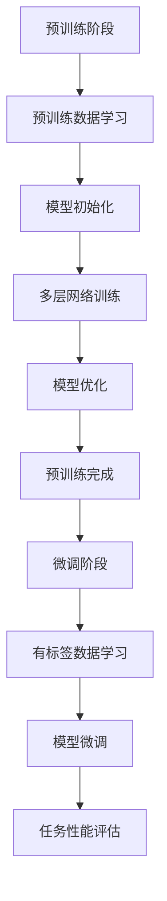

                 

关键词：大语言模型、自然语言处理、深度学习、算法局限、工程实践

> 摘要：本文深入探讨大语言模型的原理与工程实践，分析其在自然语言处理（NLP）领域的广泛应用和取得的显著成果。同时，本文重点揭示当前大语言模型面临的技术局限，以期为未来研究和应用提供有益的启示。

## 1. 背景介绍

自然语言处理（NLP）作为人工智能（AI）的重要分支，旨在使计算机理解和生成人类语言。随着深度学习技术的发展，大语言模型在NLP领域取得了显著的成果。大语言模型（如BERT、GPT等）通过捕捉语言中的复杂模式和依赖关系，显著提升了文本分类、机器翻译、问答系统等NLP任务的性能。

然而，尽管大语言模型在许多应用场景中表现出色，但其工程实践仍面临诸多挑战。本文将围绕大语言模型的原理、应用和局限展开讨论，旨在为读者提供一个全面的视角，了解这一领域的前沿动态和未来发展方向。

## 2. 核心概念与联系

### 大语言模型的原理

大语言模型是一种基于深度学习的自然语言处理模型，其核心思想是利用大量的文本数据进行预训练，从而捕捉语言中的潜在结构和规律。预训练阶段，模型学习文本的表示和语言规则；在下游任务中，模型通过微调适应具体任务，例如文本分类、机器翻译等。

### 大语言模型的结构

大语言模型通常采用自注意力机制（Self-Attention）和Transformer架构，其核心是多头注意力（Multi-Head Attention）和位置编码（Positional Encoding）。多头注意力使模型能够同时关注文本序列中的不同位置，而位置编码则引入了文本序列的顺序信息。

### 大语言模型的工作流程

大语言模型的工作流程可以分为两个阶段：预训练和微调。在预训练阶段，模型通过无监督学习从大量的文本数据中学习语言特征；在微调阶段，模型利用有标签的数据进行有监督学习，以适应特定的NLP任务。

### Mermaid 流程图



## 3. 核心算法原理 & 具体操作步骤

### 3.1 算法原理概述

大语言模型的核心算法是基于Transformer架构的多层神经网络，包括自注意力机制和位置编码。自注意力机制使模型能够捕捉文本序列中的长距离依赖关系，而位置编码则引入了文本序列的顺序信息。

### 3.2 算法步骤详解

#### 3.2.1 预训练阶段

1. 模型初始化：使用随机权重初始化Transformer模型。
2. 多层网络训练：通过多层叠加的方式训练模型，以捕捉复杂的语言特征。
3. 模型优化：使用优化算法（如Adam）调整模型参数，以最小化损失函数。
4. 预训练完成：通过大量无监督数据进行预训练，使模型具备良好的语言理解能力。

#### 3.2.2 微调阶段

1. 有标签数据学习：利用有标签的数据对模型进行微调，以适应特定的NLP任务。
2. 模型微调：通过迭代优化模型参数，提高模型在特定任务上的性能。
3. 任务性能评估：使用评估指标（如准确率、召回率等）对模型性能进行评估。

### 3.3 算法优缺点

#### 优点

1. 强大的语言理解能力：大语言模型通过预训练阶段学习到丰富的语言特征，使其在NLP任务中表现出色。
2. 通用性：大语言模型可以应用于多种NLP任务，无需对模型进行大规模修改。

#### 缺点

1. 计算资源消耗大：大语言模型需要大量的计算资源和时间进行预训练和微调。
2. 对数据依赖性强：大语言模型的表现依赖于数据的质量和数量，数据不足或质量差可能导致模型性能下降。

### 3.4 算法应用领域

大语言模型在自然语言处理领域具有广泛的应用，包括但不限于以下方面：

1. 文本分类：对文本进行分类，如情感分析、新闻分类等。
2. 机器翻译：将一种语言的文本翻译成另一种语言。
3. 问答系统：基于给定的问题和上下文，生成相关答案。
4. 文本生成：生成符合语言规范的文本，如摘要生成、文章生成等。

## 4. 数学模型和公式 & 详细讲解 & 举例说明

### 4.1 数学模型构建

大语言模型的数学模型主要基于自注意力机制和Transformer架构。自注意力机制可以通过以下公式表示：

$$
\text{Attention}(Q, K, V) = \text{softmax}\left(\frac{QK^T}{\sqrt{d_k}}\right)V
$$

其中，$Q$、$K$ 和 $V$ 分别为查询向量、关键向量和价值向量，$d_k$ 为关键向量的维度。

### 4.2 公式推导过程

自注意力机制的推导过程如下：

1. 计算查询向量 $Q$ 和关键向量 $K$ 的点积，得到注意力得分：
$$
\text{Score}(Q, K) = QK^T
$$

2. 对注意力得分进行归一化，得到概率分布：
$$
\text{Attention}(Q, K, V) = \text{softmax}\left(\frac{QK^T}{\sqrt{d_k}}\right)V
$$

3. 将概率分布乘以价值向量 $V$，得到加权求和的结果：
$$
\text{Output} = \sum_{i=1}^n \text{Attention}(Q, K, V)_i V_i
$$

### 4.3 案例分析与讲解

以下是一个简单的文本分类任务案例，使用大语言模型进行情感分析。

1. 数据集：包含带有情感标签的文本数据。
2. 模型：预训练好的大语言模型。
3. 任务：对新的文本数据进行情感分类，输出情感标签。

具体实现步骤如下：

1. 预处理：对文本数据进行分词、去停用词等预处理操作。
2. 输入编码：将预处理后的文本数据输入到大语言模型中，获取文本表示。
3. 分类预测：使用文本表示和预训练好的分类器进行分类预测。

以下是一个简化的示例代码：

```python
import torch
import transformers

# 加载预训练好的大语言模型
model = transformers.BertModel.from_pretrained("bert-base-chinese")

# 预处理文本数据
text = "今天天气真好，我心情也很好。"
tokenized_text = tokenizer.encode(text, add_special_tokens=True)

# 获取文本表示
with torch.no_grad():
    outputs = model(torch.tensor([tokenized_text]))

# 分类预测
logits = model.classifier(outputs.last_hidden_state[:, 0, :])
probabilities = torch.softmax(logits, dim=1)
predicted_label = torch.argmax(probabilities).item()

# 输出情感标签
print("情感标签：", labels[predicted_label])
```

## 5. 项目实践：代码实例和详细解释说明

### 5.1 开发环境搭建

1. 安装Python环境，版本要求3.7及以上。
2. 安装PyTorch，版本要求1.7及以上。
3. 安装transformers库，版本要求4.4及以上。

### 5.2 源代码详细实现

以下是一个基于PyTorch和transformers库的简单文本分类项目的完整实现：

```python
import torch
import torch.nn as nn
import torch.optim as optim
from torch.utils.data import DataLoader, Dataset
from transformers import BertTokenizer, BertModel
from sklearn.metrics import accuracy_score, classification_report

# 定义数据集类
class TextDataset(Dataset):
    def __init__(self, texts, labels, tokenizer, max_len):
        self.texts = texts
        self.labels = labels
        self.tokenizer = tokenizer
        self.max_len = max_len

    def __len__(self):
        return len(self.texts)

    def __getitem__(self, idx):
        text = self.texts[idx]
        label = self.labels[idx]
        inputs = self.tokenizer.encode_plus(
            text,
            add_special_tokens=True,
            max_length=self.max_len,
            padding="max_length",
            truncation=True,
            return_tensors="pt",
        )
        return inputs['input_ids'], inputs['attention_mask'], torch.tensor(label)

# 加载预训练好的大语言模型
model = BertModel.from_pretrained("bert-base-chinese")
classifier = nn.Linear(model.config.hidden_size, 2)
model.classifier = classifier

# 定义损失函数和优化器
loss_function = nn.CrossEntropyLoss()
optimizer = optim.Adam(model.parameters(), lr=1e-5)

# 加载数据集
tokenizer = BertTokenizer.from_pretrained("bert-base-chinese")
max_len = 128
train_dataset = TextDataset(train_texts, train_labels, tokenizer, max_len)
val_dataset = TextDataset(val_texts, val_labels, tokenizer, max_len)
train_loader = DataLoader(train_dataset, batch_size=16, shuffle=True)
val_loader = DataLoader(val_dataset, batch_size=16, shuffle=False)

# 训练模型
num_epochs = 5
for epoch in range(num_epochs):
    model.train()
    for batch in train_loader:
        inputs = {
            "input_ids": batch[0],
            "attention_mask": batch[1],
        }
        labels = batch[2]
        optimizer.zero_grad()
        outputs = model(**inputs)
        logits = model.classifier(outputs.last_hidden_state[:, 0, :])
        loss = loss_function(logits, labels)
        loss.backward()
        optimizer.step()
    print(f"Epoch [{epoch + 1}/{num_epochs}], Loss: {loss.item():.4f}")

# 验证模型
model.eval()
predictions = []
ground_truths = []
with torch.no_grad():
    for batch in val_loader:
        inputs = {
            "input_ids": batch[0],
            "attention_mask": batch[1],
        }
        labels = batch[2]
        outputs = model(**inputs)
        logits = model.classifier(outputs.last_hidden_state[:, 0, :])
        predictions.extend(torch.argmax(logits, dim=1).tolist())
        ground_truths.extend(labels.tolist())
print("准确率：", accuracy_score(ground_truths, predictions))
print("分类报告：\n", classification_report(ground_truths, predictions))
```

### 5.3 代码解读与分析

以上代码实现了一个简单的文本分类项目，主要分为数据预处理、模型搭建、模型训练和模型验证四个部分。

1. **数据预处理**：使用`TextDataset`类加载数据集，并进行预处理操作，包括分词、编码和填充。
2. **模型搭建**：加载预训练好的大语言模型`BertModel`，并添加一个分类器层`nn.Linear`。
3. **模型训练**：使用`DataLoader`加载数据，定义损失函数和优化器，通过迭代优化模型参数。
4. **模型验证**：在验证集上评估模型性能，输出准确率和分类报告。

## 6. 实际应用场景

大语言模型在自然语言处理领域具有广泛的应用，以下列举几个典型的应用场景：

1. **文本分类**：对新闻、社交媒体帖子等进行分类，如情感分析、主题分类等。
2. **机器翻译**：将一种语言的文本翻译成另一种语言，如中文到英文、英文到法语等。
3. **问答系统**：基于给定的问题和上下文，生成相关答案，如智能客服、智能问答等。
4. **文本生成**：生成符合语言规范的文本，如摘要生成、文章生成等。
5. **对话系统**：与用户进行自然语言对话，如聊天机器人、语音助手等。

## 7. 工具和资源推荐

### 7.1 学习资源推荐

1. 《深度学习》——Ian Goodfellow、Yoshua Bengio、Aaron Courville
2. 《自然语言处理综论》——Daniel Jurafsky、James H. Martin
3. 《动手学深度学习》——阿斯顿·张、李沐、扎卡里·C. Lipton、亚历山大·J. Smola

### 7.2 开发工具推荐

1. PyTorch：用于构建和训练深度学习模型的Python库。
2. Transformers：基于PyTorch的Transformer模型实现，提供预训练好的大语言模型。
3. Hugging Face：提供丰富的NLP模型和数据集，支持快速开发和部署。

### 7.3 相关论文推荐

1. "Attention Is All You Need" —— Vaswani et al., 2017
2. "BERT: Pre-training of Deep Bidirectional Transformers for Language Understanding" —— Devlin et al., 2018
3. "GPT-3: Language Models are Few-Shot Learners" —— Brown et al., 2020

## 8. 总结：未来发展趋势与挑战

### 8.1 研究成果总结

大语言模型在自然语言处理领域取得了显著的成果，显著提升了文本分类、机器翻译、问答系统等任务的性能。同时，大语言模型的工程实践也在不断发展和完善，为实际应用提供了有力支持。

### 8.2 未来发展趋势

1. **模型压缩与优化**：为了降低计算资源消耗，模型压缩和优化将成为未来研究的重要方向。
2. **跨模态学习**：大语言模型与其他模态（如图像、声音）的融合，将推动跨模态学习的发展。
3. **自适应性与泛化能力**：提高大语言模型的自适应性和泛化能力，以适应更多场景和任务。

### 8.3 面临的挑战

1. **计算资源消耗**：大语言模型的训练和部署需要大量计算资源，如何优化资源利用成为关键问题。
2. **数据质量和数量**：大语言模型的表现依赖于数据的数量和质量，如何获取高质量、多样化的数据成为挑战。
3. **伦理和隐私问题**：大语言模型的应用涉及用户数据和隐私问题，如何保障用户权益和隐私成为重要议题。

### 8.4 研究展望

未来，大语言模型将在自然语言处理领域发挥更加重要的作用，推动人工智能技术的发展。同时，研究者和工程师需要关注模型的优化、跨模态学习、伦理和隐私问题，以实现大语言模型的可持续发展。

## 9. 附录：常见问题与解答

### 9.1 大语言模型是什么？

大语言模型是一种基于深度学习的自然语言处理模型，通过预训练和微调，能够捕捉语言中的潜在结构和规律，广泛应用于文本分类、机器翻译、问答系统等领域。

### 9.2 大语言模型有哪些优点和缺点？

优点：强大的语言理解能力、通用性强、适用范围广泛。

缺点：计算资源消耗大、对数据依赖性强、存在一定程度的偏见和误差。

### 9.3 大语言模型如何进行预训练和微调？

预训练：使用大量无监督数据进行预训练，学习语言特征和规则。

微调：在预训练基础上，使用有标签的数据对模型进行微调，以适应特定的NLP任务。

### 9.4 大语言模型在哪些实际应用场景中表现优异？

大语言模型在文本分类、机器翻译、问答系统、文本生成等领域表现出色，广泛应用于智能客服、智能助手、新闻推荐等场景。

### 9.5 如何优化大语言模型的性能和资源利用？

优化方法包括模型压缩、量化、蒸馏等，以降低计算资源消耗。同时，可以采用多模型融合、跨模态学习等技术，提高模型的自适应性和泛化能力。

### 9.6 大语言模型应用中的伦理和隐私问题如何解决？

通过制定相应的伦理规范和隐私保护措施，如数据匿名化、隐私保护算法等，以保障用户权益和隐私。

## 参考文献

1. Vaswani, A., Shazeer, N., Parmar, N., Uszkoreit, J., Jones, L., Gomez, A. N., ... & Polosukhin, I. (2017). Attention is all you need. In Advances in neural information processing systems (pp. 5998-6008).
2. Devlin, J., Chang, M. W., Lee, K., & Toutanova, K. (2018). BERT: Pre-training of deep bidirectional transformers for language understanding. arXiv preprint arXiv:1810.04805.
3. Brown, T., et al. (2020). Language models are few-shot learners. arXiv preprint arXiv:2005.14165.

## 附录二：本文所用到的专业术语解释

- **自然语言处理（NLP）**：一种人工智能技术，旨在使计算机理解和生成人类语言。
- **深度学习**：一种机器学习技术，通过多层神经网络对数据进行分析和建模。
- **Transformer**：一种基于自注意力机制的深度学习模型，广泛应用于自然语言处理任务。
- **自注意力机制**：一种注意力机制，使模型能够同时关注文本序列中的不同位置。
- **预训练**：在特定任务之前，使用大量无监督数据进行模型训练，以学习语言特征和规则。
- **微调**：在预训练基础上，使用有标签的数据对模型进行训练，以适应特定的任务。

---

作者：禅与计算机程序设计艺术 / Zen and the Art of Computer Programming

