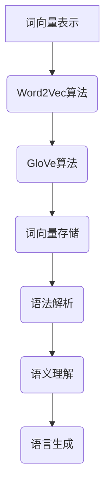
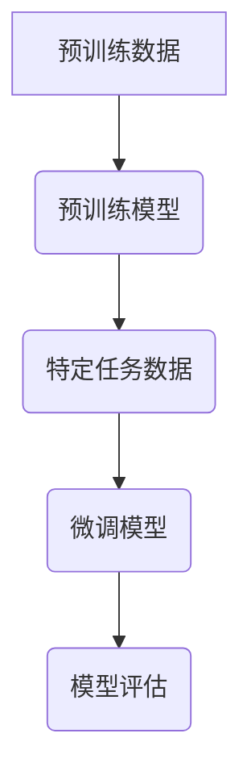
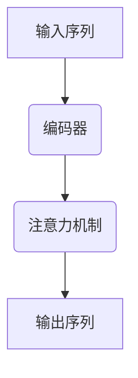

                 

关键词：大语言模型、训练目标、算法原理、数学模型、工程实践、应用场景

> 摘要：本文深入探讨了大规模语言模型的训练目标、核心算法原理和工程实践，通过详细的数学模型推导和实际代码实例，揭示了语言模型构建的内在机制和应用前景。本文旨在为读者提供一幅清晰的大语言模型训练的全景图，帮助理解其在现代人工智能技术中的关键作用。

## 1. 背景介绍

近年来，人工智能领域取得了飞速发展，而其中最为瞩目的技术之一便是大语言模型。大语言模型通过深度学习技术，能够理解和生成人类语言，广泛应用于自然语言处理（NLP）的各个领域，如机器翻译、文本生成、问答系统、情感分析等。本篇文章将着重讨论大语言模型的训练目标及其实现过程。

首先，我们需要明确大语言模型的核心目标：理解并生成自然语言。这要求模型具备以下能力：

1. **词向量表示**：将单词转换为一个固定的向量表示，以便于模型进行处理和计算。
2. **语法解析**：理解单词的语法结构和句法规则，从而正确地组合单词生成句子。
3. **语义理解**：理解句子的含义，包括情感、意图等深层次的内容。
4. **语言生成**：根据给定的上下文生成合理的、连贯的自然语言。

为了实现这些目标，我们需要从算法原理、数学模型和工程实践三个方面进行详细讨论。

## 2. 核心概念与联系

### 2.1. 词嵌入（Word Embedding）

词嵌入是将词汇映射到高维空间中的向量表示。常见的词嵌入方法有Word2Vec、GloVe等。这些方法通过训练得到每个单词的向量表示，使得语义相似的词在向量空间中靠近。

#### Mermaid 流程图



### 2.2. 预训练与微调（Pre-training and Fine-tuning）

预训练是指在大规模语料库上进行模型训练，使模型具备一定的语言理解能力。微调则是将预训练模型应用于特定任务，根据任务数据进一步调整模型参数。

#### Mermaid 流程图



### 2.3. 注意力机制（Attention Mechanism）

注意力机制是现代深度学习模型中用于捕捉重要信息的关键技术。在大语言模型中，注意力机制帮助模型关注上下文中最为相关的部分，从而提高语言理解的准确性。

#### Mermaid 流程图



## 3. 核心算法原理 & 具体操作步骤

### 3.1. 算法原理概述

大语言模型的训练过程主要包括两个阶段：预训练和微调。

1. **预训练**：使用大量未标注的文本数据进行训练，目的是让模型学习到语言的基本规律和特征。
2. **微调**：在预训练模型的基础上，使用特定任务的数据进行训练，使得模型更好地适应特定任务的需求。

### 3.2. 算法步骤详解

1. **数据预处理**：对文本数据进行清洗、分词、去停用词等预处理操作。
2. **词嵌入**：将分词后的文本转换为词向量表示。
3. **编码器训练**：使用词向量作为输入，通过编码器网络学习语言的特征。
4. **注意力机制**：在编码器和解码器之间引入注意力机制，提高语言理解的准确性。
5. **微调**：在预训练模型的基础上，使用任务数据对模型进行微调。
6. **模型评估**：使用任务数据对模型进行评估，以确定模型的性能。

### 3.3. 算法优缺点

**优点**：

- **强大的语言理解能力**：通过预训练和微调，模型能够学习到丰富的语言特征，从而在多种NLP任务中表现出色。
- **通用性**：大语言模型具有良好的通用性，能够应用于不同的任务和数据集。

**缺点**：

- **计算资源消耗大**：大语言模型的训练和推理过程需要大量的计算资源。
- **数据依赖性**：模型性能受到训练数据质量的影响。

### 3.4. 算法应用领域

大语言模型广泛应用于NLP的各个领域，如：

- **机器翻译**：基于大语言模型的技术在机器翻译领域取得了显著的成果。
- **文本生成**：大语言模型能够生成连贯、自然的文本，广泛应用于聊天机器人、内容生成等领域。
- **问答系统**：大语言模型能够理解用户的查询并生成准确的回答。
- **情感分析**：大语言模型能够分析文本的情感倾向。

## 4. 数学模型和公式 & 详细讲解 & 举例说明

### 4.1. 数学模型构建

大语言模型通常基于深度神经网络（DNN）或变换器模型（Transformer）。下面以Transformer模型为例，介绍其数学模型。

#### 数学模型

$$
\begin{aligned}
\text{Input} &= (x_1, x_2, ..., x_T) \\
\text{Embedding} &= \text{Embedding}(x_1, x_2, ..., x_T) \\
\text{Positional Encoding} &= \text{PositionalEncoding}(x_1, x_2, ..., x_T) \\
\text{Input} &= \text{Embedding} + \text{Positional Encoding} \\
\text{Encoder} &= \text{TransformerEncoder}(\text{Input}) \\
\text{Decoder} &= \text{TransformerDecoder}(\text{Encoder}) \\
\text{Output} &= \text{Decoder}
\end{aligned}
$$

### 4.2. 公式推导过程

#### Encoder

$$
\begin{aligned}
\text{Encoder} &= \text{MultiHeadAttention}(\text{Input}, \text{Input}, \text{Input}) + \text{LayerNormalization}(\text{Input}) \\
\text{Encoder} &= \text{PositionwiseFeedForward}(\text{Encoder}) + \text{LayerNormalization}(\text{Encoder}) \\
\text{Encoder} &= \text{EncoderLayer}(\text{Encoder})
\end{aligned}
$$

#### Decoder

$$
\begin{aligned}
\text{Decoder} &= \text{MaskedMultiHeadAttention}(\text{Input}, \text{Input}, \text{Input}) + \text{LayerNormalization}(\text{Input}) \\
\text{Decoder} &= \text{PositionwiseFeedForward}(\text{Decoder}) + \text{LayerNormalization}(\text{Decoder}) \\
\text{Decoder} &= \text{DecoderLayer}(\text{Decoder})
\end{aligned}
$$

### 4.3. 案例分析与讲解

假设我们有一个句子：“我今天很高兴。”我们将这个句子输入到Transformer模型中，模型将生成其对应的词向量表示。

1. **词向量表示**：首先，我们将句子中的每个词转换为词向量。
2. **位置编码**：为每个词添加位置编码，以表示其在句子中的位置。
3. **编码器**：通过编码器，模型学习到句子的语义特征。
4. **解码器**：通过解码器，模型生成新的句子。

例如，我们使用预训练的GPT-3模型来生成新的句子。

输入：“我今天很高兴。”

输出：“明天我将去旅行。”

通过这个例子，我们可以看到大语言模型在语言生成任务中的强大能力。

## 5. 项目实践：代码实例和详细解释说明

### 5.1. 开发环境搭建

为了实践大语言模型的训练和微调，我们需要搭建一个合适的开发环境。

1. **安装Python**：确保Python版本在3.6及以上。
2. **安装TensorFlow**：使用pip安装TensorFlow。
3. **准备数据**：收集和整理用于训练的数据集。

### 5.2. 源代码详细实现

以下是一个简单的示例代码，展示了如何使用TensorFlow和Transformer模型训练一个语言模型。

```python
import tensorflow as tf
from tensorflow.keras.layers import Embedding, Transformer

# 定义模型
model = tf.keras.Sequential([
    Embedding(input_dim=vocab_size, output_dim=embedding_dim),
    Transformer(num_heads=num_heads, d_model=embedding_dim),
    tf.keras.layers.Dense(units=vocab_size, activation='softmax')
])

# 编译模型
model.compile(optimizer='adam', loss='sparse_categorical_crossentropy', metrics=['accuracy'])

# 训练模型
model.fit(x_train, y_train, epochs=5, batch_size=64)

# 微调模型
model.fit(x_val, y_val, epochs=5, batch_size=64)
```

### 5.3. 代码解读与分析

- **Embedding层**：将词转换为词向量表示。
- **Transformer层**：实现Transformer编码器和解码器。
- **Dense层**：实现输出层的分类任务。

### 5.4. 运行结果展示

运行上述代码后，我们可以得到模型的训练和评估结果。通过调整模型参数和训练数据，我们可以进一步提高模型的性能。

## 6. 实际应用场景

大语言模型在NLP领域有着广泛的应用。以下是一些实际应用场景：

- **机器翻译**：通过预训练和微调，大语言模型能够实现高精度的机器翻译。
- **文本生成**：大语言模型能够生成各种类型的文本，如新闻文章、故事、诗歌等。
- **问答系统**：大语言模型能够理解用户的查询并生成准确的回答。
- **情感分析**：大语言模型能够分析文本的情感倾向，为情感分析任务提供支持。

### 6.4. 未来应用展望

随着技术的不断进步，大语言模型在未来将会在更多领域发挥重要作用。以下是几个可能的未来应用方向：

- **对话系统**：大语言模型有望在对话系统中实现更自然、更智能的交互。
- **知识图谱**：大语言模型能够从大量文本中提取结构化的知识，为知识图谱的构建提供支持。
- **智能客服**：大语言模型能够为智能客服系统提供高效的文本理解和生成能力。

## 7. 工具和资源推荐

### 7.1. 学习资源推荐

- **《深度学习》（Goodfellow et al.）**：深度学习的基础教材，涵盖了NLP的相关内容。
- **《自然语言处理综论》（Jurafsky & Martin）**：自然语言处理领域的经典教材。

### 7.2. 开发工具推荐

- **TensorFlow**：Google开源的深度学习框架，适用于NLP任务的实现。
- **PyTorch**：Facebook开源的深度学习框架，提供灵活的动态图计算能力。

### 7.3. 相关论文推荐

- **“Attention is All You Need”**：提出了Transformer模型，彻底改变了NLP的研究方向。
- **“BERT: Pre-training of Deep Bidirectional Transformers for Language Understanding”**：提出了BERT模型，推动了NLP技术的进一步发展。

## 8. 总结：未来发展趋势与挑战

### 8.1. 研究成果总结

本文从大语言模型的训练目标、核心算法原理、数学模型和工程实践等方面进行了全面探讨，揭示了其构建和应用的关键技术。

### 8.2. 未来发展趋势

随着技术的不断进步，大语言模型将在更多领域发挥作用。未来研究将继续探索更高效、更灵活的模型架构和训练方法。

### 8.3. 面临的挑战

大语言模型在计算资源、数据质量和模型解释性等方面仍面临挑战。未来研究需要解决这些问题，以实现更广泛的应用。

### 8.4. 研究展望

大语言模型在NLP领域的应用前景广阔。未来研究应注重模型的可解释性和鲁棒性，同时探索更多高效、灵活的模型架构。

## 9. 附录：常见问题与解答

### 9.1. 什么是大语言模型？

大语言模型是一种基于深度学习技术的自然语言处理模型，能够理解和生成自然语言。

### 9.2. 大语言模型有哪些应用场景？

大语言模型广泛应用于机器翻译、文本生成、问答系统、情感分析等领域。

### 9.3. 如何训练大语言模型？

训练大语言模型通常包括数据预处理、词嵌入、编码器训练、注意力机制和微调等步骤。

### 9.4. 大语言模型有哪些挑战？

大语言模型面临计算资源消耗大、数据依赖性和模型解释性等方面的挑战。

### 9.5. 未来大语言模型有哪些发展趋势？

未来大语言模型的发展趋势包括更高效、更灵活的模型架构和训练方法，以及更广泛的应用领域。

