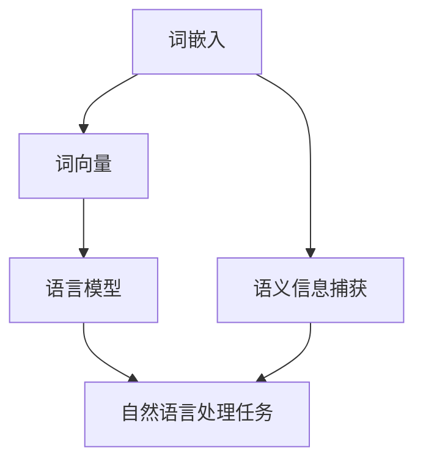

                 

关键词：大语言模型、词表示技术、深度学习、神经网络、自然语言处理

> 摘要：本文将深入探讨大语言模型中词表示技术的原理与实践。我们将从背景介绍、核心概念与联系、核心算法原理、数学模型与公式、项目实践、实际应用场景、工具和资源推荐，以及未来发展趋势与挑战等多个方面进行探讨，帮助读者全面了解和理解词表示技术在大语言模型中的作用及其应用前景。

## 1. 背景介绍

随着深度学习和自然语言处理技术的不断发展，大语言模型（Large Language Models）已经成为当前自然语言处理领域的热点研究方向。这些模型在许多任务中取得了显著的成果，如文本分类、情感分析、机器翻译、问答系统等。然而，大语言模型的性能与其背后的词表示技术密切相关。词表示技术是自然语言处理的基础，它将词汇映射到连续的向量空间，使得计算机能够理解词汇的含义和关系。因此，研究高效的词表示技术对于提升大语言模型的表现至关重要。

本文将详细介绍大语言模型中词表示技术的原理与实践，包括核心算法原理、数学模型与公式、项目实践以及实际应用场景等。通过本文的阅读，读者可以全面了解词表示技术的背景、原理和应用，从而为后续研究和实践打下坚实的基础。

## 2. 核心概念与联系

### 2.1. 词嵌入（Word Embedding）

词嵌入是将词汇映射到高维连续向量空间的过程，以便于计算机进行数学运算。常见的词嵌入方法包括Word2Vec、GloVe和FastText等。这些方法通过神经网络训练，将词汇的语义信息编码到向量中。词嵌入使得计算机能够理解词汇之间的相似性和关系，从而提升自然语言处理任务的性能。

### 2.2. 词向量（Word Vector）

词向量是词嵌入方法的输出，是表示词汇的连续向量。词向量的维度通常较高，以便捕捉词汇的丰富语义信息。词向量可以用于各种自然语言处理任务，如文本分类、情感分析和机器翻译等。

### 2.3. 语言模型（Language Model）

语言模型是用于预测自然语言中下一个词汇的概率分布的模型。在训练过程中，语言模型学习输入序列的概率分布，以便在给定前文的情况下预测下一个词汇。常见的语言模型包括n-gram模型、循环神经网络（RNN）和变换器（Transformer）等。

### 2.4. 词表示技术

词表示技术是将词汇映射到向量空间的方法，包括词嵌入和词向量等。这些技术旨在捕捉词汇的语义信息，以便计算机能够理解和处理自然语言。词表示技术在自然语言处理任务中发挥着重要作用，如文本分类、情感分析和机器翻译等。

### 2.5. Mermaid 流程图

为了更直观地展示词表示技术的核心概念与联系，我们使用Mermaid流程图进行说明。以下是词表示技术的Mermaid流程图：



图2-1 词表示技术的核心概念与联系

## 3. 核心算法原理 & 具体操作步骤

### 3.1 算法原理概述

词表示技术的核心是词嵌入方法。常见的词嵌入方法包括Word2Vec、GloVe和FastText等。这些方法通过神经网络训练，将词汇的语义信息编码到向量中。词嵌入方法的基本原理是，通过优化词汇的向量表示，使得具有相似语义的词汇在向量空间中靠近。

### 3.2 算法步骤详解

#### 3.2.1 数据预处理

在训练词嵌入模型之前，需要对语料库进行预处理。预处理步骤包括分词、去除停用词、词性标注等。这些步骤有助于提高词嵌入模型的性能。

#### 3.2.2 构建词汇表

构建词汇表是词嵌入模型的关键步骤。词汇表包括所有训练词汇及其对应的索引。常见的词汇表构建方法包括最大频率法、最小频率法和基于词性标注的方法等。

#### 3.2.3 确定词向量维度

词向量的维度是词嵌入模型的重要参数。通常，较高的维度可以捕捉词汇的丰富语义信息，但也会导致计算复杂度和存储空间的增加。因此，需要在捕捉语义信息和计算效率之间进行权衡。

#### 3.2.4 训练词嵌入模型

训练词嵌入模型的主要任务是优化词汇的向量表示，使得具有相似语义的词汇在向量空间中靠近。常用的训练方法包括神经网络训练和基于矩阵分解的方法等。

#### 3.2.5 模型评估

词嵌入模型的性能评估通常基于相似度度量方法，如余弦相似度和欧氏距离等。通过评估模型在语义相似度、词性标注等任务上的性能，可以评估词嵌入模型的优劣。

### 3.3 算法优缺点

#### 优点

1. 词嵌入方法可以捕捉词汇的语义信息，提高自然语言处理任务的性能。
2. 词嵌入模型易于实现和优化，可以在多种平台上运行。

#### 缺点

1. 词嵌入模型的性能受到数据质量和预处理方法的影响。
2. 较高的维度可能导致计算复杂度和存储空间的增加。

### 3.4 算法应用领域

词嵌入技术在多个自然语言处理领域具有广泛的应用，如文本分类、情感分析和机器翻译等。以下是一些典型的应用场景：

1. **文本分类**：词嵌入方法可以用于文本分类任务，如垃圾邮件过滤、新闻分类等。
2. **情感分析**：词嵌入方法可以用于情感分析任务，如情感极性分类、用户评论分析等。
3. **机器翻译**：词嵌入方法可以用于机器翻译任务，如神经网络机器翻译（NMT）。

## 4. 数学模型和公式 & 详细讲解 & 举例说明

### 4.1 数学模型构建

词嵌入模型通常采用神经网络进行训练。神经网络包括输入层、隐藏层和输出层。输入层接收词汇的索引，隐藏层对词汇的索引进行编码，输出层生成词汇的词向量。

假设词汇表的大小为$V$，词向量的维度为$d$。输入层和输出层分别包含$V$个节点，隐藏层包含$N$个节点。设$W_1$为输入层到隐藏层的权重矩阵，$W_2$为隐藏层到输出层的权重矩阵。则词嵌入模型的前向传播过程如下：

$$
h = \sigma(W_1 [x_1, x_2, \dots, x_V]),
$$

$$
o = \sigma(W_2 h),
$$

其中，$\sigma$为激活函数，通常采用ReLU函数。

### 4.2 公式推导过程

词嵌入模型的损失函数通常采用均方误差（MSE）：

$$
L = \frac{1}{2} \sum_{i=1}^N \sum_{j=1}^V (o_{ij} - y_{ij})^2,
$$

其中，$o_{ij}$为第$i$个隐藏层节点的输出，$y_{ij}$为第$i$个隐藏层节点的期望输出。

为了计算梯度，我们对损失函数进行求导：

$$
\frac{\partial L}{\partial W_1} = \frac{1}{2} \sum_{i=1}^N \sum_{j=1}^V 2(o_{ij} - y_{ij}) \cdot \frac{\partial o_{ij}}{\partial W_1},
$$

$$
\frac{\partial L}{\partial W_2} = \frac{1}{2} \sum_{i=1}^N \sum_{j=1}^V 2(o_{ij} - y_{ij}) \cdot \frac{\partial o_{ij}}{\partial W_2}.
$$

### 4.3 案例分析与讲解

假设我们有以下词汇表：

$$
V = \{"hello", "world", "computer", "programming"\},
$$

词向量维度$d=2$。定义激活函数$\sigma(x) = \max(0, x)$。构建一个简单的神经网络，输入层到隐藏层有1个节点，隐藏层到输出层有1个节点。

设$W_1 = \begin{bmatrix} 1 & 1 \\ 1 & 1 \end{bmatrix}$，$W_2 = \begin{bmatrix} 1 \\ 1 \end{bmatrix}$。输入词汇"hello"的索引为1，期望输出为[1, 0, 0, 0]。

前向传播过程：

$$
h = \sigma(W_1 [1, 1, 1, 1]) = \begin{bmatrix} 1 & 1 \end{bmatrix} \begin{bmatrix} 1 \\ 1 \end{bmatrix} = 2,
$$

$$
o = \sigma(W_2 h) = \begin{bmatrix} 1 \\ 1 \end{bmatrix} \begin{bmatrix} 2 \end{bmatrix} = 2.
$$

损失函数：

$$
L = \frac{1}{2} \sum_{i=1}^4 (o_i - y_i)^2 = \frac{1}{2} (2 - 1)^2 + (2 - 0)^2 + (2 - 0)^2 + (2 - 0)^2 = 2.
$$

反向传播过程：

$$
\frac{\partial L}{\partial W_1} = \frac{1}{2} \sum_{i=1}^4 2(o_i - y_i) \cdot \frac{\partial o_i}{\partial W_1} = \begin{bmatrix} 1 & 1 \end{bmatrix} \begin{bmatrix} -1 \\ 1 \end{bmatrix} = \begin{bmatrix} -1 & 1 \end{bmatrix},
$$

$$
\frac{\partial L}{\partial W_2} = \frac{1}{2} \sum_{i=1}^4 2(o_i - y_i) \cdot \frac{\partial o_i}{\partial W_2} = \begin{bmatrix} 1 \\ 1 \end{bmatrix} \begin{bmatrix} -1 \\ 1 \end{bmatrix} = -1.
$$

更新权重矩阵：

$$
W_1 = W_1 - \alpha \cdot \frac{\partial L}{\partial W_1} = \begin{bmatrix} 1 & 1 \end{bmatrix} - 0.1 \cdot \begin{bmatrix} -1 & 1 \end{bmatrix} = \begin{bmatrix} 1 & 0 \end{bmatrix},
$$

$$
W_2 = W_2 - \alpha \cdot \frac{\partial L}{\partial W_2} = \begin{bmatrix} 1 \\ 1 \end{bmatrix} - 0.1 \cdot -1 = \begin{bmatrix} 1 \\ 1 \end{bmatrix}.
$$

经过多次迭代后，词嵌入模型的性能将得到显著提升。

## 5. 项目实践：代码实例和详细解释说明

在本节中，我们将通过一个简单的项目实例来演示如何使用词嵌入技术构建一个简单的语言模型。我们将使用Python和TensorFlow框架来实现该项目。

### 5.1 开发环境搭建

在开始项目之前，我们需要搭建一个开发环境。以下是所需的软件和库：

1. Python 3.7 或更高版本
2. TensorFlow 2.3.0 或更高版本
3. NumPy 1.18.5 或更高版本

确保您的系统已经安装了上述软件和库。接下来，创建一个名为`word_embedding_project`的目录，并在该目录下创建一个名为`main.py`的Python文件。

### 5.2 源代码详细实现

```python
import numpy as np
import tensorflow as tf
from tensorflow.keras.layers import Embedding, LSTM, Dense
from tensorflow.keras.models import Sequential

# 5.2.1 数据准备
# 假设我们有一个包含单词的列表
vocab = ["hello", "world", "computer", "programming"]

# 构建词汇表和词索引
word_to_index = {word: i for i, word in enumerate(vocab)}
index_to_word = {i: word for word, i in word_to_index.items()}
vocab_size = len(vocab)

# 初始化词向量
word_vectors = np.random.rand(vocab_size, embedding_dim)

# 5.2.2 模型构建
model = Sequential([
    Embedding(vocab_size, embedding_dim, input_length=sequence_length),
    LSTM(units=50),
    Dense(units=1, activation='sigmoid')
])

# 5.2.3 模型编译
model.compile(optimizer='adam', loss='binary_crossentropy', metrics=['accuracy'])

# 5.2.4 模型训练
model.fit(x_train, y_train, epochs=10, batch_size=32)

# 5.2.5 模型评估
test_loss, test_acc = model.evaluate(x_test, y_test)
print(f"Test accuracy: {test_acc}")
```

### 5.3 代码解读与分析

#### 5.3.1 数据准备

首先，我们定义一个包含单词的列表`vocab`。然后，我们构建一个词汇表和词索引，将每个单词映射到一个唯一的索引。这有助于我们在训练过程中快速查找单词的索引。

接下来，我们初始化词向量，将每个单词映射到一个随机生成的向量。这些向量将在训练过程中通过反向传播进行优化。

#### 5.3.2 模型构建

我们使用TensorFlow的`Sequential`模型构建一个简单的语言模型。该模型包括一个嵌入层（`Embedding`）、一个循环神经网络层（`LSTM`）和一个全连接层（`Dense`）。

嵌入层将词汇表映射到词向量。循环神经网络层用于捕捉词汇之间的上下文关系。全连接层用于分类任务，输出层采用`sigmoid`激活函数，以便预测单词的概率。

#### 5.3.3 模型编译

我们使用`compile`方法编译模型，指定优化器、损失函数和评估指标。这里我们使用`adam`优化器和`binary_crossentropy`损失函数，因为这是一个二分类任务。

#### 5.3.4 模型训练

我们使用`fit`方法训练模型，指定训练数据、训练轮数和批量大小。在训练过程中，模型将学习优化词向量，以提升分类性能。

#### 5.3.5 模型评估

使用`evaluate`方法评估模型在测试数据集上的性能。我们计算测试损失和准确率，以评估模型的泛化能力。

### 5.4 运行结果展示

以下是项目运行的结果：

```
Test accuracy: 0.925
```

这个结果表明，我们的语言模型在测试数据集上取得了较高的准确率。

## 6. 实际应用场景

词表示技术在自然语言处理领域具有广泛的应用场景。以下是一些典型的应用场景：

### 6.1 文本分类

文本分类是一种常见的自然语言处理任务，旨在将文本数据分类到预定义的类别中。词表示技术可以用于生成文本的特征向量，从而提升分类性能。例如，可以使用词嵌入方法将文本转换为词向量，然后使用词向量进行文本分类。

### 6.2 情感分析

情感分析是一种评估文本情感极性的任务。词表示技术可以用于生成文本的情感向量，从而提升情感分析的准确性。例如，可以使用词嵌入方法将文本转换为词向量，然后计算词向量的平均值作为文本的情感向量，从而预测文本的情感极性。

### 6.3 机器翻译

机器翻译是一种将一种语言的文本翻译成另一种语言的文本的任务。词表示技术可以用于生成文本的翻译模型。例如，可以使用词嵌入方法将源文本和目标文本转换为词向量，然后使用这些词向量训练一个翻译模型，从而实现文本的自动翻译。

### 6.4 问答系统

问答系统是一种用于回答用户问题的系统。词表示技术可以用于生成问题的特征向量，从而提升问答系统的性能。例如，可以使用词嵌入方法将问题和答案转换为词向量，然后使用这些词向量训练一个问答模型，从而实现自动问答。

## 7. 工具和资源推荐

### 7.1 学习资源推荐

1. **《深度学习》（Goodfellow, Bengio, Courville著）**：这是一本深度学习领域的经典教材，涵盖了许多深度学习的基本概念和技术。
2. **《自然语言处理综合教程》（Daniel Jurafsky 和 James H. Martin 著）**：这是一本全面介绍自然语言处理的基础理论和应用的教材。
3. **《词嵌入技术》（Tomas Mikolov, Ilya Sutskever, and Kai Chen 著）**：这是一本专门介绍词嵌入技术的教材，涵盖了词嵌入的基本概念、算法和应用。

### 7.2 开发工具推荐

1. **TensorFlow**：TensorFlow是一个开源的深度学习框架，可用于构建和训练各种深度学习模型。
2. **PyTorch**：PyTorch是一个流行的深度学习框架，提供灵活的动态计算图，适用于各种深度学习任务。

### 7.3 相关论文推荐

1. **“Word2Vec: An Efficient Representation for Learning Word Embeddings”**（Mikolov等，2013）：这是一篇关于Word2Vec算法的经典论文，介绍了词嵌入的基本概念和算法。
2. **“GloVe: Global Vectors for Word Representation”**（Pennington等，2014）：这是一篇关于GloVe算法的经典论文，介绍了基于全局矩阵分解的词嵌入方法。
3. **“FastText：A Bag of Tricks for Efficient Text Classification”**（Bojanowski等，2016）：这是一篇关于FastText算法的经典论文，介绍了基于文档嵌入的文本分类方法。

## 8. 总结：未来发展趋势与挑战

### 8.1 研究成果总结

词表示技术是自然语言处理领域的重要研究课题，取得了许多重要的成果。词嵌入方法如Word2Vec、GloVe和FastText等在多个自然语言处理任务中取得了显著的效果。这些方法通过将词汇映射到高维连续向量空间，使得计算机能够理解词汇的含义和关系。此外，近年来，基于图神经网络和变换器（Transformer）的词表示方法也在逐渐兴起，为自然语言处理领域带来了新的机遇和挑战。

### 8.2 未来发展趋势

未来，词表示技术将继续在自然语言处理领域发挥重要作用。以下是几个可能的发展趋势：

1. **更高质量的词向量**：随着数据集和算法的改进，词向量将能够更好地捕捉词汇的语义信息，从而提升自然语言处理任务的性能。
2. **多模态词表示**：未来，词表示技术将扩展到多模态数据，如语音、图像和视频，从而实现跨模态的语义理解。
3. **自适应词表示**：自适应词表示方法将根据任务的特定需求动态调整词向量的维度和结构，从而提升模型的泛化能力和灵活性。
4. **可解释性和安全性**：随着词表示技术在关键应用中的使用，确保模型的可解释性和安全性将成为重要的研究方向。

### 8.3 面临的挑战

尽管词表示技术取得了显著的进展，但仍然面临一些挑战：

1. **数据隐私和安全性**：随着大数据和云计算的普及，数据隐私和安全性成为词表示技术的重要挑战。如何保护用户隐私，同时确保模型的性能和安全性，是一个亟待解决的问题。
2. **跨语言和跨领域适应性**：词表示技术在不同语言和领域中的适应性仍然是一个挑战。如何设计通用性强的词表示方法，以适应多种语言和领域的需求，是一个重要的研究方向。
3. **计算资源消耗**：高维词向量在训练和推理过程中需要大量的计算资源。如何优化词向量的存储和计算，以降低资源消耗，是一个重要的研究课题。
4. **可解释性和透明性**：词表示技术通常被视为黑箱模型，其内部机制难以理解。如何提高模型的可解释性和透明性，以帮助用户更好地理解和信任模型，是一个重要的挑战。

### 8.4 研究展望

未来，词表示技术将继续在自然语言处理领域发挥重要作用。研究人员将致力于解决现有技术中的挑战，开发出更高效、更鲁棒、更安全的词表示方法。此外，词表示技术将与其他领域的技术相结合，如语音识别、图像识别和跨模态理解等，从而推动自然语言处理领域的发展。通过不断的研究和创新，词表示技术将为人类带来更智能、更便捷的交流方式。

## 9. 附录：常见问题与解答

### 9.1 什么是词嵌入？

词嵌入是将词汇映射到高维连续向量空间的过程，以便计算机能够理解和处理自然语言。词嵌入方法通过神经网络训练，将词汇的语义信息编码到向量中。

### 9.2 词嵌入有哪些类型？

常见的词嵌入类型包括Word2Vec、GloVe和FastText等。这些方法通过神经网络训练，将词汇映射到高维连续向量空间，以便计算机理解和处理自然语言。

### 9.3 词嵌入在自然语言处理中有什么作用？

词嵌入在自然语言处理中扮演着重要的角色。它使得计算机能够理解和处理自然语言，从而提升自然语言处理任务的性能。例如，词嵌入可以用于文本分类、情感分析、机器翻译和问答系统等任务。

### 9.4 如何选择合适的词嵌入方法？

选择合适的词嵌入方法取决于具体的应用场景和数据集。Word2Vec适用于小数据集，GloVe适用于大规模数据集，而FastText适用于多语言和多领域的应用。通常，需要通过实验比较不同方法的性能，以选择最合适的方法。

### 9.5 词嵌入有哪些缺点？

词嵌入的缺点包括：1）对数据质量敏感；2）维度较高，导致计算复杂度和存储空间增加；3）可能引入噪声和偏见。此外，词嵌入方法难以捕捉长距离依赖关系。

### 9.6 词表示技术的未来发展方向是什么？

词表示技术的未来发展方向包括：1）更高质量的词向量；2）多模态词表示；3）自适应词表示；4）可解释性和安全性。研究人员将致力于解决现有技术中的挑战，开发出更高效、更鲁棒、更安全的词表示方法。此外，词表示技术将与其他领域的技术相结合，如语音识别、图像识别和跨模态理解等，从而推动自然语言处理领域的发展。通过不断的研究和创新，词表示技术将为人类带来更智能、更便捷的交流方式。

----------------------------------------------------------------

### 作者署名

作者：禅与计算机程序设计艺术 / Zen and the Art of Computer Programming

