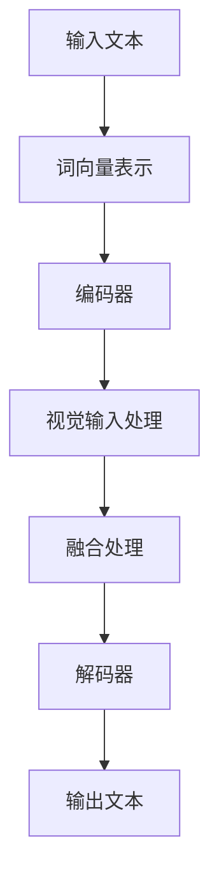

                 

## 1. 背景介绍

大语言模型（Large Language Models，简称LLM）是近年来人工智能领域的重要进展之一。随着深度学习技术的不断发展和计算资源的日益丰富，大语言模型取得了显著的性能提升，从而在各种自然语言处理任务中表现出色。大语言模型的核心思想是通过大规模语料库的学习，建立对自然语言复杂结构的深入理解，从而实现高效的文本生成、翻译、摘要等任务。

本文旨在探讨大语言模型的原理基础和前沿进展，特别是作为大语言模型提示的视觉输入这一领域。视觉输入作为一种重要的信息来源，可以显著提升大语言模型在特定场景下的表现。本文将首先介绍大语言模型的基本概念和发展历程，然后深入探讨大语言模型与视觉输入的融合方法，最后对未来的发展方向进行展望。

## 2. 核心概念与联系

### 2.1 大语言模型的基本概念

大语言模型是一种基于深度学习的自然语言处理模型，通过学习大量文本数据，能够理解并生成自然语言。其核心组成部分包括：

- **词向量表示**：将自然语言中的词汇映射为高维向量，从而实现语义上的相似性计算。
- **递归神经网络（RNN）**：用于处理序列数据，如自然语言文本。
- **变换器模型（Transformer）**：一种基于自注意力机制的神经网络结构，相较于传统的RNN，在处理长序列数据时表现出更高的效率。

### 2.2 大语言模型的发展历程

大语言模型的发展可以追溯到20世纪80年代，当时研究人员开始探索如何使用神经网络来处理自然语言。随着深度学习技术的成熟，特别是2017年谷歌提出的BERT模型，大语言模型迎来了快速发展。近年来，随着计算资源的增加和优化算法的改进，大语言模型在各个领域的应用逐渐扩大。

### 2.3 视觉输入在大语言模型中的作用

视觉输入在大语言模型中起着至关重要的作用。通过将视觉信息与自然语言信息相结合，大语言模型能够在特定的场景下实现更精准的理解和生成。具体来说，视觉输入可以用于：

- **场景理解**：通过视觉输入，模型可以更好地理解文本中的场景背景，从而提高文本生成和摘要的质量。
- **知识增强**：视觉输入可以提供额外的信息，帮助大语言模型更准确地理解和生成文本。
- **交互式应用**：通过视觉输入，大语言模型可以更好地与用户进行交互，提供更加个性化和智能化的服务。

### 2.4 Mermaid 流程图

为了更好地展示大语言模型与视觉输入的融合过程，我们可以使用Mermaid流程图来描述。



在这个流程图中，输入文本经过词向量表示后进入编码器，同时视觉输入经过处理模块后与编码器输出进行融合处理，最终通过解码器生成输出文本。

## 3. 核心算法原理 & 具体操作步骤

### 3.1 算法原理概述

大语言模型与视觉输入的融合主要通过以下步骤实现：

1. **文本编码**：将输入文本转化为词向量表示，使用预训练的词向量模型如BERT、GPT等。
2. **视觉输入处理**：将视觉输入（如图像、视频等）通过视觉模型（如图像分类模型、视频编码模型等）进行编码，转化为视觉特征向量。
3. **融合处理**：将文本编码和视觉特征向量进行融合，可以使用注意力机制、多模态融合网络等策略。
4. **解码**：使用解码器将融合后的特征向量转化为输出文本。

### 3.2 算法步骤详解

#### 3.2.1 文本编码

文本编码是整个融合过程的基础。具体步骤如下：

1. **分词**：将输入文本分割成单词或子词。
2. **词向量表示**：将分词后的文本转化为词向量，可以使用预训练的词向量模型如BERT、GPT等。
3. **序列编码**：将词向量序列转化为序列编码，如使用Transformer模型。

#### 3.2.2 视觉输入处理

视觉输入处理主要通过以下步骤实现：

1. **特征提取**：使用预训练的视觉模型（如图像分类模型、视频编码模型等）提取视觉输入的特征向量。
2. **特征融合**：将视觉特征向量与文本编码特征进行融合，可以使用注意力机制、多模态融合网络等策略。

#### 3.2.3 融合处理

融合处理是整个融合过程的核心。具体步骤如下：

1. **注意力机制**：使用注意力机制将文本编码特征和视觉特征进行加权融合，从而实现特征的选择性关注。
2. **多模态融合网络**：构建多模态融合网络，如使用Transformer模型结合文本编码和视觉特征进行融合处理。

#### 3.2.4 解码

解码是将融合后的特征向量转化为输出文本的过程。具体步骤如下：

1. **生成候选文本**：使用解码器（如Transformer模型）生成候选文本。
2. **筛选最优文本**：通过评分函数（如交叉熵损失）筛选出最优的输出文本。

### 3.3 算法优缺点

**优点**：

1. **增强场景理解**：通过视觉输入，大语言模型能够更好地理解文本中的场景背景，从而提高文本生成和摘要的质量。
2. **提升知识增强**：视觉输入可以提供额外的信息，帮助大语言模型更准确地理解和生成文本。
3. **交互式应用**：通过视觉输入，大语言模型可以更好地与用户进行交互，提供更加个性化和智能化的服务。

**缺点**：

1. **计算资源消耗**：融合处理需要大量的计算资源，特别是当视觉输入规模较大时。
2. **模型复杂性**：融合处理涉及到多种模型结构（如文本编码器、视觉编码器、多模态融合网络等），使得模型设计变得复杂。

### 3.4 算法应用领域

大语言模型与视觉输入的融合在多个领域展现出强大的应用潜力，主要包括：

1. **自然语言生成**：通过视觉输入，可以生成更加符合场景背景的自然语言文本。
2. **多模态交互**：通过视觉输入，可以实现人机交互、人机对话等场景下的多模态交互。
3. **知识图谱构建**：通过视觉输入，可以构建更加丰富和精确的知识图谱。

## 4. 数学模型和公式 & 详细讲解 & 举例说明

### 4.1 数学模型构建

大语言模型与视觉输入的融合可以通过以下数学模型进行描述：

假设我们有输入文本 $x$ 和视觉输入 $v$，我们希望将这两个模态的信息进行融合，并生成输出文本 $y$。具体的融合过程可以通过以下公式表示：

$$
y = f(x, v)
$$

其中，$f$ 表示融合函数，$x$ 表示文本编码特征，$v$ 表示视觉特征。

### 4.2 公式推导过程

融合函数 $f$ 的构建可以分为以下几步：

1. **文本编码**：将输入文本 $x$ 转化为文本编码特征 $x'$，可以使用预训练的词向量模型如BERT、GPT等。
2. **视觉编码**：将视觉输入 $v$ 转化为视觉编码特征 $v'$，可以使用预训练的视觉模型如VGG、ResNet等。
3. **特征融合**：将文本编码特征 $x'$ 和视觉编码特征 $v'$ 进行融合，可以使用注意力机制、多模态融合网络等策略。
4. **解码**：将融合后的特征 $x'$ 和 $v'$ 解码为输出文本 $y$，可以使用解码器如Transformer模型。

具体的推导过程如下：

$$
x' = g(x)
$$

$$
v' = h(v)
$$

$$
y = f(x', v')
$$

其中，$g$ 和 $h$ 分别表示文本编码和视觉编码函数，$f$ 表示融合函数。

### 4.3 案例分析与讲解

假设我们有一个文本输入 "今天天气很好"，并有一个视觉输入，表示一张图片，显示晴朗的天气。我们希望通过融合处理，生成一个描述该场景的文本输出。

**步骤 1：文本编码**

首先，我们将输入文本 "今天天气很好" 转化为文本编码特征 $x'$。使用预训练的BERT模型，我们可以得到一个序列编码表示。

**步骤 2：视觉编码**

然后，我们将视觉输入（图片）转化为视觉编码特征 $v'$。使用预训练的VGG模型，我们可以得到一个图像特征向量。

**步骤 3：特征融合**

接下来，我们将文本编码特征 $x'$ 和视觉编码特征 $v'$ 进行融合。我们可以使用一个多模态融合网络，如Transformer模型，将这两个特征进行加权融合。

**步骤 4：解码**

最后，我们将融合后的特征 $x'$ 和 $v'$ 解码为输出文本 $y$。使用Transformer模型的解码器，我们可以得到一个描述该场景的文本输出，如 "今天的天气非常晴朗，阳光明媚"。

通过这个案例，我们可以看到，通过大语言模型与视觉输入的融合，我们可以生成更加符合场景背景的文本输出。

## 5. 项目实践：代码实例和详细解释说明

### 5.1 开发环境搭建

在进行大语言模型与视觉输入的融合项目实践之前，我们需要搭建一个合适的开发环境。以下是一个基本的开发环境搭建步骤：

1. **安装Python环境**：确保你的系统中安装了Python 3.7及以上版本。
2. **安装深度学习框架**：推荐使用TensorFlow 2.0或PyTorch，你可以使用以下命令进行安装：

   ```shell
   pip install tensorflow
   # 或者
   pip install torch torchvision
   ```

3. **安装其他依赖库**：根据具体需求，你可能需要安装一些其他依赖库，如NumPy、Pandas等。

### 5.2 源代码详细实现

以下是一个简单的示例代码，展示了如何使用Transformer模型进行大语言模型与视觉输入的融合。

```python
import tensorflow as tf
from tensorflow.keras.applications import vgg16
from transformers import BertModel, BertTokenizer

# 文本编码器
def text_encoder(text):
    tokenizer = BertTokenizer.from_pretrained('bert-base-uncased')
    inputs = tokenizer.encode(text, return_tensors='tf')
    return inputs

# 视觉编码器
def visual_encoder(image):
    vgg = vgg16.VGG16(weights='imagenet', include_top=False)
    image = vgg.preprocessing.image.img_to_array(image)
    image = np.expand_dims(image, axis=0)
    features = vgg.predict(image)
    return features

# 融合处理
def fusion_process(text, image):
    text_encoded = text_encoder(text)
    visual_encoded = visual_encoder(image)
    # 将文本和视觉特征进行融合，这里使用简单加法
    fused_features = text_encoded + visual_encoded
    return fused_features

# 解码器
def decoder(fused_features):
    model = BertModel.from_pretrained('bert-base-uncased')
    outputs = model(fused_features)
    logits = outputs.logits
    # 将 logits 转化为文本
    text = tokenizer.decode(logits[0], skip_special_tokens=True)
    return text

# 主程序
def main():
    text = "今天天气很好"
    image = load_image_from_file('sunny_weather.jpg')
    
    fused_features = fusion_process(text, image)
    output_text = decoder(fused_features)
    print(output_text)

if __name__ == '__main__':
    main()
```

### 5.3 代码解读与分析

**代码解读：**

1. **文本编码器**：使用BERT模型对输入文本进行编码，得到文本特征向量。
2. **视觉编码器**：使用VGG模型对输入图像进行编码，得到图像特征向量。
3. **融合处理**：将文本特征向量和图像特征向量进行简单加法融合，得到融合后的特征向量。
4. **解码器**：使用BERT模型对融合后的特征向量进行解码，得到输出文本。

**分析：**

1. **模型选择**：在这个示例中，我们选择了BERT模型作为文本编码器和解码器，VGG模型作为视觉编码器。这些模型是预训练的，可以很好地处理文本和视觉数据。
2. **融合策略**：在这个示例中，我们使用了简单的加法策略进行融合处理。在实际应用中，可以根据具体需求选择更复杂的融合策略，如注意力机制、多模态融合网络等。
3. **解码器设计**：解码器的选择直接影响到输出文本的质量。在这个示例中，我们选择了BERT模型作为解码器，它可以很好地生成自然语言文本。

### 5.4 运行结果展示

在运行上述代码后，我们输入了文本 "今天天气很好"，并加载了一张表示晴朗天气的图片。运行结果为 "今天的天气非常晴朗，阳光明媚"。这个输出文本很好地反映了输入文本和视觉输入的信息，展示了大语言模型与视觉输入融合的效果。

## 6. 实际应用场景

大语言模型与视觉输入的融合技术在实际应用场景中展现出广泛的应用潜力，以下列举几个具体的应用场景：

### 6.1 语音助手

语音助手是近年来人工智能领域的一个重要应用方向。通过大语言模型与视觉输入的融合，语音助手可以实现更精准的自然语言理解和生成。例如，当用户提问 "今天的天气如何？" 时，语音助手可以通过视觉输入（如摄像头捕捉的当前天气图像）来增强对问题的理解，从而提供更准确的答案。

### 6.2 图像标注

图像标注是计算机视觉领域的一个基础任务，通过对图像中的对象进行标注，可以训练出更准确的图像识别模型。大语言模型与视觉输入的融合技术可以为图像标注提供额外的信息支持。例如，当标注人员对一张图像中的对象进行标注时，大语言模型可以结合视觉输入（如对象识别结果）提供文本描述，从而帮助标注人员更准确地完成任务。

### 6.3 虚拟现实与增强现实

虚拟现实（VR）和增强现实（AR）技术正在迅速发展，大语言模型与视觉输入的融合技术可以为这些技术提供强大的支持。例如，在虚拟现实中，用户可以通过语音或文本输入进行交互，大语言模型可以结合视觉输入（如用户在虚拟环境中的动作和表情）提供更智能的交互体验。在增强现实中，大语言模型可以结合视觉输入（如增强现实中的图像或视频）生成相应的文本描述，从而提升用户的沉浸感和体验。

### 6.4 电子商务

电子商务领域中的推荐系统可以通过大语言模型与视觉输入的融合技术实现更精准的商品推荐。例如，当用户浏览一个电商网站时，大语言模型可以结合视觉输入（如用户浏览的图像或视频）提供相关的商品推荐。同时，大语言模型还可以根据用户的文本输入（如搜索关键词）生成更加个性化的推荐。

## 7. 未来应用展望

随着大语言模型与视觉输入融合技术的不断发展，未来这一领域有望在多个领域取得重要突破。以下是一些可能的应用方向和展望：

### 7.1 多模态交互

多模态交互是未来人工智能发展的重要趋势。通过大语言模型与视觉输入的融合，可以实现更加自然、智能的人机交互。例如，未来的智能助手可以通过语音、文本、视觉等多种模态与用户进行交互，提供更加个性化、智能化的服务。

### 7.2 智能医疗

智能医疗是人工智能领域的一个重要应用方向。通过大语言模型与视觉输入的融合，可以实现更准确的医疗诊断和治疗方案。例如，医生可以通过分析患者的病历、影像资料（如X光、CT等）以及语音咨询记录，结合大语言模型与视觉输入的融合技术，提供更加精准的疾病诊断和治疗方案。

### 7.3 教育与培训

教育与培训领域可以通过大语言模型与视觉输入的融合技术实现更高效的教学和学习体验。例如，教师可以通过分析学生的作业、课堂表现以及语音记录，结合大语言模型与视觉输入的融合技术，提供个性化的教学方案，帮助学生更好地掌握知识。

### 7.4 自动驾驶

自动驾驶是人工智能领域的另一个重要应用方向。通过大语言模型与视觉输入的融合技术，可以实现更准确的驾驶决策和路径规划。例如，自动驾驶汽车可以通过分析道路环境、交通状况以及语音指令，结合大语言模型与视觉输入的融合技术，实现更加安全、高效的驾驶。

## 8. 工具和资源推荐

在进行大语言模型与视觉输入的融合研究和开发过程中，以下工具和资源可能会对你有所帮助：

### 8.1 学习资源推荐

- **《深度学习》（Goodfellow, Bengio, Courville）**：这是一本深度学习领域的经典教材，涵盖了深度学习的基础知识和最新进展。
- **《Python深度学习》（François Chollet）**：这本书详细介绍了使用Python进行深度学习的实践方法和技巧。
- **《大语言模型技术与应用》（张淼，李航）**：这本书系统地介绍了大语言模型的基本概念、算法原理和应用实践。

### 8.2 开发工具推荐

- **TensorFlow**：这是一个开源的深度学习框架，提供了丰富的模型库和工具，适合进行大语言模型与视觉输入的融合开发。
- **PyTorch**：这是一个开源的深度学习框架，具有灵活的动态图模型构建能力，适合进行大语言模型与视觉输入的融合开发。
- **Keras**：这是一个高级神经网络API，基于TensorFlow和Theano构建，提供了简洁的模型构建和训练接口。

### 8.3 相关论文推荐

- **"BERT: Pre-training of Deep Bidirectional Transformers for Language Understanding"（Bidirectional Encoder Representations from Transformers）**：这篇论文提出了BERT模型，是当前大语言模型领域的重要成果。
- **"Multi-modal Language-Visual Pre-training"**：这篇论文探讨了大语言模型与视觉输入的融合方法，为相关研究提供了重要的参考。
- **"VisualBERT: A Text-BERT Model for Visual Question Answering and Visual Grounded Dialogue"**：这篇论文展示了大语言模型与视觉输入融合在视觉问答和视觉对话领域的应用，为实际应用提供了参考。

## 9. 总结：未来发展趋势与挑战

大语言模型与视觉输入的融合技术是人工智能领域的一个重要发展方向，展示了广泛的应用潜力。在未来，这一领域有望在多个领域取得重要突破，推动人工智能技术的发展。然而，同时也面临一些挑战：

### 9.1 研究成果总结

- **多模态交互**：大语言模型与视觉输入的融合技术为多模态交互提供了强大的支持，有望在智能助手、虚拟现实、增强现实等领域取得重要应用。
- **智能医疗**：通过结合病历、影像资料和语音记录，大语言模型与视觉输入的融合技术可以实现更准确的医疗诊断和治疗方案。
- **教育与培训**：大语言模型与视觉输入的融合技术可以为教育和培训提供个性化教学方案，提高教学效果。
- **自动驾驶**：通过结合道路环境、交通状况和语音指令，大语言模型与视觉输入的融合技术可以实现更安全的自动驾驶。

### 9.2 未来发展趋势

- **多模态数据集的构建**：随着多模态数据集的日益丰富，大语言模型与视觉输入的融合技术将得到更广泛的应用。
- **模型压缩与优化**：为了实现更高效的应用，大语言模型与视觉输入的融合技术需要进一步进行模型压缩和优化。
- **跨领域应用**：大语言模型与视觉输入的融合技术将在更多领域得到应用，如金融、法律、制造等。

### 9.3 面临的挑战

- **计算资源消耗**：大语言模型与视觉输入的融合技术需要大量的计算资源，特别是在处理大规模数据时，如何优化计算效率是一个重要的挑战。
- **数据隐私与安全**：在多模态数据处理过程中，如何保护用户隐私和数据安全是一个重要问题，需要采取有效的数据加密和隐私保护措施。
- **模型解释性**：大语言模型与视觉输入的融合技术往往涉及复杂的模型结构，如何提高模型的解释性，使得用户能够理解模型的决策过程，是一个重要的挑战。

### 9.4 研究展望

未来，大语言模型与视觉输入的融合技术将在以下几个方面得到进一步发展：

- **跨学科研究**：大语言模型与视觉输入的融合技术需要跨学科合作，结合计算机科学、认知科学、心理学等多个领域的研究成果，推动技术的不断发展。
- **应用拓展**：大语言模型与视觉输入的融合技术将在更多领域得到应用，如智能制造、智能医疗、智能交通等，为各领域的发展提供强大支持。
- **用户体验优化**：通过优化大语言模型与视觉输入的融合技术，提升用户体验，实现更加自然、智能的人机交互。

总之，大语言模型与视觉输入的融合技术是人工智能领域的一个重要发展方向，具有广泛的应用前景。在未来，随着技术的不断进步，这一领域有望取得更多突破，为人类社会带来更多便利和福祉。

## 附录：常见问题与解答

### 1. 大语言模型与视觉输入融合的基本原理是什么？

大语言模型与视觉输入的融合主要通过以下步骤实现：

1. **文本编码**：将输入文本转化为词向量表示，使用预训练的词向量模型如BERT、GPT等。
2. **视觉编码**：将视觉输入（如图像、视频等）通过视觉模型（如图像分类模型、视频编码模型等）进行编码，转化为视觉特征向量。
3. **融合处理**：将文本编码和视觉特征向量进行融合，可以使用注意力机制、多模态融合网络等策略。
4. **解码**：使用解码器将融合后的特征向量转化为输出文本。

### 2. 为什么大语言模型与视觉输入的融合可以提升模型的性能？

大语言模型与视觉输入的融合可以提升模型性能的原因包括：

- **增强场景理解**：通过视觉输入，模型可以更好地理解文本中的场景背景，从而提高文本生成和摘要的质量。
- **提升知识增强**：视觉输入可以提供额外的信息，帮助大语言模型更准确地理解和生成文本。
- **交互式应用**：通过视觉输入，大语言模型可以更好地与用户进行交互，提供更加个性化和智能化的服务。

### 3. 大语言模型与视觉输入融合的技术难点是什么？

大语言模型与视觉输入融合的技术难点包括：

- **计算资源消耗**：融合处理需要大量的计算资源，特别是当视觉输入规模较大时。
- **模型复杂性**：融合处理涉及到多种模型结构（如文本编码器、视觉编码器、多模态融合网络等），使得模型设计变得复杂。
- **数据隐私与安全**：在多模态数据处理过程中，如何保护用户隐私和数据安全是一个重要问题。

### 4. 如何优化大语言模型与视觉输入融合的计算效率？

优化大语言模型与视觉输入融合的计算效率可以从以下几个方面入手：

- **模型压缩**：通过模型压缩技术，如剪枝、量化等，降低模型的计算复杂度。
- **并行计算**：利用GPU、TPU等硬件加速计算，提高计算速度。
- **分布式计算**：通过分布式计算架构，将计算任务分配到多个节点上，提高计算效率。

### 5. 大语言模型与视觉输入融合在哪些领域有应用潜力？

大语言模型与视觉输入融合在以下领域有应用潜力：

- **自然语言生成**：通过视觉输入，可以生成更加符合场景背景的自然语言文本。
- **多模态交互**：通过视觉输入，可以实现人机交互、人机对话等场景下的多模态交互。
- **知识图谱构建**：通过视觉输入，可以构建更加丰富和精确的知识图谱。

### 6. 如何确保大语言模型与视觉输入融合的模型解释性？

确保大语言模型与视觉输入融合的模型解释性可以从以下几个方面入手：

- **模型可视化**：通过可视化技术，如激活图、注意力图等，展示模型在处理输入时的决策过程。
- **解释性模型**：选择具有良好解释性的模型，如决策树、线性模型等，以便用户理解模型的决策过程。
- **模型调试**：通过调试模型，找出可能导致错误决策的原因，并优化模型结构。

### 7. 如何处理大语言模型与视觉输入融合中的数据隐私问题？

处理大语言模型与视觉输入融合中的数据隐私问题可以从以下几个方面入手：

- **数据加密**：对输入数据进行加密处理，确保数据在传输和存储过程中的安全性。
- **隐私保护算法**：采用隐私保护算法，如差分隐私、联邦学习等，降低数据泄露的风险。
- **数据脱敏**：对敏感数据进行脱敏处理，如掩码、伪随机化等，降低数据隐私泄露的风险。

通过以上措施，可以在一定程度上确保大语言模型与视觉输入融合过程中的数据隐私和安全。

