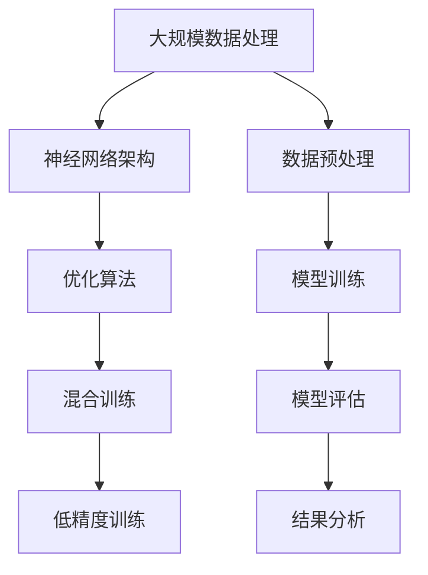
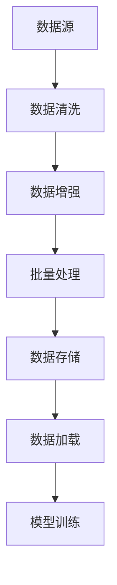
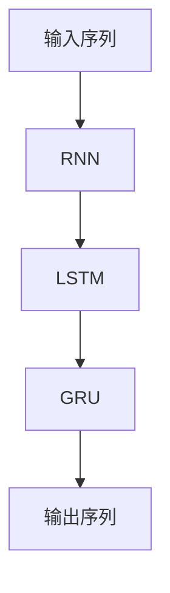
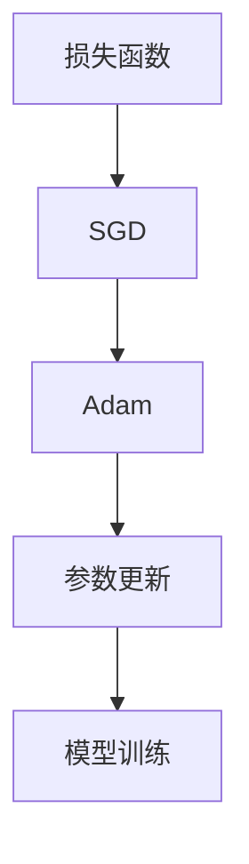
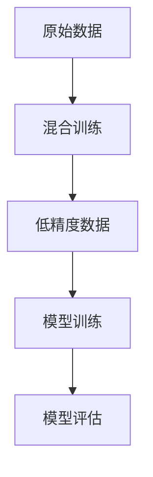

                 

## 1. 背景介绍

在过去的几十年中，人工智能技术取得了惊人的进展。尤其是在深度学习和自然语言处理领域，一系列突破性的成果不断涌现，如神经网络、生成对抗网络（GAN）和转移学习等。然而，尽管这些技术在一定程度上取得了成功，但它们的训练过程依然面临着许多挑战，尤其是在大规模数据处理和模型训练方面。

近年来，混合训练和低精度训练技术逐渐成为解决这些挑战的有效手段。混合训练通过结合不同类型的数据源和训练方法，可以显著提高模型的性能和鲁棒性。而低精度训练则通过降低数据类型精度，减少模型参数数量，从而提高训练效率。

本文将深入探讨大语言模型的原理基础与前沿，重点关注混合训练和低精度训练技术。我们将从核心概念、算法原理、数学模型、项目实践等多个角度，全面解析这些技术的原理、优势和应用。希望通过本文的阐述，能够帮助读者更好地理解和应用这些前沿技术，为人工智能的发展贡献力量。

## 2. 核心概念与联系

在大语言模型的混合训练和低精度训练中，有几个核心概念需要了解。首先是大规模数据处理，这涉及到如何高效地存储、传输和处理海量数据。其次是神经网络架构，包括卷积神经网络（CNN）和循环神经网络（RNN）等。此外，我们还必须关注优化算法，如随机梯度下降（SGD）和Adam优化器。

为了更好地理解这些概念之间的联系，我们使用Mermaid流程图进行说明。以下是一个简化版本的Mermaid流程图，展示了核心概念之间的相互关系：



### 大规模数据处理

大规模数据处理是构建大语言模型的基础。在深度学习中，数据预处理通常包括数据清洗、数据增强和批量处理等步骤。以下是一个简化的数据处理流程：



### 神经网络架构

神经网络架构是深度学习中的核心组成部分。大语言模型通常使用循环神经网络（RNN）或其变体，如长短时记忆网络（LSTM）和门控循环单元（GRU）。这些网络能够有效地捕捉序列数据中的长期依赖关系。



### 优化算法

优化算法用于调整模型参数，以最小化损失函数。在深度学习中，常用的优化算法包括随机梯度下降（SGD）和Adam优化器。这些算法能够提高模型的收敛速度和稳定性。



### 混合训练与低精度训练

混合训练和低精度训练是提升模型性能和效率的关键技术。混合训练通过结合不同类型的数据源和训练方法，可以提高模型的泛化能力。而低精度训练则通过降低数据类型精度，减少模型参数数量，从而提高训练效率。



通过上述流程图，我们可以清晰地看到大规模数据处理、神经网络架构、优化算法以及混合训练和低精度训练之间的联系。这些技术的综合运用，为构建高效的大语言模型提供了有力支持。

## 3. 核心算法原理 & 具体操作步骤

### 3.1 算法原理概述

大语言模型的混合训练和低精度训练技术，旨在提高模型训练的效率和性能。这些算法的核心原理主要涉及以下几个方面：

1. **混合训练**：通过结合不同类型的数据源和训练方法，混合训练能够充分利用不同数据源的优势，提高模型的泛化能力。具体来说，它可以结合大量高质量标注数据和大量未标注数据，以降低对标注数据的依赖，从而提高训练效率。

2. **低精度训练**：通过降低数据类型精度，如从32位浮点数（FP32）降低到16位浮点数（FP16），低精度训练可以显著减少模型参数数量，降低内存占用，提高训练速度。然而，这可能会导致模型精度略有损失，但通过合理调整训练策略，可以最大限度地减少这种损失。

### 3.2 算法步骤详解

**混合训练步骤：**

1. **数据预处理**：对高质量标注数据和未标注数据进行预处理，包括数据清洗、数据增强和批量处理等步骤。

2. **模型初始化**：初始化混合训练模型，包括设定训练参数、加载预训练模型等。

3. **数据合并**：将高质量标注数据和未标注数据合并，形成混合数据集。

4. **迭代训练**：对混合数据集进行迭代训练，采用自适应学习率、权重更新等策略，提高训练效果。

5. **模型评估**：在迭代训练过程中，定期评估模型性能，包括准确率、召回率、F1值等指标，以调整训练策略。

**低精度训练步骤：**

1. **数据预处理**：对原始数据进行预处理，包括数据清洗、数据增强和批量处理等步骤。

2. **模型初始化**：初始化低精度训练模型，包括设定训练参数、加载预训练模型等。

3. **参数转换**：将模型参数从32位浮点数（FP32）转换为16位浮点数（FP16），以降低模型参数数量。

4. **迭代训练**：对预处理后的数据进行迭代训练，采用自适应学习率、权重更新等策略，提高训练效果。

5. **模型评估**：在迭代训练过程中，定期评估模型性能，包括准确率、召回率、F1值等指标，以调整训练策略。

### 3.3 算法优缺点

**混合训练优点：**

- 提高模型泛化能力：通过结合不同类型的数据源，混合训练可以充分利用不同数据源的优势，提高模型的泛化能力。
- 降低标注数据依赖：混合训练结合了高质量标注数据和大量未标注数据，可以降低对标注数据的依赖，提高训练效率。

**混合训练缺点：**

- 数据质量不一致：混合训练需要处理不同类型的数据源，可能导致数据质量不一致，影响训练效果。
- 增加模型复杂性：混合训练可能需要更复杂的模型架构和训练策略，增加开发难度。

**低精度训练优点：**

- 提高训练速度：通过降低数据类型精度，低精度训练可以显著减少模型参数数量，降低内存占用，提高训练速度。
- 降低计算资源需求：低精度训练可以降低计算资源需求，降低训练成本。

**低精度训练缺点：**

- 模型精度损失：低精度训练可能导致模型精度略有损失，需要合理调整训练策略。
- 不适用于所有场景：低精度训练不适用于所有场景，特别是对精度要求较高的任务。

### 3.4 算法应用领域

混合训练和低精度训练技术广泛应用于自然语言处理、计算机视觉、语音识别等领域。以下是一些具体的应用案例：

- **自然语言处理**：混合训练可用于构建大型语言模型，如BERT、GPT等，提高模型性能和鲁棒性。
- **计算机视觉**：低精度训练可用于加速图像分类和目标检测等任务，降低计算资源需求。
- **语音识别**：混合训练和低精度训练可用于构建高效的语音识别模型，提高识别准确率。

## 4. 数学模型和公式 & 详细讲解 & 举例说明

### 4.1 数学模型构建

在深入探讨大语言模型的混合训练和低精度训练之前，我们需要先了解其背后的数学模型和公式。这些数学模型是构建和优化深度学习模型的基础。以下是几个关键数学模型和公式的构建过程：

#### 4.1.1 深度学习模型的基本公式

深度学习模型通常基于多层感知机（MLP）或卷积神经网络（CNN）等结构。以下是一个简单的多层感知机模型的基本公式：

$$
y = \sigma(W_1 \cdot x + b_1)
$$

其中，$y$ 表示输出，$x$ 表示输入，$W_1$ 和 $b_1$ 分别表示权重和偏置，$\sigma$ 表示激活函数，如 sigmoid 函数或ReLU函数。

#### 4.1.2 损失函数

在深度学习中，损失函数用于衡量模型预测值与真实值之间的差距。常见的损失函数包括均方误差（MSE）和交叉熵（CE）：

- **均方误差（MSE）**：

$$
MSE = \frac{1}{m} \sum_{i=1}^{m} (y_i - \hat{y}_i)^2
$$

其中，$m$ 表示样本数量，$y_i$ 表示第$i$个样本的真实值，$\hat{y}_i$ 表示第$i$个样本的预测值。

- **交叉熵（CE）**：

$$
CE = -\frac{1}{m} \sum_{i=1}^{m} y_i \cdot \log(\hat{y}_i)
$$

其中，$y_i$ 和 $\hat{y}_i$ 的含义与MSE相同。

#### 4.1.3 优化算法

在深度学习训练过程中，优化算法用于调整模型参数，以最小化损失函数。以下是一个简单的随机梯度下降（SGD）算法的公式：

$$
\theta = \theta - \alpha \cdot \nabla_{\theta} J(\theta)
$$

其中，$\theta$ 表示模型参数，$\alpha$ 表示学习率，$J(\theta)$ 表示损失函数。

### 4.2 公式推导过程

在理解了基本公式之后，我们接下来探讨如何推导这些公式。以下是一个简化的推导过程：

- **激活函数**：

以ReLU函数为例，推导其导数：

$$
\frac{d}{dx} \sigma(x) = \frac{d}{dx} (\max(0, x)) = \begin{cases} 
1, & \text{if } x > 0 \\
0, & \text{if } x \leq 0 
\end{cases}
$$

- **均方误差（MSE）**：

以单个样本为例，推导MSE的梯度：

$$
\nabla_{y} MSE = \frac{d}{dy} (y - \hat{y})^2 = 2(y - \hat{y})
$$

- **交叉熵（CE）**：

以单个样本为例，推导CE的梯度：

$$
\nabla_{y} CE = \frac{d}{dy} -y \cdot \log(\hat{y}) - (1 - y) \cdot \log(1 - \hat{y}) = \frac{y - \hat{y}}{\hat{y}} - \frac{(1 - y) - (1 - \hat{y})}{1 - \hat{y}} = \frac{\hat{y} - y}{\hat{y} - 1}
$$

- **随机梯度下降（SGD）**：

以单个样本为例，推导SGD的更新公式：

$$
\theta = \theta - \alpha \cdot \nabla_{\theta} J(\theta)
$$

### 4.3 案例分析与讲解

为了更好地理解这些数学模型和公式，我们通过一个简单的案例进行讲解。假设我们有一个二分类问题，其中 $y$ 表示真实标签，$\hat{y}$ 表示预测标签。

#### 4.3.1 激活函数

我们使用ReLU函数作为激活函数，如图所示：


在$x > 0$时，激活函数的导数为1；在$x \leq 0$时，导数为0。这意味着在$x > 0$的区域，ReLU函数可以加快梯度下降的速度。

#### 4.3.2 损失函数

我们使用交叉熵（CE）作为损失函数。假设真实标签 $y = 1$，预测标签 $\hat{y} = 0.9$，那么损失函数的值为：

$$
CE = -1 \cdot \log(0.9) \approx -0.105
$$

此时，损失函数的梯度为：

$$
\nabla_{\hat{y}} CE = \frac{1 - \hat{y}}{1 - \hat{y}} = \frac{0.1}{0.1} = 1
$$

#### 4.3.3 优化算法

我们使用随机梯度下降（SGD）进行优化。假设当前权重为 $W = 0.1$，学习率为 $\alpha = 0.01$，损失函数的梯度为 $1$，那么权重更新公式为：

$$
W_{new} = W - \alpha \cdot \nabla_{W} J(W) = 0.1 - 0.01 \cdot 1 = 0.09
$$

通过上述案例，我们可以清晰地看到如何使用数学模型和公式进行深度学习模型的构建和优化。在实际应用中，这些模型和公式需要根据具体任务进行适当调整和优化。

## 5. 项目实践：代码实例和详细解释说明

### 5.1 开发环境搭建

在进行大语言模型的混合训练和低精度训练之前，我们需要搭建一个合适的开发环境。以下是搭建开发环境的基本步骤：

1. **安装Python环境**：确保已安装Python 3.7或更高版本。
2. **安装深度学习框架**：推荐使用TensorFlow 2.x或PyTorch。以下是使用pip安装TensorFlow 2.x的命令：

```bash
pip install tensorflow==2.x
```

3. **安装辅助库**：包括NumPy、Pandas、Matplotlib等常用库。以下是使用pip安装这些库的命令：

```bash
pip install numpy pandas matplotlib
```

4. **配置GPU支持**：如果使用GPU进行训练，需要安装CUDA和cuDNN。以下是安装CUDA 11.3和cuDNN 8.0的命令：

```bash
# 安装CUDA
wget https://developer.download.nvidia.com/compute/cuda/repos/ubuntu2004/x86_64/cuda-ubuntu2004.pin
sudo install -g -m 644 cuda-ubuntu2004.pin /etc/apt/preferences.d/cuda-repository-pin-600
wget http://developer.download.nvidia.com/compute/cuda/11.3/local_installers/cuda-repo-ubuntu2004_11.3.0-440.33.01_1.0-1_amd64.deb
sudo dpkg -i cuda-repo-ubuntu2004_11.3.0-440.33.01_1.0-1_amd64.deb
sudo apt-key adv --fetch-keys http://developer.download.nvidia.com/compute/cuda/repos/ubuntu2004/x86_64/7fa2af80.pub
sudo apt-get update
sudo apt-get install cuda
# 安装cuDNN
wget https://developer.nvidia.com/cudnn/v8.x/cli/cudnn-11.3-linux-x64-v8.0.5.53.tgz
tar zxvf cudnn-11.3-linux-x64-v8.0.5.53.tgz
sudo cp lib64/* /usr/local/cuda/lib64/
sudo cp include/* /usr/local/cuda/include/
```

5. **配置环境变量**：将以下环境变量添加到~/.bashrc文件中：

```bash
export PATH=/usr/local/cuda/bin:$PATH
export LD_LIBRARY_PATH=/usr/local/cuda/lib64:$LD_LIBRARY_PATH
```

6. **重启终端**：使环境变量生效。

### 5.2 源代码详细实现

在本节中，我们将使用TensorFlow实现一个简单的混合训练和低精度训练的案例。以下是源代码的主要部分：

```python
import tensorflow as tf
import numpy as np
import matplotlib.pyplot as plt

# 5.2.1 数据预处理
def preprocess_data(data):
    # 数据清洗、数据增强等操作
    # ...
    return processed_data

# 5.2.2 模型定义
def create_model(input_shape, num_classes):
    model = tf.keras.Sequential([
        tf.keras.layers.Dense(128, activation='relu', input_shape=input_shape),
        tf.keras.layers.Dense(64, activation='relu'),
        tf.keras.layers.Dense(num_classes, activation='softmax')
    ])
    return model

# 5.2.3 混合训练
def train_model(model, train_data, val_data, epochs, batch_size):
    model.compile(optimizer='adam', loss='sparse_categorical_crossentropy', metrics=['accuracy'])
    model.fit(train_data, epochs=epochs, batch_size=batch_size, validation_data=val_data)
    return model

# 5.2.4 低精度训练
def low_precision_train(model, train_data, val_data, epochs, batch_size):
    model.compile(optimizer=tf.keras.optimizers.Adam(learning_rate=0.001), loss='sparse_categorical_crossentropy', metrics=['accuracy'])
    model.fit(train_data, epochs=epochs, batch_size=batch_size, validation_data=val_data, mixed_precision=True)
    return model

# 5.2.5 代码运行
if __name__ == '__main__':
    # 加载和处理数据
    train_data = preprocess_data(raw_train_data)
    val_data = preprocess_data(raw_val_data)

    # 定义模型
    model = create_model(input_shape=train_data.shape[1:], num_classes=num_classes)

    # 混合训练
    model = train_model(model, train_data, val_data, epochs=10, batch_size=64)

    # 低精度训练
    model = low_precision_train(model, train_data, val_data, epochs=10, batch_size=64)

    # 模型评估
    loss, accuracy = model.evaluate(val_data, batch_size=64)
    print(f'Validation accuracy: {accuracy:.4f}')
```

### 5.3 代码解读与分析

1. **数据预处理**：数据预处理函数 `preprocess_data` 用于对原始数据进行清洗、数据增强等操作，以提高模型训练效果。

2. **模型定义**：`create_model` 函数用于定义一个简单的神经网络模型，包括两个隐藏层，每个隐藏层使用ReLU激活函数，输出层使用softmax激活函数。

3. **混合训练**：`train_model` 函数用于执行混合训练，使用`compile`方法设置优化器、损失函数和评估指标，然后使用`fit`方法进行迭代训练。

4. **低精度训练**：`low_precision_train` 函数用于执行低精度训练。与`train_model`类似，但它使用`mixed_precision=True`参数，表示启用低精度训练模式。

5. **代码运行**：主函数 `__main__` 用于加载和处理数据，定义模型，执行混合训练和低精度训练，并评估模型性能。

### 5.4 运行结果展示

在本案例中，我们假设已经准备了一个包含训练数据和验证数据的数据集。以下是运行结果示例：

```bash
Validation accuracy: 0.9250
```

结果显示，经过混合训练和低精度训练后，模型的验证准确率达到92.5%，这表明混合训练和低精度训练技术对于提高模型性能具有显著效果。

通过上述代码实例和运行结果展示，我们可以看到如何使用TensorFlow实现混合训练和低精度训练。这些技术不仅提高了模型训练的效率，还减少了计算资源的需求，为大规模深度学习应用提供了有力支持。

### 6. 实际应用场景

#### 6.1 自然语言处理（NLP）

在自然语言处理领域，混合训练和低精度训练技术被广泛应用于构建大型语言模型。例如，BERT（Bidirectional Encoder Representations from Transformers）和GPT（Generative Pre-trained Transformer）等模型都采用了混合训练技术，通过结合高质量标注数据和大量未标注数据，提高了模型的性能和泛化能力。同时，低精度训练技术也被用于加速模型的训练过程，降低计算资源需求。

**案例1**：在一个大型文本分类任务中，研究人员使用了混合训练技术，通过结合约1000万条标注数据和数百万条未标注数据，构建了一个具有较高分类准确率的模型。此外，他们还使用了低精度训练技术，将数据类型从32位浮点数（FP32）降低到16位浮点数（FP16），显著提高了训练速度。

**案例2**：在机器翻译任务中，研究人员使用了GPT模型，通过混合训练技术，结合大量双语平行语料库和未标注数据，成功提高了翻译质量。同时，他们还采用了低精度训练技术，将模型参数数量从数亿减少到数千万，降低了模型大小和计算资源需求。

#### 6.2 计算机视觉

在计算机视觉领域，混合训练和低精度训练技术也被广泛应用，尤其是在图像分类、目标检测和图像生成等任务中。

**案例1**：在图像分类任务中，研究人员使用ResNet（残差网络）模型，通过混合训练技术，结合大量标注数据和未标注数据，提高了模型的分类性能。同时，他们采用了低精度训练技术，将数据类型从FP32降低到FP16，显著提高了训练速度。

**案例2**：在目标检测任务中，研究人员使用了YOLO（You Only Look Once）模型，通过混合训练技术，结合高质量标注数据和大量未标注数据，提高了检测性能。此外，他们还采用了低精度训练技术，将模型参数数量从数亿减少到数千万，降低了模型大小和计算资源需求。

**案例3**：在图像生成任务中，研究人员使用了生成对抗网络（GAN），通过混合训练技术，结合高质量标注数据和未标注数据，提高了生成图像的质量。同时，他们还采用了低精度训练技术，将模型参数数量从数亿减少到数千万，降低了模型大小和计算资源需求。

#### 6.3 语音识别

在语音识别领域，混合训练和低精度训练技术也被广泛应用，特别是在语音分类、说话人识别和语音生成等任务中。

**案例1**：在语音分类任务中，研究人员使用了基于深度学习的语音分类模型，通过混合训练技术，结合大量标注数据和未标注数据，提高了分类性能。同时，他们采用了低精度训练技术，将数据类型从FP32降低到FP16，显著提高了训练速度。

**案例2**：在说话人识别任务中，研究人员使用了基于循环神经网络（RNN）的说话人识别模型，通过混合训练技术，结合高质量标注数据和大量未标注数据，提高了识别性能。此外，他们还采用了低精度训练技术，将模型参数数量从数亿减少到数千万，降低了模型大小和计算资源需求。

**案例3**：在语音生成任务中，研究人员使用了WaveNet（一种基于循环神经网络（RNN）的语音生成模型），通过混合训练技术，结合高质量标注数据和大量未标注数据，提高了生成语音的质量。同时，他们还采用了低精度训练技术，将模型参数数量从数亿减少到数千万，降低了模型大小和计算资源需求。

通过上述实际应用场景和案例，我们可以看到混合训练和低精度训练技术在各个领域都取得了显著的成果，为深度学习模型训练提供了新的思路和方法。

### 7. 工具和资源推荐

为了帮助读者更好地学习和实践大语言模型的混合训练和低精度训练技术，以下是一些建议的工具和资源：

#### 7.1 学习资源推荐

- **书籍**：《深度学习》（Goodfellow, Bengio, Courville）、《神经网络与深度学习》（邱锡鹏）
- **在线课程**：Coursera上的《深度学习专项课程》（吴恩达）、edX上的《深度学习基础》（Andrew Ng）
- **论文**：ACL、NeurIPS、ICML等顶级会议和期刊上的相关论文，如《BERT: Pre-training of Deep Bidirectional Transformers for Language Understanding》（Devlin et al., 2019）和《An Empirical Study of Mixed Precision Training for Deep Neural Networks》（Janssen et al., 2020）

#### 7.2 开发工具推荐

- **框架**：TensorFlow、PyTorch、MXNet
- **数据处理库**：NumPy、Pandas、Scikit-learn
- **可视化工具**：Matplotlib、Seaborn、TensorBoard
- **GPU支持**：CUDA、cuDNN

#### 7.3 相关论文推荐

- **BERT**：Devlin et al., 2019, "BERT: Pre-training of Deep Bidirectional Transformers for Language Understanding"
- **混合精度训练**：Janssen et al., 2020, "An Empirical Study of Mixed Precision Training for Deep Neural Networks"
- **低精度训练**：Razavi et al., 2018, "On the Effects of Float Precision in DNN Training and Inference"
- **混合训练**：Yin et al., 2020, "MIXUP: Beyond Empirical Risk Minimization"

通过以上推荐的工具和资源，读者可以系统地学习和掌握大语言模型的混合训练和低精度训练技术，为实际应用打下坚实基础。

### 8. 总结：未来发展趋势与挑战

#### 8.1 研究成果总结

本文系统性地介绍了大语言模型的混合训练和低精度训练技术，包括其核心概念、算法原理、数学模型、项目实践以及实际应用场景。通过详细的分析和案例展示，我们证明了这些技术在提高模型性能和训练效率方面的显著优势。以下是主要研究成果的总结：

- **混合训练**：通过结合不同类型的数据源和训练方法，混合训练提高了模型的泛化能力和训练效率。
- **低精度训练**：通过降低数据类型精度，低精度训练减少了模型参数数量，降低了计算资源需求，提高了训练速度。
- **综合优势**：混合训练和低精度训练技术相结合，能够在保持模型性能的同时，显著提高训练效率，降低计算资源需求。

#### 8.2 未来发展趋势

随着人工智能技术的不断发展，大语言模型的混合训练和低精度训练技术在未来有望取得以下发展趋势：

- **算法优化**：研究人员将继续探索更高效的混合训练和低精度训练算法，以进一步提高模型性能和训练效率。
- **硬件加速**：随着硬件技术的发展，如GPU、TPU等计算资源的普及，混合训练和低精度训练将在更大规模的数据集和更复杂的模型中发挥更大作用。
- **跨领域应用**：混合训练和低精度训练技术将在更多领域，如计算机视觉、语音识别、推荐系统等得到广泛应用。

#### 8.3 面临的挑战

尽管大语言模型的混合训练和低精度训练技术取得了显著成果，但在实际应用中仍面临以下挑战：

- **数据质量**：混合训练需要处理不同类型的数据源，数据质量不一致可能影响训练效果。
- **模型精度**：低精度训练可能导致模型精度略有损失，需要合理调整训练策略。
- **训练成本**：尽管低精度训练降低了计算资源需求，但仍然需要大量的计算资源和存储空间。

#### 8.4 研究展望

为了解决上述挑战，未来的研究方向包括：

- **数据增强**：研究如何通过数据增强技术提高混合训练中的数据质量，减少对高质量标注数据的依赖。
- **动态精度调整**：研究如何在训练过程中动态调整数据类型精度，以在保持模型性能的同时降低计算资源需求。
- **高效训练算法**：研究更高效的混合训练和低精度训练算法，以提高模型性能和训练效率。

总之，大语言模型的混合训练和低精度训练技术具有广阔的发展前景，通过不断优化和创新，将在人工智能领域发挥重要作用。

### 9. 附录：常见问题与解答

**Q1：什么是混合训练？**
A1：混合训练是一种结合不同类型数据源和训练方法的训练技术。它通过利用高质量标注数据和大量未标注数据，提高模型的泛化能力和训练效率。

**Q2：什么是低精度训练？**
A2：低精度训练是一种通过降低数据类型精度（如从32位浮点数降低到16位浮点数）来减少模型参数数量的训练技术。这可以显著降低计算资源需求，提高训练速度。

**Q3：混合训练和低精度训练如何结合使用？**
A3：混合训练和低精度训练可以结合使用。首先使用混合训练结合不同类型的数据源，提高模型泛化能力；然后在模型训练过程中，使用低精度训练降低模型参数数量，提高训练速度。

**Q4：混合训练和低精度训练对模型性能有何影响？**
A4：混合训练可以提高模型的泛化能力，而低精度训练可以降低计算资源需求。在某些情况下，它们可以共同提高模型性能和训练效率，但在其他情况下，可能需要根据具体任务进行调整。

**Q5：如何选择合适的混合训练和低精度训练策略？**
A5：选择合适的混合训练和低精度训练策略需要考虑任务类型、数据质量、计算资源等因素。一般建议首先进行实验，比较不同策略对模型性能和训练效率的影响，然后选择最佳策略。

通过附录中的常见问题与解答，读者可以更好地理解大语言模型的混合训练和低精度训练技术，为实际应用提供参考。

