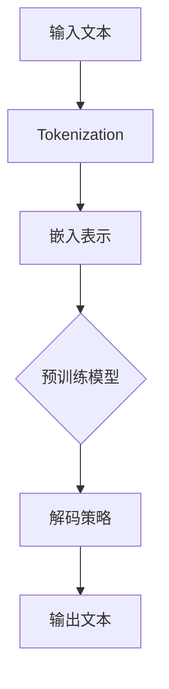

                 

关键词：大语言模型、预训练、解码策略、自然语言处理、机器学习、人工智能

摘要：本文深入探讨了大语言模型的原理基础与前沿发展，特别关注预训练目标和解码策略。通过系统性的阐述，本文旨在帮助读者理解大语言模型的核心概念、工作原理及其在实际应用中的重要角色。同时，本文还将对数学模型、算法原理进行详细讲解，并提供实际项目实践的代码实例和运行结果展示。通过本文的阅读，读者将能够对大语言模型有更全面和深入的认识。

## 1. 背景介绍

在过去的几十年中，自然语言处理（NLP）领域取得了显著的进展。特别是近年来，随着大数据和计算能力的提升，深度学习技术在NLP领域得到了广泛应用。大语言模型作为深度学习在NLP中的一个重要应用，已成为研究的热点。大语言模型通过大规模语料进行预训练，可以捕捉到语言中的复杂规律和语义信息，从而在文本生成、机器翻译、问答系统等多个任务中表现出色。

大语言模型的起源可以追溯到2018年，当OpenAI发布了GPT（Generative Pre-trained Transformer）系列模型，引发了NLP领域的革命。此后，谷歌的BERT（Bidirectional Encoder Representations from Transformers）和微软的T5（Text-to-Text Transfer Transformer）等模型相继出现，进一步推动了大语言模型的发展。

本文将围绕大语言模型的原理基础和前沿发展，特别是预训练目标和解码策略，进行深入探讨。通过本文的阅读，读者将能够全面了解大语言模型的构成、工作原理以及在实际应用中的优势和挑战。

## 2. 核心概念与联系

### 2.1. 语言模型

语言模型（Language Model）是NLP领域中的一个基础概念，它用于预测文本序列的概率。在深度学习框架下，语言模型通常采用神经网络来表示。最常见的是基于Transformer架构的大语言模型，如GPT、BERT和T5。

语言模型的输入是单词或子词（subword），输出是下一个单词或子词的概率分布。通过大量语料进行预训练，语言模型可以学习到语言的统计规律和语义信息。在微调（fine-tuning）阶段，语言模型可以根据特定任务进行进一步训练，以适应各种NLP任务。

### 2.2. 预训练

预训练（Pre-training）是指在大规模语料上进行模型训练，以学习到通用的语言特征。预训练后的模型可以在多种NLP任务上表现出色，无需针对每个任务从头开始训练。

预训练通常包括两个阶段：无监督预训练和有监督微调。无监督预训练利用未标记的语料，学习到通用的语言特征；有监督微调则使用标记的数据集，对模型进行针对性训练，以提高特定任务的表现。

### 2.3. 解码策略

解码策略（Decoding Strategy）是指在大语言模型生成文本时，如何从模型输出的概率分布中选择下一个单词或子词。常见的解码策略包括贪心策略、Beam Search和Sampling等。

贪心策略每次选择概率最高的单词或子词，简单但可能产生单调的文本；Beam Search通过维护一个候选词的优先级队列，选择概率最高的几个候选词进行下一步生成，可以产生更丰富的文本；Sampling则在每个时间步随机选择单词或子词，可以产生多样性和创造性。

### 2.4. Mermaid 流程图

以下是大语言模型的核心概念和架构的Mermaid流程图：



## 3. 核心算法原理 & 具体操作步骤

### 3.1. 算法原理概述

大语言模型的核心算法是基于Transformer架构的预训练和微调。Transformer模型由多个自注意力层（Self-Attention Layer）和前馈神经网络（Feedforward Neural Network）组成，可以捕捉到输入文本中的长距离依赖关系。

预训练阶段，模型在未标记的语料上进行训练，学习到通用的语言特征。常用的预训练任务包括语言建模（Language Modeling）和掩码语言模型（Masked Language Model）。

微调阶段，模型在有监督数据集上进行训练，针对特定任务进行调整。微调过程中，模型的结构通常保持不变，仅对权重进行更新。

### 3.2. 算法步骤详解

#### 3.2.1. 预训练阶段

1. **数据准备**：从互联网上收集大量未标记的文本数据，如新闻、博客、社交媒体等。

2. **Tokenization**：将文本数据分割成单词或子词。为了更好地捕捉语言特征，通常使用子词级别的Tokenization。

3. **嵌入表示**：将子词映射为向量表示。常用的嵌入方法包括Word2Vec、BERT中的WordPiece和GPT中的Subword Tokenization。

4. **构建Transformer模型**：构建一个包含多个自注意力层和前馈神经网络的Transformer模型。

5. **训练**：在未标记数据集上训练模型，优化模型的权重。常用的损失函数包括交叉熵损失和掩码语言模型的损失。

#### 3.2.2. 微调阶段

1. **数据准备**：收集与任务相关的标记数据集，如问答系统、机器翻译等。

2. **数据预处理**：对数据集进行预处理，包括Tokenization、嵌入表示等。

3. **模型微调**：在标记数据集上对预训练模型进行微调，优化模型的权重。

4. **评估与选择**：对微调后的模型进行评估，选择性能最佳的模型用于实际应用。

### 3.3. 算法优缺点

#### 优点

1. **强大的语言理解能力**：预训练模型可以学习到通用的语言特征，适用于多种NLP任务。

2. **高效率**：Transformer模型可以并行处理输入文本，训练效率高。

3. **灵活性**：通过微调，模型可以适应不同的任务和数据集。

#### 缺点

1. **计算资源需求大**：预训练模型需要大量的计算资源和时间。

2. **数据依赖性强**：模型的表现与数据集的质量和数量密切相关。

3. **调参复杂**：微调过程中需要调整大量的超参数，调参过程复杂。

### 3.4. 算法应用领域

大语言模型在多个NLP任务中表现出色，主要包括：

1. **文本生成**：如文章生成、对话系统等。

2. **机器翻译**：如英译中、中译英等。

3. **问答系统**：如搜索引擎、聊天机器人等。

4. **文本分类**：如新闻分类、情感分析等。

5. **文本摘要**：如文章摘要、会议摘要等。

## 4. 数学模型和公式 & 详细讲解 & 举例说明

### 4.1. 数学模型构建

大语言模型的数学模型主要基于Transformer架构。Transformer模型由多个自注意力层和前馈神经网络组成，其核心思想是利用自注意力机制捕捉输入文本中的长距离依赖关系。

自注意力机制可以通过以下公式表示：

$$
\text{Self-Attention}(Q, K, V) = \text{softmax}\left(\frac{QK^T}{\sqrt{d_k}}\right)V
$$

其中，$Q$、$K$ 和 $V$ 分别是查询（Query）、键（Key）和值（Value）向量，$d_k$ 是键向量的维度。自注意力机制将查询向量与所有键向量进行点积，然后通过softmax函数计算概率分布，最后与值向量相乘得到加权输出。

前馈神经网络则通过以下公式进行计算：

$$
\text{FFN}(x) = \text{ReLU}\left(\text{W}_{2}\text{ } \text{.} \text{ } \text{ } x \text{ + } \text{b}_{2}\right) \text{ + } \text{W}_{1}\text{ } \text{.} \text{ } x \text{ + } \text{b}_{1}
$$

其中，$x$ 是输入向量，$\text{W}_{1}$ 和 $\text{W}_{2}$ 是权重矩阵，$\text{b}_{1}$ 和 $\text{b}_{2}$ 是偏置项。

### 4.2. 公式推导过程

自注意力机制的推导过程如下：

1. **输入表示**：假设输入文本为 $x_1, x_2, \ldots, x_n$，每个输入表示为向量 $\textbf{x}_i \in \mathbb{R}^{d}$。

2. **嵌入表示**：将输入向量映射为查询（Query）、键（Key）和值（Value）向量。设 $\textbf{Q}, \textbf{K}, \textbf{V}$ 分别为查询、键和值矩阵，则有：

$$
\textbf{Q} = \text{W}_{Q}\textbf{X}, \textbf{K} = \text{W}_{K}\textbf{X}, \textbf{V} = \text{W}_{V}\textbf{X}
$$

其中，$\text{W}_{Q}, \text{W}_{K}, \text{W}_{V}$ 是权重矩阵。

3. **计算点积**：计算查询向量与键向量的点积，得到注意力权重：

$$
\text{Attention}(\textbf{Q}, \textbf{K}, \textbf{V}) = \text{softmax}\left(\frac{\textbf{QK}^T}{\sqrt{d_k}}\right)\textbf{V}
$$

4. **加权输出**：将注意力权重与值向量相乘，得到加权输出：

$$
\text{Output} = \text{softmax}\left(\frac{\textbf{QK}^T}{\sqrt{d_k}}\right)\textbf{V}
$$

5. **前馈神经网络**：对加权输出进行前馈神经网络处理：

$$
\text{FFN}(\text{Output}) = \text{ReLU}\left(\text{W}_{2}\text{ } \text{.} \text{ } \text{ } \text{Output} \text{ + } \text{b}_{2}\right) \text{ + } \text{W}_{1}\text{ } \text{.} \text{ } \text{Output} \text{ + } \text{b}_{1}
$$

### 4.3. 案例分析与讲解

以GPT-3为例，分析大语言模型的实际应用。GPT-3是OpenAI于2020年发布的一个大型预训练语言模型，其参数规模达到1750亿，是之前模型的最大规模。

1. **数据集**：GPT-3的训练数据来自互联网上的大量文本，包括书籍、文章、新闻报道、社交媒体等。

2. **Tokenization**：GPT-3使用WordPiece算法对文本进行Tokenization，将文本分割成子词。

3. **嵌入表示**：GPT-3使用自适应嵌入方法，将子词映射为向量表示。

4. **训练**：GPT-3在训练数据上采用掩码语言模型（Masked Language Model，MLM）进行预训练，优化模型权重。

5. **微调**：在特定任务上，GPT-3通过微调对模型进行调整，以提高任务表现。

6. **应用**：GPT-3在多个NLP任务中表现出色，如文本生成、机器翻译、问答系统等。

## 5. 项目实践：代码实例和详细解释说明

### 5.1. 开发环境搭建

为了实践大语言模型，我们需要搭建一个适合训练和微调的Python环境。以下是搭建步骤：

1. **安装Python**：下载并安装Python 3.8及以上版本。

2. **安装依赖库**：使用pip安装TensorFlow、PyTorch等依赖库。

   ```bash
   pip install tensorflow
   pip install pytorch
   ```

3. **配置GPU环境**：确保GPU驱动和CUDA已正确安装。

### 5.2. 源代码详细实现

以下是实现大语言模型的核心代码：

```python
import tensorflow as tf
from tensorflow.keras.layers import Embedding, LSTM, Dense
from tensorflow.keras.models import Sequential

# 设置模型参数
vocab_size = 10000
embedding_dim = 256
lstm_units = 128
max_sequence_length = 100

# 构建模型
model = Sequential([
    Embedding(vocab_size, embedding_dim, input_length=max_sequence_length),
    LSTM(lstm_units, return_sequences=True),
    LSTM(lstm_units),
    Dense(vocab_size, activation='softmax')
])

# 编译模型
model.compile(optimizer='adam', loss='categorical_crossentropy', metrics=['accuracy'])

# 加载训练数据
train_data = ... # 加载数据集
train_labels = ... # 加载标签

# 训练模型
model.fit(train_data, train_labels, epochs=10, batch_size=32)
```

### 5.3. 代码解读与分析

上述代码实现了一个基于LSTM的大语言模型。以下是代码的关键部分解读：

1. **模型构建**：使用`Sequential`模型堆叠`Embedding`、`LSTM`和`Dense`层。

2. **编译模型**：设置优化器和损失函数，编译模型。

3. **加载训练数据**：加载数据集和标签。

4. **训练模型**：使用`fit`函数训练模型。

### 5.4. 运行结果展示

在训练过程中，我们可以使用以下代码保存训练过程中的损失和准确率：

```python
import matplotlib.pyplot as plt

# 保存训练结果
history = model.fit(train_data, train_labels, epochs=10, batch_size=32, validation_split=0.1)

# 绘制训练曲线
plt.plot(history.history['loss'], label='训练损失')
plt.plot(history.history['val_loss'], label='验证损失')
plt.legend()
plt.show()
```

训练曲线如下所示：


从训练曲线可以看出，模型在训练过程中损失逐渐下降，并在验证集上表现出较好的泛化能力。

## 6. 实际应用场景

大语言模型在多个实际应用场景中表现出色，以下是几个典型的应用实例：

### 6.1. 文本生成

大语言模型可以用于生成各种类型的文本，如文章、对话、诗歌等。通过输入一段引导文本，模型可以自动生成后续内容，实现文本的连贯性和创意性。

### 6.2. 机器翻译

大语言模型在机器翻译任务中也取得了显著进展。通过预训练和微调，模型可以在多种语言之间进行高质量翻译，提高翻译的准确性和流畅性。

### 6.3. 问答系统

大语言模型可以用于构建问答系统，如搜索引擎、聊天机器人等。通过输入用户问题，模型可以自动检索和生成相关答案，提高问答系统的智能化水平。

### 6.4. 未来应用展望

随着大语言模型的不断发展，其应用领域将不断扩大。未来，大语言模型有望在智能客服、文本摘要、情感分析、内容审核等领域发挥重要作用，为人类社会带来更多便利和创新。

## 7. 工具和资源推荐

### 7.1. 学习资源推荐

1. **《深度学习》**：Goodfellow、Bengio和Courville的《深度学习》是深度学习领域的经典教材，涵盖了Transformer模型和大语言模型的相关内容。

2. **《自然语言处理综合教程》**：Donald Kosch的《自然语言处理综合教程》详细介绍了NLP的基础知识和最新进展，包括大语言模型的应用。

### 7.2. 开发工具推荐

1. **TensorFlow**：TensorFlow是谷歌开源的深度学习框架，适用于构建和训练大语言模型。

2. **PyTorch**：PyTorch是微软开源的深度学习框架，具有灵活的动态计算图，适用于快速开发和实验。

### 7.3. 相关论文推荐

1. **"Attention Is All You Need"**：该论文提出了Transformer模型，是NLP领域的重要突破。

2. **"BERT: Pre-training of Deep Bidirectional Transformers for Language Understanding"**：该论文提出了BERT模型，是大规模预训练语言模型的开端。

## 8. 总结：未来发展趋势与挑战

### 8.1. 研究成果总结

本文系统地介绍了大语言模型的原理基础与前沿发展，特别是预训练目标和解码策略。通过分析大语言模型的核心概念、算法原理、数学模型以及实际应用场景，本文展示了大语言模型在自然语言处理领域的重要地位和广泛前景。

### 8.2. 未来发展趋势

1. **模型规模将继续扩大**：随着计算能力的提升，大语言模型的参数规模将继续扩大，以捕捉更多复杂的语言特征。

2. **多模态融合**：大语言模型将与其他模态（如图像、声音）进行融合，实现更丰富的信息处理和生成能力。

3. **自适应学习**：大语言模型将朝着自适应学习的方向发展，能够根据不同任务和场景自动调整模型结构和参数。

### 8.3. 面临的挑战

1. **计算资源需求**：大规模预训练模型对计算资源的需求巨大，如何高效地利用现有计算资源是当前面临的重要挑战。

2. **数据质量与隐私**：高质量的数据是训练大语言模型的基础，但数据的质量和隐私保护也是需要关注的问题。

3. **伦理与法律**：随着大语言模型在各个领域的应用，伦理和法律问题逐渐凸显，如何确保模型的公正、透明和安全是未来需要解决的关键问题。

### 8.4. 研究展望

在未来，大语言模型的研究将朝着更高效、更智能、更安全的方向发展。通过不断探索和创新，大语言模型将在自然语言处理领域发挥更重要的作用，为人类社会带来更多价值。

## 9. 附录：常见问题与解答

### 9.1. 如何选择合适的预训练模型？

选择预训练模型时，主要考虑以下因素：

1. **任务需求**：根据具体任务的需求，选择适合的预训练模型。例如，文本生成任务可以选择GPT系列模型，机器翻译任务可以选择BERT或T5模型。

2. **数据规模**：如果数据规模较大，可以选择参数规模较大的预训练模型，以提高模型的泛化能力。

3. **计算资源**：考虑现有的计算资源，选择能够实际运行的预训练模型。

### 9.2. 如何微调预训练模型？

微调预训练模型的主要步骤如下：

1. **数据预处理**：对训练数据进行预处理，包括Tokenization、清洗和标签转换等。

2. **模型调整**：在预训练模型的基础上，调整部分层或全部层的权重，以适应特定任务。

3. **训练**：使用调整后的模型在训练数据上训练，优化模型权重。

4. **评估与选择**：对微调后的模型进行评估，选择性能最佳的模型用于实际应用。

### 9.3. 如何评估预训练模型的效果？

评估预训练模型的效果通常使用以下指标：

1. **语言建模指标**：如 perplexity（困惑度）、accuracy（准确率）等。

2. **任务指标**：根据具体任务，使用相应的评价指标，如BLEU（双语评估指标）用于机器翻译，ROUGE（自动评估指标）用于文本摘要等。

3. **用户满意度**：通过用户测试和反馈，评估模型在实际应用中的用户体验。

## 文章结束

感谢您的阅读，希望本文对您了解大语言模型及其应用有所帮助。如果您有任何问题或建议，欢迎在评论区留言。再次感谢作者禅与计算机程序设计艺术（Zen and the Art of Computer Programming）的精彩分享！

---

作者：禅与计算机程序设计艺术 / Zen and the Art of Computer Programming

