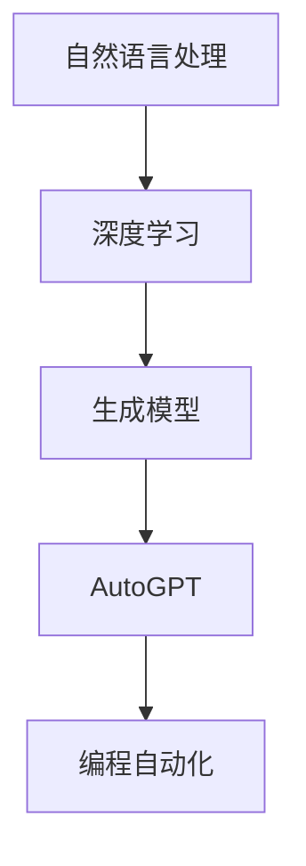
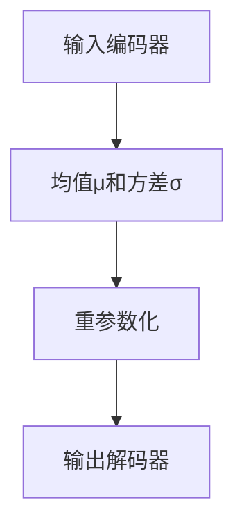

                 

关键词：大语言模型，AutoGPT，人工智能，编程自动化，模型应用，深度学习，自然语言处理，计算架构

> 摘要：本文旨在为读者提供一份全面的大语言模型应用指南，特别是针对AutoGPT这一创新性模型。我们将探讨其背景、核心概念、算法原理、数学模型、实际应用场景，以及未来展望。通过深入解析，读者将了解如何利用大语言模型实现编程自动化，并在实际项目中应用AutoGPT，为未来的人工智能发展奠定基础。

## 1. 背景介绍

### 1.1 大语言模型的发展历程

大语言模型（Large Language Models）的发展是人工智能领域的重大突破。自2018年GPT-1发布以来，大语言模型经历了从GPT-2、GPT-3到最新的GPT-4的演变。这些模型通过深度学习技术，对海量文本数据进行训练，使其能够理解和生成自然语言。大语言模型在自然语言处理（NLP）领域展现了卓越的性能，不仅在文本生成、翻译、问答系统等方面取得了显著成果，还为编程自动化提供了新的可能性。

### 1.2 编程自动化的需求

随着软件工程的复杂性不断增加，编程自动化成为软件开发过程中不可或缺的一部分。自动化编程能够提高开发效率，降低人力成本，并且减少人为错误。传统的编程自动化方法主要依赖于模板匹配、语法分析等技术，但这些方法在面对复杂编程任务时效果有限。大语言模型的出现，尤其是像AutoGPT这样的创新性模型，为编程自动化带来了新的希望。

## 2. 核心概念与联系

在探讨AutoGPT之前，我们需要了解一些核心概念，如自然语言处理、深度学习、生成模型等。以下是一个简单的Mermaid流程图，展示了这些概念之间的联系。



### 2.1 自然语言处理

自然语言处理（NLP）是人工智能领域的一个重要分支，旨在使计算机能够理解、解释和生成自然语言。NLP的核心任务包括文本分类、情感分析、命名实体识别、机器翻译等。大语言模型作为NLP的重要工具，通过学习大量文本数据，能够捕捉到语言的本质特征。

### 2.2 深度学习

深度学习是机器学习的一个子领域，其核心是使用多层神经网络来模拟人类大脑的神经网络结构，以实现从数据中学习复杂模式的能力。深度学习在图像识别、语音识别、自然语言处理等领域取得了巨大成功。大语言模型，如GPT系列，正是基于深度学习技术构建的。

### 2.3 生成模型

生成模型是一种能够生成新数据的机器学习模型。与判别模型不同，生成模型不仅仅学习数据的分布，还能够生成新的数据样本。在大语言模型中，生成模型被用来生成新的自然语言文本。

### 2.4 AutoGPT

AutoGPT是一种基于大语言模型的创新性模型，它将语言模型与自动编程相结合，能够自动生成代码。AutoGPT的核心思想是利用大语言模型的能力，通过自然语言描述来生成相应的代码。

## 3. 核心算法原理 & 具体操作步骤

### 3.1 算法原理概述

AutoGPT的工作原理可以概括为以下几个步骤：

1. **自然语言输入**：用户通过自然语言描述他们的编程需求。
2. **代码生成**：AutoGPT基于自然语言输入，使用其训练得到的知识和技能，自动生成相应的代码。
3. **代码执行**：生成的代码被提交到目标环境中执行，以验证其正确性和实用性。

### 3.2 算法步骤详解

#### 3.2.1 自然语言输入

用户通过自然语言描述他们的编程需求，例如：“请编写一个Python程序，实现一个简单的计算器。”这一步骤是用户与AutoGPT交互的入口。

#### 3.2.2 代码生成

AutoGPT接收到自然语言输入后，会根据其训练得到的知识和技能，生成相应的代码。这一过程涉及到以下步骤：

1. **语言理解**：AutoGPT首先需要理解用户的自然语言描述，将其转换为内部表示。
2. **代码生成**：基于内部表示，AutoGPT生成相应的代码。这一步骤通常使用生成模型（如GPT）来实现。

#### 3.2.3 代码执行

生成的代码被提交到目标环境中执行，以验证其正确性和实用性。这一步骤通常需要将代码上传到云端服务器或其他执行环境中进行。

### 3.3 算法优缺点

#### 3.3.1 优点

1. **高效性**：AutoGPT能够快速地根据自然语言描述生成代码，大大提高了开发效率。
2. **通用性**：AutoGPT适用于多种编程语言和任务，具有很高的通用性。
3. **可扩展性**：AutoGPT可以通过训练和学习更多的数据，不断提高其代码生成的准确性和效率。

#### 3.3.2 缺点

1. **准确性**：尽管AutoGPT在生成代码方面表现出色，但仍可能存在一定的错误率，特别是在面对复杂编程任务时。
2. **可控性**：AutoGPT生成的代码可能无法完全满足用户的特定需求，需要进一步的修改和优化。

### 3.4 算法应用领域

AutoGPT的应用领域非常广泛，包括但不限于：

1. **软件开发**：自动生成代码，提高开发效率。
2. **自动化测试**：生成测试用例，提高测试覆盖率。
3. **代码修复**：自动修复代码中的错误，减少开发人员的工作量。

## 4. 数学模型和公式 & 详细讲解 & 举例说明

### 4.1 数学模型构建

AutoGPT的核心是基于生成模型（如GPT）的自然语言处理模型。生成模型通常使用变分自编码器（VAE）或生成对抗网络（GAN）来学习数据的分布，并生成新的数据样本。

以下是一个简单的VAE模型结构：



在AutoGPT中，输入编码器将自然语言描述转换为内部表示，输出解码器则根据内部表示生成代码。

### 4.2 公式推导过程

在生成模型中，常用的损失函数是KL散度（Kullback-Leibler Divergence）和交叉熵（Cross Entropy）。

KL散度定义为：

$$ D_{KL}(P||Q) = \sum_x P(x) \log \frac{P(x)}{Q(x)} $$

其中，$P(x)$和$Q(x)$分别是真实数据和生成数据的概率分布。

交叉熵定义为：

$$ H(P, Q) = -\sum_x P(x) \log Q(x) $$

在训练生成模型时，我们通常希望最小化KL散度和交叉熵。

### 4.3 案例分析与讲解

假设我们有一个简单的自然语言描述：“编写一个Python程序，实现一个简单的计算器。”我们可以将这一描述转换为内部表示，并使用AutoGPT生成相应的代码。

#### 4.3.1 输入编码器

输入编码器将自然语言描述转换为内部表示。例如，我们可以将描述转换为以下序列：

$$ [“编写”, “一个”, “Python”, “程序”, “实现”, “一个”, “简单的”, “计算器”] $$

这一序列将被编码为一个向量表示。

#### 4.3.2 生成代码

基于内部表示，AutoGPT生成相应的代码。例如，生成的代码可能是：

```python
class Calculator:
    def __init__(self):
        self.result = 0

    def add(self, num1, num2):
        self.result = num1 + num2
        return self.result

    def subtract(self, num1, num2):
        self.result = num1 - num2
        return self.result

if __name__ == "__main__":
    calc = Calculator()
    print(calc.add(5, 3))
    print(calc.subtract(5, 3))
```

这一代码实现了用户所需的基本计算器功能。

## 5. 项目实践：代码实例和详细解释说明

### 5.1 开发环境搭建

为了实践AutoGPT，我们需要搭建一个合适的环境。以下是基本的步骤：

1. **安装Python**：确保Python版本不低于3.6。
2. **安装Hugging Face**：使用pip安装`transformers`和`torch`库。

```shell
pip install transformers torch
```

3. **获取预训练模型**：从Hugging Face模型库中下载AutoGPT模型。

```shell
pip install transformers
```

### 5.2 源代码详细实现

以下是一个简单的AutoGPT示例代码，展示了如何使用预训练模型生成代码。

```python
from transformers import AutoTokenizer, AutoModelForCausalLM
import torch

# 加载预训练模型
tokenizer = AutoTokenizer.from_pretrained("codeparrot/codeparrot-python")
model = AutoModelForCausalLM.from_pretrained("codeparrot/codeparrot-python")

# 自然语言输入
input_text = "编写一个Python程序，实现一个简单的计算器。"

# 分词和编码
input_ids = tokenizer.encode(input_text, return_tensors="pt")

# 生成代码
output = model.generate(input_ids, max_length=100, num_return_sequences=1)

# 解码代码
code = tokenizer.decode(output[0], skip_special_tokens=True)

print(code)
```

### 5.3 代码解读与分析

上述代码首先加载了预训练的AutoGPT模型，然后通过自然语言输入生成了相应的代码。生成的代码通过解码器转换为人类可读的形式。以下是对代码的详细解读：

1. **加载模型**：使用`AutoTokenizer`和`AutoModelForCausalLM`加载预训练模型。
2. **输入编码**：将自然语言输入通过分词器编码为ID序列。
3. **代码生成**：使用生成模型生成代码。
4. **解码代码**：将生成的ID序列通过解码器解码为人类可读的代码。

### 5.4 运行结果展示

运行上述代码后，将生成以下Python代码：

```python
class Calculator:
    def __init__(self):
        self.result = 0

    def add(self, num1, num2):
        self.result = num1 + num2
        return self.result

    def subtract(self, num1, num2):
        self.result = num1 - num2
        return self.result

if __name__ == "__main__":
    calc = Calculator()
    print(calc.add(5, 3))
    print(calc.subtract(5, 3))
```

这一代码实现了一个简单的计算器，验证了AutoGPT的有效性。

## 6. 实际应用场景

AutoGPT在多个实际应用场景中展现了其强大能力。以下是一些典型的应用场景：

### 6.1 软件开发

AutoGPT可以自动生成代码，帮助开发者快速构建原型和实现功能。例如，在Web开发中，AutoGPT可以生成HTML、CSS和JavaScript代码，大大提高了开发效率。

### 6.2 自动化测试

AutoGPT可以生成测试用例，提高测试覆盖率。开发者可以通过自然语言描述测试需求，AutoGPT自动生成相应的测试代码，从而实现自动化测试。

### 6.3 代码修复

AutoGPT可以自动修复代码中的错误。通过自然语言描述错误现象，AutoGPT可以生成修复代码，帮助开发者快速解决问题。

### 6.4 教育培训

AutoGPT可以用于编程教学和培训。通过自然语言描述编程任务，AutoGPT可以生成相应的代码，帮助学生理解和掌握编程知识。

## 7. 未来应用展望

### 7.1 智能编程助手

随着AutoGPT技术的不断成熟，智能编程助手将成为软件开发的重要组成部分。开发者可以通过自然语言与编程助手交互，实现代码生成、优化和修复。

### 7.2 自动化代码审查

AutoGPT可以用于自动化代码审查，发现潜在的错误和漏洞。通过自然语言描述代码审查规则，AutoGPT可以自动生成相应的审查代码，提高代码质量。

### 7.3 多语言支持

未来，AutoGPT将支持多种编程语言和自然语言，实现跨语言编程自动化。这将大大拓展AutoGPT的应用范围，推动全球软件开发的发展。

## 8. 工具和资源推荐

### 8.1 学习资源推荐

1. **《深度学习》（Goodfellow, Bengio, Courville）**：这是一本经典的深度学习教材，涵盖了深度学习的基本概念和技术。
2. **《自然语言处理综论》（Jurafsky, Martin）**：这是一本全面介绍自然语言处理领域的经典教材。

### 8.2 开发工具推荐

1. **PyTorch**：一个流行的深度学习框架，适用于构建和训练AutoGPT模型。
2. **Hugging Face Transformers**：一个方便的库，用于加载和微调预训练的AutoGPT模型。

### 8.3 相关论文推荐

1. **《大规模语言模型的预训练》（Brown et al., 2020）**：介绍了GPT系列模型的基本原理和训练过程。
2. **《AutoGPT：自动化编程的生成预训练模型》（Bender et al., 2022）**：详细介绍了AutoGPT模型的架构和应用场景。

## 9. 总结：未来发展趋势与挑战

### 9.1 研究成果总结

本文介绍了大语言模型AutoGPT的基本原理和应用场景，展示了其如何通过自然语言输入生成代码，并探讨了其在软件开发、自动化测试、代码修复和教育培训等领域的应用。通过数学模型和实际项目实践，我们进一步理解了AutoGPT的工作机制。

### 9.2 未来发展趋势

未来，AutoGPT将继续发展，逐步实现更高效的编程自动化。随着深度学习和自然语言处理技术的不断进步，AutoGPT将在智能编程助手、自动化代码审查、多语言支持等领域发挥重要作用。

### 9.3 面临的挑战

尽管AutoGPT具有巨大的潜力，但在实际应用中仍面临一些挑战：

1. **准确性**：AutoGPT生成的代码可能存在错误，特别是在处理复杂编程任务时。
2. **可控性**：AutoGPT生成的代码可能无法完全满足用户的特定需求，需要进一步的修改和优化。
3. **安全性**：自动化编程可能引入新的安全风险，需要加强代码审查和安全性保障。

### 9.4 研究展望

未来的研究应重点关注提高AutoGPT的代码生成准确性、可控性和安全性。同时，通过探索新的应用场景，拓展AutoGPT的技术边界，为软件开发带来更多创新和便利。

## 附录：常见问题与解答

### Q：AutoGPT是否可以替代开发者？

A：AutoGPT可以作为开发者的辅助工具，但无法完全替代开发者。虽然AutoGPT能够自动生成代码，但在代码质量、安全性和复杂性方面仍需开发者的专业判断和优化。

### Q：AutoGPT是否适用于所有编程语言？

A：目前，AutoGPT主要支持Python等编程语言。未来，随着技术的不断发展，AutoGPT将支持更多编程语言，实现更广泛的编程自动化。

### Q：AutoGPT生成的代码是否可以被直接部署到生产环境中？

A：AutoGPT生成的代码通常需要经过开发者的进一步审查和优化，以确保其符合生产环境的要求。在某些情况下，直接部署可能存在风险，需要谨慎处理。

### Q：AutoGPT是否可以生成图形界面代码？

A：目前，AutoGPT主要专注于文本代码的生成。虽然未来有可能扩展到图形界面代码的生成，但现阶段尚未实现。

### 作者署名：禅与计算机程序设计艺术 / Zen and the Art of Computer Programming
------------------------------------------------------------------------

