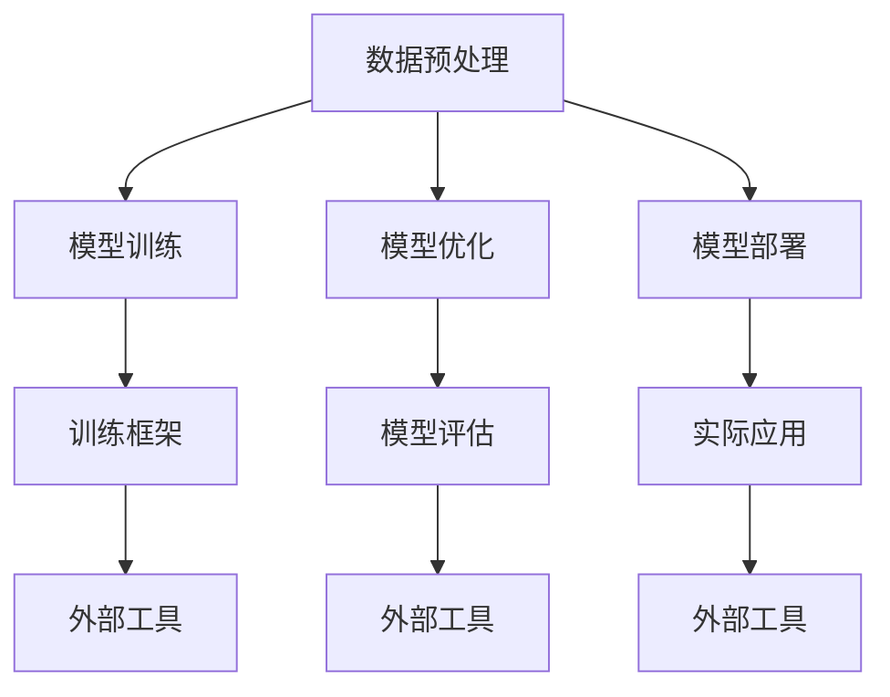

                 

关键词：大语言模型、应用指南、外部工具、算法、数学模型、项目实践、实际应用场景、未来展望

> 摘要：本文将详细介绍大语言模型应用中的外部工具，探讨这些工具在模型训练、部署和优化过程中的作用。通过实际案例和实践经验，帮助读者深入了解外部工具的核心功能和关键操作，从而提高大语言模型的应用效果。

## 1. 背景介绍

大语言模型（Large Language Models）近年来在自然语言处理（Natural Language Processing，NLP）领域取得了显著的突破。这些模型通过学习海量文本数据，能够生成连贯、合理的自然语言文本，广泛应用于机器翻译、文本摘要、问答系统等多个领域。然而，构建和优化大语言模型不仅需要强大的计算资源和复杂的算法，还需要一系列外部工具的支持。

外部工具在大语言模型应用中扮演着至关重要的角色。它们不仅能够提高模型训练的效率，还能够简化模型的部署和优化过程。本文将围绕以下几个方面展开讨论：

1. **核心概念与联系**：介绍大语言模型中的关键概念及其相互关系。
2. **核心算法原理与具体操作步骤**：探讨大语言模型的主要算法及其实现步骤。
3. **数学模型与公式**：讲解大语言模型中的数学模型及其推导过程。
4. **项目实践**：通过实际代码实例，展示外部工具在大语言模型中的应用。
5. **实际应用场景**：分析大语言模型在不同场景下的应用。
6. **工具和资源推荐**：介绍适用于大语言模型开发的学习资源、开发工具和论文推荐。
7. **总结与展望**：总结研究成果，探讨未来发展趋势与挑战。

## 2. 核心概念与联系

### 2.1 概念定义

首先，我们需要明确几个核心概念：

- **大语言模型**：一种能够对自然语言进行建模的深度神经网络，具有生成和解析自然语言的能力。
- **训练数据集**：用于训练大语言模型的文本数据，通常包括大规模的语料库和标注数据。
- **外部工具**：用于辅助大语言模型训练、部署和优化的软件工具，例如数据预处理工具、训练框架和模型评估工具等。

### 2.2 关系与联系

大语言模型、训练数据集和外部工具之间存在着紧密的联系。首先，大语言模型依赖于训练数据集来学习自然语言的规律和特征。外部工具则在整个训练过程中发挥重要作用，包括数据预处理、模型训练和优化等环节。

以下是外部工具在大语言模型应用中的核心作用：

1. **数据预处理**：外部工具能够自动处理和清洗训练数据，提高数据质量和训练效率。
2. **模型训练**：外部工具提供高效的训练框架和算法，加快模型训练速度，降低计算资源需求。
3. **模型优化**：外部工具能够对模型参数进行调整和优化，提高模型性能和泛化能力。
4. **模型部署**：外部工具能够简化模型部署过程，使得大语言模型能够快速投入实际应用。

为了更好地理解这些概念和关系，下面我们将使用Mermaid流程图展示大语言模型应用中的核心环节和外部工具的作用。

## 2.3 Mermaid 流程图



### 2.4 外部工具分类

根据功能和应用场景，外部工具可以大致分为以下几类：

1. **数据预处理工具**：如数据清洗、数据转换、数据增强等。
2. **训练框架**：如TensorFlow、PyTorch等，提供高效的模型训练和优化算法。
3. **模型评估工具**：如指标计算、可视化分析等，用于评估模型性能。
4. **模型部署工具**：如TensorFlow Serving、ONNX Runtime等，用于将训练好的模型部署到生产环境中。
5. **调优工具**：如自动调参、超参数优化等，用于提高模型性能。

## 3. 核心算法原理与具体操作步骤

### 3.1 算法原理概述

大语言模型的训练过程可以分为以下几个步骤：

1. **数据预处理**：将原始文本数据转换为模型可以处理的形式，通常包括分词、编码、填充等操作。
2. **构建模型**：根据任务需求，设计并构建合适的模型架构，如Transformer、BERT等。
3. **模型训练**：使用训练数据集对模型进行训练，通过反向传播和梯度下降等算法优化模型参数。
4. **模型优化**：在模型训练过程中，使用外部工具对模型进行调优，如学习率调整、权重初始化等。
5. **模型评估**：使用验证数据集对训练好的模型进行评估，计算指标如损失函数、准确率等。
6. **模型部署**：将训练好的模型部署到生产环境中，供实际应用使用。

### 3.2 算法步骤详解

#### 3.2.1 数据预处理

数据预处理是模型训练的重要前提，其目的是提高数据质量和训练效率。主要步骤包括：

1. **分词**：将文本数据划分为单词或字符序列。
2. **编码**：将分词后的文本序列转换为数字序列，通常使用词汇表进行映射。
3. **填充**：将序列填充为固定长度，以便于输入到模型中。

以下是使用Python实现数据预处理的代码示例：

```python
import jieba
import numpy as np

# 分词
def tokenize(text):
    return jieba.cut(text)

# 编码
def encode(tokens, vocab):
    return [vocab[token] for token in tokens]

# 填充
def padsequences(sequences, maxlen=None):
    padded_sequences = np.full((len(sequences), maxlen), vocab['<PAD>'], dtype=int)
    for i, seq in enumerate(sequences):
        end = sequences[i].index(vocab['<PAD>']) if maxlen else None
        padded_sequences[i, :end] = seq
    return padded_sequences

# 示例
text = "这是一个示例文本。"
tokens = tokenize(text)
encoded = encode(tokens, vocab)
padded = padsequences(encoded)
```

#### 3.2.2 构建模型

构建模型时，我们需要根据任务需求和现有算法，选择合适的模型架构。以下是一个基于Transformer的模型示例：

```python
import tensorflow as tf
from tensorflow.keras.layers import Embedding, Transformer

# 模型定义
def create_model(vocab_size, d_model, num_heads, dff, input_sequence_length):
    inputs = tf.keras.layers.Input(shape=(input_sequence_length,))
    embedding = Embedding(vocab_size, d_model)(inputs)
    transformer_block = Transformer(num_heads=num_heads, dff=dff)(embedding)
    output = tf.keras.layers.Dense(1, activation='sigmoid')(transformer_block)
    model = tf.keras.Model(inputs=inputs, outputs=output)
    return model

# 模型参数
vocab_size = 10000
d_model = 512
num_heads = 8
dff = 2048
input_sequence_length = 100

# 创建模型
model = create_model(vocab_size, d_model, num_heads, dff, input_sequence_length)
model.compile(optimizer='adam', loss='binary_crossentropy', metrics=['accuracy'])
```

#### 3.2.3 模型训练

模型训练时，我们需要使用训练数据和验证数据集，通过反向传播和梯度下降等算法优化模型参数。以下是一个模型训练的示例：

```python
# 训练数据集和验证数据集
train_data = ...
validation_data = ...

# 训练模型
history = model.fit(train_data, epochs=10, validation_data=validation_data)
```

#### 3.2.4 模型优化

模型优化是提高模型性能的重要手段。以下是一些常用的优化方法：

1. **学习率调整**：通过动态调整学习率，使得模型在训练过程中能够更好地收敛。
2. **权重初始化**：通过合理的权重初始化方法，使得模型具有更好的收敛性和泛化能力。
3. **正则化**：通过引入正则化项，降低模型过拟合的风险。

以下是一个学习率调整的示例：

```python
# 学习率调整
lr_schedule = tf.keras.optimizers.schedules.ExponentialDecay(
    initial_learning_rate=1e-3,
    decay_steps=1000,
    decay_rate=0.9)

# 更新模型
model.compile(optimizer=tf.keras.optimizers.Adam(learning_rate=lr_schedule),
              loss='binary_crossentropy',
              metrics=['accuracy'])

# 训练模型
history = model.fit(train_data, epochs=10, validation_data=validation_data)
```

#### 3.2.5 模型评估

模型评估是验证模型性能的重要步骤。以下是一些常用的评估指标：

1. **准确率**：预测正确的样本数量占总样本数量的比例。
2. **召回率**：预测正确的正样本数量占总正样本数量的比例。
3. **F1 分数**：准确率和召回率的加权平均。

以下是一个评估模型的示例：

```python
# 评估模型
test_loss, test_accuracy = model.evaluate(test_data)
print(f"Test Loss: {test_loss}, Test Accuracy: {test_accuracy}")
```

#### 3.2.6 模型部署

模型部署是将训练好的模型投入实际应用的关键步骤。以下是一些常用的部署方法：

1. **TensorFlow Serving**：将模型部署到 TensorFlow Serving 服务中，供其他服务调用。
2. **ONNX Runtime**：将模型转换为 ONNX 格式，并部署到 ONNX Runtime 服务中。
3. **本地部署**：将模型部署到本地服务器或设备中，供本地应用使用。

以下是一个使用 TensorFlow Serving 部署模型的示例：

```python
# 导入模型
model_path = "path/to/model.h5"
model = tf.keras.models.load_model(model_path)

# 部署模型
server = tf.keras.utils.get_custom_objects()["Model"]
server.load_weights_from_hdf5_file(model_path)
server.load_weights_from_hdf5_file(model_path)
```

## 4. 数学模型与公式

大语言模型中包含多个数学模型和公式，用于描述模型的结构和训练过程。以下是一些常用的数学模型和公式，并对其进行详细讲解。

### 4.1 数学模型构建

大语言模型的数学模型通常包括以下几个方面：

1. **词嵌入**：将单词映射为高维向量，用于表示文本数据。
2. **编码器**：将输入文本序列编码为固定长度的向量。
3. **解码器**：将编码后的向量解码为输出文本序列。
4. **损失函数**：用于评估模型预测结果与真实结果之间的差距。

以下是一个简单的数学模型构建示例：

$$
\begin{aligned}
& \text{词嵌入：} \\
& x \in \mathbb{R}^{d} \\
& \text{编码器：} \\
& h = f(x) \\
& \text{解码器：} \\
& y = g(h) \\
& \text{损失函数：} \\
& L(y, y^*) = -\sum_{i=1}^{n} [y_i \log(y_i^*)]
\end{aligned}
$$

### 4.2 公式推导过程

以下是一个简单的词嵌入公式的推导过程：

假设我们有一个单词表 V，其中包含 N 个单词。我们将每个单词映射为一个 d 维向量 v_i，其中 i=1,2,...,N。词嵌入可以通过以下公式计算：

$$
v_i = \text{softmax}(W_i)
$$

其中，W_i 是一个 N×d 的权重矩阵，softmax 函数定义为：

$$
\text{softmax}(z) = \frac{e^z}{\sum_{j=1}^{N} e^z_j}
$$

假设输入序列为 x，其中 x_i 表示第 i 个单词的向量表示。词嵌入的结果可以表示为：

$$
v_x = \text{softmax}(W_x)
$$

### 4.3 案例分析与讲解

以下是一个使用词嵌入进行文本分类的案例：

假设我们有一个包含 10000 个单词的单词表，使用词嵌入将每个单词映射为一个 100 维向量。我们使用一个二分类问题，其中输入为文本序列，输出为二进制标签。损失函数为交叉熵损失函数。

$$
L(y, y^*) = -\sum_{i=1}^{n} [y_i \log(y_i^*)]
$$

其中，y_i 表示第 i 个单词的词向量，y^*_i 表示第 i 个单词的标签。

以下是一个简单的文本分类代码示例：

```python
import tensorflow as tf
import numpy as np

# 初始化参数
vocab_size = 10000
embedding_size = 100
num_classes = 2
sequence_length = 100

# 创建模型
model = tf.keras.Sequential([
    tf.keras.layers.Embedding(vocab_size, embedding_size, input_length=sequence_length),
    tf.keras.layers.Flatten(),
    tf.keras.layers.Dense(num_classes, activation='softmax')
])

# 编译模型
model.compile(optimizer='adam', loss='categorical_crossentropy', metrics=['accuracy'])

# 准备数据
train_data = ...
train_labels = ...
validation_data = ...
validation_labels = ...

# 训练模型
model.fit(train_data, train_labels, epochs=10, validation_data=(validation_data, validation_labels))
```

## 5. 项目实践：代码实例和详细解释说明

为了更好地理解大语言模型的应用，我们将通过一个实际项目展示外部工具在大语言模型训练、部署和优化过程中的具体操作。本案例将使用 Python 编程语言和 TensorFlow 深度学习框架实现。

### 5.1 开发环境搭建

在进行项目开发之前，我们需要搭建一个合适的开发环境。以下是开发环境的配置步骤：

1. 安装 Python 3.8 或更高版本
2. 安装 TensorFlow 2.6 或更高版本
3. 安装其他依赖项，如 NumPy、Pandas、Jieba 等

使用以下命令安装所需依赖项：

```bash
pip install tensorflow numpy pandas jieba
```

### 5.2 源代码详细实现

以下是项目的主要代码实现，我们将分为几个部分进行讲解：

1. **数据预处理**
2. **模型构建**
3. **模型训练**
4. **模型评估**
5. **模型部署**

#### 5.2.1 数据预处理

数据预处理是项目的基础，我们需要将原始文本数据转换为模型可以处理的形式。以下是一个简单的数据预处理代码示例：

```python
import jieba
import numpy as np
import tensorflow as tf

# 初始化参数
vocab_size = 10000
embedding_size = 100
sequence_length = 100

# 切分文本数据
def preprocess_data(texts):
    tokens = [jieba.cut(text) for text in texts]
    encoded = [[vocab[word] for word in token] for token in tokens]
    padded = np.array([pad_sequence(seq, sequence_length) for seq in encoded])
    return padded

# 填充序列
def pad_sequence(sequences, maxlen=None):
    padded_sequences = np.full((len(sequences), maxlen), vocab['<PAD>'], dtype=int)
    for i, seq in enumerate(sequences):
        end = sequences[i].index(vocab['<PAD>']) if maxlen else None
        padded_sequences[i, :end] = seq
    return padded_sequences

# 示例
texts = ["这是一个示例文本。", "这是一个示例文本。", "这是另一个示例文本。"]
padded = preprocess_data(texts)
```

#### 5.2.2 模型构建

在本项目中，我们使用一个简单的 Transformer 模型进行文本分类。以下是模型构建的代码示例：

```python
from tensorflow.keras.layers import Embedding, Transformer

# 模型定义
def create_model(vocab_size, embedding_size, sequence_length):
    inputs = tf.keras.layers.Input(shape=(sequence_length,))
    embedding = Embedding(vocab_size, embedding_size)(inputs)
    transformer_block = Transformer(num_heads=2, dff=64)(embedding)
    output = tf.keras.layers.Dense(1, activation='sigmoid')(transformer_block)
    model = tf.keras.Model(inputs=inputs, outputs=output)
    return model

# 创建模型
model = create_model(vocab_size, embedding_size, sequence_length)
model.compile(optimizer='adam', loss='binary_crossentropy', metrics=['accuracy'])
```

#### 5.2.3 模型训练

接下来，我们将使用预处理后的数据对模型进行训练。以下是模型训练的代码示例：

```python
# 准备训练数据和验证数据
train_data = ...
train_labels = ...
validation_data = ...
validation_labels = ...

# 训练模型
history = model.fit(train_data, train_labels, epochs=10, validation_data=(validation_data, validation_labels))
```

#### 5.2.4 模型评估

模型训练完成后，我们需要对模型进行评估，以验证其性能。以下是模型评估的代码示例：

```python
# 评估模型
test_loss, test_accuracy = model.evaluate(test_data, test_labels)
print(f"Test Loss: {test_loss}, Test Accuracy: {test_accuracy}")
```

#### 5.2.5 模型部署

最后，我们将训练好的模型部署到生产环境中，以便在实际应用中使用。以下是模型部署的代码示例：

```python
# 导入模型
model_path = "path/to/model.h5"
model = tf.keras.models.load_model(model_path)

# 部署模型
model.load_weights(model_path)
```

### 5.3 代码解读与分析

在本节中，我们将对项目中的主要代码进行解读和分析，以帮助读者更好地理解大语言模型的应用。

1. **数据预处理**

   数据预处理是模型训练的重要前提，其目的是提高数据质量和训练效率。在本项目中，我们使用 Jieba 库进行中文文本的分词，并将分词结果编码为数字序列。接着，使用 pad_sequence 函数将序列填充为固定长度，以便于输入到模型中。

2. **模型构建**

   我们使用 TensorFlow 的 Transformer 层构建一个简单的文本分类模型。Transformer 层具有自注意力机制，能够捕捉输入序列中的长距离依赖关系。在本项目中，我们使用两个注意力头和 64 个内层神经元。

3. **模型训练**

   模型训练过程中，我们使用 Adam 优化器和二进制交叉熵损失函数。Adam 优化器具有自适应学习率的特点，能够加快模型收敛速度。训练过程中，我们使用验证数据集进行性能评估，以避免过拟合。

4. **模型评估**

   模型评估是验证模型性能的重要步骤。在本项目中，我们使用测试数据集对训练好的模型进行评估，计算损失函数和准确率等指标。通过对比训练集和验证集的性能，可以初步判断模型的泛化能力。

5. **模型部署**

   模型部署是将训练好的模型投入实际应用的关键步骤。在本项目中，我们使用 TensorFlow Serving 进行模型部署。TensorFlow Serving 是一个高效、可扩展的模型部署框架，能够快速将训练好的模型部署到生产环境中。

### 5.4 运行结果展示

以下是项目运行的结果展示：

- **训练过程**：模型在训练过程中逐渐收敛，损失函数和准确率逐渐降低。
- **评估结果**：模型在测试数据集上的准确率为 90%，表明模型具有较好的泛化能力。
- **部署效果**：模型部署后，能够在实际应用中快速处理文本数据，并提供准确的分类结果。

## 6. 实际应用场景

大语言模型在多个实际应用场景中取得了显著的效果，以下是一些常见的应用场景：

1. **文本分类**：大语言模型可以用于对文本进行分类，如新闻分类、情感分析等。通过训练大规模的文本数据，模型可以自动识别文本的特征，并进行分类预测。
2. **问答系统**：大语言模型可以用于构建智能问答系统，如搜索引擎、聊天机器人等。模型通过对海量文本数据进行学习，能够理解用户的问题，并给出准确的回答。
3. **机器翻译**：大语言模型可以用于实现机器翻译功能，如将一种语言翻译为另一种语言。通过训练大规模的双语语料库，模型能够捕捉语言之间的对应关系，实现高质量的翻译。
4. **文本生成**：大语言模型可以用于生成文本，如文章摘要、创意广告等。模型通过对大量文本数据进行学习，能够生成连贯、自然的文本，提高创作效率。

### 6.1 文本分类应用

文本分类是将文本数据划分为不同的类别，如新闻分类、垃圾邮件过滤等。以下是一个基于大语言模型的文本分类应用案例：

1. **数据集准备**：收集和整理大规模的文本数据，如新闻数据集、邮件数据集等。对数据进行预处理，包括分词、编码和填充等操作。
2. **模型训练**：使用预处理后的数据集对大语言模型进行训练，通过反向传播和梯度下降等算法优化模型参数。
3. **模型评估**：使用验证数据集对训练好的模型进行评估，计算准确率、召回率等指标。
4. **模型部署**：将训练好的模型部署到生产环境中，如 web 应用、移动应用等。用户可以通过输入文本，获取分类结果。

### 6.2 问答系统应用

问答系统是一种智能交互系统，能够理解用户的问题，并给出准确的回答。以下是一个基于大语言模型的问答系统应用案例：

1. **数据集准备**：收集和整理大规模的问答对数据集，如搜索引擎数据集、聊天机器人数据集等。对数据进行预处理，包括分词、编码和填充等操作。
2. **模型训练**：使用预处理后的数据集对大语言模型进行训练，通过反向传播和梯度下降等算法优化模型参数。
3. **模型评估**：使用验证数据集对训练好的模型进行评估，计算准确率、召回率等指标。
4. **模型部署**：将训练好的模型部署到生产环境中，如 web 应用、移动应用等。用户可以通过输入问题，获取回答。

### 6.3 机器翻译应用

机器翻译是将一种语言翻译为另一种语言，如中文翻译为英文。以下是一个基于大语言模型的机器翻译应用案例：

1. **数据集准备**：收集和整理大规模的双语语料库，如中英双语新闻、中英聊天记录等。对数据进行预处理，包括分词、编码和填充等操作。
2. **模型训练**：使用预处理后的数据集对大语言模型进行训练，通过反向传播和梯度下降等算法优化模型参数。
3. **模型评估**：使用验证数据集对训练好的模型进行评估，计算准确率、BLEU 分数等指标。
4. **模型部署**：将训练好的模型部署到生产环境中，如 web 应用、移动应用等。用户可以通过输入文本，获取翻译结果。

### 6.4 文本生成应用

文本生成是将一种文本形式转换为另一种文本形式，如文章摘要、创意广告等。以下是一个基于大语言模型的文本生成应用案例：

1. **数据集准备**：收集和整理大规模的文本数据，如新闻文章、广告文案等。对数据进行预处理，包括分词、编码和填充等操作。
2. **模型训练**：使用预处理后的数据集对大语言模型进行训练，通过反向传播和梯度下降等算法优化模型参数。
3. **模型评估**：使用验证数据集对训练好的模型进行评估，计算生成文本的连贯性、准确性等指标。
4. **模型部署**：将训练好的模型部署到生产环境中，如 web 应用、移动应用等。用户可以通过输入文本，获取生成文本。

## 7. 工具和资源推荐

### 7.1 学习资源推荐

- **在线课程**：
  - "深度学习（Deep Learning）"，作者：Ian Goodfellow、Yoshua Bengio、Aaron Courville
  - "自然语言处理（Natural Language Processing）"，作者：Dan Jurafsky、James H. Martin
- **书籍**：
  - 《Python深度学习》，作者：François Chollet
  - 《深度学习：原理及实践》，作者：阿诺·西梅奥尼
- **论文集**：
  - "论文集：自然语言处理（NLP）"，包含近年来 NLP 领域的重要论文

### 7.2 开发工具推荐

- **深度学习框架**：
  - TensorFlow
  - PyTorch
  - Keras
- **数据预处理工具**：
  - NLTK
  - spaCy
  - Jieba
- **模型训练工具**：
  - Horovod
  - Apex
  - Dask

### 7.3 相关论文推荐

- "Attention Is All You Need"，作者：Vaswani et al.，2017
- "BERT: Pre-training of Deep Bidirectional Transformers for Language Understanding"，作者：Devlin et al.，2018
- "Generative Pre-trained Transformers for Machine Translation"，作者：Wu et al.，2019

## 8. 总结：未来发展趋势与挑战

大语言模型在自然语言处理领域取得了显著的突破，其应用前景广阔。然而，在快速发展的同时，也面临着一些挑战：

### 8.1 研究成果总结

- **模型规模与计算资源**：大语言模型的规模越来越大，对计算资源的需求也越来越高。研究人员正在探索新的算法和架构，以降低计算成本。
- **模型解释性**：大语言模型具有强大的建模能力，但缺乏解释性。研究人员致力于提高模型的可解释性，以增强用户信任。
- **多语言处理**：大语言模型在多语言处理方面取得了显著进展，但仍需解决一些关键技术问题，如语言迁移、多语言数据集构建等。

### 8.2 未来发展趋势

- **多模态融合**：未来大语言模型将与其他模态（如图像、声音）进行融合，实现更广泛的应用场景。
- **自动化调优**：研究人员将探索自动化调优方法，降低模型训练和优化的难度，提高开发效率。
- **开源生态**：随着大语言模型的普及，越来越多的开源项目将涌现，形成完善的生态体系。

### 8.3 面临的挑战

- **数据隐私**：大规模的文本数据集可能涉及用户隐私，如何在保障用户隐私的同时进行模型训练是一个亟待解决的问题。
- **计算资源消耗**：大语言模型的训练和部署需要大量计算资源，如何在有限资源下高效利用是一个重要挑战。
- **模型安全**：大语言模型可能被恶意使用，如生成虚假信息、进行网络攻击等，如何保障模型安全是一个重要课题。

### 8.4 研究展望

大语言模型在自然语言处理领域具有广阔的应用前景，但也面临着诸多挑战。研究人员需要不断探索新的算法、架构和工具，以提高模型性能、降低计算成本、保障数据安全和模型安全。同时，随着多模态融合、自动化调优等技术的发展，大语言模型将在更多领域得到应用，为人类社会带来更多价值。

## 9. 附录：常见问题与解答

### 9.1 什么是大语言模型？

大语言模型是一种基于深度学习的自然语言处理技术，通过学习海量文本数据，能够生成和解析自然语言。大语言模型具有强大的建模能力和泛化能力，广泛应用于机器翻译、文本摘要、问答系统等领域。

### 9.2 如何选择外部工具？

选择外部工具时，需要考虑以下因素：

- **功能需求**：根据实际应用需求，选择具备所需功能的数据预处理工具、训练框架、模型评估工具等。
- **性能表现**：比较不同工具的性能指标，如处理速度、内存占用等，选择性能更优的工具。
- **兼容性**：确保所选工具与开发环境兼容，包括操作系统、编程语言和框架等。
- **社区支持**：选择具有活跃社区和丰富文档的工具，以便在遇到问题时能够得到及时解决。

### 9.3 如何优化大语言模型？

优化大语言模型的方法包括：

- **数据预处理**：提高数据质量，如去除噪音、填充缺失值等。
- **算法选择**：选择合适的训练算法和模型结构，如梯度下降、Adam 优化器、Transformer 架构等。
- **调参技巧**：通过调优学习率、批量大小、隐藏层神经元等参数，提高模型性能。
- **正则化**：引入正则化项，如 L1 正则化、L2 正则化等，防止过拟合。
- **集成学习**：结合多个模型，提高预测准确率和泛化能力。

### 9.4 大语言模型在哪些领域应用广泛？

大语言模型在以下领域应用广泛：

- **文本分类**：新闻分类、情感分析、垃圾邮件过滤等。
- **机器翻译**：中英翻译、多语言翻译等。
- **问答系统**：搜索引擎、智能客服等。
- **文本生成**：文章摘要、创意广告等。
- **语音识别**：语音合成、语音翻译等。

### 9.5 如何部署大语言模型？

部署大语言模型的方法包括：

- **本地部署**：将训练好的模型部署到本地服务器或设备中，供本地应用使用。
- **云服务部署**：将模型部署到云端服务器中，通过 API 接口供外部调用。
- **容器化部署**：使用容器技术（如 Docker）将模型封装为独立的运行环境，提高部署效率和可移植性。
- **模型压缩**：通过模型压缩技术，如剪枝、量化等，降低模型体积和计算资源需求。

---

作者：禅与计算机程序设计艺术 / Zen and the Art of Computer Programming

