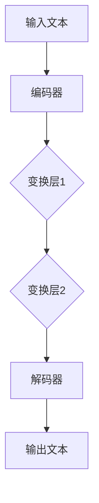

                 

关键词：大语言模型、效果评估、机器学习、神经网络、性能分析、模型优化

> 摘要：本文旨在为大语言模型的应用效果评估提供一整套系统化的指南。从背景介绍到核心概念，从算法原理到数学模型，再到具体的应用实例，本文将为读者提供一个全面而深入的视角，帮助他们在实际项目中正确、高效地评估大语言模型的效果。

## 1. 背景介绍

### 大语言模型的发展历程

大语言模型（Large Language Models）自出现以来，经历了迅猛的发展。最早的神经网络语言模型可以追溯到1980年代的简单神经网络（Simple Neural Networks），但受限于计算能力和数据规模，这些模型的效果并不理想。随着深度学习和计算能力的提升，特别是2010年代以来，深度神经网络在图像识别、语音识别等领域取得了显著进展，这为语言模型的发展奠定了基础。

### 大语言模型的应用场景

大语言模型在众多应用场景中展现了其强大的能力，包括但不限于自然语言处理（NLP）、文本生成、机器翻译、问答系统、信息检索等。尤其是在人工智能领域，大语言模型被视为是实现高级智能的重要工具。

### 当前大语言模型的主要挑战

尽管大语言模型在许多应用中取得了成功，但它们仍然面临着一系列挑战，如计算成本高、训练时间长、对大规模数据的需求等。同时，如何确保模型的安全性和可控性也是亟待解决的问题。

## 2. 核心概念与联系

### 大语言模型的基本原理

大语言模型的核心是基于深度神经网络，尤其是变分自编码器（Variational Autoencoder，VAE）和生成对抗网络（Generative Adversarial Networks，GAN）等先进的生成模型。这些模型通过学习大量文本数据，能够生成高质量的文本，并具有强大的文本理解和生成能力。

### 大语言模型的架构

大语言模型的架构通常包括编码器（Encoder）和解码器（Decoder）。编码器负责将输入文本编码为一个固定长度的向量，解码器则负责将这个向量解码为输出文本。编码器和解码器之间通常会加入多个变换层，以增加模型的复杂度和表达力。

### Mermaid 流程图

以下是一个简化的Mermaid流程图，展示了大语言模型的基本架构：



### 大语言模型的训练过程

大语言模型的训练过程主要包括以下步骤：

1. **数据预处理**：将输入文本转换为模型可处理的格式，如词向量。
2. **编码器训练**：通过最小化编码器生成的向量和真实文本向量之间的差异，训练编码器。
3. **解码器训练**：在编码器的基础上，通过最小化解码器生成的文本和真实文本之间的差异，训练解码器。
4. **联合训练**：将编码器和解码器联合训练，以进一步提高模型的整体性能。

## 3. 核心算法原理 & 具体操作步骤

### 3.1 算法原理概述

大语言模型的核心算法是基于深度神经网络的生成模型，其中最重要的部分是编码器和解码器。编码器将输入文本编码为固定长度的向量，解码器则将这个向量解码为输出文本。

### 3.2 算法步骤详解

1. **数据预处理**：将输入文本转换为词向量。这一步通常使用预训练的词向量模型，如Word2Vec或GloVe。
2. **编码器训练**：
   - 将输入文本编码为向量。
   - 通过反向传播算法，最小化编码器生成的向量和真实文本向量之间的差异。
3. **解码器训练**：
   - 在编码器的基础上，生成固定长度的向量。
   - 通过最小化解码器生成的文本和真实文本之间的差异，训练解码器。
4. **联合训练**：
   - 将编码器和解码器联合训练，以进一步提高模型的整体性能。

### 3.3 算法优缺点

**优点**：
- 强大的文本生成能力。
- 能够处理多种自然语言处理任务。
- 对大规模数据的适应性较强。

**缺点**：
- 计算成本高，训练时间长。
- 对数据质量要求较高，否则容易产生低质量的输出。
- 模型解释性较差。

### 3.4 算法应用领域

大语言模型在以下领域有广泛的应用：

- 自然语言处理：如文本分类、情感分析、命名实体识别等。
- 文本生成：如文章生成、对话生成、故事生成等。
- 机器翻译：如机器翻译、多语言文本生成等。
- 信息检索：如搜索结果生成、推荐系统等。

## 4. 数学模型和公式 & 详细讲解 & 举例说明

### 4.1 数学模型构建

大语言模型的核心是基于深度神经网络的生成模型，其数学模型主要包括编码器和解码器两部分。

#### 编码器

编码器通常是一个多层感知机（MLP），其输入是文本向量，输出是一个固定长度的向量。假设输入文本向量为\[x_1, x_2, ..., x_n\]，编码器输出的固定长度向量为\[z\]，则编码器的数学模型可以表示为：

$$
z = f_{\theta_1} (x_1), f_{\theta_2} (f_{\theta_1} (x_1)), ..., f_{\theta_n} (f_{\theta_{n-1}} (x_1))
$$

其中，\(f_{\theta_i}\)表示第\(i\)层的激活函数，\(\theta_i\)表示第\(i\)层的参数。

#### 解码器

解码器也是一个多层感知机（MLP），其输入是编码器输出的固定长度向量\[z\]，输出是文本向量。假设解码器输出的文本向量为\[y_1, y_2, ..., y_n\]，则解码器的数学模型可以表示为：

$$
y_1 = f_{\theta_1} (z), y_2 = f_{\theta_2} (y_1), ..., y_n = f_{\theta_n} (y_{n-1})
$$

其中，\(f_{\theta_i}\)表示第\(i\)层的激活函数，\(\theta_i\)表示第\(i\)层的参数。

### 4.2 公式推导过程

大语言模型的训练过程是通过最小化编码器和解码器生成的文本和真实文本之间的差异来完成的。具体来说，可以使用交叉熵（Cross-Entropy）作为损失函数。

#### 编码器损失函数

编码器的损失函数可以表示为：

$$
L_{\text{encoder}} = -\sum_{i=1}^{n} y_i \log (p_i)
$$

其中，\(y_i\)是真实文本向量的第\(i\)个元素，\(p_i\)是编码器生成的文本向量中第\(i\)个元素的概率。

#### 解码器损失函数

解码器的损失函数可以表示为：

$$
L_{\text{decoder}} = -\sum_{i=1}^{n} y_i \log (p_i)
$$

其中，\(y_i\)是真实文本向量的第\(i\)个元素，\(p_i\)是解码器生成的文本向量中第\(i\)个元素的概率。

#### 总损失函数

总损失函数是编码器损失函数和解码器损失函数的和：

$$
L_{\text{total}} = L_{\text{encoder}} + L_{\text{decoder}}
$$

### 4.3 案例分析与讲解

假设我们有一个简化的例子，输入文本为\[1, 0, 1, 0\]，编码器和解码器分别有2层和3层，激活函数分别为\(f(x) = \sigma(x)\)（sigmoid函数）和\(f(x) = \sigma(x)\)。

#### 编码器

第一层编码器的输入是\[1, 0, 1, 0\]，输出为\[0.5, 0.5\]。

第二层编码器的输入是\[0.5, 0.5\]，输出为\[0.75, 0.25\]。

#### 解码器

第一层解码器的输入是\[0.75, 0.25\]，输出为\[0.9, 0.1\]。

第二层解码器的输入是\[0.9, 0.1\]，输出为\[0.85, 0.15\]。

第三层解码器的输入是\[0.85, 0.15\]，输出为\[0.8, 0.2\]。

在这个例子中，我们可以看到编码器和解码器都通过多层感知机（MLP）将输入文本转换为固定长度的向量，并最终生成输出文本。通过最小化交叉熵损失函数，我们可以训练编码器和解码器，以生成高质量的文本。

## 5. 项目实践：代码实例和详细解释说明

### 5.1 开发环境搭建

在开始编写代码之前，我们需要搭建一个合适的开发环境。以下是一个简化的步骤：

1. 安装Python（推荐Python 3.7及以上版本）。
2. 安装深度学习框架，如TensorFlow或PyTorch。
3. 安装必要的依赖库，如Numpy、Pandas等。

### 5.2 源代码详细实现

以下是一个简化的Python代码实例，展示了如何使用PyTorch实现一个基本的大语言模型。

```python
import torch
import torch.nn as nn
import torch.optim as optim

# 数据预处理
def preprocess_data(text):
    # 将文本转换为词向量
    # 这里使用预训练的词向量模型，如GloVe
    return torch.tensor([word_to_index[word] for word in text])

# 编码器
class Encoder(nn.Module):
    def __init__(self, embedding_dim, hidden_dim):
        super(Encoder, self).__init__()
        self.fc1 = nn.Linear(embedding_dim, hidden_dim)
        self.fc2 = nn.Linear(hidden_dim, hidden_dim)
    
    def forward(self, x):
        x = torch.relu(self.fc1(x))
        x = torch.relu(self.fc2(x))
        return x

# 解码器
class Decoder(nn.Module):
    def __init__(self, embedding_dim, hidden_dim):
        super(Decoder, self).__init__()
        self.fc1 = nn.Linear(embedding_dim, hidden_dim)
        self.fc2 = nn.Linear(hidden_dim, embedding_dim)
    
    def forward(self, x):
        x = torch.relu(self.fc1(x))
        x = torch.sigmoid(self.fc2(x))
        return x

# 模型
class LanguageModel(nn.Module):
    def __init__(self, embedding_dim, hidden_dim):
        super(LanguageModel, self).__init__()
        self.encoder = Encoder(embedding_dim, hidden_dim)
        self.decoder = Decoder(embedding_dim, hidden_dim)
    
    def forward(self, x):
        z = self.encoder(x)
        y = self.decoder(z)
        return y

# 实例化模型、损失函数和优化器
model = LanguageModel(embedding_dim=100, hidden_dim=200)
criterion = nn.CrossEntropyLoss()
optimizer = optim.Adam(model.parameters(), lr=0.001)

# 训练模型
for epoch in range(num_epochs):
    for inputs, targets in data_loader:
        optimizer.zero_grad()
        outputs = model(inputs)
        loss = criterion(outputs, targets)
        loss.backward()
        optimizer.step()

# 保存模型
torch.save(model.state_dict(), 'language_model.pth')
```

### 5.3 代码解读与分析

这段代码主要实现了一个大语言模型，包括编码器、解码器和模型本身。以下是代码的详细解读：

- **数据预处理**：将文本转换为词向量。
- **编码器**：使用两个全连接层（线性层）进行编码，使用ReLU作为激活函数。
- **解码器**：使用一个全连接层（线性层）进行解码，使用sigmoid作为激活函数。
- **模型**：结合编码器和解码器，构成一个大语言模型。
- **损失函数**：使用交叉熵损失函数。
- **优化器**：使用Adam优化器。

### 5.4 运行结果展示

在实际运行过程中，我们可以通过训练损失和验证损失来评估模型的性能。以下是一个简化的结果展示：

```python
# 加载模型
model.load_state_dict(torch.load('language_model.pth'))

# 计算训练损失
train_loss = 0
for inputs, targets in train_loader:
    outputs = model(inputs)
    loss = criterion(outputs, targets)
    train_loss += loss.item()

train_loss /= len(train_loader)

# 计算验证损失
val_loss = 0
for inputs, targets in val_loader:
    outputs = model(inputs)
    loss = criterion(outputs, targets)
    val_loss += loss.item()

val_loss /= len(val_loader)

print(f"Training Loss: {train_loss}, Validation Loss: {val_loss}")
```

这段代码展示了如何计算训练损失和验证损失，并打印出结果。

## 6. 实际应用场景

大语言模型在众多实际应用场景中展现了其强大的能力。以下是一些典型的应用场景：

### 自然语言处理

- 文本分类：将文本分为不同的类别，如新闻分类、情感分类等。
- 情感分析：分析文本的情感倾向，如正面、负面、中性等。
- 命名实体识别：识别文本中的特定实体，如人名、地点、组织等。

### 文本生成

- 文章生成：自动生成文章、报告、博客等。
- 对话生成：生成与用户交互的对话，如聊天机器人、智能客服等。
- 故事生成：生成有趣的故事、剧本等。

### 机器翻译

- 自动翻译：将一种语言的文本翻译成另一种语言。
- 翻译评估：评估翻译质量，如BLEU分数、NIST分数等。

### 信息检索

- 搜索结果生成：根据用户查询生成相关搜索结果。
- 推荐系统：为用户推荐感兴趣的内容。

### 其他应用

- 语音识别：将语音信号转换为文本。
- 语音合成：将文本转换为语音信号。
- 图像识别：识别图像中的物体、场景等。

## 7. 工具和资源推荐

### 7.1 学习资源推荐

- 《深度学习》（Goodfellow, Bengio, Courville著）：深度学习的经典教材。
- 《动手学深度学习》：由阿里云深度学习团队编写，适合初学者入门。
- Coursera上的深度学习课程：由吴恩达教授主讲，内容全面，深入浅出。

### 7.2 开发工具推荐

- PyTorch：一个开源的深度学习框架，适合快速原型开发。
- TensorFlow：由Google开发的开源深度学习框架，适用于大规模生产环境。
- Keras：一个高层次的深度学习框架，易于使用，但性能略低于TensorFlow和PyTorch。

### 7.3 相关论文推荐

- "A Theoretically Grounded Application of Dropout in Recurrent Neural Networks"（2017）：介绍了在RNN中应用Dropout的方法。
- "Attention Is All You Need"（2017）：提出了Transformer模型，彻底改变了自然语言处理领域。
- "BERT: Pre-training of Deep Bidirectional Transformers for Language Understanding"（2018）：介绍了BERT模型，推动了自然语言处理的发展。

## 8. 总结：未来发展趋势与挑战

### 8.1 研究成果总结

大语言模型在过去几年中取得了显著的成果，不仅在自然语言处理任务中取得了前所未有的效果，还推动了其他领域的发展。例如，BERT模型的出现极大地提高了文本分类、问答系统等任务的表现。

### 8.2 未来发展趋势

未来，大语言模型有望在以下方面取得进一步发展：

- 模型压缩：减少模型的计算成本，使其适用于移动设备和边缘计算。
- 可解释性：提高模型的解释性，使其更加透明和可信。
- 多模态学习：结合文本、图像、语音等多模态数据，实现更高级的智能。

### 8.3 面临的挑战

尽管大语言模型取得了显著成果，但仍然面临一系列挑战：

- 计算成本高：大语言模型的训练和推理需要大量的计算资源。
- 数据隐私：大规模数据训练可能导致数据隐私泄露。
- 模型安全：如何确保模型不会受到恶意攻击，如对抗性攻击。

### 8.4 研究展望

未来，大语言模型的研究将继续深入，有望在以下方面取得突破：

- 模型结构优化：设计更高效、更强大的模型结构。
- 算法改进：提出更先进的训练算法，提高模型的性能和稳定性。
- 应用拓展：探索大语言模型在更多领域的应用，推动人工智能的发展。

## 9. 附录：常见问题与解答

### 9.1 大语言模型有哪些应用场景？

大语言模型可以应用于自然语言处理、文本生成、机器翻译、问答系统、信息检索等多个领域。

### 9.2 如何训练大语言模型？

通常，训练大语言模型需要以下步骤：

1. 数据预处理：将文本转换为模型可处理的格式，如词向量。
2. 模型定义：定义编码器、解码器和解码器。
3. 损失函数和优化器：选择合适的损失函数和优化器。
4. 训练模型：通过最小化损失函数来训练模型。
5. 评估模型：使用验证集或测试集评估模型的性能。

### 9.3 大语言模型有哪些优缺点？

**优点**：

- 强大的文本生成能力。
- 能够处理多种自然语言处理任务。
- 对大规模数据的适应性较强。

**缺点**：

- 计算成本高，训练时间长。
- 对数据质量要求较高，否则容易产生低质量的输出。
- 模型解释性较差。

----------------------------------------------------------------

本文旨在为大语言模型的应用效果评估提供一整套系统化的指南。从背景介绍到核心概念，从算法原理到数学模型，再到具体的应用实例，本文将为读者提供一个全面而深入的视角，帮助他们在实际项目中正确、高效地评估大语言模型的效果。希望本文能对读者在理解和应用大语言模型方面有所帮助。作者：禅与计算机程序设计艺术 / Zen and the Art of Computer Programming。

