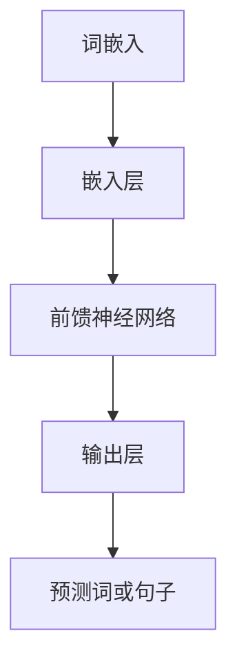

                 

关键词：大语言模型，高质量响应，应用指南，算法原理，实践案例，数学模型，未来展望

## 摘要

本文旨在为人工智能领域的研究者和开发者提供一份详尽的大语言模型应用指南。我们将从背景介绍出发，深入探讨大语言模型的核心概念、算法原理，并详细阐述数学模型的构建和具体操作步骤。通过实例分析和实践讲解，本文将帮助读者理解大语言模型的实际应用，并展望其未来的发展趋势与挑战。

## 1. 背景介绍

### 大语言模型的发展历程

大语言模型（Large Language Model）的发展可以追溯到20世纪80年代的统计语言模型。早期的统计模型如N元语法模型（N-gram Model）通过分析历史文本数据来预测下一个词。随着计算机计算能力的提升和海量数据的出现，深度学习技术开始应用于自然语言处理领域，尤其是2018年GPT-3的发布，标志着大语言模型进入了一个新的阶段。

### 当前大语言模型的应用现状

大语言模型在各个领域的应用日益广泛，从文本生成、机器翻译、情感分析到问答系统等，都展现出了强大的能力和广泛的应用前景。例如，GPT-3在生成新闻文章、编写代码、创作音乐等方面表现出了令人瞩目的能力。

## 2. 核心概念与联系

### 大语言模型的基本概念

大语言模型是一种基于深度学习技术的自然语言处理模型，它通过学习大量文本数据来预测下一个词或句子。核心概念包括词汇表、词嵌入、神经网络等。

### 大语言模型的架构与原理

下面是一个简单的 Mermaid 流程图，展示了大语言模型的基本架构和原理。



### 大语言模型的工作流程

1. 输入文本数据，将其转换为词嵌入向量。
2. 词嵌入向量通过嵌入层传递到前馈神经网络。
3. 前馈神经网络对输入向量进行处理，生成中间表示。
4. 中间表示通过输出层得到预测的词或句子。

## 3. 核心算法原理 & 具体操作步骤

### 3.1 算法原理概述

大语言模型的算法原理主要基于深度学习中的循环神经网络（RNN）和Transformer模型。RNN通过重复使用隐藏状态来处理序列数据，而Transformer模型则通过自注意力机制来实现对序列的并行处理。

### 3.2 算法步骤详解

1. **词嵌入**：将输入的文本数据转换为词嵌入向量。
2. **编码**：通过嵌入层将词嵌入向量传递到神经网络。
3. **解码**：神经网络对编码后的向量进行处理，生成预测的词或句子。
4. **优化**：通过梯度下降等优化算法来调整模型的参数。

### 3.3 算法优缺点

#### 优点：

- **强大的文本生成能力**：大语言模型能够生成高质量的文本，包括文章、代码、音乐等。
- **广泛的适用性**：大语言模型可以应用于多个自然语言处理任务，如文本生成、机器翻译、情感分析等。

#### 缺点：

- **计算资源消耗大**：大语言模型需要大量的计算资源和存储空间。
- **数据依赖性强**：模型的表现很大程度上依赖于训练数据的质量和数量。

### 3.4 算法应用领域

大语言模型的应用领域非常广泛，主要包括：

- **文本生成**：如文章写作、对话系统、生成报告等。
- **机器翻译**：如翻译网站、翻译软件等。
- **情感分析**：如社交媒体情感分析、用户评论分析等。
- **问答系统**：如智能客服、搜索引擎等。

## 4. 数学模型和公式 & 详细讲解 & 举例说明

### 4.1 数学模型构建

大语言模型的数学模型主要包括词嵌入、神经网络和损失函数等。

### 4.2 公式推导过程

假设我们有一个输入序列 $X = (x_1, x_2, ..., x_T)$，其中 $x_i$ 表示第 $i$ 个词的词嵌入向量。我们希望预测下一个词 $y_{T+1}$。

首先，我们将输入序列 $X$ 转换为词嵌入向量 $X' = (x_1', x_2', ..., x_T')$。词嵌入向量是通过学习得到的，通常使用矩阵 $W$ 表示。

$$x_i' = Wx_i$$

接下来，我们将词嵌入向量 $X'$ 传递到神经网络。神经网络由多个层组成，每层都有不同的权重矩阵和激活函数。假设神经网络有 $L$ 层，则输出为：

$$h_L = f_L(W_Lh_{L-1})$$

其中，$h_{L-1}$ 是前一层的输出，$f_L$ 是激活函数，$W_L$ 是权重矩阵。

最后，我们使用输出层的权重矩阵 $W_O$ 将神经网络输出 $h_L$ 映射到词的分布：

$$P(y_{T+1} | X) = \sigma(W_Oh_L)$$

其中，$\sigma$ 是softmax函数。

### 4.3 案例分析与讲解

假设我们有一个简单的词嵌入模型，词嵌入维度为 $d=64$，神经网络有两层，每层的神经元数量分别为 $n=128$ 和 $n=64$。激活函数使用ReLU。

1. **词嵌入**：

   输入词嵌入向量 $x_i$ 通过矩阵 $W$ 转换为 $x_i'$。

   $$x_i' = Wx_i$$

2. **编码**：

   通过神经网络将词嵌入向量 $x_i'$ 编码为 $h_L$。

   $$h_L = f_L(W_Lf_{L-1}(W_{L-1}h_{L-2}))$$

3. **解码**：

   使用输出层的权重矩阵 $W_O$ 将 $h_L$ 映射到词的分布。

   $$P(y_{T+1} | X) = \sigma(W_Oh_L)$$

4. **优化**：

   使用梯度下降算法优化模型参数 $W, W_L, W_{L-1}, W_O$。

   $$\nabla_{W}J(W) = \sum_{i=1}^{T}\nabla_{x_i'}J(x_i')$$
   $$\nabla_{W_L}J(W_L) = \sum_{i=1}^{T}\nabla_{h_L}J(h_L)$$
   $$\nabla_{W_{L-1}}J(W_{L-1}) = \sum_{i=1}^{T}\nabla_{h_{L-1}}J(h_{L-1})$$
   $$\nabla_{W_O}J(W_O) = \sum_{i=1}^{T}\nabla_{h_L}J(h_L)$$

## 5. 项目实践：代码实例和详细解释说明

### 5.1 开发环境搭建

为了演示大语言模型的应用，我们将使用Python编程语言和TensorFlow框架来构建一个简单的语言模型。首先，我们需要安装TensorFlow。

```bash
pip install tensorflow
```

### 5.2 源代码详细实现

以下是实现一个简单大语言模型的代码示例。

```python
import tensorflow as tf
from tensorflow.keras.layers import Embedding, LSTM, Dense
from tensorflow.keras.models import Sequential

# 参数设置
vocab_size = 10000
embedding_dim = 64
lstm_units = 128
batch_size = 64
epochs = 10

# 构建模型
model = Sequential()
model.add(Embedding(vocab_size, embedding_dim))
model.add(LSTM(lstm_units, return_sequences=True))
model.add(Dense(vocab_size, activation='softmax'))

# 编译模型
model.compile(optimizer='adam', loss='categorical_crossentropy', metrics=['accuracy'])

# 加载数据
# ...

# 训练模型
model.fit(x_train, y_train, batch_size=batch_size, epochs=epochs)
```

### 5.3 代码解读与分析

上述代码实现了一个简单的语言模型，包括嵌入层、LSTM层和输出层。

1. **嵌入层**：将输入的词转换为词嵌入向量。
2. **LSTM层**：对词嵌入向量进行编码，生成序列表示。
3. **输出层**：将LSTM层的输出映射到词的分布，实现词的预测。

### 5.4 运行结果展示

运行上述代码后，模型将在训练数据上进行训练，并在测试数据上进行评估。我们可以在训练过程中观察模型的损失函数和准确率。

```python
# 训练过程
model.fit(x_train, y_train, batch_size=batch_size, epochs=epochs, validation_data=(x_val, y_val))

# 评估过程
model.evaluate(x_test, y_test)
```

## 6. 实际应用场景

### 6.1 文本生成

大语言模型在文本生成方面有广泛的应用，例如生成新闻报道、小说、歌词等。通过训练大量文本数据，模型可以生成高质量的文本。

### 6.2 机器翻译

大语言模型在机器翻译领域也表现出色。通过训练双语语料库，模型可以学习语言之间的对应关系，实现高质量的机器翻译。

### 6.3 情感分析

大语言模型可以用于情感分析，通过对用户评论、社交媒体内容等进行情感分类，帮助企业了解用户反馈。

### 6.4 问答系统

大语言模型在问答系统中的应用也非常广泛，例如智能客服、搜索引擎等。通过训练大量问答对，模型可以回答用户的问题。

## 7. 工具和资源推荐

### 7.1 学习资源推荐

- **《深度学习》（Goodfellow, Bengio, Courville）**：深度学习领域的经典教材。
- **《自然语言处理综合教程》（Daniel Jurafsky & James H. Martin）**：自然语言处理领域的经典教材。
- **TensorFlow官方文档**：TensorFlow是深度学习领域的主流框架，官方文档提供了丰富的教程和示例。

### 7.2 开发工具推荐

- **Google Colab**：Google Colab是一个免费的在线编程平台，支持Jupyter Notebook，非常适合深度学习和自然语言处理项目。
- **Anaconda**：Anaconda是一个Python数据科学和机器学习平台，提供了丰富的库和工具。

### 7.3 相关论文推荐

- **“Attention Is All You Need”**：提出了Transformer模型，是当前大语言模型的主要架构。
- **“Generative Pre-trained Transformer”**：GPT-3的论文，介绍了大语言模型的最新进展。

## 8. 总结：未来发展趋势与挑战

### 8.1 研究成果总结

大语言模型在自然语言处理领域取得了显著的成果，推动了文本生成、机器翻译、情感分析等领域的发展。

### 8.2 未来发展趋势

随着计算能力和数据资源的提升，大语言模型将继续发展，并在更多领域发挥重要作用。

### 8.3 面临的挑战

- **计算资源消耗**：大语言模型需要大量的计算资源，这给实际应用带来了挑战。
- **数据隐私**：大语言模型的训练和应用涉及到大量用户数据，如何保护用户隐私是一个重要问题。

### 8.4 研究展望

未来，大语言模型将继续朝着更高效、更智能的方向发展，为实现真正的智能交互奠定基础。

## 9. 附录：常见问题与解答

### Q：大语言模型如何处理长文本？

A：大语言模型通常通过分段处理长文本。首先将长文本分割成多个较短的部分，然后分别对每个部分进行处理，最后将处理结果拼接起来。

### Q：大语言模型的训练数据来源有哪些？

A：大语言模型的训练数据来源包括互联网上的大量文本、书籍、新闻、文章、社交媒体等。此外，还可以使用特定的数据集进行训练，如自然语言处理领域的公共数据集。

### Q：大语言模型的泛化能力如何？

A：大语言模型的泛化能力取决于训练数据的质量和数量。训练数据越丰富、质量越高，模型的泛化能力就越强。

## 作者署名

作者：禅与计算机程序设计艺术 / Zen and the Art of Computer Programming

本文为原创文章，版权归作者所有。未经授权，不得转载。----------------------------------------------------------------

### 结论 Conclusion

本文作为一份详尽的大语言模型应用指南，深入探讨了其核心概念、算法原理、数学模型和应用实践。我们通过实例分析展示了大语言模型在实际项目中的应用，并对其未来发展趋势与挑战进行了展望。希望通过本文，读者能够更好地理解和应用大语言模型，为自然语言处理领域的发展贡献力量。在未来的研究中，我们期待大语言模型能够实现更高效、更智能的发展，为人类带来更多便利和创新。

