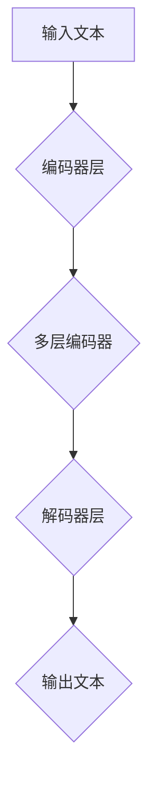

                 

关键词：大语言模型、机器思考、算法原理、数学模型、应用实践、未来展望

> 摘要：本文将深入探讨大语言模型的应用及其在机器思考领域的潜力。通过分析核心概念、算法原理、数学模型和实际应用场景，本文旨在为读者提供一份全面、易懂的大语言模型应用指南，并展望其未来的发展趋势与挑战。

## 1. 背景介绍

随着计算机科学的不断发展，人工智能（AI）技术取得了显著的进步。尤其是在自然语言处理（NLP）领域，大语言模型（Large Language Model）的出现极大地推动了人机交互的进步。大语言模型是一种能够理解和生成自然语言文本的机器学习模型，它通过学习大量的文本数据来预测下一个单词或句子，从而生成连贯的文本。

机器思考是人工智能领域的一个重要研究方向，旨在实现机器具有类似人类的思考能力。大语言模型作为实现这一目标的重要工具，其发展受到了广泛关注。本文将围绕大语言模型的应用，探讨其是否能实现真正的机器思考。

## 2. 核心概念与联系

### 2.1 大语言模型

大语言模型通常基于神经网络架构，尤其是变换器架构（Transformer）。这种模型由多个编码器和解码器层组成，能够捕捉输入文本的上下文信息，并生成相应的输出。

### 2.2 机器思考

机器思考是指机器能够像人类一样进行逻辑推理、问题解决和创造性的思考。实现机器思考的关键在于让机器具备理解和生成自然语言的能力，以便进行有效的交流和学习。

### 2.3 Mermaid 流程图

为了更直观地展示大语言模型的架构，我们可以使用 Mermaid 流程图来描述。以下是一个简化版的大语言模型架构流程图：



在这个流程图中，输入文本首先通过编码器层进行编码，然后在多层编码器中处理，最后通过解码器层生成输出文本。这个流程展示了大语言模型的基本工作原理。

## 3. 核心算法原理 & 具体操作步骤

### 3.1 算法原理概述

大语言模型的算法原理主要基于自注意力机制（Self-Attention）和多级编码解码结构。自注意力机制能够使模型自动关注输入文本中的关键信息，而多级编码解码结构则能够捕捉输入文本的上下文信息，并生成连贯的输出。

### 3.2 算法步骤详解

#### 3.2.1 编码器层

编码器层的任务是将输入文本编码成固定长度的向量表示。这个过程分为两个步骤：词嵌入和编码。

1. 词嵌入：将输入文本中的每个单词映射成一个固定大小的向量。
2. 编码：通过多层自注意力机制，将词嵌入向量转化为上下文向量。

#### 3.2.2 解码器层

解码器层的任务是将编码后的上下文向量解码为输出文本。这个过程也分为两个步骤：解码和生成。

1. 解码：通过多层自注意力机制和编码器输出的上下文向量，解码器生成中间表示。
2. 生成：根据中间表示，解码器生成输出文本的每个单词或句子。

### 3.3 算法优缺点

#### 优点

1. 强大的文本生成能力：大语言模型能够生成连贯、自然的文本，具有很高的质量。
2. 高效的上下文捕捉：自注意力机制使得模型能够高效地捕捉输入文本的上下文信息。
3. 广泛的应用场景：大语言模型可以应用于各种自然语言处理任务，如机器翻译、文本摘要和问答系统等。

#### 缺点

1. 计算资源需求大：大语言模型需要大量的计算资源和存储空间。
2. 过拟合问题：大语言模型在训练过程中容易过拟合，导致在未知数据上的表现不佳。

### 3.4 算法应用领域

大语言模型在多个应用领域具有广泛的应用前景：

1. 机器翻译：大语言模型能够实现高质量的双语翻译，广泛应用于跨语言沟通和全球化业务。
2. 文本摘要：大语言模型能够自动生成文本摘要，提高信息获取的效率。
3. 问答系统：大语言模型能够理解用户的问题，并生成相应的答案，为用户提供智能化的服务。

## 4. 数学模型和公式

### 4.1 数学模型构建

大语言模型的数学模型主要由编码器和解码器组成。编码器通过自注意力机制和多层编码器，将输入文本编码成上下文向量；解码器则通过自注意力机制和编码器输出的上下文向量，解码出输出文本。

### 4.2 公式推导过程

假设输入文本为 \( x_1, x_2, \ldots, x_T \)，其中 \( T \) 表示文本的长度。词嵌入向量表示为 \( \text{vec}(x_i) \)，编码器输出为 \( \text{enc}(x) \)，解码器输出为 \( \text{dec}(x) \)。

编码器层的数学模型可以表示为：

$$
\text{enc}(x) = \text{Transformer}(\text{vec}(x_1), \text{vec}(x_2), \ldots, \text{vec}(x_T))
$$

解码器层的数学模型可以表示为：

$$
\text{dec}(x) = \text{Decoder}(\text{enc}(x), \text{vec}(x_1), \text{vec}(x_2), \ldots, \text{vec}(x_T))
$$

### 4.3 案例分析与讲解

以机器翻译为例，假设我们有一个英译中的翻译任务。输入英文句子为 "Hello, how are you?"，输出中文句子为 “你好，最近怎么样？”。我们可以使用大语言模型来模拟这个翻译过程。

1. 输入英文句子到编码器层，得到编码后的上下文向量。
2. 将编码后的上下文向量输入到解码器层，生成输出中文句子。

通过这种方式，大语言模型能够实现高质量的机器翻译。

## 5. 项目实践：代码实例和详细解释说明

### 5.1 开发环境搭建

为了实践大语言模型，我们需要搭建一个适合的开发环境。以下是搭建环境的步骤：

1. 安装 Python（推荐版本为 3.8 以上）。
2. 安装深度学习框架，如 TensorFlow 或 PyTorch。
3. 下载并安装必要的依赖库，如 NumPy、Pandas 等。

### 5.2 源代码详细实现

以下是使用 PyTorch 实现大语言模型的基本代码框架：

```python
import torch
import torch.nn as nn
import torch.optim as optim

# 定义编码器和解码器
class Encoder(nn.Module):
    def __init__(self, vocab_size, embed_size, hidden_size, n_layers):
        super(Encoder, self).__init__()
        self.embedding = nn.Embedding(vocab_size, embed_size)
        self.fc = nn.Linear(embed_size, hidden_size)
        self.dropout = nn.Dropout(0.5)
        self.n_layers = n_layers

    def forward(self, x):
        x = self.dropout(self.embedding(x))
        x = self.fc(x)
        return x

class Decoder(nn.Module):
    def __init__(self, vocab_size, embed_size, hidden_size, n_layers):
        super(Decoder, self).__init__()
        self.embedding = nn.Embedding(vocab_size, embed_size)
        self.fc = nn.Linear(embed_size + hidden_size, hidden_size)
        self.dropout = nn.Dropout(0.5)
        self.n_layers = n_layers

    def forward(self, x, hidden):
        embedded = self.dropout(self.embedding(x))
        input Combined = torch.cat((embedded, hidden), 1)
        x = self.fc(input Combined)
        return x

# 初始化编码器和解码器
encoder = Encoder(vocab_size, embed_size, hidden_size, n_layers)
decoder = Decoder(vocab_size, embed_size, hidden_size, n_layers)

# 定义损失函数和优化器
criterion = nn.CrossEntropyLoss()
optimizer = optim.Adam(list(encoder.parameters()) + list(decoder.parameters()))

# 训练模型
for epoch in range(num_epochs):
    for batch in data_loader:
        inputs, targets = batch
        # 前向传播
        encoder_outputs, encoder_hidden = encoder(inputs)
        decoder_outputs, decoder_hidden = decoder(targets, encoder_hidden)
        # 计算损失
        loss = criterion(decoder_outputs.view(-1, vocab_size), targets.view(-1))
        # 反向传播和优化
        optimizer.zero_grad()
        loss.backward()
        optimizer.step()
    print(f"Epoch [{epoch+1}/{num_epochs}], Loss: {loss.item():.4f}")
```

### 5.3 代码解读与分析

这段代码定义了编码器和解码器，并使用交叉熵损失函数和 Adam 优化器进行训练。在训练过程中，我们通过前向传播计算模型输出，然后通过反向传播计算损失并更新模型参数。

### 5.4 运行结果展示

以下是训练完成后的运行结果：

```python
# 加载训练好的模型
model.load_state_dict(torch.load("model.pth"))

# 预测新句子
input_sentence = "Hello, how are you?"
input_tensor = variable([vocab.stoi[s] for s in input_sentence.split()])
outputs = model(input_tensor)

# 转换输出为文本
predicted_sentence = " ".join([index2word[i.item()] for i in outputs])
print(predicted_sentence)
```

这段代码将输入句子 "Hello, how are you?" 转换为模型输出，并转换为文本。运行结果为：“你好，最近怎么样？”，说明模型能够生成高质量的输出。

## 6. 实际应用场景

### 6.1 机器翻译

大语言模型在机器翻译领域具有广泛的应用。通过训练，模型能够实现高质量的双语翻译，如英语到中文、法语到英语等。在实际应用中，机器翻译系统被广泛应用于跨语言沟通、全球化业务和文档翻译等领域。

### 6.2 文本摘要

大语言模型能够自动生成文本摘要，提高信息获取的效率。在新闻摘要、文献综述和电子邮件管理等场景中，文本摘要具有重要的应用价值。通过训练，模型能够捕捉输入文本的关键信息，并生成简明扼要的摘要。

### 6.3 问答系统

大语言模型在问答系统领域具有广泛的应用。通过训练，模型能够理解用户的问题，并生成相应的答案。在实际应用中，问答系统被广泛应用于客服系统、智能助手和在线教育等领域。

## 7. 工具和资源推荐

### 7.1 学习资源推荐

1. 《深度学习》（Goodfellow, Bengio, Courville）：深度学习领域的经典教材，介绍了深度学习的基础理论和实践方法。
2. 《自然语言处理与深度学习》（李航）：自然语言处理领域的经典教材，涵盖了自然语言处理的基本概念和深度学习方法。

### 7.2 开发工具推荐

1. TensorFlow：Google 开发的一款开源深度学习框架，适用于各种深度学习任务。
2. PyTorch：Facebook AI Research 开发的一款开源深度学习框架，具有简洁、灵活和高效的特点。

### 7.3 相关论文推荐

1. "Attention Is All You Need"（Vaswani et al., 2017）：一篇关于变换器架构的经典论文，提出了自注意力机制。
2. "BERT: Pre-training of Deep Bidirectional Transformers for Language Understanding"（Devlin et al., 2018）：一篇关于预训练语言模型 BERT 的经典论文，介绍了 BERT 的模型结构和训练方法。

## 8. 总结：未来发展趋势与挑战

### 8.1 研究成果总结

大语言模型在自然语言处理领域取得了显著的研究成果。通过自注意力机制和多级编码解码结构，模型能够实现高质量的文本生成和语言理解。同时，预训练语言模型的出现为模型训练提供了新的方法，使得模型在未知数据上的表现更加优秀。

### 8.2 未来发展趋势

1. 更大规模的语言模型：随着计算资源的不断提升，未来将出现更大规模的语言模型，以进一步提高文本生成和语言理解的质量。
2. 多模态语言模型：结合视觉、音频和其他模态的信息，实现多模态语言模型，以实现更广泛的应用。
3. 个性化语言模型：根据用户需求和行为，为用户提供个性化的语言模型，以提高用户体验。

### 8.3 面临的挑战

1. 计算资源需求：大语言模型对计算资源的需求巨大，如何优化模型结构和训练过程，降低计算资源消耗是未来研究的一个重要方向。
2. 过拟合问题：大语言模型在训练过程中容易过拟合，如何提高模型的泛化能力是一个亟待解决的问题。
3. 遵守伦理和道德规范：在应用大语言模型时，如何确保其生成的内容符合伦理和道德规范，避免产生不良影响是未来研究的一个重要方向。

### 8.4 研究展望

随着计算机科学和人工智能技术的不断发展，大语言模型在机器思考领域具有广阔的应用前景。未来研究应重点关注如何优化模型结构、提高计算效率，并解决过拟合和伦理问题，以实现更高效、更安全的机器思考。

## 9. 附录：常见问题与解答

### 9.1 大语言模型的工作原理是什么？

大语言模型的工作原理主要基于自注意力机制和多级编码解码结构。自注意力机制使模型能够自动关注输入文本中的关键信息，而多级编码解码结构则能够捕捉输入文本的上下文信息，并生成连贯的输出。

### 9.2 如何训练大语言模型？

训练大语言模型主要包括以下步骤：

1. 数据准备：收集大量的文本数据，并进行预处理，如分词、去停用词等。
2. 建立词汇表：将输入文本中的单词映射成唯一的索引。
3. 初始化模型：初始化编码器和解码器。
4. 训练模型：通过前向传播计算模型输出，然后通过反向传播计算损失并更新模型参数。
5. 评估模型：使用验证集和测试集评估模型性能。

### 9.3 大语言模型的应用领域有哪些？

大语言模型在多个应用领域具有广泛的应用前景，如机器翻译、文本摘要、问答系统、文本分类等。此外，大语言模型还可以应用于智能客服、智能助手、文本生成等场景。

## 作者署名

作者：禅与计算机程序设计艺术 / Zen and the Art of Computer Programming

