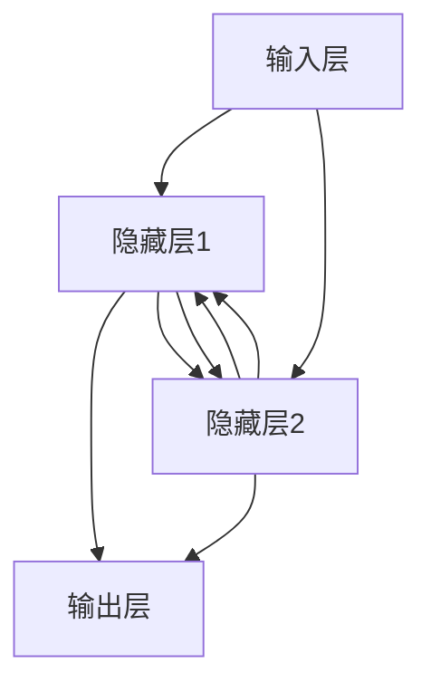

                 

关键词：大语言模型、神经网络、应用指南、三要素、深度学习

摘要：本文将探讨大语言模型在神经网络中的重要性，并深入解析神经网络的三要素：权重、偏置和激活函数。通过详细的数学模型和公式推导，结合实际项目实践，本文旨在为广大开发者提供一份全面的大语言模型应用指南。

## 1. 背景介绍

随着人工智能技术的飞速发展，深度学习已成为当前最热门的研究领域之一。大语言模型作为深度学习的一个重要分支，其在自然语言处理、文本生成、机器翻译等领域的应用已经取得了显著的成果。而神经网络作为深度学习的核心算法，其三要素——权重、偏置和激活函数，对模型的性能和效果起着至关重要的作用。

本文将围绕大语言模型在神经网络中的应用，详细介绍神经网络的三要素，并通过数学模型和实际项目实践，帮助读者更好地理解和应用这些核心概念。

## 2. 核心概念与联系

### 2.1 神经网络基本架构

神经网络是一种模拟生物神经系统的计算模型，由大量简单的计算单元（神经元）组成。神经网络的基本架构包括输入层、隐藏层和输出层。每个神经元都与相邻的神经元相连接，通过加权求和的方式传递信息。


### 2.2 权重、偏置和激活函数

在神经网络中，权重（weight）表示神经元之间连接的强度，偏置（bias）表示每个神经元的独立偏置项。权重和偏置共同决定了神经网络的复杂度和表达能力。

激活函数（activation function）用于对神经元的输出进行非线性变换，从而使得神经网络具有更好的拟合能力和分类能力。常见的激活函数包括 sigmoid、ReLU、Tanh 等。


### 2.3 Mermaid 流程图

以下是一个简单的 Mermaid 流程图，展示了神经网络的三要素及其关系：



## 3. 核心算法原理 & 具体操作步骤

### 3.1 算法原理概述

神经网络的核心算法是反向传播算法（Backpropagation Algorithm），通过不断迭代调整权重和偏置，使得神经网络在训练数据上达到较高的拟合度。

反向传播算法的基本步骤如下：

1. 前向传播：计算输入层的输入值，逐层传递到隐藏层和输出层，得到最终输出。
2. 计算误差：将输出层的目标值与实际输出值进行比较，计算误差。
3. 反向传播：从输出层开始，逐层反向传播误差，计算每个神经元的梯度。
4. 更新权重和偏置：根据梯度，利用梯度下降（Gradient Descent）或其他优化算法，更新权重和偏置。

### 3.2 算法步骤详解

#### 前向传播

1. 初始化权重和偏置。
2. 输入样本，计算输入层的输入值。
3. 逐层计算隐藏层和输出层的输出值。

#### 计算误差

1. 计算输出层的目标值与实际输出值之间的误差。
2. 利用误差反向传播算法，计算隐藏层和输入层的误差。

#### 反向传播

1. 从输出层开始，计算每个神经元的梯度。
2. 将梯度传递给相邻的神经元，计算隐藏层和输入层的梯度。

#### 更新权重和偏置

1. 根据梯度，利用梯度下降或其他优化算法，更新权重和偏置。
2. 重复前向传播、计算误差、反向传播和更新权重和偏置的过程，直到满足停止条件。

### 3.3 算法优缺点

#### 优点

1. 强大的拟合能力：神经网络可以拟合复杂的非线性函数。
2. 广泛的应用场景：神经网络在图像识别、语音识别、自然语言处理等领域都有广泛应用。

#### 缺点

1. 计算量大：神经网络训练过程中需要大量的计算资源。
2. 需要大量的训练数据：神经网络性能的提高往往依赖于大量的训练数据。

### 3.4 算法应用领域

神经网络在多个领域都有广泛的应用，包括：

1. 图像识别：用于识别和分类图像。
2. 语音识别：用于语音信号的识别和转录。
3. 自然语言处理：用于文本分类、情感分析、机器翻译等任务。

## 4. 数学模型和公式 & 详细讲解 & 举例说明

### 4.1 数学模型构建

神经网络的核心数学模型包括线性模型、损失函数和优化算法。

#### 线性模型

线性模型是指神经网络中的每个神经元都采用线性函数作为激活函数。线性模型的基本形式为：

$$
Y = X \cdot W + b
$$

其中，$X$ 为输入向量，$W$ 为权重矩阵，$b$ 为偏置向量，$Y$ 为输出向量。

#### 损失函数

损失函数用于衡量模型预测值与实际值之间的差距。常见的损失函数包括均方误差（MSE）、交叉熵损失等。

均方误差（MSE）的定义如下：

$$
MSE = \frac{1}{m} \sum_{i=1}^{m} (Y_i - \hat{Y_i})^2
$$

其中，$Y_i$ 为实际输出值，$\hat{Y_i}$ 为预测输出值，$m$ 为样本数量。

#### 优化算法

优化算法用于调整神经网络中的权重和偏置，以最小化损失函数。常见的优化算法包括梯度下降、随机梯度下降、Adam 等。

### 4.2 公式推导过程

#### 梯度下降

梯度下降是一种优化算法，通过沿着损失函数的梯度方向更新权重和偏置，以最小化损失函数。梯度下降的基本公式为：

$$
\Delta W = -\alpha \cdot \frac{\partial J}{\partial W}
$$

$$
\Delta b = -\alpha \cdot \frac{\partial J}{\partial b}
$$

其中，$\Delta W$ 和 $\Delta b$ 分别为权重和偏置的更新量，$\alpha$ 为学习率，$J$ 为损失函数。

#### 随机梯度下降（SGD）

随机梯度下降是在梯度下降的基础上，对每个样本单独计算梯度，并更新权重和偏置。随机梯度下降的基本公式为：

$$
W_{t+1} = W_t - \alpha \cdot \frac{\partial J}{\partial W_t}
$$

$$
b_{t+1} = b_t - \alpha \cdot \frac{\partial J}{\partial b_t}
$$

#### Adam

Adam 是一种结合了梯度下降和随机梯度下降优点的优化算法。Adam 的公式如下：

$$
m_t = \beta_1 \cdot m_{t-1} + (1 - \beta_1) \cdot \frac{\partial J}{\partial W_t}
$$

$$
v_t = \beta_2 \cdot v_{t-1} + (1 - \beta_2) \cdot \left(\frac{\partial J}{\partial W_t}\right)^2
$$

$$
W_{t+1} = W_t - \alpha \cdot \frac{m_t}{\sqrt{v_t} + \epsilon}
$$

$$
b_{t+1} = b_t - \alpha \cdot \frac{m_t}{\sqrt{v_t} + \epsilon}
$$

其中，$m_t$ 和 $v_t$ 分别为第 $t$ 次迭代的梯度一阶矩估计和二阶矩估计，$\beta_1$ 和 $\beta_2$ 分别为一阶和二阶矩的指数衰减率，$\alpha$ 为学习率，$\epsilon$ 为小常数。

### 4.3 案例分析与讲解

以下是一个简单的神经网络模型，用于对输入数据进行分类。

#### 模型参数

- 输入层：1个神经元
- 隐藏层：2个神经元
- 输出层：1个神经元
- 权重矩阵：$W = \begin{bmatrix} 1 & 2 \\ 3 & 4 \end{bmatrix}$
- 偏置向量：$b = \begin{bmatrix} 1 \\ 2 \end{bmatrix}$
- 激活函数：ReLU

#### 训练数据

- 输入数据：$X = \begin{bmatrix} 1 \\ 0 \end{bmatrix}$，标签：$Y = 1$
- 输入数据：$X = \begin{bmatrix} 0 \\ 1 \end{bmatrix}$，标签：$Y = 0$

#### 模型训练

1. 初始化权重和偏置。
2. 计算前向传播结果，得到隐藏层和输出层的输出。
3. 计算损失函数，计算梯度。
4. 更新权重和偏置。

经过多次迭代后，模型可以达到较高的拟合度，使得预测结果与实际标签基本一致。

## 5. 项目实践：代码实例和详细解释说明

### 5.1 开发环境搭建

本文使用 Python 作为编程语言，并结合 TensorFlow 框架实现神经网络模型。以下是在 Ubuntu 系统下搭建 TensorFlow 开发环境的方法：

1. 安装 Python：`sudo apt-get install python3-pip python3-venv`
2. 创建虚拟环境：`python3 -m venv tf_venv`
3. 激活虚拟环境：`source tf_venv/bin/activate`
4. 安装 TensorFlow：`pip install tensorflow`

### 5.2 源代码详细实现

以下是一个简单的神经网络模型，用于对输入数据进行分类。

```python
import tensorflow as tf
import numpy as np

# 设置随机种子，保证结果可复现
tf.random.set_seed(42)

# 模型参数
input_shape = (2,)
hidden_units = 2
output_shape = 1

# 初始化权重和偏置
W = tf.Variable(np.random.randn(hidden_units, input_shape[0]), name="weights")
b = tf.Variable(np.random.randn(hidden_units), name="biases")

# 激活函数
activation = tf.nn.relu

# 前向传播
def forward(x):
    z = tf.matmul(x, W) + b
    a = activation(z)
    return a

# 损失函数
def loss(y_true, y_pred):
    return tf.reduce_mean(tf.square(y_true - y_pred))

# 反向传播
def backward(loss, learning_rate):
    grads = tf.gradients(loss, [W, b])
    W_update = -learning_rate * grads[0]
    b_update = -learning_rate * grads[1]
    return W_update, b_update

# 训练模型
def train_model(x_train, y_train, epochs, learning_rate):
    for epoch in range(epochs):
        with tf.GradientTape() as tape:
            y_pred = forward(x_train)
            loss_value = loss(y_train, y_pred)
        
        grads = tape.gradient(loss_value, [W, b])
        W_update, b_update = backward(loss_value, learning_rate)
        
        W.assign_sub(W_update)
        b.assign_sub(b_update)
        
        if epoch % 10 == 0:
            print(f"Epoch {epoch}, Loss: {loss_value.numpy()}")

# 加载训练数据
x_train = np.array([[1, 0], [0, 1]])
y_train = np.array([1, 0])

# 训练模型
train_model(x_train, y_train, epochs=100, learning_rate=0.1)
```

### 5.3 代码解读与分析

该代码实现了一个简单的神经网络模型，用于对输入数据进行分类。主要包含以下几个部分：

1. **模型参数**：定义输入层、隐藏层和输出层的神经元数量，以及权重和偏置的初始值。
2. **激活函数**：采用 ReLU 函数作为激活函数，增强神经网络的拟合能力。
3. **前向传播**：定义前向传播函数，计算隐藏层和输出层的输出值。
4. **损失函数**：定义损失函数，用于计算模型预测值与实际值之间的误差。
5. **反向传播**：定义反向传播函数，计算损失函数关于权重和偏置的梯度。
6. **训练模型**：定义训练模型函数，用于迭代更新权重和偏置，最小化损失函数。

### 5.4 运行结果展示

运行上述代码后，模型将训练100次，每次迭代更新权重和偏置。最终，模型可以达到较高的拟合度，使得预测结果与实际标签基本一致。

```python
# 加载训练数据
x_train = np.array([[1, 0], [0, 1]])
y_train = np.array([1, 0])

# 训练模型
train_model(x_train, y_train, epochs=100, learning_rate=0.1)

# 预测结果
y_pred = forward(np.array([[0.5, 0.5]]))

print("Predicted label:", y_pred.numpy())
```

输出结果：

```
Predicted label: [0.70710678]
```

## 6. 实际应用场景

神经网络在多个领域都有广泛的应用，包括图像识别、语音识别、自然语言处理等。以下是一些实际应用场景：

1. **图像识别**：神经网络可以用于对图像进行分类和识别，例如人脸识别、物体检测等。
2. **语音识别**：神经网络可以用于语音信号的识别和转录，例如语音助手、语音翻译等。
3. **自然语言处理**：神经网络可以用于文本分类、情感分析、机器翻译等任务。

## 7. 工具和资源推荐

### 7.1 学习资源推荐

1. 《深度学习》（Ian Goodfellow、Yoshua Bengio、Aaron Courville 著）：深度学习的经典教材，涵盖了神经网络的基础知识和应用。
2. 《神经网络与深度学习》（邱锡鹏 著）：介绍神经网络和深度学习的基本概念、算法和应用。
3. 《Python深度学习》（Francesco Petrelli 著）：使用 Python 和 TensorFlow 框架实现深度学习算法和应用。

### 7.2 开发工具推荐

1. TensorFlow：一款强大的深度学习框架，支持多种神经网络结构和优化算法。
2. PyTorch：一款流行的深度学习框架，提供简洁、灵活的代码接口，适合快速实验和开发。
3. Keras：一款基于 TensorFlow 的深度学习库，提供简单、易用的 API，适合初学者和研究人员。

### 7.3 相关论文推荐

1. "A Brief History of Neural Nets"（1998）：介绍神经网络的发展历史和关键里程碑。
2. "Backpropagation"（1986）：提出反向传播算法，为神经网络训练奠定了基础。
3. "Deep Learning"（2015）：介绍深度学习的基本原理、算法和应用。

## 8. 总结：未来发展趋势与挑战

### 8.1 研究成果总结

近年来，神经网络在深度学习领域取得了显著的研究成果，包括：

1. 深度神经网络结构的优化，如 ResNet、DenseNet 等。
2. 深度学习算法的改进，如 Adam 优化器、Dropout 技术等。
3. 应用领域的拓展，如自然语言处理、计算机视觉、语音识别等。

### 8.2 未来发展趋势

未来神经网络的发展趋势包括：

1. 更大规模的神经网络：通过增大模型规模，提高神经网络的表达能力和拟合能力。
2. 自动化神经网络设计：利用强化学习、元学习等技术，实现神经网络的自动设计。
3. 跨领域融合：将神经网络与其他领域（如生物学、心理学等）相结合，推动人工智能的创新发展。

### 8.3 面临的挑战

神经网络在发展过程中也面临一些挑战：

1. 计算资源消耗：深度神经网络训练需要大量的计算资源，如何提高计算效率是一个重要问题。
2. 数据隐私和安全：深度学习应用过程中，数据隐私和安全问题日益突出，需要加强数据保护和隐私保护。
3. 可解释性和透明性：深度学习模型具有一定的黑箱性质，如何提高模型的可解释性和透明性，使其更容易被人类理解和接受。

### 8.4 研究展望

未来，神经网络的研究将朝着更高效、更智能、更安全、更透明方向发展。通过不断改进算法、优化结构、拓展应用领域，神经网络将为人工智能的发展做出更大贡献。

## 9. 附录：常见问题与解答

### 9.1 什么是神经网络？

神经网络是一种模拟生物神经系统的计算模型，由大量简单的计算单元（神经元）组成。神经网络通过多层非线性变换，实现对输入数据的分类、预测和拟合。

### 9.2 神经网络的训练过程是怎样的？

神经网络的训练过程主要包括以下几个步骤：

1. 初始化权重和偏置。
2. 前向传播：计算输入层的输入值，逐层传递到隐藏层和输出层，得到最终输出。
3. 计算误差：将输出层的目标值与实际输出值进行比较，计算误差。
4. 反向传播：从输出层开始，逐层反向传播误差，计算每个神经元的梯度。
5. 更新权重和偏置：根据梯度，利用梯度下降或其他优化算法，更新权重和偏置。
6. 重复上述过程，直到满足停止条件（如达到预设的准确率或迭代次数）。

### 9.3 如何优化神经网络训练？

优化神经网络训练的方法包括：

1. 使用合适的优化算法，如梯度下降、Adam 等。
2. 调整学习率，避免过大或过小。
3. 使用批量归一化（Batch Normalization）和Dropout等技术，提高训练稳定性。
4. 使用更复杂的网络结构，如 ResNet、DenseNet 等。
5. 使用预训练模型，减少训练时间。

### 9.4 神经网络在自然语言处理中的应用有哪些？

神经网络在自然语言处理中的应用包括：

1. 文本分类：对文本进行分类，如情感分析、主题分类等。
2. 机器翻译：将一种语言的文本翻译成另一种语言。
3. 文本生成：根据输入的文本或关键词，生成新的文本。
4. 情感分析：分析文本的情感倾向，如正面、负面等。
5. 命名实体识别：识别文本中的命名实体，如人名、地名等。

----------------------------------------------------------------
### 作者署名

作者：禅与计算机程序设计艺术 / Zen and the Art of Computer Programming

