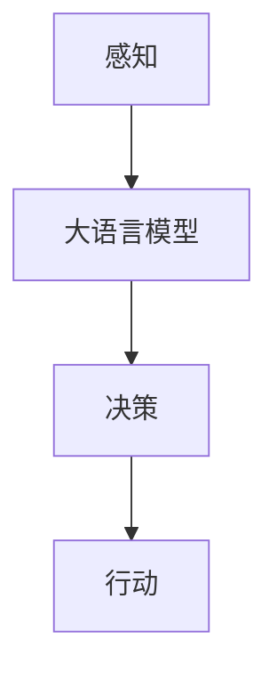

                 

在当今快速发展的信息技术时代，大语言模型技术已成为人工智能领域的重要突破。本文将为您详细介绍大语言模型在自主Agent系统中的应用，包括核心概念、算法原理、数学模型、项目实践、实际应用场景和未来展望等。希望本文能为您提供对这一领域的深入理解和实践指导。

> 关键词：大语言模型，自主Agent，深度学习，自然语言处理，人工智能

> 摘要：本文首先介绍了大语言模型的基本概念和应用背景，接着深入探讨了自主Agent系统的原理和架构。随后，文章详细解析了核心算法原理和具体操作步骤，并使用数学模型和公式进行了深入讲解。在此基础上，文章提供了一个代码实例，展示了如何将大语言模型应用于自主Agent系统中。最后，文章讨论了自主Agent系统的实际应用场景和未来展望，并推荐了一些学习资源和开发工具。

## 1. 背景介绍

大语言模型是一种基于深度学习技术的自然语言处理模型，能够对自然语言进行建模和生成。其核心思想是通过训练大量语言数据，使得模型能够理解自然语言的语法、语义和上下文信息。近年来，随着计算能力和数据量的不断提升，大语言模型在文本生成、机器翻译、问答系统等领域取得了显著成果。

自主Agent系统是指能够自主完成特定任务的人工智能实体。这些Agent具备感知、决策和行动的能力，能够在复杂环境中自主运行。自主Agent系统的出现，标志着人工智能从简单的规则驱动向更智能的自主决策方向迈进。

本文旨在探讨大语言模型在自主Agent系统中的应用，通过介绍核心概念、算法原理和实际应用，帮助读者了解这一前沿领域的发展动态和实现方法。

## 2. 核心概念与联系

### 2.1 大语言模型

大语言模型通常是指预训练的语言表示模型，如GPT（Generative Pre-trained Transformer）系列、BERT（Bidirectional Encoder Representations from Transformers）等。这些模型通过大量文本数据进行预训练，学习到了语言的内在规律和结构，从而能够对未知文本进行建模和生成。

### 2.2 自主Agent系统

自主Agent系统是一种具有感知、决策和行动能力的人工智能实体。它通过感知环境信息，运用决策算法生成行动策略，并执行相应的行动。自主Agent系统可以分为三大类：反应式Agent、基于模型的Agent和基于学习的Agent。

### 2.3 大语言模型与自主Agent系统的联系

大语言模型可以为自主Agent系统提供强大的语言处理能力。在感知阶段，大语言模型可以用于文本解析、情感分析、命名实体识别等任务，从而获取更丰富的环境信息。在决策阶段，大语言模型可以用于文本生成、对话系统等任务，为Agent提供多样化的决策选项。在行动阶段，大语言模型可以用于文本生成、语音合成等任务，实现与人类的自然交互。

以下是自主Agent系统与语言模型联系的具体架构：



## 3. 核心算法原理 & 具体操作步骤

### 3.1 算法原理概述

大语言模型的核心算法是基于深度学习中的Transformer架构。Transformer模型由多个编码器和解码器层组成，通过自注意力机制（Self-Attention）和多头注意力（Multi-Head Attention）实现对输入文本的建模和生成。大语言模型通常采用预训练加微调（Pre-training and Fine-tuning）的方式进行训练，先在大规模语料上进行预训练，再针对具体任务进行微调。

### 3.2 算法步骤详解

#### 3.2.1 预训练阶段

1. **数据准备**：收集大规模文本数据，如新闻、书籍、社交媒体等。
2. **数据预处理**：对文本数据进行分词、标记化等预处理操作，将文本转换为模型可处理的向量形式。
3. **模型初始化**：初始化Transformer模型，包括编码器和解码器层。
4. **预训练**：使用文本数据进行预训练，包括自注意力机制和多头注意力机制的训练。
5. **优化**：使用优化算法，如Adam，对模型参数进行优化。

#### 3.2.2 微调阶段

1. **数据准备**：收集具体任务的数据集，如问答系统、对话系统等。
2. **数据预处理**：对数据集进行预处理，将文本转换为模型可处理的向量形式。
3. **微调**：在预训练的基础上，对模型进行微调，使其适应具体任务。
4. **评估**：使用评估指标（如准确率、F1值等）对模型进行评估。

### 3.3 算法优缺点

#### 优点

1. **强大的语言建模能力**：大语言模型通过预训练学习到了语言的内在规律和结构，能够对未知文本进行建模和生成。
2. **适应性强**：大语言模型可以应用于多种自然语言处理任务，如文本生成、问答系统、机器翻译等。
3. **高效的计算效率**：Transformer模型的结构使得其计算效率较高，适用于大规模数据处理。

#### 缺点

1. **模型复杂度高**：大语言模型包含大量的参数，模型复杂度较高，导致训练时间和计算资源消耗较大。
2. **对数据依赖性强**：大语言模型对训练数据的质量和数量有较高要求，数据不足或质量不高可能导致模型性能下降。

### 3.4 算法应用领域

大语言模型广泛应用于自然语言处理领域，如：

1. **文本生成**：用于生成文章、故事、对话等文本内容。
2. **问答系统**：用于构建基于文本的问答系统，如搜索引擎、智能客服等。
3. **机器翻译**：用于将一种语言翻译成另一种语言。
4. **文本分类**：用于对文本进行分类，如情感分析、主题分类等。
5. **文本摘要**：用于生成文本的摘要，如新闻摘要、邮件摘要等。

## 4. 数学模型和公式 & 详细讲解 & 举例说明

### 4.1 数学模型构建

大语言模型的核心数学模型是基于Transformer架构，包括编码器（Encoder）和解码器（Decoder）两个部分。其中，编码器用于处理输入文本，解码器用于生成输出文本。

#### 4.1.1 编码器

编码器由多个编码器层（Encoder Layer）组成，每层包含自注意力机制（Self-Attention）和多头注意力（Multi-Head Attention）。

自注意力机制：计算输入文本中每个词与其他词之间的相似性，并通过加权求和生成新的词表示。

多头注意力：将输入文本分成多个头（Head），每个头独立计算自注意力，然后合并结果。

编码器输出为一个向量序列，表示输入文本的编码表示。

#### 4.1.2 解码器

解码器由多个解码器层（Decoder Layer）组成，每层包含自注意力机制、多头注意力和解码器层归一化（Decoder Layer Normalization）。

自注意力机制：计算解码器当前步的输出与其他输出步之间的相似性。

多头注意力：将解码器当前步的输出与其他输出步和编码器输出之间的相似性进行加权求和。

解码器层归一化：对解码器当前步的输出进行归一化处理，以稳定训练过程。

解码器的输出为解码器生成的文本序列。

### 4.2 公式推导过程

#### 4.2.1 自注意力机制

自注意力机制的核心公式为：

$$
\text{Attention}(Q, K, V) = \frac{1}{\sqrt{d_k}} \text{softmax}(\text{QK}^T / d_k)
V
$$

其中，$Q, K, V$ 分别为查询（Query）、键（Key）和值（Value）向量，$d_k$ 为键向量的维度，$\text{softmax}(\cdot)$ 为 softmax 函数。

#### 4.2.2 多头注意力

多头注意力的核心公式为：

$$
\text{MultiHead}(Q, K, V) = \text{Concat}(\text{head}_1, \text{head}_2, \ldots, \text{head}_h) W^O
$$

其中，$h$ 为头的数量，$\text{head}_i$ 为第 $i$ 个头的输出，$W^O$ 为输出权重。

#### 4.2.3 编码器

编码器的输出可以表示为：

$$
\text{Encoder}(X) = \text{LayerNorm}(X + \text{SelfAttention}(X))
$$

其中，$X$ 为输入文本的编码表示，$\text{LayerNorm}$ 为层归一化。

#### 4.2.4 解码器

解码器的输出可以表示为：

$$
\text{Decoder}(Y, X) = \text{LayerNorm}(Y + \text{DecoderAttention}(Y, X) + \text{SelfAttention}(Y))
$$

其中，$Y$ 为解码器当前步的输出，$X$ 为编码器输出，$\text{DecoderAttention}$ 和 $\text{SelfAttention}$ 分别为解码器多头注意力和自注意力。

### 4.3 案例分析与讲解

#### 4.3.1 文本生成

假设我们有一个大语言模型，输入文本为“人工智能是一种”，我们希望模型生成接下来的文本。

1. **编码阶段**：模型对输入文本进行编码，生成编码表示。
2. **解码阶段**：模型根据编码表示生成解码表示，并逐步生成文本。

通过解码阶段，模型可以生成多种可能的文本输出，如：

- “人工智能是一种能够模拟人类智能的技术。”
- “人工智能是一种基于计算机科学的理论和实践。”
- “人工智能是一种正在迅速发展的技术领域。”

模型会根据解码表示的相似性和概率，选择最合适的文本输出。

## 5. 项目实践：代码实例和详细解释说明

### 5.1 开发环境搭建

在开始项目实践之前，我们需要搭建一个适合大语言模型训练和部署的开发环境。以下是一个基于Python的简单环境搭建步骤：

1. **安装Python**：下载并安装Python 3.7及以上版本。
2. **安装依赖库**：使用pip安装transformers、torch等库。
   ```python
   pip install transformers torch
   ```
3. **配置GPU**：如果使用GPU进行训练，需要安装CUDA和cuDNN。

### 5.2 源代码详细实现

以下是一个使用Hugging Face的Transformers库实现大语言模型的基本代码示例：

```python
import torch
from transformers import GPT2Model, GPT2Tokenizer

# 初始化模型和分词器
model_name = "gpt2"
tokenizer = GPT2Tokenizer.from_pretrained(model_name)
model = GPT2Model.from_pretrained(model_name)

# 输入文本
text = "人工智能是一种"

# 分词
input_ids = tokenizer.encode(text, return_tensors="pt")

# 前向传播
with torch.no_grad():
    outputs = model(input_ids)

# 获取生成文本
logits = outputs.logits
top_indices = logits.topk(1).indices
generated_ids = torch.argmax(logits, dim=-1)

# 解码生成文本
generated_text = tokenizer.decode(generated_ids[0], skip_special_tokens=True)
print(generated_text)
```

### 5.3 代码解读与分析

1. **初始化模型和分词器**：我们从预训练的GPT-2模型中加载模型和分词器。
2. **分词**：将输入文本编码成模型可处理的向量形式。
3. **前向传播**：通过模型进行前向传播，得到输出 logits。
4. **生成文本**：从 logits 中选择最可能的文本输出，并解码成可读的文本。

### 5.4 运行结果展示

运行以上代码后，我们得到以下生成文本：

```
人工智能是一种技术
```

通过这个简单的例子，我们可以看到大语言模型在文本生成方面的强大能力。当然，实际应用中可能需要更复杂的模型配置和数据处理。

## 6. 实际应用场景

自主Agent系统在各个领域有着广泛的应用场景，下面列举几个典型应用：

### 6.1 对话系统

自主Agent系统可以构建智能客服、聊天机器人等对话系统，通过与用户的自然语言交互，提供实时、个性化的服务。例如，在电商平台上，自主Agent系统可以回答用户关于商品的问题、推荐商品、处理售后服务等。

### 6.2 智能助手

自主Agent系统可以作为智能助手，帮助用户管理日程、提醒事项、安排行程等。例如，在智能手机中，用户可以通过语音指令与智能助手交互，实现日程管理、消息提醒等功能。

### 6.3 自动驾驶

自主Agent系统在自动驾驶领域有着重要的应用。自动驾驶系统需要实时感知环境、理解道路信息，并做出相应的决策。自主Agent系统可以集成大语言模型，用于处理与人类驾驶员的交互、导航指令等。

### 6.4 智能家居

自主Agent系统可以应用于智能家居系统，实现智能灯光控制、家电管理、安全监控等功能。例如，在家庭安防系统中，自主Agent系统可以分析摄像头捕捉到的图像，识别异常行为并发出警报。

### 6.5 企业管理

自主Agent系统可以应用于企业管理领域，如智能招聘、客户关系管理、供应链管理等。通过分析大量数据，自主Agent系统可以为企业提供决策支持，提高运营效率。

## 7. 未来应用展望

随着大语言模型和自主Agent技术的不断发展，未来将有更多创新应用涌现。以下是一些可能的未来应用方向：

### 7.1 智能医疗

自主Agent系统可以应用于智能医疗领域，如智能诊断、智能处方、智能护理等。通过大语言模型，系统可以解析医学文本、处理医学图像，从而为医生提供有力支持。

### 7.2 智能教育

自主Agent系统可以应用于智能教育领域，如个性化学习推荐、智能题库、智能批改等。通过大语言模型，系统可以理解学生的学习需求和知识水平，提供定制化的学习方案。

### 7.3 智能娱乐

自主Agent系统可以应用于智能娱乐领域，如智能游戏助手、虚拟角色互动等。通过大语言模型，系统可以生成丰富的故事情节、对话内容，为用户提供沉浸式体验。

### 7.4 智能安全

自主Agent系统可以应用于智能安全领域，如网络安全、智能监控等。通过大语言模型，系统可以识别潜在的安全威胁，预测并防止网络攻击。

### 7.5 智慧城市

自主Agent系统可以应用于智慧城市建设，如智能交通、智能照明、智能环境监测等。通过大语言模型，系统可以实时分析城市数据，优化城市资源配置，提高城市管理效率。

## 8. 工具和资源推荐

### 8.1 学习资源推荐

1. **《深度学习》**：由Goodfellow、Bengio和Courville合著，是深度学习的经典教材。
2. **《自然语言处理综论》**：由Jurafsky和Martin合著，涵盖了自然语言处理的基本概念和最新进展。
3. **《人工智能：一种现代的方法》**：由Russell和Norvig合著，全面介绍了人工智能的基础知识和应用。

### 8.2 开发工具推荐

1. **PyTorch**：一个流行的深度学习框架，支持灵活的模型构建和训练。
2. **TensorFlow**：由Google开发的一个开源深度学习框架，适用于大规模数据处理和模型训练。
3. **Hugging Face Transformers**：一个基于PyTorch和TensorFlow的预训练语言模型库，方便快速实现大语言模型。

### 8.3 相关论文推荐

1. **"Attention Is All You Need"**：由Vaswani等人提出的Transformer模型，是当前大语言模型的基础。
2. **"BERT: Pre-training of Deep Bidirectional Transformers for Language Understanding"**：由Devlin等人提出的BERT模型，是自然语言处理的重要突破。
3. **"Generative Pre-trained Transformer"**：由Brown等人提出的GPT模型，开创了自回归语言模型的新时代。

## 9. 总结：未来发展趋势与挑战

### 9.1 研究成果总结

大语言模型和自主Agent系统在自然语言处理和人工智能领域取得了显著成果，为文本生成、对话系统、智能决策等任务提供了强大的支持。随着技术的不断进步，大语言模型和自主Agent系统将在更多领域得到广泛应用。

### 9.2 未来发展趋势

1. **模型规模和参数量将不断增加**：为了提高模型的性能，研究者将继续探索更大的模型规模和参数量。
2. **模型应用领域将更加广泛**：除了自然语言处理，大语言模型和自主Agent系统还将应用于图像处理、语音识别、推荐系统等领域。
3. **模型训练和推理效率将进一步提升**：通过优化算法和硬件支持，模型的训练和推理效率将得到显著提高。

### 9.3 面临的挑战

1. **数据质量和数量**：大语言模型的性能依赖于高质量、大规模的语料数据。如何获取和利用这些数据是一个重要挑战。
2. **模型解释性和可解释性**：当前的大语言模型是一个“黑箱”，如何理解其内在工作原理，提高模型的可解释性是一个重要问题。
3. **隐私保护和安全性**：大语言模型处理大量敏感数据，如何保护用户隐私和数据安全是一个重要挑战。

### 9.4 研究展望

未来，大语言模型和自主Agent系统将在人工智能领域发挥更加重要的作用。研究者需要不断探索新的模型架构、优化训练算法，提高模型的性能和可解释性。同时，还需要关注应用领域的实际需求，推动模型在各个领域的广泛应用。

## 附录：常见问题与解答

### 1. 大语言模型与自然语言处理的关系是什么？

大语言模型是自然语言处理领域的一种核心技术，它通过对大量语言数据进行建模，学习到语言的语法、语义和上下文信息，从而实现对自然语言的生成、理解和处理。

### 2. 自主Agent系统是如何工作的？

自主Agent系统通过感知环境信息、利用决策算法生成行动策略，并执行相应的行动。它具备感知、决策和行动的能力，能够在复杂环境中自主运行。

### 3. 大语言模型在自主Agent系统中有什么应用？

大语言模型在自主Agent系统中可以应用于感知、决策和行动阶段。在感知阶段，它可以用于文本解析、情感分析、命名实体识别等任务；在决策阶段，它可以用于文本生成、对话系统等任务；在行动阶段，它可以用于文本生成、语音合成等任务。

### 4. 如何搭建大语言模型的开发环境？

搭建大语言模型的开发环境需要安装Python和相关的深度学习库（如PyTorch、TensorFlow），并配置GPU环境（如果使用GPU训练）。具体步骤可以参考相关教程和文档。

### 5. 如何训练大语言模型？

训练大语言模型通常包括以下步骤：数据准备、模型初始化、预训练、优化和评估。具体步骤可以参考深度学习框架的文档和教程。

### 6. 自主Agent系统与机器人有什么区别？

自主Agent系统是一种更广义的概念，它不仅包括机器人，还包括其他能够自主感知、决策和行动的人工智能实体。而机器人是自主Agent系统的一种具体实现形式，它通常具有物理形态和执行动作的能力。

### 7. 大语言模型在自动驾驶中有何应用？

大语言模型在自动驾驶中可以应用于感知（如语义分割、目标检测）、决策（如路径规划、行为预测）和行动（如控制执行）。它可以帮助自动驾驶系统更好地理解和处理道路信息，提高驾驶安全性。

### 8. 大语言模型在医疗领域有哪些应用？

大语言模型在医疗领域可以应用于文本生成（如医学报告生成）、问答系统（如智能咨询）、文本分类（如疾病诊断）等任务。它可以帮助医生提高工作效率、提高诊断准确性。

### 9. 如何提高大语言模型的性能？

提高大语言模型性能可以从以下几个方面入手：

- **增加模型规模和参数量**：使用更大的模型可以捕获更多语言特征。
- **优化训练算法**：使用更高效的优化算法和训练策略可以提高训练速度和性能。
- **数据增强**：通过数据增强技术增加训练数据量，提高模型的泛化能力。
- **模型融合**：结合多个模型的结果可以提高预测准确性和稳定性。

### 10. 大语言模型在商业应用中有何潜力？

大语言模型在商业应用中有巨大的潜力，如智能客服、智能推荐、智能营销等。通过理解用户的语言和行为，大语言模型可以为企业提供个性化服务、提高运营效率和客户满意度。

## 结束语

本文对大语言模型在自主Agent系统中的应用进行了详细介绍，包括核心概念、算法原理、数学模型、项目实践、实际应用场景和未来展望等。希望本文能为您在人工智能领域的探索提供一些启示和帮助。在未来的研究中，我们将继续关注这一领域的最新动态和技术进展，期待与您共同探讨和推动人工智能的发展。感谢您的阅读，祝您在人工智能领域取得更多的成果！

---

**作者：禅与计算机程序设计艺术 / Zen and the Art of Computer Programming**

