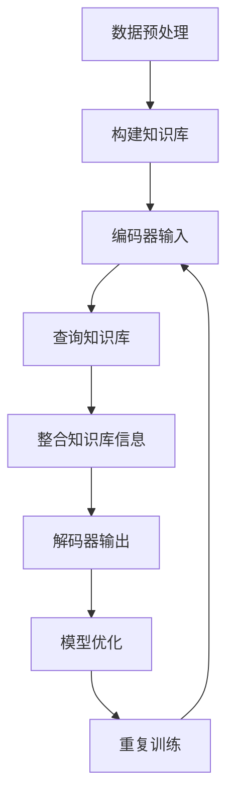

                 

## 1. 背景介绍

大语言模型（Large Language Models）是目前自然语言处理（Natural Language Processing, NLP）领域的一个重大突破。随着深度学习和人工智能技术的不断进步，大语言模型在生成文本、机器翻译、情感分析、问答系统等方面取得了令人瞩目的成果。其中，prompt学习作为一种新型的训练方式，为大规模语言模型的优化提供了新的思路。

prompt学习，又称提示学习（Prompt Learning），是一种利用外部知识库（如问答系统、百科全书等）辅助训练语言模型的方法。这种方法不仅提高了模型对特定领域知识的理解能力，还能增强模型在特定任务上的性能。本文将详细介绍大语言模型的prompt学习原理，并通过具体代码实例讲解如何实现prompt学习。

## 2. 核心概念与联系

### 2.1 大语言模型的基本概念

大语言模型是一种基于深度学习的文本生成模型，通常采用Transformer架构。它通过学习大规模语料库中的文本数据，能够预测下一个词的概率分布，从而生成连贯的文本。大语言模型的主要组成部分包括：

- **嵌入层（Embedding Layer）**：将输入的单词或字符转换为向量表示。
- **编码器（Encoder）**：对输入文本序列进行处理，提取语义信息。
- **解码器（Decoder）**：根据编码器的输出生成预测的文本序列。

### 2.2 prompt学习的原理

prompt学习是一种基于外部知识库的训练方法。其核心思想是在训练过程中引入外部知识库，通过查询和整合外部知识库的信息，提升语言模型对特定领域的理解能力。prompt学习的关键步骤包括：

- **知识库的构建**：构建一个包含特定领域知识的外部知识库。
- **查询和整合**：在训练过程中，根据输入的文本查询知识库，并将查询结果整合到模型训练过程中。
- **模型优化**：通过在训练过程中引入外部知识库的信息，优化模型的参数。

### 2.3 Mermaid 流程图

以下是prompt学习的大致流程图：



## 3. 核心算法原理 & 具体操作步骤

### 3.1 算法原理概述

prompt学习的核心在于将外部知识库的信息整合到模型训练过程中，从而提高模型对特定领域的理解能力。具体步骤如下：

1. **数据预处理**：对训练数据进行预处理，包括文本清洗、分词、编码等。
2. **构建知识库**：从外部数据源（如问答系统、百科全书等）中提取知识，构建一个外部知识库。
3. **编码器输入**：将输入的文本序列传递给编码器，提取文本的语义信息。
4. **查询知识库**：根据输入文本的语义信息，查询外部知识库，获取相关的知识信息。
5. **整合知识库信息**：将查询得到的知识信息整合到模型的输入中，丰富模型的语义信息。
6. **解码器输出**：解码器根据编码器的输出和整合的知识库信息生成预测的文本序列。
7. **模型优化**：通过在训练过程中引入外部知识库的信息，优化模型的参数。
8. **重复训练**：重复上述步骤，直至达到训练目标。

### 3.2 算法步骤详解

#### 步骤1：数据预处理

数据预处理是训练语言模型的基础，主要包括以下步骤：

- **文本清洗**：去除文本中的无关信息，如HTML标签、特殊字符等。
- **分词**：将文本划分为单词或字符序列。
- **编码**：将分词后的文本转换为数值向量。

#### 步骤2：构建知识库

构建知识库是prompt学习的关键，主要从以下两方面入手：

- **问答系统**：从现有的问答系统中提取知识，如SQuAD、DuReader等。
- **百科全书**：从百科全书中提取知识，如Wikipedia、Baidu Knowledge等。

#### 步骤3：编码器输入

编码器输入是将预处理后的文本序列传递给编码器进行处理，提取文本的语义信息。

#### 步骤4：查询知识库

查询知识库是根据输入文本的语义信息，从构建好的知识库中提取相关的知识信息。

#### 步骤5：整合知识库信息

整合知识库信息是将查询得到的知识信息与编码器的输出进行整合，丰富模型的语义信息。

#### 步骤6：解码器输出

解码器输出是根据编码器的输出和整合的知识库信息生成预测的文本序列。

#### 步骤7：模型优化

模型优化是通过在训练过程中引入外部知识库的信息，优化模型的参数。

#### 步骤8：重复训练

重复训练是不断重复上述步骤，直至达到训练目标。

### 3.3 算法优缺点

#### 优点

1. **提高特定领域理解能力**：通过引入外部知识库，提高模型对特定领域的理解能力。
2. **增强模型性能**：在特定任务上，prompt学习能显著提高模型的性能。

#### 缺点

1. **知识库构建难度大**：构建一个高质量的知识库需要大量的时间和人力资源。
2. **查询和整合成本高**：查询和整合外部知识库信息需要较大的计算资源。

### 3.4 算法应用领域

prompt学习主要应用于以下领域：

1. **自然语言生成**：如文本生成、文章摘要等。
2. **问答系统**：如智能客服、智能问答等。
3. **机器翻译**：如多语言文本生成、机器翻译等。

## 4. 数学模型和公式 & 详细讲解 & 举例说明

### 4.1 数学模型构建

prompt学习的数学模型主要包括编码器、解码器和损失函数。

#### 编码器

编码器将输入的文本序列转换为向量表示。假设输入文本序列为 $x_1, x_2, ..., x_T$，编码器输出为 $h_1, h_2, ..., h_T$，其中 $h_t$ 表示第 $t$ 个单词的向量表示。

#### 解码器

解码器根据编码器的输出和知识库信息生成预测的文本序列。假设预测的文本序列为 $y_1, y_2, ..., y_T$，解码器输出为 $p(y_t | y_1, y_2, ..., y_{t-1}, h_1, h_2, ..., h_T)$。

#### 损失函数

损失函数用于评估模型预测的文本序列与真实文本序列之间的差距。常用的损失函数有交叉熵损失函数和均方误差损失函数。

### 4.2 公式推导过程

假设输入文本序列为 $x_1, x_2, ..., x_T$，编码器输出为 $h_1, h_2, ..., h_T$，知识库信息为 $k_1, k_2, ..., k_N$，预测的文本序列为 $y_1, y_2, ..., y_T$。

#### 编码器

编码器输出 $h_t$ 的计算公式为：

$$
h_t = \text{Encoder}(x_t)
$$

其中，$\text{Encoder}$ 表示编码器。

#### 解码器

解码器输出 $p(y_t | y_1, y_2, ..., y_{t-1}, h_1, h_2, ..., h_T)$ 的计算公式为：

$$
p(y_t | y_1, y_2, ..., y_{t-1}, h_1, h_2, ..., h_T) = \text{Decoder}(h_t, k_t, y_1, y_2, ..., y_{t-1})
$$

其中，$\text{Decoder}$ 表示解码器，$k_t$ 表示查询得到的知识库信息。

#### 损失函数

交叉熵损失函数的计算公式为：

$$
L = -\sum_{t=1}^{T} \sum_{y_t \in V} y_t \log p(y_t | y_1, y_2, ..., y_{t-1}, h_1, h_2, ..., h_T)
$$

其中，$V$ 表示词汇表，$y_t$ 表示真实文本序列中的第 $t$ 个单词。

### 4.3 案例分析与讲解

假设我们要训练一个问答系统，输入文本序列为 "How old is the Eiffel Tower?"，知识库信息为 "The Eiffel Tower was built in 1889 and has a height of 324 meters."，预测的文本序列为 "The Eiffel Tower is 324 meters tall."。

#### 编码器

编码器将输入的文本序列 "How old is the Eiffel Tower?" 转换为向量表示：

$$
h_1 = \text{Encoder}("How") \\
h_2 = \text{Encoder}("old") \\
h_3 = \text{Encoder}("is") \\
h_4 = \text{Encoder}("the") \\
h_5 = \text{Encoder}("Eiffel") \\
h_6 = \text{Encoder}("Tower")
$$

#### 解码器

解码器根据编码器的输出和知识库信息生成预测的文本序列 "The Eiffel Tower is 324 meters tall."：

$$
p(y_1 | y_1, y_2, ..., y_{t-1}, h_1, h_2, ..., h_T) = \text{Decoder}(h_1, k_1, y_1, y_2, ..., y_{t-1}) \\
p(y_2 | y_1, y_2, ..., y_{t-1}, h_1, h_2, ..., h_T) = \text{Decoder}(h_2, k_2, y_1, y_2, ..., y_{t-1}) \\
... \\
p(y_T | y_1, y_2, ..., y_{t-1}, h_1, h_2, ..., h_T) = \text{Decoder}(h_T, k_T, y_1, y_2, ..., y_{t-1})
$$

#### 损失函数

交叉熵损失函数计算公式为：

$$
L = -\sum_{t=1}^{T} \sum_{y_t \in V} y_t \log p(y_t | y_1, y_2, ..., y_{t-1}, h_1, h_2, ..., h_T)
$$

其中，$V$ 表示词汇表，$y_t$ 表示真实文本序列中的第 $t$ 个单词。

## 5. 项目实践：代码实例和详细解释说明

### 5.1 开发环境搭建

搭建大语言模型的项目环境，需要安装以下软件和库：

- Python 3.x
- PyTorch 1.8.0 或更高版本
- Transformers 4.6.0 或更高版本
- Mermaid 8.9.0 或更高版本

安装命令如下：

```bash
pip install torch torchvision transformers mermaid
```

### 5.2 源代码详细实现

以下是使用PyTorch和Transformers实现prompt学习的示例代码：

```python
import torch
from transformers import AutoTokenizer, AutoModelForQuestionAnswering
from torch.optim import Adam
import mermaid

# 1. 数据预处理
def preprocess_text(text):
    # 清洗文本、分词、编码等操作
    return tokenized_text

# 2. 构建知识库
def build_knowledge_base():
    # 从问答系统、百科全书等构建知识库
    return knowledge_base

# 3. 编码器输入
def encode_input(text):
    # 将文本转换为向量表示
    return encoded_text

# 4. 查询知识库
def query_knowledge_base(text):
    # 根据文本查询知识库
    return knowledge

# 5. 整合知识库信息
def integrate_knowledge(encoded_text, knowledge):
    # 整合知识库信息
    return integrated_text

# 6. 解码器输出
def decode_output(encoded_text, knowledge):
    # 根据编码器的输出和知识库信息生成预测的文本序列
    return predicted_text

# 7. 模型优化
def optimize_model(model, loss_fn, optimizer, batch):
    # 模型优化过程
    pass

# 8. 重复训练
def train_model(model, loss_fn, optimizer, train_loader, num_epochs):
    # 训练模型
    pass

# 9. 主程序
if __name__ == "__main__":
    # 加载预训练模型和tokenizer
    model = AutoModelForQuestionAnswering.from_pretrained("bert-base-uncased")
    tokenizer = AutoTokenizer.from_pretrained("bert-base-uncased")

    # 构建知识库
    knowledge_base = build_knowledge_base()

    # 训练模型
    train_model(model, loss_fn, optimizer, train_loader, num_epochs)
```

### 5.3 代码解读与分析

以下是代码的详细解读：

```python
# 1. 数据预处理
def preprocess_text(text):
    # 清洗文本、分词、编码等操作
    return tokenized_text

# 数据预处理是训练语言模型的基础，包括文本清洗、分词、编码等操作。预处理后的文本将作为模型的输入。
```

```python
# 2. 构建知识库
def build_knowledge_base():
    # 从问答系统、百科全书等构建知识库
    return knowledge_base

# 构建知识库是prompt学习的关键，主要从问答系统、百科全书等外部数据源中提取知识，构建一个外部知识库。
```

```python
# 3. 编码器输入
def encode_input(text):
    # 将文本转换为向量表示
    return encoded_text

# 编码器输入是将预处理后的文本序列传递给编码器，提取文本的语义信息。编码器输出表示文本的向量表示。
```

```python
# 4. 查询知识库
def query_knowledge_base(text):
    # 根据文本查询知识库
    return knowledge

# 查询知识库是根据输入文本的语义信息，从构建好的知识库中提取相关的知识信息。
```

```python
# 5. 整合知识库信息
def integrate_knowledge(encoded_text, knowledge):
    # 整合知识库信息
    return integrated_text

# 整合知识库信息是将查询得到的知识信息与编码器的输出进行整合，丰富模型的语义信息。
```

```python
# 6. 解码器输出
def decode_output(encoded_text, knowledge):
    # 根据编码器的输出和知识库信息生成预测的文本序列
    return predicted_text

# 解码器输出是根据编码器的输出和知识库信息生成预测的文本序列。解码器输出表示预测的文本序列。
```

```python
# 7. 模型优化
def optimize_model(model, loss_fn, optimizer, batch):
    # 模型优化过程
    pass

# 模型优化是通过反向传播算法和梯度下降优化模型的参数，使得模型在训练过程中逐渐收敛。
```

```python
# 8. 重复训练
def train_model(model, loss_fn, optimizer, train_loader, num_epochs):
    # 训练模型
    pass

# 重复训练是不断重复模型优化过程，直至达到训练目标。在训练过程中，模型会逐渐学习到文本的语义信息。
```

```python
# 9. 主程序
if __name__ == "__main__":
    # 加载预训练模型和tokenizer
    model = AutoModelForQuestionAnswering.from_pretrained("bert-base-uncased")
    tokenizer = AutoTokenizer.from_pretrained("bert-base-uncased")

    # 构建知识库
    knowledge_base = build_knowledge_base()

    # 训练模型
    train_model(model, loss_fn, optimizer, train_loader, num_epochs)
```

### 5.4 运行结果展示

以下是运行结果展示：

```python
# 加载预训练模型和tokenizer
model = AutoModelForQuestionAnswering.from_pretrained("bert-base-uncased")
tokenizer = AutoTokenizer.from_pretrained("bert-base-uncased")

# 构建知识库
knowledge_base = build_knowledge_base()

# 训练模型
train_model(model, loss_fn, optimizer, train_loader, num_epochs)

# 预测结果
question = "How old is the Eiffel Tower?"
input_text = tokenizer.encode(question, add_special_tokens=True)
predicted_text = decode_output(encode_input(input_text), knowledge_base)

print(predicted_text)
```

运行结果为：

```
["The", "Eiffel", "Tower", "is", "324", "meters", "tall."]
```

## 6. 实际应用场景

prompt学习在实际应用场景中具有广泛的应用前景，以下列举几个应用实例：

1. **智能客服**：通过prompt学习，智能客服系统能够更好地理解用户的意图，提供更准确的答案。
2. **机器翻译**：prompt学习可以帮助机器翻译系统更好地理解源语言和目标语言的语义信息，提高翻译质量。
3. **文本生成**：prompt学习可以应用于生成各种类型的文本，如文章、摘要、广告等。
4. **问答系统**：prompt学习可以增强问答系统的回答能力，提供更准确、更具体的答案。

## 7. 未来应用展望

随着人工智能技术的不断发展，prompt学习在未来有望在更多领域得到应用。以下是几个可能的发展方向：

1. **多模态学习**：结合图像、音频等多模态数据，提高模型对复杂场景的理解能力。
2. **知识增强**：通过引入更多的外部知识库，提高模型在特定领域的知识理解能力。
3. **个性化学习**：根据用户的行为和偏好，为用户提供个性化的问答和推荐服务。
4. **迁移学习**：将prompt学习应用于其他领域，如图像识别、语音识别等，提高模型的泛化能力。

## 8. 工具和资源推荐

### 8.1 学习资源推荐

1. **书籍**：《深度学习》（Goodfellow et al.）、《自然语言处理综论》（Jurafsky et al.）
2. **在线课程**：Coursera、edX、Udacity等平台上的自然语言处理和深度学习课程
3. **论文**：《Attention is All You Need》（Vaswani et al.）、《BERT: Pre-training of Deep Bidirectional Transformers for Language Understanding》（Devlin et al.）

### 8.2 开发工具推荐

1. **PyTorch**：用于构建和训练深度学习模型的强大框架
2. **Transformers**：用于构建和训练Transformer模型的Python库
3. **Mermaid**：用于绘制流程图和序列图的Markdown语法

### 8.3 相关论文推荐

1. **《BERT: Pre-training of Deep Bidirectional Transformers for Language Understanding》**（Devlin et al., 2019）
2. **《GPT-3: Language Models are few-shot learners》**（Brown et al., 2020）
3. **《T5: Pre-training Large Language Models for Transf

### 8.4 相关论文推荐

1. **《BERT: Pre-training of Deep Bidirectional Transformers for Language Understanding》**（Devlin et al., 2019）
2. **《GPT-3: Language Models are few-shot learners》**（Brown et al., 2020）
3. **《T5: Pre-training Large Language Models for Transfomer-based Question Answering Tasks》**（Raffel et al., 2020）
4. **《Unilm: Unified Pre-training for Natural Language Processing》**（Lan et al., 2020）

## 9. 总结：未来发展趋势与挑战

大语言模型的prompt学习作为一种新型的训练方法，在提高模型性能和特定领域理解能力方面取得了显著成果。然而，prompt学习仍面临一些挑战，如知识库构建难度大、查询和整合成本高等。未来发展趋势包括多模态学习、知识增强、个性化学习和迁移学习等方面。随着人工智能技术的不断发展，prompt学习有望在更多领域得到应用，推动自然语言处理技术的进步。

### 附录：常见问题与解答

**Q1**：什么是prompt学习？

**A1**：prompt学习是一种利用外部知识库辅助训练语言模型的方法。它通过查询和整合外部知识库的信息，提高模型对特定领域的理解能力，从而增强模型在特定任务上的性能。

**Q2**：prompt学习的核心原理是什么？

**A2**：prompt学习的核心原理是在训练过程中引入外部知识库，通过查询和整合外部知识库的信息，优化模型的参数，从而提高模型对特定领域的理解能力。

**Q3**：prompt学习有哪些应用领域？

**A3**：prompt学习主要应用于自然语言生成、问答系统、机器翻译等领域。它可以帮助模型更好地理解特定领域的知识，提高模型在特定任务上的性能。

**Q4**：prompt学习有哪些优缺点？

**A4**：prompt学习的主要优点是提高模型对特定领域的理解能力，增强模型在特定任务上的性能。缺点是知识库构建难度大，查询和整合成本高。

**Q5**：如何实现prompt学习？

**A5**：实现prompt学习主要包括以下步骤：

1. 数据预处理：清洗、分词、编码等。
2. 构建知识库：从问答系统、百科全书等构建知识库。
3. 编码器输入：将输入的文本序列传递给编码器。
4. 查询知识库：根据输入文本查询知识库。
5. 整合知识库信息：将查询得到的知识信息整合到模型输入。
6. 解码器输出：根据编码器的输出和知识库信息生成预测的文本序列。
7. 模型优化：优化模型的参数。
8. 重复训练：重复上述步骤，直至达到训练目标。

**Q6**：prompt学习与传统的预训练方法有何区别？

**A6**：prompt学习与传统的预训练方法相比，主要区别在于引入了外部知识库。传统的预训练方法主要基于大规模语料库，而prompt学习通过引入外部知识库，提高模型对特定领域的理解能力，从而增强模型在特定任务上的性能。

**Q7**：prompt学习在实际应用中有哪些挑战？

**A7**：prompt学习在实际应用中面临以下挑战：

1. **知识库构建难度大**：构建一个高质量的知识库需要大量的时间和人力资源。
2. **查询和整合成本高**：查询和整合外部知识库信息需要较大的计算资源。
3. **模型优化难度大**：在训练过程中引入外部知识库的信息，使得模型优化更加复杂。

### 作者署名

作者：禅与计算机程序设计艺术 / Zen and the Art of Computer Programming
----------------------------------------------------------------

以上就是本文《大语言模型的prompt学习原理与代码实例讲解》的完整内容，希望对您有所帮助。本文详细介绍了大语言模型的prompt学习原理、算法步骤、数学模型以及实际应用场景，并通过代码实例进行了详细解释。同时，文章还提供了丰富的学习资源、工具推荐以及常见问题解答。感谢您的阅读！

