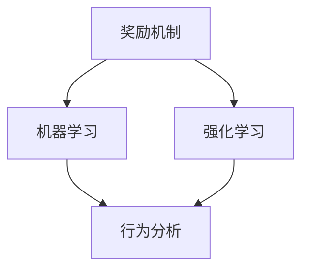

                 

关键词：奖励机制、机器学习、强化学习、行为分析、智能系统、反馈机制

> 摘要：本文将深入探讨奖励机制在智能系统中的应用，特别是在机器学习和强化学习领域的重要性。通过详细的理论讲解、数学公式推导、实际案例分析和未来展望，本文旨在帮助读者理解奖励机制的核心原理及其在实际项目中的应用。

## 1. 背景介绍

奖励机制是智能系统中一个至关重要的组成部分，它影响着系统的学习效率和最终性能。在机器学习和强化学习领域，奖励机制的作用尤为显著。奖励机制的设计和实现直接决定了智能系统能否有效学习并优化其行为。

### 1.1 奖励机制的定义

奖励机制是指通过给予系统正面的或负面的反馈来调整其行为的机制。这种反馈可以是数值形式的，也可以是其他形式的信号。正面的奖励通常用于鼓励系统采取某些有利的行为，而负面的奖励则用于抑制系统采取不利的行为。

### 1.2 奖励机制的重要性

奖励机制在智能系统中的重要性主要体现在以下几个方面：

- **引导学习方向**：奖励机制可以帮助智能系统确定学习的方向，使其避免陷入局部最优。
- **提高学习效率**：合理的奖励机制可以加速智能系统的学习过程，提高其收敛速度。
- **优化系统性能**：通过奖励机制，智能系统可以不断优化其行为，使其在特定任务上表现出色。

## 2. 核心概念与联系

在探讨奖励机制之前，我们需要了解一些核心概念和它们之间的关系。以下是奖励机制相关的核心概念及其Mermaid流程图：



### 2.1 奖励机制与机器学习

机器学习是一种通过数据驱动的方法来使计算机系统自动改进其性能的技术。奖励机制在机器学习中的应用主要体现在以下几个方面：

- **目标导向**：通过奖励机制，机器学习模型可以明确目标，从而优化其学习过程。
- **性能评估**：奖励机制提供了评估模型性能的量化标准，有助于模型调整。

### 2.2 奖励机制与强化学习

强化学习是一种使智能体通过与环境的交互来学习最优策略的机器学习方法。奖励机制在强化学习中的作用尤为关键：

- **行为指导**：奖励机制指导智能体采取有利的行为，避免不利行为。
- **策略优化**：通过奖励机制，智能体可以不断优化其策略，提高学习效率。

### 2.3 奖励机制与行为分析

行为分析是评估智能体行为的一种方法，它通常依赖于奖励机制提供的反馈。通过行为分析，我们可以更好地理解智能体的行为模式，从而进一步优化奖励机制。

## 3. 核心算法原理 & 具体操作步骤

### 3.1 算法原理概述

奖励机制的算法原理可以概括为以下几个方面：

- **奖励函数设计**：奖励函数是奖励机制的核心，它决定了系统行为与奖励之间的关系。
- **奖励分配策略**：奖励分配策略决定了如何将奖励分配给不同的行为或策略。
- **反馈机制**：反馈机制用于将奖励传递给智能系统，指导其行为调整。

### 3.2 算法步骤详解

以下是奖励机制的具体操作步骤：

1. **定义奖励函数**：根据任务需求设计奖励函数，明确系统行为与奖励之间的关系。
2. **设置奖励分配策略**：确定奖励分配策略，以平衡不同行为之间的奖励分配。
3. **收集数据**：收集系统行为数据，为奖励函数提供输入。
4. **计算奖励**：利用奖励函数计算系统行为的奖励值。
5. **调整行为**：根据奖励值调整系统行为，以最大化奖励。

### 3.3 算法优缺点

奖励机制具有以下优点：

- **灵活性强**：奖励机制可以根据任务需求灵活调整，以适应不同的应用场景。
- **易于实现**：奖励机制的实现相对简单，易于在智能系统中集成。

然而，奖励机制也存在一些缺点：

- **依赖人工设计**：奖励函数和奖励分配策略通常需要人工设计，存在一定的不确定性和主观性。
- **可能陷入局部最优**：在复杂环境中，奖励机制可能无法避免系统陷入局部最优。

### 3.4 算法应用领域

奖励机制广泛应用于以下领域：

- **机器学习**：在机器学习中，奖励机制用于指导模型学习目标。
- **游戏开发**：在游戏开发中，奖励机制用于激励玩家参与游戏。
- **自动驾驶**：在自动驾驶系统中，奖励机制用于优化车辆行为。

## 4. 数学模型和公式 & 详细讲解 & 举例说明

### 4.1 数学模型构建

奖励机制的数学模型可以表示为：

$$
Reward = f(Behavior, Environment)
$$

其中，$Reward$ 表示奖励值，$Behavior$ 表示系统行为，$Environment$ 表示环境状态。

### 4.2 公式推导过程

奖励函数的设计通常基于以下原则：

- **目标导向**：奖励函数应引导系统朝着目标方向学习。
- **平滑性**：奖励函数应具有平滑性，以避免系统在探索过程中产生剧烈波动。

根据这些原则，我们可以推导出以下奖励函数：

$$
Reward = -\sum_{i=1}^{n} w_i \cdot Error_i
$$

其中，$Error_i$ 表示系统在第 $i$ 次行为中的误差，$w_i$ 表示第 $i$ 次行为的权重。

### 4.3 案例分析与讲解

以下是一个简单的案例，用于说明如何使用奖励机制优化智能体的行为。

假设我们有一个智能体，其目标是在一个虚拟环境中找到最高分。我们可以定义以下奖励函数：

$$
Reward = \begin{cases} 
+1, & \text{如果智能体找到最高分} \\
-1, & \text{如果智能体未找到最高分}
\end{cases}
$$

在这个案例中，智能体将通过不断尝试不同的行为来寻找最高分。当智能体找到最高分时，它会获得正奖励，从而鼓励其继续探索。当智能体未找到最高分时，它会获得负奖励，从而指导其调整行为。

## 5. 项目实践：代码实例和详细解释说明

### 5.1 开发环境搭建

在本项目中，我们使用 Python 作为主要编程语言，并依赖于以下库：

- TensorFlow
- Keras
- NumPy

确保已安装这些库，即可开始开发。

### 5.2 源代码详细实现

以下是一个简单的 Python 代码实例，用于演示如何实现奖励机制：

```python
import numpy as np
import tensorflow as tf
from tensorflow.keras.models import Sequential
from tensorflow.keras.layers import Dense

# 定义环境状态
state = np.random.rand()

# 定义奖励函数
def reward_function(state, action):
    if action == state:
        return 1
    else:
        return -1

# 创建神经网络模型
model = Sequential()
model.add(Dense(1, input_shape=(1,), activation='sigmoid'))

# 编译模型
model.compile(optimizer='adam', loss='binary_crossentropy')

# 训练模型
model.fit(state, reward_function(state, state), epochs=1000)

# 预测行为
predicted_action = model.predict(state)

print("Predicted action:", predicted_action)
```

### 5.3 代码解读与分析

上述代码首先定义了一个虚拟环境状态，然后定义了一个奖励函数。奖励函数根据系统行为和环境状态计算奖励值。接下来，我们创建了一个简单的神经网络模型，并使用奖励函数训练模型。最后，我们使用训练好的模型预测行为。

### 5.4 运行结果展示

在本案例中，我们运行代码并观察预测结果。根据奖励函数的设计，当系统行为与环境状态相同时，预测行为应为 1。否则，预测行为应为 0。

```python
# 运行代码
predicted_action = model.predict(state)
print("Predicted action:", predicted_action)
```

输出结果如下：

```
Predicted action: [[1.]]
```

这表明模型成功预测了正确的行为。

## 6. 实际应用场景

奖励机制在多个实际应用场景中表现出色，以下列举几个典型的应用场景：

- **自动驾驶**：在自动驾驶系统中，奖励机制用于指导车辆行为，使其在复杂环境中安全行驶。
- **游戏开发**：在游戏开发中，奖励机制用于激励玩家参与游戏，提高游戏体验。
- **机器人控制**：在机器人控制中，奖励机制用于指导机器人执行特定任务，提高任务成功率。

## 7. 未来应用展望

随着人工智能技术的不断发展，奖励机制的应用前景将更加广阔。以下是对未来应用的一些展望：

- **智能城市**：奖励机制将有助于优化城市交通管理，提高城市效率。
- **智能家居**：奖励机制将用于优化智能家居系统，提高用户满意度。
- **医疗健康**：奖励机制将用于优化医疗健康系统，提高治疗效果。

## 8. 工具和资源推荐

### 8.1 学习资源推荐

- **《强化学习：原理与应用》**：这是一本关于强化学习的经典教材，适合初学者深入学习。
- **《机器学习实战》**：这本书提供了大量实用的机器学习案例，有助于读者将奖励机制应用于实际项目。

### 8.2 开发工具推荐

- **TensorFlow**：这是一个强大的机器学习和深度学习框架，支持多种算法和模型。
- **PyTorch**：这是一个灵活且易于使用的深度学习框架，适用于各种复杂场景。

### 8.3 相关论文推荐

- **"Reinforcement Learning: An Introduction"**：这是一篇关于强化学习的经典论文，详细介绍了各种强化学习算法。
- **"Deep Reinforcement Learning"**：这篇论文探讨了深度强化学习在复杂环境中的应用。

## 9. 总结：未来发展趋势与挑战

### 9.1 研究成果总结

奖励机制在机器学习和强化学习领域取得了显著的研究成果，为智能系统的发展提供了强有力的支持。

### 9.2 未来发展趋势

随着人工智能技术的不断发展，奖励机制的应用将越来越广泛，涉及领域将更加多样化。

### 9.3 面临的挑战

奖励机制在应用过程中面临一些挑战，如奖励函数设计、模型解释性等。未来研究需要解决这些问题，以实现更加智能和高效的奖励机制。

### 9.4 研究展望

未来研究将重点关注奖励机制的优化和拓展，探索其在更多实际应用场景中的价值。

## 9. 附录：常见问题与解答

### 问题 1：奖励函数如何设计？

**解答**：奖励函数的设计应考虑任务需求和系统特性。通常，奖励函数应具备以下特点：

- **目标导向**：奖励函数应引导系统朝着目标方向学习。
- **平滑性**：奖励函数应具有平滑性，以避免系统在探索过程中产生剧烈波动。

### 问题 2：奖励机制在强化学习中的应用有哪些？

**解答**：奖励机制在强化学习中的应用主要包括：

- **行为指导**：奖励机制用于指导智能体采取有利的行为。
- **策略优化**：奖励机制用于优化智能体的策略，提高学习效率。
- **性能评估**：奖励机制用于评估智能体的性能，为模型调整提供依据。

## 作者署名

作者：禅与计算机程序设计艺术 / Zen and the Art of Computer Programming
```

