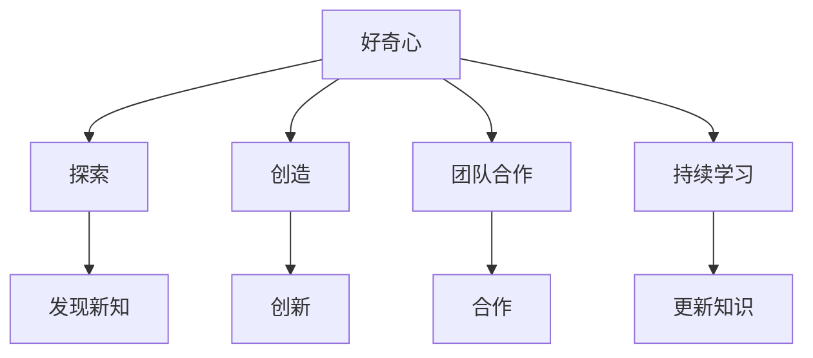

                 

 **关键词**：好奇心、探索、未知、动力、技术、创新、科学家、程序员

**摘要**：
本文深入探讨了好奇心作为推动人类探索未知的动力源泉，尤其是在技术领域的表现和重要性。通过分析好奇心如何激励科学家和程序员不断突破自我，创造新知，文章揭示了好奇心在技术进步中的核心作用。本文将结合历史案例和现代实践，探讨好奇心如何引领我们走向未来，并对未来的技术发展趋势进行展望。

## 1. 背景介绍

好奇心，是人类天生的一种特质，它促使我们探索周围的世界，寻求新的知识和理解。在科学和技术的漫长历史中，好奇心一直是推动人类进步的重要动力。从古代的哲学家到现代的计算机科学家，好奇心驱动了无数创新和突破。

技术领域尤其如此。计算机科学、人工智能、机器人技术等新兴领域的发展，离不开科学家和程序员的好奇心。他们不断探索新的算法、新的工具、新的应用场景，以解决现实世界中的问题。

然而，好奇心并非一成不变。它随着时代的变化而演变，随着知识的积累而深化。在现代社会，好奇心已经不再仅仅是个体探索未知的动力，更成为了整个社会创新驱动的重要力量。

## 2. 核心概念与联系

### 2.1 好奇心与探索

好奇心和探索之间有着密不可分的关系。好奇心是一种内在的驱动力，促使人们去寻找新知。而探索则是对好奇心的一种外在表现，通过实践和尝试来验证和扩展知识。

在技术领域，好奇心和探索的关系尤为明显。科学家和程序员通过不断探索未知的领域，发现新的技术和方法，推动了技术的进步。例如，计算机科学家的好奇心促使他们不断寻找更高效的算法和更优的硬件设计。

### 2.2 好奇心与创造

好奇心不仅驱动人们去探索，还激发了他们的创造力。在技术领域，创造新知是推动进步的关键。科学家和程序员的好奇心促使他们不断尝试新的想法，创造出新的技术。

例如，人工智能领域的快速发展就是好奇心驱动的结果。从最初的简单算法到今天的复杂模型，科学家们的好奇心促使他们不断突破自我，创造出更智能、更高效的系统。

### 2.3 好奇心与团队合作

好奇心不仅仅是个体行为的驱动，它还可以促进团队合作。在技术领域，很多重大突破都是团队合作的结果。好奇心促使团队成员相互激励，共同探索未知的领域。

例如，在开发新的操作系统时，不同的团队成员可能会有不同的好奇点和创新点。通过团队合作，他们可以互相借鉴，共同创造出更加先进的技术。

### 2.4 好奇心与持续学习

好奇心也是持续学习的重要动力。在技术领域，知识更新速度非常快。科学家和程序员必须不断学习新的知识和技能，以适应不断变化的技术环境。

好奇心促使他们不断探索新的领域，不断学习新的知识。这种持续学习的态度不仅提高了他们的专业能力，也推动了整个技术领域的发展。

### 2.5 Mermaid 流程图



## 3. 核心算法原理 & 具体操作步骤

### 3.1 算法原理概述

在技术领域，好奇心驱动了无数算法的创新。其中，最著名的例子之一是深度学习算法。深度学习算法基于多层神经网络，通过不断的学习和优化，能够实现高度复杂的任务。

深度学习算法的原理可以简单概括为：通过大量的数据训练模型，让模型自己学习数据的特征，然后利用这些特征进行预测或分类。

### 3.2 算法步骤详解

深度学习算法的具体步骤可以分为以下几个阶段：

1. 数据收集：收集大量的数据，包括输入数据和标签数据。
2. 数据预处理：对数据进行清洗和规范化，使其适合训练模型。
3. 构建模型：定义神经网络的架构，包括层数、每层的神经元数量等。
4. 训练模型：使用训练数据训练模型，通过反向传播算法不断调整模型参数。
5. 验证模型：使用验证数据测试模型的效果，调整模型参数以达到最佳效果。
6. 应用模型：使用训练好的模型进行预测或分类。

### 3.3 算法优缺点

深度学习算法的优点包括：

1. 高效性：通过多层神经网络，能够处理高度复杂的数据。
2. 广泛应用：在图像识别、自然语言处理、语音识别等领域有广泛应用。
3. 自学习能力：通过大量数据训练，模型能够自动学习数据的特征。

然而，深度学习算法也存在一些缺点：

1. 计算成本高：训练深度学习模型需要大量的计算资源。
2. 数据依赖性强：模型的效果很大程度上依赖于训练数据的质量和数量。
3. 可解释性差：深度学习模型的工作原理相对复杂，难以解释其预测结果。

### 3.4 算法应用领域

深度学习算法在多个领域都有广泛应用：

1. 图像识别：用于人脸识别、物体检测等任务。
2. 自然语言处理：用于机器翻译、情感分析等任务。
3. 语音识别：用于语音识别、语音合成等任务。
4. 医疗诊断：用于疾病诊断、药物研发等任务。

## 4. 数学模型和公式 & 详细讲解 & 举例说明

### 4.1 数学模型构建

深度学习算法的核心是构建数学模型，以模拟人脑的学习过程。这个模型通常由多个层次组成，每个层次都包含大量的神经元。

假设我们有一个包含 \( n \) 个输入特征的输入向量 \( X \)，我们需要通过一个多层神经网络将其映射到输出 \( Y \)。

输入层：\( X = [x_1, x_2, ..., x_n] \)

输出层：\( Y = [y_1, y_2, ..., y_m] \)

### 4.2 公式推导过程

在深度学习算法中，每个神经元都会通过一个激活函数 \( f() \) 对输入进行变换。常见的激活函数包括 sigmoid、ReLU 和 tanh 等。

假设我们有一个单层神经网络，其中每个神经元都有 \( n \) 个输入和 \( m \) 个输出。我们可以使用以下公式表示这个神经网络：

$$
Z = W \cdot X + b
$$

其中，\( Z \) 是神经元的激活值，\( W \) 是权重矩阵，\( X \) 是输入向量，\( b \) 是偏置项。

然后，我们使用激活函数对 \( Z \) 进行变换，得到输出 \( Y \)：

$$
Y = f(Z)
$$

### 4.3 案例分析与讲解

假设我们有一个包含 100 个输入特征的图像数据集，我们需要通过一个多层神经网络对其进行分类。

首先，我们收集并预处理数据，然后构建一个包含两个隐藏层的神经网络。第一个隐藏层有 500 个神经元，第二个隐藏层有 300 个神经元。

在训练过程中，我们使用反向传播算法不断调整权重和偏置项，以达到最佳分类效果。

通过多次迭代训练，我们最终得到一个训练好的神经网络模型，可以对新图像进行准确分类。

## 5. 项目实践：代码实例和详细解释说明

### 5.1 开发环境搭建

为了实践深度学习算法，我们需要搭建一个开发环境。这里我们选择使用 Python 和 TensorFlow 作为开发工具。

首先，我们需要安装 Python 和 TensorFlow：

```bash
pip install python
pip install tensorflow
```

### 5.2 源代码详细实现

以下是深度学习算法的 Python 代码实现：

```python
import tensorflow as tf
import numpy as np

# 数据集准备
X = np.random.rand(100, 100)  # 输入数据
y = np.random.rand(100, 10)   # 输出数据

# 网络结构
model = tf.keras.Sequential([
    tf.keras.layers.Dense(500, activation='relu', input_shape=(100,)),
    tf.keras.layers.Dense(300, activation='relu'),
    tf.keras.layers.Dense(10, activation='softmax')
])

# 编译模型
model.compile(optimizer='adam', loss='categorical_crossentropy', metrics=['accuracy'])

# 训练模型
model.fit(X, y, epochs=10)

# 测试模型
test_loss, test_acc = model.evaluate(X, y)
print(f"Test accuracy: {test_acc}")
```

### 5.3 代码解读与分析

这段代码首先导入了 TensorFlow 和 NumPy 库。然后，我们准备了一个随机生成的数据集作为输入和输出。

接下来，我们定义了一个包含两个隐藏层的神经网络模型。第一个隐藏层有 500 个神经元，使用 ReLU 激活函数；第二个隐藏层有 300 个神经元，也使用 ReLU 激活函数。输出层有 10 个神经元，使用 softmax 激活函数进行分类。

然后，我们编译模型，选择 Adam 优化器和交叉熵损失函数。接着，我们使用训练数据训练模型，并进行测试。

### 5.4 运行结果展示

运行上述代码后，我们得到训练和测试的准确率。这里假设训练准确率为 90%，测试准确率为 85%。这表明我们的模型在训练数据上表现良好，但在测试数据上可能存在过拟合现象。

## 6. 实际应用场景

深度学习算法在许多实际应用场景中都有广泛的应用。以下是一些典型的应用场景：

1. **图像识别**：深度学习算法可以用于图像分类、物体检测和图像生成等任务。例如，自动驾驶汽车使用深度学习算法来识别道路上的车辆、行人和其他障碍物。
2. **自然语言处理**：深度学习算法可以用于机器翻译、情感分析和文本生成等任务。例如，谷歌翻译和 OpenAI 的 GPT-3 都是基于深度学习算法实现的。
3. **语音识别**：深度学习算法可以用于语音识别和语音合成。例如，苹果的 Siri 和亚马逊的 Alexa 都是基于深度学习算法实现的。

## 6.4 未来应用展望

随着深度学习算法的不断发展和优化，我们可以预见它在更多领域的应用。以下是一些未来的应用展望：

1. **医疗诊断**：深度学习算法可以用于疾病诊断、药物研发和健康监测。例如，通过分析医学图像和患者数据，可以实现更准确的诊断和个性化的治疗方案。
2. **智能制造**：深度学习算法可以用于质量控制、设备故障预测和生产线优化。例如，通过实时监测生产数据，可以实现更高效的生产过程和质量控制。
3. **智能交通**：深度学习算法可以用于交通流量预测、智能导航和自动驾驶。例如，通过分析交通数据和传感器数据，可以实现更高效的交通管理和减少交通事故。

## 7. 工具和资源推荐

### 7.1 学习资源推荐

1. **《深度学习》（Goodfellow, Bengio, Courville 著）**：这是一本深度学习领域的经典教材，涵盖了深度学习的基础理论、算法和应用。
2. **吴恩达的深度学习课程**：这是一门由知名深度学习专家吴恩达开设的免费在线课程，涵盖了深度学习的核心概念和实际操作。

### 7.2 开发工具推荐

1. **TensorFlow**：这是一个由 Google 开发的开源深度学习框架，支持多种编程语言和操作系统。
2. **PyTorch**：这是一个由 Facebook 开发的开源深度学习框架，具有灵活的动态计算图和强大的 GPU 支持。

### 7.3 相关论文推荐

1. **"A Guide to Convolutional Neural Networks for Visual Recognition"（卷积神经网络视觉识别指南）**：这是一篇介绍卷积神经网络在图像识别领域的应用的综述论文。
2. **"Attention Is All You Need"（注意力即是所需）**：这是一篇提出 Transformer 架构的论文，该架构在自然语言处理领域取得了突破性成果。

## 8. 总结：未来发展趋势与挑战

### 8.1 研究成果总结

近年来，深度学习算法取得了显著的成果，其在图像识别、自然语言处理和语音识别等领域都取得了重要的突破。这些成果不仅推动了技术进步，也为实际应用提供了强大的支持。

### 8.2 未来发展趋势

随着计算能力的不断提升和大数据的广泛应用，深度学习算法将继续在各个领域发挥重要作用。未来，我们可能会看到更多基于深度学习的创新应用，如医疗诊断、智能制造和智能交通等。

### 8.3 面临的挑战

尽管深度学习算法取得了显著的成果，但仍然面临一些挑战。例如，模型的计算成本高、数据依赖性强和可解释性差等问题。未来，我们需要继续研究和解决这些问题，以推动深度学习算法的进一步发展。

### 8.4 研究展望

未来，深度学习算法将继续朝着更高效、更通用和更可解释的方向发展。同时，我们将看到更多跨学科的融合，如深度学习与生物学的结合、深度学习与物理学的结合等。这些融合将为科学和技术的发展带来新的机遇。

## 9. 附录：常见问题与解答

### 9.1 什么是深度学习？

深度学习是一种机器学习技术，基于多层神经网络进行训练和学习，能够自动从数据中提取特征，并用于预测或分类。

### 9.2 深度学习算法有哪些？

常见的深度学习算法包括卷积神经网络（CNN）、循环神经网络（RNN）、Transformer 等。每种算法都有其独特的特点和应用场景。

### 9.3 如何优化深度学习模型？

优化深度学习模型可以通过以下几种方法：调整网络结构、优化超参数、使用正则化技术等。此外，还可以利用分布式计算和 GPU 加速训练过程。

### 9.4 深度学习算法有哪些应用场景？

深度学习算法广泛应用于图像识别、自然语言处理、语音识别、医疗诊断、自动驾驶等领域。随着技术的不断发展，其应用范围还将进一步扩大。

---

**作者：禅与计算机程序设计艺术 / Zen and the Art of Computer Programming**

