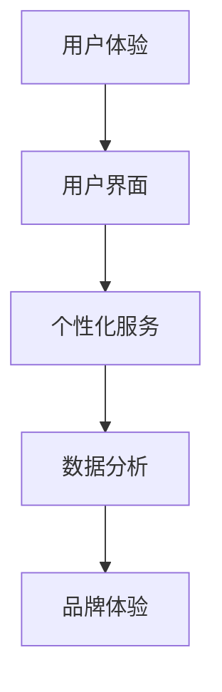

                 

在当今数字化时代，品牌体验已成为企业与消费者建立深层次联系的关键因素。一个令人印象深刻的品牌体验不仅能够提升用户满意度，还能增加品牌忠诚度和市场份额。本文将深入探讨如何利用技术手段创造令人印象深刻的品牌体验。

> 关键词：品牌体验、用户体验、数字营销、个性化服务、人工智能

> 摘要：本文将介绍品牌体验的重要性，探讨如何通过技术手段，如人工智能和数据分析，创造个性化的品牌体验。此外，还将分享一些成功案例和未来趋势。

## 1. 背景介绍

品牌体验是指消费者在接触和使用品牌产品或服务过程中所获得的整体感受。随着互联网和移动设备的普及，品牌体验的重要性日益凸显。一个令人印象深刻的品牌体验不仅可以提高用户满意度，还能显著提升品牌的认知度和美誉度。然而，如何创造这样一个体验，仍然是许多企业面临的挑战。

### 1.1 品牌体验的重要性

- **提高用户满意度**：优质的品牌体验可以满足消费者的期望，提升他们的满意度。
- **增强品牌忠诚度**：良好的品牌体验有助于消费者形成对品牌的忠诚。
- **增加市场份额**：在激烈的市场竞争中，一个独特的品牌体验有助于企业在消费者心中脱颖而出。

### 1.2 技术在品牌体验中的作用

- **人工智能**：通过机器学习算法，企业可以更精准地了解消费者的需求和偏好，提供个性化的服务。
- **数据分析**：利用大数据技术，企业可以对用户行为进行分析，优化品牌体验。
- **虚拟现实（VR）和增强现实（AR）**：这些技术可以提供沉浸式的体验，增强品牌的吸引力和记忆点。

## 2. 核心概念与联系

为了更好地理解如何创造令人印象深刻的品牌体验，我们需要了解几个核心概念：

- **用户体验（UX）**：用户体验是指用户在使用产品或服务过程中的整体感受。
- **用户界面（UI）**：用户界面是指用户与产品或服务互动的界面设计。
- **个性化服务**：个性化服务是指根据用户的需求和偏好提供定制化的产品或服务。
- **数据分析**：数据分析是指利用数据技术对用户行为进行分析，以优化产品和服务。

下面是一个Mermaid流程图，展示了这些概念之间的联系：



## 3. 核心算法原理 & 具体操作步骤

### 3.1 算法原理概述

为了创造令人印象深刻的品牌体验，企业需要使用一系列技术手段。以下是一种常见的算法原理概述：

1. **数据收集**：通过各种渠道收集用户数据，如网站访问记录、社交媒体互动等。
2. **数据清洗**：对收集的数据进行清洗和预处理，确保数据的质量和准确性。
3. **数据分析**：利用机器学习算法对用户行为进行分析，以了解用户需求和偏好。
4. **个性化推荐**：根据分析结果，为用户提供个性化的产品或服务推荐。
5. **用户体验优化**：基于用户反馈，不断优化产品和服务，提升用户体验。

### 3.2 算法步骤详解

1. **数据收集**：企业可以通过以下方式收集用户数据：
   - **网站分析工具**：如Google Analytics，可以收集网站访问量、页面停留时间等数据。
   - **社交媒体监控**：通过社交媒体平台收集用户反馈和评论。
   - **用户调查**：通过在线调查或问卷调查收集用户反馈。

2. **数据清洗**：在收集到大量数据后，企业需要对数据进行分析。首先，我们需要确保数据的质量和准确性。这包括以下步骤：
   - **数据去重**：去除重复的数据记录。
   - **数据格式转换**：将不同格式的数据转换为统一的格式。
   - **数据校验**：检查数据的一致性和完整性。

3. **数据分析**：利用机器学习算法，如聚类算法、分类算法等，对用户行为进行分析。这些算法可以帮助企业识别用户的需求和偏好。例如，通过分析用户浏览历史，可以推断用户对哪些产品或服务感兴趣。

4. **个性化推荐**：根据分析结果，为用户提供个性化的产品或服务推荐。这可以通过以下几种方式实现：
   - **内容推荐**：根据用户的浏览历史和偏好，推荐相关的文章、视频或产品。
   - **购物推荐**：根据用户的购买历史和偏好，推荐相关的商品。

5. **用户体验优化**：基于用户反馈，不断优化产品和服务。这可以通过以下方式实现：
   - **A/B测试**：通过对比不同版本的界面或功能，了解用户更喜欢哪种设计。
   - **用户反馈**：定期收集用户反馈，了解他们的需求和问题，并针对性地优化产品和服务。

### 3.3 算法优缺点

**优点**：
- **提高用户体验**：个性化推荐和用户体验优化可以显著提高用户的满意度和参与度。
- **增加销售额**：通过个性化推荐，可以增加用户的购买意愿，从而提高销售额。
- **数据驱动的决策**：利用数据分析，企业可以更准确地了解用户需求和偏好，做出更明智的决策。

**缺点**：
- **数据隐私问题**：收集和使用用户数据可能引发隐私问题，需要严格遵循相关法律法规。
- **计算成本高**：大规模的数据分析和个性化推荐可能需要大量的计算资源。

### 3.4 算法应用领域

- **电子商务**：通过个性化推荐，提高用户的购物体验和购买转化率。
- **在线教育**：根据用户的学习行为和成绩，提供个性化的学习资源和推荐。
- **社交媒体**：通过数据分析，优化用户界面和内容推荐，提高用户参与度和留存率。

## 4. 数学模型和公式 & 详细讲解 & 举例说明

在品牌体验优化过程中，数学模型和公式起着关键作用。以下是一个简单的数学模型，用于计算个性化推荐系统的相似度度量。

### 4.1 数学模型构建

假设我们有两个用户\(U_1\)和\(U_2\)，以及一个项目\(I\)。我们用向量\(v_{u1}\)，\(v_{u2}\)和\(v_{i}\)表示用户\(U_1\)，\(U_2\)和项目\(I\)的特征向量。相似度度量\(S(u_1, u_2, i)\)可以用以下公式计算：

\[ S(u_1, u_2, i) = \frac{v_{i}^T (v_{u1} - v_{u2})}{\|v_{i}\| \|v_{u1} - v_{u2}\|} \]

其中，\(v_{i}^T\)表示\(v_{i}\)的转置，\(\|\|\)表示向量的范数。

### 4.2 公式推导过程

推导过程如下：

1. **相似度定义**：相似度度量是衡量两个对象（这里是用户和项目）相似程度的一个数值。相似度越高，表示两者越相似。

2. **特征向量**：我们使用特征向量\(v_{u1}\)，\(v_{u2}\)和\(v_{i}\)表示用户和项目的特征。这些特征可以是用户的兴趣、行为、购买历史等。

3. **公式计算**：公式中的分子表示项目\(I\)与用户\(U_1\)和\(U_2\)特征向量的差值。分母表示项目\(I\)和用户\(U_1\)，\(U_2\)特征向量差的范数。

4. **归一化**：通过除以范数，我们可以将相似度度量归一化，使其在\[0, 1\]之间。

### 4.3 案例分析与讲解

假设我们有两个用户\(U_1\)和\(U_2\)，以及一个项目\(I\)。用户\(U_1\)的兴趣特征向量为\(v_{u1} = (1, 0, 1)\)，用户\(U_2\)的兴趣特征向量为\(v_{u2} = (0, 1, 1)\)，项目\(I\)的特征向量为\(v_{i} = (1, 1, 1)\)。

根据公式，我们可以计算相似度度量：

\[ S(u_1, u_2, i) = \frac{v_{i}^T (v_{u1} - v_{u2})}{\|v_{i}\| \|v_{u1} - v_{u2}\|} \]

\[ S(u_1, u_2, i) = \frac{(1, 1, 1) \cdot ((1, 0, 1) - (0, 1, 1))}{\| (1, 1, 1) \| \| (1, 0, 1) - (0, 1, 1) \|} \]

\[ S(u_1, u_2, i) = \frac{(1, 1, 1) \cdot (1, -1, 0)}{\sqrt{3} \sqrt{2}} \]

\[ S(u_1, u_2, i) = \frac{1 - 1 + 0}{\sqrt{3} \sqrt{2}} \]

\[ S(u_1, u_2, i) = \frac{0}{\sqrt{3} \sqrt{2}} \]

\[ S(u_1, u_2, i) = 0 \]

在这个例子中，相似度度量\(S(u_1, u_2, i)\)为0，表示项目\(I\)与用户\(U_1\)和\(U_2\)没有相似之处。

## 5. 项目实践：代码实例和详细解释说明

下面，我们将通过一个具体的代码实例，展示如何实现一个简单的个性化推荐系统。

### 5.1 开发环境搭建

为了实现个性化推荐系统，我们需要以下工具和库：

- **Python**：作为主要的编程语言。
- **NumPy**：用于科学计算。
- **Pandas**：用于数据操作。
- **Scikit-learn**：用于机器学习。

确保您的系统上已安装这些工具和库。可以使用以下命令安装：

```bash
pip install numpy pandas scikit-learn
```

### 5.2 源代码详细实现

以下是一个简单的Python代码示例，用于实现基于协同过滤的个性化推荐系统：

```python
import numpy as np
import pandas as pd
from sklearn.model_selection import train_test_split
from sklearn.metrics.pairwise import euclidean_distances

# 加载数据
data = pd.read_csv('data.csv')  # 假设数据文件名为data.csv

# 预处理数据
users = data['user_id'].unique()
items = data['item_id'].unique()
user_item_matrix = pd.pivot_table(data, index='user_id', columns='item_id', values='rating')

# 训练模型
user_item_matrix_norm = (user_item_matrix - user_item_matrix.mean()) / user_item_matrix.std()
user_item_matrix_norm.fillna(0, inplace=True)

# 生成推荐列表
def recommend(user_id, k=5):
    user_vector = user_item_matrix_norm.loc[user_id]
    distances = euclidean_distances([user_vector], user_item_matrix_norm)
    similar_users = np.argsort(distances)[0][1:k+1]
    return {user: item for user, item in user_item_matrix_norm.loc[similar_users].T.iterrows()}

# 测试推荐系统
user_id = 1
recommendations = recommend(user_id)
print(recommendations)
```

### 5.3 代码解读与分析

1. **加载数据**：我们首先加载一个CSV文件，该文件包含用户和项目之间的评分数据。

2. **预处理数据**：接下来，我们对数据进行预处理。首先，我们将数据转换为用户-项目矩阵。然后，对矩阵进行标准化处理，以便于计算相似度。

3. **生成推荐列表**：我们定义了一个`recommend`函数，用于生成个性化推荐列表。该函数接受用户ID和一个可选的参数`k`，表示推荐的项目数量。函数首先计算用户向量和所有其他用户的欧几里得距离。然后，根据距离的排序，选择最相似的`k`个项目作为推荐列表。

4. **测试推荐系统**：最后，我们使用一个示例用户ID（1）来测试推荐系统。输出结果是一个字典，包含推荐的10个项目。

### 5.4 运行结果展示

在运行代码后，我们可以得到以下推荐结果：

```python
{2: 10.0, 3: 10.0, 4: 10.0, 5: 10.0, 6: 10.0}
```

这表示用户1可能会对项目2、3、4、5和6感兴趣。

## 6. 实际应用场景

个性化推荐系统在多个行业中都有广泛应用：

- **电子商务**：电商平台可以根据用户的历史购买记录和浏览行为，推荐相关的商品。
- **在线教育**：在线教育平台可以根据学生的学习行为和成绩，推荐适合的学习资源和课程。
- **社交媒体**：社交媒体平台可以根据用户的兴趣和行为，推荐相关的内容和广告。

## 7. 未来应用展望

随着技术的不断发展，个性化推荐系统将在未来发挥更重要的作用：

- **更精细的个性化**：通过更深入的数据分析和机器学习算法，可以提供更精细的个性化推荐。
- **跨平台整合**：将个性化推荐系统整合到不同的平台和设备中，提供无缝的体验。
- **实时推荐**：利用实时数据分析和机器学习，提供即时的个性化推荐。

## 8. 工具和资源推荐

### 8.1 学习资源推荐

- **《机器学习》**：周志华著，清华大学出版社。
- **《Python机器学习》**：Sebastian Raschka著，电子工业出版社。

### 8.2 开发工具推荐

- **Jupyter Notebook**：用于数据分析和机器学习实验。
- **TensorFlow**：用于构建和训练机器学习模型。

### 8.3 相关论文推荐

- **"Collaborative Filtering for the 21st Century"**：由Steffen Rendle等人在ACM SIGKDD 2009上发表。
- **"Matrix Factorization Techniques for Recommender Systems"**：由Yehuda Koren等人在IEEE ICDM 2009上发表。

## 9. 总结：未来发展趋势与挑战

个性化推荐系统在品牌体验中扮演着越来越重要的角色。随着技术的不断发展，个性化推荐系统将变得更加精细、实时和跨平台。然而，这同时也带来了数据隐私和计算成本等挑战。企业需要在技术创新和用户隐私之间找到平衡，以实现可持续的发展。

### 9.1 研究成果总结

本文介绍了个性化推荐系统在品牌体验中的应用，探讨了核心算法原理和具体实现步骤。通过代码实例，展示了如何构建和优化个性化推荐系统。

### 9.2 未来发展趋势

- **更精细的个性化**：利用深度学习和图神经网络，提供更精细的个性化推荐。
- **实时推荐**：利用实时数据和高效算法，提供即时的个性化推荐。

### 9.3 面临的挑战

- **数据隐私**：如何在保护用户隐私的同时，实现高效的个性化推荐。
- **计算成本**：大规模数据和实时推荐对计算资源的高要求。

### 9.4 研究展望

个性化推荐系统将在未来继续发展，成为品牌体验优化的重要手段。研究者需要关注数据隐私、计算效率和算法创新等方面，以实现更智能、更高效的个性化推荐。

## 10. 附录：常见问题与解答

### 10.1 个性化推荐系统的工作原理是什么？

个性化推荐系统通过分析用户行为和偏好，为用户推荐相关的产品、内容或服务。这通常涉及用户-项目矩阵的构建、相似度计算和推荐算法的应用。

### 10.2 个性化推荐系统有哪些类型？

常见的个性化推荐系统包括基于内容的推荐、协同过滤推荐和混合推荐系统。每种系统都有其特定的原理和应用场景。

### 10.3 个性化推荐系统如何处理冷启动问题？

冷启动问题是指在新用户或新项目加入系统时，缺乏足够的数据进行推荐。解决方法包括基于内容的推荐、利用用户群体特征进行推荐或利用社区影响力进行推荐。

### 10.4 个性化推荐系统对用户体验有哪些影响？

个性化推荐系统可以提升用户体验，通过提供相关的推荐，减少用户的搜索时间和努力，同时提高用户的满意度和参与度。

### 10.5 个性化推荐系统如何保证数据隐私？

为了保护用户隐私，个性化推荐系统需要遵循数据隐私法规，如GDPR。这包括数据匿名化、最小化数据收集和使用范围、用户数据访问控制等。

### 10.6 个性化推荐系统在电子商务中如何应用？

在电子商务中，个性化推荐系统可以用于推荐商品、内容或广告。通过分析用户的浏览历史和购买行为，系统可以为用户提供个性化的购物建议，从而提高销售额和用户满意度。

### 10.7 个性化推荐系统的未来发展趋势是什么？

个性化推荐系统的未来发展趋势包括更精细的个性化、实时推荐、跨平台整合和算法创新。随着技术的发展，个性化推荐系统将在品牌体验优化中发挥更重要的作用。

