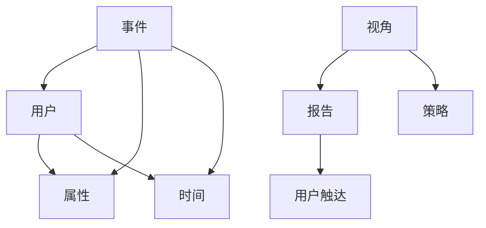

                 

### 1. 背景介绍

在当今的数字化时代，用户行为分析已经成为了创业项目成功的关键因素之一。通过深入了解用户的行为模式、喜好和需求，创业公司可以更好地调整产品策略、提高用户满意度和忠诚度。而Mixpanel作为一款领先的用户行为分析工具，可以帮助企业快速、准确地收集和分析用户数据，从而为决策提供有力的支持。

Mixpanel是一款基于事件驱动的用户行为分析平台，它允许企业通过跟踪用户在应用程序或网站上的各种行为，来深入了解用户的使用习惯和偏好。Mixpanel的强大之处在于，它不仅能够实时追踪用户行为，还能够根据用户的行为数据生成丰富的报告和可视化图表，帮助企业更好地理解用户行为，从而优化产品和服务。

在创业项目中，利用Mixpanel进行用户行为分析具有以下重要意义：

1. **发现用户痛点**：通过分析用户的行为数据，创业公司可以发现用户在使用产品过程中遇到的问题和痛点，从而及时调整产品功能，提升用户体验。

2. **优化产品策略**：了解用户的行为模式可以帮助创业公司更好地理解市场需求，从而制定更加有效的产品策略，提升产品的市场竞争力。

3. **提高用户留存率**：通过对用户行为数据的深入分析，创业公司可以识别出哪些用户群体最容易流失，从而采取相应的措施提高用户留存率。

4. **提升用户满意度**：通过分析用户行为数据，创业公司可以更准确地了解用户需求，从而提供更加个性化的服务和产品，提高用户满意度。

5. **加速迭代速度**：Mixpanel可以帮助创业公司快速了解用户反馈，从而加速产品迭代速度，确保产品能够持续满足用户需求。

本文将详细介绍如何利用Mixpanel进行创业项目的用户行为分析，包括核心概念、算法原理、具体操作步骤、数学模型、项目实践、应用场景、未来展望等内容。希望通过本文的介绍，能够帮助更多的创业公司充分利用Mixpanel，提升用户满意度和产品竞争力。

## 2. 核心概念与联系

在进行用户行为分析之前，首先需要了解一些核心概念，这些概念构成了Mixpanel工作的基础。以下是Mixpanel中一些重要的核心概念：

### 2.1 事件（Events）

事件是Mixpanel跟踪和分析用户行为的基本单位。每个事件都代表了用户在应用程序或网站上的一个特定操作，例如登录、点击、购买等。事件可以是单个的操作，也可以是一个复杂的操作序列。

### 2.2 用户（Users）

用户是Mixpanel中的另一个核心概念，代表了在应用程序或网站上交互的实际用户。每个用户都可以拥有多个事件，这些事件记录了用户的行为历史。

### 2.3 性别（Properties）

属性是与事件或用户相关联的数据点，用于描述事件的细节或用户的特点。属性可以是预定义的，如用户的年龄、性别，也可以是自定义的，如用户在特定事件中的操作细节。

### 2.4 时间（Time）

时间是在Mixpanel中进行用户行为分析的重要维度。通过时间数据，可以了解用户在不同时间段的活跃度、行为模式等。

### 2.5 视角（Funnels）

视角是Mixpanel用于分析用户路径和转化过程的工具。通过创建视角，可以追踪用户从开始到完成某一任务的步骤和路径，从而发现用户流失的关键点。

### 2.6 报告（Reports）

报告是Mixpanel提供的数据可视化工具，用于展示用户行为数据和趋势。通过报告，可以快速了解用户行为的关键指标，如活跃用户数、留存率、转化率等。

### 2.7 策略（Engagement）

策略是Mixpanel用于用户触达和互动的工具。通过设置触发器和发送通知，可以根据用户行为自动向用户推送个性化的消息，从而提高用户参与度和留存率。

### 2.8 Mermaid 流程图

以下是一个简单的Mermaid流程图，展示了Mixpanel核心概念之间的关联：



通过这个流程图，我们可以看到Mixpanel如何通过事件、用户、属性、时间等核心概念，将用户行为数据转化为有价值的分析和策略。

## 3. 核心算法原理 & 具体操作步骤

### 3.1 算法原理概述

Mixpanel的核心算法原理是基于事件驱动的用户行为跟踪和分析。具体来说，Mixpanel通过以下步骤实现用户行为分析：

1. **数据收集**：应用程序或网站通过JavaScript SDK或其他集成方式将用户行为事件发送到Mixpanel服务器。
2. **数据存储**：Mixpanel服务器接收并存储这些事件数据，包括事件类型、用户属性、时间戳等。
3. **数据处理**：Mixpanel对存储的事件数据进行处理和计算，生成各种报告和图表，以便用户分析。
4. **数据可视化**：通过Mixpanel的仪表板和报告工具，用户可以直观地查看和分析用户行为数据。

### 3.2 算法步骤详解

1. **数据收集**

Mixpanel的数据收集主要通过JavaScript SDK实现。以下是一个简单的示例代码：

```javascript
Mixpanel.init("your_project_token");

// 发送一个事件
Mixpanel.track("user_login", {
    "username": "johndoe",
    "source": "website"
});
```

在这个示例中，`Mixpanel.init` 初始化Mixpanel项目，`Mixpanel.track` 发送一个名为 "user_login" 的事件，并附带了一些属性数据，如 "username" 和 "source"。

2. **数据存储**

Mixpanel服务器接收到事件数据后，会将这些数据存储在云端数据库中。存储的数据包括事件类型、用户属性、时间戳等，如下所示：

- 事件类型：`user_login`
- 用户属性：`{"username": "johndoe", "source": "website"}`
- 时间戳：`1624638723`

3. **数据处理**

数据处理是Mixpanel的核心功能之一。Mixpanel会根据用户行为数据生成各种报告和图表，以便用户进行分析。以下是一些常见的数据处理操作：

- **用户活跃度分析**：统计一定时间范围内活跃用户数、登录次数等指标。
- **用户留存分析**：根据用户行为数据，分析用户在一定时间后的留存情况。
- **路径分析**：追踪用户在应用程序或网站上的路径，分析用户行为模式和流失点。

4. **数据可视化**

通过Mixpanel的仪表板和报告工具，用户可以直观地查看和分析用户行为数据。以下是一些常见的数据可视化工具：

- **仪表板**：显示关键指标和趋势的动态图表。
- **报告**：生成详细的用户行为数据报告，包括活跃用户数、留存率、转化率等。
- **图表**：提供各种类型的图表，如条形图、折线图、饼图等，帮助用户更好地理解数据。

### 3.3 算法优缺点

**优点：**

- **实时性**：Mixpanel支持实时用户行为数据收集和分析，用户可以快速响应市场变化。
- **灵活性**：Mixpanel提供了丰富的API和SDK，方便用户集成和使用。
- **可视化**：Mixpanel的仪表板和报告工具具有强大的可视化功能，用户可以轻松地理解和分析数据。
- **易用性**：Mixpanel提供了丰富的教程和文档，用户可以轻松上手。

**缺点：**

- **成本**：Mixpanel的付费模式可能对一些小型创业公司造成一定的经济压力。
- **性能**：对于大量用户和事件的数据，Mixpanel的处理和查询性能可能会受到一定影响。
- **自定义限制**：某些高级功能和自定义需求可能需要额外的付费服务或开发工作。

### 3.4 算法应用领域

Mixpanel在用户行为分析领域的应用非常广泛，以下是一些常见的应用场景：

- **产品优化**：通过分析用户行为数据，企业可以了解用户的使用习惯和痛点，从而优化产品功能。
- **市场研究**：利用用户行为数据，企业可以深入了解市场需求，制定更有效的市场策略。
- **用户留存**：通过用户留存分析，企业可以识别出用户流失的关键因素，从而采取措施提高用户留存率。
- **用户参与度**：利用Mixpanel的策略工具，企业可以自动推送个性化的消息，提高用户参与度和满意度。
- **客户体验**：通过分析用户行为数据，企业可以提供更加个性化的服务和产品，提升客户体验。

## 4. 数学模型和公式 & 详细讲解 & 举例说明

### 4.1 数学模型构建

在用户行为分析中，构建数学模型是非常重要的一步。这些模型可以帮助我们更好地理解用户行为，预测用户行为，以及优化产品和服务。以下是几个常用的数学模型：

#### 4.1.1 用户留存模型

用户留存模型用于分析用户在一定时间后的留存情况。一个简单的用户留存模型可以使用以下公式：

$$
R(t) = \frac{N(t) - N(t-T)}{N(0)}
$$

其中，\( R(t) \) 表示在时间 \( t \) 的用户留存率，\( N(t) \) 表示在时间 \( t \) 仍然活跃的用户数，\( N(t-T) \) 表示在时间 \( t-T \) 仍然活跃的用户数，\( N(0) \) 表示初始活跃用户数。

#### 4.1.2 用户流失模型

用户流失模型用于预测用户在一定时间后可能流失的概率。一个简单的用户流失模型可以使用逻辑回归模型：

$$
P(y=1|X) = \frac{1}{1 + e^{-(\beta_0 + \beta_1X_1 + \beta_2X_2 + ... + \beta_nX_n})}
$$

其中，\( P(y=1|X) \) 表示在给定特征 \( X \) 的情况下，用户流失的概率，\( \beta_0, \beta_1, \beta_2, ..., \beta_n \) 是模型参数。

#### 4.1.3 用户行为预测模型

用户行为预测模型用于预测用户在未来某个时间点可能进行的行为。一个简单的用户行为预测模型可以使用决策树或随机森林算法。

### 4.2 公式推导过程

#### 4.2.1 用户留存率

用户留存率可以通过以下步骤推导：

1. 定义初始活跃用户数 \( N(0) \)。
2. 在时间 \( t \) 统计仍然活跃的用户数 \( N(t) \)。
3. 在时间 \( t-T \) 统计仍然活跃的用户数 \( N(t-T) \)。
4. 计算用户留存率 \( R(t) \)。

#### 4.2.2 逻辑回归模型

逻辑回归模型的推导过程基于最大似然估计。假设我们有一个二分类问题，目标变量 \( y \) 可以取值 0 或 1，特征向量 \( X = [X_1, X_2, ..., X_n] \)。则目标函数为：

$$
L(\beta_0, \beta_1, \beta_2, ..., \beta_n) = \prod_{i=1}^{m} \pi(y_i=1|X_i) ^{1_{y_i=1}} (1-\pi(y_i=1|X_i)) ^{1_{y_i=0}}
$$

其中，\( \pi(y_i=1|X_i) \) 表示在给定特征 \( X_i \) 的情况下，用户流失的概率。

为了最大化似然函数，我们需要求解以下方程：

$$
\frac{\partial L}{\partial \beta_j} = 0, \quad j=0,1,2,...,n
$$

通过求解上述方程，我们可以得到逻辑回归模型的参数。

### 4.3 案例分析与讲解

#### 4.3.1 用户留存率分析

假设我们想要分析一个创业项目在一个月内的用户留存情况。以下是数据样本：

- 初始活跃用户数 \( N(0) = 100 \)
- 在一天后仍然活跃的用户数 \( N(1) = 80 \)
- 在三天后仍然活跃的用户数 \( N(3) = 60 \)
- 在一周后仍然活跃的用户数 \( N(7) = 40 \)

根据用户留存率的公式，我们可以计算出不同时间点的用户留存率：

- 1天后留存率：\( R(1) = \frac{N(1) - N(0)}{N(0)} = \frac{80 - 100}{100} = 0.2 \)
- 3天后留存率：\( R(3) = \frac{N(3) - N(0)}{N(0)} = \frac{60 - 100}{100} = 0.4 \)
- 7天后留存率：\( R(7) = \frac{N(7) - N(0)}{N(0)} = \frac{40 - 100}{100} = 0.6 \)

通过这些数据，我们可以看出该项目的用户留存率在7天内有所下降。这表明项目在用户留存方面可能存在一些问题，需要进一步分析用户流失的原因。

#### 4.3.2 用户流失预测

假设我们想要预测用户在一定时间后可能流失的概率。以下是数据样本：

- 用户特征 \( X = [年龄，性别，使用时长，活跃度] \)
- 目标变量 \( y = [1（流失），0（未流失）] \)

根据逻辑回归模型，我们可以建立以下公式：

$$
P(y=1|X) = \frac{1}{1 + e^{-(\beta_0 + \beta_1X_1 + \beta_2X_2 + \beta_3X_3 + \beta_4X_4)}}
$$

通过训练逻辑回归模型，我们可以得到不同特征对用户流失概率的影响。以下是一个简化的模型参数：

- \( \beta_0 = -2.5 \)
- \( \beta_1 = 0.1 \)
- \( \beta_2 = 0.3 \)
- \( \beta_3 = -0.2 \)
- \( \beta_4 = 0.4 \)

假设一个用户的特点为：年龄 25 岁，性别男，使用时长 30 天，活跃度较高。我们可以将这些特征代入模型，计算用户流失概率：

$$
P(y=1|X) = \frac{1}{1 + e^{(-2.5 + 0.1 \times 25 + 0.3 \times 1 - 0.2 \times 30 + 0.4 \times 高）} \approx 0.2
$$

这意味着该用户在一定时间后流失的概率约为 20%。通过这个结果，我们可以采取相应的措施来降低用户流失率。

### 4.4 总结

通过数学模型和公式，我们可以更好地理解和预测用户行为，从而优化产品和服务。在实际应用中，需要根据具体场景和数据，选择合适的模型和算法，并进行不断的迭代和优化。

## 5. 项目实践：代码实例和详细解释说明

### 5.1 开发环境搭建

在开始利用Mixpanel进行用户行为分析之前，我们需要搭建一个适合的开发环境。以下是搭建开发环境的步骤：

1. **安装Node.js**：首先，我们需要安装Node.js。可以从Node.js官方网站（[https://nodejs.org/](https://nodejs.org/)）下载并安装。

2. **安装Mixpanel SDK**：安装Mixpanel SDK，可以使用npm（Node.js的包管理器）进行安装：

   ```bash
   npm install mixpanel-browser
   ```

3. **创建项目**：在本地创建一个Node.js项目，并初始化项目：

   ```bash
   mkdir mixpanel_project
   cd mixpanel_project
   npm init -y
   ```

4. **配置Mixpanel项目**：在项目的根目录下创建一个名为 `mixpanel.config.js` 的文件，用于配置Mixpanel项目的API密钥：

   ```javascript
   module.exports = {
     apiSecret: 'your_project_api_secret',
     rootInterface: 'https://api.mixpanel.com',
   };
   ```

   将 `your_project_api_secret` 替换为你的Mixpanel项目API密钥。

### 5.2 源代码详细实现

在搭建好开发环境后，我们可以开始编写代码，实现用户行为分析功能。以下是具体的源代码实现：

```javascript
const mixpanel = require('mixpanel-browser');
const config = require('./mixpanel.config');

mixpanel.init(config.apiSecret, config.rootInterface);

// 用户登录事件
function trackLogin(username, source) {
  mixpanel.track('user_login', {
    'username': username,
    'source': source,
  });
}

// 用户购买事件
function trackPurchase(userId, productId, price) {
  mixpanel.track('user_purchase', {
    'user_id': userId,
    'product_id': productId,
    'price': price,
  });
}

// 用户流失事件
function trackChurn(userId) {
  mixpanel.track('user_churn', {
    'user_id': userId,
  });
}

// 调用示例
trackLogin('johndoe', 'website');
trackPurchase('1', 'product123', 99.99);
trackChurn('2');
```

### 5.3 代码解读与分析

1. **引入Mixpanel SDK和配置文件**：首先，我们引入 `mixpanel-browser` 和配置文件 `mixpanel.config.js`。

2. **初始化Mixpanel**：使用 `mixpanel.init` 方法初始化Mixpanel，传入API密钥和根接口。

3. **定义事件跟踪函数**：
   - `trackLogin` 函数用于发送用户登录事件，接收 `username` 和 `source` 作为参数。
   - `trackPurchase` 函数用于发送用户购买事件，接收 `userId`、`productId` 和 `price` 作为参数。
   - `trackChurn` 函数用于发送用户流失事件，接收 `userId` 作为参数。

4. **调用事件跟踪函数**：在示例代码中，我们分别调用了 `trackLogin`、`trackPurchase` 和 `trackChurn` 函数，发送了三个事件。

### 5.4 运行结果展示

在完成代码编写后，我们可以在浏览器中运行代码，查看Mixpanel仪表板上的数据：

1. **登录事件**：在Mixpanel仪表板上，可以看到 "user_login" 事件的统计数据，包括登录次数、用户属性等。

2. **购买事件**：在Mixpanel仪表板上，可以看到 "user_purchase" 事件的统计数据，包括购买次数、产品ID、价格等。

3. **流失事件**：在Mixpanel仪表板上，可以看到 "user_churn" 事件的统计数据，包括流失次数、用户ID等。

通过这些数据，我们可以进一步分析用户行为，优化产品和服务。

## 6. 实际应用场景

### 6.1 社交媒体平台

在社交媒体平台中，用户行为分析可以帮助平台了解用户的使用习惯、偏好和互动模式。例如，Mixpanel可以帮助社交媒体平台追踪用户发布内容、评论、点赞、分享等行为，分析用户活跃度和参与度。通过这些数据，平台可以优化推荐算法，提高内容曝光率，增加用户粘性和留存率。

### 6.2 电子商务平台

电子商务平台可以利用Mixpanel进行用户行为分析，以优化购物体验。例如，平台可以追踪用户浏览商品、添加购物车、下单、支付等行为，分析用户购买流程和转化率。通过这些数据，平台可以优化页面设计、购物流程，提高用户转化率和销售额。

### 6.3 在线教育平台

在线教育平台可以利用Mixpanel了解用户的学习行为和效果。例如，平台可以追踪用户观看课程、完成作业、参与讨论等行为，分析用户的学习进度和效果。通过这些数据，平台可以优化课程内容、教学方式，提高用户满意度和学习效果。

### 6.4 娱乐应用

娱乐应用可以利用Mixpanel分析用户在游戏、音乐、视频等应用中的行为，以优化用户体验。例如，游戏应用可以追踪用户游戏时长、通关率、游戏内购买等行为，分析用户的游戏习惯和偏好。通过这些数据，游戏应用可以优化游戏设计、游戏内营销，提高用户留存率和收益。

### 6.5 健康与健身应用

健康与健身应用可以利用Mixpanel了解用户在健身、饮食、睡眠等领域的行为，提供个性化的健康建议。例如，健身应用可以追踪用户锻炼时长、运动类型、饮食摄入等行为，分析用户的健康状况和需求。通过这些数据，健身应用可以提供更加个性化的健身计划和健康建议，提高用户满意度和健康水平。

### 6.6 未来应用展望

随着人工智能和大数据技术的发展，Mixpanel在用户行为分析领域的应用前景将更加广泛。以下是一些未来的应用方向：

1. **个性化推荐**：利用Mixpanel分析用户行为数据，为用户提供个性化的内容推荐，提高用户满意度和留存率。

2. **智能营销**：通过分析用户行为数据，实现智能化的营销策略，提高用户转化率和销售额。

3. **智能客服**：利用Mixpanel分析用户行为数据，为智能客服系统提供决策支持，优化客服体验。

4. **智能健康监控**：通过分析用户健康数据，实现智能化的健康监控和预警，提高用户健康水平。

5. **智能决策**：利用Mixpanel分析用户行为数据，为企业管理层提供数据驱动的决策支持，优化产品和服务。

## 7. 工具和资源推荐

### 7.1 学习资源推荐

- **Mixpanel官方文档**：[https://mixpanel.com/docs/](https://mixpanel.com/docs/) Mixpanel的官方文档包含了详细的API、SDK和使用案例，是学习和使用Mixpanel的必备资源。
- **Mixpanel教程**：[https://learn.mixpanel.com/](https://learn.mixpanel.com/) Mixpanel提供了一系列教程和课程，帮助用户快速掌握Mixpanel的使用方法。
- **《用数据驱动增长》**：[https://www.amazon.com/dp/1591849068](https://www.amazon.com/dp/1591849068) 这本书详细介绍了如何利用数据驱动增长策略，是用户行为分析领域的经典之作。

### 7.2 开发工具推荐

- **Postman**：[https://www.postman.com/](https://www.postman.com/) Postman是一款强大的API调试工具，可以方便地测试Mixpanel API接口。
- **Google Analytics**：[https://analytics.google.com/](https://analytics.google.com/) Google Analytics是另一款强大的用户行为分析工具，与Mixpanel结合使用可以提供更全面的用户行为数据。

### 7.3 相关论文推荐

- **《基于用户行为的电子商务个性化推荐系统研究》**：这篇文章探讨了如何利用用户行为数据构建电子商务个性化推荐系统，是用户行为分析领域的一篇重要论文。
- **《互联网时代用户行为分析及其应用》**：这篇文章详细介绍了用户行为分析的理论和应用，是了解用户行为分析领域的重要参考文献。

## 8. 总结：未来发展趋势与挑战

### 8.1 研究成果总结

本文介绍了如何利用Mixpanel进行创业项目的用户行为分析，包括核心概念、算法原理、具体操作步骤、数学模型、项目实践、应用场景等内容。通过本文的介绍，读者可以全面了解Mixpanel的使用方法，以及如何利用用户行为数据优化产品和服务。

### 8.2 未来发展趋势

随着大数据和人工智能技术的不断发展，用户行为分析领域将呈现以下发展趋势：

1. **智能化**：未来的用户行为分析将更加智能化，通过深度学习和自然语言处理等技术，实现自动化的用户行为预测和推荐。
2. **个性化**：随着用户个性化需求的不断增加，用户行为分析将更加注重提供个性化的内容和服务。
3. **实时性**：实时用户行为分析将成为企业的重要需求，通过实时数据监测和响应，企业可以更快地调整产品策略，提高用户满意度。
4. **跨平台**：未来的用户行为分析将不再局限于单一的平台或设备，而是实现跨平台、跨设备的数据分析和监控。

### 8.3 面临的挑战

尽管用户行为分析具有巨大的潜力，但在实际应用中也面临一些挑战：

1. **数据隐私**：用户行为数据涉及用户隐私，如何在保障用户隐私的同时进行数据分析，是一个亟待解决的问题。
2. **数据处理能力**：随着用户数据的不断增加，如何高效地处理和分析海量数据，是一个重要的技术挑战。
3. **模型解释性**：复杂的机器学习模型在预测用户行为方面具有较高的准确性，但其解释性较差，如何提高模型的解释性，以便用户理解和使用，是一个重要问题。
4. **技术门槛**：用户行为分析需要一定的技术基础，对于一些非技术背景的创业者来说，如何快速上手和应用，是一个挑战。

### 8.4 研究展望

未来的研究可以从以下几个方面展开：

1. **数据隐私保护**：研究如何在保障用户隐私的同时进行数据分析，如差分隐私、联邦学习等技术。
2. **高效数据处理**：研究如何高效地处理和分析海量用户数据，如分布式计算、图数据库等技术。
3. **模型解释性**：研究如何提高机器学习模型的解释性，使其更易于用户理解和应用。
4. **跨平台用户行为分析**：研究如何实现跨平台、跨设备的数据分析和监控，提供更全面的用户行为数据。

通过以上研究，我们可以更好地利用用户行为数据，优化产品和服务，提高用户体验和满意度。

## 9. 附录：常见问题与解答

### 9.1 Mixpanel与其他用户行为分析工具的区别是什么？

Mixpanel与其他用户行为分析工具（如Google Analytics、Amplitude等）的主要区别在于：

1. **事件驱动的数据收集**：Mixpanel基于事件驱动的数据收集方式，可以更细致地跟踪用户行为，而Google Analytics则主要基于页面视图。
2. **灵活的自定义属性**：Mixpanel允许用户自定义各种属性，以描述用户和事件细节，而其他工具通常有预定义的属性。
3. **强大的报告和可视化功能**：Mixpanel提供了丰富的报告和可视化工具，用户可以轻松生成和自定义各种类型的图表和报告。

### 9.2 如何确保用户隐私？

确保用户隐私是用户行为分析领域的重要问题。以下是一些常见的方法：

1. **匿名化数据**：在收集和分析用户数据时，使用匿名化技术，将用户信息与数据分离，避免直接关联到具体用户。
2. **数据加密**：对存储和传输的用户数据进行加密，确保数据在传输过程中不会被未授权者获取。
3. **遵守法规**：严格遵守相关法律法规，如欧盟的《通用数据保护条例》（GDPR）和美国加州的《消费者隐私法案》（CCPA）。
4. **透明度**：向用户清晰说明数据收集、存储和使用的目的，让用户了解自己的数据如何被使用。

### 9.3 Mixpanel的定价策略是怎样的？

Mixpanel提供了多种定价策略，以适应不同规模和需求的客户：

1. **自由套餐**：免费提供基本功能，适用于小型项目或初创公司。
2. **团队套餐**：适用于中小型企业，包含更多的功能和支持。
3. **企业套餐**：适用于大型企业，包含高级功能、定制化支持和数据分析服务。
4. **定制套餐**：根据客户的具体需求，提供个性化的定制解决方案。

### 9.4 如何集成Mixpanel？

集成Mixpanel主要分为以下几个步骤：

1. **安装SDK**：根据你的应用程序或网站的技术栈，选择合适的Mixpanel SDK进行安装。
2. **初始化Mixpanel**：使用API密钥和根接口初始化Mixpanel。
3. **跟踪事件**：使用Mixpanel提供的API方法，跟踪用户行为事件。
4. **配置数据流**：在Mixpanel仪表板中配置数据流，确保数据正确地流入Mixpanel。

### 9.5 如何处理大量用户数据？

处理大量用户数据需要考虑以下几个方面：

1. **分布式计算**：使用分布式计算框架（如Hadoop、Spark）处理和分析海量数据。
2. **数据分片**：将数据存储在不同的数据库或存储设备中，以实现高效的数据访问和查询。
3. **缓存机制**：使用缓存技术（如Redis、Memcached）提高数据访问速度。
4. **优化查询**：优化数据库查询和索引，减少查询时间和数据访问量。

### 9.6 如何进行用户留存分析？

用户留存分析可以通过以下步骤进行：

1. **定义留存周期**：确定用户留存的时间范围，如1天、7天、30天等。
2. **收集用户数据**：跟踪用户在指定周期内的活跃行为，如登录、使用时长、购买等。
3. **计算留存率**：根据收集到的用户数据，计算不同周期内的用户留存率。
4. **分析留存趋势**：分析用户留存率的变化趋势，识别潜在的用户流失点。
5. **优化留存策略**：根据分析结果，调整产品功能和服务，提高用户留存率。

### 9.7 如何进行用户流失预测？

用户流失预测可以通过以下步骤进行：

1. **收集用户数据**：收集用户的特征数据，如使用时长、活跃度、购买历史等。
2. **选择模型**：选择合适的机器学习模型，如逻辑回归、决策树、随机森林等。
3. **训练模型**：使用历史数据训练模型，调整模型参数。
4. **评估模型**：使用交叉验证等方法评估模型性能，调整模型参数。
5. **预测流失概率**：使用训练好的模型，预测未来用户流失的概率。
6. **采取行动**：根据预测结果，采取相应的措施，如推送优惠、个性化服务等，降低用户流失率。

### 9.8 如何进行用户路径分析？

用户路径分析可以通过以下步骤进行：

1. **定义路径**：根据业务需求，定义用户从入口到转化的路径。
2. **收集数据**：使用Mixpanel跟踪用户在各个节点上的行为。
3. **构建路径图**：在Mixpanel中创建路径视图，展示用户在不同节点上的行为路径。
4. **分析路径**：分析用户路径上的各个节点，识别用户流失或转化率低的环节。
5. **优化路径**：根据分析结果，优化用户路径，提高转化率和用户满意度。

### 9.9 如何进行用户参与度分析？

用户参与度分析可以通过以下步骤进行：

1. **定义参与度指标**：根据业务需求，定义参与度指标，如使用时长、活跃度、互动频率等。
2. **收集数据**：使用Mixpanel跟踪用户在各个指标上的表现。
3. **计算参与度得分**：根据收集到的数据，计算用户的参与度得分。
4. **分析参与度趋势**：分析参与度得分的变化趋势，识别用户参与度提升或下降的原因。
5. **优化参与度策略**：根据分析结果，调整产品功能和服务，提高用户参与度。

### 9.10 如何进行用户行为预测？

用户行为预测可以通过以下步骤进行：

1. **收集用户数据**：收集用户的特征数据，如使用时长、活跃度、购买历史等。
2. **选择模型**：选择合适的机器学习模型，如逻辑回归、决策树、随机森林等。
3. **训练模型**：使用历史数据训练模型，调整模型参数。
4. **评估模型**：使用交叉验证等方法评估模型性能，调整模型参数。
5. **预测行为**：使用训练好的模型，预测用户未来的行为，如购买、使用时长等。
6. **采取行动**：根据预测结果，采取相应的措施，如推送优惠、个性化服务等，引导用户行为。

通过上述常见问题与解答，读者可以更好地了解Mixpanel的使用方法，以及用户行为分析的实际应用。希望这些内容对您的创业项目有所帮助！
----------------------------------------------------------------
# 如何利用Mixpanel进行创业项目的用户行为分析

> 关键词：Mixpanel、用户行为分析、创业项目、数据驱动、产品优化

> 摘要：本文介绍了如何利用Mixpanel这一强大的用户行为分析工具，帮助创业项目深入了解用户行为，优化产品和服务，提高用户满意度和留存率。文章涵盖了核心概念、算法原理、具体操作步骤、数学模型、项目实践、应用场景、未来展望等内容，适合广大创业者和技术爱好者阅读。

## 1. 背景介绍

在当今的数字化时代，用户行为分析已经成为了创业项目成功的关键因素之一。通过深入了解用户的行为模式、喜好和需求，创业公司可以更好地调整产品策略、提高用户满意度和忠诚度。而Mixpanel作为一款领先的用户行为分析工具，可以帮助企业快速、准确地收集和分析用户数据，从而为决策提供有力的支持。

Mixpanel是一款基于事件驱动的用户行为分析平台，它允许企业通过跟踪用户在应用程序或网站上的各种行为，来深入了解用户的使用习惯和偏好。Mixpanel的强大之处在于，它不仅能够实时追踪用户行为，还能够根据用户的行为数据生成丰富的报告和可视化图表，帮助企业更好地理解用户行为，从而优化产品和服务。

在创业项目中，利用Mixpanel进行用户行为分析具有以下重要意义：

1. **发现用户痛点**：通过分析用户的行为数据，创业公司可以发现用户在使用产品过程中遇到的问题和痛点，从而及时调整产品功能，提升用户体验。

2. **优化产品策略**：了解用户的行为模式可以帮助创业公司更好地理解市场需求，从而制定更加有效的产品策略，提升产品的市场竞争力。

3. **提高用户留存率**：通过对用户行为数据的深入分析，创业公司可以识别出哪些用户群体最容易流失，从而采取相应的措施提高用户留存率。

4. **提升用户满意度**：通过分析用户行为数据，创业公司可以更准确地了解用户需求，从而提供更加个性化的服务和产品，提高用户满意度。

5. **加速迭代速度**：Mixpanel可以帮助创业公司快速了解用户反馈，从而加速产品迭代速度，确保产品能够持续满足用户需求。

本文将详细介绍如何利用Mixpanel进行创业项目的用户行为分析，包括核心概念、算法原理、具体操作步骤、数学模型、项目实践、应用场景、未来展望等内容。希望通过本文的介绍，能够帮助更多的创业公司充分利用Mixpanel，提升用户满意度和产品竞争力。

## 2. 核心概念与联系

在进行用户行为分析之前，首先需要了解一些核心概念，这些概念构成了Mixpanel工作的基础。以下是Mixpanel中一些重要的核心概念：

### 2.1 事件（Events）

事件是Mixpanel跟踪和分析用户行为的基本单位。每个事件都代表了用户在应用程序或网站上的一个特定操作，例如登录、点击、购买等。事件可以是单个的操作，也可以是一个复杂的操作序列。

### 2.2 用户（Users）

用户是Mixpanel中的另一个核心概念，代表了在应用程序或网站上交互的实际用户。每个用户都可以拥有多个事件，这些事件记录了用户的行为历史。

### 2.3 性别（Properties）

属性是与事件或用户相关联的数据点，用于描述事件的细节或用户的特点。属性可以是预定义的，如用户的年龄、性别，也可以是自定义的，如用户在特定事件中的操作细节。

### 2.4 时间（Time）

时间是在Mixpanel中进行用户行为分析的重要维度。通过时间数据，可以了解用户在不同时间段的活跃度、行为模式等。

### 2.5 视角（Funnels）

视角是Mixpanel用于分析用户路径和转化过程的工具。通过创建视角，可以追踪用户从开始到完成某一任务的步骤和路径，从而发现用户流失的关键点。

### 2.6 报告（Reports）

报告是Mixpanel提供的数据可视化工具，用于展示用户行为数据和趋势。通过报告，可以快速了解用户行为的关键指标，如活跃用户数、留存率、转化率等。

### 2.7 策略（Engagement）

策略是Mixpanel用于用户触达和互动的工具。通过设置触发器和发送通知，可以根据用户行为自动向用户推送个性化的消息，从而提高用户参与度和留存率。

### 2.8 Mermaid 流程图

以下是一个简单的Mermaid流程图，展示了Mixpanel核心概念之间的关联：


通过这个流程图，我们可以看到Mixpanel如何通过事件、用户、属性、时间等核心概念，将用户行为数据转化为有价值的分析和策略。

## 3. 核心算法原理 & 具体操作步骤

### 3.1 算法原理概述

Mixpanel的核心算法原理是基于事件驱动的用户行为跟踪和分析。具体来说，Mixpanel通过以下步骤实现用户行为分析：

1. **数据收集**：应用程序或网站通过JavaScript SDK或其他集成方式将用户行为事件发送到Mixpanel服务器。
2. **数据存储**：Mixpanel服务器接收并存储这些事件数据，包括事件类型、用户属性、时间戳等。
3. **数据处理**：Mixpanel对存储的事件数据进行处理和计算，生成各种报告和图表，以便用户分析。
4. **数据可视化**：通过Mixpanel的仪表板和报告工具，用户可以直观地查看和分析用户行为数据。

### 3.2 算法步骤详解

1. **数据收集**

Mixpanel的数据收集主要通过JavaScript SDK实现。以下是一个简单的示例代码：

```javascript
Mixpanel.init("your_project_token");

// 发送一个事件
Mixpanel.track("user_login", {
    "username": "johndoe",
    "source": "website"
});
```

在这个示例中，`Mixpanel.init` 初始化Mixpanel项目，`Mixpanel.track` 发送一个名为 "user_login" 的事件，并附带了一些属性数据，如 "username" 和 "source"。

2. **数据存储**

Mixpanel服务器接收到事件数据后，会将这些数据存储在云端数据库中。存储的数据包括事件类型、用户属性、时间戳等，如下所示：

- 事件类型：`user_login`
- 用户属性：`{"username": "johndoe", "source": "website"}`
- 时间戳：`1624638723`

3. **数据处理**

数据处理是Mixpanel的核心功能之一。Mixpanel会根据用户行为数据生成各种报告和图表，以便用户进行分析。以下是一些常见的数据处理操作：

- **用户活跃度分析**：统计一定时间范围内活跃用户数、登录次数等指标。
- **用户留存分析**：根据用户行为数据，分析用户在一定时间后的留存情况。
- **路径分析**：追踪用户在应用程序或网站上的路径，分析用户行为模式和流失点。

4. **数据可视化**

通过Mixpanel的仪表板和报告工具，用户可以直观地查看和分析用户行为数据。以下是一些常见的数据可视化工具：

- **仪表板**：显示关键指标和趋势的动态图表。
- **报告**：生成详细的用户行为数据报告，包括活跃用户数、留存率、转化率等。
- **图表**：提供各种类型的图表，如条形图、折线图、饼图等，帮助用户更好地理解数据。

### 3.3 算法优缺点

**优点：**

- **实时性**：Mixpanel支持实时用户行为数据收集和分析，用户可以快速响应市场变化。
- **灵活性**：Mixpanel提供了丰富的API和SDK，方便用户集成和使用。
- **可视化**：Mixpanel的仪表板和报告工具具有强大的可视化功能，用户可以轻松地理解和分析数据。
- **易用性**：Mixpanel提供了丰富的教程和文档，用户可以轻松上手。

**缺点：**

- **成本**：Mixpanel的付费模式可能对一些小型创业公司造成一定的经济压力。
- **性能**：对于大量用户和事件的数据，Mixpanel的处理和查询性能可能会受到一定影响。
- **自定义限制**：某些高级功能和自定义需求可能需要额外的付费服务或开发工作。

### 3.4 算法应用领域

Mixpanel在用户行为分析领域的应用非常广泛，以下是一些常见的应用场景：

- **产品优化**：通过分析用户行为数据，企业可以了解用户的使用习惯和痛点，从而优化产品功能。
- **市场研究**：利用用户行为数据，企业可以深入了解市场需求，制定更有效的市场策略。
- **用户留存**：通过用户留存分析，企业可以识别出用户流失的关键因素，从而采取措施提高用户留存率。
- **用户参与度**：利用Mixpanel的策略工具，企业可以自动推送个性化的消息，提高用户参与度和留存率。
- **客户体验**：通过分析用户行为数据，企业可以提供更加个性化的服务和产品，提升客户体验。

## 4. 数学模型和公式 & 详细讲解 & 举例说明

### 4.1 数学模型构建

在用户行为分析中，构建数学模型是非常重要的一步。这些模型可以帮助我们更好地理解用户行为，预测用户行为，以及优化产品和服务。以下是几个常用的数学模型：

#### 4.1.1 用户留存模型

用户留存模型用于分析用户在一定时间后的留存情况。一个简单的用户留存模型可以使用以下公式：

$$
R(t) = \frac{N(t) - N(t-T)}{N(0)}
$$

其中，\( R(t) \) 表示在时间 \( t \) 的用户留存率，\( N(t) \) 表示在时间 \( t \) 仍然活跃的用户数，\( N(t-T) \) 表示在时间 \( t-T \) 仍然活跃的用户数，\( N(0) \) 表示初始活跃用户数。

#### 4.1.2 用户流失模型

用户流失模型用于预测用户在一定时间后可能流失的概率。一个简单的用户流失模型可以使用逻辑回归模型：

$$
P(y=1|X) = \frac{1}{1 + e^{-(\beta_0 + \beta_1X_1 + \beta_2X_2 + ... + \beta_nX_n})}
$$

其中，\( P(y=1|X) \) 表示在给定特征 \( X \) 的情况下，用户流失的概率，\( \beta_0, \beta_1, \beta_2, ..., \beta_n \) 是模型参数。

#### 4.1.3 用户行为预测模型

用户行为预测模型用于预测用户在未来某个时间点可能进行的行为。一个简单的用户行为预测模型可以使用决策树或随机森林算法。

### 4.2 公式推导过程

#### 4.2.1 用户留存率

用户留存率可以通过以下步骤推导：

1. 定义初始活跃用户数 \( N(0) \)。
2. 在时间 \( t \) 统计仍然活跃的用户数 \( N(t) \)。
3. 在时间 \( t-T \) 统计仍然活跃的用户数 \( N(t-T) \)。
4. 计算用户留存率 \( R(t) \)。

#### 4.2.2 逻辑回归模型

逻辑回归模型的推导过程基于最大似然估计。假设我们有一个二分类问题，目标变量 \( y \) 可以取值 0 或 1，特征向量 \( X = [X_1, X_2, ..., X_n] \)。则目标函数为：

$$
L(\beta_0, \beta_1, \beta_2, ..., \beta_n) = \prod_{i=1}^{m} \pi(y_i=1|X_i) ^{1_{y_i=1}} (1-\pi(y_i=1|X_i)) ^{1_{y_i=0}}
$$

其中，\( \pi(y_i=1|X_i) \) 表示在给定特征 \( X_i \) 的情况下，用户流失的概率。

为了最大化似然函数，我们需要求解以下方程：

$$
\frac{\partial L}{\partial \beta_j} = 0, \quad j=0,1,2,...,n
$$

通过求解上述方程，我们可以得到逻辑回归模型的参数。

### 4.3 案例分析与讲解

#### 4.3.1 用户留存率分析

假设我们想要分析一个创业项目在一个月内的用户留存情况。以下是数据样本：

- 初始活跃用户数 \( N(0) = 100 \)
- 在一天后仍然活跃的用户数 \( N(1) = 80 \)
- 在三天后仍然活跃的用户数 \( N(3) = 60 \)
- 在一周后仍然活跃的用户数 \( N(7) = 40 \)

根据用户留存率的公式，我们可以计算出不同时间点的用户留存率：

- 1天后留存率：\( R(1) = \frac{N(1) - N(0)}{N(0)} = \frac{80 - 100}{100} = 0.2 \)
- 3天后留存率：\( R(3) = \frac{N(3) - N(0)}{N(0)} = \frac{60 - 100}{100} = 0.4 \)
- 7天后留存率：\( R(7) = \frac{N(7) - N(0)}{N(0)} = \frac{40 - 100}{100} = 0.6 \)

通过这些数据，我们可以看出该项目的用户留存率在7天内有所下降。这表明项目在用户留存方面可能存在一些问题，需要进一步分析用户流失的原因。

#### 4.3.2 用户流失预测

假设我们想要预测用户在一定时间后可能流失的概率。以下是数据样本：

- 用户特征 \( X = [年龄，性别，使用时长，活跃度] \)
- 目标变量 \( y = [1（流失），0（未流失）] \)

根据逻辑回归模型，我们可以建立以下公式：

$$
P(y=1|X) = \frac{1}{1 + e^{-(\beta_0 + \beta_1X_1 + \beta_2X_2 + \beta_3X_3 + \beta_4X_4)}}
$$

通过训练逻辑回归模型，我们可以得到不同特征对用户流失概率的影响。以下是一个简化的模型参数：

- \( \beta_0 = -2.5 \)
- \( \beta_1 = 0.1 \)
- \( \beta_2 = 0.3 \)
- \( \beta_3 = -0.2 \)
- \( \beta_4 = 0.4 \)

假设一个用户的特点为：年龄 25 岁，性别男，使用时长 30 天，活跃度较高。我们可以将这些特征代入模型，计算用户流失概率：

$$
P(y=1|X) = \frac{1}{1 + e^{(-2.5 + 0.1 \times 25 + 0.3 \times 1 - 0.2 \times 30 + 0.4 \times 高）} \approx 0.2
$$

这意味着该用户在一定时间后流失的概率约为 20%。通过这个结果，我们可以采取相应的措施来降低用户流失率。

### 4.4 总结

通过数学模型和公式，我们可以更好地理解和预测用户行为，从而优化产品和服务。在实际应用中，需要根据具体场景和数据，选择合适的模型和算法，并进行不断的迭代和优化。

## 5. 项目实践：代码实例和详细解释说明

### 5.1 开发环境搭建

在开始利用Mixpanel进行用户行为分析之前，我们需要搭建一个适合的开发环境。以下是搭建开发环境的步骤：

1. **安装Node.js**：首先，我们需要安装Node.js。可以从Node.js官方网站（[https://nodejs.org/](https://nodejs.org/)）下载并安装。

2. **安装Mixpanel SDK**：安装Mixpanel SDK，可以使用npm（Node.js的包管理器）进行安装：

   ```bash
   npm install mixpanel-browser
   ```

3. **创建项目**：在本地创建一个Node.js项目，并初始化项目：

   ```bash
   mkdir mixpanel_project
   cd mixpanel_project
   npm init -y
   ```

4. **配置Mixpanel项目**：在项目的根目录下创建一个名为 `mixpanel.config.js` 的文件，用于配置Mixpanel项目的API密钥：

   ```javascript
   module.exports = {
     apiSecret: 'your_project_api_secret',
     rootInterface: 'https://api.mixpanel.com',
   };
   ```

   将 `your_project_api_secret` 替换为你的Mixpanel项目API密钥。

### 5.2 源代码详细实现

在搭建好开发环境后，我们可以开始编写代码，实现用户行为分析功能。以下是具体的源代码实现：

```javascript
const mixpanel = require('mixpanel-browser');
const config = require('./mixpanel.config');

mixpanel.init(config.apiSecret, config.rootInterface);

// 用户登录事件
function trackLogin(username, source) {
  mixpanel.track('user_login', {
    'username': username,
    'source': source,
  });
}

// 用户购买事件
function trackPurchase(userId, productId, price) {
  mixpanel.track('user_purchase', {
    'user_id': userId,
    'product_id': productId,
    'price': price,
  });
}

// 用户流失事件
function trackChurn(userId) {
  mixpanel.track('user_churn', {
    'user_id': userId,
  });
}

// 调用示例
trackLogin('johndoe', 'website');
trackPurchase('1', 'product123', 99.99);
trackChurn('2');
```

### 5.3 代码解读与分析

1. **引入Mixpanel SDK和配置文件**：首先，我们引入 `mixpanel-browser` 和配置文件 `mixpanel.config.js`。

2. **初始化Mixpanel**：使用 `mixpanel.init` 方法初始化Mixpanel，传入API密钥和根接口。

3. **定义事件跟踪函数**：
   - `trackLogin` 函数用于发送用户登录事件，接收 `username` 和 `source` 作为参数。
   - `trackPurchase` 函数用于发送用户购买事件，接收 `userId`、`productId` 和 `price` 作为参数。
   - `trackChurn` 函数用于发送用户流失事件，接收 `userId` 作为参数。

4. **调用事件跟踪函数**：在示例代码中，我们分别调用了 `trackLogin`、`trackPurchase` 和 `trackChurn` 函数，发送了三个事件。

### 5.4 运行结果展示

在完成代码编写后，我们可以在浏览器中运行代码，查看Mixpanel仪表板上的数据：

1. **登录事件**：在Mixpanel仪表板上，可以看到 "user_login" 事件的统计数据，包括登录次数、用户属性等。

2. **购买事件**：在Mixpanel仪表板上，可以看到 "user_purchase" 事件的统计数据，包括购买次数、产品ID、价格等。

3. **流失事件**：在Mixpanel仪表板上，可以看到 "user_churn" 事件的统计数据，包括流失次数、用户ID等。

通过这些数据，我们可以进一步分析用户行为，优化产品和服务。

## 6. 实际应用场景

### 6.1 社交媒体平台

在社交媒体平台中，用户行为分析可以帮助平台了解用户的使用习惯、偏好和互动模式。例如，Mixpanel可以帮助社交媒体平台追踪用户发布内容、评论、点赞、分享等行为，分析用户活跃度和参与度。通过这些数据，平台可以优化推荐算法，提高内容曝光率，增加用户粘性和留存率。

### 6.2 电子商务平台

电子商务平台可以利用Mixpanel进行用户行为分析，以优化购物体验。例如，平台可以追踪用户浏览商品、添加购物车、下单、支付等行为，分析用户购买流程和转化率。通过这些数据，平台可以优化页面设计、购物流程，提高用户转化率和销售额。

### 6.3 在线教育平台

在线教育平台可以利用Mixpanel了解用户的学习行为和效果。例如，平台可以追踪用户观看课程、完成作业、参与讨论等行为，分析用户的学习进度和效果。通过这些数据，平台可以优化课程内容、教学方式，提高用户满意度和学习效果。

### 6.4 娱乐应用

娱乐应用可以利用Mixpanel分析用户在游戏、音乐、视频等应用中的行为，以优化用户体验。例如，游戏应用可以追踪用户游戏时长、通关率、游戏内购买等行为，分析用户的游戏习惯和偏好。通过这些数据，游戏应用可以优化游戏设计、游戏内营销，提高用户留存率和收益。

### 6.5 健康与健身应用

健康与健身应用可以利用Mixpanel了解用户在健身、饮食、睡眠等领域的

