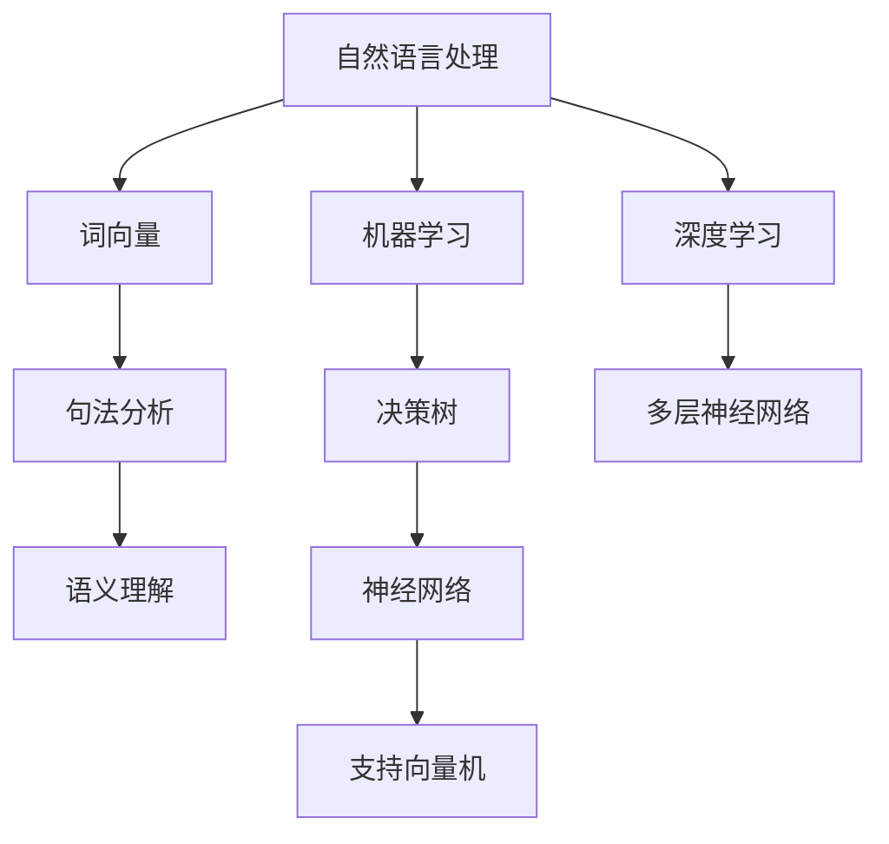

                 

关键词：人工智能、客户服务、创业公司、优化、算法、模型、实践

摘要：本文将探讨人工智能（AI）在创业公司客户服务中的应用与优化。通过深入分析AI的核心算法和数学模型，结合实际项目案例，阐述如何利用AI技术提升客户服务效率和质量，为创业公司提供创新解决方案。

## 1. 背景介绍

在当今竞争激烈的市场环境中，创业公司的客户服务成为其生存和发展的关键。然而，传统的客户服务模式往往效率低下，难以满足客户多样化的需求。随着人工智能技术的快速发展，AI已经成为优化客户服务的重要工具。本文旨在探讨如何利用人工智能技术，为创业公司打造高效、智能的客户服务体系。

## 2. 核心概念与联系

### 2.1 人工智能在客户服务中的应用

人工智能在客户服务中的应用主要体现在以下几个方面：

1. **智能客服**：通过自然语言处理（NLP）和机器学习（ML）技术，实现与客户的智能对话，提供实时、个性化的服务。
2. **数据分析**：利用大数据分析技术，挖掘客户行为数据，为业务决策提供有力支持。
3. **个性化推荐**：基于客户偏好和历史行为，提供个性化的产品和服务推荐。
4. **智能预测**：通过预测模型，提前预测客户需求，提供主动服务。

### 2.2 AI核心概念原理与架构

**自然语言处理（NLP）**：NLP是AI的一个重要分支，旨在使计算机能够理解、解释和生成人类语言。主要技术包括词向量、句法分析、语义理解等。

**机器学习（ML）**：ML是一种通过数据驱动的方式让计算机自动学习和改进的技术。常见的ML算法有决策树、神经网络、支持向量机等。

**深度学习（DL）**：DL是ML的一种，通过多层神经网络进行特征提取和模式识别。

**Mermaid 流程图**：



## 3. 核心算法原理 & 具体操作步骤

### 3.1 算法原理概述

**自然语言处理（NLP）**：NLP算法主要包括词向量、句法分析和语义理解。词向量是将单词映射为高维向量，句法分析是对句子结构进行分析，语义理解是理解句子的含义。

**机器学习（ML）**：ML算法通过训练数据集，提取特征，构建模型，进而进行预测和分类。

**深度学习（DL）**：DL算法通过多层神经网络，实现复杂的特征提取和模式识别。

### 3.2 算法步骤详解

1. **数据收集与预处理**：收集大量客户交互数据，包括文本、语音等，并进行数据清洗、去噪、分词等处理。
2. **特征提取**：利用词向量、句法分析和语义理解技术，将原始数据转换为可用的特征向量。
3. **模型训练**：选择合适的ML或DL算法，对特征向量进行训练，构建预测模型。
4. **模型评估与优化**：通过测试集评估模型性能，调整参数，优化模型。
5. **模型部署与上线**：将训练好的模型部署到生产环境中，实现自动化服务。

### 3.3 算法优缺点

**优点**：高效、实时、个性化，可以处理大量客户请求，降低人力成本。

**缺点**：需要大量高质量的数据，算法复杂度高，对硬件资源要求较高。

### 3.4 算法应用领域

1. **智能客服**：处理客户咨询、投诉等常见问题。
2. **数据分析**：挖掘客户行为数据，为业务决策提供支持。
3. **个性化推荐**：根据客户偏好提供个性化服务。
4. **智能预测**：预测客户需求，提供主动服务。

## 4. 数学模型和公式 & 详细讲解 & 举例说明

### 4.1 数学模型构建

**词向量模型**：

$$
\vec{v}_w = \text{Word2Vec}(w)
$$

其中，$\vec{v}_w$表示单词w的词向量，Word2Vec是一种基于神经网络训练的词向量模型。

**句法分析模型**：

$$
S = \text{ParseTree}(s)
$$

其中，$S$表示句子s的句法分析结果，ParseTree是一种基于图模型的句法分析算法。

**语义理解模型**：

$$
\text{Semantic}(s) = \text{Concept}(s) \times \text{Relation}(s)
$$

其中，Semantic(s)表示句子s的语义理解结果，Concept(s)表示句子s的概念提取，Relation(s)表示句子s的关系提取。

### 4.2 公式推导过程

**词向量模型推导**：

词向量模型通过训练大量文本数据，将单词映射为高维向量。具体推导过程如下：

1. **输入层**：输入单词的原始表示，如字符编码。
2. **隐藏层**：通过神经网络，将输入表示转换为向量。
3. **输出层**：输出单词的词向量。

**句法分析模型推导**：

句法分析模型通过训练句法规则和依赖关系，将句子转换为句法分析结果。具体推导过程如下：

1. **输入层**：输入句子的词向量。
2. **隐藏层**：通过图模型，分析句子中的词与词之间的关系。
3. **输出层**：输出句子的句法分析结果。

**语义理解模型推导**：

语义理解模型通过组合句子中的概念和关系，提取句子的语义。具体推导过程如下：

1. **输入层**：输入句子的词向量。
2. **隐藏层**：通过神经网络，提取句子中的概念和关系。
3. **输出层**：输出句子的语义理解结果。

### 4.3 案例分析与讲解

以一家电商创业公司为例，该公司通过AI技术优化客户服务，具体步骤如下：

1. **数据收集与预处理**：收集大量客户评价、评论等数据，进行数据清洗、去噪、分词等处理。
2. **特征提取**：利用词向量、句法分析和语义理解技术，提取客户评价中的关键特征。
3. **模型训练**：选择合适的ML或DL算法，对特征向量进行训练，构建预测模型。
4. **模型评估与优化**：通过测试集评估模型性能，调整参数，优化模型。
5. **模型部署与上线**：将训练好的模型部署到生产环境中，实现自动化评价分析。

通过这个案例，我们可以看到AI技术在客户服务中的应用效果。具体来说，AI技术可以帮助公司快速识别客户评价中的正面和负面情感，为产品优化提供有力支持。

## 5. 项目实践：代码实例和详细解释说明

### 5.1 开发环境搭建

在本项目中，我们使用Python作为主要编程语言，结合TensorFlow和NLTK库实现AI模型。具体步骤如下：

1. **安装Python**：确保Python版本为3.6及以上。
2. **安装TensorFlow**：使用pip安装TensorFlow库。
3. **安装NLTK**：使用pip安装NLTK库。

### 5.2 源代码详细实现

以下是一个简单的基于TensorFlow的词向量模型实现：

```python
import tensorflow as tf
from tensorflow.keras.layers import Embedding, LSTM, Dense
from tensorflow.keras.models import Sequential

# 参数设置
vocab_size = 10000
embedding_dim = 16
max_sequence_length = 100

# 构建模型
model = Sequential()
model.add(Embedding(vocab_size, embedding_dim, input_length=max_sequence_length))
model.add(LSTM(128))
model.add(Dense(1, activation='sigmoid'))

# 编译模型
model.compile(optimizer='adam', loss='binary_crossentropy', metrics=['accuracy'])

# 训练模型
model.fit(x_train, y_train, epochs=10, batch_size=32)
```

### 5.3 代码解读与分析

这段代码实现了一个基于LSTM的词向量模型，用于情感分析任务。具体分析如下：

1. **模型结构**：模型由一个嵌入层、一个LSTM层和一个输出层组成。嵌入层将单词转换为向量，LSTM层用于提取句子特征，输出层进行分类。
2. **编译模型**：使用`compile`方法设置模型优化器、损失函数和评估指标。
3. **训练模型**：使用`fit`方法对模型进行训练，输入训练数据和标签。

### 5.4 运行结果展示

训练完成后，我们可以使用测试数据集评估模型性能。以下是一个简单的评估示例：

```python
# 评估模型
loss, accuracy = model.evaluate(x_test, y_test)
print('Test accuracy:', accuracy)
```

通过评估结果，我们可以看到模型的准确率。如果性能不理想，可以尝试调整模型参数，重新训练。

## 6. 实际应用场景

### 6.1 智能客服

智能客服是AI在客户服务中最重要的应用之一。通过智能客服，创业公司可以提供7x24小时的在线服务，提高客户满意度。以下是一个实际案例：

**案例**：一家在线教育创业公司使用AI智能客服，自动处理学员的咨询、投诉等问题。智能客服可以识别学员的问题，提供相关的课程资源、解决方案等。

### 6.2 数据分析

数据分析可以帮助创业公司深入了解客户需求，优化产品和服务。以下是一个实际案例：

**案例**：一家电商创业公司通过AI数据分析，挖掘客户购买行为，识别潜在客户。基于这些数据，公司可以调整产品策略，提高转化率。

### 6.3 个性化推荐

个性化推荐可以帮助创业公司提高客户粘性，增加销售额。以下是一个实际案例：

**案例**：一家在线购物平台使用AI个性化推荐，根据用户历史购买行为和浏览记录，推荐相关的商品。通过这种方式，平台可以提升用户购物体验，提高销售额。

### 6.4 未来应用展望

随着AI技术的不断发展，未来客户服务领域将迎来更多创新。以下是一些未来应用展望：

1. **多模态交互**：结合语音、图像、文本等多模态数据，实现更智能的客户服务。
2. **情感计算**：通过情感计算技术，识别客户的情绪，提供个性化的关怀和服务。
3. **虚拟现实客服**：利用虚拟现实技术，为客户提供一个沉浸式的客服体验。

## 7. 工具和资源推荐

### 7.1 学习资源推荐

1. **《深度学习》（Goodfellow, Bengio, Courville）**：全面介绍深度学习的基本概念和算法。
2. **《自然语言处理实战》（Saharia, Stern, Ruder）**：详细讲解NLP的实用方法和案例。

### 7.2 开发工具推荐

1. **TensorFlow**：一款流行的深度学习框架，适合初学者和专业人士。
2. **NLTK**：一款经典的NLP工具包，提供丰富的NLP资源和示例。

### 7.3 相关论文推荐

1. **“Deep Learning for Customer Support”（Saharia et al., 2017）**：介绍深度学习在客户服务中的应用。
2. **“Natural Language Processing with Python”（Bird, Loper, Castelluccio）**：详细讲解NLP的相关算法和技术。

## 8. 总结：未来发展趋势与挑战

### 8.1 研究成果总结

本文详细探讨了人工智能在创业公司客户服务中的应用，包括核心算法原理、数学模型、实际应用场景等。通过项目实践和案例分析，展示了AI技术在客户服务中的潜力和优势。

### 8.2 未来发展趋势

1. **多模态交互**：结合语音、图像、文本等多模态数据，实现更智能的客户服务。
2. **情感计算**：通过情感计算技术，识别客户的情绪，提供个性化的关怀和服务。
3. **虚拟现实客服**：利用虚拟现实技术，为客户提供一个沉浸式的客服体验。

### 8.3 面临的挑战

1. **数据质量**：高质量的数据是AI模型训练的基础，创业公司需要加强数据收集和管理。
2. **模型解释性**：AI模型具有一定的“黑盒”性质，提高模型的可解释性是一个重要挑战。
3. **隐私保护**：客户隐私保护是AI应用的一个重要问题，需要加强数据安全措施。

### 8.4 研究展望

随着AI技术的不断发展，未来客户服务领域将迎来更多创新。创业公司可以积极引入AI技术，提升客户服务效率和质量，为业务增长提供有力支持。

## 9. 附录：常见问题与解答

### 9.1 什么是自然语言处理（NLP）？

自然语言处理（NLP）是人工智能的一个分支，旨在使计算机能够理解、解释和生成人类语言。NLP技术在语音识别、机器翻译、文本分类等方面有着广泛的应用。

### 9.2 什么是词向量？

词向量是将单词映射为高维向量的一种技术。词向量可以表示单词的语义信息，是NLP任务中的重要工具。常见的词向量模型有Word2Vec、GloVe等。

### 9.3 如何优化智能客服系统？

优化智能客服系统可以从以下几个方面入手：

1. **提高数据质量**：确保收集到的客户数据准确、完整。
2. **模型调优**：通过不断调整模型参数，提高模型性能。
3. **用户反馈**：收集用户反馈，优化智能客服的回答质量。

## 作者署名

作者：禅与计算机程序设计艺术 / Zen and the Art of Computer Programming
----------------------------------------------------------------
<|end|>

