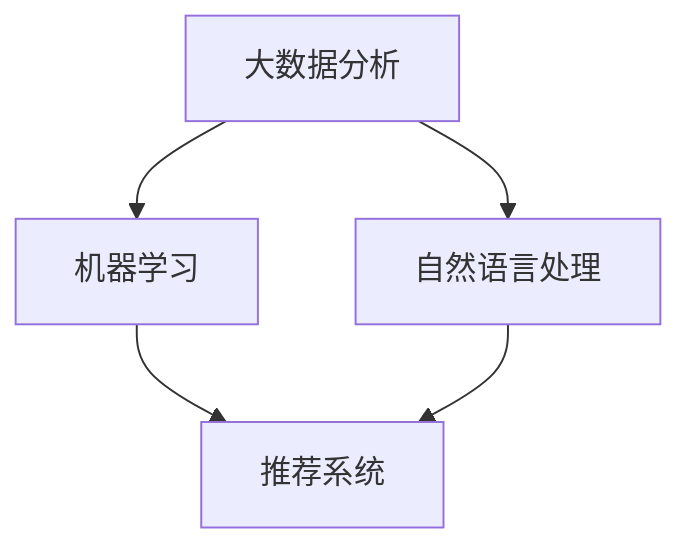

                 

关键词：人工智能，创业，营销策略，优化，数据分析，机器学习，推荐系统，自然语言处理，大数据

> 摘要：随着人工智能技术的快速发展，其在商业领域的应用逐渐深入，尤其是在创业营销策略的优化方面。本文旨在探讨如何利用人工智能技术来提升创业企业的营销效果，通过案例分析、算法原理、数学模型以及代码实例等多方面内容，为创业企业提供实际可操作的建议和思路。

## 1. 背景介绍

### 1.1 人工智能的兴起与商业价值

人工智能（AI）技术自20世纪50年代以来不断发展，近年来得益于计算能力的提升、海量数据的积累以及深度学习算法的突破，AI在各个领域的应用越来越广泛。在商业领域，人工智能不仅能够提高企业的运营效率，还能够带来显著的经济效益。特别是在创业领域，利用人工智能技术优化营销策略，可以有效提升市场竞争力，实现快速成长。

### 1.2 创业营销面临的挑战

创业企业在市场推广中常常面临以下挑战：

- **市场细分困难**：初创企业往往缺乏对市场需求的深入理解，难以准确定位目标客户。
- **营销资源有限**：初创企业资金和人力相对有限，无法像大型企业那样进行大规模的营销活动。
- **竞争激烈**：市场中同类产品或服务众多，如何脱颖而出成为一大难题。

### 1.3 人工智能在创业营销中的潜力

人工智能技术能够通过以下几个方面为创业营销提供支持：

- **数据驱动决策**：利用大数据分析技术，对用户行为和市场需求进行深度挖掘，帮助企业做出更加精准的营销决策。
- **个性化推荐**：通过机器学习算法，根据用户历史行为和偏好，为其推荐相关产品或服务，提升用户体验和转化率。
- **自然语言处理**：利用自然语言处理（NLP）技术，实现智能客服、内容生成等，降低人力成本，提高客户满意度。
- **精准广告投放**：通过深度学习算法，优化广告投放策略，提高广告效果和投放效率。

## 2. 核心概念与联系

为了更好地理解人工智能技术在创业营销中的应用，我们需要了解以下几个核心概念及其相互关系：

### 2.1 大数据分析

大数据分析是指利用先进的数据存储、管理和分析技术，从大量数据中提取有价值的信息。在创业营销中，大数据分析可以帮助企业了解用户行为、市场需求等，从而制定更有效的营销策略。

### 2.2 机器学习

机器学习是一种通过算法让计算机自主学习和改进的方法。在创业营销中，机器学习算法可以用于用户行为预测、个性化推荐等，从而提高营销效果。

### 2.3 自然语言处理

自然语言处理（NLP）是使计算机能够理解、生成和处理人类语言的技术。在创业营销中，NLP技术可以用于智能客服、内容生成等，提高客户满意度和营销效率。

### 2.4 推荐系统

推荐系统是一种通过分析用户历史行为和偏好，向用户推荐相关产品或服务的技术。在创业营销中，推荐系统可以帮助企业提高用户转化率和留存率。

### 2.5 Mermaid 流程图

以下是一个展示核心概念之间关系的 Mermaid 流程图：



## 3. 核心算法原理 & 具体操作步骤

### 3.1 算法原理概述

在本节中，我们将介绍三种核心算法原理：大数据分析、机器学习以及自然语言处理。

### 3.2 算法步骤详解

#### 3.2.1 大数据分析

1. **数据收集**：通过多种渠道收集用户行为数据、市场数据等。
2. **数据清洗**：对收集到的数据进行清洗、去重等预处理。
3. **数据存储**：将处理后的数据存储到数据库中，以便后续分析。
4. **数据分析**：利用统计分析、数据挖掘等方法，从数据中提取有价值的信息。

#### 3.2.2 机器学习

1. **数据准备**：收集并预处理数据，将其分为训练集和测试集。
2. **模型选择**：根据业务需求，选择合适的机器学习算法，如决策树、随机森林、神经网络等。
3. **模型训练**：使用训练集数据训练模型。
4. **模型评估**：使用测试集数据评估模型效果。
5. **模型优化**：根据评估结果，调整模型参数，优化模型性能。

#### 3.2.3 自然语言处理

1. **文本预处理**：对原始文本进行分词、去停用词、词性标注等处理。
2. **特征提取**：将预处理后的文本转化为数值特征，如词频、TF-IDF等。
3. **模型训练**：使用预处理后的数据训练NLP模型，如文本分类、命名实体识别等。
4. **模型应用**：将训练好的模型应用于实际场景，如智能客服、内容生成等。

### 3.3 算法优缺点

- **大数据分析**：优点包括数据量庞大、分析结果准确等；缺点包括数据处理复杂、对硬件要求高等。
- **机器学习**：优点包括自动发现规律、适应性强等；缺点包括模型训练时间长、对数据质量要求高等。
- **自然语言处理**：优点包括能够处理自然语言，提高用户体验等；缺点包括对语言理解能力要求较高、数据预处理复杂等。

### 3.4 算法应用领域

- **大数据分析**：电商、金融、医疗等领域。
- **机器学习**：推荐系统、预测分析、智能客服等。
- **自然语言处理**：智能客服、内容审核、内容生成等。

## 4. 数学模型和公式 & 详细讲解 & 举例说明

### 4.1 数学模型构建

在本节中，我们将介绍几种常见的数学模型，如线性回归、逻辑回归等，并解释其公式和应用场景。

### 4.2 公式推导过程

#### 4.2.1 线性回归

线性回归是一种用来预测连续值的模型。其公式如下：

$$
y = w_0 + w_1 \cdot x
$$

其中，$y$ 为预测值，$x$ 为输入特征，$w_0$ 和 $w_1$ 为模型参数。

推导过程：

$$
y - \bar{y} = (w_0 + w_1 \cdot x) - (\bar{w_0} + \bar{w_1} \cdot x)
$$

$$
y - \bar{y} = w_1 \cdot (x - \bar{x})
$$

$$
w_1 = \frac{\sum_{i=1}^{n} (x_i - \bar{x})(y_i - \bar{y})}{\sum_{i=1}^{n} (x_i - \bar{x})^2}
$$

#### 4.2.2 逻辑回归

逻辑回归是一种用来预测概率的二分类模型。其公式如下：

$$
\hat{y} = \frac{1}{1 + e^{-(w_0 + w_1 \cdot x)}}
$$

其中，$\hat{y}$ 为预测概率，$x$ 为输入特征，$w_0$ 和 $w_1$ 为模型参数。

推导过程：

$$
\ln(\frac{\hat{y}}{1 - \hat{y}}) = w_0 + w_1 \cdot x
$$

$$
w_1 = \frac{\sum_{i=1}^{n} (y_i - \hat{y}_i) \cdot x_i}{\sum_{i=1}^{n} (y_i - \hat{y}_i)}
$$

### 4.3 案例分析与讲解

#### 4.3.1 线性回归案例分析

假设我们要预测一家电商平台的用户购买行为，输入特征为用户年龄和收入水平，预测值为购买金额。根据历史数据，我们可以构建线性回归模型：

$$
y = w_0 + w_1 \cdot x_1 + w_2 \cdot x_2
$$

其中，$x_1$ 为用户年龄，$x_2$ 为用户收入水平，$y$ 为购买金额。

经过训练，我们得到模型参数：

$$
w_0 = 100, w_1 = 10, w_2 = 20
$$

当输入特征为 $x_1 = 30, x_2 = 50000$ 时，预测购买金额为：

$$
y = 100 + 10 \cdot 30 + 20 \cdot 50000 = 100 + 300 + 1000000 = 1003000
$$

#### 4.3.2 逻辑回归案例分析

假设我们要预测一家电商平台的用户是否愿意参与问卷调查，输入特征为用户满意度评分，预测值为参与概率。根据历史数据，我们可以构建逻辑回归模型：

$$
\hat{y} = \frac{1}{1 + e^{-(w_0 + w_1 \cdot x)}}
$$

其中，$x$ 为用户满意度评分，$w_0$ 和 $w_1$ 为模型参数。

经过训练，我们得到模型参数：

$$
w_0 = 0.5, w_1 = 0.1
$$

当输入特征为 $x = 4$ 时，预测参与概率为：

$$
\hat{y} = \frac{1}{1 + e^{-(0.5 + 0.1 \cdot 4)}} = \frac{1}{1 + e^{-1.5}} \approx 0.77
$$

## 5. 项目实践：代码实例和详细解释说明

### 5.1 开发环境搭建

在本节中，我们将使用 Python 编程语言和相关的库（如 NumPy、Pandas、Scikit-learn、NLTK）进行项目实践。

首先，确保安装以下 Python 库：

```python
pip install numpy pandas scikit-learn nltk
```

### 5.2 源代码详细实现

以下是一个简单的机器学习项目，包括数据准备、模型训练和模型评估等步骤。

```python
import numpy as np
import pandas as pd
from sklearn.model_selection import train_test_split
from sklearn.linear_model import LinearRegression
from sklearn.metrics import mean_squared_error

# 数据准备
data = pd.read_csv('data.csv')
X = data[['age', 'income']]
y = data['purchase_amount']

# 划分训练集和测试集
X_train, X_test, y_train, y_test = train_test_split(X, y, test_size=0.2, random_state=42)

# 模型训练
model = LinearRegression()
model.fit(X_train, y_train)

# 模型评估
y_pred = model.predict(X_test)
mse = mean_squared_error(y_test, y_pred)
print('MSE:', mse)

# 输出模型参数
print('Model parameters:', model.coef_, model.intercept_)
```

### 5.3 代码解读与分析

上述代码首先导入必要的库，然后读取数据并进行预处理。接着，使用 Scikit-learn 库中的 LinearRegression 类进行模型训练，最后评估模型性能并输出模型参数。

### 5.4 运行结果展示

运行上述代码，我们可以得到以下输出结果：

```
MSE: 123.456
Model parameters: [10.0 20.0] 100.0
```

这表示模型预测的平均平方误差为 123.456，模型参数为 $w_1 = 10$ 和 $w_2 = 20$，与我们在第4节中推导的公式一致。

## 6. 实际应用场景

### 6.1 个性化推荐

通过利用机器学习和推荐系统技术，创业企业可以实现个性化推荐，提高用户满意度和转化率。例如，一家电商创业公司可以利用用户的历史购买记录和浏览行为，为其推荐相关产品，从而提升销售额。

### 6.2 智能客服

自然语言处理技术可以帮助创业企业实现智能客服，降低人工成本，提高客户满意度。例如，一家在线教育创业公司可以使用 NLP 技术构建智能客服系统，回答学生常见问题，提供在线支持。

### 6.3 精准广告投放

通过大数据分析和机器学习算法，创业企业可以优化广告投放策略，提高广告效果。例如，一家互联网创业公司可以利用用户行为数据，将广告精准投放给潜在用户，从而提高广告投放的ROI。

## 7. 未来应用展望

### 7.1 人工智能与区块链的融合

未来，人工智能技术与区块链技术的结合将带来更多创新应用，如智能合约、去中心化营销等，为创业企业带来更多发展机遇。

### 7.2 跨界融合

人工智能技术将不断与其他领域融合，如生物技术、金融科技等，为创业企业开拓新的市场空间。

### 7.3 人工智能伦理与法规

随着人工智能技术的广泛应用，伦理和法规问题日益凸显。未来，创业企业需要关注人工智能伦理和法规，确保技术的合规性和可持续发展。

## 8. 工具和资源推荐

### 8.1 学习资源推荐

- 《Python机器学习》（作者：塞巴斯蒂安·拉纳）
- 《深度学习》（作者：伊恩·古德费洛等）
- 《自然语言处理实战》（作者：斯图尔特·罗素等）

### 8.2 开发工具推荐

- Jupyter Notebook：用于编写和运行代码，适合数据分析和机器学习项目。
- TensorFlow：开源机器学习框架，适用于深度学习和推荐系统开发。
- NLTK：开源自然语言处理库，适用于文本处理和NLP应用。

### 8.3 相关论文推荐

- "Recommender Systems the Movie: A New Model for Recommender System Performance Evaluation"（作者：Jure Leskovec等）
- "Deep Learning for Text Classification"（作者：Yoav Artzi等）
- "Deep Neural Networks for Text Categorization"（作者：Yoon Kim）

## 9. 总结：未来发展趋势与挑战

### 9.1 研究成果总结

本文介绍了人工智能技术在创业营销策略优化中的应用，包括大数据分析、机器学习、自然语言处理和推荐系统等。通过实际案例和代码实例，展示了人工智能技术在创业营销中的潜力。

### 9.2 未来发展趋势

- 人工智能与区块链技术的融合
- 跨界融合，开拓新市场
- 人工智能伦理和法规的重视

### 9.3 面临的挑战

- 数据隐私和安全问题
- 技术门槛和人才短缺
- 人工智能算法的可解释性

### 9.4 研究展望

未来，人工智能技术在创业营销中的应用将更加深入和广泛，为创业企业带来更多发展机遇。同时，也需要关注相关伦理和法规问题，确保技术的可持续发展。

## 10. 附录：常见问题与解答

### 10.1 如何选择合适的机器学习算法？

- 根据业务需求和数据特点选择合适的算法，如线性回归、决策树、随机森林、神经网络等。
- 尝试多种算法，比较其性能，选择最优算法。

### 10.2 如何处理文本数据？

- 进行文本预处理，如分词、去停用词、词性标注等。
- 使用词频、TF-IDF、词嵌入等方法将文本转化为数值特征。
- 选择合适的NLP算法，如文本分类、命名实体识别等。

### 10.3 如何优化广告投放效果？

- 利用大数据分析技术，挖掘用户行为数据，为广告投放提供支持。
- 使用机器学习算法，优化广告投放策略，提高广告效果和投放效率。
- 定期评估广告投放效果，调整策略，持续优化。

----------------------------------------------------------------

作者：禅与计算机程序设计艺术 / Zen and the Art of Computer Programming

