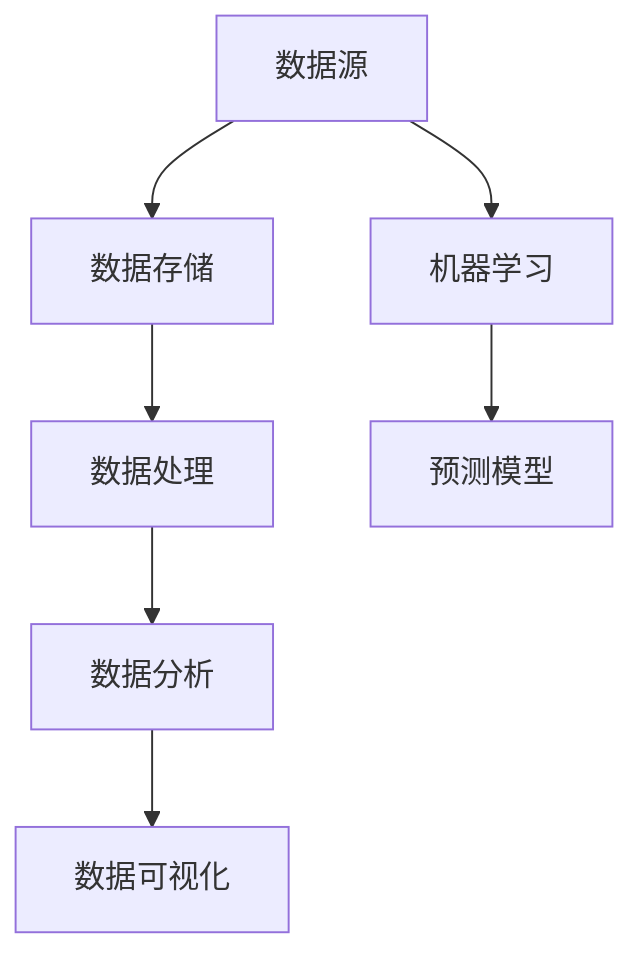

                 

关键词：大数据、业务决策、数据挖掘、机器学习、优化算法、实时分析、预测模型

摘要：本文将探讨如何利用大数据技术来优化业务决策。通过介绍大数据的基本概念、核心算法原理、数学模型构建以及具体应用实例，我们将深入分析大数据在业务决策中的应用价值，并提出未来发展趋势与面临的挑战。

## 1. 背景介绍

随着互联网、物联网、社交媒体等技术的飞速发展，数据已经成为企业最为宝贵的资产。如何有效地利用这些数据来指导业务决策，成为企业竞争的关键。大数据技术以其海量、多样、快速和低价值密度的特点，为业务决策提供了强有力的支持。

大数据技术主要包括数据采集、存储、处理、分析和可视化等环节。其中，数据挖掘和机器学习技术是大数据的核心。通过数据挖掘技术，可以从海量数据中发现潜在的模式和趋势；而机器学习技术则可以帮助我们建立预测模型，为企业提供更准确的决策支持。

## 2. 核心概念与联系

### 2.1 数据挖掘与机器学习

数据挖掘（Data Mining）是一种从大量数据中发现有用信息和知识的过程。它主要依赖于统计学、机器学习、数据库技术和人工智能等方法。

机器学习（Machine Learning）是一种使计算机系统通过数据学习并做出决策的技术。它通过分析大量数据，找出数据之间的关联，并利用这些关联来预测新数据。

### 2.2 大数据技术架构

大数据技术架构主要包括数据源、数据存储、数据处理、数据分析和数据可视化等模块。

- **数据源**：包括企业内部和外部数据，如用户行为数据、交易数据、社交媒体数据等。
- **数据存储**：采用分布式存储技术，如Hadoop、Spark等，实现海量数据的存储和管理。
- **数据处理**：包括数据清洗、数据转换和数据集成等过程，确保数据的质量和一致性。
- **数据分析**：利用数据挖掘和机器学习技术，对数据进行深度分析和挖掘，提取有用信息。
- **数据可视化**：通过可视化工具，将分析结果呈现给用户，帮助用户更好地理解数据。

### 2.3 Mermaid 流程图



## 3. 核心算法原理 & 具体操作步骤

### 3.1 算法原理概述

大数据技术中，常用的算法包括决策树、随机森林、支持向量机、神经网络等。

- **决策树**：通过树的形状来表示数据之间的依赖关系，从而进行分类或回归。
- **随机森林**：基于决策树构建多个分类器，并通过集成方法提高分类准确性。
- **支持向量机**：通过寻找数据空间中的最佳分割超平面，实现分类任务。
- **神经网络**：模拟人脑神经网络结构，通过多层神经网络实现复杂函数的映射。

### 3.2 算法步骤详解

以决策树算法为例，其基本步骤如下：

1. **数据预处理**：对数据进行清洗、转换和标准化处理。
2. **特征选择**：选择对分类任务最有影响力的特征。
3. **构建决策树**：通过信息增益或基尼不纯度等指标，选择最佳分割特征，递归构建决策树。
4. **模型评估**：使用交叉验证等方法评估决策树的分类准确性。
5. **剪枝**：根据模型评估结果，对决策树进行剪枝，防止过拟合。

### 3.3 算法优缺点

- **决策树**：简单易懂，可解释性强；但易过拟合，对异常值敏感。
- **随机森林**：提高分类准确性，减少过拟合；但可解释性较差。
- **支持向量机**：理论成熟，分类效果好；但计算复杂度高，对非线性数据效果不佳。
- **神经网络**：能处理复杂非线性问题，分类准确性高；但训练过程复杂，难以解释。

### 3.4 算法应用领域

大数据算法在多个领域有广泛应用，如：

- **金融行业**：信用评分、风险控制、投资决策等。
- **电商行业**：用户行为分析、推荐系统、营销策略等。
- **医疗行业**：疾病预测、个性化治疗、药物研发等。
- **制造业**：生产调度、设备维护、供应链优化等。

## 4. 数学模型和公式 & 详细讲解 & 举例说明

### 4.1 数学模型构建

以线性回归模型为例，其基本数学模型为：

$$ y = \beta_0 + \beta_1 \cdot x + \epsilon $$

其中，$y$ 为因变量，$x$ 为自变量，$\beta_0$ 和 $\beta_1$ 分别为模型参数，$\epsilon$ 为误差项。

### 4.2 公式推导过程

假设我们有 $n$ 个数据点 $(x_i, y_i)$，则线性回归模型的目标是最小化误差平方和：

$$ S = \sum_{i=1}^{n} (y_i - (\beta_0 + \beta_1 \cdot x_i))^2 $$

对 $S$ 求导，并令导数为零，可以得到：

$$ \frac{\partial S}{\partial \beta_0} = -2 \sum_{i=1}^{n} (y_i - (\beta_0 + \beta_1 \cdot x_i)) = 0 $$

$$ \frac{\partial S}{\partial \beta_1} = -2 \sum_{i=1}^{n} (y_i - (\beta_0 + \beta_1 \cdot x_i)) \cdot x_i = 0 $$

解上述方程组，可以得到模型参数 $\beta_0$ 和 $\beta_1$。

### 4.3 案例分析与讲解

假设我们要预测某个城市的月平均降雨量，已知自变量为月平均气温。通过收集数据，我们可以建立线性回归模型：

$$ y = \beta_0 + \beta_1 \cdot x $$

其中，$y$ 为月平均降雨量（单位：毫米），$x$ 为月平均气温（单位：摄氏度）。

通过最小二乘法，我们可以得到模型参数：

$$ \beta_0 = 10, \beta_1 = 0.2 $$

因此，预测模型为：

$$ y = 10 + 0.2 \cdot x $$

当月平均气温为 20 摄氏度时，预测的月平均降雨量为：

$$ y = 10 + 0.2 \cdot 20 = 12 $$

毫米。

## 5. 项目实践：代码实例和详细解释说明

### 5.1 开发环境搭建

为了实现大数据优化业务决策，我们需要搭建一个完整的开发环境。以下是所需的软件和工具：

- **Python**：编程语言
- **Jupyter Notebook**：交互式开发环境
- **Pandas**：数据处理库
- **Scikit-learn**：机器学习库
- **Matplotlib**：数据可视化库

### 5.2 源代码详细实现

以下是一个使用线性回归模型进行业务决策的代码示例：

```python
import pandas as pd
from sklearn.linear_model import LinearRegression
import matplotlib.pyplot as plt

# 读取数据
data = pd.read_csv('rainfall_data.csv')
x = data['temperature']  # 月平均气温
y = data['rainfall']  # 月平均降雨量

# 创建线性回归模型
model = LinearRegression()
model.fit(x.values.reshape(-1, 1), y.values)

# 模型参数
beta_0 = model.intercept_
beta_1 = model.coef_

# 预测月平均降雨量
x_pred = 20  # 月平均气温为 20 摄氏度
y_pred = beta_0 + beta_1 * x_pred

print(f'预测的月平均降雨量为：{y_pred:.2f}毫米')

# 可视化
plt.scatter(x, y)
plt.plot(x, model.predict(x.values.reshape(-1, 1)), color='red')
plt.xlabel('月平均气温')
plt.ylabel('月平均降雨量')
plt.show()
```

### 5.3 代码解读与分析

1. **数据读取**：使用 Pandas 库读取数据文件，并将数据分为自变量和因变量。
2. **创建模型**：使用 Scikit-learn 库创建线性回归模型。
3. **训练模型**：使用 `fit()` 方法训练模型。
4. **模型参数**：获取模型参数，即线性回归方程的斜率和截距。
5. **预测**：根据模型参数，预测新的数据点的值。
6. **可视化**：使用 Matplotlib 库将原始数据点和预测结果可视化。

### 5.4 运行结果展示

运行上述代码后，将输出预测的月平均降雨量，并在图表中展示原始数据点和预测结果。这有助于我们直观地理解模型的效果。

## 6. 实际应用场景

大数据技术在各个行业都有广泛的应用。以下是一些典型的应用场景：

- **金融行业**：通过大数据分析，金融机构可以更准确地评估信用风险，优化投资组合，提高盈利能力。
- **电商行业**：利用大数据分析用户行为，电商平台可以精准推送商品，提高转化率。
- **医疗行业**：通过大数据分析患者数据，医疗机构可以更准确地诊断疾病，提高治疗效果。
- **制造业**：通过大数据分析生产数据，企业可以实现智能生产，降低成本，提高效率。

## 7. 工具和资源推荐

### 7.1 学习资源推荐

- **《数据挖掘：实用工具与技术》**：详细介绍了数据挖掘的基本概念和技术。
- **《机器学习实战》**：通过大量实例，介绍了机器学习的基本算法和应用。
- **《大数据技术导论》**：全面介绍了大数据技术的体系结构和实现方法。

### 7.2 开发工具推荐

- **Jupyter Notebook**：方便的交互式开发环境，适合数据分析和机器学习。
- **PyCharm**：强大的 Python 集成开发环境，支持多种编程语言。
- **Docker**：容器化技术，方便搭建和管理开发环境。

### 7.3 相关论文推荐

- **“Large-scale Online Learning for Real-Time Entity Recognition”**：介绍了一种实时实体识别的在线学习算法。
- **“Learning to Discover Knowledge at Scale without a Teacher”**：介绍了一种无监督学习算法，用于大规模知识发现。
- **“Deep Learning on Multi-Modal Big Data”**：介绍了多模态大数据的深度学习算法和应用。

## 8. 总结：未来发展趋势与挑战

### 8.1 研究成果总结

大数据技术在业务决策中的应用取得了显著成果，包括：

- 提高了数据处理的效率和准确性。
- 优化了业务流程和决策过程。
- 帮助企业实现数字化转型。

### 8.2 未来发展趋势

未来，大数据技术在业务决策中的应用将呈现以下趋势：

- 更多的数据源和数据的多样性。
- 更先进的算法和技术，如深度学习和联邦学习。
- 更好的数据治理和数据安全。

### 8.3 面临的挑战

大数据技术在业务决策中也面临一些挑战：

- 数据质量和数据治理。
- 算法可解释性和透明性。
- 数据隐私和安全。

### 8.4 研究展望

未来，大数据技术在业务决策中的应用将有更多创新和突破，如：

- 智能决策系统，实现自动化和智能化的业务决策。
- 跨领域的数据融合和分析，为企业提供更全面的决策支持。

## 9. 附录：常见问题与解答

### 问题 1：大数据与大数据技术的区别是什么？

大数据（Big Data）是指数据规模巨大、数据类型多样、数据产生速度极快的数据集。大数据技术（Big Data Technology）则是用于处理、分析和利用大数据的一系列技术和方法。

### 问题 2：如何保证大数据分析的可解释性？

保证大数据分析的可解释性可以从以下几个方面入手：

- 选择可解释性强的算法，如线性回归、决策树等。
- 对分析结果进行可视化，帮助用户更好地理解数据。
- 提供详细的算法步骤和解释，让用户了解分析过程。

### 问题 3：大数据分析中如何处理数据质量问题？

处理大数据分析中的数据质量问题可以从以下几个方面入手：

- 数据清洗：去除重复数据、缺失值填充、异常值处理等。
- 数据治理：建立数据标准和规范，确保数据质量。
- 数据预处理：对数据进行标准化、归一化等处理，提高数据质量。

### 问题 4：如何保障大数据分析中的数据安全？

保障大数据分析中的数据安全可以从以下几个方面入手：

- 数据加密：对敏感数据进行加密，防止数据泄露。
- 访问控制：设置严格的访问权限，确保数据安全。
- 数据备份和恢复：定期备份数据，确保数据不会丢失。

----------------------------------------------------------------

# 作者署名

作者：禅与计算机程序设计艺术 / Zen and the Art of Computer Programming

[END]

