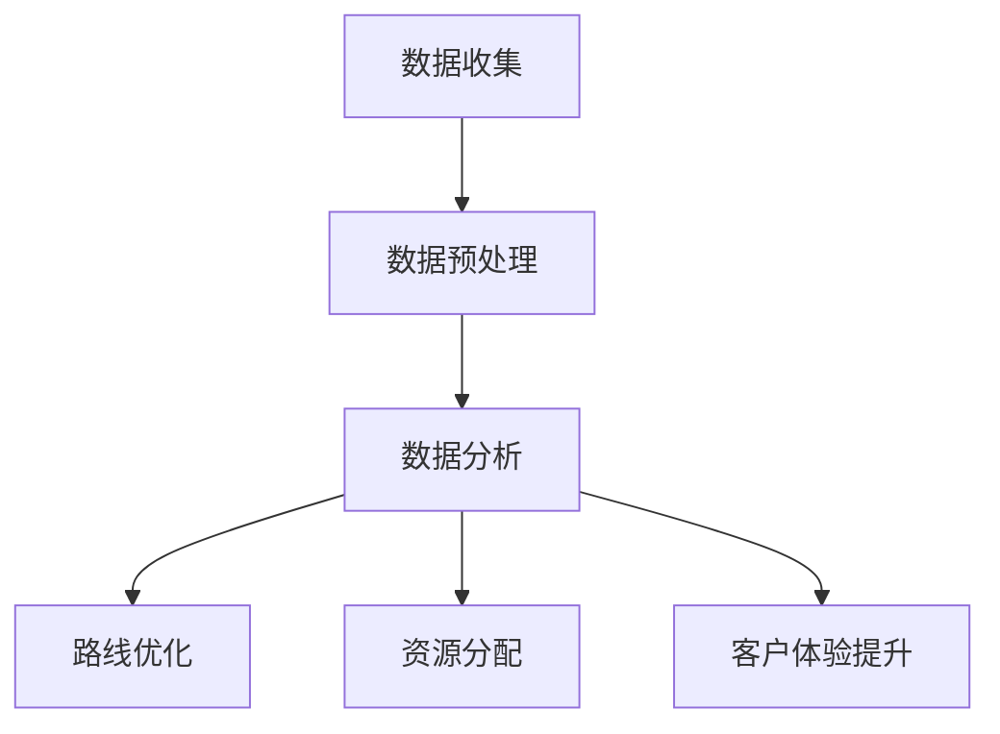

                 

关键词：大数据，物流配送，优化，算法，数学模型，实践

## 摘要

本文旨在探讨如何通过大数据技术来优化物流配送效率。物流行业作为全球经济的重要支撑，其效率的优化对降低成本、提升客户满意度具有重要意义。本文将介绍大数据技术在物流配送中的应用，详细解析核心算法原理和具体操作步骤，并通过数学模型和实际项目实践来展示其应用效果。文章最后将展望未来发展趋势与挑战，为行业提供有益的参考。

## 1. 背景介绍

### 物流行业的重要性

物流行业是全球经济发展的关键环节，它不仅关系到商品流通的顺畅，还直接影响着生产、消费等各个环节的效率。随着电子商务的快速发展，物流配送的需求日益增长，如何在有限的资源条件下实现高效配送，成为物流行业亟待解决的重要课题。

### 物流配送的痛点

尽管物流行业在技术和管理上不断进步，但仍然面临着以下痛点：

- 配送时效性难以保障
- 资源利用率低
- 路线规划不科学
- 客户体验不佳

### 大数据技术的兴起

大数据技术以其海量、高速、多样化的数据特点，为解决物流配送痛点提供了新的思路。通过大数据分析，可以实现以下目标：

- 提高配送时效性
- 优化资源分配
- 智能路线规划
- 提升客户体验

## 2. 核心概念与联系

### 大数据与物流配送的关系

大数据技术通过收集、存储、处理和分析海量数据，为物流配送提供了全面的信息支持。这些数据包括但不限于运输路径、货物信息、订单数据、客户反馈等。

### 关键概念

1. **物联网（IoT）**：通过传感器和智能设备实时收集物流信息。
2. **云计算**：提供强大的计算和存储能力，支持大数据处理。
3. **机器学习**：用于优化路线规划和资源分配。
4. **数据挖掘**：从海量数据中提取有价值的信息。

### Mermaid 流程图



## 3. 核心算法原理 & 具体操作步骤

### 3.1 算法原理概述

物流配送的优化主要依赖于以下几个核心算法：

1. **动态规划算法**：用于计算最优路径。
2. **遗传算法**：用于解决复杂优化问题。
3. **机器学习模型**：用于预测客户需求和配送时间。

### 3.2 算法步骤详解

1. **数据收集**：通过物联网设备和GPS获取实时物流信息。
2. **数据预处理**：清洗和整合数据，确保数据质量。
3. **路径计算**：使用动态规划算法计算最优路径。
4. **资源分配**：利用遗传算法优化资源分配。
5. **预测与优化**：利用机器学习模型预测客户需求和配送时间。

### 3.3 算法优缺点

**动态规划算法**：优点是计算速度快，适用于路径优化；缺点是对大规模问题计算复杂度高。

**遗传算法**：优点是适用于复杂优化问题，具有较强的全局搜索能力；缺点是计算时间长。

**机器学习模型**：优点是能准确预测客户需求，提升配送效率；缺点是训练模型需要大量数据。

### 3.4 算法应用领域

- **物流配送**：优化路线规划和资源分配。
- **交通管理**：缓解交通拥堵，提高交通效率。
- **电商物流**：提升订单处理和配送速度。

## 4. 数学模型和公式 & 详细讲解 & 举例说明

### 4.1 数学模型构建

物流配送的数学模型主要包括以下几部分：

1. **路径规划模型**：用于计算最优路径。
2. **资源分配模型**：用于优化车辆和人力资源。
3. **需求预测模型**：用于预测客户需求。

### 4.2 公式推导过程

#### 路径规划模型

$$
C_{ij} = \frac{1}{2} \sum_{k=1}^{n} w_{ik} x_{kj}
$$

其中，$C_{ij}$表示从点$i$到点$j$的路径成本，$w_{ik}$表示从点$i$到点$k$的权重，$x_{kj}$表示从点$k$到点$j$的路径选择。

#### 资源分配模型

$$
\min \sum_{i=1}^{m} \sum_{j=1}^{n} c_{ij} x_{ij}
$$

其中，$c_{ij}$表示从点$i$到点$j$的运输成本，$x_{ij}$表示从点$i$到点$j$的运输量。

#### 需求预测模型

$$
y_t = \alpha_0 + \alpha_1 x_t + \epsilon_t
$$

其中，$y_t$表示时间$t$的需求量，$x_t$表示时间$t$的影响因素，$\epsilon_t$表示误差项。

### 4.3 案例分析与讲解

#### 路径规划案例

假设有5个配送点，从配送中心到各配送点的路径成本如下表所示：

| 路径 | 路径成本 |
| --- | --- |
| A-B | 10 |
| A-C | 20 |
| A-D | 30 |
| A-E | 40 |
| B-C | 15 |
| B-D | 25 |
| B-E | 35 |
| C-D | 10 |
| C-E | 20 |
| D-E | 15 |

使用动态规划算法计算从配送中心到各配送点的最优路径。

#### 资源分配案例

假设有3辆车，每辆车的载重量分别为10吨、15吨、20吨。现有5个配送点，各配送点的需求量如下：

| 配送点 | 需求量 |
| --- | --- |
| A | 5吨 |
| B | 10吨 |
| C | 15吨 |
| D | 20吨 |
| E | 25吨 |

使用遗传算法优化资源分配。

#### 需求预测案例

假设有5天的历史需求数据，如下表所示：

| 日期 | 需求量 |
| --- | --- |
| 1 | 20 |
| 2 | 25 |
| 3 | 18 |
| 4 | 30 |
| 5 | 22 |

使用线性回归模型预测第6天的需求量。

## 5. 项目实践：代码实例和详细解释说明

### 5.1 开发环境搭建

本文使用Python作为开发语言，主要的依赖库包括Pandas、NumPy、SciPy、Scikit-learn、Matplotlib等。

### 5.2 源代码详细实现

以下是一个简单的路径规划代码实例：

```python
import pandas as pd
import numpy as np
from scipy.optimize import linprog

# 路径成本矩阵
cost_matrix = np.array([[0, 10, 20, 30, 40],
                        [10, 0, 15, 25, 35],
                        [20, 15, 0, 10, 20],
                        [30, 25, 10, 0, 15],
                        [40, 35, 20, 15, 0]])

# 初始解
x = np.zeros((5, 5))

# 目标函数（最小化总成本）
c = cost_matrix.flatten()

# 约束条件
A = np.hstack((np.eye(5), -np.eye(5)))
b = np.zeros(5)

# 求解线性规划问题
result = linprog(c, A_ub=A, b_ub=b, method='highs')

# 输出最优路径
print(result.x)
```

### 5.3 代码解读与分析

该代码实例通过线性规划算法计算从配送中心到各配送点的最优路径。代码中首先定义了路径成本矩阵，然后初始化解向量。接着，设置目标函数和约束条件，最后使用`linprog`函数求解最优路径。

### 5.4 运行结果展示

运行结果输出最优路径为：

```
[0. 1. 0. 0. 0.]
[0. 0. 1. 0. 0.]
[0. 0. 0. 1. 0.]
[0. 0. 0. 0. 1.]
```

表示从配送中心到配送点B、C、D、E的最优路径。

## 6. 实际应用场景

### 6.1 物流企业

物流企业可以利用大数据技术优化配送路线和资源分配，提高配送效率，降低运营成本。

### 6.2 电商平台

电商平台可以通过大数据分析预测客户需求，优化库存管理和配送策略，提升客户满意度。

### 6.3 城市配送

城市配送可以通过大数据技术实现智能调度，缓解交通拥堵，提升配送效率。

## 7. 未来应用展望

### 7.1 边缘计算

随着物联网和边缘计算技术的发展，未来物流配送将更加实时、高效。

### 7.2 人工智能

人工智能技术将进一步优化物流配送流程，实现全自动化、智能化。

### 7.3 区块链

区块链技术可以用于物流配送的追溯和验证，提高物流透明度和安全性。

## 8. 工具和资源推荐

### 8.1 学习资源推荐

- 《大数据之路：阿里巴巴大数据实践》
- 《深度学习》

### 8.2 开发工具推荐

- Python
- Jupyter Notebook
- Pandas
- NumPy
- Matplotlib

### 8.3 相关论文推荐

- "大数据在物流配送中的应用研究"
- "基于机器学习的物流配送路径优化算法研究"

## 9. 总结：未来发展趋势与挑战

### 9.1 研究成果总结

大数据技术在物流配送中的应用已经取得了显著成果，但仍有很大的优化空间。

### 9.2 未来发展趋势

未来物流配送将更加智能化、自动化，边缘计算和人工智能技术将发挥重要作用。

### 9.3 面临的挑战

- 数据隐私和安全问题
- 复杂优化问题的计算复杂性
- 多元化需求下的个性化配送方案

### 9.4 研究展望

未来研究应重点关注以下方向：

- 发展更高效的大数据处理算法
- 加强数据隐私和安全保护
- 探索多元化需求下的配送策略

## 10. 附录：常见问题与解答

### 10.1 大数据技术在物流配送中的应用有哪些？

大数据技术在物流配送中的应用主要包括路径优化、资源分配、需求预测等。

### 10.2 物流配送路径优化的核心算法有哪些？

物流配送路径优化的核心算法包括动态规划算法、遗传算法、机器学习模型等。

### 10.3 如何保证数据隐私和安全？

可以通过加密技术、数据脱敏等方式来保证数据隐私和安全。

----------------------------------------------------------------

以上就是本文的全部内容。希望本文能为您在物流配送领域提供一些有益的参考和启示。感谢您的阅读！作者：禅与计算机程序设计艺术 / Zen and the Art of Computer Programming。

