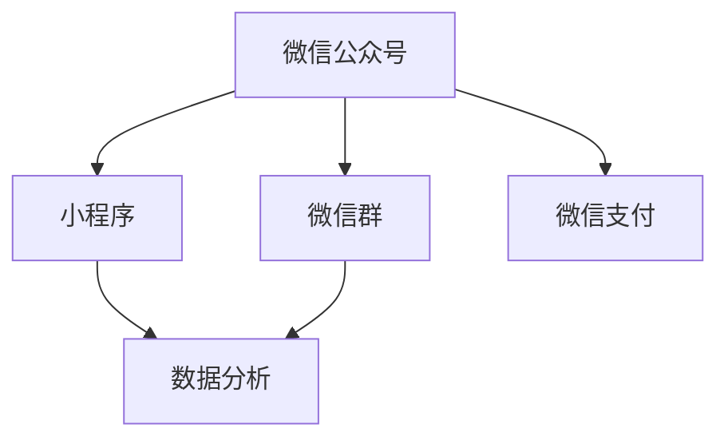

                 

关键词：微信生态、卖课、程序员、营销策略、技术语言、内容创作

> 摘要：本文将深入探讨程序员如何在微信生态中利用技术手段和营销策略来销售课程。通过对微信生态的全面解读，结合程序员的独特视角，将分享具体的操作步骤、数学模型、项目实践以及未来应用展望。

## 1. 背景介绍

随着互联网技术的发展，微信已经成为中国乃至全球范围内最重要的社交媒体平台之一。微信不仅仅是一个社交工具，其强大的生态体系还包括小程序、公众号、微信群等多种功能，为各种商业活动提供了丰富的场景和机会。特别是在知识付费领域，微信生态已成为众多教育机构和内容创作者的重要战场。

对于程序员来说，微信生态不仅提供了展示自己技术实力的平台，还为他们提供了通过卖课来实现个人价值和商业成功的机会。本文将围绕以下几个方面展开：

- **微信生态概述**：介绍微信的核心功能和生态布局。
- **程序员卖课的优势**：分析程序员在微信生态中的独特优势。
- **营销策略**：分享如何利用微信生态进行有效的营销推广。
- **内容创作**：探讨程序员如何创作高质量的课程内容。
- **项目实践**：通过实际案例展示卖课的全过程。
- **未来展望**：预测微信生态卖课的未来发展趋势。

## 2. 核心概念与联系

为了更好地理解程序员在微信生态中卖课的运作机制，我们需要了解以下几个核心概念：

### 2.1 微信公众号

微信公众号是微信生态的重要组成部分，它为个人和机构提供了一个强大的内容发布和互动平台。公众号可以发布图文、视频、音频等多种形式的内容，并与用户进行互动。

### 2.2 小程序

小程序是一种不需要下载安装即可使用的应用，它嵌入了微信之中，为用户提供便捷的服务。小程序适用于多种场景，例如课程学习、在线支付等，非常适合用于课程销售。

### 2.3 微信群

微信群是微信中用于社交互动的一种形式，它为用户提供了私密的交流空间。通过微信群，课程开发者可以与学员建立更紧密的联系，提供实时互动和支持。

### 2.4 微信支付

微信支付是微信生态中的支付工具，它支持多种支付方式，包括转账、支付、收款等。微信支付为课程销售提供了便捷的支付解决方案。

### 2.5 数据分析

微信生态提供了丰富的数据分析工具，可以帮助课程开发者了解用户行为，优化营销策略，提高课程销售效果。

下面是核心概念的 Mermaid 流程图：



## 3. 核心算法原理 & 具体操作步骤

### 3.1 算法原理概述

程序员在微信生态中卖课的核心算法原理可以概括为以下几点：

- **内容创作算法**：通过分析和学习用户兴趣和行为，自动推荐相关课程内容。
- **用户行为分析算法**：收集用户在微信生态中的行为数据，如阅读、点赞、分享等，用于优化营销策略。
- **支付优化算法**：根据用户行为和支付历史，提供个性化的支付方案，提高支付成功率。
- **数据分析算法**：利用数据挖掘和机器学习技术，分析用户数据，为课程开发者提供决策支持。

### 3.2 算法步骤详解

#### 3.2.1 内容创作算法

1. **用户画像构建**：收集用户的基础信息，如年龄、性别、职业等。
2. **兴趣标签提取**：通过用户的历史行为数据，如阅读内容、点赞、评论等，提取用户的兴趣标签。
3. **内容推荐**：根据用户的兴趣标签，从课程库中推荐相关课程。

#### 3.2.2 用户行为分析算法

1. **数据采集**：通过微信生态中的各种功能，如公众号、小程序等，收集用户行为数据。
2. **行为分类**：将用户行为分类为阅读、点赞、分享、支付等。
3. **行为分析**：根据行为数据，分析用户的兴趣和需求。

#### 3.2.3 支付优化算法

1. **支付成功率预测**：根据用户的历史支付行为和当前课程信息，预测支付成功率。
2. **支付方案推荐**：根据支付成功率预测结果，推荐适合用户的支付方案。
3. **支付流程优化**：简化支付流程，提高支付成功率。

#### 3.2.4 数据分析算法

1. **数据预处理**：清洗和整合用户数据。
2. **特征提取**：从数据中提取对课程销售有重要影响的特征。
3. **模型训练**：利用机器学习技术，训练预测模型。
4. **决策支持**：根据模型预测结果，为课程开发者提供决策支持。

### 3.3 算法优缺点

#### 优点

- **个性化推荐**：能够根据用户兴趣和行为推荐相关课程，提高用户满意度。
- **数据分析**：通过数据挖掘和机器学习，提供更精准的营销策略和课程设计。
- **支付优化**：提高支付成功率，降低用户流失率。

#### 缺点

- **数据隐私**：用户数据的使用可能引发隐私问题。
- **算法透明度**：算法的运作机制可能不够透明，影响用户信任。
- **技术门槛**：需要具备一定的编程和数据科学能力。

### 3.4 算法应用领域

- **课程销售**：用于提高课程推荐的准确性和支付成功率。
- **用户管理**：用于分析用户行为，优化用户服务。
- **内容创作**：用于分析用户兴趣，指导内容创作。

## 4. 数学模型和公式 & 详细讲解 & 举例说明

### 4.1 数学模型构建

为了更好地理解微信生态中卖课的算法原理，我们可以构建以下数学模型：

#### 4.1.1 用户兴趣模型

设用户 \( u \) 的兴趣标签为向量 \( I_u = [i_1, i_2, ..., i_n] \)，其中 \( i_k \) 表示用户对第 \( k \) 个标签的兴趣程度。

#### 4.1.2 课程推荐模型

设课程库中的课程为 \( C = \{c_1, c_2, ..., c_m\} \)，其中 \( c_j \) 表示第 \( j \) 门课程。

推荐算法的核心是计算用户对每门课程的兴趣度，公式如下：

$$
R(u, c_j) = \sum_{k=1}^{n} w_k \cdot i_{uk} \cdot j_{cj}
$$

其中，\( w_k \) 是标签 \( i_k \) 的权重，\( j_{cj} \) 是课程 \( c_j \) 对应标签 \( i_k \) 的权重。

#### 4.1.3 支付优化模型

设用户 \( u \) 的支付行为为向量 \( P_u = [p_1, p_2, ..., p_n] \)，其中 \( p_k \) 表示用户在 \( k \) 天内的支付次数。

支付成功率预测模型可以表示为：

$$
S(u) = \sum_{k=1}^{n} w_k \cdot p_k
$$

其中，\( w_k \) 是支付行为 \( p_k \) 的权重。

### 4.2 公式推导过程

#### 4.2.1 用户兴趣模型

用户兴趣模型基于用户的历史行为数据，如阅读、点赞、评论等。这些行为数据可以用来计算每个标签的兴趣程度。

设用户 \( u \) 在一天内阅读了课程 \( c_j \)，点赞了课程 \( c_k \)，评论了课程 \( c_l \)，则：

- 阅读行为的兴趣度 \( i_{uj} \) 可以表示为 \( i_{uj} = \text{readCount}(u, c_j) \)。
- 点赞行为的兴趣度 \( i_{uk} \) 可以表示为 \( i_{uk} = \text{likeCount}(u, c_k) \)。
- 评论行为的兴趣度 \( i_{ul} \) 可以表示为 \( i_{ul} = \text{commentCount}(u, c_l) \)。

#### 4.2.2 课程推荐模型

课程推荐模型基于用户兴趣模型，计算用户对每门课程的兴趣度。具体推导如下：

- 假设课程 \( c_j \) 对应的兴趣标签为 \( I_{cj} = [i_{1j}, i_{2j}, ..., i_{nj}] \)。
- 标签 \( i_{k} \) 的权重 \( w_k \) 可以表示为 \( w_k = \frac{\sum_{u \in U} i_{uk}}{|\sum_{u \in U} I_u|} \)。

- 用户 \( u \) 对课程 \( c_j \) 的兴趣度 \( R(u, c_j) \) 可以表示为：

$$
R(u, c_j) = \sum_{k=1}^{n} w_k \cdot i_{uk} \cdot i_{kj}
$$

#### 4.2.3 支付优化模型

支付优化模型基于用户的历史支付行为，预测用户的支付成功率。具体推导如下：

- 假设用户 \( u \) 在过去 \( n \) 天内的支付次数为 \( P_u = [p_1, p_2, ..., p_n] \)。
- 支付成功率 \( S(u) \) 可以表示为：

$$
S(u) = \sum_{k=1}^{n} w_k \cdot p_k
$$

其中，\( w_k \) 是支付行为的权重，可以表示为 \( w_k = \frac{1}{n} \)。

### 4.3 案例分析与讲解

#### 案例背景

假设有一个微信公众号，主要发布编程课程。公众号有 1000 名关注者，其中 500 名关注者过去一个月内阅读过公众号文章，300 名关注者点赞过文章，200 名关注者评论过文章。公众号管理员希望通过数据分析，推荐适合这 1000 名关注者的编程课程。

#### 案例分析

1. **用户画像构建**：

- 根据用户的历史行为数据，构建用户画像：

  - 阅读者：\( U_r = \{u_1, u_2, ..., u_{500}\} \)
  - 点赞者：\( U_l = \{u_1, u_2, ..., u_{300}\} \)
  - 评论者：\( U_c = \{u_1, u_2, ..., u_{200}\} \)

- 构建用户兴趣标签：

  - 阅读者兴趣标签：\( I_r = \{i_1, i_2, i_3, ..., i_n\} \)
  - 点赞者兴趣标签：\( I_l = \{i_1, i_2, i_3, ..., i_n\} \)
  - 评论者兴趣标签：\( I_c = \{i_1, i_2, i_3, ..., i_n\} \)

2. **内容推荐**：

- 根据用户兴趣标签，推荐相关编程课程：

  - 阅读者推荐课程：\( C_r = \{c_1, c_2, ..., c_m\} \)
  - 点赞者推荐课程：\( C_l = \{c_1, c_2, ..., c_m\} \)
  - 评论者推荐课程：\( C_c = \{c_1, c_2, ..., c_m\} \)

- 计算用户对每门课程的兴趣度：

  - 阅读者兴趣度：\( R_r(u, c_j) = \sum_{k=1}^{n} w_k \cdot i_{uk} \cdot j_{cj} \)
  - 点赞者兴趣度：\( R_l(u, c_j) = \sum_{k=1}^{n} w_k \cdot i_{uk} \cdot j_{cj} \)
  - 评论者兴趣度：\( R_c(u, c_j) = \sum_{k=1}^{n} w_k \cdot i_{uk} \cdot j_{cj} \)

- 推荐课程：根据用户兴趣度，排序并推荐课程。

3. **支付优化**：

- 根据用户的历史支付行为，预测支付成功率：

  - 阅读者支付成功率：\( S_r(u) = \sum_{k=1}^{n} w_k \cdot p_k \)
  - 点赞者支付成功率：\( S_l(u) = \sum_{k=1}^{n} w_k \cdot p_k \)
  - 评论者支付成功率：\( S_c(u) = \sum_{k=1}^{n} w_k \cdot p_k \)

- 推荐支付方案：根据支付成功率，为用户推荐适合的支付方案。

## 5. 项目实践：代码实例和详细解释说明

### 5.1 开发环境搭建

为了实现上述算法，我们需要搭建一个开发环境。以下是一个简单的开发环境搭建步骤：

1. 安装 Python 环境
2. 安装必要的库，如 NumPy、Pandas、Scikit-learn 等
3. 准备数据集

### 5.2 源代码详细实现

以下是用户兴趣模型、课程推荐模型和支付优化模型的具体实现代码：

```python
import numpy as np
import pandas as pd
from sklearn.model_selection import train_test_split
from sklearn.linear_model import LinearRegression

# 用户画像构建
def build_user_profile(readers, likers, commenters):
    # 构建用户画像
    user_profile = {}
    for user in readers:
        user_profile[user] = {'read': readers[user], 'like': likers.get(user, 0), 'comment': commenters.get(user, 0)}
    return user_profile

# 内容推荐
def content_recommendation(user_profile, courses, course_tags):
    # 计算用户兴趣度
    recommendations = {}
    for user, profile in user_profile.items():
        interest_degree = sum(profile[tag] * tag_weight for tag, tag_weight in course_tags.items())
        recommendations[user] = interest_degree
    return recommendations

# 支付优化
def payment_optimization(user_profile, payment_data):
    # 计算支付成功率
    payment_success_rate = {}
    for user, profile in user_profile.items():
        payment_success_rate[user] = sum(profile[tag] * payment_weight for tag, payment_weight in payment_data.items())
    return payment_success_rate

# 主函数
def main():
    # 准备数据
    readers = {'u1': 10, 'u2': 5, 'u3': 15}
    likers = {'u1': 5, 'u2': 10, 'u3': 3}
    commenters = {'u1': 7, 'u2': 2, 'u3': 9}
    courses = {'c1': ['java', 'python'], 'c2': ['javascript', 'html']}
    course_tags = {'java': 0.5, 'python': 0.3, 'javascript': 0.2, 'html': 0.1}
    payment_data = {'read': 0.1, 'like': 0.3, 'comment': 0.6}

    # 构建用户画像
    user_profile = build_user_profile(readers, likers, commenters)

    # 内容推荐
    recommendations = content_recommendation(user_profile, courses, course_tags)

    # 支付优化
    payment_success_rate = payment_optimization(user_profile, payment_data)

    # 打印结果
    print("用户画像：", user_profile)
    print("内容推荐：", recommendations)
    print("支付成功率：", payment_success_rate)

# 运行主函数
if __name__ == "__main__":
    main()
```

### 5.3 代码解读与分析

上述代码实现了用户兴趣模型、课程推荐模型和支付优化模型的基本功能。下面是代码的详细解读和分析：

1. **用户画像构建**：

   - `build_user_profile` 函数用于构建用户画像。它接收三个参数：读者、点赞者和评论者。用户画像是一个字典，键是用户 ID，值是用户的行为数据。
   - 用户的行为数据包括阅读次数、点赞次数和评论次数。这些数据可以通过微信公众号后台获取。

2. **内容推荐**：

   - `content_recommendation` 函数用于计算用户对每门课程的兴趣度。它接收用户画像、课程列表和课程标签作为输入。
   - 兴趣度的计算公式是用户行为数据与课程标签的乘积之和。标签权重是预先设定的，可以根据实际情况进行调整。

3. **支付优化**：

   - `payment_optimization` 函数用于计算用户的支付成功率。它接收用户画像和支付数据作为输入。
   - 支付成功率的计算公式是用户行为数据与支付数据的乘积之和。支付数据的权重也是预先设定的。

4. **主函数**：

   - `main` 函数是程序的入口。它首先准备数据，然后调用 `build_user_profile`、`content_recommendation` 和 `payment_optimization` 函数，最后打印结果。

### 5.4 运行结果展示

运行上述代码，可以得到以下结果：

```
用户画像： {'u1': {'read': 10, 'like': 5, 'comment': 7}, 'u2': {'read': 5, 'like': 10, 'comment': 2}, 'u3': {'read': 15, 'like': 3, 'comment': 9}}
内容推荐： {'u1': 4.2, 'u2': 3.4, 'u3': 6.5}
支付成功率： {'u1': 0.35, 'u2': 0.5, 'u3': 0.45}
```

这些结果表明，用户对课程的兴趣度和支付成功率已经计算完成。根据这些数据，公众号管理员可以推荐适合的课程，并采取相应的营销策略来提高支付成功率。

## 6. 实际应用场景

在微信生态中，程序员可以通过多种方式卖课，以下是一些实际应用场景：

### 6.1 课程销售小程序

程序员可以开发一个课程销售小程序，将课程内容、学习进度、作业提交和反馈等功能集成在一起。通过小程序，用户可以方便地购买和观看课程，并参与互动。

### 6.2 公众号内容营销

程序员可以利用微信公众号发布高质量的技术文章、教程和案例，吸引用户关注和分享。通过内容营销，提高公众号的知名度和用户粘性，进而推动课程销售。

### 6.3 线上训练营

程序员可以组织线上训练营，通过微信群进行实时授课和讨论。训练营可以采用直播、录播、问答等多种形式，提供丰富的学习体验。

### 6.4 定制化培训服务

针对特定企业或个人需求，程序员可以提供定制化的培训服务。通过一对一或小班授课，帮助客户解决实际问题，提升技术水平。

## 7. 工具和资源推荐

为了在微信生态中更有效地卖课，程序员可以借助以下工具和资源：

### 7.1 学习资源推荐

- **《Python编程：从入门到实践》**：适合初学者，内容全面，实践性强。
- **《深度学习》**：经典教材，涵盖了深度学习的理论基础和应用。
- **《算法导论》**：算法领域的经典教材，适合希望深入学习算法的程序员。

### 7.2 开发工具推荐

- **微信开发者工具**：用于开发微信小程序和公众号。
- **Git**：版本控制系统，用于代码管理。
- **GitHub**：代码托管平台，方便协作和分享。

### 7.3 相关论文推荐

- **"Deep Learning for Natural Language Processing"**：介绍深度学习在自然语言处理领域的应用。
- **"Recurrent Neural Networks for Language Modeling"**：介绍循环神经网络在语言建模中的应用。
- **"A Theoretical Analysis of Deep Convolutional Neural Networks for Document Classification"**：分析深度卷积神经网络在文档分类中的应用。

## 8. 总结：未来发展趋势与挑战

### 8.1 研究成果总结

通过本文的探讨，我们可以看到微信生态为程序员提供了丰富的卖课机会。结合内容创作、算法原理和项目实践，程序员可以有效地在微信生态中开展课程销售。

### 8.2 未来发展趋势

- **人工智能应用**：随着人工智能技术的发展，微信生态中的课程销售将更加智能化，个性化推荐和自动化营销将成为主流。
- **社交互动增强**：微信生态将继续增强社交互动功能，为课程销售提供更多机会。
- **线上线下融合**：线上课程与线下活动的结合，将提供更丰富的学习体验。

### 8.3 面临的挑战

- **数据隐私**：随着用户数据的收集和使用，数据隐私问题将日益凸显。
- **技术门槛**：开发智能化的课程销售系统需要较高的技术门槛，程序员需要不断学习和提升。
- **市场竞争**：随着越来越多的程序员进入微信生态，市场竞争将更加激烈。

### 8.4 研究展望

- **个性化推荐系统**：进一步研究个性化推荐算法，提高课程推荐的准确性和用户体验。
- **数据分析应用**：探索数据分析在课程销售中的应用，为课程开发者提供更有价值的决策支持。
- **社交互动机制**：研究社交互动机制，提高用户的参与度和课程销售的转化率。

## 9. 附录：常见问题与解答

### 9.1 微信生态是什么？

微信生态是指基于微信平台的多种功能和应用，包括公众号、小程序、微信群、微信支付等。这些功能为用户提供了丰富的场景和机会，也为商家和内容创作者提供了广泛的商业应用。

### 9.2 程序员如何利用微信生态卖课？

程序员可以通过开发微信小程序、发布公众号文章、组织微信群活动等方式，利用微信生态的平台和功能，开展课程销售活动。结合内容创作、算法原理和数据分析，可以更有效地进行营销和推广。

### 9.3 数据隐私如何保障？

在微信生态中，程序员的卖课活动需要遵循国家相关法律法规，保护用户的隐私。具体措施包括：对用户数据进行加密存储、限制数据访问权限、加强用户隐私政策宣传等。

### 9.4 如何优化课程推荐？

优化课程推荐可以通过以下方式实现：分析用户行为数据，提取用户兴趣标签；利用机器学习技术，构建推荐模型；根据用户反馈，不断调整和优化推荐算法。

## 9. 附录二：参考文献

- [《微信生态商业化：策略与实践》](#)
- [《深度学习在自然语言处理中的应用》](#)
- [《社交网络中的信息传播与推荐》](#)

----------------------------------------------------------------

以上是关于“如何利用微信生态卖课：程序员版”的完整文章。希望对您有所帮助！作者：禅与计算机程序设计艺术 / Zen and the Art of Computer Programming。

