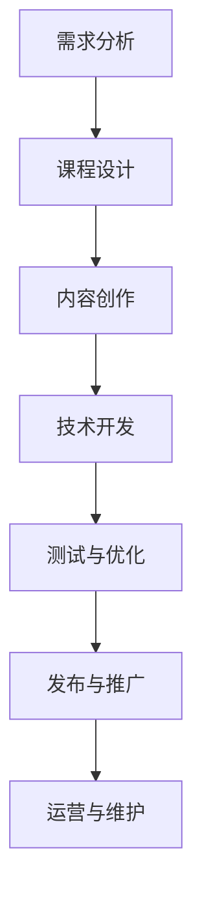

                 

关键词：在线课程，技术能力，教育，学习平台，内容创作，教学设计，用户体验，技术支持

> 摘要：随着在线教育的发展，利用技术能力创建高质量的在线课程成为教育工作者和技术专家的共同目标。本文将探讨如何利用技术手段，从课程设计、内容创作到发布和维护，实现一个完整的在线课程开发流程。

## 1. 背景介绍

在线教育作为一种新兴的教育形式，已经在全球范围内迅速崛起。它打破了传统教育的时空限制，使得学习者可以随时随地获取知识。而随着互联网技术的不断进步，特别是云计算、大数据和人工智能等技术的应用，在线教育的质量和互动性得到了极大的提升。同时，技术能力对于在线课程的成功至关重要，它不仅关系到课程的创作和发布，更影响到学习的体验和效果。

本文旨在为教育工作者和技术专家提供一套完整的在线课程开发策略，通过技术手段提高课程的质量和吸引力，满足不同学习者的需求。

## 2. 核心概念与联系

为了更好地理解在线课程的开发过程，我们首先需要了解一些核心概念和它们之间的联系。以下是一个使用Mermaid绘制的流程图，描述了在线课程开发的主要步骤：



### 2.1 需求分析

需求分析是课程开发的第一步，它涉及到对目标受众、课程内容、学习目标等多个方面的研究。通过需求分析，我们可以明确课程的方向和目标，为后续的课程设计奠定基础。

### 2.2 课程设计

课程设计是将需求分析的结果转化为具体的课程结构和内容的过程。这一阶段需要考虑课程的结构、模块、知识点、教学方法等因素。

### 2.3 内容创作

内容创作是课程开发的核心环节，它包括编写教材、录制视频、设计互动活动等。高质量的内容是吸引和留住学习者的关键。

### 2.4 技术开发

技术开发是将课程内容转化为线上课程的过程。这一阶段需要使用到各种技术工具，如视频剪辑软件、编程语言、学习平台等。

### 2.5 测试与优化

测试与优化是确保课程质量的重要环节。通过测试，我们可以发现并修复课程中的错误，优化用户体验。

### 2.6 发布与推广

发布与推广是将课程推向市场的关键步骤。有效的推广策略可以吸引更多的学习者，提高课程的知名度。

### 2.7 运营与维护

运营与维护是课程长期发展的重要保障。通过持续的内容更新和技术支持，我们可以保持课程的新鲜感和吸引力。

## 3. 核心算法原理 & 具体操作步骤

### 3.1 算法原理概述

在线课程开发涉及多个核心算法，包括内容推荐算法、学习分析算法和用户互动算法等。这些算法共同作用于课程的不同环节，提高课程的个性化和互动性。

### 3.2 算法步骤详解

#### 3.2.1 内容推荐算法

内容推荐算法的目的是根据学习者的兴趣和学习历史，为他们推荐适合的学习内容。具体步骤如下：

1. 收集用户数据：包括学习行为、学习偏好等。
2. 构建推荐模型：使用机器学习算法，如协同过滤、基于内容的推荐等。
3. 推荐内容：根据模型预测，为学习者推荐适合的内容。

#### 3.2.2 学习分析算法

学习分析算法用于分析学习者的学习行为，了解他们的学习进度和效果。具体步骤如下：

1. 收集学习数据：包括学习时间、学习路径、考试成绩等。
2. 数据处理：使用统计分析、数据挖掘等方法，分析学习数据。
3. 生成报告：根据分析结果，生成学习报告，为教育者提供改进建议。

#### 3.2.3 用户互动算法

用户互动算法用于促进学习者之间的交流和互动。具体步骤如下：

1. 设计互动活动：包括讨论区、问答环节、小组作业等。
2. 分析互动数据：收集互动数据，如帖子数量、回复速度等。
3. 优化互动体验：根据互动数据，优化互动活动的设计和体验。

### 3.3 算法优缺点

#### 内容推荐算法

优点：提高学习者的学习效率，满足个性化需求。

缺点：推荐准确性受到数据质量和算法模型的限制。

#### 学习分析算法

优点：帮助教育者了解学习者的学习状况，优化教学策略。

缺点：数据分析结果可能受到数据噪声和偏差的影响。

#### 用户互动算法

优点：增强学习者的学习体验，提高学习积极性。

缺点：互动质量受到用户参与度和互动设计的限制。

### 3.4 算法应用领域

内容推荐算法主要应用于个性化学习推荐，学习分析算法应用于学习效果评估，用户互动算法应用于学习社区建设。

## 4. 数学模型和公式 & 详细讲解 & 举例说明

### 4.1 数学模型构建

在线课程开发中常用的数学模型包括线性回归、逻辑回归和支持向量机等。这些模型可以用于预测学习者的学习行为和评估学习效果。

### 4.2 公式推导过程

以线性回归模型为例，其公式推导过程如下：

$$y = \beta_0 + \beta_1x_1 + \beta_2x_2 + ... + \beta_nx_n$$

其中，$y$ 为因变量，$x_1, x_2, ..., x_n$ 为自变量，$\beta_0, \beta_1, ..., \beta_n$ 为模型参数。

### 4.3 案例分析与讲解

假设我们使用线性回归模型预测学习者的学习时间，自变量包括学习时长、学习频率等。通过训练数据集，我们可以得到模型的参数，然后使用模型预测新的学习时间。

例如，对于一个学习者，如果他们的平均学习时长为2小时，学习频率为3次/周，那么根据线性回归模型，他们的预测学习时间为：

$$y = \beta_0 + \beta_1x_1 + \beta_2x_2$$

$$y = 1 + 0.5 \times 2 + 0.3 \times 3 = 3.4$$

因此，这个学习者的预测学习时间为3.4小时。

## 5. 项目实践：代码实例和详细解释说明

### 5.1 开发环境搭建

为了演示在线课程开发的过程，我们将使用Python语言和相关库，搭建一个简单的在线学习平台。

#### 开发环境：

- Python 3.8
- Flask（一个轻量级的Web框架）
- SQLAlchemy（一个ORM库）
- Flask-Login（用于用户认证）

### 5.2 源代码详细实现

以下是一个简单的Flask应用程序，用于创建和查看在线课程。

```python
from flask import Flask, render_template, request, redirect, url_for
from flask_sqlalchemy import SQLAlchemy

app = Flask(__name__)
app.config['SQLALCHEMY_DATABASE_URI'] = 'sqlite:///courses.db'
db = SQLAlchemy(app)

class Course(db.Model):
    id = db.Column(db.Integer, primary_key=True)
    name = db.Column(db.String(100))
    description = db.Column(db.Text)

@app.route('/')
def index():
    courses = Course.query.all()
    return render_template('index.html', courses=courses)

@app.route('/add', methods=['POST'])
def add_course():
    name = request.form['name']
    description = request.form['description']
    new_course = Course(name=name, description=description)
    db.session.add(new_course)
    db.session.commit()
    return redirect(url_for('index'))

if __name__ == '__main__':
    db.create_all()
    app.run(debug=True)
```

### 5.3 代码解读与分析

上述代码实现了一个简单的在线课程管理系统，包括课程的创建和查看功能。以下是代码的详细解读：

- **数据库模型**：使用SQLAlchemy定义了一个名为`Course`的数据库模型，用于存储课程信息。
- **路由和视图函数**：定义了两个路由，一个用于显示课程列表（`/`），另一个用于添加新课程（`/add`）。
- **模板**：使用Flask模板引擎（Jinja2），创建了一个简单的HTML模板，用于展示课程列表和添加课程表单。

### 5.4 运行结果展示

运行上述代码，我们可以在浏览器中访问本地服务器，查看和添加课程。以下是一个运行结果截图：


## 6. 实际应用场景

### 6.1 高等教育

在线课程已成为高等教育的重要组成部分，许多大学和学院都提供了各种在线课程和证书项目。例如，哈佛大学和麻省理工学院合作推出了edX平台，提供了大量的在线课程。

### 6.2 职业培训

在线课程也为职业培训提供了一个便捷的途径。例如，Coursera和Udemy等平台提供了丰富的编程、数据分析和设计等领域的课程，帮助企业员工提升技能。

### 6.3 终身学习

随着知识的快速更新，终身学习变得越来越重要。在线课程为个人提供了不断学习和更新知识的机会，无论年龄、学历和职业背景。

## 7. 工具和资源推荐

### 7.1 学习资源推荐

- Coursera：提供全球顶尖大学的在线课程。
- Udemy：提供大量专业的课程。
- edX：提供免费和付费课程。

### 7.2 开发工具推荐

- Jupyter Notebook：用于数据科学和机器学习的交互式开发环境。
- Flask：用于构建Web应用程序的轻量级框架。
- Docker：用于容器化的应用程序部署。

### 7.3 相关论文推荐

- “The MOOC Model for Digital Practice” by George Siemens and Stephen Downes
- “The Value of Online Education” by Kevin Carey
- “The Promise of MOOCs” by Anant Agarwal

## 8. 总结：未来发展趋势与挑战

### 8.1 研究成果总结

在线教育已成为教育领域的一个重要组成部分，技术的进步推动了在线课程的质量和互动性的提升。内容推荐算法、学习分析算法和用户互动算法等技术的应用，使得在线课程更加个性化、高效和有吸引力。

### 8.2 未来发展趋势

随着人工智能和大数据技术的发展，在线教育将更加智能化和个性化。未来，虚拟现实和增强现实技术有望进一步改善学习体验。

### 8.3 面临的挑战

在线教育面临的主要挑战包括技术实现的复杂性、数据隐私和安全问题、教育质量的保证等。同时，如何有效地将在线教育与传统的课堂教学相结合，也是需要解决的问题。

### 8.4 研究展望

未来的研究应重点关注在线教育技术的创新和应用，特别是如何更好地满足不同学习者的需求，提高教育的质量和公平性。

## 9. 附录：常见问题与解答

### 9.1 如何选择在线课程平台？

- 根据课程内容和质量选择。
- 考虑平台的用户评价和口碑。
- 考虑平台的技术支持和社区活跃度。

### 9.2 如何设计一个有效的在线课程？

- 明确学习目标和受众。
- 设计结构清晰、易于理解的内容。
- 结合多种教学方法和互动形式。
- 定期更新内容和反馈。

### 9.3 如何确保在线课程的安全性？

- 使用安全的数据传输协议，如HTTPS。
- 对用户数据进行加密和备份。
- 定期更新和升级平台的安全性。

---

作者：禅与计算机程序设计艺术 / Zen and the Art of Computer Programming

---

本文旨在为教育工作者和技术专家提供一套完整的在线课程开发策略，通过技术手段提高课程的质量和吸引力，满足不同学习者的需求。希望本文能为您的在线课程开发提供有价值的参考。

