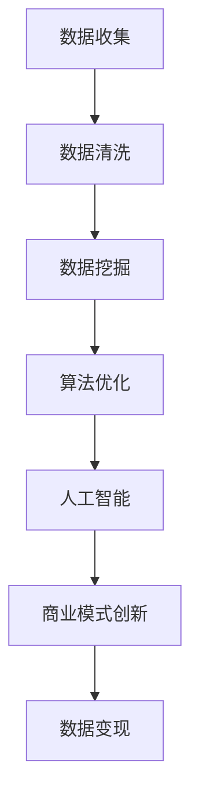

                 

关键词：数据变现、技术能力、数据挖掘、算法优化、人工智能、商业模式创新

> 摘要：本文将探讨如何利用技术能力实现数据变现，从数据挖掘、算法优化和人工智能等方面，阐述数据变现的方法与策略。文章还将探讨商业模式创新，以及如何通过技术手段实现数据价值的最大化。

## 1. 背景介绍

在当今数字化时代，数据已经成为一种新型资产，各行各业都在努力挖掘和利用数据价值。然而，如何有效地将数据转化为实际的商业价值，即实现数据变现，成为许多企业和创业者关注的焦点。数据变现不仅有助于企业提升竞争力，还能推动技术创新和商业模式变革。

数据变现的挑战主要体现在以下几个方面：

1. **数据质量**：数据质量是数据变现的基础，低质量的数据会导致分析结果的偏差，影响决策。
2. **数据隐私**：在数据变现过程中，保护用户隐私和数据安全是至关重要的，必须遵守相关法律法规。
3. **技术能力**：实现数据变现需要强大的技术支持，包括数据挖掘、算法优化、人工智能等。

## 2. 核心概念与联系

为了更好地理解数据变现，我们需要掌握以下几个核心概念：

- **数据挖掘**：从大量数据中提取有价值的信息和知识的过程。
- **算法优化**：通过改进算法，提高数据处理效率和准确性。
- **人工智能**：模拟人类智能的计算机系统，能够进行学习、推理和决策。

下面是数据变现的核心概念与联系的Mermaid流程图：



## 3. 核心算法原理 & 具体操作步骤

### 3.1 算法原理概述

数据变现的核心在于如何从大量数据中提取有价值的信息，并利用这些信息创造商业价值。具体来说，我们可以通过以下步骤实现数据变现：

1. 数据收集：通过各种渠道获取数据，如用户行为数据、市场数据、财务数据等。
2. 数据清洗：处理和整理数据，去除重复、错误和无用的数据。
3. 数据挖掘：利用算法从清洗后的数据中提取有价值的信息。
4. 算法优化：通过改进算法，提高数据处理效率和准确性。
5. 人工智能：利用机器学习和深度学习技术，实现数据的自动化分析和预测。
6. 商业模式创新：将数据变现技术与商业模式相结合，创造新的商业机会。

### 3.2 算法步骤详解

1. **数据收集**：
   - **数据来源**：用户行为数据、社交媒体数据、市场调研数据等。
   - **数据类型**：结构化数据、半结构化数据和非结构化数据。

2. **数据清洗**：
   - **去重**：去除重复数据，避免重复分析。
   - **缺失值处理**：填补缺失值，保证数据分析的准确性。
   - **异常值处理**：识别和剔除异常值，防止异常数据影响分析结果。

3. **数据挖掘**：
   - **关联规则挖掘**：发现数据之间的关联关系，如商品之间的搭配销售。
   - **分类与聚类**：对数据进行分类和聚类，如用户分群、产品推荐等。

4. **算法优化**：
   - **算法选择**：根据业务需求选择合适的算法，如线性回归、决策树、神经网络等。
   - **参数调优**：调整算法参数，提高模型的性能和准确性。

5. **人工智能**：
   - **机器学习**：利用历史数据训练模型，实现数据的自动分析和预测。
   - **深度学习**：利用神经网络，实现复杂模式的识别和预测。

6. **商业模式创新**：
   - **产品创新**：将数据变现技术应用于产品创新，如个性化推荐、智能客服等。
   - **服务创新**：利用数据变现技术提供增值服务，如数据报告、咨询服务等。
   - **商业模式设计**：将数据变现技术与商业模式相结合，创造新的商业机会。

### 3.3 算法优缺点

1. **数据挖掘**：
   - **优点**：能够从大量数据中提取有价值的信息，为决策提供支持。
   - **缺点**：处理过程复杂，对数据质量要求高。

2. **算法优化**：
   - **优点**：提高数据处理效率和准确性，降低成本。
   - **缺点**：算法优化过程耗时，需要专业知识。

3. **人工智能**：
   - **优点**：能够实现数据的自动化分析和预测，提高效率。
   - **缺点**：对计算资源要求高，算法可靠性有待提高。

### 3.4 算法应用领域

1. **市场营销**：通过用户行为数据，实现精准营销和个性化推荐。
2. **金融风控**：利用数据挖掘和人工智能技术，实现风险预警和欺诈检测。
3. **智慧城市**：通过数据变现，实现城市管理和服务的智能化。
4. **医疗健康**：利用数据分析和人工智能，实现疾病的预测和诊断。

## 4. 数学模型和公式 & 详细讲解 & 举例说明

### 4.1 数学模型构建

数据变现过程中，常用的数学模型包括线性回归、决策树、神经网络等。以下是一个简单的线性回归模型示例：

$$y = ax + b$$

其中，$y$ 是因变量，$x$ 是自变量，$a$ 和 $b$ 是模型参数。

### 4.2 公式推导过程

线性回归模型的推导过程如下：

1. **最小二乘法**：选择最佳拟合直线，使得实际值与拟合值之间的误差平方和最小。
2. **梯度下降法**：通过迭代计算，不断调整模型参数，使得模型参数逐步逼近最优解。

### 4.3 案例分析与讲解

假设我们有一个简单的销售数据集，包括商品ID、销售额和用户ID。我们的目标是预测下一个用户的购买金额。

1. **数据收集**：从电商平台获取用户行为数据。
2. **数据清洗**：去除重复数据、缺失值处理和异常值处理。
3. **数据挖掘**：利用线性回归模型，分析商品ID和销售额之间的关系。
4. **算法优化**：调整模型参数，提高预测准确性。
5. **人工智能**：利用机器学习算法，实现数据的自动分析和预测。

通过以上步骤，我们可以构建一个简单的数据变现模型，实现销售预测和用户分群等功能。

## 5. 项目实践：代码实例和详细解释说明

### 5.1 开发环境搭建

1. **Python**：安装Python环境，版本建议为3.8及以上。
2. **NumPy**：用于数学计算和数据处理。
3. **Pandas**：用于数据处理和分析。
4. **Scikit-learn**：用于机器学习和算法优化。

### 5.2 源代码详细实现

以下是一个简单的数据变现项目实例：

```python
import numpy as np
import pandas as pd
from sklearn.linear_model import LinearRegression
from sklearn.model_selection import train_test_split

# 数据收集
data = pd.read_csv('sales_data.csv')

# 数据清洗
data.drop_duplicates(inplace=True)
data.fillna(data.mean(), inplace=True)

# 数据挖掘
X = data[['商品ID']]
y = data['销售额']
X_train, X_test, y_train, y_test = train_test_split(X, y, test_size=0.2, random_state=42)

# 算法优化
model = LinearRegression()
model.fit(X_train, y_train)

# 人工智能
predictions = model.predict(X_test)
print(predictions)

# 评估模型
score = model.score(X_test, y_test)
print(score)
```

### 5.3 代码解读与分析

1. **数据收集**：从CSV文件中读取销售数据。
2. **数据清洗**：去除重复数据、填补缺失值和异常值处理。
3. **数据挖掘**：利用线性回归模型，分析商品ID和销售额之间的关系。
4. **算法优化**：使用Scikit-learn库中的LinearRegression类，实现模型训练和参数调优。
5. **人工智能**：利用机器学习算法，实现数据的自动分析和预测。
6. **评估模型**：计算模型在测试数据集上的准确性和分数。

通过以上步骤，我们可以实现一个简单的数据变现项目，为销售预测和用户分群提供支持。

## 6. 实际应用场景

### 6.1 市场营销

通过数据变现技术，企业可以实现对用户行为的精准分析，从而实现精准营销和个性化推荐。例如，电商平台可以利用用户浏览记录和购买历史，为用户推荐符合其兴趣的产品，提高销售额。

### 6.2 金融风控

在金融行业，数据变现技术可以用于风险预警和欺诈检测。通过对用户行为数据和历史交易数据的分析，银行和金融机构可以识别异常交易，防止欺诈行为的发生。

### 6.3 智慧城市

在智慧城市建设中，数据变现技术可以用于城市管理和服务优化。例如，通过分析交通流量数据，城市管理者可以优化交通信号灯设置，提高交通效率。

### 6.4 医疗健康

在医疗健康领域，数据变现技术可以用于疾病预测和诊断。通过对患者病史、生活习惯和基因数据的分析，医生可以预测疾病风险，为患者提供个性化的治疗方案。

## 7. 工具和资源推荐

### 7.1 学习资源推荐

1. **《数据科学入门教程》**：一本全面介绍数据科学基础知识的入门书籍。
2. **《机器学习实战》**：通过实际案例讲解机器学习算法的应用。
3. **《深度学习》**：深度学习领域的经典教材，全面介绍深度学习的基本原理和应用。

### 7.2 开发工具推荐

1. **Python**：数据变现领域的主流编程语言，具有丰富的库和框架。
2. **Jupyter Notebook**：用于数据分析和可视化，方便编写和运行代码。
3. **PyTorch**：用于深度学习模型的开发和训练，具有较好的灵活性和易用性。

### 7.3 相关论文推荐

1. **"Data Mining: Concepts and Techniques"**：介绍数据挖掘基本概念和技术。
2. **"Machine Learning: A Probabilistic Perspective"**：深入讲解机器学习算法和概率模型。
3. **"Deep Learning"**：全面介绍深度学习的基本原理和应用。

## 8. 总结：未来发展趋势与挑战

### 8.1 研究成果总结

数据变现技术在近年来取得了显著进展，主要包括以下几个方面：

1. **算法优化**：深度学习、强化学习等先进算法的引入，提高了数据处理的效率和准确性。
2. **人工智能**：人工智能技术的快速发展，为数据变现提供了强大的计算能力和智能化分析能力。
3. **商业模式创新**：数据变现技术不断创新，为各行各业带来了新的商业机会。

### 8.2 未来发展趋势

未来，数据变现技术将继续朝着以下几个方向发展：

1. **智能化**：随着人工智能技术的发展，数据变现将更加智能化，实现自动化分析和预测。
2. **多元化**：数据变现技术将应用于更多领域，如金融、医疗、智慧城市等，推动行业变革。
3. **安全与隐私**：数据隐私保护将成为数据变现的重要挑战，未来将出现更多隐私保护技术。

### 8.3 面临的挑战

数据变现技术面临以下挑战：

1. **数据质量**：高质量的数据是数据变现的基础，数据质量问题的解决是关键。
2. **计算资源**：深度学习等算法对计算资源要求较高，如何优化计算资源成为重要课题。
3. **法律法规**：数据隐私保护相关法律法规不断完善，企业需要遵守相关法规。

### 8.4 研究展望

未来，数据变现技术的研究将重点关注以下几个方面：

1. **算法创新**：探索新的算法和技术，提高数据处理效率和准确性。
2. **应用拓展**：将数据变现技术应用于更多领域，推动行业变革。
3. **隐私保护**：研究隐私保护技术，确保数据变现过程中的数据安全。

## 9. 附录：常见问题与解答

### 9.1 如何保证数据质量？

1. **数据清洗**：去除重复数据、缺失值处理和异常值处理。
2. **数据验证**：对数据进行一致性检查和准确性验证。
3. **数据监控**：建立数据监控机制，及时发现和处理数据质量问题。

### 9.2 如何处理数据隐私问题？

1. **数据脱敏**：对敏感数据采用加密、掩码等技术进行脱敏处理。
2. **隐私保护算法**：采用差分隐私、同态加密等技术，确保数据处理过程中的隐私保护。
3. **法律法规遵守**：遵守相关法律法规，确保数据变现过程中的合规性。

### 9.3 数据变现技术如何应用于实际业务？

1. **需求分析**：明确业务需求，确定数据变现的目标和方向。
2. **技术选型**：根据业务需求，选择合适的数据变现技术。
3. **实施与优化**：逐步实施数据变现项目，持续优化和调整。

<|assistant|>作者：禅与计算机程序设计艺术 / Zen and the Art of Computer Programming

本文旨在探讨如何利用技术能力实现数据变现，从数据挖掘、算法优化和人工智能等方面，阐述数据变现的方法与策略。同时，本文还探讨了商业模式创新，以及如何通过技术手段实现数据价值的最大化。随着数据变现技术的不断发展和完善，我们有理由相信，数据将成为未来企业的重要资产，为各行各业带来新的机遇和挑战。

