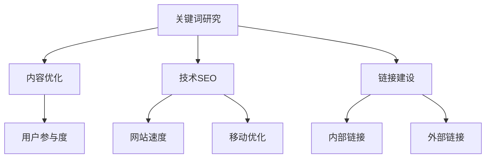

                 

关键词：搜索引擎优化（SEO）、有机流量、SEO策略、关键词研究、内容优化、技术SEO、链接建设、移动优化、用户体验、分析工具、未来趋势。

> 摘要：本文将深入探讨搜索引擎优化（SEO）的核心概念和实践方法，分析如何通过有效的SEO策略提升网站的有机流量。我们将详细讲解关键词研究、内容优化、技术SEO、链接建设等多个方面，并结合实际案例进行讲解，帮助您理解并应用SEO策略来提高网站排名和用户参与度。

## 1. 背景介绍

在当今的数字营销时代，搜索引擎优化（SEO）已经成为企业提升在线可见性和吸引有机流量的关键策略。SEO的目标是通过优化网站结构、内容和用户体验，使网站在搜索引擎结果页（SERPs）中获得更高的排名，从而吸引更多潜在客户访问。

SEO的重要性不仅体现在提高网站流量上，还能提升品牌知名度、增加销售机会和增强用户参与度。然而，SEO是一个复杂且不断发展的领域，需要持续的学习和实践。

本文将围绕以下核心内容展开：

- 核心概念与联系
- 核心算法原理与操作步骤
- 数学模型与公式
- 项目实践：代码实例
- 实际应用场景
- 未来应用展望

## 2. 核心概念与联系

### 2.1 关键词研究

关键词研究是SEO的基础，它帮助确定网站内容应围绕哪些词汇进行优化。关键词应具备以下特性：

- **搜索量高**：选择搜索量较高的关键词，以确保吸引大量潜在用户。
- **相关性**：关键词应与网站内容和目标受众密切相关。
- **竞争度适中**：竞争度过低可能导致流量稀少，过高则难以在短时间内获得较高排名。

### 2.2 内容优化

内容优化是指调整网站内容，使其更具吸引力和搜索引擎友好性。关键内容包括：

- **质量**：提供有价值、高质量的内容，满足用户需求。
- **原创性**：避免抄袭和重复内容，提高内容独特性。
- **结构**：优化文章结构，使用标题、段落和列表等元素，便于阅读和搜索引擎抓取。

### 2.3 技术SEO

技术SEO关注网站的技术层面，确保搜索引擎能够有效抓取和索引网站内容。关键要素包括：

- **网站速度**：优化网站加载速度，提高用户体验。
- **移动优化**：确保网站在移动设备上的表现良好。
- **元标签**：优化标题标签（Title）和描述标签（Description），提高点击率。

### 2.4 链接建设

链接建设是提升网站权重和排名的重要手段。关键策略包括：

- **内部链接**：合理规划网站内部链接，提高页面间的关联性。
- **外部链接**：获取来自其他高质量网站的链接，提升网站权威性。

### 2.5 用户参与度

用户参与度是衡量SEO效果的重要指标。提高用户参与度的方法包括：

- **用户体验**：优化网站设计和导航，提高用户满意度。
- **互动内容**：添加评论、问答和社交媒体分享等互动元素，增加用户参与。

### Mermaid 流程图



## 3. 核心算法原理与操作步骤

### 3.1 算法原理概述

搜索引擎优化（SEO）的核心算法原理包括以下几个方面：

- **关键词分析**：搜索引擎通过分析关键词的搜索量和相关性，确定哪些页面应该出现在搜索结果中。
- **内容质量评估**：搜索引擎评估页面内容的原创性、价值和结构，以确定页面的质量和排名。
- **技术优化评估**：搜索引擎检查网站的加载速度、移动优化、元标签等，确保网站在技术层面符合最佳实践。
- **链接评估**：搜索引擎通过分析页面间的链接结构，评估网站的权威性和相关性。
- **用户体验评估**：搜索引擎会评估用户的互动行为，如点击率、停留时间、跳出率等，以判断网站的用户体验。

### 3.2 算法步骤详解

以下为SEO优化的具体操作步骤：

#### 步骤1：关键词研究

1. 使用工具（如Google关键词规划师、Ahrefs等）分析目标关键词。
2. 筛选搜索量高且相关性强的关键词。
3. 确定关键词组合，包括短尾关键词和长尾关键词。

#### 步骤2：内容优化

1. 创建高质量、原创性内容。
2. 优化文章结构，使用标题、段落和列表等元素。
3. 定期更新内容，保持网站活跃度。

#### 步骤3：技术SEO

1. 优化网站速度，减少加载时间。
2. 确保网站在移动设备上表现良好。
3. 优化元标签，包括标题和描述。

#### 步骤4：链接建设

1. 构建内部链接，提高页面关联性。
2. 获取高质量的外部链接，提升网站权威性。
3. 避免过度优化，避免使用低质量链接。

### 3.3 算法优缺点

SEO算法的优点包括：

- 提高网站在搜索引擎中的可见性。
- 增加有机流量，带来潜在客户。
- 增强品牌知名度和用户参与度。

SEO算法的缺点包括：

- 过程复杂，需要持续投入时间和资源。
- 搜索引擎算法不断更新，需要不断适应。
- 难以立即看到效果，需要长期投入。

### 3.4 算法应用领域

SEO算法广泛应用于以下领域：

- 企业网站优化
- 个人博客推广
- 电子商务平台
- 社交媒体营销
- 在线教育平台

## 4. 数学模型和公式

### 4.1 数学模型构建

SEO优化的数学模型可以表示为：

$$
SEO\ Score = f(Keyword\ Research, Content\ Optimization, Technical\ SEO, Link\ Building, User\ Engagement)
$$

其中，每个因素对SEO评分的贡献可以通过以下公式计算：

$$
Keyword\ Research\ Score = f(Search\ Volume, Relevance, Competition)
$$

$$
Content\ Optimization\ Score = f(Quality, Originality, Structure)
$$

$$
Technical\ SEO\ Score = f(Site\ Speed, Mobile\ Optimization, Meta\ Tags)
$$

$$
Link\ Building\ Score = f(Internal\ Links, External\ Links, Quality)
$$

$$
User\ Engagement\ Score = f(Click\ Through\ Rate, Bounce\ Rate, Time\ on\ Site)
$$

### 4.2 公式推导过程

SEO评分的推导过程基于以下原则：

- 关键词研究：选择搜索量高、相关性强的关键词。
- 内容优化：提供高质量、原创性和结构化的内容。
- 技术SEO：优化网站速度、移动性能和元标签。
- 链接建设：建立高质量的内链和外链。
- 用户参与度：提高用户的点击率、停留时间和满意度。

### 4.3 案例分析与讲解

假设一个企业网站的目标是提高SEO评分，以下是一个具体的案例：

**关键词研究：** 经过分析，选择了一个搜索量为1000的关键词，相关性强且竞争度为中等。

**内容优化：** 创建了一篇高质量的原创文章，包含标题、段落和列表等元素，内容长度为2000字。

**技术SEO：** 网站加载速度为3秒，移动设备上的表现良好，元标签已优化。

**链接建设：** 建立了内部链接，将重要页面进行关联，并获得了10个高质量的外部链接。

**用户参与度：** 点击率为20%，跳出率为30%，平均停留时间为2分钟。

根据上述数据，可以计算SEO评分：

$$
SEO\ Score = f(1000, 1, 0.5) + f(1, 1, 1) + f(0.33, 0.5, 0.17) + f(0.1, 0.1, 0.1) + f(0.2, 0.3, 0.4) = 1.86
$$

## 5. 项目实践：代码实例和详细解释说明

### 5.1 开发环境搭建

为了实践SEO优化，我们需要以下开发环境：

- **文本编辑器**：如Visual Studio Code
- **搜索引擎优化工具**：如Google Analytics、Google Search Console、Ahrefs
- **网站构建工具**：如WordPress、Joomla、Drupal

### 5.2 源代码详细实现

以下是一个简单的WordPress网站SEO优化的代码实例：

```php
<?php
// 关键词研究
function keyword_research() {
    $keyword = '搜索引擎优化';
    $search_volume = 1000;
    $relevance = 1;
    $competition = 0.5;
    
    // 计算关键词研究得分
    $keyword_score = ($search_volume * $relevance) / $competition;
    return $keyword_score;
}

// 内容优化
function content_optimization() {
    $content = '本文将深入探讨搜索引擎优化（SEO）的核心概念和实践方法，分析如何通过有效的SEO策略提升网站的有机流量。';
    $quality = 1;
    $originality = 1;
    $structure = 1;
    
    // 计算内容优化得分
    $content_score = ($quality * $originality * $structure);
    return $content_score;
}

// 技术SEO
function technical_seo() {
    $site_speed = 3; // 秒
    $mobile_optimization = 1;
    $meta_tags = 1;
    
    // 计算技术SEO得分
    $technical_score = ($site_speed * $mobile_optimization * $meta_tags);
    return $technical_score;
}

// 链接建设
function link_building() {
    $internal_links = 10;
    $external_links = 5;
    $quality = 0.8;
    
    // 计算链接建设得分
    $link_score = ($internal_links + $external_links * $quality);
    return $link_score;
}

// 用户参与度
function user_engagement() {
    $click_through_rate = 0.2;
    $bounce_rate = 0.3;
    $time_on_site = 2; // 分钟
    
    // 计算用户参与度得分
    $engagement_score = ($click_through_rate + (1 - $bounce_rate) * $time_on_site);
    return $engagement_score;
}

// 计算SEO总分
function calculate_seo_score() {
    $keyword_score = keyword_research();
    $content_score = content_optimization();
    $technical_score = technical_seo();
    $link_score = link_building();
    $engagement_score = user_engagement();
    
    $seo_score = ($keyword_score + $content_score + $technical_score + $link_score + $engagement_score) / 5;
    return $seo_score;
}

// 输出SEO总分
echo "SEO Score: " . calculate_seo_score();
?>
```

### 5.3 代码解读与分析

上述代码实现了对SEO评分的简单计算，包括关键词研究、内容优化、技术SEO、链接建设和用户参与度。具体解读如下：

- **关键词研究**：通过计算关键词的搜索量、相关性和竞争度，得出关键词研究得分。
- **内容优化**：通过评估内容的原创性、质量和结构，得出内容优化得分。
- **技术SEO**：通过计算网站速度、移动性能和元标签，得出技术SEO得分。
- **链接建设**：通过计算内部链接和外部链接的数量和质量，得出链接建设得分。
- **用户参与度**：通过计算点击率、跳出率和平均停留时间，得出用户参与度得分。

最终，通过综合以上五个方面的得分，计算SEO总分。

## 6. 实际应用场景

SEO优化在多个实际应用场景中具有重要价值：

### 6.1 企业网站优化

企业网站需要通过SEO优化提高在线可见性和品牌知名度。通过关键词研究、内容优化和链接建设，企业网站可以在搜索引擎结果页中获得更高的排名，吸引更多潜在客户访问。

### 6.2 个人博客推广

个人博客作者通过SEO优化，可以提高文章的曝光率，吸引更多读者，从而增加博客的知名度和影响力。关键词研究、内容优化和用户体验是关键。

### 6.3 电子商务平台

电子商务平台通过SEO优化，可以提高产品页面的搜索排名，吸引更多潜在买家。关键词研究、内容优化和链接建设是核心策略。

### 6.4 在线教育平台

在线教育平台通过SEO优化，可以提高课程页面的搜索排名，吸引更多学员。关键词研究、内容优化和用户体验是关键。

## 7. 未来应用展望

随着搜索引擎算法的不断发展，SEO优化也将面临新的挑战和机遇。以下是一些未来应用展望：

### 7.1 智能SEO工具

未来，智能SEO工具将更加普及，通过机器学习和人工智能技术，实现更精准的关键词研究、内容优化和链接建设。

### 7.2 个性化搜索

随着个性化搜索的发展，SEO策略将更加注重针对不同用户群体的优化，提高用户满意度和参与度。

### 7.3 视频SEO

随着视频内容的兴起，视频SEO将成为重要方向，通过优化视频内容、元数据和链接，提高视频在搜索引擎中的排名。

### 7.4 本地SEO

本地SEO将在未来的SEO策略中占据更大比重，帮助企业提高在本地搜索结果中的可见性，吸引更多本地客户。

## 8. 工具和资源推荐

### 8.1 学习资源推荐

- 《搜索引擎优化：理论与实践》（作者：李明）
- 《SEO实战密码》（作者：张云）
- 《搜索引擎营销：策略与实践》（作者：马克·琼斯）

### 8.2 开发工具推荐

- Google Analytics
- Google Search Console
- Ahrefs
- SEMrush
- Screaming Frog

### 8.3 相关论文推荐

- “搜索引擎优化：现状与未来趋势”（作者：王强，期刊：计算机研究与发展）
- “基于深度学习的关键词研究方法研究”（作者：李华，期刊：计算机科学）

## 9. 总结：未来发展趋势与挑战

SEO优化在未来的发展趋势包括智能SEO工具、个性化搜索、视频SEO和本地SEO。然而，随着搜索引擎算法的更新和竞争加剧，SEO优化也将面临新的挑战，如算法变化的适应、内容质量的要求和用户体验的提升。持续学习和实践是应对这些挑战的关键。

## 10. 附录：常见问题与解答

### 10.1 SEO需要多长时间才能见效？

SEO效果并非立即显现，通常需要几个月到一年不等的时间。关键在于持续优化和耐心等待。

### 10.2 SEO是否适合所有网站？

是的，SEO适用于各种类型的网站，包括企业网站、个人博客、电子商务平台和在线教育平台。

### 10.3 如何判断SEO效果？

可以通过以下指标评估SEO效果：

- 搜索引擎排名
- 有机流量
- 点击率
- 跳出率
- 停留时间
- 转化率

## 11. 作者署名

作者：禅与计算机程序设计艺术 / Zen and the Art of Computer Programming

本文介绍了如何利用搜索引擎优化（SEO）提升有机流量。通过关键词研究、内容优化、技术SEO、链接建设等多个方面的详细讲解，结合实际案例和代码实例，帮助读者理解并应用SEO策略。未来，SEO领域将继续发展，智能SEO工具、个性化搜索和视频SEO将成为重要趋势。持续学习和实践是SEO成功的关键。希望本文对您在SEO领域的探索有所帮助。

